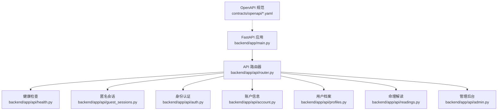
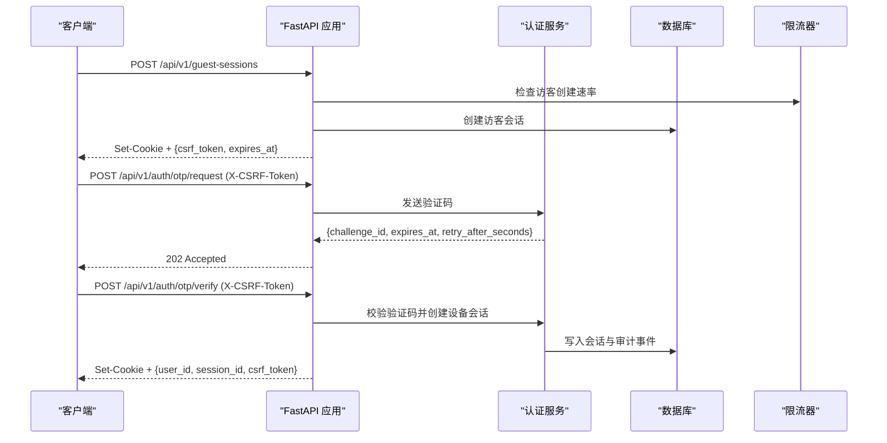
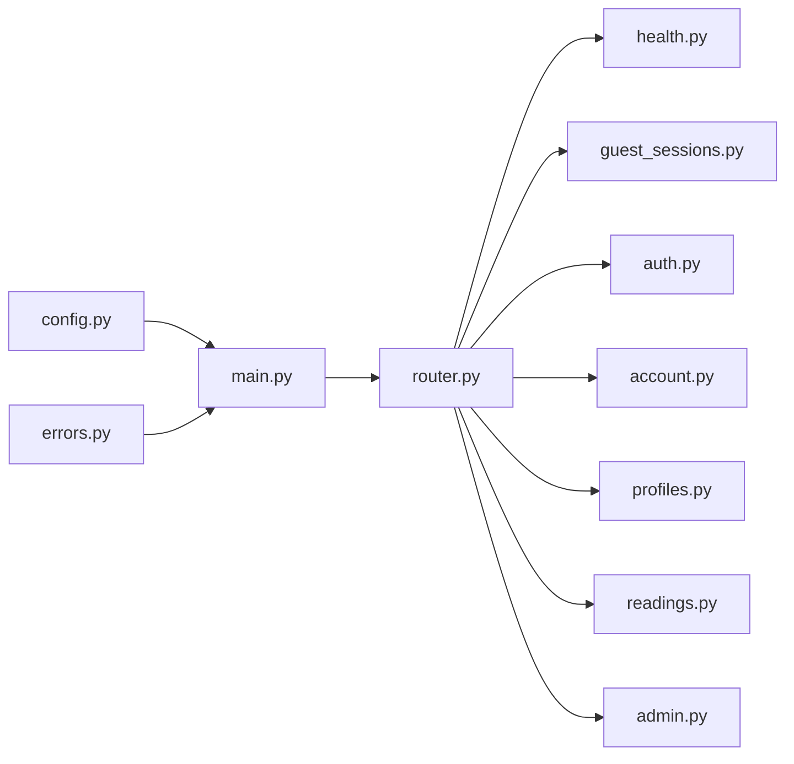

# API 参考

<cite>
**本文引用的文件**
- [backend/app/main.py](file://backend/app/main.py)
- [backend/app/api/router.py](file://backend/app/api/router.py)
- [backend/app/api/health.py](file://backend/app/api/health.py)
- [backend/app/api/guest_sessions.py](file://backend/app/api/guest_sessions.py)
- [backend/app/api/auth.py](file://backend/app/api/auth.py)
- [backend/app/api/account.py](file://backend/app/api/account.py)
- [backend/app/api/profiles.py](file://backend/app/api/profiles.py)
- [backend/app/api/readings.py](file://backend/app/api/readings.py)
- [backend/app/api/admin.py](file://backend/app/api/admin.py)
- [contracts/openapi/v1.yaml](file://contracts/openapi/v1.yaml)
- [contracts/openapi/admin-v1.yaml](file://contracts/openapi/admin-v1.yaml)
- [backend/app/config.py](file://backend/app/config.py)
- [backend/app/api/errors.py](file://backend/app/api/errors.py)
</cite>

## 目录
1. [简介](#简介)
2. [项目结构](#项目结构)
3. [核心组件](#核心组件)
4. [架构总览](#架构总览)
5. [详细接口说明](#详细接口说明)
6. [依赖关系分析](#依赖关系分析)
7. [性能与限流](#性能与限流)
8. [故障排查指南](#故障排查指南)
9. [结论](#结论)
10. [附录：客户端集成与最佳实践](#附录客户端集成与最佳实践)

## 简介
本参考文档基于 OpenAPI 规范与后端实现，系统化记录 FateRadar 命理解读系统的 RESTful API。内容覆盖健康检查、匿名会话、OTP 认证与会话管理、用户档案（版本化）、命理解读全生命周期（创建、状态查询、结果获取、验证反馈、后续追问），以及管理后台专用接口。文档同时给出错误码、速率限制策略、版本管理与兼容性说明，并提供客户端集成建议。

## 项目结构
后端采用 FastAPI 模块化路由组织，统一在 /api/v1 下暴露公共 API，管理后台使用独立路由前缀 /api/v1/admin。OpenAPI 规范位于 contracts/openapi 目录，分别定义用户端与管理端契约。

**图表来源**
- [backend/app/main.py:50-140](file://backend/app/main.py#L50-L140)
- [backend/app/api/router.py:12-21](file://backend/app/api/router.py#L12-L21)

**章节来源**
- [backend/app/main.py:50-140](file://backend/app/main.py#L50-L140)
- [backend/app/api/router.py:12-21](file://backend/app/api/router.py#L12-L21)

## 核心组件
- 健康检查：/api/v1/health/live 与 /api/v1/health/ready，用于进程存活与依赖就绪探测。
- 匿名会话：/api/v1/guest-sessions，创建短期浏览器会话并下发 CSRF Token。
- 身份认证：/api/v1/auth/otp/request、/api/v1/auth/otp/verify、/api/v1/auth/logout、/api/v1/account。
- 用户档案：/api/v1/profiles/drafts、/api/v1/profiles/drafts/{draft_id}/confirm、/api/v1/profiles。
- 命理解读：/api/v1/readings/*，涵盖预览、今日/周运势、六爻、列表、状态、输入补充、结果、验证、后续追问。
- 管理后台：/api/v1/admin/*，包含登录、登出、当前管理员信息与概览。

**章节来源**
- [backend/app/api/health.py:11-36](file://backend/app/api/health.py#L11-L36)
- [backend/app/api/guest_sessions.py:16-52](file://backend/app/api/guest_sessions.py#L16-L52)
- [backend/app/api/auth.py:44-160](file://backend/app/api/auth.py#L44-L160)
- [backend/app/api/account.py:13-28](file://backend/app/api/account.py#L13-L28)
- [backend/app/api/profiles.py:43-110](file://backend/app/api/profiles.py#L43-L110)
- [backend/app/api/readings.py:87-399](file://backend/app/api/readings.py#L87-L399)
- [backend/app/api/admin.py:103-199](file://backend/app/api/admin.py#L103-L199)

## 架构总览
系统通过 FastAPI 应用启动时注入配置、数据库连接、OTP 存储与限流器，并注册各模块路由。所有写操作均受速率限制保护；敏感响应标记为私有；认证与会话通过 Cookie 与 CSRF 双提交保障安全。

**图表来源**
- [backend/app/api/guest_sessions.py:16-52](file://backend/app/api/guest_sessions.py#L16-L52)
- [backend/app/api/auth.py:44-138](file://backend/app/api/auth.py#L44-L138)
- [backend/app/main.py:61-88](file://backend/app/main.py#L61-L88)

## 详细接口说明

### 健康检查
- GET /api/v1/health/live
  - 用途：确认 API 进程可服务请求
  - 成功响应：{"status":"ok","service":"api"}
- GET /api/v1/health/ready
  - 用途：确认依赖（如数据库）可达
  - 成功响应：{"status":"ok","service":"database"}
  - 失败响应：503 ServiceUnavailable

**章节来源**
- [backend/app/api/health.py:11-36](file://backend/app/api/health.py#L11-L36)
- [contracts/openapi/v1.yaml:15-40](file://contracts/openapi/v1.yaml#L15-L40)

### 匿名会话
- POST /api/v1/guest-sessions
  - 用途：创建或轮换短期匿名浏览器会话
  - 成功响应：201 Created，Set-Cookie，返回 {status:"active", expires_at, csrf_token}
  - 速率限制：按网络地址限制创建频率

**章节来源**
- [backend/app/api/guest_sessions.py:16-52](file://backend/app/api/guest_sessions.py#L16-L52)
- [contracts/openapi/v1.yaml:41-56](file://contracts/openapi/v1.yaml#L41-L56)

### 身份认证与会话管理
- POST /api/v1/auth/otp/request
  - 用途：通过配置的通道（手机/邮箱）申请一次性验证码
  - 请求头：X-CSRF-Token（必填）
  - 成功响应：202 Accepted，{challenge_id, expires_at, retry_after_seconds, development_code?}
  - 错误：400/403/429/503
- POST /api/v1/auth/otp/verify
  - 用途：校验验证码并创建可撤销的设备会话
  - 请求头：X-CSRF-Token（必填）
  - 成功响应：200 OK，Set-Cookie，{user_id, session_id, expires_at, csrf_token}
  - 错误：400/403/429
- POST /api/v1/auth/logout
  - 用途：撤销当前设备会话
  - 安全：需要设备会话 Cookie
  - 成功响应：204 No Content
- GET /api/v1/account
  - 用途：读取当前内部用户及已验证的登录身份
  - 安全：需要设备会话 Cookie
  - 成功响应：{user_id, identities[]}

**章节来源**
- [backend/app/api/auth.py:44-160](file://backend/app/api/auth.py#L44-L160)
- [backend/app/api/account.py:13-28](file://backend/app/api/account.py#L13-L28)
- [contracts/openapi/v1.yaml:57-144](file://contracts/openapi/v1.yaml#L57-L144)

### 用户档案管理（版本化与历史）
- POST /api/v1/profiles/drafts
  - 用途：创建可确认一次的用户档案草稿
  - 请求头：X-CSRF-Token（必填）
  - 成功响应：201 Created，{draft_id, status:"draft"}
  - 速率限制：按所有者限制写入频率
- POST /api/v1/profiles/drafts/{draft_id}/confirm
  - 用途：将草稿确认为首个不可变加密的档案版本
  - 路径参数：draft_id（UUID）
  - 成功响应：201 Created，返回档案摘要（含 profile_version_id、version、created_at）
  - 错误：400/403/404/409/429
- GET /api/v1/profiles
  - 用途：列出当前会话拥有的不可变档案版本（仅公开元数据）
  - 成功响应：{profiles[]}

注意：
- 版本控制：每次确认生成新的不可变版本，版本号递增。
- 历史查询：通过列表接口获取该用户的所有版本摘要；具体敏感载荷保持加密。

**章节来源**
- [backend/app/api/profiles.py:43-110](file://backend/app/api/profiles.py#L43-L110)
- [contracts/openapi/v1.yaml:145-220](file://contracts/openapi/v1.yaml#L145-L220)

### 命理解读核心 API
- 创建解读任务（均支持幂等键 Idempotency-Key）
  - POST /api/v1/readings/preview
    - 用途：创建八字命盘预览解读
    - 成功响应：201 Created 或 200 OK（幂等重放）
  - POST /api/v1/readings/today
    - 用途：创建当日运势解读
  - POST /api/v1/readings/week
    - 用途：创建七日运势解读
  - POST /api/v1/readings/liuyao
    - 用途：从卦象创建六爻解读
- 查询与交互
  - GET /api/v1/readings
    - 用途：列出当前会话最新的解读版本摘要
  - GET /api/v1/readings/{reading_version_id}
    - 用途：轮询指定解读版本的状态
  - POST /api/v1/readings/{reading_version_id}/input
    - 用途：为等待输入的解读补充值并重入队列
  - GET /api/v1/readings/{reading_version_id}/result
    - 用途：获取公开事实、证据、限制与“接受副本”
  - POST /api/v1/readings/{reading_version_id}/verification
    - 用途：保存用户对结果的验证反馈
  - POST /api/v1/readings/{reading_version_id}/follow-up
    - 用途：基于上一答案创建后续解读版本

状态枚举（节选）：input_ready、waiting_input、prepared、completing、accepted、delayed、runtime_unknown、terminal_stopped。

错误映射（节选）：
- 400 无效请求/输入
- 403 CSRF/权限失败
- 404 资源不存在或无所有权
- 409 冲突（重复排队、非等待输入、幂等键冲突）
- 429 速率限制
- 503 运行时不可用

**章节来源**
- [backend/app/api/readings.py:87-399](file://backend/app/api/readings.py#L87-L399)
- [contracts/openapi/v1.yaml:221-549](file://contracts/openapi/v1.yaml#L221-L549)

### 管理后台专用 API
- POST /api/v1/admin/auth/login
  - 用途：以邮箱+密码创建员工会话
  - 成功响应：200 OK，Set-Cookie，{staff_id, session_id, role, display_name, expires_at, csrf_token}
  - 错误：401/429
- POST /api/v1/admin/auth/logout
  - 用途：撤销当前员工会话并清理 Cookie
  - 成功响应：204 No Content
- GET /api/v1/admin/me
  - 用途：返回当前认证的员工主体
- GET /api/v1/admin/overview
  - 用途：运维看板占位（KPI/队列计数）

注意：
- 管理端使用独立的 Cookie 名称（mingli_admin_session、mingli_admin_csrf）。
- 登录接口具备速率限制，防止暴力尝试。

**章节来源**
- [backend/app/api/admin.py:103-199](file://backend/app/api/admin.py#L103-L199)
- [contracts/openapi/admin-v1.yaml:15-82](file://contracts/openapi/admin-v1.yaml#L15-L82)

## 依赖关系分析
- 路由装配：主应用加载健康、访客、认证、账户、档案、解读、管理路由。
- 安全与限流：
  - 全局异常处理器统一输出 Problem 格式。
  - 各写接口通过 WindowRateLimiter 进行速率限制。
  - 敏感响应通过 mark_private 标记。
- 配置与安全约束：
  - Settings 强制生产环境安全策略（Cookie Secure、禁用 Fake OTP/Runtime/Model、固定路径与白名单等）。
  - 身份哈希与内容加密密钥在生产环境必须注入且不得复用。

**图表来源**
- [backend/app/main.py:50-140](file://backend/app/main.py#L50-L140)
- [backend/app/api/router.py:12-21](file://backend/app/api/router.py#L12-L21)
- [backend/app/config.py:62-335](file://backend/app/config.py#L62-L335)
- [backend/app/api/errors.py:1-17](file://backend/app/api/errors.py#L1-L17)

**章节来源**
- [backend/app/main.py:50-140](file://backend/app/main.py#L50-L140)
- [backend/app/config.py:62-335](file://backend/app/config.py#L62-L335)

## 性能与限流
- 访客会话创建：按网络地址限制频率。
- 认证 OTP：
  - 请求与验证均有限制，避免滥用。
  - 支持冷却时间与最大尝试次数。
- 档案写入：按所有者限制频率。
- 解读写入：按所有者限制频率，避免频繁触发长耗时任务。
- 管理登录：按邮箱限制频率。

这些限制由 WindowRateLimiter 实现，并在应用生命周期结束时清理。

**章节来源**
- [backend/app/main.py:73-88](file://backend/app/main.py#L73-L88)
- [backend/app/api/guest_sessions.py:32-36](file://backend/app/api/guest_sessions.py#L32-L36)
- [backend/app/api/auth.py:69-77](file://backend/app/api/auth.py#L69-L77)
- [backend/app/api/profiles.py:35-40](file://backend/app/api/profiles.py#L35-L40)
- [backend/app/api/readings.py:49-54](file://backend/app/api/readings.py#L49-L54)
- [backend/app/api/admin.py:56-65](file://backend/app/api/admin.py#L56-L65)

## 故障排查指南
- 常见错误类型
  - 400 Invalid request：请求体或参数不合法。
  - 401 Unauthorized：缺少有效设备会话或管理员会话。
  - 403 Forbidden：CSRF 校验失败或权限不足。
  - 404 Not Found：资源不存在或无所有权。
  - 409 Conflict：状态不允许转换（如重复排队、非等待输入、幂等键冲突）。
  - 429 Too Many Requests：达到速率限制，关注 Retry-After。
  - 503 Service Unavailable：依赖不可用（如 OTP 投递、运行时）。
- 问题对象格式
  - 所有错误响应遵循 application/problem+json，包含 type、title、status、detail、request_id。
- 调试建议
  - 优先检查 X-CSRF-Token 是否正确携带并与 Cookie 匹配。
  - 对于 OTP 流程，留意 challenge_id 有效期与重试间隔。
  - 解读任务若长时间处于 waiting_input，请调用 input 接口补充必要字段。

**章节来源**
- [backend/app/api/errors.py:1-17](file://backend/app/api/errors.py#L1-L17)
- [backend/app/main.py:115-136](file://backend/app/main.py#L115-L136)
- [contracts/openapi/v1.yaml:1204-1268](file://contracts/openapi/v1.yaml#L1204-L1268)

## 结论
本 API 体系围绕“安全认证—档案版本化—解读工作流—管理后台”构建，提供健壮的速率限制、一致的错误模型与清晰的 OpenAPI 契约。客户端应严格遵循 CSRF 与幂等键要求，合理轮询解读状态，并在遇到 429/503 时实施退避重试。

## 附录：客户端集成与最佳实践
- 会话与认证
  - 先创建访客会话，再发起 OTP 请求与验证；验证成功后维护设备会话 Cookie。
  - 所有写操作需携带 X-CSRF-Token，其值来自访客或设备会话响应中的 csrf_token。
- 幂等性
  - 对解读创建与后续追问接口，使用稳定的 Idempotency-Key 以避免重复提交导致多份任务。
- 轮询与超时
  - 解读状态可能经历 waiting_input→prepared→completing→accepted 等阶段；建议指数退避轮询。
  - 遇到 503 时根据 Retry-After 延迟重试。
- 隐私与缓存
  - 标注私有的响应不应被缓存；前端应避免将敏感字段持久化到本地存储。
- 版本与兼容
  - 当前公开 API 版本为 v1；向后兼容变更会尽量保持契约稳定。新增字段通常为可选，删除字段需谨慎评估影响。
- 管理后台
  - 使用独立的管理员会话 Cookie；登录接口具备速率限制，避免频繁尝试。

[本节为通用指导，不直接引用具体代码文件]