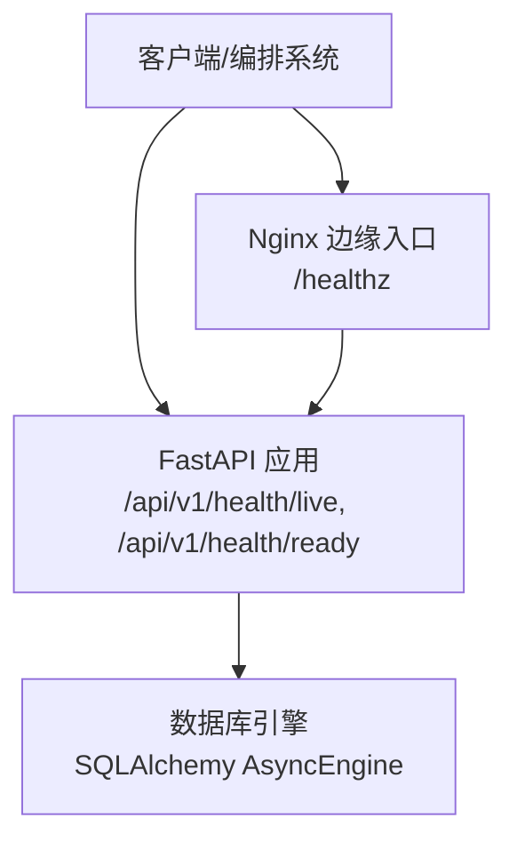
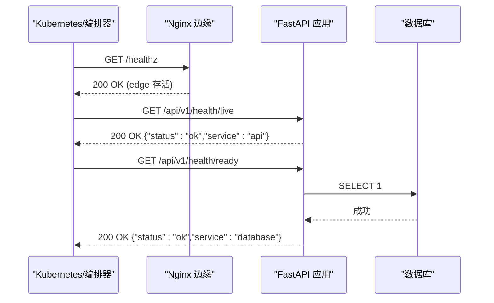
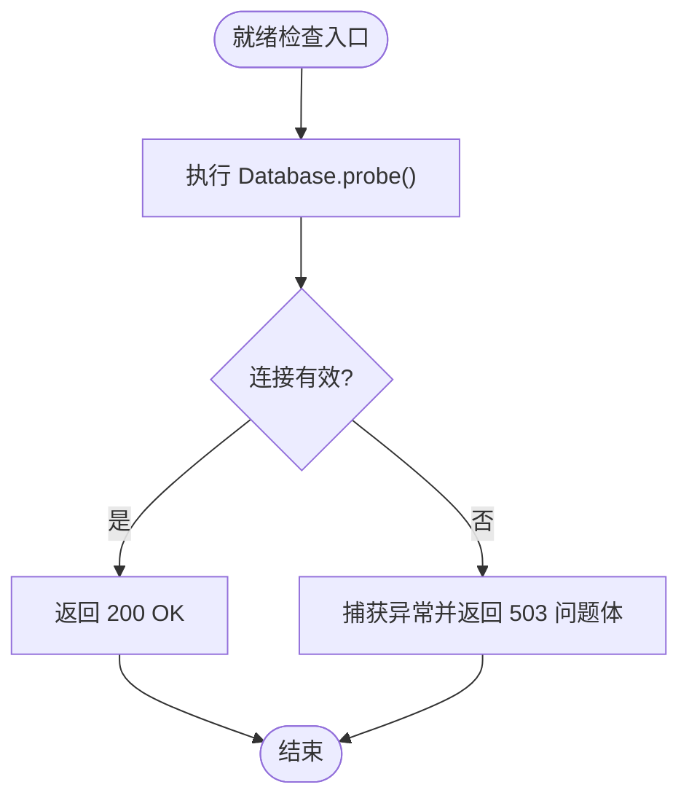
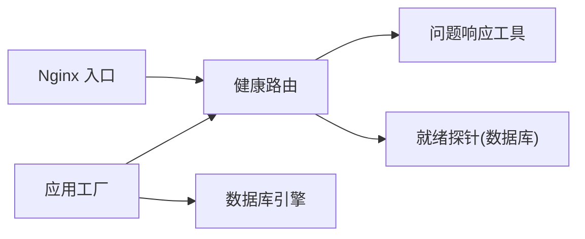

# 健康检查 API

<cite>
**本文引用的文件**
- [backend/app/api/health.py](file://backend/app/api/health.py)
- [backend/app/database.py](file://backend/app/database.py)
- [backend/app/main.py](file://backend/app/main.py)
- [backend/app/api/router.py](file://backend/app/api/router.py)
- [backend/app/api/problems.py](file://backend/app/api/problems.py)
- [contracts/schemas/health.schema.json](file://contracts/schemas/health.schema.json)
- [backend/tests/test_health.py](file://backend/tests/test_health.py)
- [infra/nginx/app.conf](file://infra/nginx/app.conf)
- [infra/docker/backend.Dockerfile](file://infra/docker/backend.Dockerfile)
- [infra/compose.local.yml](file://infra/compose.local.yml)
- [infra/nginx/fateradar-tls.conf](file://infra/nginx/fateradar-tls.conf)
- [infra/TEST_SERVER_RUNBOOK.md](file://infra/TEST_SERVER_RUNBOOK.md)
</cite>

## 目录
1. [简介](#简介)
2. [项目结构](#项目结构)
3. [核心组件](#核心组件)
4. [架构总览](#架构总览)
5. [详细组件分析](#详细组件分析)
6. [依赖关系分析](#依赖关系分析)
7. [性能与可用性考量](#性能与可用性考量)
8. [故障排查指南](#故障排查指南)
9. [结论](#结论)
10. [附录：配置与最佳实践](#附录配置与最佳实践)

## 简介
本文件面向生产运维、SRE 与后端开发者，系统化说明本项目中“存活检查（Liveness）”和“就绪检查（Readiness）”的健康检查 API。内容涵盖接口定义、响应格式、状态码、数据库与依赖检测机制、负载均衡与健康探针集成方式、监控告警对接建议，以及容器化部署中的健康检查最佳实践。

## 项目结构
健康检查相关代码位于后端 FastAPI 应用中，通过统一路由注册到 /api/v1 前缀下；数据库连接探测由数据库模块提供；Nginx 作为边缘入口提供统一的 /healthz 探针并反向代理 API；Dockerfile 暴露服务端口以便编排系统接入探针。

图表来源
- [infra/nginx/app.conf:10-32](file://infra/nginx/app.conf#L10-L32)
- [backend/app/api/router.py:12-20](file://backend/app/api/router.py#L12-L20)
- [backend/app/database.py:12-26](file://backend/app/database.py#L12-L26)

章节来源
- [backend/app/api/router.py:12-20](file://backend/app/api/router.py#L12-L20)
- [infra/nginx/app.conf:10-32](file://infra/nginx/app.conf#L10-L32)
- [infra/docker/backend.Dockerfile:21-22](file://infra/docker/backend.Dockerfile#L21-L22)

## 核心组件
- 健康检查路由：提供 /api/v1/health/live 与 /api/v1/health/ready 两个端点。
- 就绪探针注入：应用启动时将数据库探针函数注入健康路由，用于就绪检查。
- 数据库探针：执行轻量查询以验证数据库连通性。
- 问题响应：统一的问题体格式，包含类型、标题、状态码与请求 ID。
- 契约 Schema：健康响应 JSON Schema，约束字段与取值范围。

章节来源
- [backend/app/api/health.py:11-36](file://backend/app/api/health.py#L11-L36)
- [backend/app/database.py:23-26](file://backend/app/database.py#L23-L26)
- [backend/app/api/problems.py:5-27](file://backend/app/api/problems.py#L5-L27)
- [contracts/schemas/health.schema.json:1-12](file://contracts/schemas/health.schema.json#L1-L12)

## 架构总览
健康检查在两层进行：
- 边缘层：Nginx 提供 /healthz，快速判断边缘进程是否存活。
- 应用层：FastAPI 提供 /api/v1/health/live 与 /api/v1/health/ready，分别表示进程存活与服务就绪。

图表来源
- [infra/nginx/app.conf:10-14](file://infra/nginx/app.conf#L10-L14)
- [backend/app/api/health.py:14-34](file://backend/app/api/health.py#L14-L34)
- [backend/app/database.py:23-26](file://backend/app/database.py#L23-L26)

## 详细组件分析

### 存活检查（Liveness）
- 路径：GET /api/v1/health/live
- 行为：仅返回进程存活信号，不访问任何外部依赖。
- 响应：200 OK，JSON 体包含 status 与 service 字段，service 为 "api"。
- 用途：供编排系统判定进程是否可回收或重启。

章节来源
- [backend/app/api/health.py:14-16](file://backend/app/api/health.py#L14-L16)
- [backend/tests/test_health.py:17-25](file://backend/tests/test_health.py#L17-L25)

### 就绪检查（Readiness）
- 路径：GET /api/v1/health/ready
- 行为：调用注入的就绪探针（默认是数据库探针），若异常则返回 503 及问题体。
- 响应：
  - 成功：200 OK，{"status":"ok","service":"database"}
  - 失败：503 Service unavailable，application/problem+json 格式，包含 type、title、status、request_id。
- 用途：控制流量进入，确保依赖可用后再接收请求。

章节来源
- [backend/app/api/health.py:18-34](file://backend/app/api/health.py#L18-L34)
- [backend/app/api/problems.py:5-27](file://backend/app/api/problems.py#L5-L27)
- [backend/tests/test_health.py:43-72](file://backend/tests/test_health.py#L43-L72)

### 数据库连接状态检测
- 实现：Database.probe 使用 SQLAlchemy 异步引擎执行 SELECT 1，配合 pool_pre_ping 保证连接有效性。
- 注入：应用创建时，将 Database.probe 作为就绪探针注入健康路由。
- 清理：应用关闭时释放数据库资源。

图表来源
- [backend/app/database.py:12-26](file://backend/app/database.py#L12-L26)
- [backend/app/main.py:138-141](file://backend/app/main.py#L138-L141)
- [backend/app/api/health.py:24-34](file://backend/app/api/health.py#L24-L34)

章节来源
- [backend/app/database.py:12-26](file://backend/app/database.py#L12-L26)
- [backend/app/main.py:30-59](file://backend/app/main.py#L30-L59)
- [backend/app/main.py:138-141](file://backend/app/main.py#L138-L141)

### 依赖服务可用性扩展
- 当前就绪探针默认检测数据库。如需扩展到其他依赖（缓存、消息队列、第三方 API），可在应用工厂中替换 readiness_probe 为组合探针，依次检测各依赖，任一失败即返回 503。
- 建议在探针中避免敏感信息泄露，错误信息应做脱敏处理。

章节来源
- [backend/app/main.py:30-59](file://backend/app/main.py#L30-L59)
- [backend/app/api/health.py:24-34](file://backend/app/api/health.py#L24-L34)
- [backend/tests/test_health.py:57-72](file://backend/tests/test_health.py#L57-L72)

### 负载均衡与健康探针
- Nginx 边缘提供 /healthz，便于编排系统对边缘节点进行快速存活探测。
- API 健康端点位于 /api/v1/health/*，Nginx 将其反向代理至后端服务。
- 在生产环境中，可将 /healthz 与 /api/v1/health/ready 同时纳入负载均衡器的健康检查策略，前者用于边缘存活，后者用于业务就绪。

章节来源
- [infra/nginx/app.conf:10-32](file://infra/nginx/app.conf#L10-L32)
- [infra/nginx/fateradar-tls.conf:113-124](file://infra/nginx/fateradar-tls.conf#L113-L124)
- [infra/TEST_SERVER_RUNBOOK.md:203-242](file://infra/TEST_SERVER_RUNBOOK.md#L203-L242)

### 响应格式与状态码
- 存活检查：200 OK，JSON 体包含 status="ok"，service="api"。
- 就绪检查：
  - 200 OK：JSON 体包含 status="ok"，service="database"。
  - 503 Service Unavailable：application/problem+json 格式，包含 type、title、status、request_id。
- 请求 ID：所有响应均携带 x-request-id，便于链路追踪。

章节来源
- [backend/app/api/health.py:14-34](file://backend/app/api/health.py#L14-L34)
- [backend/app/api/problems.py:5-27](file://backend/app/api/problems.py#L5-L27)
- [backend/tests/test_health.py:28-40](file://backend/tests/test_health.py#L28-L40)
- [contracts/schemas/health.schema.json:1-12](file://contracts/schemas/health.schema.json#L1-L12)

## 依赖关系分析
- 健康路由依赖 FastAPI 路由与问题响应工具。
- 就绪检查依赖注入的 readiness_probe，默认实现为数据库探针。
- 应用工厂负责装配数据库实例、日志、限流等，并将数据库探针注入健康路由。
- Nginx 作为入口，提供 /healthz 并转发 /api/ 到后端。

图表来源
- [backend/app/api/health.py:11-36](file://backend/app/api/health.py#L11-L36)
- [backend/app/main.py:138-141](file://backend/app/main.py#L138-L141)
- [backend/app/database.py:12-26](file://backend/app/database.py#L12-L26)
- [infra/nginx/app.conf:16-32](file://infra/nginx/app.conf#L16-L32)

章节来源
- [backend/app/api/router.py:12-20](file://backend/app/api/router.py#L12-L20)
- [backend/app/main.py:30-59](file://backend/app/main.py#L30-L59)
- [backend/app/api/health.py:11-36](file://backend/app/api/health.py#L11-L36)

## 性能与可用性考量
- 存活检查应避免 I/O，保持极低开销，确保快速回收与重启。
- 就绪检查应轻量且幂等，数据库探针使用 SELECT 1，避免复杂查询。
- 探针失败时应立即返回 503，防止流量进入不可用实例。
- 使用连接池预检（pool_pre_ping）减少连接失效带来的延迟。
- 在大规模集群中，合理设置探针间隔与阈值，避免频繁探测造成抖动。

[本节为通用指导，无需特定文件引用]

## 故障排查指南
- 就绪检查返回 503：
  - 检查数据库连接字符串与网络可达性。
  - 查看问题体中的 request_id 与 type，定位具体依赖。
  - 确认探针实现未泄露敏感信息（测试已覆盖）。
- 存活检查正常但业务不可用：
  - 检查就绪检查是否通过。
  - 检查上游依赖（缓存、消息队列、第三方 API）是否可用。
- 边缘健康检查：
  - 使用 /healthz 快速判断边缘节点是否存活。
  - 结合 /api/v1/health/ready 判断业务就绪。

章节来源
- [backend/tests/test_health.py:57-72](file://backend/tests/test_health.py#L57-L72)
- [infra/nginx/app.conf:10-14](file://infra/nginx/app.conf#L10-L14)
- [infra/TEST_SERVER_RUNBOOK.md:203-242](file://infra/TEST_SERVER_RUNBOOK.md#L203-L242)

## 结论
本项目实现了清晰的存活与就绪检查分离：存活检查用于进程生命周期管理，就绪检查用于依赖可用性控制。通过 Nginx 边缘探针与 FastAPI 应用探针的组合，可构建稳健的负载均衡与健康治理体系。建议在生产环境中将两类探针纳入编排系统的健康策略，并结合监控与告警系统进行持续观测。

[本节为总结，无需特定文件引用]

## 附录：配置与最佳实践

### 容器化部署健康检查
- 暴露端口：Dockerfile 暴露 8000 端口，供编排系统访问。
- 探针建议：
  - Liveness：HTTP GET /api/v1/health/live，超时短、频率高。
  - Readiness：HTTP GET /api/v1/health/ready，超时适中、频率适中。
  - Edge：HTTP GET /healthz，用于边缘节点存活探测。

章节来源
- [infra/docker/backend.Dockerfile:21-22](file://infra/docker/backend.Dockerfile#L21-L22)
- [infra/nginx/app.conf:10-32](file://infra/nginx/app.conf#L10-L32)

### 负载均衡与健康探针配置示例
- Nginx 边缘：
  - /healthz：直接返回 200，用于边缘存活。
  - /api/：反向代理至后端，透传 X-Request-ID 与安全头。
- 编排系统（如 Kubernetes）：
  - LivenessProbe：GET /api/v1/health/live
  - ReadinessProbe：GET /api/v1/health/ready
  - StartupProbe：可选，用于慢启动场景

章节来源
- [infra/nginx/app.conf:10-32](file://infra/nginx/app.conf#L10-L32)
- [infra/compose.local.yml:81-90](file://infra/compose.local.yml#L81-L90)

### 监控与告警集成建议
- 采集指标：
  - 健康检查成功率、延迟分布、503 比例。
  - 数据库探针耗时与失败次数。
- 告警规则：
  - 连续多次就绪检查失败触发告警。
  - 边缘 /healthz 失败触发边缘节点告警。
- 日志关联：
  - 使用 x-request-id 关联健康检查与业务请求日志。
  - 问题体中的 type 与 title 可用于分类告警。

[本节为通用指导，无需特定文件引用]

### 安全与合规
- 健康检查不应暴露内部细节或敏感信息。
- 问题体遵循 RFC 7807 风格，便于标准化消费。
- 在边缘层屏蔽健康检查日志以减少噪声。

章节来源
- [backend/app/api/problems.py:5-27](file://backend/app/api/problems.py#L5-L27)
- [infra/nginx/app.conf:10-14](file://infra/nginx/app.conf#L10-L14)