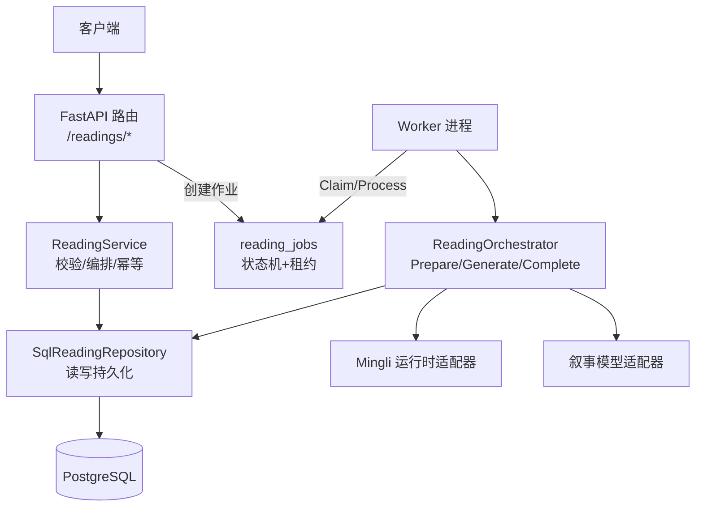
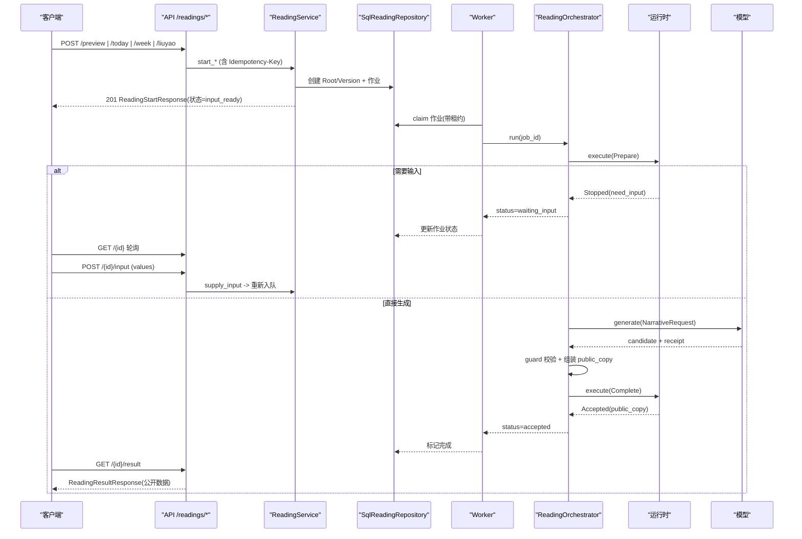
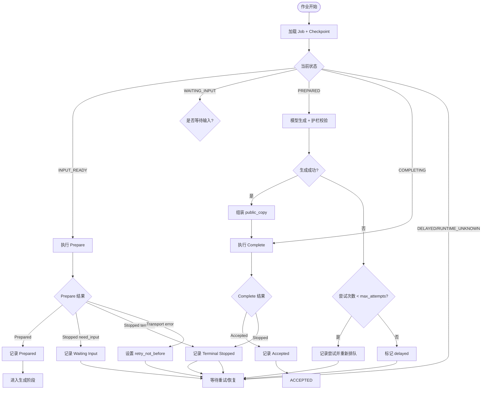
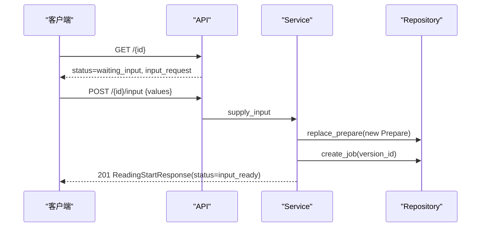
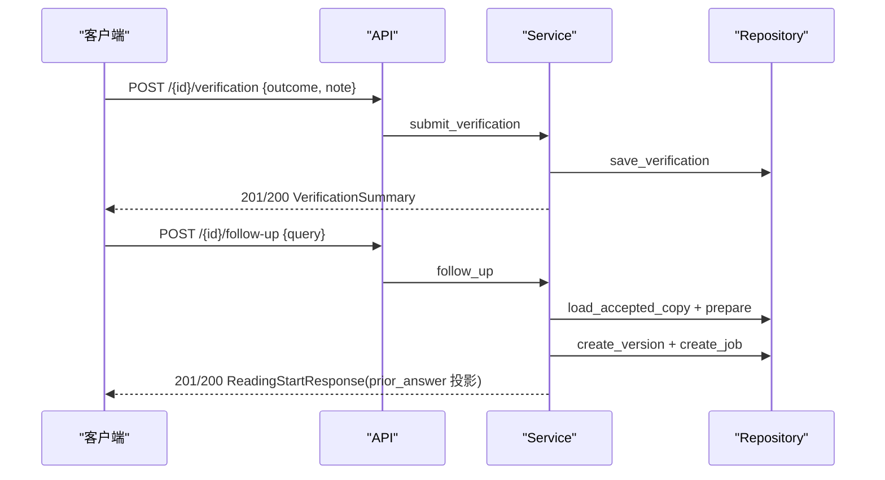
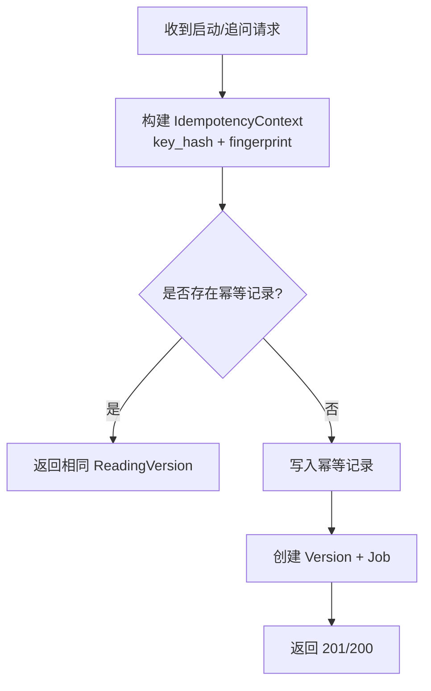
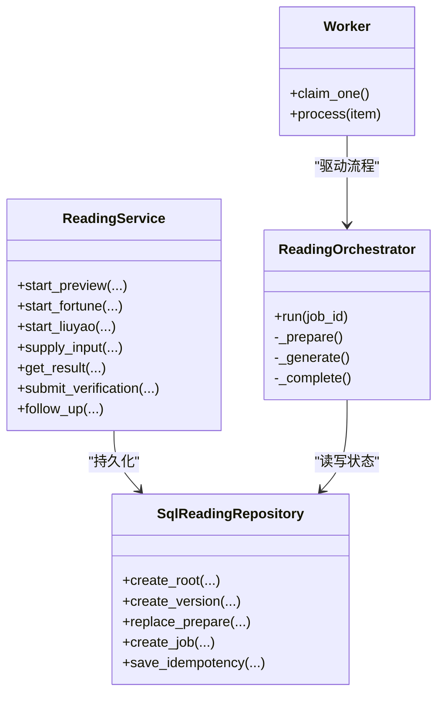

# 命理解读 API

<cite>
**本文引用的文件**
- [backend/app/api/readings.py](file://backend/app/api/readings.py)
- [backend/app/readings/service.py](file://backend/app/readings/service.py)
- [backend/app/readings/orchestrator.py](file://backend/app/readings/orchestrator.py)
- [backend/worker/readings.py](file://backend/worker/readings.py)
- [backend/app/readings/repository.py](file://backend/app/readings/repository.py)
- [backend/app/readings/models.py](file://backend/app/readings/models.py)
- [backend/app/readings/status.py](file://backend/app/readings/status.py)
- [backend/app/readings/api_schemas.py](file://backend/app/readings/api_schemas.py)
- [contracts/openapi/v1.yaml](file://contracts/openapi/v1.yaml)
- [contracts/schemas/mingli-result-v2.schema.json](file://contracts/schemas/mingli-result-v2.schema.json)
</cite>

## 目录
1. [简介](#简介)
2. [项目结构](#项目结构)
3. [核心组件](#核心组件)
4. [架构总览](#架构总览)
5. [详细组件分析](#详细组件分析)
6. [依赖关系分析](#依赖关系分析)
7. [性能与限制](#性能与限制)
8. [故障排查指南](#故障排查指南)
9. [结论](#结论)
10. [附录：客户端集成最佳实践](#附录客户端集成最佳实践)

## 简介
本文件面向需要接入“八字预览、每日运势、一周运势、六爻占卜”解读能力的客户端开发者，提供完整的接口说明、异步任务处理机制、幂等性键使用、输入补充与结果验证、后续追问工作流、公开数据与隐私数据分离策略、配额与限制检查、错误恢复策略以及端到端示例。

## 项目结构
后端采用 FastAPI 暴露 REST API，服务层负责业务编排，数据库持久化读取版本、作业队列与幂等键，独立 Worker 进程消费作业并驱动运行时与模型生成，最终产出可被客户端轮询的公开结果。

图表来源
- [backend/app/api/readings.py:87-399](file://backend/app/api/readings.py#L87-L399)
- [backend/app/readings/service.py:117-513](file://backend/app/readings/service.py#L117-L513)
- [backend/app/readings/orchestrator.py:178-450](file://backend/app/readings/orchestrator.py#L178-L450)
- [backend/worker/readings.py:108-286](file://backend/worker/readings.py#L108-L286)
- [backend/app/readings/repository.py:51-200](file://backend/app/readings/repository.py#L51-L200)
- [backend/app/readings/models.py:247-337](file://backend/app/readings/models.py#L247-L337)

章节来源
- [backend/app/api/readings.py:87-399](file://backend/app/api/readings.py#L87-L399)
- [backend/app/readings/service.py:117-513](file://backend/app/readings/service.py#L117-L513)
- [backend/app/readings/orchestrator.py:178-450](file://backend/app/readings/orchestrator.py#L178-L450)
- [backend/worker/readings.py:108-286](file://backend/worker/readings.py#L108-L286)
- [backend/app/readings/repository.py:51-200](file://backend/app/readings/repository.py#L51-L200)
- [backend/app/readings/models.py:247-337](file://backend/app/readings/models.py#L247-L337)

## 核心组件
- API 路由层：定义八字预览、每日/周运势、六爻启动、列表、查询、输入补充、结果获取、验证提交、后续追问等端点。
- 服务层 ReadingService：参数校验、能力策略、请求编译、幂等性上下文构建与回放、创建读取版本与作业、输入值校验与回填、结果聚合。
- 编排器 ReadingOrchestrator：驱动 Prepare/Generate/Complete 三阶段，处理重试、延迟、终止与完成一致性。
- Worker：基于数据库作业表进行 Claim/Process，带租约防抖与过期恢复。
- 仓库 SqlReadingRepository：加密存储 Prepare/结果/候选，维护版本、作业、幂等键、验证记录。
- 数据模型：ReadingRoot/Version、FactBrief、GenerationAttempt、AcceptedCopy、ReadingJobRecord、ReadingIdempotencyKey、ReadingVerification。

章节来源
- [backend/app/api/readings.py:87-399](file://backend/app/api/readings.py#L87-L399)
- [backend/app/readings/service.py:117-513](file://backend/app/readings/service.py#L117-L513)
- [backend/app/readings/orchestrator.py:178-450](file://backend/app/readings/orchestrator.py#L178-L450)
- [backend/worker/readings.py:108-286](file://backend/worker/readings.py#L108-L286)
- [backend/app/readings/repository.py:51-200](file://backend/app/readings/repository.py#L51-L200)
- [backend/app/readings/models.py:28-337](file://backend/app/readings/models.py#L28-L337)

## 架构总览
系统通过 API 接收解读启动请求，服务层完成鉴权、限流、幂等性检查与请求编译后，写入读取版本并创建作业；Worker 从作业表中领取任务，调用运行时执行 Prepare，若需输入则返回 WAITING_INPUT；否则进入模型生成阶段，经过护栏校验与公开副本组装后进入 Complete 阶段，最终得到 ACCEPTED 结果。客户端通过轮询读取版本状态与结果接口获取进度与结果。

图表来源
- [backend/app/api/readings.py:87-399](file://backend/app/api/readings.py#L87-L399)
- [backend/app/readings/service.py:129-513](file://backend/app/readings/service.py#L129-L513)
- [backend/app/readings/orchestrator.py:212-450](file://backend/app/readings/orchestrator.py#L212-L450)
- [backend/worker/readings.py:121-231](file://backend/worker/readings.py#L121-L231)
- [backend/app/readings/repository.py:120-200](file://backend/app/readings/repository.py#L120-L200)

## 详细组件分析

### 启动接口（八字预览、每日/周运势、六爻）
- 八字预览：POST /api/v1/readings/preview
- 每日运势：POST /api/v1/readings/today
- 一周运势：POST /api/v1/readings/week
- 六爻占卜：POST /api/v1/readings/liuyao

所有启动接口均支持可选的 Idempotency-Key 请求头，用于幂等重复请求处理。成功时返回 201 或 200（幂等回放），响应体为 ReadingStartResponse，包含 reading_version_id、status、horizon、dimension_ids、input_request 等字段。

章节来源
- [contracts/openapi/v1.yaml:221-366](file://contracts/openapi/v1.yaml#L221-L366)
- [backend/app/api/readings.py:87-237](file://backend/app/api/readings.py#L87-L237)
- [backend/app/readings/api_schemas.py:17-55](file://backend/app/readings/api_schemas.py#L17-L55)

### 异步任务处理机制
- 作业表 reading_jobs：维护 queued/claimed/running/complete/delayed/runtime_unknown/waiting_input/stopped 等状态，支持 available_at 延迟调度与 lease 租约防抖。
- Worker 通过 for_update(skip_locked=True) 安全领取作业，处理完成后更新状态与可用时间。
- 编排器 orchestrator.run 根据 checkpoint 决定下一步：Prepare -> Generate -> Complete，并在失败或超限时转为 delayed 或 runtime_unknown。

图表来源
- [backend/app/readings/orchestrator.py:212-450](file://backend/app/readings/orchestrator.py#L212-L450)
- [backend/worker/readings.py:121-231](file://backend/worker/readings.py#L121-L231)
- [backend/app/readings/status.py:4-13](file://backend/app/readings/status.py#L4-L13)

章节来源
- [backend/app/readings/orchestrator.py:212-450](file://backend/app/readings/orchestrator.py#L212-L450)
- [backend/worker/readings.py:121-231](file://backend/worker/readings.py#L121-L231)
- [backend/app/readings/status.py:4-13](file://backend/app/readings/status.py#L4-L13)

### 解读输入补充工作流
当 Prepare 返回 need_input 时，客户端应：
1. 轮询 GET /{reading_version_id} 获取 input_request（包含 requirements）。
2. 按 requirements 选择每个 any_of 中的一个字段并提交 values。
3. 调用 POST /{reading_version_id}/input 提交 values，服务端会校验类型、范围、choices，并将新 Prepare 替换入队。
4. 继续轮询直到不再需要输入或达到终止/接受状态。

图表来源
- [backend/app/api/readings.py:281-306](file://backend/app/api/readings.py#L281-L306)
- [backend/app/readings/service.py:256-292](file://backend/app/readings/service.py#L256-L292)
- [backend/app/readings/repository.py:169-199](file://backend/app/readings/repository.py#L169-L199)

章节来源
- [backend/app/api/readings.py:281-306](file://backend/app/api/readings.py#L281-L306)
- [backend/app/readings/service.py:256-292](file://backend/app/readings/service.py#L256-L292)
- [backend/app/readings/repository.py:169-199](file://backend/app/readings/repository.py#L169-L199)

### 结果验证与后续追问
- 验证提交：POST /{reading_version_id}/verification，保存用户反馈 outcome（accepted/partial/disagreed/unknown）与 note，独立于模型/运行时路径。
- 后续追问：POST /{reading_version_id}/follow-up，基于已接受的副本构造新的 Reading Version，将 prior_answer 注入 facts，保持同一 lineage 与最新 state_token。

图表来源
- [backend/app/api/readings.py:333-399](file://backend/app/api/readings.py#L333-L399)
- [backend/app/readings/service.py:346-427](file://backend/app/readings/service.py#L346-L427)

章节来源
- [backend/app/api/readings.py:333-399](file://backend/app/api/readings.py#L333-L399)
- [backend/app/readings/service.py:346-427](file://backend/app/readings/service.py#L346-L427)

### 幂等性键的使用与重复请求处理
- 启动与后续追问接口支持可选的 Idempotency-Key 请求头（长度 8-128）。
- 服务层以 HMAC-SHA256 对 key 与规范化后的 payload 计算 key_hash 与 request_fingerprint，并与 owner 绑定。
- 相同 key 重复请求将返回相同的 reading_version_id（幂等回放），不同 action 或 payload 冲突则返回 409。
- 幂等记录存储在 reading_idempotency_keys 表，具备唯一约束与索引。

图表来源
- [backend/app/readings/service.py:552-620](file://backend/app/readings/service.py#L552-L620)
- [backend/app/readings/models.py:294-337](file://backend/app/readings/models.py#L294-L337)
- [contracts/openapi/v1.yaml:556-572](file://contracts/openapi/v1.yaml#L556-L572)

章节来源
- [backend/app/readings/service.py:552-620](file://backend/app/readings/service.py#L552-L620)
- [backend/app/readings/models.py:294-337](file://backend/app/readings/models.py#L294-L337)
- [contracts/openapi/v1.yaml:556-572](file://contracts/openapi/v1.yaml#L556-L572)

### 公开数据与隐私数据分离
- 公开数据：fact_panel、limits、findings、evidence、public_copy 摘要等，通过 ReadingResultResponse 暴露，不包含运行时或出生隐私。
- 隐私数据：prepare 命令、last_result、completion 等敏感载荷均以信封加密形式存储，仅在服务内部解密使用。
- 结果接口 GET /{reading_version_id}/result 返回公开事实面板与已接受副本摘要，确保不泄露敏感信息。

章节来源
- [backend/app/readings/service.py:318-344](file://backend/app/readings/service.py#L318-L344)
- [backend/app/readings/models.py:116-154](file://backend/app/readings/models.py#L116-L154)
- [contracts/schemas/mingli-result-v2.schema.json:147-309](file://contracts/schemas/mingli-result-v2.schema.json#L147-L309)

### 解读限制检查、配额管理与错误恢复
- 速率限制：API 层对写操作进行 rate limit 检查，超限返回 429。
- 能力策略：请求编译阶段可能抛出 CapabilityNotExposedError，表示该能力未暴露。
- 运行时可用性：若无注册 Runtime Release，返回 503。
- 生成失败与超时：编排器在达到最大尝试次数后标记 delayed，并可通过重试逻辑恢复。
- 传输错误：Prepare/Complete 的 TransportError 会设置 retry_not_before，避免立即重试风暴。

章节来源
- [backend/app/api/readings.py:49-84](file://backend/app/api/readings.py#L49-L84)
- [backend/app/readings/service.py:515-521](file://backend/app/readings/service.py#L515-L521)
- [backend/app/readings/orchestrator.py:250-285](file://backend/app/readings/orchestrator.py#L250-L285)
- [backend/app/readings/orchestrator.py:287-394](file://backend/app/readings/orchestrator.py#L287-L394)

## 依赖关系分析
- API 路由依赖 service，service 依赖 repository 与 profiles 服务。
- worker 依赖 orchestrator、repository、model 与 runtime 适配器。
- 数据模型之间通过外键关联：ReadingRoot -> ReadingVersion -> FactBrief/GenerationAttempt/AcceptedCopy；ReadingJobRecord 指向 ReadingVersion；幂等键指向 ReadingVersion。

图表来源
- [backend/app/readings/service.py:117-513](file://backend/app/readings/service.py#L117-L513)
- [backend/app/readings/repository.py:51-200](file://backend/app/readings/repository.py#L51-L200)
- [backend/app/readings/orchestrator.py:178-450](file://backend/app/readings/orchestrator.py#L178-L450)
- [backend/worker/readings.py:108-286](file://backend/worker/readings.py#L108-L286)

章节来源
- [backend/app/readings/service.py:117-513](file://backend/app/readings/service.py#L117-L513)
- [backend/app/readings/repository.py:51-200](file://backend/app/readings/repository.py#L51-L200)
- [backend/app/readings/orchestrator.py:178-450](file://backend/app/readings/orchestrator.py#L178-L450)
- [backend/worker/readings.py:108-286](file://backend/worker/readings.py#L108-L286)

## 性能与限制
- 并发控制：作业表使用 unique index on (reading_version_id) where status in ('queued','claimed','running') 保证同一版本仅一个活跃作业。
- 租约机制：lease_owner/lease_token/lease_expires_at 防止多 Worker 重复处理。
- 重试与退避：编排器对传输错误设置 retry_not_before，避免雪崩。
- 历史限制：list_summaries 最多返回最近 50 条。
- 输出限制：作业记录包含 max_output_chars，限制模型输出大小。

章节来源
- [backend/app/readings/models.py:247-291](file://backend/app/readings/models.py#L247-L291)
- [backend/app/readings/service.py:305-316](file://backend/app/readings/service.py#L305-L316)
- [backend/app/readings/orchestrator.py:250-285](file://backend/app/readings/orchestrator.py#L250-L285)

## 故障排查指南
- 409 Idempotency-Key conflict：检查 Idempotency-Key 是否与当前 action/payload 匹配。
- 409 Reading is already queued：输入补充时并发提交导致，稍后重试。
- 409 Reading is not waiting for input：读取版本不在 waiting_input 状态，先轮询状态。
- 404 Reading not found / Profile Version not found：确认 reading_version_id 与 profile_version_id 归属当前会话。
- 503 Runtime release unavailable：检查运行时发布是否已注册。
- 429 Too many requests：降低请求频率或增加退避。

章节来源
- [backend/app/api/readings.py:67-84](file://backend/app/api/readings.py#L67-L84)
- [backend/app/readings/service.py:45-79](file://backend/app/readings/service.py#L45-L79)

## 结论
本 API 提供健壮的命理解读能力，涵盖启动、输入补充、结果获取、验证与后续追问的全链路工作流。通过幂等性键、作业队列与编排器，确保高可用与一致性；通过公开/隐私数据分离与速率限制，保障安全与稳定。建议客户端遵循幂等与轮询模式，结合错误恢复策略实现可靠集成。

## 附录：客户端集成最佳实践
- 幂等性：为每次启动/追问请求生成唯一且稳定的 Idempotency-Key（如 UUID v4），避免重复提交造成多份解读。
- 轮询策略：启动后以指数退避轮询 GET /{reading_version_id}，直至 status 变为 accepted/waiting_input/terminal_stopped/delayed。
- 输入补充：当 status=waiting_input 时，依据 input_request.requirements 选择字段并提交 values；确保类型、范围与 choices 正确。
- 结果获取：当 status=accepted 时，调用 GET /{reading_version_id}/result 获取公开事实面板与已接受副本摘要。
- 验证与追问：可对已接受结果提交 verification；如需进一步分析，调用 follow-up 并携带 query，系统将自动投影 prior_answer。
- 错误处理：捕获 429/503 等临时错误并退避重试；遇到 409/404 等明确错误时修正请求或提示用户。
- 安全：遵守 CSRF 与 Session 要求，仅在受信任环境发起写操作。