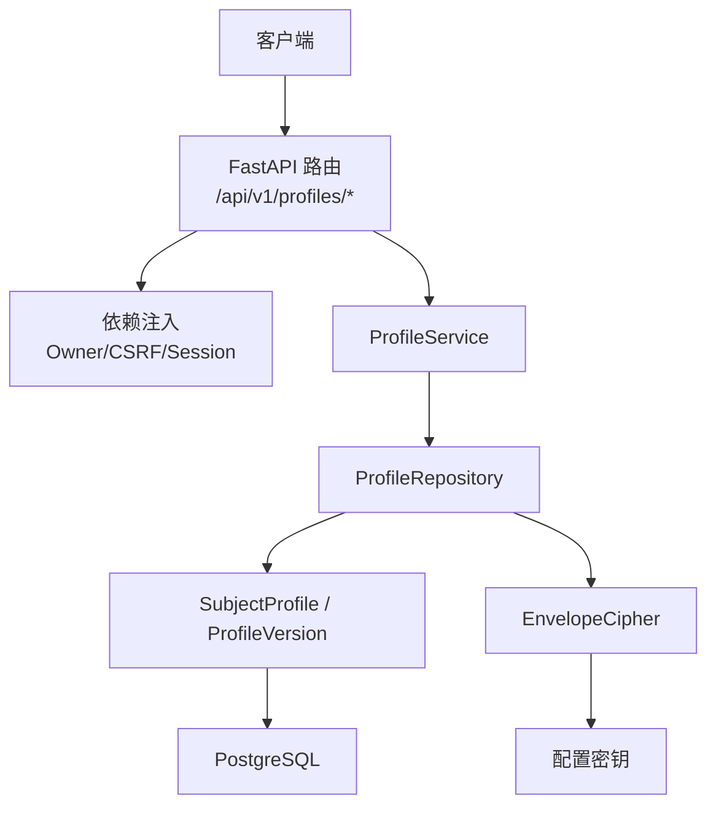
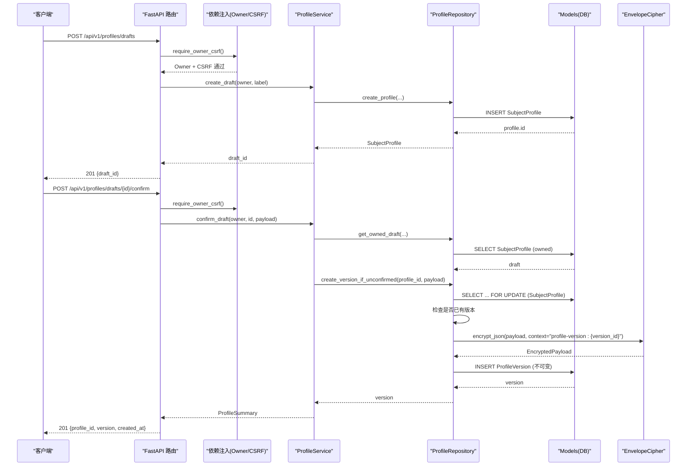
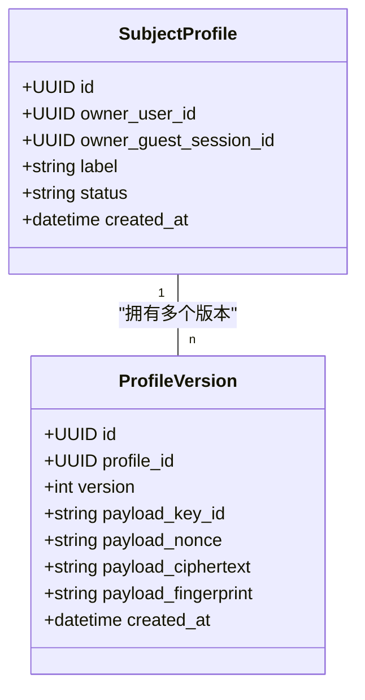
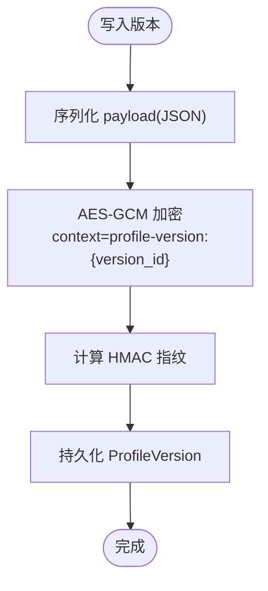
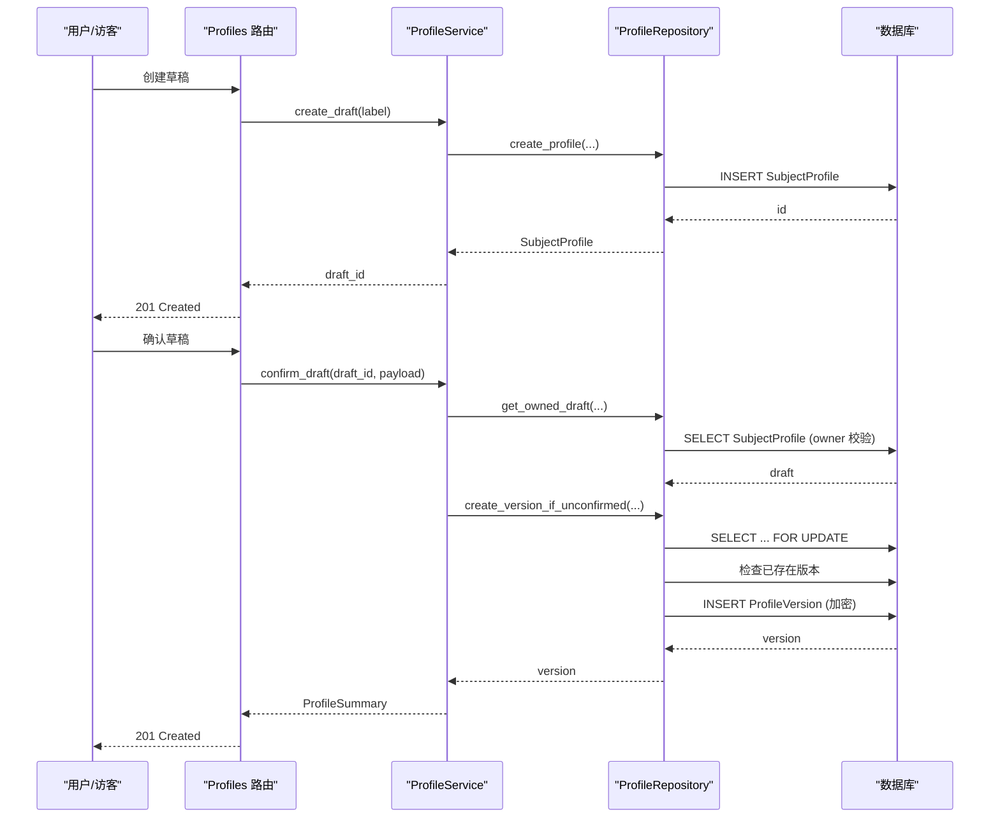
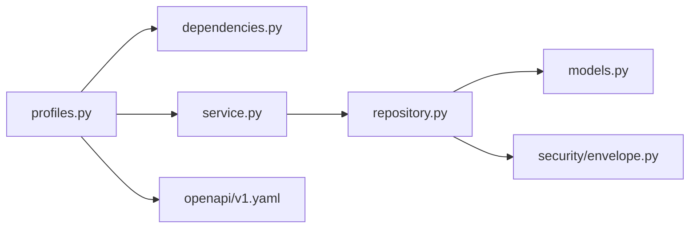

# 用户档案 API

<cite>
**本文引用的文件**
- [backend/app/api/profiles.py](file://backend/app/api/profiles.py)
- [backend/app/profiles/service.py](file://backend/app/profiles/service.py)
- [backend/app/profiles/repository.py](file://backend/app/profiles/repository.py)
- [backend/app/profiles/models.py](file://backend/app/profiles/models.py)
- [backend/app/profiles/schemas.py](file://backend/app/profiles/schemas.py)
- [backend/app/security/envelope.py](file://backend/app/security/envelope.py)
- [backend/app/api/dependencies.py](file://backend/app/api/dependencies.py)
- [contracts/openapi/v1.yaml](file://contracts/openapi/v1.yaml)
- [docs/adr/0004-version-profiles-and-readings-immutably.md](file://docs/adr/0004-version-profiles-and-readings-immutably.md)
</cite>

## 目录
1. [简介](#简介)
2. [项目结构](#项目结构)
3. [核心组件](#核心组件)
4. [架构总览](#架构总览)
5. [详细组件分析](#详细组件分析)
6. [依赖关系分析](#依赖关系分析)
7. [性能与一致性](#性能与一致性)
8. [故障排查指南](#故障排查指南)
9. [结论](#结论)
10. [附录：接口契约与示例](#附录接口契约与示例)

## 简介
本文件面向“用户档案管理”的 API 使用与实现说明，覆盖以下目标：
- 档案草稿创建、确认与版本管理的完整流程
- 不可变数据模型的设计理念与实践（版本化、历史可追溯）
- 敏感字段（出生时间、时区、地理位置等）的加密存储机制
- 档案 CRUD 相关接口的参数验证、业务规则与数据约束
- 档案归属转移（访客会话认领）、权限控制与隐私响应头
- 完整的请求/响应约定与错误处理指南

## 项目结构
后端围绕 FastAPI 路由层、领域服务、仓储与数据模型分层组织。Profile 模块负责档案生命周期；Security 模块提供信封式加解密；API 依赖注入负责会话、CSRF 校验与速率限制。OpenAPI 契约集中定义对外接口与数据结构。

图表来源
- [backend/app/api/profiles.py:43-111](file://backend/app/api/profiles.py#L43-L111)
- [backend/app/profiles/service.py:44-189](file://backend/app/profiles/service.py#L44-L189)
- [backend/app/profiles/repository.py:22-198](file://backend/app/profiles/repository.py#L22-L198)
- [backend/app/profiles/models.py:21-79](file://backend/app/profiles/models.py#L21-L79)
- [backend/app/security/envelope.py:32-122](file://backend/app/security/envelope.py#L32-L122)
- [contracts/openapi/v1.yaml:145-220](file://contracts/openapi/v1.yaml#L145-L220)

章节来源
- [backend/app/api/profiles.py:43-111](file://backend/app/api/profiles.py#L43-L111)
- [contracts/openapi/v1.yaml:145-220](file://contracts/openapi/v1.yaml#L145-L220)

## 核心组件
- 路由层：暴露 /profiles/drafts、/profiles/drafts/{draft_id}/confirm、/profiles 列表接口，统一进行 CSRF、速率限制与私有响应头设置。
- 服务层：封装草稿创建、确认、列出最新版本、访客会话认领等业务编排。
- 仓储层：负责数据库访问、行级锁、版本分配、加密写入与读取。
- 模型层：SubjectProfile（档案主体，支持 User/Guest 双拥有者），ProfileVersion（不可变版本记录）。
- 安全层：EnvelopeCipher 基于 AES-GCM 对 JSON 载荷进行带上下文绑定的认证加密，并生成指纹用于完整性校验。
- 依赖注入：Owner 抽象统一用户与会话身份；require_owner_csrf 强制 CSRF 双提交校验；mark_private 标记响应为私有缓存策略。

章节来源
- [backend/app/api/profiles.py:31-111](file://backend/app/api/profiles.py#L31-L111)
- [backend/app/profiles/service.py:44-189](file://backend/app/profiles/service.py#L44-L189)
- [backend/app/profiles/repository.py:22-198](file://backend/app/profiles/repository.py#L22-L198)
- [backend/app/profiles/models.py:21-79](file://backend/app/profiles/models.py#L21-L79)
- [backend/app/security/envelope.py:32-122](file://backend/app/security/envelope.py#L32-L122)
- [backend/app/api/dependencies.py:19-137](file://backend/app/api/dependencies.py#L19-L137)

## 架构总览
下图展示了从 HTTP 请求到持久化的端到端调用链，以及关键的安全与一致性保障点。

图表来源
- [backend/app/api/profiles.py:43-93](file://backend/app/api/profiles.py#L43-L93)
- [backend/app/profiles/service.py:52-105](file://backend/app/profiles/service.py#L52-L105)
- [backend/app/profiles/repository.py:57-104](file://backend/app/profiles/repository.py#L57-L104)
- [backend/app/security/envelope.py:98-122](file://backend/app/security/envelope.py#L98-L122)
- [contracts/openapi/v1.yaml:145-206](file://contracts/openapi/v1.yaml#L145-L206)

## 详细组件分析

### 数据模型与不可变设计
- SubjectProfile：代表一个档案主体，拥有 owner_user_id 或 owner_guest_session_id 之一，状态默认 active，包含标签与创建时间。
- ProfileVersion：每个版本对应一次不可变的档案快照，包含版本号、加密载荷元数据（key_id、nonce、ciphertext、fingerprint）与创建时间。
- 不可变性：ProfileVersion 在 before_update 钩子中抛出异常，禁止任何更新操作，确保历史可审计与可复现。

图表来源
- [backend/app/profiles/models.py:21-79](file://backend/app/profiles/models.py#L21-L79)

章节来源
- [backend/app/profiles/models.py:21-79](file://backend/app/profiles/models.py#L21-L79)
- [docs/adr/0004-version-profiles-and-readings-immutably.md:5-11](file://docs/adr/0004-version-profiles-and-readings-immutably.md#L5-L11)

### 敏感数据加密存储
- 加密算法：AES-256-GCM，结合 HMAC 指纹与上下文绑定，防止篡改与重放。
- 上下文隔离：以 "profile-version:{version_id}" 作为 AAD 上下文，确保不同版本密文不可互换。
- 载荷结构：JSON 序列化后加密，返回 key_id、nonce、ciphertext、fingerprint 四元组。
- 读取路径：仓库层加载版本后，使用相同上下文解密并校验指纹，失败则抛错。

图表来源
- [backend/app/profiles/repository.py:79-104](file://backend/app/profiles/repository.py#L79-L104)
- [backend/app/security/envelope.py:56-122](file://backend/app/security/envelope.py#L56-L122)

章节来源
- [backend/app/security/envelope.py:32-122](file://backend/app/security/envelope.py#L32-L122)
- [backend/app/profiles/repository.py:79-104](file://backend/app/profiles/repository.py#L79-L104)

### 草稿创建与确认流程
- 创建草稿：POST /api/v1/profiles/drafts，仅保存 SubjectProfile，不产生版本。
- 确认草稿：POST /api/v1/profiles/drafts/{draft_id}/confirm，将 payload 加密并写入 ProfileVersion，同一草稿只能确认一次。
- 并发保护：使用 FOR UPDATE 行锁 + 重复检查，避免竞态导致重复版本。
- 响应头：所有写操作均标记私有缓存策略，避免中间节点缓存敏感信息。

图表来源
- [backend/app/api/profiles.py:43-93](file://backend/app/api/profiles.py#L43-L93)
- [backend/app/profiles/service.py:52-105](file://backend/app/profiles/service.py#L52-L105)
- [backend/app/profiles/repository.py:57-104](file://backend/app/profiles/repository.py#L57-L104)

章节来源
- [backend/app/api/profiles.py:43-93](file://backend/app/api/profiles.py#L43-L93)
- [backend/app/profiles/service.py:52-105](file://backend/app/profiles/service.py#L52-L105)
- [backend/app/profiles/repository.py:57-104](file://backend/app/profiles/repository.py#L57-L104)

### 版本查询与历史管理
- 列表接口：GET /api/v1/profiles，返回当前会话拥有的各档案的最新版本摘要（不包含明文 payload）。
- 版本锁定：查询最新版本的 SQL 使用聚合与 JOIN，按创建时间与 ID 降序排序，保证稳定顺序。
- 历史可追溯：每次确认都会新增一条不可变版本记录，便于审计与回溯。

章节来源
- [backend/app/api/profiles.py:96-111](file://backend/app/api/profiles.py#L96-L111)
- [backend/app/profiles/repository.py:145-182](file://backend/app/profiles/repository.py#L145-L182)
- [contracts/openapi/v1.yaml:207-220](file://contracts/openapi/v1.yaml#L207-L220)

### 归属转移（访客会话认领）
- 场景：访客登录后，将其名下资源原子迁移至已登录用户。
- 行为：锁定 GuestSession，标记 claimed_at/claimed_by_user_id；批量迁移 SubjectProfile、ReadingRoot、ReadingIdempotencyKey 的所有者。
- 幂等性：已认领的会话再次认领会抛出异常。

章节来源
- [backend/app/profiles/service.py:130-179](file://backend/app/profiles/service.py#L130-L179)
- [backend/tests/test_profiles_api.py:230-256](file://backend/tests/test_profiles_api.py#L230-L256)
- [backend/tests/test_profiles_api.py:350-374](file://backend/tests/test_profiles_api.py#L350-L374)

### 权限控制与安全
- 身份抽象：Owner 统一用户与会话，路由通过 require_owner_csrf 强制 CSRF 双提交校验。
- 速率限制：写操作受 profile_write_rate_limiter 限流，超限返回 429。
- 隐私响应：mark_private 设置 cache-control 与 robots 头，禁止缓存与索引。

章节来源
- [backend/app/api/dependencies.py:87-137](file://backend/app/api/dependencies.py#L87-L137)
- [backend/app/api/profiles.py:35-41](file://backend/app/api/profiles.py#L35-L41)

## 依赖关系分析
- 路由依赖：FastAPI 路由依赖 database_session、require_owner_csrf、rate guard。
- 服务依赖：ProfileService 依赖 ProfileRepository 与 EnvelopeCipher。
- 仓储依赖：ProfileRepository 依赖 SQLAlchemy 异步会话与加密器。
- 外部契约：OpenAPI v1 定义了 Profiles 相关接口与数据结构。

图表来源
- [backend/app/api/profiles.py:1-33](file://backend/app/api/profiles.py#L1-L33)
- [backend/app/profiles/service.py:1-16](file://backend/app/profiles/service.py#L1-L16)
- [backend/app/profiles/repository.py:1-13](file://backend/app/profiles/repository.py#L1-L13)
- [contracts/openapi/v1.yaml:145-220](file://contracts/openapi/v1.yaml#L145-L220)

章节来源
- [backend/app/api/profiles.py:1-33](file://backend/app/api/profiles.py#L1-L33)
- [backend/app/profiles/service.py:1-16](file://backend/app/profiles/service.py#L1-L16)
- [backend/app/profiles/repository.py:1-13](file://backend/app/profiles/repository.py#L1-L13)
- [contracts/openapi/v1.yaml:145-220](file://contracts/openapi/v1.yaml#L145-L220)

## 性能与一致性
- 行级锁：create_version_if_unconfirmed 使用 FOR UPDATE 串行化同一档案的版本分配，避免并发冲突。
- 唯一约束：ProfileVersion 的 (profile_id, version) 唯一约束保障版本号不重复。
- 最小 I/O：列表接口仅返回摘要，payload 保持加密，减少敏感数据传输。
- 速率限制：写接口限流，防止滥用与雪崩。

章节来源
- [backend/app/profiles/repository.py:15-19](file://backend/app/profiles/repository.py#L15-L19)
- [backend/app/profiles/repository.py:57-77](file://backend/app/profiles/repository.py#L57-L77)
- [backend/app/profiles/models.py:49-57](file://backend/app/profiles/models.py#L49-L57)
- [backend/app/api/profiles.py:35-41](file://backend/app/api/profiles.py#L35-L41)

## 故障排查指南
- 404 未找到：草稿或版本不存在或不属于当前所有者。
- 409 冲突：草稿已被确认，无法重复确认。
- 403 非法请求：CSRF 校验失败或来源不合法。
- 429 限流：短时间内写请求过多，需等待重试。
- 解密失败：若尝试读取加密 payload 且上下文或密钥不匹配，将抛出解密错误（内部实现）。

章节来源
- [backend/app/api/profiles.py:84-93](file://backend/app/api/profiles.py#L84-L93)
- [backend/app/api/dependencies.py:29-54](file://backend/app/api/dependencies.py#L29-L54)
- [backend/app/security/envelope.py:75-96](file://backend/app/security/envelope.py#L75-L96)

## 结论
本系统采用“不可变版本化”的档案模型，配合强一致的行锁与加密存储，确保敏感数据的机密性与完整性，同时提供清晰的草稿-确认工作流与归属转移能力。API 层面通过 OpenAPI 契约与严格的参数校验，保障前后端协作的一致性与安全性。

## 附录：接口契约与示例

### 接口清单
- 创建档案草稿
  - 方法：POST
  - 路径：/api/v1/profiles/drafts
  - 鉴权：需要有效设备会话或访客会话，并携带 X-CSRF-Token
  - 请求体：ProfileDraftRequest
  - 响应：201 ProfileDraftResponse
  - 错误：400/403/429

- 确认档案草稿
  - 方法：POST
  - 路径：/api/v1/profiles/drafts/{draft_id}/confirm
  - 鉴权：同上
  - 请求体：ProfileConfirmRequest
  - 响应：201 ProfileSummary
  - 错误：400/403/404/409/429

- 列出档案版本摘要
  - 方法：GET
  - 路径：/api/v1/profiles
  - 鉴权：需要有效会话（设备会话或访客会话）
  - 响应：200 ProfileListResponse
  - 错误：401

章节来源
- [contracts/openapi/v1.yaml:145-220](file://contracts/openapi/v1.yaml#L145-L220)
- [backend/app/profiles/schemas.py:10-60](file://backend/app/profiles/schemas.py#L10-L60)

### 请求/响应约定
- 请求头
  - X-CSRF-Token：必填，与 Cookie 中的 CSRF Token 一致
  - Idempotency-Key：非必填（主要用于 Readings，Profile 写接口未要求）
- 响应头
  - Cache-Control：private, no-store, max-age=0
  - X-Robots-Tag：noindex, nofollow, noarchive

章节来源
- [contracts/openapi/v1.yaml:556-572](file://contracts/openapi/v1.yaml#L556-L572)
- [backend/app/api/dependencies.py:133-137](file://backend/app/api/dependencies.py#L133-L137)

### 参数验证与业务规则
- ProfileDraftRequest
  - label：字符串，长度 1..80
- ProfileConfirmRequest
  - birth_datetime：ISO 8601 时间字符串
  - timezone：IANA 时区标识，长度 1..64
  - location：字符串，长度 1..120
  - gender：枚举 male/female/other
  - time_basis_policy：枚举 civil/solar/lunar
  - zi_hour_policy：枚举 midnight/substitute/solar
  - longitude：可选，范围 -180..180
  - latitude：可选，范围 -90..90
  - coordinate_source：可选，长度 1..40
- 业务规则
  - 同一草稿只能确认一次
  - 版本不可变，禁止更新
  - 列表仅返回公开摘要，payload 保持加密

章节来源
- [backend/app/profiles/schemas.py:10-60](file://backend/app/profiles/schemas.py#L10-L60)
- [backend/app/profiles/models.py:77-79](file://backend/app/profiles/models.py#L77-L79)
- [backend/app/profiles/service.py:65-105](file://backend/app/profiles/service.py#L65-L105)

### 错误处理指南
- 404：草稿或版本不存在或不属于当前所有者
- 409：草稿已被确认，重复确认
- 403：CSRF 校验失败或来源不合法
- 429：超过速率限制
- 401：未提供有效会话

章节来源
- [backend/app/api/profiles.py:84-93](file://backend/app/api/profiles.py#L84-L93)
- [backend/app/api/dependencies.py:39-84](file://backend/app/api/dependencies.py#L39-L84)
- [contracts/openapi/v1.yaml:1220-1268](file://contracts/openapi/v1.yaml#L1220-L1268)