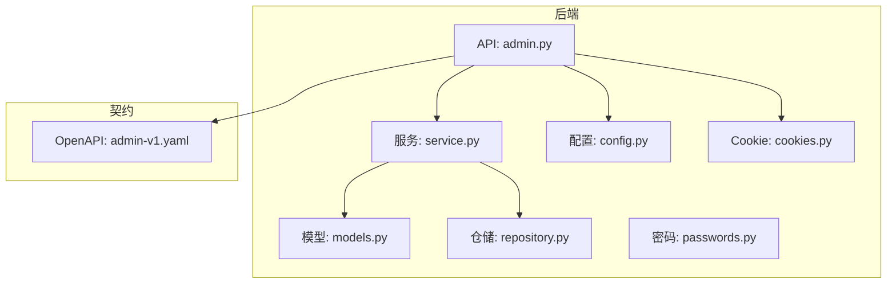
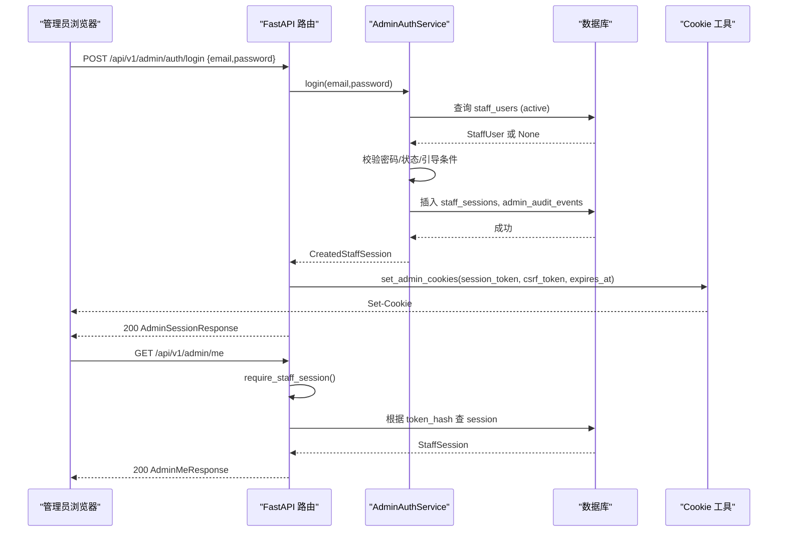
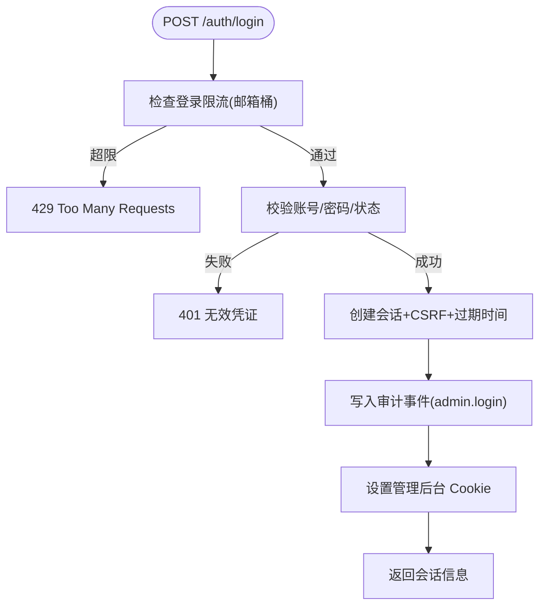
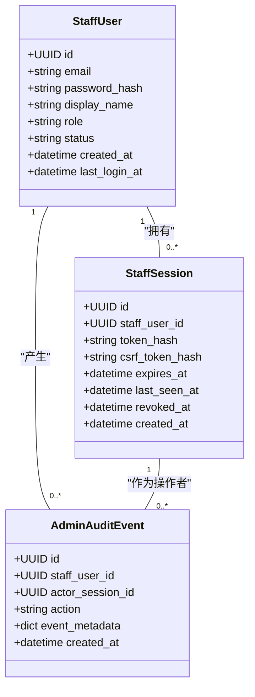
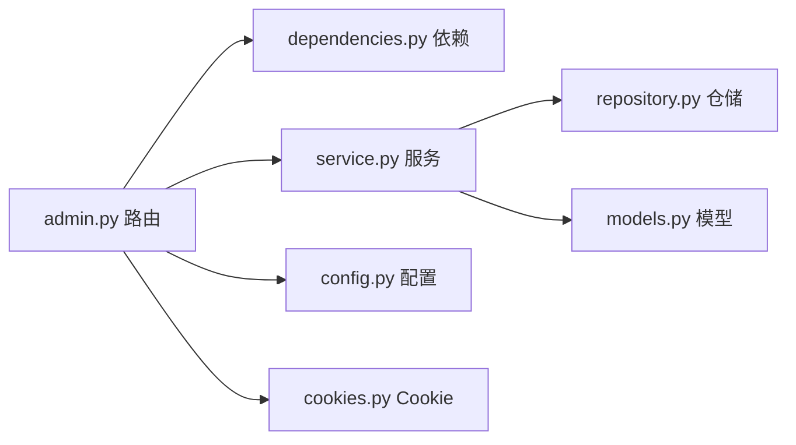

# 管理后台 API

<cite>
**本文引用的文件**
- [backend/app/api/admin.py](file://backend/app/api/admin.py)
- [backend/app/admin/service.py](file://backend/app/admin/service.py)
- [backend/app/admin/models.py](file://backend/app/admin/models.py)
- [backend/app/admin/repository.py](file://backend/app/admin/repository.py)
- [backend/app/admin/schemas.py](file://backend/app/admin/schemas.py)
- [backend/app/admin/passwords.py](file://backend/app/admin/passwords.py)
- [backend/app/admin/cookies.py](file://backend/app/admin/cookies.py)
- [backend/app/api/dependencies.py](file://backend/app/api/dependencies.py)
- [backend/app/config.py](file://backend/app/config.py)
- [contracts/openapi/admin-v1.yaml](file://contracts/openapi/admin-v1.yaml)
</cite>

## 目录
1. [简介](#简介)
2. [项目结构](#项目结构)
3. [核心组件](#核心组件)
4. [架构总览](#架构总览)
5. [详细组件分析](#详细组件分析)
6. [依赖关系分析](#依赖关系分析)
7. [性能与限流](#性能与限流)
8. [故障排查指南](#故障排查指南)
9. [结论](#结论)
10. [附录：接口清单与安全建议](#附录接口清单与安全建议)

## 简介
本文件面向“管理后台”的 API 文档，聚焦管理员认证、会话与 CSRF、审计日志基础能力、以及当前已实现的概览接口。基于代码仓库现状，用户管理、订单处理、退款审批、解读记录查询等运维相关接口在 OpenAPI 计划中已定义，但后端尚未实现；本文会明确标注哪些为“已实现”，哪些为“待实现”。同时说明基于角色的访问控制（RBAC）模型、权限验证机制、安全与审计追踪、限流策略与异常处理，并给出管理员工作流示例和排错指引。

## 项目结构
管理后台相关代码主要位于后端模块 `backend/app/admin` 与 `backend/app/api/admin.py`，并通过独立的 OpenAPI 契约文件 `contracts/openapi/admin-v1.yaml` 描述接口。前端管理控制台位于 `admin/src`，当前页面多为占位或准备接入阶段。

图表来源
- [backend/app/api/admin.py:1-200](file://backend/app/api/admin.py#L1-L200)
- [backend/app/admin/service.py:1-148](file://backend/app/admin/service.py#L1-L148)
- [backend/app/admin/models.py:1-81](file://backend/app/admin/models.py#L1-L81)
- [backend/app/admin/repository.py:1-57](file://backend/app/admin/repository.py#L1-L57)
- [backend/app/config.py:62-146](file://backend/app/config.py#L62-L146)
- [backend/app/admin/cookies.py:1-81](file://backend/app/admin/cookies.py#L1-L81)
- [backend/app/admin/passwords.py:1-55](file://backend/app/admin/passwords.py#L1-L55)
- [contracts/openapi/admin-v1.yaml:1-231](file://contracts/openapi/admin-v1.yaml#L1-L231)

章节来源
- [backend/app/api/admin.py:1-200](file://backend/app/api/admin.py#L1-L200)
- [contracts/openapi/admin-v1.yaml:1-231](file://contracts/openapi/admin-v1.yaml#L1-L231)

## 核心组件
- 管理员认证与会话
  - 登录、登出、获取当前管理员信息、概览数据。
  - 使用独立 Cookie 名称与 CSRF 双提交校验，避免复用普通用户会话。
- 角色与权限
  - 角色枚举：support、finance、ops、superadmin。
  - 当前实现以会话存在性为核心鉴权点；按角色进行后续细粒度授权扩展预留。
- 审计日志
  - 登录、登出、首次引导创建超级管理员等关键动作写入审计表。
- 限流
  - 登录接口具备按邮箱桶的速率限制，防止暴力破解。
- 安全与配置
  - 生产环境强制安全 Cookie、禁止引导账户、严格密钥与路径约束。

章节来源
- [backend/app/api/admin.py:33-200](file://backend/app/api/admin.py#L33-L200)
- [backend/app/admin/service.py:16-148](file://backend/app/admin/service.py#L16-L148)
- [backend/app/admin/models.py:17-81](file://backend/app/admin/models.py#L17-L81)
- [backend/app/config.py:141-146](file://backend/app/config.py#L141-L146)

## 架构总览
管理后台 API 采用 FastAPI 路由 + 依赖注入模式，通过数据库会话、配置与服务层解耦。认证流程包含：
- 登录：校验凭据 -> 创建会话与 CSRF -> 设置 Cookie -> 写审计事件。
- 受保护接口：读取 Cookie -> 校验会话有效性 -> 可选 CSRF 校验 -> 执行业务逻辑。
- 概览：返回占位 KPI 与工作队列计数，便于后续接入真实指标。

图表来源
- [backend/app/api/admin.py:103-185](file://backend/app/api/admin.py#L103-L185)
- [backend/app/admin/service.py:49-101](file://backend/app/admin/service.py#L49-L101)
- [backend/app/admin/repository.py:42-56](file://backend/app/admin/repository.py#L42-L56)
- [backend/app/admin/cookies.py:38-65](file://backend/app/admin/cookies.py#L38-L65)

## 详细组件分析

### 管理员认证与会话
- 登录
  - 输入：email、password。
  - 输出：staff_id、session_id、role、display_name、expires_at、csrf_token。
  - 副作用：设置 HttpOnly 会话 Cookie 与可读 CSRF Cookie；标记响应私有缓存。
  - 限流：按邮箱归一化后的键值进行窗口限流，失败返回 429。
- 登出
  - 需要 CSRF 头与 Cookie 匹配；撤销会话并清除 Cookie。
- 当前管理员
  - 返回当前会话绑定的管理员信息与过期时间。

图表来源
- [backend/app/api/admin.py:103-145](file://backend/app/api/admin.py#L103-L145)
- [backend/app/admin/service.py:49-89](file://backend/app/admin/service.py#L49-L89)
- [backend/app/admin/cookies.py:38-65](file://backend/app/admin/cookies.py#L38-L65)

章节来源
- [backend/app/api/admin.py:103-185](file://backend/app/api/admin.py#L103-L185)
- [backend/app/admin/service.py:49-101](file://backend/app/admin/service.py#L49-L101)
- [backend/app/admin/cookies.py:38-65](file://backend/app/admin/cookies.py#L38-L65)

### 角色与权限模型（RBAC）
- 角色类型：support、finance、ops、superadmin。
- 当前实现：所有受保护接口均要求有效 staff 会话；具体资源级权限（如 finance 仅退款、ops 仅系统监控）可在后续通过依赖注入守卫扩展。
- 引导账户：仅在 local/test 环境允许通过环境变量创建首个 superadmin，生产环境禁用。

图表来源
- [backend/app/admin/models.py:17-81](file://backend/app/admin/models.py#L17-L81)

章节来源
- [backend/app/admin/schemas.py:11-11](file://backend/app/admin/schemas.py#L11-L11)
- [backend/app/admin/service.py:103-129](file://backend/app/admin/service.py#L103-L129)
- [backend/app/config.py:141-146](file://backend/app/config.py#L141-L146)

### 审计日志
- 记录事件：admin.login、admin.logout、admin.bootstrap_created。
- 字段：操作者 staff_user_id、actor_session_id、action、event_metadata、created_at。
- 索引：按 staff_user_id 与 created_at 建立索引，便于检索。

章节来源
- [backend/app/admin/models.py:59-81](file://backend/app/admin/models.py#L59-L81)
- [backend/app/admin/service.py:75-101](file://backend/app/admin/service.py#L75-L101)
- [backend/app/admin/repository.py:39-40](file://backend/app/admin/repository.py#L39-L40)

### 概览与运维指标（Phase A 占位）
- 返回 KPI 列表与工作队列摘要，当前为占位数据，is_stub=true。
- 后续可接入退款待审、解读失败、支付异常、对账差异等指标。

章节来源
- [backend/app/api/admin.py:188-200](file://backend/app/api/admin.py#L188-L200)
- [backend/app/admin/service.py:132-148](file://backend/app/admin/service.py#L132-L148)
- [contracts/openapi/admin-v1.yaml:69-82](file://contracts/openapi/admin-v1.yaml#L69-L82)

### 密码与令牌安全
- 密码哈希：使用 scrypt，参数固定，长度不足直接拒绝。
- 令牌：会话与 CSRF 令牌均为不透明随机串，服务端存储其哈希。
- Cookie：会话 Cookie 为 HttpOnly，CSRF Cookie 可读用于双提交校验；SameSite=Lax，支持 domain 与 secure 开关。

章节来源
- [backend/app/admin/passwords.py:16-55](file://backend/app/admin/passwords.py#L16-L55)
- [backend/app/admin/cookies.py:15-65](file://backend/app/admin/cookies.py#L15-L65)
- [backend/app/admin/service.py:59-73](file://backend/app/admin/service.py#L59-L73)

### 错误与异常处理
- 统一抛出 ApiProblem，携带 HTTP 状态码与标题。
- 常见状态：
  - 401：未认证或凭据无效。
  - 403：CSRF 校验失败或无权限。
  - 429：登录频率过高。
  - 204：登出成功。
- 响应标记：私有响应头，禁止缓存与索引。

章节来源
- [backend/app/api/errors.py:1-17](file://backend/app/api/errors.py#L1-L17)
- [backend/app/api/admin.py:68-100](file://backend/app/api/admin.py#L68-L100)
- [backend/app/api/dependencies.py:133-137](file://backend/app/api/dependencies.py#L133-L137)

## 依赖关系分析
- 路由依赖
  - database_session：提供异步数据库会话，异常时回滚。
  - require_staff_session：从 Cookie 解析会话并校验活跃状态。
  - require_staff_csrf：双重提交 CSRF 校验。
- 服务依赖
  - AdminAuthService：封装登录、登出、引导创建、审计写入。
  - AdminRepository：会话与审计事件的持久化。
- 配置依赖
  - Settings：会话时长、引导账户、登录限流窗口与阈值、Cookie 安全标志等。

图表来源
- [backend/app/api/admin.py:33-100](file://backend/app/api/admin.py#L33-L100)
- [backend/app/api/dependencies.py:19-137](file://backend/app/api/dependencies.py#L19-L137)
- [backend/app/admin/service.py:33-101](file://backend/app/admin/service.py#L33-L101)
- [backend/app/admin/repository.py:14-57](file://backend/app/admin/repository.py#L14-L57)
- [backend/app/config.py:141-146](file://backend/app/config.py#L141-L146)

章节来源
- [backend/app/api/admin.py:33-100](file://backend/app/api/admin.py#L33-L100)
- [backend/app/api/dependencies.py:19-137](file://backend/app/api/dependencies.py#L19-L137)
- [backend/app/admin/service.py:33-101](file://backend/app/admin/service.py#L33-L101)

## 性能与限流
- 登录限流
  - 按邮箱归一化后的键进行窗口限流，默认阈值与窗口由配置项决定。
  - 目的：防止暴力破解与滥用。
- 会话与审计
  - 登录成功后立即写入审计事件，可能带来额外 I/O；建议在高峰期评估批量写入或异步落盘方案。
- Cookie 与缓存
  - 管理后台响应标记为私有且不可缓存，避免中间节点缓存敏感数据。

章节来源
- [backend/app/api/admin.py:56-65](file://backend/app/api/admin.py#L56-L65)
- [backend/app/config.py:141-146](file://backend/app/config.py#L141-L146)
- [backend/app/api/dependencies.py:133-137](file://backend/app/api/dependencies.py#L133-L137)

## 故障排查指南
- 无法登录
  - 检查邮箱是否已被注册且状态为 active。
  - 确认密码长度与哈希格式正确。
  - 查看是否触发登录限流（429）。
- 登录后访问受限接口报 401/403
  - 确认 Cookie mingli_admin_session 与 mingli_admin_csrf 已设置且未过期。
  - 修改类请求需携带 X-CSRF-Token 与 Cookie 中的 CSRF 一致。
- 登出后仍被识别
  - 检查是否调用登出接口并清除了 Cookie。
  - 确认服务端已撤销会话（revoked_at 已设置）。
- 审计日志缺失
  - 确认登录/登出流程是否完整执行。
  - 检查数据库连接与事务提交。

章节来源
- [backend/app/api/admin.py:68-100](file://backend/app/api/admin.py#L68-L100)
- [backend/app/admin/service.py:49-101](file://backend/app/admin/service.py#L49-L101)
- [backend/app/admin/repository.py:42-56](file://backend/app/admin/repository.py#L42-L56)

## 结论
当前管理后台实现了管理员认证与会话、CSRF 防护、审计日志基础能力与概览占位接口。角色体系已建模，后续可按角色细化资源级权限。用户管理、订单处理、退款审批、解读记录查询等运维接口已在 OpenAPI 契约中规划，待后端逐步实现。生产环境的安全约束严格，部署时需遵循配置校验规则。

## 附录：接口清单与安全建议

### 已实现接口
- 管理员认证
  - POST /api/v1/admin/auth/login
    - 请求体：email、password
    - 响应：staff_id、session_id、role、display_name、expires_at、csrf_token
    - 状态码：200、401、429
  - POST /api/v1/admin/auth/logout
    - 头部：X-CSRF-Token
    - 状态码：204、401、403
  - GET /api/v1/admin/me
    - 状态码：200、401
  - GET /api/v1/admin/overview
    - 状态码：200、401

章节来源
- [contracts/openapi/admin-v1.yaml:15-82](file://contracts/openapi/admin-v1.yaml#L15-L82)
- [backend/app/api/admin.py:103-200](file://backend/app/api/admin.py#L103-L200)

### 待实现接口（契约已定义）
- 用户管理
  - GET /api/v1/admin/users
  - GET /api/v1/admin/users/{user_id}
- 订单与支付
  - GET /api/v1/admin/orders
  - GET /api/v1/admin/orders/{order_id}
  - GET /api/v1/admin/payments
- 退款审批
  - GET /api/v1/admin/refunds
  - POST /api/v1/admin/refunds/{id}/approve
  - POST /api/v1/admin/refunds/{id}/reject
- 解读记录
  - GET /api/v1/admin/readings
  - POST /api/v1/admin/readings/{id}/retry
- 对账与审计
  - GET /api/v1/admin/reconcile/daily
  - GET /api/v1/admin/audit-events

章节来源
- [contracts/openapi/admin-v1.yaml:131-153](file://contracts/openapi/admin-v1.yaml#L131-L153)
- [docs/plans/2026-08-11-admin-console-plan.md:131-153](file://docs/plans/2026-08-11-admin-console-plan.md#L131-L153)

### 安全与审计最佳实践
- 生产环境
  - 启用 Secure Cookie，禁止引导账户，注入强密钥与固定路径。
  - 将管理后台置于内网或隧道访问，结合 IP 白名单与 MFA（后续增强）。
- 会话与 CSRF
  - 短会话、绝对超时；每次写操作必须携带匹配的 X-CSRF-Token。
- 审计追踪
  - 所有写操作应记录审计事件，包含操作者、会话、动作与元数据。
- 限流与幂等
  - 登录限流；退款审批等写操作引入幂等键，避免重复处理。
- 数据导出与报表
  - 后续可基于审计与领域数据生成 CSV/Excel 导出；注意脱敏与访问控制。

章节来源
- [backend/app/config.py:188-239](file://backend/app/config.py#L188-L239)
- [backend/app/admin/cookies.py:15-65](file://backend/app/admin/cookies.py#L15-L65)
- [backend/app/admin/service.py:75-101](file://backend/app/admin/service.py#L75-L101)

### 管理员工作流示例
- 登录与概览
  - 调用登录接口，保存返回的 csrf_token。
  - 访问 /me 验证身份，随后访问 /overview 查看占位指标。
- 审计查询（待实现）
  - 调用 /admin/audit-events 过滤指定时间段与操作类型，定位问题。
- 退款审批（待实现）
  - 列出待审退款，选择 approve 或 reject，确保幂等键与审计记录。

章节来源
- [contracts/openapi/admin-v1.yaml:15-82](file://contracts/openapi/admin-v1.yaml#L15-L82)
- [docs/plans/2026-08-11-admin-console-plan.md:131-153](file://docs/plans/2026-08-11-admin-console-plan.md#L131-L153)