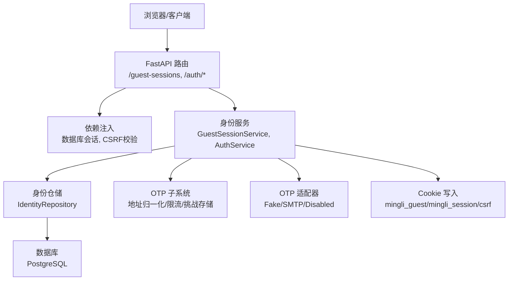
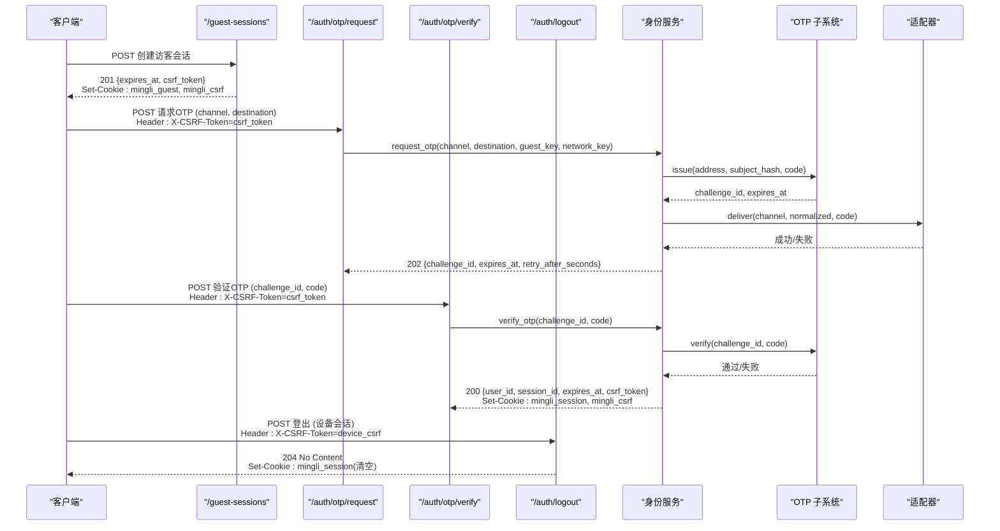
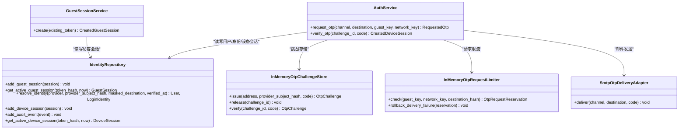
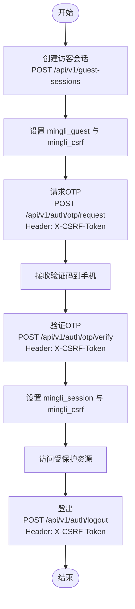
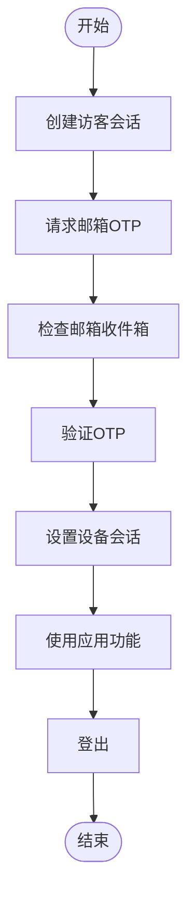

# 身份认证 API

<cite>
**本文引用的文件**
- [backend/app/api/auth.py](file://backend/app/api/auth.py)
- [backend/app/api/guest_sessions.py](file://backend/app/api/guest_sessions.py)
- [backend/app/identity/service.py](file://backend/app/identity/service.py)
- [backend/app/identity/otp.py](file://backend/app/identity/otp.py)
- [backend/app/identity/models.py](file://backend/app/identity/models.py)
- [backend/app/identity/schemas.py](file://backend/app/identity/schemas.py)
- [backend/app/api/dependencies.py](file://backend/app/api/dependencies.py)
- [backend/app/adapters/otp.py](file://backend/app/adapters/otp.py)
- [contracts/openapi/v1.yaml](file://contracts/openapi/v1.yaml)
- [backend/tests/test_auth.py](file://backend/tests/test_auth.py)
- [backend/tests/test_guest_sessions.py](file://backend/tests/test_guest_sessions.py)
- [backend/tests/test_csrf.py](file://backend/tests/test_csrf.py)
</cite>

## 目录
1. [简介](#简介)
2. [项目结构](#项目结构)
3. [核心组件](#核心组件)
4. [架构总览](#架构总览)
5. [详细组件分析](#详细组件分析)
6. [依赖关系分析](#依赖关系分析)
7. [性能与安全考量](#性能与安全考量)
8. [故障排查指南](#故障排查指南)
9. [结论](#结论)
10. [附录：客户端集成与错误处理](#附录客户端集成与错误处理)

## 简介
本文件面向后端与前端工程师，系统化说明身份认证相关 API，包括访客会话创建、OTP 验证码请求与验证、设备会话管理与登出。文档覆盖手机号与邮箱两种 OTP 通道的完整流程，解释 CSRF 保护机制与安全头部使用，提供成功登录、验证码错误、会话过期等场景的请求响应示例，并给出会话生命周期管理建议、安全最佳实践以及客户端集成指南和常见错误处理方案。

## 项目结构
认证能力由以下模块协作实现：
- API 路由层：定义 /guest-sessions、/auth/otp/request、/auth/otp/verify、/auth/logout 等端点
- 身份服务层：GuestSessionService、AuthService 负责业务逻辑（会话创建、OTP 挑战、设备会话签发）
- OTP 子系统：地址归一化、速率限制、挑战存储、代码哈希校验
- 适配器层：邮件发送（SMTP）、本地 Fake、禁用模式
- 安全与 Cookie：CSRF 双提交校验、Cookie 安全属性设置
- 数据模型：User、LoginIdentity、DeviceSession、GuestSession、AuditEvent

图表来源
- [backend/app/api/auth.py:44-161](file://backend/app/api/auth.py#L44-L161)
- [backend/app/api/guest_sessions.py:16-53](file://backend/app/api/guest_sessions.py#L16-L53)
- [backend/app/identity/service.py:35-192](file://backend/app/identity/service.py#L35-L192)
- [backend/app/identity/otp.py:183-304](file://backend/app/identity/otp.py#L183-L304)
- [backend/app/adapters/otp.py:20-129](file://backend/app/adapters/otp.py#L20-L129)
- [backend/app/api/dependencies.py:29-137](file://backend/app/api/dependencies.py#L29-L137)

章节来源
- [backend/app/api/auth.py:44-161](file://backend/app/api/auth.py#L44-L161)
- [backend/app/api/guest_sessions.py:16-53](file://backend/app/api/guest_sessions.py#L16-L53)
- [backend/app/identity/service.py:35-192](file://backend/app/identity/service.py#L35-L192)
- [backend/app/identity/otp.py:183-304](file://backend/app/identity/otp.py#L183-L304)
- [backend/app/adapters/otp.py:20-129](file://backend/app/adapters/otp.py#L20-L129)
- [backend/app/api/dependencies.py:29-137](file://backend/app/api/dependencies.py#L29-L137)

## 核心组件
- 访客会话服务：创建短期匿名会话，设置 HttpOnly、Secure、SameSite=lax 的 mingli_guest Cookie，并返回 csrf_token
- 认证服务：基于手机号或邮箱发放 OTP 挑战，验证后创建可撤销的设备会话，设置 mingli_session Cookie
- OTP 子系统：对手机号/邮箱进行归一化与脱敏显示；三层速率限制（访客、网络、目的地）；挑战存储与冷却期控制；代码哈希校验
- 适配器：支持 SMTP 发送邮件、本地 Fake 记录、生产禁用模式
- 安全依赖：CSRF 双提交校验（Cookie + X-CSRF-Token），设备与会话 Cookie 安全属性

章节来源
- [backend/app/identity/service.py:35-192](file://backend/app/identity/service.py#L35-L192)
- [backend/app/identity/otp.py:183-304](file://backend/app/identity/otp.py#L183-L304)
- [backend/app/adapters/otp.py:20-129](file://backend/app/adapters/otp.py#L20-L129)
- [backend/app/api/dependencies.py:29-137](file://backend/app/api/dependencies.py#L29-L137)

## 架构总览
认证流程分为两条主线：
- 访客会话创建：用于发起 OTP 请求前的临时会话绑定与 CSRF 令牌发放
- OTP 认证：请求验证码 -> 用户输入 -> 验证通过 -> 建立设备会话 -> 后续鉴权

图表来源
- [backend/app/api/guest_sessions.py:16-53](file://backend/app/api/guest_sessions.py#L16-L53)
- [backend/app/api/auth.py:44-161](file://backend/app/api/auth.py#L44-L161)
- [backend/app/identity/service.py:100-192](file://backend/app/identity/service.py#L100-L192)
- [backend/app/identity/otp.py:221-304](file://backend/app/identity/otp.py#L221-L304)
- [backend/app/adapters/otp.py:57-129](file://backend/app/adapters/otp.py#L57-L129)

## 详细组件分析

### 访客会话创建接口
- 路径与方法：POST /api/v1/guest-sessions
- 功能：创建或旋转短期匿名会话，设置 mingli_guest 与 mingli_csrf Cookie，返回 csrf_token 与过期时间
- 速率限制：按网络地址限制创建频率，超限返回 429
- 安全头：Cookie 设置包含 HttpOnly、Secure、SameSite=lax，Max-Age=86400

请求示例
- 请求体：无
- 响应体：{ status: "active", expires_at: "<ISO时间>", csrf_token: "<字符串>" }
- 响应码：201 Created

错误场景
- 429 Too Many Requests：短时间内频繁创建访客会话
- 其他：根据配置可能返回通用问题格式

章节来源
- [backend/app/api/guest_sessions.py:16-53](file://backend/app/api/guest_sessions.py#L16-L53)
- [backend/tests/test_guest_sessions.py:14-103](file://backend/tests/test_guest_sessions.py#L14-L103)
- [contracts/openapi/v1.yaml:41-56](file://contracts/openapi/v1.yaml#L41-L56)

### OTP 验证码请求接口
- 路径与方法：POST /api/v1/auth/otp/request
- 功能：为手机号或邮箱生成一次性验证码，并通过配置的适配器发送
- 前置条件：必须携带有效的访客会话 Cookie 与匹配的 X-CSRF-Token
- 速率限制：三层限制（访客、网络、目的地），防止滥用
- 响应：202 Accepted，返回 challenge_id、expires_at、retry_after_seconds；开发环境可能返回 development_code

请求示例
- 请求体：{ channel: "phone"|"email", destination: "手机号或邮箱" }
- 请求头：X-CSRF-Token: "<来自访客会话的csrf_token>"
- 响应体：{ challenge_id: "<UUID>", expires_at: "<ISO时间>", retry_after_seconds: <整数>, development_code?: "<仅开发环境>" }
- 响应码：202 Accepted

错误场景
- 400 Bad Request：目的地无效（如非中国大陆手机号或非法邮箱）
- 429 Too Many Requests：触发访客/网络/目的地限速
- 503 Service Unavailable：OTP 适配器不可用（如生产禁用或未配置）

章节来源
- [backend/app/api/auth.py:44-88](file://backend/app/api/auth.py#L44-L88)
- [backend/app/identity/otp.py:183-214](file://backend/app/identity/otp.py#L183-L214)
- [backend/app/identity/service.py:100-151](file://backend/app/identity/service.py#L100-L151)
- [backend/app/adapters/otp.py:57-129](file://backend/app/adapters/otp.py#L57-L129)
- [backend/tests/test_auth.py:16-29](file://backend/tests/test_auth.py#L16-L29)
- [contracts/openapi/v1.yaml:57-82](file://contracts/openapi/v1.yaml#L57-L82)

### OTP 验证码验证接口
- 路径与方法：POST /api/v1/auth/otp/verify
- 功能：校验验证码，成功后创建设备会话并设置 mingli_session Cookie
- 前置条件：必须携带有效的访客会话 Cookie 与匹配的 X-CSRF-Token
- 响应：200 OK，返回 user_id、session_id、expires_at、csrf_token；同时设置设备会话 Cookie

请求示例
- 请求体：{ challenge_id: "<UUID>", code: "六位数字" }
- 请求头：X-CSRF-Token: "<来自访客会话的csrf_token>"
- 响应体：{ user_id: "<UUID>", session_id: "<UUID>", expires_at: "<ISO时间>", csrf_token: "<字符串>" }
- 响应码：200 OK

错误场景
- 400 Bad Request：验证码无效或已过期
- 429 Too Many Requests：验证尝试过多
- 403 Forbidden：CSRF 校验失败或缺少访客会话

章节来源
- [backend/app/api/auth.py:91-138](file://backend/app/api/auth.py#L91-L138)
- [backend/app/identity/service.py:153-192](file://backend/app/identity/service.py#L153-L192)
- [backend/app/identity/otp.py:283-304](file://backend/app/identity/otp.py#L283-L304)
- [backend/tests/test_auth.py:32-50](file://backend/tests/test_auth.py#L32-L50)
- [contracts/openapi/v1.yaml:83-112](file://contracts/openapi/v1.yaml#L83-L112)

### 登出接口
- 路径与方法：POST /api/v1/auth/logout
- 功能：撤销当前设备会话，清除 mingli_session Cookie
- 前置条件：需要有效的设备会话 Cookie 与匹配的 X-CSRF-Token
- 响应：204 No Content

请求示例
- 请求体：无
- 请求头：X-CSRF-Token: "<设备会话的csrf_token>"
- 响应码：204 No Content

错误场景
- 401 Unauthorized：缺少设备会话
- 403 Forbidden：CSRF 校验失败

章节来源
- [backend/app/api/auth.py:141-161](file://backend/app/api/auth.py#L141-L161)
- [backend/tests/test_auth.py:179-190](file://backend/tests/test_auth.py#L179-L190)
- [contracts/openapi/v1.yaml:113-128](file://contracts/openapi/v1.yaml#L113-L128)

### 手机号与邮箱通道差异
- 手机号通道：
  - 归一化：去除非数字，支持以“86”开头的中国大陆号码，标准化为“+86”前缀
  - 脱敏显示：例如“+86 138****8000”
  - 校验规则：长度、首位、号段检查
- 邮箱通道：
  - 归一化：去除空白、转为小写，校验邮箱格式
  - 脱敏显示：例如“c***@example.com”
- 适配层：
  - 生产环境默认禁用 OTP 发送，直到具备持久化挑战存储
  - 测试/本地可使用 Fake 适配器记录投递内容

章节来源
- [backend/app/identity/otp.py:183-208](file://backend/app/identity/otp.py#L183-L208)
- [backend/app/adapters/otp.py:57-129](file://backend/app/adapters/otp.py#L57-L129)
- [backend/tests/test_auth.py:118-142](file://backend/tests/test_auth.py#L118-L142)

### CSRF 保护机制与安全头部
- 双提交校验：Cookie 中的 mingli_guest 或 mingli_session 与请求头 X-CSRF-Token 必须一致且匹配存储的哈希
- 访客与会话区分：
  - 访客会话：用于 OTP 请求与验证，Cookie 名为 mingli_guest，Max-Age=86400
  - 设备会话：用于登录后鉴权，Cookie 名为 mingli_session，HttpOnly、Secure、SameSite=lax，Max-Age 由配置决定
- 安全头：
  - 私密响应头：cache-control: private, no-store, max-age=0；x-robots-tag: noindex, nofollow, noarchive
  - 敏感 Cookie：HttpOnly、Secure、SameSite=lax

章节来源
- [backend/app/api/dependencies.py:29-137](file://backend/app/api/dependencies.py#L29-L137)
- [backend/tests/test_csrf.py:4-55](file://backend/tests/test_csrf.py#L4-L55)
- [backend/tests/test_guest_sessions.py:14-38](file://backend/tests/test_guest_sessions.py#L14-L38)
- [backend/tests/test_auth.py:66-75](file://backend/tests/test_auth.py#L66-L75)

### 会话生命周期管理
- 访客会话：
  - 有效期：约 24 小时
  - 旋转：每次创建新访客会话会撤销旧会话
  - 用途：绑定 CSRF 令牌与限制 OTP 请求频率
- 设备会话：
  - 有效期：由配置 device_session_days 决定
  - 撤销：登出时标记 revoked_at，并清除 Cookie
  - 审计：登录与登出均记录审计事件

章节来源
- [backend/app/identity/service.py:20-58](file://backend/app/identity/service.py#L20-L58)
- [backend/app/identity/service.py:153-192](file://backend/app/identity/service.py#L153-L192)
- [backend/app/identity/models.py:68-111](file://backend/app/identity/models.py#L68-L111)
- [backend/tests/test_auth.py:91-116](file://backend/tests/test_auth.py#L91-L116)

## 依赖关系分析

图表来源
- [backend/app/identity/service.py:35-192](file://backend/app/identity/service.py#L35-L192)
- [backend/app/identity/otp.py:64-181](file://backend/app/identity/otp.py#L64-L181)
- [backend/app/adapters/otp.py:57-129](file://backend/app/adapters/otp.py#L57-L129)

章节来源
- [backend/app/identity/service.py:35-192](file://backend/app/identity/service.py#L35-L192)
- [backend/app/identity/otp.py:64-181](file://backend/app/identity/otp.py#L64-L181)
- [backend/app/adapters/otp.py:57-129](file://backend/app/adapters/otp.py#L57-L129)

## 性能与安全考量
- 速率限制：
  - 访客会话创建：按网络地址限制，避免滥用
  - OTP 请求：三层限制（访客、网络、目的地），失败投递回滚访客与目的地窗口，保留网络窗口防绕过
  - 验证码验证：限制尝试次数，防止暴力破解
- 安全设计：
  - 不存储明文目的地与令牌，仅保存哈希
  - 手机号与邮箱归一化与脱敏显示，避免泄露
  - Cookie 安全属性：HttpOnly、Secure、SameSite=lax
  - CSRF 双提交校验，防止跨站请求伪造
  - 生产环境默认禁用 OTP 发送，直至具备持久化挑战存储
- 性能优化：
  - 异步数据库会话与 I/O
  - 内存挑战存储与限流器适用于本地/测试，生产需替换为 Redis 等持久化实现

章节来源
- [backend/app/identity/otp.py:64-181](file://backend/app/identity/otp.py#L64-L181)
- [backend/app/adapters/otp.py:47-55](file://backend/app/adapters/otp.py#L47-L55)
- [backend/app/api/dependencies.py:133-137](file://backend/app/api/dependencies.py#L133-L137)
- [backend/tests/test_auth.py:225-327](file://backend/tests/test_auth.py#L225-L327)

## 故障排查指南
- 403 CSRF 校验失败：
  - 检查是否携带正确的 X-CSRF-Token，且与 Cookie 中的 mingli_guest 或 mingli_session 匹配
  - 确认未跨域或跨站点请求导致 Cookie 丢失
- 400 验证码无效或过期：
  - 检查 challenge_id 是否正确，code 是否为六位数字
  - 注意验证码有尝试次数限制，超过将触发限速
- 429 请求过多：
  - 检查访客会话创建频率、OTP 请求频率、验证码验证频率
  - 关注 X-Forwarded-For 代理链，确保 IP 识别正确
- 503 OTP 投递不可用：
  - 生产环境默认禁用，需配置持久化挑战存储与邮件适配器
  - 检查 SMTP 配置与服务器 STARTTLS 支持
- 会话过期：
  - 访客会话 Max-Age=86400，设备会话 Max-Age 由配置决定
  - 重新创建访客会话或重新登录

章节来源
- [backend/tests/test_csrf.py:4-55](file://backend/tests/test_csrf.py#L4-L55)
- [backend/tests/test_auth.py:144-159](file://backend/tests/test_auth.py#L144-L159)
- [backend/tests/test_auth.py:161-177](file://backend/tests/test_auth.py#L161-L177)
- [backend/tests/test_auth.py:329-367](file://backend/tests/test_auth.py#L329-L367)
- [backend/tests/test_guest_sessions.py:78-103](file://backend/tests/test_guest_sessions.py#L78-L103)

## 结论
该认证体系通过访客会话绑定 CSRF、OTP 验证码双重保障、设备会话管理以及多层速率限制，实现了安全的手机号/邮箱登录流程。生产环境采用禁用默认策略，确保在具备持久化挑战存储后再启用 OTP 发送。客户端需严格遵循 CSRF 双提交与 Cookie 安全属性要求，合理处理速率限制与错误响应，以实现稳定可靠的集成。

## 附录：客户端集成与错误处理

### 端到端流程（手机号）

图表来源
- [backend/app/api/guest_sessions.py:16-53](file://backend/app/api/guest_sessions.py#L16-L53)
- [backend/app/api/auth.py:44-161](file://backend/app/api/auth.py#L44-L161)

### 端到端流程（邮箱）

图表来源
- [backend/app/adapters/otp.py:57-129](file://backend/app/adapters/otp.py#L57-L129)
- [backend/app/api/auth.py:44-161](file://backend/app/api/auth.py#L44-L161)

### 请求与响应示例（摘要）
- 创建访客会话
  - 请求：POST /api/v1/guest-sessions
  - 响应：201 { status: "active", expires_at: "...", csrf_token: "..." }
  - 设置 Cookie：mingli_guest, mingli_csrf
- 请求 OTP（手机号）
  - 请求：POST /api/v1/auth/otp/request { channel: "phone", destination: "13800138000" }
  - 请求头：X-CSRF-Token: "<csrf_token>"
  - 响应：202 { challenge_id: "...", expires_at: "...", retry_after_seconds: N }
- 请求 OTP（邮箱）
  - 请求：POST /api/v1/auth/otp/request { channel: "email", destination: "user@example.com" }
  - 请求头：X-CSRF-Token: "<csrf_token>"
  - 响应：202 { challenge_id: "...", expires_at: "...", retry_after_seconds: N }
- 验证 OTP
  - 请求：POST /api/v1/auth/otp/verify { challenge_id: "...", code: "123456" }
  - 请求头：X-CSRF-Token: "<csrf_token>"
  - 响应：200 { user_id: "...", session_id: "...", expires_at: "...", csrf_token: "..." }
  - 设置 Cookie：mingli_session, mingli_csrf
- 登出
  - 请求：POST /api/v1/auth/logout
  - 请求头：X-CSRF-Token: "<设备会话的csrf_token>"
  - 响应：204 No Content
  - 清除 Cookie：mingli_session

章节来源
- [backend/app/api/guest_sessions.py:16-53](file://backend/app/api/guest_sessions.py#L16-L53)
- [backend/app/api/auth.py:44-161](file://backend/app/api/auth.py#L44-L161)
- [contracts/openapi/v1.yaml:41-128](file://contracts/openapi/v1.yaml#L41-L128)

### 常见错误处理
- 400 无效目的地或验证码：
  - 检查手机号格式与邮箱格式
  - 检查验证码是否为六位数字且在有效期内
- 403 CSRF 校验失败：
  - 确保 X-CSRF-Token 与 Cookie 中的令牌一致
  - 避免跨站请求或 Cookie 被浏览器策略阻止
- 429 请求过多：
  - 等待重试间隔（retry_after_seconds）
  - 检查代理链与 IP 识别
- 503 OTP 投递不可用：
  - 生产环境需配置持久化挑战存储与邮件适配器
  - 检查 SMTP 服务器支持与 TLS 配置

章节来源
- [backend/tests/test_auth.py:144-177](file://backend/tests/test_auth.py#L144-L177)
- [backend/tests/test_csrf.py:4-55](file://backend/tests/test_csrf.py#L4-L55)
- [backend/tests/test_auth.py:329-367](file://backend/tests/test_auth.py#L329-L367)