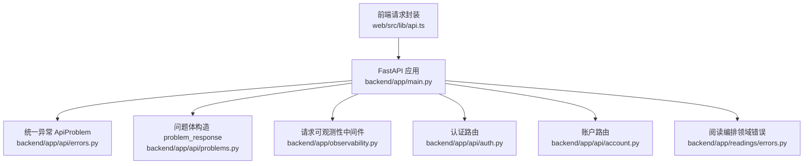
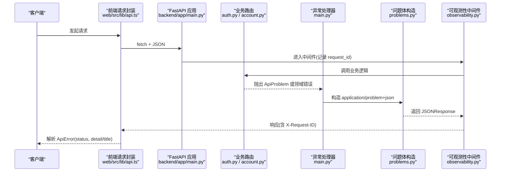
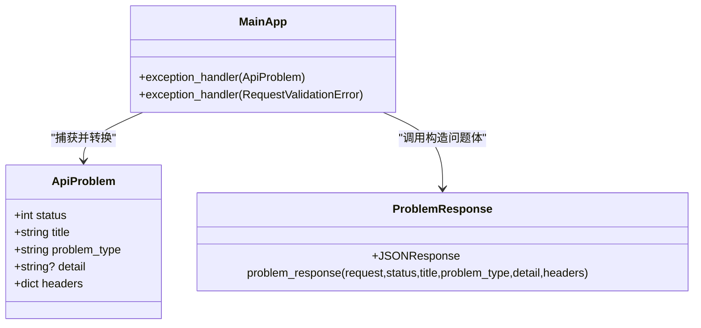
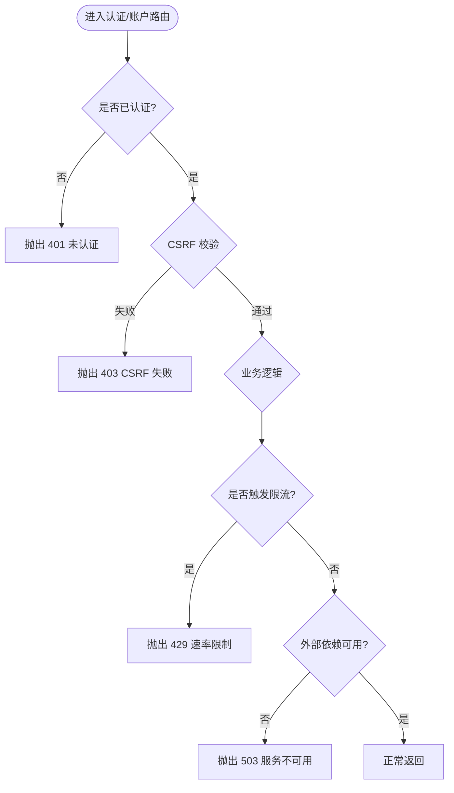
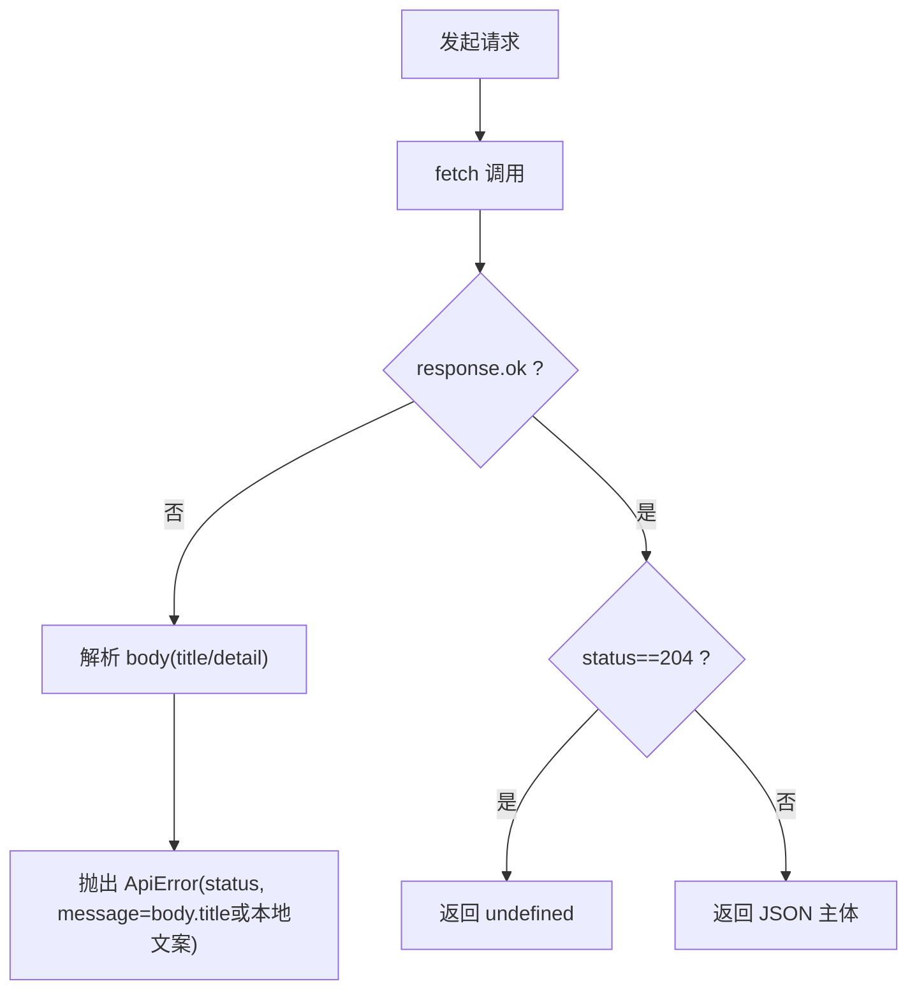
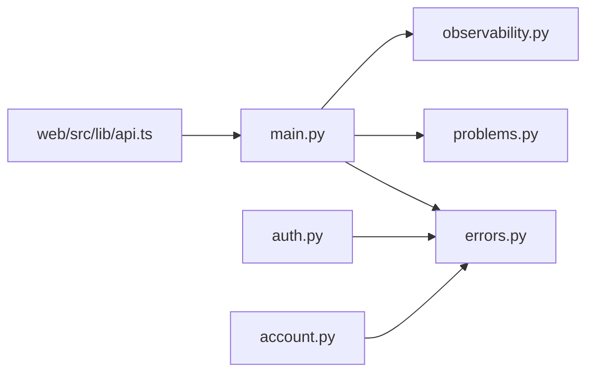

# 错误处理与状态码

<cite>
**本文引用的文件**
- [backend/app/api/errors.py](file://backend/app/api/errors.py)
- [backend/app/api/problems.py](file://backend/app/api/problems.py)
- [backend/app/main.py](file://backend/app/main.py)
- [backend/app/observability.py](file://backend/app/observability.py)
- [backend/app/api/auth.py](file://backend/app/api/auth.py)
- [backend/app/api/account.py](file://backend/app/api/account.py)
- [backend/app/readings/errors.py](file://backend/app/readings/errors.py)
- [web/src/lib/api.ts](file://web/src/lib/api.ts)
</cite>

## 目录
1. [简介](#简介)
2. [项目结构](#项目结构)
3. [核心组件](#核心组件)
4. [架构总览](#架构总览)
5. [详细组件分析](#详细组件分析)
6. [依赖关系分析](#依赖关系分析)
7. [性能考虑](#性能考虑)
8. [故障排查指南](#故障排查指南)
9. [结论](#结论)
10. [附录](#附录)

## 简介
本文件为统一错误处理规范文档，覆盖 HTTP 状态码使用、自定义错误响应结构、业务错误编码、国际化支持策略、常见错误场景示例、错误日志与监控告警集成，以及客户端错误处理模式与用户体验优化建议。目标是让前后端在错误语义、数据结构、可观测性与用户提示上保持一致且可维护。

## 项目结构
后端采用 FastAPI，通过统一的异常类型与问题体（Problem Document）将业务错误标准化；前端通过统一的请求封装解析错误并呈现友好提示。关键位置：
- 后端异常定义与问题体构造：errors.py、problems.py
- 应用启动与全局异常处理器：main.py
- 请求级可观测性（request_id、耗时、状态码）：observability.py
- 认证与账户等路由中的错误抛出示例：auth.py、account.py
- 阅读编排领域错误模型：readings/errors.py
- 前端统一请求封装与错误类：web/src/lib/api.ts

**图表来源**
- [backend/app/main.py:115-136](file://backend/app/main.py#L115-L136)
- [backend/app/api/errors.py:1-16](file://backend/app/api/errors.py#L1-L16)
- [backend/app/api/problems.py:5-27](file://backend/app/api/problems.py#L5-L27)
- [backend/app/observability.py:27-51](file://backend/app/observability.py#L27-L51)
- [backend/app/api/auth.py:69-123](file://backend/app/api/auth.py#L69-L123)
- [backend/app/api/account.py:21-22](file://backend/app/api/account.py#L21-L22)
- [backend/app/readings/errors.py:4-30](file://backend/app/readings/errors.py#L4-L30)

**章节来源**
- [backend/app/main.py:115-136](file://backend/app/main.py#L115-L136)
- [backend/app/api/errors.py:1-16](file://backend/app/api/errors.py#L1-L16)
- [backend/app/api/problems.py:5-27](file://backend/app/api/problems.py#L5-L27)
- [backend/app/observability.py:27-51](file://backend/app/observability.py#L27-L51)
- [backend/app/api/auth.py:69-123](file://backend/app/api/auth.py#L69-L123)
- [backend/app/api/account.py:21-22](file://backend/app/api/account.py#L21-L22)
- [backend/app/readings/errors.py:4-30](file://backend/app/readings/errors.py#L4-L30)
- [web/src/lib/api.ts:244-284](file://web/src/lib/api.ts#L244-L284)

## 核心组件
- 统一异常类型：ApiProblem，携带 status、title、problem_type、detail、headers。
- 统一问题体构造：problem_response，输出 application/problem+json，包含 type、title、status、request_id，可选 detail。
- 全局异常处理器：将 ApiProblem 与 RequestValidationError 映射为标准问题体。
- 请求可观测性：注入 request_id，记录方法、路径、状态码、耗时，并在响应头回传 X-Request-ID。
- 前端错误封装：ApiError 携带 status 与 detail；非 2xx 时优先使用服务端 title/detail，否则降级到本地文案。

**章节来源**
- [backend/app/api/errors.py:1-16](file://backend/app/api/errors.py#L1-L16)
- [backend/app/api/problems.py:5-27](file://backend/app/api/problems.py#L5-L27)
- [backend/app/main.py:115-136](file://backend/app/main.py#L115-L136)
- [backend/app/observability.py:20-51](file://backend/app/observability.py#L20-L51)
- [web/src/lib/api.ts:244-284](file://web/src/lib/api.ts#L244-L284)

## 架构总览
下图展示一次带错误的请求从前端到后端的完整链路，包括异常捕获、问题体生成、可观测性记录与前端解析。

**图表来源**
- [backend/app/main.py:115-136](file://backend/app/main.py#L115-L136)
- [backend/app/api/problems.py:5-27](file://backend/app/api/problems.py#L5-L27)
- [backend/app/observability.py:27-51](file://backend/app/observability.py#L27-L51)
- [backend/app/api/auth.py:69-123](file://backend/app/api/auth.py#L69-L123)
- [backend/app/api/account.py:21-22](file://backend/app/api/account.py#L21-L22)
- [web/src/lib/api.ts:256-284](file://web/src/lib/api.ts#L256-L284)

## 详细组件分析

### 统一异常与问题体
- ApiProblem：用于在业务层显式表达“这是一个可预期的错误”，携带 HTTP 状态码、标题、类型、详情与额外响应头。
- problem_response：将异常转换为标准问题体，固定字段 type、title、status、request_id，可选 detail；媒体类型为 application/problem+json。
- 全局处理器：
  - ApiProblem -> 直接映射为问题体。
  - RequestValidationError -> 统一返回 400 与特定 problem_type。

**图表来源**
- [backend/app/api/errors.py:1-16](file://backend/app/api/errors.py#L1-L16)
- [backend/app/api/problems.py:5-27](file://backend/app/api/problems.py#L5-L27)
- [backend/app/main.py:115-136](file://backend/app/main.py#L115-L136)

**章节来源**
- [backend/app/api/errors.py:1-16](file://backend/app/api/errors.py#L1-L16)
- [backend/app/api/problems.py:5-27](file://backend/app/api/problems.py#L5-L27)
- [backend/app/main.py:115-136](file://backend/app/main.py#L115-L136)

### 认证与权限错误
- 未认证：401，title 明确“需要认证”或“设备会话要求”。
- 权限不足/CSRF 失败：403，title 指明 CSRF 校验失败。
- 重复资源：409，例如访客会话已被认领。
- 速率限制：429，如 OTP 请求或验证尝试过多。
- 服务不可用：503，如 OTP 投递不可用。

**图表来源**
- [backend/app/api/auth.py:69-123](file://backend/app/api/auth.py#L69-L123)
- [backend/app/api/account.py:21-22](file://backend/app/api/account.py#L21-L22)

**章节来源**
- [backend/app/api/auth.py:69-123](file://backend/app/api/auth.py#L69-L123)
- [backend/app/api/account.py:21-22](file://backend/app/api/account.py#L21-L22)

### 数据验证错误
- FastAPI 的 RequestValidationError 被统一拦截，返回 400 与固定 problem_type，便于前端以一致方式提示“请求无效”。

**章节来源**
- [backend/app/main.py:126-136](file://backend/app/main.py#L126-L136)

### 阅读编排领域错误
- 领域错误继承自基类，用于表达运行时传输未知、叙事生成失败、取消、不变量违反等。这些错误应在上层被捕获并映射为合适的 HTTP 状态码与问题体。

**章节来源**
- [backend/app/readings/errors.py:4-30](file://backend/app/readings/errors.py#L4-L30)

### 前端错误处理与用户体验
- 统一请求封装：
  - 非 2xx 响应抛出 ApiError，携带 status 与 detail。
  - 优先使用服务端返回的 title/detail；若缺失则使用本地中文降级文案。
  - 对 204 无内容响应做特殊处理。
- CSRF 自动重试：当收到 403 且消息为 CSRF 校验失败时，清理缓存并重试一次。
- 幂等键：对写操作附加 Idempotency-Key，避免重复提交导致二次计费或副作用。

**图表来源**
- [web/src/lib/api.ts:256-284](file://web/src/lib/api.ts#L256-L284)
- [web/src/lib/api.ts:317-329](file://web/src/lib/api.ts#L317-L329)

**章节来源**
- [web/src/lib/api.ts:244-284](file://web/src/lib/api.ts#L244-L284)
- [web/src/lib/api.ts:317-329](file://web/src/lib/api.ts#L317-L329)

## 依赖关系分析
- main.py 依赖 errors.py、problems.py、observability.py，并注册全局异常处理器。
- 各路由模块（auth.py、account.py 等）依赖 errors.py 抛出 ApiProblem。
- observability.py 作为中间件贯穿所有请求，提供 request_id 与日志。
- 前端 api.ts 依赖后端问题体结构与状态码约定进行错误呈现。

**图表来源**
- [backend/app/main.py:115-136](file://backend/app/main.py#L115-L136)
- [backend/app/api/errors.py:1-16](file://backend/app/api/errors.py#L1-L16)
- [backend/app/api/problems.py:5-27](file://backend/app/api/problems.py#L5-L27)
- [backend/app/observability.py:27-51](file://backend/app/observability.py#L27-L51)
- [backend/app/api/auth.py:69-123](file://backend/app/api/auth.py#L69-L123)
- [backend/app/api/account.py:21-22](file://backend/app/api/account.py#L21-L22)
- [web/src/lib/api.ts:256-284](file://web/src/lib/api.ts#L256-L284)

**章节来源**
- [backend/app/main.py:115-136](file://backend/app/main.py#L115-L136)
- [backend/app/api/errors.py:1-16](file://backend/app/api/errors.py#L1-L16)
- [backend/app/api/problems.py:5-27](file://backend/app/api/problems.py#L5-L27)
- [backend/app/observability.py:27-51](file://backend/app/observability.py#L27-L51)
- [backend/app/api/auth.py:69-123](file://backend/app/api/auth.py#L69-L123)
- [backend/app/api/account.py:21-22](file://backend/app/api/account.py#L21-L22)
- [web/src/lib/api.ts:256-284](file://web/src/lib/api.ts#L256-L284)

## 性能考虑
- 错误响应尽量轻量：仅包含必要字段，避免在错误体中携带大对象。
- 使用 request_id 关联日志与追踪，减少排查成本。
- 对高频错误（如 429、401）在前端做退避与节流，降低重试风暴。
- 对写操作使用幂等键，避免网络抖动导致的重复执行。

[本节为通用指导，不直接引用具体文件]

## 故障排查指南
- 定位请求：通过响应头 X-Request-ID 与服务端日志中的 request_id 关联一次请求的全链路信息。
- 识别错误类型：
  - 4xx：检查 problem_type 与 detail，确认是否为参数错误、认证失败、权限不足、速率限制等。
  - 5xx：关注服务不可用、内部错误、下游依赖超时等，结合 observability 日志分析耗时与状态码。
- 常见问题：
  - CSRF 失败：前端会自动重试一次；若仍失败，检查 Cookie 与跨域配置。
  - OTP 投递不可用：503，需检查邮件适配器与凭据配置。
  - 速率限制：429，提示等待后重试，前端应显示倒计时或禁用按钮。

**章节来源**
- [backend/app/observability.py:20-51](file://backend/app/observability.py#L20-L51)
- [backend/app/api/auth.py:69-123](file://backend/app/api/auth.py#L69-L123)
- [web/src/lib/api.ts:317-329](file://web/src/lib/api.ts#L317-L329)

## 结论
本项目通过统一的异常类型与问题体实现了前后端一致的错误语义；借助请求可观测性实现全链路追踪；前端封装提供了健壮的错误处理与友好的用户体验。建议在新增功能时遵循本文的状态码与错误体规范，确保系统可维护性与可观测性。

[本节为总结，不直接引用具体文件]

## 附录

### HTTP 状态码使用规范
- 4xx 客户端错误
  - 400 请求无效：参数校验失败、目标地址无效等。
  - 401 未认证：缺少或失效的设备会话/登录态。
  - 403 权限不足：CSRF 校验失败、角色不足等。
  - 409 冲突：资源已存在或状态冲突（如访客会话已被认领）。
  - 429 速率限制：OTP 请求或验证尝试过多。
- 5xx 服务器错误
  - 500 内部错误：未预期异常。
  - 503 服务不可用：外部依赖暂时不可用（如 OTP 投递）。

**章节来源**
- [backend/app/api/auth.py:69-123](file://backend/app/api/auth.py#L69-L123)
- [backend/app/api/account.py:21-22](file://backend/app/api/account.py#L21-L22)
- [backend/app/main.py:126-136](file://backend/app/main.py#L126-L136)

### 自定义错误响应结构
- 媒体类型：application/problem+json
- 字段定义：
  - type：问题类型标识（字符串），用于分类与前端路由。
  - title：人类可读标题（字符串），用于 UI 提示。
  - status：HTTP 状态码（整数）。
  - request_id：本次请求的唯一标识（字符串），用于日志关联。
  - detail：可选详情（字符串），用于更具体的错误说明。

**章节来源**
- [backend/app/api/problems.py:5-27](file://backend/app/api/problems.py#L5-L27)

### 业务错误编码与国际化
- 编码规则：
  - 使用 problem_type 区分错误类别（如 invalid-request、otp-rate-limited、guest-session-claimed）。
  - 使用 title 提供面向用户的简短提示，detail 提供技术细节。
- 国际化建议：
  - 服务端返回的 title/detail 可作为多语言源；前端按 locale 选择展示文案。
  - 当前前端在非 2xx 时优先使用服务端 title，缺失时回退到本地中文文案，保证可用性。

**章节来源**
- [backend/app/main.py:126-136](file://backend/app/main.py#L126-L136)
- [web/src/lib/api.ts:256-284](file://web/src/lib/api.ts#L256-L284)

### 常见错误场景示例
- 认证失败：401，title 指示需要认证。
- 权限不足/CSRF 失败：403，title 指示 CSRF 校验失败。
- 数据验证错误：400，problem_type 指示请求无效。
- 速率限制：429，提示等待后重试。
- 服务不可用：503，外部依赖不可用。

**章节来源**
- [backend/app/api/auth.py:69-123](file://backend/app/api/auth.py#L69-L123)
- [backend/app/api/account.py:21-22](file://backend/app/api/account.py#L21-L22)
- [backend/app/main.py:126-136](file://backend/app/main.py#L126-L136)

### 错误日志与监控告警
- 请求级日志：记录 event、request_id、method、path、status、duration_ms。
- 响应头：X-Request-ID 便于前端与后端日志关联。
- 告警建议：
  - 针对 5xx 比例突增设置阈值告警。
  - 针对 429 频繁触发进行限流策略调优告警。
  - 针对 401/403 异常升高进行安全事件告警。

**章节来源**
- [backend/app/observability.py:27-51](file://backend/app/observability.py#L27-L51)

### 客户端错误处理推荐模式
- 统一封装：所有网络请求走统一函数，集中处理错误与重试。
- 友好提示：优先使用服务端 title/detail；缺失时使用本地化文案。
- 幂等写操作：为写请求附加 Idempotency-Key，避免重复提交。
- CSRF 自动重试：遇到 403 且为 CSRF 失败时，清理缓存并重试一次。
- 限流体验：429 时禁用按钮并显示倒计时或提示信息。

**章节来源**
- [web/src/lib/api.ts:256-284](file://web/src/lib/api.ts#L256-L284)
- [web/src/lib/api.ts:317-329](file://web/src/lib/api.ts#L317-L329)
- [web/src/lib/api.ts:387-392](file://web/src/lib/api.ts#L387-L392)