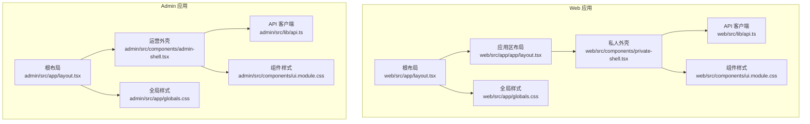
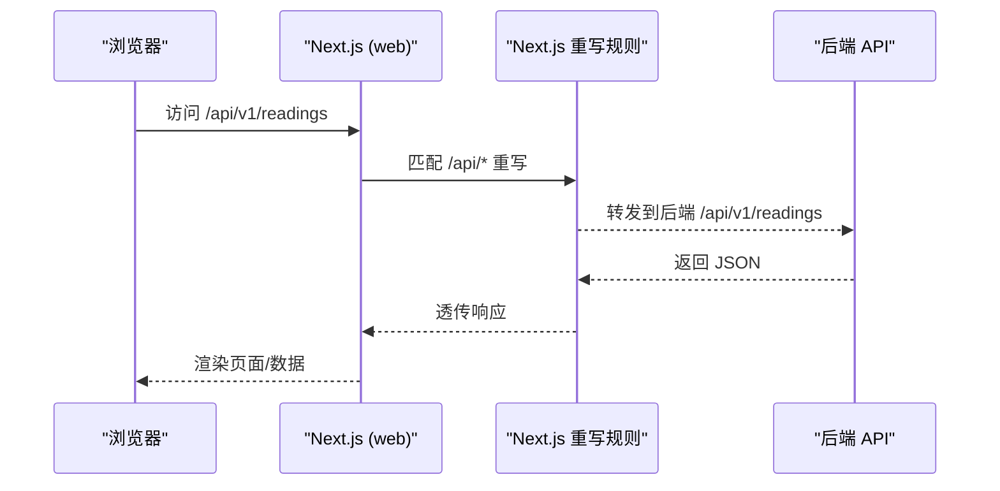
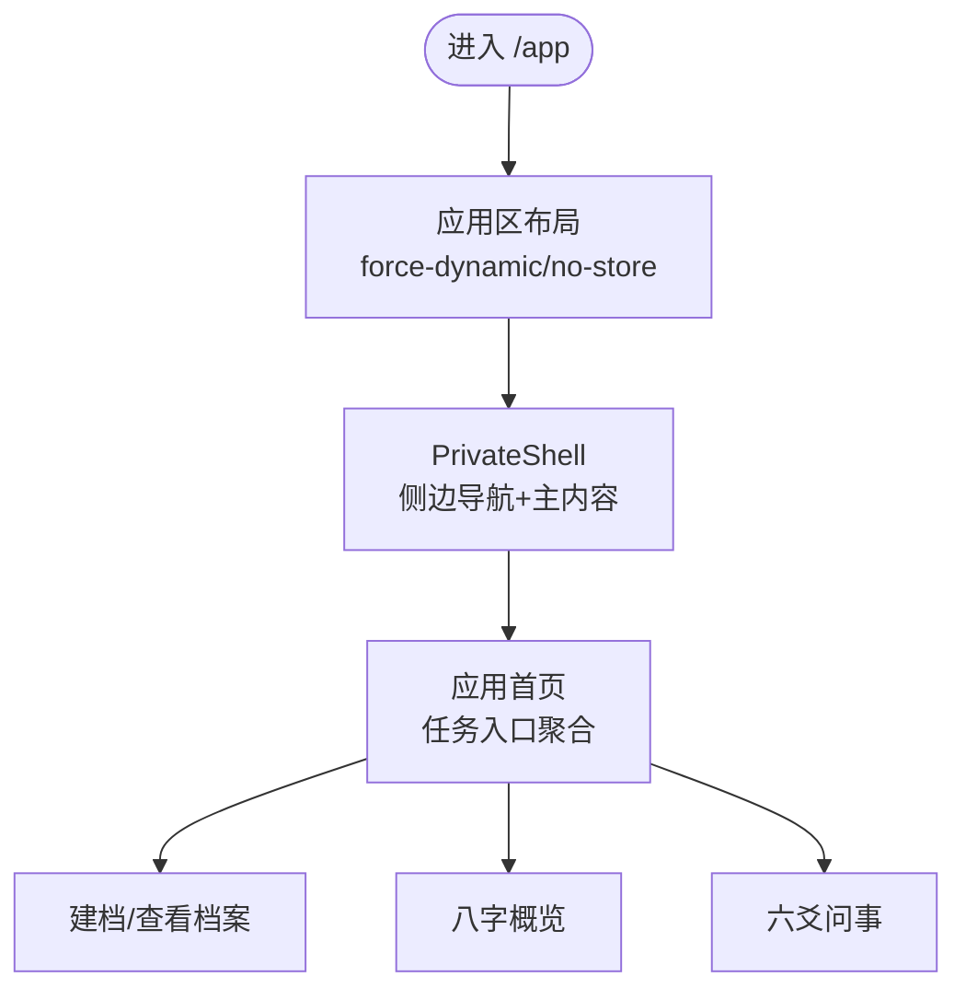
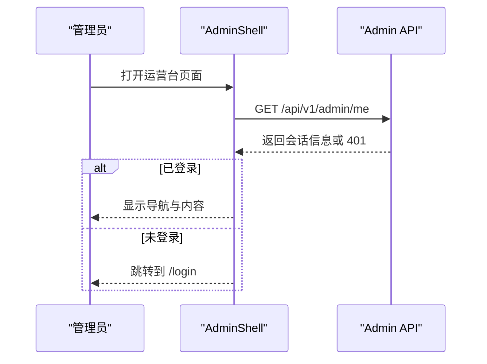
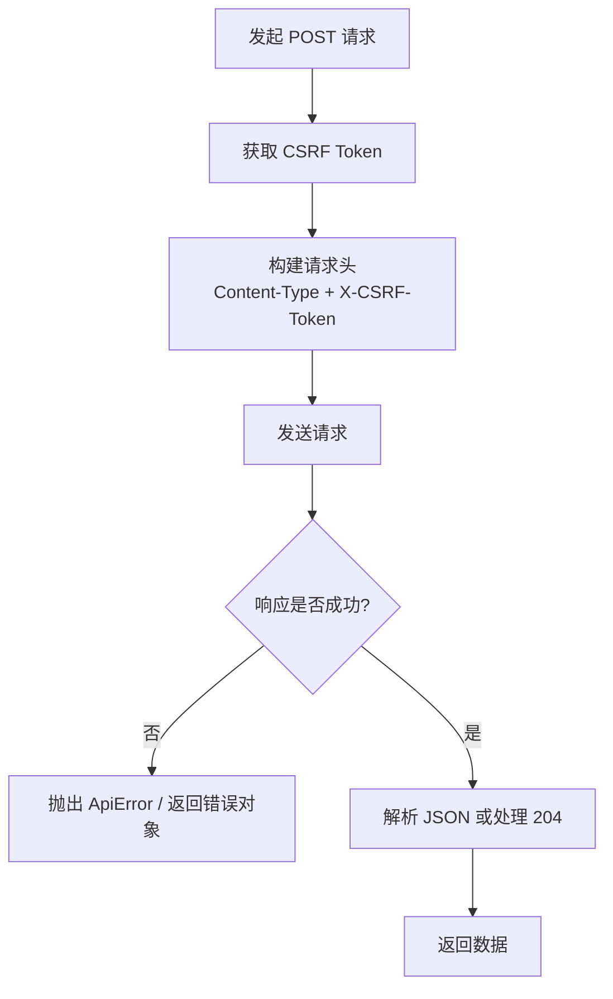
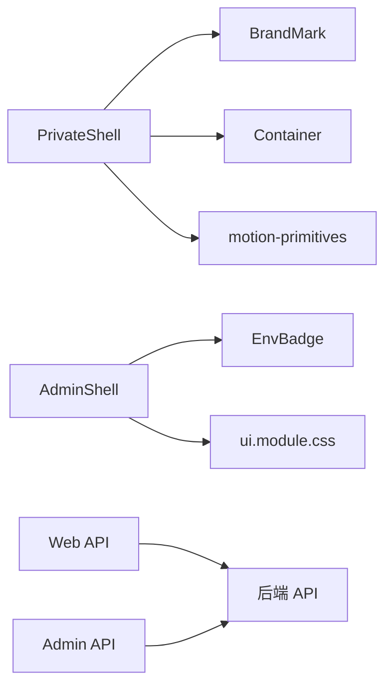

# 前端架构

<cite>
**本文引用的文件**
- [web/package.json](file://web/package.json)
- [admin/package.json](file://admin/package.json)
- [web/next.config.ts](file://web/next.config.ts)
- [admin/next.config.ts](file://admin/next.config.ts)
- [web/src/app/layout.tsx](file://web/src/app/layout.tsx)
- [admin/src/app/layout.tsx](file://admin/src/app/layout.tsx)
- [web/src/app/app/layout.tsx](file://web/src/app/app/layout.tsx)
- [web/src/components/private-shell.tsx](file://web/src/components/private-shell.tsx)
- [admin/src/components/admin-shell.tsx](file://admin/src/components/admin-shell.tsx)
- [web/src/lib/api.ts](file://web/src/lib/api.ts)
- [admin/src/lib/api.ts](file://admin/src/lib/api.ts)
- [web/src/app/globals.css](file://web/src/app/globals.css)
- [admin/src/app/globals.css](file://admin/src/app/globals.css)
- [web/src/components/ui.module.css](file://web/src/components/ui.module.css)
- [admin/src/components/ui.module.css](file://admin/src/components/ui.module.css)
- [web/src/app/app/page.tsx](file://web/src/app/app/page.tsx)
</cite>

## 目录
1. [简介](#简介)
2. [项目结构](#项目结构)
3. [核心组件](#核心组件)
4. [架构总览](#架构总览)
5. [详细组件分析](#详细组件分析)
6. [依赖关系分析](#依赖关系分析)
7. [性能与构建优化](#性能与构建优化)
8. [故障排查指南](#故障排查指南)
9. [结论](#结论)
10. [附录：开发规范与最佳实践](#附录开发规范与最佳实践)

## 简介
本仓库包含两个独立的 Next.js 应用：面向用户的 web（个人命理档案与解读）与管理后台 admin（运营台）。两者均基于 Next.js 16 + TypeScript，采用 App Router 组织页面与布局，通过统一的样式变量体系与可访问性优先的组件策略实现一致的交互体验。后端通过 Next rewrites 将 /api 请求代理到同一后端服务，统一使用 Cookie 会话与 CSRF 保护。

## 项目结构
- 双应用分离：web 与 admin 各自拥有独立 package.json、Next 配置、全局样式与组件库。
- App Router 路由：
  - web：根布局定义站点元信息；/app 为私有应用区，嵌套 layout 强制动态渲染并包裹 PrivateShell；公共页面位于根 app 目录。
  - admin：根布局定义运营台元信息与 robots 控制；页面按功能模块划分（登录、用户、订单、退款、解读任务、审计）。
- 样式系统：
  - 全局 CSS 变量集中管理色彩、间距、圆角、阴影与字体族，确保品牌一致性。
  - 组件级 CSS Modules 提供按钮、字段、卡片、标签等基础 UI 能力。
- API 客户端：
  - web 封装了完整的业务接口类型与调用方法，内置 CSRF 获取与幂等键支持。
  - admin 封装轻量 fetch 工具，自动注入 CSRF 头并返回统一结果对象。

**图表来源**
- [web/src/app/layout.tsx:1-33](file://web/src/app/layout.tsx#L1-L33)
- [web/src/app/app/layout.tsx:1-19](file://web/src/app/app/layout.tsx#L1-L19)
- [web/src/components/private-shell.tsx:1-88](file://web/src/components/private-shell.tsx#L1-L88)
- [web/src/lib/api.ts:1-489](file://web/src/lib/api.ts#L1-L489)
- [web/src/app/globals.css:1-177](file://web/src/app/globals.css#L1-L177)
- [web/src/components/ui.module.css:1-92](file://web/src/components/ui.module.css#L1-L92)
- [admin/src/app/layout.tsx:1-38](file://admin/src/app/layout.tsx#L1-L38)
- [admin/src/components/admin-shell.tsx:1-116](file://admin/src/components/admin-shell.tsx#L1-L116)
- [admin/src/lib/api.ts:1-80](file://admin/src/lib/api.ts#L1-L80)
- [admin/src/app/globals.css:1-177](file://admin/src/app/globals.css#L1-L177)
- [admin/src/components/ui.module.css:1-231](file://admin/src/components/ui.module.css#L1-L231)

**章节来源**
- [web/package.json:1-46](file://web/package.json#L1-L46)
- [admin/package.json:1-34](file://admin/package.json#L1-L34)
- [web/next.config.ts:1-66](file://web/next.config.ts#L1-L66)
- [admin/next.config.ts:1-65](file://admin/next.config.ts#L1-L65)

## 核心组件
- 根布局与站点元信息：
  - web 根布局设置语言、主题色、标题模板与描述；viewport 启用设备宽度与浅色模式。
  - admin 根布局设置运营台标题、robots 禁止索引与缓存，强调内部用途。
- 应用壳层：
  - PrivateShell：提供侧边导航、主内容区域、跳过链接与移动端导航，结合 motion 组件进行路由进入动效。
  - AdminShell：负责管理员会话校验、导航、环境标识、退出登录与错误提示。
- 样式系统：
  - 全局 CSS 变量统一色彩、间距、圆角、阴影与字体族，保证跨组件一致性与可维护性。
  - 组件级 CSS Modules 提供按钮、字段、卡片、标签等原子样式，便于组合复用。

**章节来源**
- [web/src/app/layout.tsx:1-33](file://web/src/app/layout.tsx#L1-L33)
- [admin/src/app/layout.tsx:1-38](file://admin/src/app/layout.tsx#L1-L38)
- [web/src/components/private-shell.tsx:1-88](file://web/src/components/private-shell.tsx#L1-L88)
- [admin/src/components/admin-shell.tsx:1-116](file://admin/src/components/admin-shell.tsx#L1-L116)
- [web/src/app/globals.css:1-177](file://web/src/app/globals.css#L1-L177)
- [admin/src/app/globals.css:1-177](file://admin/src/app/globals.css#L1-L177)
- [web/src/components/ui.module.css:1-92](file://web/src/components/ui.module.css#L1-L92)
- [admin/src/components/ui.module.css:1-231](file://admin/src/components/ui.module.css#L1-L231)

## 架构总览
- 路由与布局：
  - Web 应用以 /app 作为私有应用区，layout 强制动态渲染并禁用缓存，确保用户数据实时性。
  - Admin 应用以功能模块划分页面，登录页处理认证，其他页面由 AdminShell 校验会话。
- 安全与头部：
  - Next 配置中统一设置 CSP、Referrer-Policy、Permissions-Policy、X-Frame-Options 等安全响应头。
  - /api 路径重写至后端，避免跨域问题；私有路由附加 no-store 与 noindex 等缓存控制。
- 前后端通信：
  - Web 客户端封装 CSRF 获取、幂等键、错误分类与重试逻辑；Admin 客户端统一返回 ok/data 或 ok=false 的结构。
  - 会话通过 Cookie 维持，敏感操作携带 CSRF Token 头。

**图表来源**
- [web/next.config.ts:27-62](file://web/next.config.ts#L27-L62)
- [admin/next.config.ts:27-61](file://admin/next.config.ts#L27-L61)

**章节来源**
- [web/src/app/app/layout.tsx:1-19](file://web/src/app/app/layout.tsx#L1-L19)
- [web/next.config.ts:1-66](file://web/next.config.ts#L1-L66)
- [admin/next.config.ts:1-65](file://admin/next.config.ts#L1-L65)

## 详细组件分析

### 用户界面（web）架构与设计原则
- 应用区布局：
  - /app 布局强制动态渲染与无缓存，确保用户状态始终最新。
  - 通过 PrivateShell 提供侧边导航、主内容区与移动端适配。
- 首页与流程入口：
  - 应用首页聚合任务入口（建档、八字概览、六爻问事），引导用户进入真实流程。
- 可访问性与动效：
  - 提供“跳到主要内容”的跳过链接，侧边导航使用 aria-current 指示当前页面。
  - 使用 motion 组件进行路由进入动画，提升过渡体验。

**图表来源**
- [web/src/app/app/layout.tsx:1-19](file://web/src/app/app/layout.tsx#L1-L19)
- [web/src/components/private-shell.tsx:1-88](file://web/src/components/private-shell.tsx#L1-L88)
- [web/src/app/app/page.tsx:1-80](file://web/src/app/app/page.tsx#L1-L80)

**章节来源**
- [web/src/app/app/layout.tsx:1-19](file://web/src/app/app/layout.tsx#L1-L19)
- [web/src/components/private-shell.tsx:1-88](file://web/src/components/private-shell.tsx#L1-L88)
- [web/src/app/app/page.tsx:1-80](file://web/src/app/app/page.tsx#L1-L80)

### 管理后台（admin）架构与设计原则
- 会话校验与导航：
  - AdminShell 在挂载时调用 /api/v1/admin/me 校验身份，未授权跳转登录页。
  - 顶部显示环境标识、员工信息与退出按钮；侧边导航覆盖总览、用户、订单、退款、解读任务、审计。
- 错误与提示：
  - 加载失败时展示错误提示；退出登录后重定向到登录页。
- 样式与表单：
  - 使用统一的按钮、字段、卡片、标签样式，保持运营台视觉一致性。

**图表来源**
- [admin/src/components/admin-shell.tsx:1-116](file://admin/src/components/admin-shell.tsx#L1-L116)
- [admin/src/lib/api.ts:1-80](file://admin/src/lib/api.ts#L1-L80)

**章节来源**
- [admin/src/components/admin-shell.tsx:1-116](file://admin/src/components/admin-shell.tsx#L1-L116)
- [admin/src/lib/api.ts:1-80](file://admin/src/lib/api.ts#L1-L80)

### 状态管理策略
- 无全局状态库：
  - 通过 Next 布局与组件本地状态管理页面级状态；私有应用区禁用缓存以确保数据新鲜度。
- 会话与权限：
  - Web 应用通过 Cookie 与会话维持登录态；Admin 应用通过 /api/v1/admin/me 校验身份。
- 数据流：
  - 页面发起 API 请求，客户端封装统一错误处理与重试逻辑；成功后更新组件状态并渲染。

**章节来源**
- [web/src/app/app/layout.tsx:1-19](file://web/src/app/app/layout.tsx#L1-L19)
- [admin/src/components/admin-shell.tsx:1-116](file://admin/src/components/admin-shell.tsx#L1-L116)

### API 客户端封装
- Web 客户端：
  - 提供类型化接口与错误类；自动获取 CSRF Token，支持幂等键与重试。
  - 统一处理 204 空响应与 JSON 解析异常；抛出 ApiError 携带状态码与详情。
- Admin 客户端：
  - 轻量 fetch 封装，自动注入 content-type 与 CSRF 头；返回 {ok, data} 或 {ok, status, title}。

**图表来源**
- [web/src/lib/api.ts:214-288](file://web/src/lib/api.ts#L214-L288)
- [admin/src/lib/api.ts:43-79](file://admin/src/lib/api.ts#L43-L79)

**章节来源**
- [web/src/lib/api.ts:1-489](file://web/src/lib/api.ts#L1-L489)
- [admin/src/lib/api.ts:1-80](file://admin/src/lib/api.ts#L1-L80)

### 错误处理机制
- 统一错误类：
  - Web 客户端定义 ApiError，携带状态码与详情；Admin 客户端返回结构化错误对象。
- 重试与恢复：
  - Web 客户端在 CSRF 验证失败时清除缓存并重试；幂等键防止重复提交。
- 用户反馈：
  - AdminShell 在加载失败时展示错误提示；Web 应用通过组件内错误边界与提示组件反馈。

**章节来源**
- [web/src/lib/api.ts:202-248](file://web/src/lib/api.ts#L202-L248)
- [admin/src/components/admin-shell.tsx:36-59](file://admin/src/components/admin-shell.tsx#L36-L59)

### 组件库与自定义样式系统
- Radix UI：
  - Web 应用引入 Radix UI 可访问性组件，配合 CSS Modules 定制外观。
- 样式变量：
  - 全局 CSS 变量定义色彩、间距、圆角、阴影与字体族，确保品牌一致性。
- 组件样式：
  - 按钮、字段、卡片、标签等原子样式通过 CSS Modules 管理，便于组合与复用。

**章节来源**
- [web/package.json:17-29](file://web/package.json#L17-L29)
- [web/src/app/globals.css:1-177](file://web/src/app/globals.css#L1-L177)
- [web/src/components/ui.module.css:1-92](file://web/src/components/ui.module.css#L1-L92)

### 响应式设计与移动端适配
- 视口与主题：
  - 根布局设置 viewport 与 themeColor，启用浅色模式。
- 媒体查询：
  - 容器宽度随屏幕尺寸调整；按钮与字段在不同尺寸下保持一致的可点击区域。
- 减少动效：
  - 通过 prefers-reduced-motion 禁用不必要的动画，提升可访问性。

**章节来源**
- [web/src/app/layout.tsx:19-24](file://web/src/app/layout.tsx#L19-L24)
- [web/src/components/ui.module.css:73-91](file://web/src/components/ui.module.css#L73-L91)
- [web/src/app/globals.css:167-177](file://web/src/app/globals.css#L167-L177)

### 前后端通信协议、数据同步与缓存策略
- 通信协议：
  - 通过 Next rewrites 将 /api 请求代理到后端；统一使用 JSON 与 Cookie 会话。
- 数据同步：
  - 私有应用区禁用缓存，确保用户数据实时性；列表与详情通过轮询或事件驱动更新。
- 缓存策略：
  - 全局响应头设置 Cache-Control 与 Robots 控制；/api 路径强制 no-store。

**章节来源**
- [web/next.config.ts:27-62](file://web/next.config.ts#L27-L62)
- [admin/next.config.ts:27-61](file://admin/next.config.ts#L27-L61)

### 开发工具链配置、构建优化与部署流程
- 脚本与依赖：
  - Web 与 Admin 分别提供 dev、build、start、lint、typecheck、test 脚本；Node 版本要求 >=22。
- 构建输出：
  - Next 配置 output 为 standalone，便于容器化部署。
- 部署：
  - 通过 Docker 镜像运行 Next 应用；Nginx 反向代理到后端与前端。

**章节来源**
- [web/package.json:9-15](file://web/package.json#L9-L15)
- [admin/package.json:9-14](file://admin/package.json#L9-L14)
- [web/next.config.ts:27-30](file://web/next.config.ts#L27-L30)
- [admin/next.config.ts:27-30](file://admin/next.config.ts#L27-L30)

## 依赖关系分析
- 应用间依赖：
  - Web 与 Admin 共享设计系统与样式变量，但代码隔离，避免耦合。
- 组件依赖：
  - PrivateShell 依赖 BrandMark、Container、motion-primitives；AdminShell 依赖 EnvBadge 与 ui.module.css。
- API 依赖：
  - Web 客户端依赖后端 /api/v1/*；Admin 客户端依赖 /api/v1/admin/*。

**图表来源**
- [web/src/components/private-shell.tsx:1-88](file://web/src/components/private-shell.tsx#L1-L88)
- [admin/src/components/admin-shell.tsx:1-116](file://admin/src/components/admin-shell.tsx#L1-L116)
- [web/src/lib/api.ts:1-489](file://web/src/lib/api.ts#L1-L489)
- [admin/src/lib/api.ts:1-80](file://admin/src/lib/api.ts#L1-L80)

**章节来源**
- [web/src/components/private-shell.tsx:1-88](file://web/src/components/private-shell.tsx#L1-L88)
- [admin/src/components/admin-shell.tsx:1-116](file://admin/src/components/admin-shell.tsx#L1-L116)
- [web/src/lib/api.ts:1-489](file://web/src/lib/api.ts#L1-L489)
- [admin/src/lib/api.ts:1-80](file://admin/src/lib/api.ts#L1-L80)

## 性能与构建优化
- 静态资源与字体：
  - 使用可变字体（Noto Sans SC Variable、Noto Serif SC Variable）减少字体加载体积。
- 缓存控制：
  - 私有路由与 /api 路径强制 no-store，避免缓存陈旧数据。
- 构建产物：
  - standalone 输出便于容器化部署，减少运行时依赖。

**章节来源**
- [web/package.json:17-29](file://web/package.json#L17-L29)
- [web/next.config.ts:27-62](file://web/next.config.ts#L27-L62)
- [admin/next.config.ts:27-61](file://admin/next.config.ts#L27-L61)

## 故障排查指南
- CSRF 验证失败：
  - Web 客户端自动清除缓存并重试；检查 Cookie 与后端会话是否正确设置。
- 会话过期：
  - AdminShell 检测到 401 时跳转登录页；确认后端会话有效期与 Cookie 域名设置。
- 网络错误：
  - 客户端统一捕获并抛出错误；检查后端服务状态与网络连通性。

**章节来源**
- [web/src/lib/api.ts:275-288](file://web/src/lib/api.ts#L275-L288)
- [admin/src/components/admin-shell.tsx:36-59](file://admin/src/components/admin-shell.tsx#L36-L59)

## 结论
本项目通过双应用分离、App Router 组织、统一样式变量与安全头部策略，实现了清晰的前端架构。Web 应用聚焦用户流程与可访问性，Admin 应用专注运营管理与会话控制。API 客户端封装简化了前后端通信，错误处理与重试机制提升了健壮性。整体设计兼顾性能、安全与可维护性，适合持续迭代与扩展。

## 附录：开发规范与最佳实践
- 组件开发：
  - 使用 CSS Modules 管理样式，遵循原子化设计；按钮、字段、卡片等组件保持最小职责。
- 路由与布局：
  - 私有应用区强制动态渲染与无缓存；公共页面合理使用静态生成与增量再生成。
- 安全与隐私：
  - 所有 /api 请求携带 CSRF Token；敏感路由附加 no-store 与 noindex。
- 可访问性：
  - 提供跳过链接与 aria 属性；尊重 prefers-reduced-motion 设置。
- 测试与质量：
  - 使用 ESLint 与 TypeScript 类型检查；Vitest 进行单元测试与集成测试。

**章节来源**
- [web/src/components/ui.module.css:1-92](file://web/src/components/ui.module.css#L1-L92)
- [admin/src/components/ui.module.css:1-231](file://admin/src/components/ui.module.css#L1-L231)
- [web/src/app/app/layout.tsx:1-19](file://web/src/app/app/layout.tsx#L1-L19)
- [web/next.config.ts:27-62](file://web/next.config.ts#L27-L62)
- [web/package.json:9-15](file://web/package.json#L9-L15)