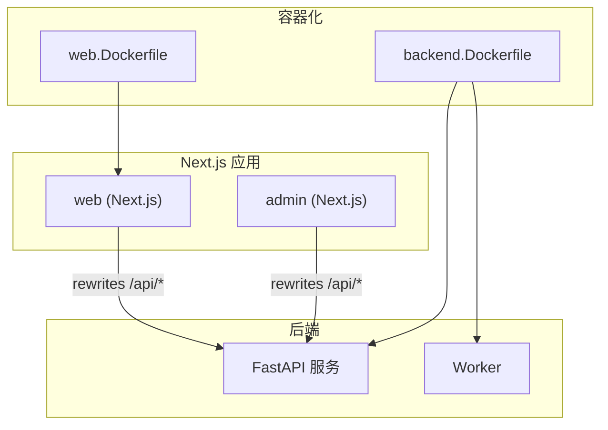
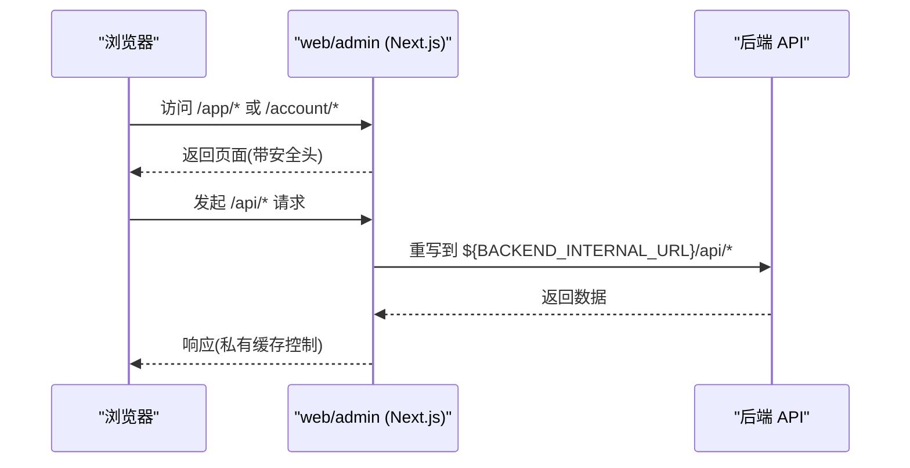
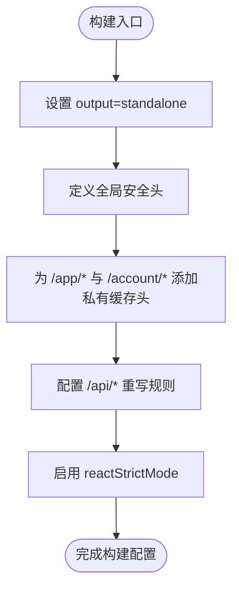
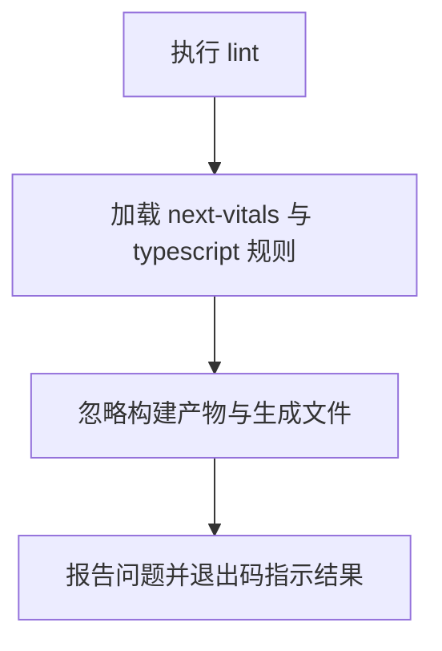
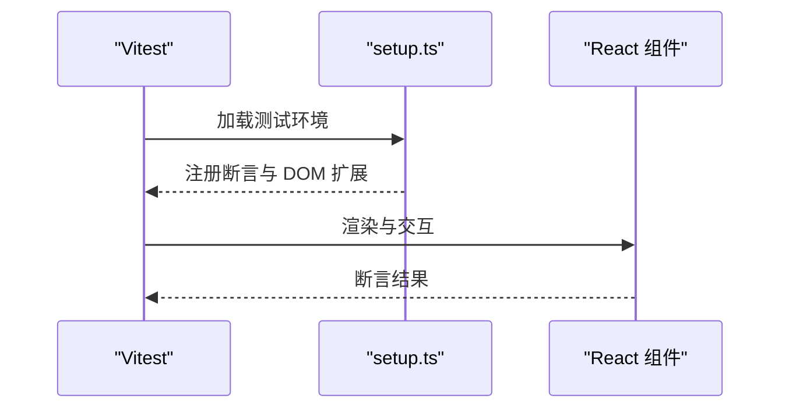
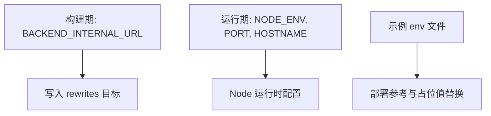
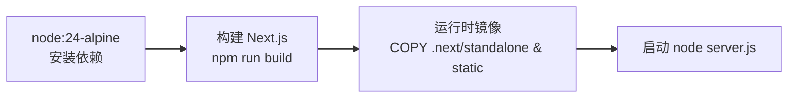
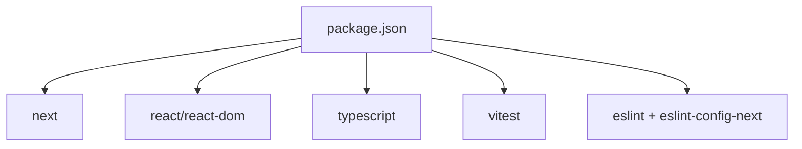

# 构建配置

<cite>
**本文引用的文件**
- [web/next.config.ts](file://web/next.config.ts)
- [admin/next.config.ts](file://admin/next.config.ts)
- [web/tsconfig.json](file://web/tsconfig.json)
- [admin/tsconfig.json](file://admin/tsconfig.json)
- [web/eslint.config.mjs](file://web/eslint.config.mjs)
- [admin/eslint.config.mjs](file://admin/eslint.config.mjs)
- [web/vitest.config.ts](file://web/vitest.config.ts)
- [web/package.json](file://web/package.json)
- [infra/docker/web.Dockerfile](file://infra/docker/web.Dockerfile)
- [infra/docker/backend.Dockerfile](file://infra/docker/backend.Dockerfile)
- [infra/fateradar-test.env.example](file://infra/fateradar-test.env.example)
- [web/src/test/setup.ts](file://web/src/test/setup.ts)
</cite>

## 目录
1. [简介](#简介)
2. [项目结构](#项目结构)
3. [核心组件](#核心组件)
4. [架构总览](#架构总览)
5. [详细组件分析](#详细组件分析)
6. [依赖关系分析](#依赖关系分析)
7. [性能考虑](#性能考虑)
8. [故障排查指南](#故障排查指南)
9. [结论](#结论)
10. [附录](#附录)

## 简介
本文件聚焦于 Next.js 前端（web 与 admin）的构建配置与优化，涵盖代码分割、资源优化、安全头、环境变量注入、TypeScript 类型检查、ESLint 规则、测试框架与环境、Docker 构建与部署、以及常见问题的定位与修复。目标是帮助开发者快速理解并调整构建流程以满足生产质量与性能要求。

## 项目结构
本项目包含两个 Next.js 应用：
- web：面向用户的前端应用
- admin：管理后台前端应用

两者均使用 Next.js 的 standalone 输出模式，并通过 rewrites 将 /api/* 请求代理到后端服务。构建产物通过 Docker 多阶段镜像打包，运行时以 Node 进程启动。



图表来源
- [web/next.config.ts:27-63](file://web/next.config.ts#L27-L63)
- [admin/next.config.ts:27-62](file://admin/next.config.ts#L27-L62)
- [infra/docker/web.Dockerfile:1-27](file://infra/docker/web.Dockerfile#L1-L27)
- [infra/docker/backend.Dockerfile:1-23](file://infra/docker/backend.Dockerfile#L1-L23)

章节来源
- [web/next.config.ts:27-63](file://web/next.config.ts#L27-L63)
- [admin/next.config.ts:27-62](file://admin/next.config.ts#L27-L62)
- [infra/docker/web.Dockerfile:1-27](file://infra/docker/web.Dockerfile#L1-L27)
- [infra/docker/backend.Dockerfile:1-23](file://infra/docker/backend.Dockerfile#L1-L23)

## 核心组件
- Next.js 构建配置：standalone 输出、安全响应头、CORS/重写规则、严格模式
- TypeScript 编译选项：严格模式、模块解析、增量编译、路径别名
- ESLint 规则：基于 next-vitals 与 typescript 的规则集
- 测试框架：Vitest + jsdom + React 插件
- 环境变量：构建期注入 BACKEND_INTERNAL_URL；运行期由 Nginx/反向代理转发
- 容器化：多阶段构建，最小化运行时镜像

章节来源
- [web/next.config.ts:27-63](file://web/next.config.ts#L27-L63)
- [admin/next.config.ts:27-62](file://admin/next.config.ts#L27-L62)
- [web/tsconfig.json:1-31](file://web/tsconfig.json#L1-L31)
- [admin/tsconfig.json:1-30](file://admin/tsconfig.json#L1-L30)
- [web/eslint.config.mjs:1-11](file://web/eslint.config.mjs#L1-L11)
- [admin/eslint.config.mjs:1-11](file://admin/eslint.config.mjs#L1-L11)
- [web/vitest.config.ts:1-21](file://web/vitest.config.ts#L1-L21)
- [web/package.json:9-15](file://web/package.json#L9-L15)
- [infra/docker/web.Dockerfile:1-27](file://infra/docker/web.Dockerfile#L1-L27)
- [infra/docker/backend.Dockerfile:1-23](file://infra/docker/backend.Dockerfile#L1-L23)

## 架构总览
Next.js 应用在构建时将 BACKEND_INTERNAL_URL 内联到静态配置中，并在运行时通过 rewrites 将 /api/* 请求转发至后端。所有页面默认启用安全响应头，敏感路由额外设置私有缓存策略。



图表来源
- [web/next.config.ts:31-60](file://web/next.config.ts#L31-L60)
- [admin/next.config.ts:31-59](file://admin/next.config.ts#L31-L59)

章节来源
- [web/next.config.ts:31-60](file://web/next.config.ts#L31-L60)
- [admin/next.config.ts:31-59](file://admin/next.config.ts#L31-L59)

## 详细组件分析

### Next.js 构建与安全
- 输出模式：standalone，便于容器化部署
- 安全头：统一设置 CSP、Referrer-Policy、Permissions-Policy、X-Content-Type-Options、X-Frame-Options、Cross-Origin-Opener-Policy
- 私有路由：/app/* 与 /account/* 附加 Cache-Control 私有策略与 robots 标签
- API 代理：/api/* 重写至 BACKEND_INTERNAL_URL
- 严格模式：reactStrictMode 开启



图表来源
- [web/next.config.ts:27-63](file://web/next.config.ts#L27-L63)
- [admin/next.config.ts:27-62](file://admin/next.config.ts#L27-L62)

章节来源
- [web/next.config.ts:27-63](file://web/next.config.ts#L27-L63)
- [admin/next.config.ts:27-62](file://admin/next.config.ts#L27-L62)

### TypeScript 配置与类型检查
- 目标与库：ES2022，DOM 与迭代器支持
- 严格模式：strict=true，noEmit=true（仅类型检查）
- 模块解析：bundler 模式，isolatedModules，jsx react-jsx
- 路径别名：@/* -> src/*
- 增量编译：incremental=true
- 类型声明：包含 vitest/globals

```mermaid
classDiagram
class TSConfig {
+target : "ES2022"
+lib : ["dom","dom.iterable","es2022"]
+strict : true
+noEmit : true
+moduleResolution : "bundler"
+jsx : "react-jsx"
+paths : {"@/*" : "./src/*"}
+types : ["vitest/globals"]
}
```

图表来源
- [web/tsconfig.json:1-31](file://web/tsconfig.json#L1-L31)
- [admin/tsconfig.json:1-30](file://admin/tsconfig.json#L1-L30)

章节来源
- [web/tsconfig.json:1-31](file://web/tsconfig.json#L1-L31)
- [admin/tsconfig.json:1-30](file://admin/tsconfig.json#L1-L30)

### ESLint 规则与代码质量
- 规则集：next-vitals 与 typescript 规则
- 忽略目录：.next、out、coverage、next-env.d.ts
- 脚本：lint 命令执行 eslint 并限制警告数量



图表来源
- [web/eslint.config.mjs:1-11](file://web/eslint.config.mjs#L1-L11)
- [admin/eslint.config.mjs:1-11](file://admin/eslint.config.mjs#L1-L11)
- [web/package.json:13-14](file://web/package.json#L13-L14)

章节来源
- [web/eslint.config.mjs:1-11](file://web/eslint.config.mjs#L1-L11)
- [admin/eslint.config.mjs:1-11](file://admin/eslint.config.mjs#L1-L11)
- [web/package.json:13-14](file://web/package.json#L13-L14)

### 测试框架与环境
- 框架：Vitest + @vitejs/plugin-react
- 环境：jsdom，全局 API，CSS 支持，恢复 mock
- 初始化：setupFiles 指向 src/test/setup.ts
- 路径别名：@ -> src



图表来源
- [web/vitest.config.ts:1-21](file://web/vitest.config.ts#L1-L21)
- [web/src/test/setup.ts:1-2](file://web/src/test/setup.ts#L1-L2)

章节来源
- [web/vitest.config.ts:1-21](file://web/vitest.config.ts#L1-L21)
- [web/src/test/setup.ts:1-2](file://web/src/test/setup.ts#L1-L2)

### 环境变量管理与部署
- 构建期变量：BACKEND_INTERNAL_URL 在构建时写入 Next.js 配置，决定 API 重写目标
- 运行期变量：NODE_ENV、PORT、HOSTNAME、NEXT_TELEMETRY_DISABLED
- 示例环境：提供测试环境示例文件，说明后端与 Worker 共享的环境变量



图表来源
- [web/next.config.ts:3-5](file://web/next.config.ts#L3-L5)
- [infra/docker/web.Dockerfile:8-12](file://infra/docker/web.Dockerfile#L8-L12)
- [infra/fateradar-test.env.example:1-45](file://infra/fateradar-test.env.example#L1-L45)

章节来源
- [web/next.config.ts:3-5](file://web/next.config.ts#L3-L5)
- [infra/docker/web.Dockerfile:8-12](file://infra/docker/web.Dockerfile#L8-L12)
- [infra/fateradar-test.env.example:1-45](file://infra/fateradar-test.env.example#L1-L45)

### 容器化与构建优化
- 多阶段构建：依赖安装 -> 构建 -> 运行时
- 构建参数：BACKEND_INTERNAL_URL 作为 ARG 传入
- 运行时：最小化 Alpine 镜像，非 root 用户，暴露端口 3000
- 后端镜像：uv 同步依赖，只复制必要目录，暴露 8000



图表来源
- [infra/docker/web.Dockerfile:1-27](file://infra/docker/web.Dockerfile#L1-L27)

章节来源
- [infra/docker/web.Dockerfile:1-27](file://infra/docker/web.Dockerfile#L1-L27)
- [infra/docker/backend.Dockerfile:1-23](file://infra/docker/backend.Dockerfile#L1-L23)

## 依赖关系分析
- Next.js 版本：16.x，React 19.x
- 工具链：TypeScript 6.x，Vitest 4.x，ESLint 9.x
- 开发脚本：dev/build/start/lint/typecheck/test



图表来源
- [web/package.json:17-44](file://web/package.json#L17-L44)

章节来源
- [web/package.json:17-44](file://web/package.json#L17-L44)

## 性能考虑
- 代码分割：Next.js 默认按路由与组件进行自动代码分割；建议避免在顶层引入重型库，按需导入
- 资源优化：图片与字体建议使用 Next/Image 与字体变量；确保公共静态资源位于 public 目录
- 缓存策略：对 /app/* 与 /account/* 设置私有缓存；API 响应不缓存
- 构建体积：禁用 telemetry，使用 standalone 输出减少运行时体积
- 类型检查：增量编译提升本地开发体验

[本节为通用指导，无需特定文件引用]

## 故障排查指南
- API 重写失败
  - 检查 BACKEND_INTERNAL_URL 是否正确且无多余斜杠
  - 确认后端服务可被 Next.js 访问
  - 查看浏览器网络面板中的 /api/* 请求是否被正确转发
- 安全头导致资源加载失败
  - 检查 CSP 是否允许必要的域名或内联脚本/样式
  - 逐步放宽策略定位问题源
- 构建时报错
  - 清理 .next 后重试
  - 确认 Node 版本满足 engines 要求
  - 检查 TypeScript 与 ESLint 错误
- 测试无法运行
  - 确认 jsdom 环境与 setup 文件已加载
  - 检查路径别名 @ 是否生效
- 容器启动失败
  - 确认端口映射与环境变量
  - 查看日志定位依赖缺失或权限问题

章节来源
- [web/next.config.ts:31-60](file://web/next.config.ts#L31-L60)
- [admin/next.config.ts:31-59](file://admin/next.config.ts#L31-L59)
- [web/package.json:9-15](file://web/package.json#L9-L15)
- [web/vitest.config.ts:13-19](file://web/vitest.config.ts#L13-L19)
- [infra/docker/web.Dockerfile:14-26](file://infra/docker/web.Dockerfile#L14-L26)

## 结论
本项目采用 Next.js 的现代化构建体系，结合严格的安全头、清晰的 API 重写策略、完善的类型检查与代码质量规则，以及容器化的交付方式，确保了从开发到生产的稳定与高效。建议在后续迭代中持续关注构建产物体积、首屏性能与测试覆盖率，并根据业务需求微调安全策略与缓存行为。

## 附录
- 常用脚本
  - 开发：npm run dev
  - 构建：npm run build
  - 启动：npm run start
  - 类型检查：npm run typecheck
  - 代码检查：npm run lint
  - 测试：npm run test

章节来源
- [web/package.json:9-15](file://web/package.json#L9-L15)