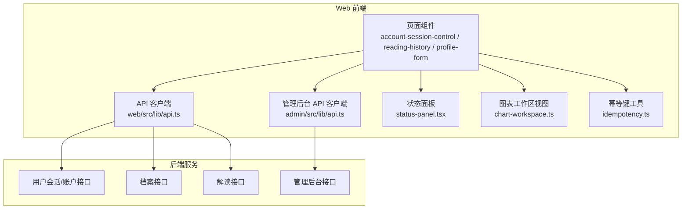
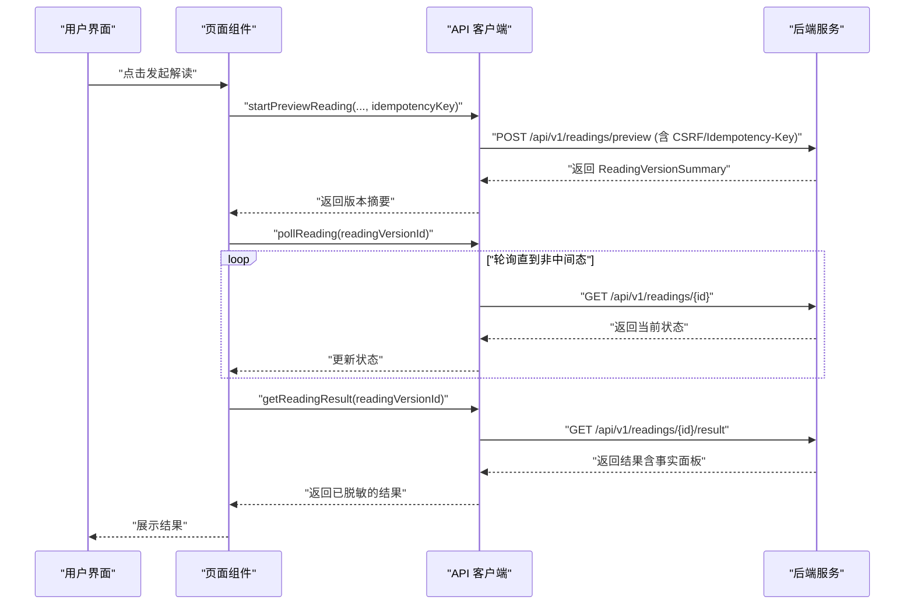
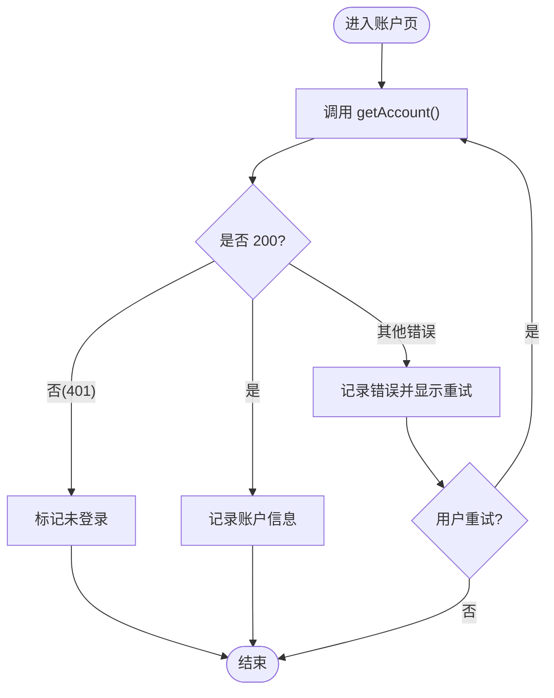
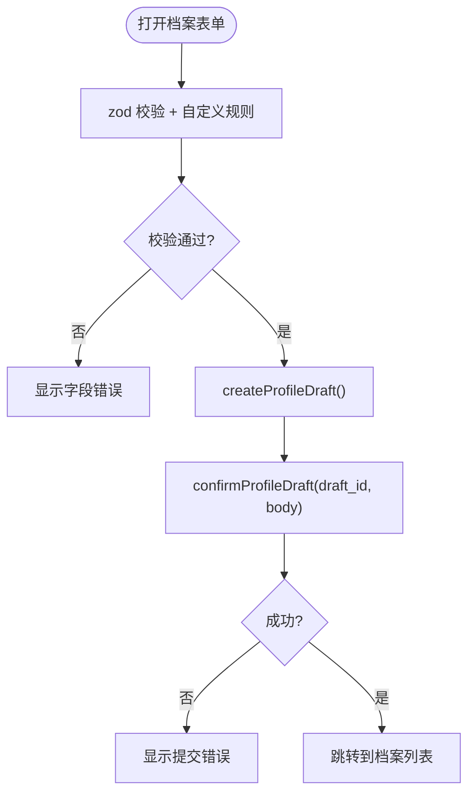
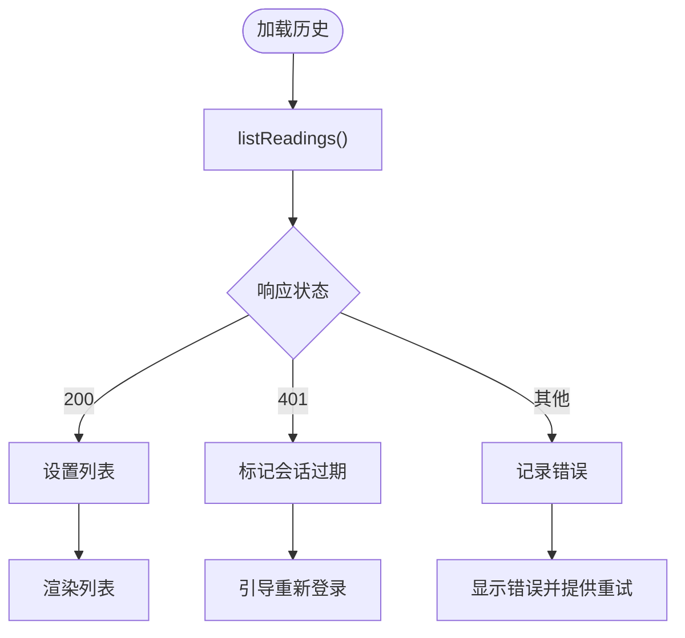
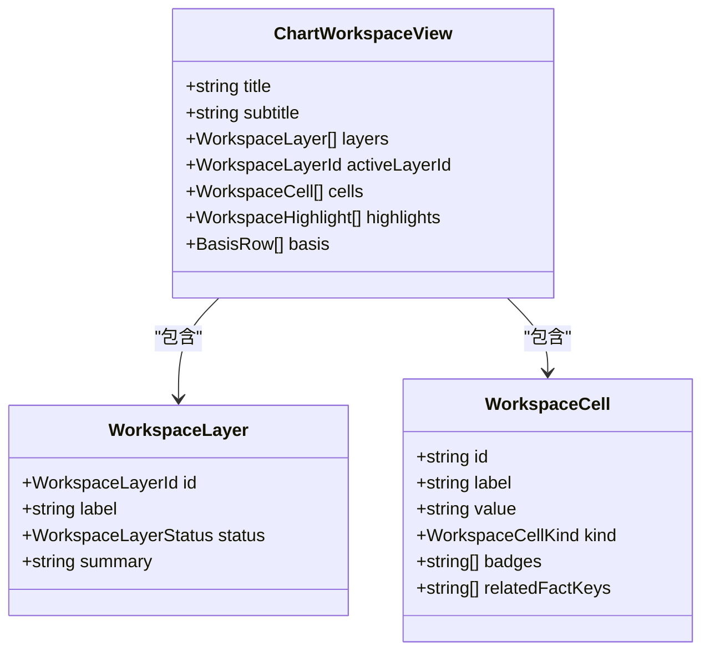
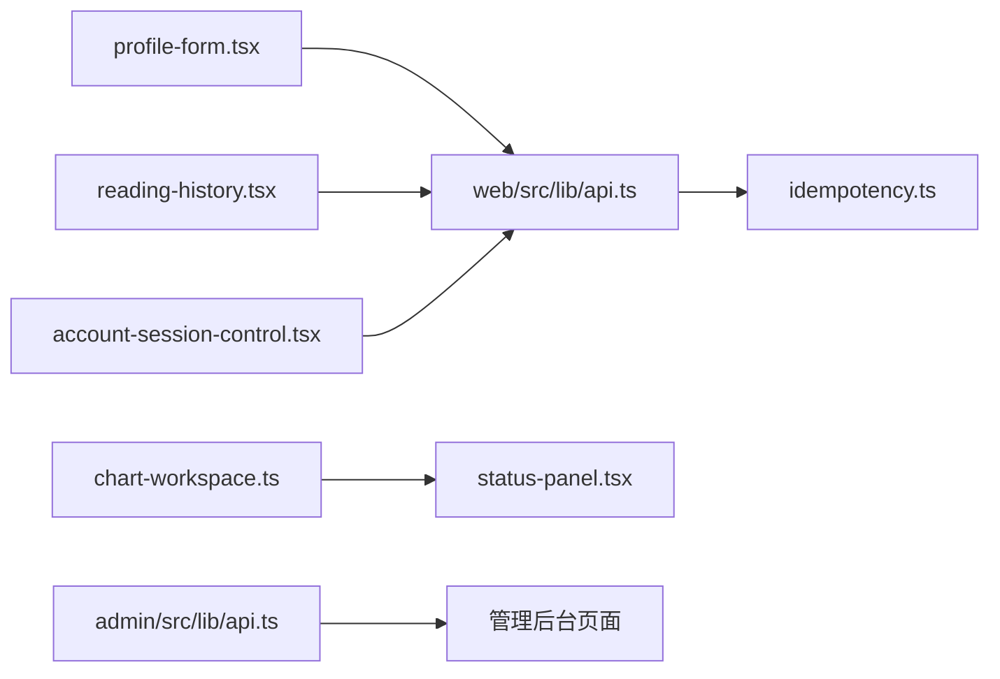

# 状态管理

<cite>
**本文引用的文件**
- [web/src/lib/api.ts](file://web/src/lib/api.ts)
- [admin/src/lib/api.ts](file://admin/src/lib/api.ts)
- [web/src/components/account-session-control.tsx](file://web/src/components/account-session-control.tsx)
- [web/src/components/profile-form.tsx](file://web/src/components/profile-form.tsx)
- [web/src/components/reading-history.tsx](file://web/src/components/reading-history.tsx)
- [web/src/components/status-panel.tsx](file://web/src/components/status-panel.tsx)
- [web/src/lib/chart-workspace.ts](file://web/src/lib/chart-workspace.ts)
- [web/src/lib/idempotency.ts](file://web/src/lib/idempotency.ts)
- [web/src/app/app/layout.tsx](file://web/src/app/app/layout.tsx)
</cite>

## 目录
1. [简介](#简介)
2. [项目结构](#项目结构)
3. [核心组件](#核心组件)
4. [架构总览](#架构总览)
5. [详细组件分析](#详细组件分析)
6. [依赖关系分析](#依赖关系分析)
7. [性能考虑](#性能考虑)
8. [故障排查指南](#故障排查指南)
9. [结论](#结论)
10. [附录](#附录)

## 简介
本文件聚焦前端状态管理策略，覆盖本地状态、全局状态与服务端状态的协调方式；说明 API 客户端封装与数据获取模式；阐述缓存策略与离线处理思路；解释表单状态管理与验证机制；说明错误处理与重试机制；讨论状态持久化与同步策略；并给出最佳实践与性能优化建议。该仓库采用“服务端为权威源”的前端设计：浏览器不保存敏感输入，仅持有可展示的派生事实；通过统一的 API 客户端进行请求、CSRF 防护、幂等键注入与错误归一化；页面级组件以 React 本地状态驱动 UI 的加载、空态、错误与成功态。

## 项目结构
- 公共 API 客户端位于 web/src/lib/api.ts，负责类型定义、HTTP 封装、CSRF 令牌获取与刷新、幂等键生成与校验、以及面向业务的数据接口（档案、解读、账户、登出等）。
- 管理后台 API 客户端位于 admin/src/lib/api.ts，提供带 CSRF 的轻量 fetch 封装，统一返回结构化结果。
- 页面级状态由 React 组件维护：
  - 账户会话探测与退出在 account-session-control.tsx。
  - 档案表单在 profile-form.tsx，使用 react-hook-form + zod 做表单状态与校验。
  - 解读历史在 reading-history.tsx，展示列表并处理会话过期与错误。
  - 通用状态面板 status-panel.tsx 提供一致的加载/空态/错误/处理中/成功/禁用态。
- 纯展示模型 chart-workspace.ts 将服务端公开事实映射为图表工作区视图，确保前端不做本地推算。
- 幂等键工具 idempotency.ts 基于意图指纹稳定生成幂等键。
- 应用布局 layout.tsx 强制动态渲染与禁用缓存，保证状态始终来自服务端。



**图示来源**
- [web/src/lib/api.ts:256-385](file://web/src/lib/api.ts#L256-L385)
- [admin/src/lib/api.ts:43-79](file://admin/src/lib/api.ts#L43-L79)
- [web/src/components/status-panel.tsx:17-70](file://web/src/components/status-panel.tsx#L17-L70)
- [web/src/lib/chart-workspace.ts:12-57](file://web/src/lib/chart-workspace.ts#L12-L57)
- [web/src/lib/idempotency.ts:1-18](file://web/src/lib/idempotency.ts#L1-L18)

**章节来源**
- [web/src/lib/api.ts:256-385](file://web/src/lib/api.ts#L256-L385)
- [admin/src/lib/api.ts:43-79](file://admin/src/lib/api.ts#L43-L79)
- [web/src/components/status-panel.tsx:17-70](file://web/src/components/status-panel.tsx#L17-L70)
- [web/src/lib/chart-workspace.ts:12-57](file://web/src/lib/chart-workspace.ts#L12-L57)
- [web/src/lib/idempotency.ts:1-18](file://web/src/lib/idempotency.ts#L1-L18)

## 核心组件
- API 客户端（web）
  - 统一 JSON 请求与错误归一化，抛出 ApiError，包含 HTTP 状态码与详情。
  - 自动携带 credentials，POST 时注入 CSRF Token 与可选 Idempotency-Key。
  - CSRF 令牌优先从 Cookie 读取，否则发起 guest-sessions 请求获取并缓存，失败或 403 时清理缓存并重试一次。
  - 提供档案、解读、账户、登出等接口，并在读取结果时对敏感字段进行脱敏投影。
- 管理后台 API 客户端
  - 读取管理后台 CSRF Cookie，构造请求头，统一返回 { ok, data } 或 { ok, status, title } 的结构化结果。
- 状态面板
  - 提供 loading/empty/error/processing/success/disabled 六种状态，用于统一呈现加载、空态、错误、处理中、成功与不可用提示。
- 图表工作区视图
  - 纯展示模型，将服务端公开事实映射为工作区层、单元格、高亮与依据行，禁止本地推算。
- 幂等键工具
  - 根据意图对象序列化指纹，若未变化则复用已有键，否则生成新的唯一键，避免重复提交。

**章节来源**
- [web/src/lib/api.ts:244-392](file://web/src/lib/api.ts#L244-L392)
- [admin/src/lib/api.ts:28-79](file://admin/src/lib/api.ts#L28-L79)
- [web/src/components/status-panel.tsx:17-70](file://web/src/components/status-panel.tsx#L17-L70)
- [web/src/lib/chart-workspace.ts:12-57](file://web/src/lib/chart-workspace.ts#L12-L57)
- [web/src/lib/idempotency.ts:1-18](file://web/src/lib/idempotency.ts#L1-L18)

## 架构总览
下图展示了典型“创建解读”流程中的状态流转与调用链：页面组件发起请求，API 客户端负责 CSRF 与幂等键，后端处理后返回解读版本摘要，页面轮询直至完成，最终拉取结果并进行安全投影。



**图示来源**
- [web/src/lib/api.ts:432-488](file://web/src/lib/api.ts#L432-L488)

## 详细组件分析

### 账户与会话状态管理
- 组件职责
  - 启动时探测当前设备登录状态，区分检查中、已登录、未登录与错误态。
  - 支持退出当前设备，成功后跳转首页。
- 状态设计
  - 使用本地状态表示探测阶段与结果，错误时提供重试入口。
  - 对 401 会话失效场景进行专门处理。
- 与 API 客户端协作
  - 调用 getAccount 获取账户信息；logoutCurrentDevice 会清除 API 缓存。
- 错误处理
  - 捕获网络或服务端错误，显示友好消息并提供重试按钮。



**图示来源**
- [web/src/components/account-session-control.tsx:44-82](file://web/src/components/account-session-control.tsx#L44-L82)
- [web/src/lib/api.ts:423-430](file://web/src/lib/api.ts#L423-L430)

**章节来源**
- [web/src/components/account-session-control.tsx:20-82](file://web/src/components/account-session-control.tsx#L20-L82)
- [web/src/lib/api.ts:423-430](file://web/src/lib/api.ts#L423-L430)

### 档案表单状态与验证
- 表单状态
  - 使用 react-hook-form 管理字段值、提交状态与错误。
  - 通过 useWatch 监听关键字段，驱动预览与条件字段显示。
- 验证机制
  - 使用 zod schema 定义必填、格式与范围约束，并对时区进行 IANA 有效性校验。
  - 提交前二次校验必要选项，防止不完整提交。
- 数据流
  - 先创建草稿，再确认草稿，成功后跳转到档案列表。
  - 时间字段经本地工具转换为带偏移的字符串后提交。
- 错误处理
  - 捕获异常并显示错误提示，保持可重试体验。



**图示来源**
- [web/src/components/profile-form.tsx:66-108](file://web/src/components/profile-form.tsx#L66-L108)
- [web/src/components/profile-form.tsx:166-218](file://web/src/components/profile-form.tsx#L166-L218)
- [web/src/lib/api.ts:394-416](file://web/src/lib/api.ts#L394-L416)

**章节来源**
- [web/src/components/profile-form.tsx:66-218](file://web/src/components/profile-form.tsx#L66-L218)
- [web/src/lib/api.ts:394-416](file://web/src/lib/api.ts#L394-L416)

### 解读历史与轮询状态
- 列表状态
  - 加载、错误、会话过期、空态与列表态五种分支。
  - 每条记录展示能力、状态标签与时间，状态标签由服务端枚举映射。
- 会话处理
  - 401 时标记会话过期，引导重新登录。
- 重试机制
  - 提供重试按钮重置状态并重新拉取。



**图示来源**
- [web/src/components/reading-history.tsx:71-105](file://web/src/components/reading-history.tsx#L71-L105)
- [web/src/lib/api.ts:418-421](file://web/src/lib/api.ts#L418-L421)

**章节来源**
- [web/src/components/reading-history.tsx:41-105](file://web/src/components/reading-history.tsx#L41-L105)
- [web/src/lib/api.ts:418-421](file://web/src/lib/api.ts#L418-L421)

### 图表工作区视图（纯展示模型）
- 职责
  - 将服务端返回的公开事实映射为工作区层、单元格、高亮与依据行。
  - 缺失层保持存在但标记为不可用或空，绝不虚构数据。
- 数据结构
  - 层状态包括 ready/unavailable/empty；单元格包含键值、类型与关联事实键。
- 数据来源
  - 从 chart-workspace 的输入事实构建视图，供 UI 消费。



**图示来源**
- [web/src/lib/chart-workspace.ts:12-57](file://web/src/lib/chart-workspace.ts#L12-L57)
- [web/src/lib/chart-workspace.ts:152-238](file://web/src/lib/chart-workspace.ts#L152-L238)

**章节来源**
- [web/src/lib/chart-workspace.ts:12-57](file://web/src/lib/chart-workspace.ts#L12-L57)
- [web/src/lib/chart-workspace.ts:152-238](file://web/src/lib/chart-workspace.ts#L152-L238)

### API 客户端与 CSRF/幂等键
- 请求封装
  - requestJson 统一解析 JSON、处理非 2xx 响应并抛出 ApiError。
  - jsonPost 自动注入 CSRF Token，必要时附加 Idempotency-Key。
- CSRF 策略
  - 优先从 Cookie 读取，否则发起 guest-sessions 获取并缓存；遇到 403 时清理缓存并重试一次。
- 幂等键
  - createIdempotencyKey 生成唯一键；idempotency.ts 根据意图指纹稳定复用或生成新键。
- 安全投影
  - 读取结果时对原始输入引用进行过滤，确保浏览器不保留敏感输入。

```mermaid
sequenceDiagram
participant C as "调用方"
participant API as "jsonPost"
participant CSRF as "getCsrfToken"
participant S as "后端"
C->>API : "POST /xxx (payload, idempotencyKey?)"
API->>CSRF : "获取 CSRF Token"
CSRF-->>API : "返回 Token"
API->>S : "POST /xxx (Content-Type : application/json; X-CSRF-Token; Idempotency-Key)"
alt "403 CSRF 失败"
API->>CSRF : "清理缓存并重新获取"
API->>S : "再次 POST"
else "成功"
S-->>API : "返回数据"
end
API-->>C : "返回数据或抛出 ApiError"
```

**图示来源**
- [web/src/lib/api.ts:292-330](file://web/src/lib/api.ts#L292-L330)
- [web/src/lib/api.ts:359-385](file://web/src/lib/api.ts#L359-L385)
- [web/src/lib/idempotency.ts:8-17](file://web/src/lib/idempotency.ts#L8-L17)

**章节来源**
- [web/src/lib/api.ts:256-392](file://web/src/lib/api.ts#L256-L392)
- [web/src/lib/idempotency.ts:1-18](file://web/src/lib/idempotency.ts#L1-L18)

### 管理后台 API 客户端
- 特点
  - 读取管理后台 CSRF Cookie，自动设置 Content-Type 与 X-CSRF-Token。
  - 统一返回结构化结果，便于上层组件判断成功与否并展示标题化错误。
- 适用场景
  - 管理后台页面的数据获取与操作，如概览、队列统计等。

**章节来源**
- [admin/src/lib/api.ts:28-79](file://admin/src/lib/api.ts#L28-L79)

## 依赖关系分析
- 页面组件依赖 API 客户端进行数据获取与状态变更。
- 表单组件依赖 react-hook-form 与 zod 进行状态与校验。
- 图表工作区视图依赖服务端公开事实，不引入外部计算逻辑。
- 状态面板作为通用 UI 组件被多处复用，统一交互语义。
- 幂等键工具被 API 客户端与业务调用方共同使用，保障幂等性。



**图示来源**
- [web/src/components/profile-form.tsx:112-218](file://web/src/components/profile-form.tsx#L112-L218)
- [web/src/components/reading-history.tsx:64-105](file://web/src/components/reading-history.tsx#L64-L105)
- [web/src/components/account-session-control.tsx:37-82](file://web/src/components/account-session-control.tsx#L37-L82)
- [web/src/lib/api.ts:256-392](file://web/src/lib/api.ts#L256-L392)
- [web/src/lib/idempotency.ts:1-18](file://web/src/lib/idempotency.ts#L1-L18)
- [web/src/components/status-panel.tsx:17-70](file://web/src/components/status-panel.tsx#L17-L70)
- [admin/src/lib/api.ts:43-79](file://admin/src/lib/api.ts#L43-L79)

**章节来源**
- [web/src/components/profile-form.tsx:112-218](file://web/src/components/profile-form.tsx#L112-L218)
- [web/src/components/reading-history.tsx:64-105](file://web/src/components/reading-history.tsx#L64-L105)
- [web/src/components/account-session-control.tsx:37-82](file://web/src/components/account-session-control.tsx#L37-L82)
- [web/src/lib/api.ts:256-392](file://web/src/lib/api.ts#L256-L392)
- [web/src/lib/idempotency.ts:1-18](file://web/src/lib/idempotency.ts#L1-L18)
- [web/src/components/status-panel.tsx:17-70](file://web/src/components/status-panel.tsx#L17-L70)
- [admin/src/lib/api.ts:43-79](file://admin/src/lib/api.ts#L43-L79)

## 性能考虑
- 服务端权威与最小状态
  - 浏览器仅持有可展示派生事实，避免冗余本地状态与复杂同步逻辑。
- 减少不必要重渲染
  - 使用受控表单与选择性监听字段，仅在必要时触发更新。
- 请求去重与幂等
  - 通过幂等键避免重复提交；CSRF 令牌缓存减少重复获取。
- 禁用缓存
  - 应用布局强制动态渲染与 no-store，避免陈旧数据影响状态一致性。
- 轮询优化
  - 轮询应在状态仍为中间态时进行，完成后停止，避免无效请求。
- 展示模型解耦
  - 图表工作区视图只做映射，不参与计算，降低渲染成本。

[本节为通用指导，无需特定文件来源]

## 故障排查指南
- 常见错误分类
  - 网络或服务端错误：ApiError 携带状态码与详情，组件应显示友好提示并提供重试。
  - 会话失效：401 时标记会话过期，引导重新登录。
  - CSRF 失败：自动清理缓存并重试一次；若持续失败需检查 Cookie 与跨域配置。
- 定位步骤
  - 查看 ApiError 的状态码与详情，确认是否为认证、权限或参数问题。
  - 检查 CSRF 令牌是否存在且有效，必要时手动触发刷新。
  - 对于幂等请求，核对幂等键是否稳定且符合长度要求。
- 恢复策略
  - 提供重试按钮重置状态；对会话过期场景提供导航到登录页。
  - 对轮询任务增加超时与退避策略，避免长时间阻塞。

**章节来源**
- [web/src/lib/api.ts:244-330](file://web/src/lib/api.ts#L244-L330)
- [web/src/components/reading-history.tsx:81-105](file://web/src/components/reading-history.tsx#L81-L105)
- [web/src/components/account-session-control.tsx:52-82](file://web/src/components/account-session-control.tsx#L52-L82)

## 结论
该前端状态管理方案以“服务端为权威源”为核心原则，通过统一的 API 客户端实现请求、认证、CSRF 与幂等性控制；页面组件以本地状态驱动 UI 的加载、空态、错误与成功态；表单使用 react-hook-form 与 zod 进行强类型校验；图表工作区视图仅做展示映射，确保不虚构数据。整体架构清晰、职责分离明确，具备良好的可维护性与扩展性。

[本节为总结，无需特定文件来源]

## 附录

### 本地状态、全局状态与服务端状态的协调
- 本地状态
  - 页面级组件使用 useState/useEffect 管理加载、错误、空态与操作态。
  - 表单状态由 react-hook-form 集中管理，并通过 zod 校验。
- 全局状态
  - 当前仓库未引入全局状态库；通过 API 客户端与组件间传递维持一致性。
  - 如需跨页面共享，可在路由层或布局层引入轻量状态容器。
- 服务端状态
  - 所有关键数据均从服务端获取；布局禁用缓存，保证最新状态。

**章节来源**
- [web/src/app/app/layout.tsx:12-15](file://web/src/app/app/layout.tsx#L12-L15)
- [web/src/components/profile-form.tsx:112-218](file://web/src/components/profile-form.tsx#L112-L218)
- [web/src/components/reading-history.tsx:64-105](file://web/src/components/reading-history.tsx#L64-L105)

### API 客户端封装与数据获取模式
- 统一封装
  - requestJson 与 jsonPost 提供一致的错误处理与头部注入。
- 数据获取模式
  - 列表类数据直接 GET；写操作使用 POST 并附带幂等键。
  - 长任务通过轮询获取中间状态，完成后拉取结果。
- 安全与健壮性
  - CSRF 令牌缓存与自动刷新；403 时清理缓存并重试。
  - 结果中对敏感字段进行脱敏投影。

**章节来源**
- [web/src/lib/api.ts:256-392](file://web/src/lib/api.ts#L256-L392)
- [web/src/lib/api.ts:432-488](file://web/src/lib/api.ts#L432-L488)

### 缓存策略与离线数据处理
- 缓存策略
  - 应用布局禁用缓存；API 客户端对 CSRF 令牌进行内存缓存。
  - 管理后台请求显式设置 no-store。
- 离线处理
  - 当前未实现离线队列与重试队列；建议在网络不可用时提示并暂存操作意图，待恢复后重放。
  - 可结合 Service Worker 与 IndexedDB 实现基础离线能力。

**章节来源**
- [web/src/app/app/layout.tsx:12-15](file://web/src/app/app/layout.tsx#L12-L15)
- [admin/src/lib/api.ts:55-60](file://admin/src/lib/api.ts#L55-L60)
- [web/src/lib/api.ts:359-385](file://web/src/lib/api.ts#L359-L385)

### 表单状态管理与验证机制
- 表单状态
  - 使用 react-hook-form 管理字段值、提交态与错误。
  - 通过 useWatch 监听关键字段，驱动条件字段与预览。
- 验证机制
  - zod schema 定义字段类型、格式与范围；自定义规则校验时区有效性。
  - 提交前二次校验必要选项，防止不完整提交。
- 错误反馈
  - 字段级错误即时显示；提交错误集中提示并提供重试。

**章节来源**
- [web/src/components/profile-form.tsx:66-218](file://web/src/components/profile-form.tsx#L66-L218)

### 错误处理与重试机制
- 错误分类
  - 网络/服务端错误：ApiError 携带状态码与详情。
  - 会话失效：401 时引导重新登录。
  - CSRF 失败：自动清理缓存并重试一次。
- 重试机制
  - 页面组件提供重试按钮；轮询任务应在中间态继续，完成后停止。
  - 对幂等请求，确保幂等键稳定且符合长度要求。

**章节来源**
- [web/src/lib/api.ts:244-330](file://web/src/lib/api.ts#L244-L330)
- [web/src/components/reading-history.tsx:81-105](file://web/src/components/reading-history.tsx#L81-L105)
- [web/src/components/account-session-control.tsx:52-82](file://web/src/components/account-session-control.tsx#L52-L82)

### 状态持久化与同步策略
- 持久化
  - 当前未在前端持久化业务状态；关键数据由服务端存储。
  - 如需记住用户偏好，可使用 localStorage 或 cookie，注意与服务器状态同步。
- 同步策略
  - 以服务端为准，页面加载时主动拉取最新数据。
  - 写操作成功后刷新相关列表或状态，保持一致性。

**章节来源**
- [web/src/app/app/layout.tsx:12-15](file://web/src/app/app/layout.tsx#L12-L15)
- [web/src/lib/api.ts:418-421](file://web/src/lib/api.ts#L418-L421)

### 最佳实践与性能优化建议
- 最佳实践
  - 保持服务端为权威源，前端只做展示与交互。
  - 使用统一 API 客户端，集中处理认证、错误与幂等性。
  - 表单使用强类型校验，提升健壮性。
  - 使用状态面板统一交互语义。
- 性能优化
  - 禁用不必要的缓存，避免陈旧数据。
  - 轮询任务按需启停，避免无效请求。
  - 展示模型与计算逻辑解耦，降低渲染成本。
  - 合理使用字段监听，减少重渲染范围。

[本节为通用指导，无需特定文件来源]