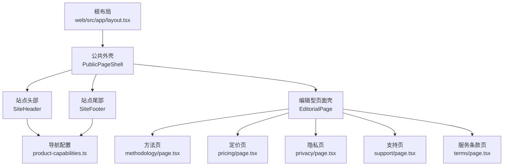
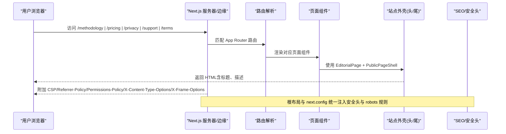
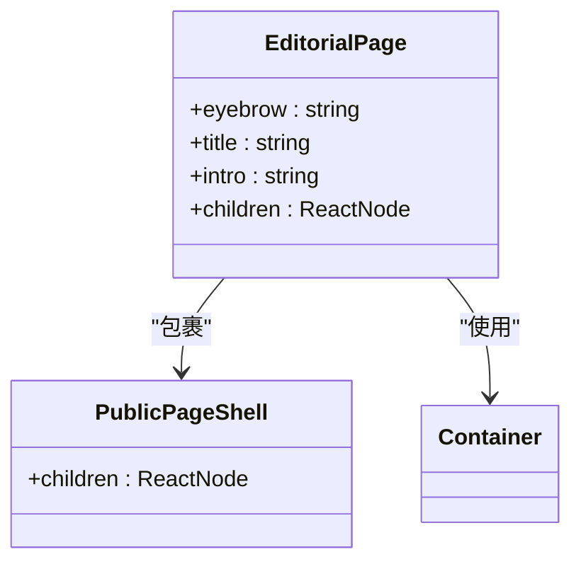
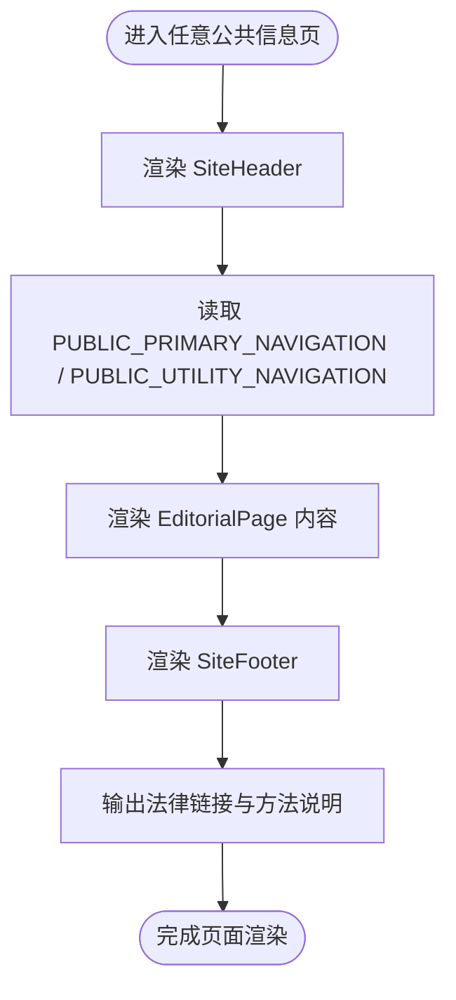
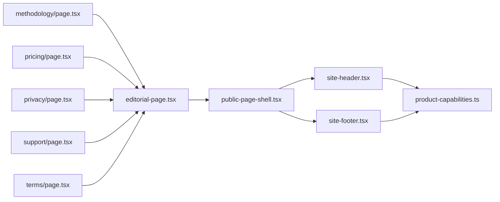

# 内容展示页面

<cite>
**本文引用的文件**
- [web/src/app/methodology/page.tsx](file://web/src/app/methodology/page.tsx)
- [web/src/app/pricing/page.tsx](file://web/src/app/pricing/page.tsx)
- [web/src/app/privacy/page.tsx](file://web/src/app/privacy/page.tsx)
- [web/src/app/support/page.tsx](file://web/src/app/support/page.tsx)
- [web/src/app/terms/page.tsx](file://web/src/app/terms/page.tsx)
- [web/src/components/editorial-page.tsx](file://web/src/components/editorial-page.tsx)
- [web/src/components/public-page-shell.tsx](file://web/src/components/public-page-shell.tsx)
- [web/src/components/site-header.tsx](file://web/src/components/site-header.tsx)
- [web/src/components/site-footer.tsx](file://web/src/components/site-footer.tsx)
- [web/src/lib/product-capabilities.ts](file://web/src/lib/product-capabilities.ts)
- [web/src/app/layout.tsx](file://web/src/app/layout.tsx)
- [web/src/app/robots.ts](file://web/src/app/robots.ts)
- [web/next.config.ts](file://web/next.config.ts)
</cite>

## 目录
1. [简介](#简介)
2. [项目结构](#项目结构)
3. [核心组件](#核心组件)
4. [架构总览](#架构总览)
5. [详细组件分析](#详细组件分析)
6. [依赖关系分析](#依赖关系分析)
7. [性能与缓存策略](#性能与缓存策略)
8. [故障排查指南](#故障排查指南)
9. [结论](#结论)
10. [附录](#附录)

## 简介
本文件聚焦“内容展示页面”的实现与治理，覆盖方法论介绍、定价说明、隐私政策、支持页面与服务条款等静态信息页。文档从系统架构、组件关系、数据流、处理逻辑、集成点、错误处理与性能特征等维度展开，并给出可操作的优化建议与排障指引。重点说明：
- 静态内容管理：通过 Next.js 页面与共享编辑型页面壳组件集中呈现，便于统一风格与可维护性。
- SEO 优化：根布局标题模板、站点 robots 与私有路由的 noindex/noarchive 策略。
- 可访问性设计：跳过链接、语义化标题、ARIA 标签与键盘可达。
- 响应式布局：基于 CSS Grid 与 clamp 的自适应排版。
- 多语言支持：当前为中文单语（zh-CN），可扩展为 i18n 路由与资源。
- 内容更新机制：页面级元数据与文案由前端文件驱动；未来可接入 CMS 或后端配置。
- 版本控制、审核流程与发布策略：结合 Git 提交、Next.js 构建产物与部署流水线。
- 性能与缓存：CSP、安全头、私有路由禁用缓存、公共静态内容可被 CDN/浏览器缓存。

## 项目结构
内容展示页面采用 Next.js App Router 的路由组织方式，每个信息页位于 web/src/app 下对应路径，并通过统一的编辑型页面壳组件渲染，外层包裹公共外壳（头部与尾部）。导航与页脚链接来自产品能力配置文件，确保公开信息与功能入口一致。

图表来源
- [web/src/app/layout.tsx:1-33](file://web/src/app/layout.tsx#L1-L33)
- [web/src/components/public-page-shell.tsx:1-17](file://web/src/components/public-page-shell.tsx#L1-L17)
- [web/src/components/site-header.tsx:1-72](file://web/src/components/site-header.tsx#L1-L72)
- [web/src/components/site-footer.tsx:1-65](file://web/src/components/site-footer.tsx#L1-L65)
- [web/src/components/editorial-page.tsx:1-35](file://web/src/components/editorial-page.tsx#L1-L35)
- [web/src/lib/product-capabilities.ts:103-139](file://web/src/lib/product-capabilities.ts#L103-L139)

章节来源
- [web/src/app/layout.tsx:1-33](file://web/src/app/layout.tsx#L1-L33)
- [web/src/components/public-page-shell.tsx:1-17](file://web/src/components/public-page-shell.tsx#L1-L17)
- [web/src/components/site-header.tsx:1-72](file://web/src/components/site-header.tsx#L1-L72)
- [web/src/components/site-footer.tsx:1-65](file://web/src/components/site-footer.tsx#L1-L65)
- [web/src/components/editorial-page.tsx:1-35](file://web/src/components/editorial-page.tsx#L1-L35)
- [web/src/lib/product-capabilities.ts:103-139](file://web/src/lib/product-capabilities.ts#L103-L139)

## 核心组件
- 编辑型页面壳 EditorialPage：提供统一的标题、副标题、引言与内容区域，所有静态信息页复用该组件，保证一致的视觉与信息层级。
- 公共外壳 PublicPageShell：组合站点头部与尾部，承载全局导航与法律链接。
- 站点头部 SiteHeader：包含“跳到主要内容”的可访问性跳转、主导航与辅助导航，导航项来源于产品能力配置。
- 站点尾部 SiteFooter：展示品牌信息、应用入口、方法与说明链接以及法律链接（使用条款、隐私政策、支持中心）。
- 各内容页面：方法、定价、隐私、支持、服务条款，均通过 Metadata 设置 SEO 标题与描述，并使用 EditorialPage 组织内容区块。

章节来源
- [web/src/components/editorial-page.tsx:1-35](file://web/src/components/editorial-page.tsx#L1-L35)
- [web/src/components/public-page-shell.tsx:1-17](file://web/src/components/public-page-shell.tsx#L1-L17)
- [web/src/components/site-header.tsx:1-72](file://web/src/components/site-header.tsx#L1-L72)
- [web/src/components/site-footer.tsx:1-65](file://web/src/components/site-footer.tsx#L1-L65)
- [web/src/app/methodology/page.tsx:1-66](file://web/src/app/methodology/page.tsx#L1-L66)
- [web/src/app/pricing/page.tsx:1-70](file://web/src/app/pricing/page.tsx#L1-L70)
- [web/src/app/privacy/page.tsx:1-50](file://web/src/app/privacy/page.tsx#L1-L50)
- [web/src/app/support/page.tsx:1-45](file://web/src/app/support/page.tsx#L1-L45)
- [web/src/app/terms/page.tsx:1-47](file://web/src/app/terms/page.tsx#L1-L47)

## 架构总览
内容展示页面属于“公共静态信息层”，不直接调用业务 API，但通过 Next.js 元数据与站点配置参与 SEO 与安全策略。整体请求流程如下：

图表来源
- [web/src/app/methodology/page.tsx:1-66](file://web/src/app/methodology/page.tsx#L1-L66)
- [web/src/app/pricing/page.tsx:1-70](file://web/src/app/pricing/page.tsx#L1-L70)
- [web/src/app/privacy/page.tsx:1-50](file://web/src/app/privacy/page.tsx#L1-L50)
- [web/src/app/support/page.tsx:1-45](file://web/src/app/support/page.tsx#L1-L45)
- [web/src/app/terms/page.tsx:1-47](file://web/src/app/terms/page.tsx#L1-L47)
- [web/src/components/editorial-page.tsx:1-35](file://web/src/components/editorial-page.tsx#L1-L35)
- [web/src/components/public-page-shell.tsx:1-17](file://web/src/components/public-page-shell.tsx#L1-L17)
- [web/src/app/layout.tsx:1-33](file://web/src/app/layout.tsx#L1-L33)
- [web/next.config.ts:1-66](file://web/next.config.ts#L1-L66)

## 详细组件分析

### 编辑型页面壳 EditorialPage
- 职责：封装公共头部信息（标题、副标题、引言）与内容容器，作为所有静态信息页的统一外观。
- 可访问性：主内容区设置 id 与 tabindex，配合头部“跳到主要内容”实现键盘直达。
- 样式：通过模块 CSS 定义网格、卡片、价格、提示框等，适配移动端到桌面端。

图表来源
- [web/src/components/editorial-page.tsx:1-35](file://web/src/components/editorial-page.tsx#L1-L35)
- [web/src/components/public-page-shell.tsx:1-17](file://web/src/components/public-page-shell.tsx#L1-L17)

章节来源
- [web/src/components/editorial-page.tsx:1-35](file://web/src/components/editorial-page.tsx#L1-L35)

### 站点头部与尾部
- 头部：提供“跳到主要内容”的无障碍跳转；主导航与辅助导航来自 product-capabilities 配置，确保公开入口与产品能力一致。
- 尾部：展示品牌声明、核心应用与方法说明链接；法律链接指向服务条款、隐私政策与支持中心。

图表来源
- [web/src/components/site-header.tsx:1-72](file://web/src/components/site-header.tsx#L1-L72)
- [web/src/components/site-footer.tsx:1-65](file://web/src/components/site-footer.tsx#L1-L65)
- [web/src/lib/product-capabilities.ts:103-139](file://web/src/lib/product-capabilities.ts#L103-L139)

章节来源
- [web/src/components/site-header.tsx:1-72](file://web/src/components/site-header.tsx#L1-L72)
- [web/src/components/site-footer.tsx:1-65](file://web/src/components/site-footer.tsx#L1-L65)
- [web/src/lib/product-capabilities.ts:103-139](file://web/src/lib/product-capabilities.ts#L103-L139)

### 各内容页面

#### 方法论介绍（/methodology）
- 目标：阐述“先算再讲”的方法论与交付边界，强调证据链与不可变版本。
- 结构：步骤列表、三列卡片（确定性命理层、受约束表达层、产品交付层）、两段说明与注意事项。
- SEO：自定义 title 与 description。

章节来源
- [web/src/app/methodology/page.tsx:1-66](file://web/src/app/methodology/page.tsx#L1-L66)

#### 定价说明（/pricing）
- 目标：明确免费能力与两种单次解读的交付范围、追问期限与退款边界。
- 结构：三列商品卡片、两段说明、状态面板提示在线购买暂未开放。
- 交互：状态面板用于传达支付能力开关状态，避免误导用户。

章节来源
- [web/src/app/pricing/page.tsx:1-70](file://web/src/app/pricing/page.tsx#L1-L70)

#### 隐私政策（/privacy）
- 目标：说明高敏感数据处理边界、会话与日志策略、模型最小输入原则与用户权利。
- 结构：段落说明与四列卡片（浏览器与会话、模型最小化输入、日志与监控、你的权利），附注意事项。

章节来源
- [web/src/app/privacy/page.tsx:1-50](file://web/src/app/privacy/page.tsx#L1-L50)

#### 支持页面（/support）
- 目标：提供账号、付款、报告、数据权利与人工售后入口说明。
- 结构：四列卡片与状态面板，强调真实客服主体确认前不展示虚构联系方式。

章节来源
- [web/src/app/support/page.tsx:1-45](file://web/src/app/support/page.tsx#L1-L45)

#### 服务条款（/terms）
- 目标：明确服务性质、AI 标识、专业边界、付费与交付状态区分与禁止用途。
- 结构：四列卡片与禁止用途清单，强调上线前需替换真实资料。

章节来源
- [web/src/app/terms/page.tsx:1-47](file://web/src/app/terms/page.tsx#L1-L47)

### 响应式布局与可访问性
- 响应式：使用 CSS Grid 与 clamp 实现弹性排版；在较大屏幕启用分栏与分隔线；减少动效以尊重用户偏好。
- 可访问性：
  - 头部提供“跳到主要内容”的锚点链接。
  - 主内容区设置 id 与 tabindex，便于键盘导航。
  - 导航与辅助导航使用 aria-label 标注。
  - 图标使用 aria-hidden 避免重复朗读。

章节来源
- [web/src/components/editorial-page.module.css:1-213](file://web/src/components/editorial-page.module.css#L1-L213)
- [web/src/components/site-header.tsx:1-72](file://web/src/components/site-header.tsx#L1-L72)

### 多语言支持与国际化扩展
- 现状：根布局 lang="zh-CN"，全站中文。
- 扩展建议：
  - 将页面文案抽取至 i18n 资源文件（如 zh.json、en.json）。
  - 使用 Next.js i18n 路由（/zh/...、/en/...）与动态加载。
  - 保持 SEO 元数据随语言切换（title、description、locale）。

[本节为概念性说明，不直接分析具体文件]

### 内容版本控制、审核流程与发布策略
- 版本控制：页面与组件变更通过 Git 提交；每次提交触发构建与测试。
- 审核流程：建议引入代码审查（PR）与自动化检查（lint/test），重要页面（定价、隐私、条款）需法务审阅。
- 发布策略：Next.js 构建产物独立部署；灰度发布时优先更新静态信息页，观察指标后再全量。

[本节为通用实践说明，不直接分析具体文件]

## 依赖关系分析
内容展示页面的依赖主要集中在 UI 壳组件与导航配置，页面本身无运行时数据依赖，利于缓存与快速首屏。

图表来源
- [web/src/app/methodology/page.tsx:1-66](file://web/src/app/methodology/page.tsx#L1-L66)
- [web/src/app/pricing/page.tsx:1-70](file://web/src/app/pricing/page.tsx#L1-L70)
- [web/src/app/privacy/page.tsx:1-50](file://web/src/app/privacy/page.tsx#L1-L50)
- [web/src/app/support/page.tsx:1-45](file://web/src/app/support/page.tsx#L1-L45)
- [web/src/app/terms/page.tsx:1-47](file://web/src/app/terms/page.tsx#L1-L47)
- [web/src/components/editorial-page.tsx:1-35](file://web/src/components/editorial-page.tsx#L1-L35)
- [web/src/components/public-page-shell.tsx:1-17](file://web/src/components/public-page-shell.tsx#L1-L17)
- [web/src/components/site-header.tsx:1-72](file://web/src/components/site-header.tsx#L1-L72)
- [web/src/components/site-footer.tsx:1-65](file://web/src/components/site-footer.tsx#L1-L65)
- [web/src/lib/product-capabilities.ts:103-139](file://web/src/lib/product-capabilities.ts#L103-L139)

章节来源
- [web/src/lib/product-capabilities.ts:103-139](file://web/src/lib/product-capabilities.ts#L103-L139)

## 性能与缓存策略
- 安全与合规头：根级别注入 CSP、Referrer-Policy、Permissions-Policy、X-Content-Type-Options、X-Frame-Options、COOP，降低攻击面。
- 私有路由禁用缓存：/app 与 /account 路径强制 private, no-store, max-age=0，并添加 X-Robots-Tag noindex/nofollow/noarchive，防止敏感内容被缓存或索引。
- 公共静态信息页：适合浏览器与 CDN 缓存；可通过 HTTP 缓存头与构建产物指纹提升命中。
- 资源优化：字体与图片按需加载；CSS 模块化减少冗余；避免不必要的客户端脚本。
- 可访问性与性能平衡：尊重 prefers-reduced-motion，减少动画开销。

章节来源
- [web/next.config.ts:1-66](file://web/next.config.ts#L1-L66)
- [web/src/app/layout.tsx:1-33](file://web/src/app/layout.tsx#L1-L33)
- [web/src/app/robots.ts:1-13](file://web/src/app/robots.ts#L1-L13)

## 故障排查指南
- 页面无法访问或 404：检查 Next.js 路由是否与文件路径一致；确认未误改文件名或目录结构。
- SEO 异常：核对页面 metadata.title 与 description；检查根布局默认标题模板与 robots 规则。
- 缓存问题：若发现旧内容未更新，确认是否为公共静态页；必要时清理 CDN/浏览器缓存或增加构建版本号。
- 安全头缺失：验证 next.config 中 headers 是否生效；检查部署环境是否覆盖服务端响应头。
- 可访问性问题：确认“跳到主要内容”锚点存在且可聚焦；检查 aria-label 与 heading 层级是否正确。

章节来源
- [web/src/app/layout.tsx:1-33](file://web/src/app/layout.tsx#L1-L33)
- [web/src/app/robots.ts:1-13](file://web/src/app/robots.ts#L1-L13)
- [web/next.config.ts:1-66](file://web/next.config.ts#L1-L66)

## 结论
内容展示页面通过统一的编辑型页面壳与公共外壳实现了高内聚、低耦合的静态信息呈现。借助 Next.js 的元数据与配置，完成了基础 SEO 与安全策略；通过 CSS Grid 与可访问性标记，提供了良好的响应式体验与无障碍支持。后续可在多语言、CMS 接入、审计与发布流程方面进一步增强，以满足更严格的合规与运营需求。

## 附录
- 关键路径参考：
  - 方法页：[web/src/app/methodology/page.tsx](file://web/src/app/methodology/page.tsx)
  - 定价页：[web/src/app/pricing/page.tsx](file://web/src/app/pricing/page.tsx)
  - 隐私页：[web/src/app/privacy/page.tsx](file://web/src/app/privacy/page.tsx)
  - 支持页：[web/src/app/support/page.tsx](file://web/src/app/support/page.tsx)
  - 服务条款页：[web/src/app/terms/page.tsx](file://web/src/app/terms/page.tsx)
  - 编辑型页面壳：[web/src/components/editorial-page.tsx](file://web/src/components/editorial-page.tsx)
  - 公共外壳：[web/src/components/public-page-shell.tsx](file://web/src/components/public-page-shell.tsx)
  - 站点头部：[web/src/components/site-header.tsx](file://web/src/components/site-header.tsx)
  - 站点尾部：[web/src/components/site-footer.tsx](file://web/src/components/site-footer.tsx)
  - 导航配置：[web/src/lib/product-capabilities.ts](file://web/src/lib/product-capabilities.ts)
  - 根布局：[web/src/app/layout.tsx](file://web/src/app/layout.tsx)
  - Robots：[web/src/app/robots.ts](file://web/src/app/robots.ts)
  - 安全与缓存配置：[web/next.config.ts](file://web/next.config.ts)