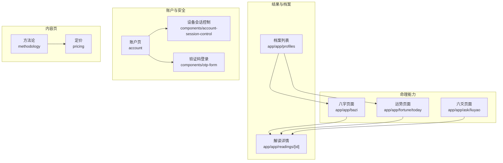
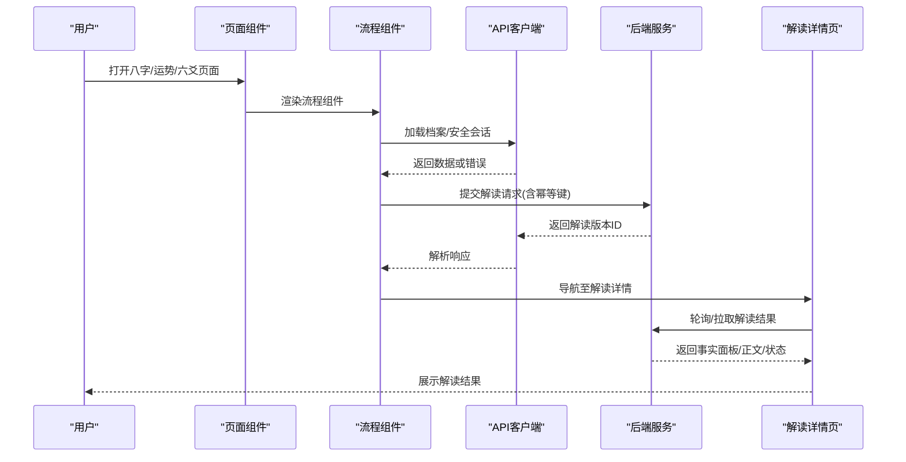
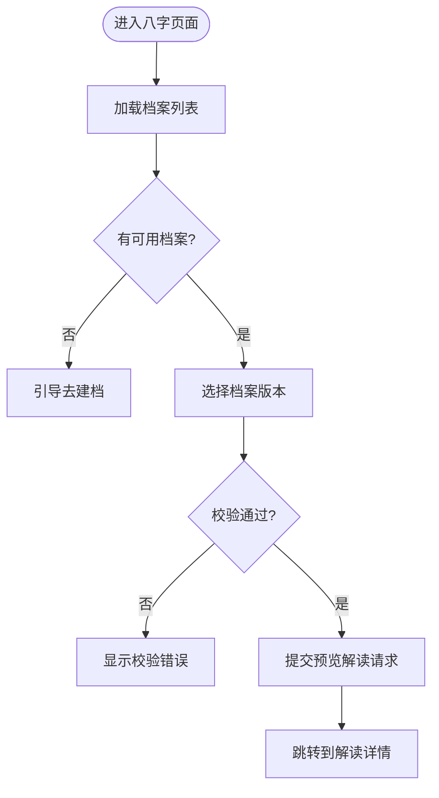
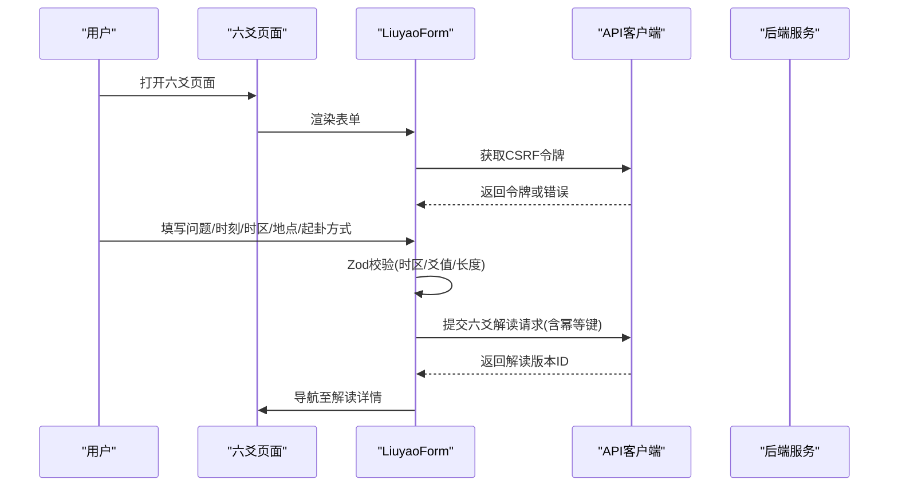
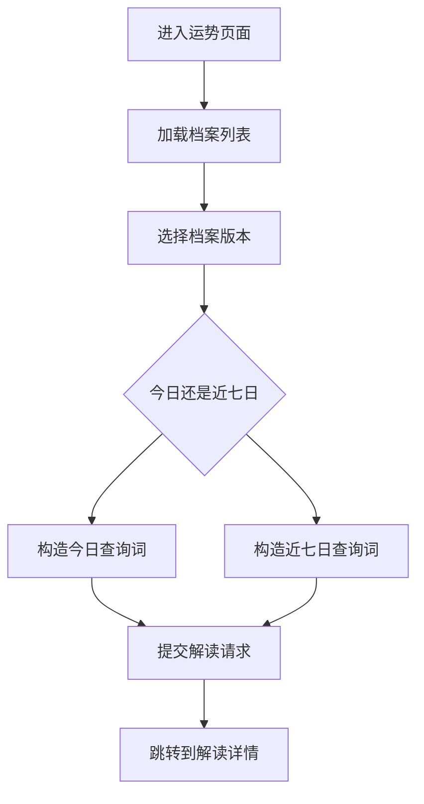
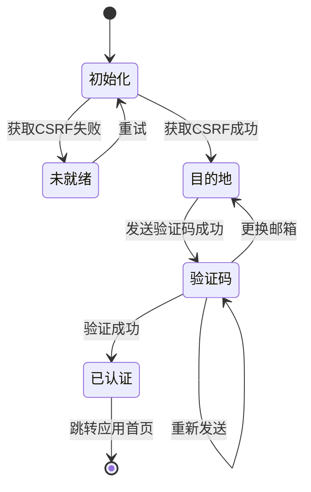
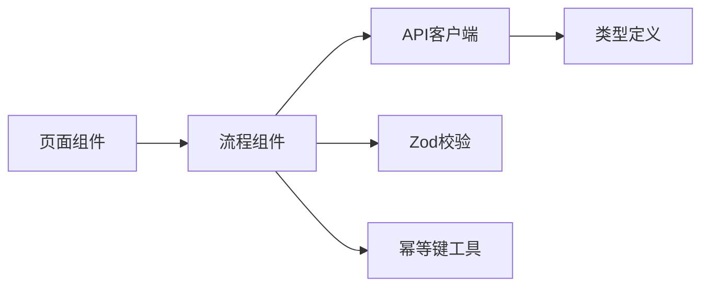

# 功能页面

<cite>
**本文引用的文件**
- [web/src/app/app/bazi/page.tsx](file://web/src/app/app/bazi/page.tsx)
- [web/src/components/bazi-flow.tsx](file://web/src/components/bazi-flow.tsx)
- [web/src/app/app/ask/liuyao/page.tsx](file://web/src/app/app/ask/liuyao/page.tsx)
- [web/src/components/liuyao-form.tsx](file://web/src/components/liuyao-form.tsx)
- [web/src/app/app/fortune/today/page.tsx](file://web/src/app/app/fortune/today/page.tsx)
- [web/src/components/fortune-flow.tsx](file://web/src/components/fortune-flow.tsx)
- [web/src/app/account/page.tsx](file://web/src/app/account/page.tsx)
- [web/src/components/account-session-control.tsx](file://web/src/components/account-session-control.tsx)
- [web/src/components/otp-form.tsx](file://web/src/components/otp-form.tsx)
- [web/src/app/methodology/page.tsx](file://web/src/app/methodology/page.tsx)
- [web/src/app/pricing/page.tsx](file://web/src/app/pricing/page.tsx)
- [web/src/lib/api.ts](file://web/src/lib/api.ts)
- [web/src/app/app/profiles/page.tsx](file://web/src/app/app/profiles/page.tsx)
- [web/src/components/profile-form.tsx](file://web/src/components/profile-form.tsx)
- [web/src/app/app/readings/[readingId]/page.tsx](file://web/src/app/app/readings/[readingId]/page.tsx)
</cite>

## 目录
1. [简介](#简介)
2. [项目结构](#项目结构)
3. [核心组件](#核心组件)
4. [架构总览](#架构总览)
5. [详细组件分析](#详细组件分析)
6. [依赖关系分析](#依赖关系分析)
7. [性能考量](#性能考量)
8. [故障排查指南](#故障排查指南)
9. [结论](#结论)
10. [附录](#附录)

## 简介
本文件聚焦命理解读Web应用的功能页面实现，覆盖八字分析、运势预测（今日/近七日）、六爻占卜等核心业务页面，以及用户账户管理（邮箱验证码登录、设备会话控制）、内容展示（方法论、定价）页面的结构与交互。文档同时说明页面状态管理、数据流处理、表单验证与输入处理机制，并给出性能优化与用户体验改进建议。

## 项目结构
前端采用 Next.js App Router，功能页面按“能力域”组织：
- 命理能力入口：八字概览、六爻起卦、今日/近七日运势
- 结果阅读：解读详情页
- 档案与历史：档案列表、新建档案
- 账户与安全：邮箱验证码登录、设备会话控制
- 内容页：方法论、定价、隐私与支持等

图表来源
- [web/src/app/app/bazi/page.tsx:1-52](file://web/src/app/app/bazi/page.tsx#L1-L52)
- [web/src/app/app/fortune/today/page.tsx:1-29](file://web/src/app/app/fortune/today/page.tsx#L1-L29)
- [web/src/app/app/ask/liuyao/page.tsx:1-27](file://web/src/app/app/ask/liuyao/page.tsx#L1-L27)
- [web/src/app/app/readings/[readingId]/page.tsx:1-38](file://web/src/app/app/readings/[readingId]/page.tsx#L1-L38)
- [web/src/app/app/profiles/page.tsx:1-43](file://web/src/app/app/profiles/page.tsx#L1-L43)
- [web/src/app/account/page.tsx:1-66](file://web/src/app/account/page.tsx#L1-L66)
- [web/src/app/methodology/page.tsx:1-66](file://web/src/app/methodology/page.tsx#L1-L66)
- [web/src/app/pricing/page.tsx:1-70](file://web/src/app/pricing/page.tsx#L1-L70)

章节来源
- [web/src/app/app/bazi/page.tsx:1-52](file://web/src/app/app/bazi/page.tsx#L1-L52)
- [web/src/app/app/fortune/today/page.tsx:1-29](file://web/src/app/app/fortune/today/page.tsx#L1-L29)
- [web/src/app/app/ask/liuyao/page.tsx:1-27](file://web/src/app/app/ask/liuyao/page.tsx#L1-L27)
- [web/src/app/app/readings/[readingId]/page.tsx:1-38](file://web/src/app/app/readings/[readingId]/page.tsx#L1-L38)
- [web/src/app/app/profiles/page.tsx:1-43](file://web/src/app/app/profiles/page.tsx#L1-L43)
- [web/src/app/account/page.tsx:1-66](file://web/src/app/account/page.tsx#L1-L66)
- [web/src/app/methodology/page.tsx:1-66](file://web/src/app/methodology/page.tsx#L1-L66)
- [web/src/app/pricing/page.tsx:1-70](file://web/src/app/pricing/page.tsx#L1-L70)

## 核心组件
- 八字概览流程：从已确认档案版本发起“事业与工作”主题概览，调用服务端接口后跳转至解读详情。
- 六爻起卦流程：收集问题、起卦时刻、时区、地点与起卦方式（手动或电子摇卦），提交后进入解读详情。
- 运势预测流程：选择档案版本，启动“今日/近七日”节奏解读，跳转至解读详情。
- 账户与登录：邮箱验证码登录，建立设备会话；账户页提供设备会话查看与退出。
- 档案与历史：不可变档案版本管理，每次确认生成新版本，旧解读仍可回看。
- 内容展示：方法论与定价为静态信息页，使用统一编辑型页面壳层。

章节来源
- [web/src/components/bazi-flow.tsx:1-223](file://web/src/components/bazi-flow.tsx#L1-L223)
- [web/src/components/liuyao-form.tsx:1-463](file://web/src/components/liuyao-form.tsx#L1-L463)
- [web/src/components/fortune-flow.tsx:1-235](file://web/src/components/fortune-flow.tsx#L1-L235)
- [web/src/components/account-session-control.tsx:1-171](file://web/src/components/account-session-control.tsx#L1-L171)
- [web/src/components/otp-form.tsx:1-364](file://web/src/components/otp-form.tsx#L1-L364)
- [web/src/app/app/profiles/page.tsx:1-43](file://web/src/app/app/profiles/page.tsx#L1-L43)
- [web/src/components/profile-form.tsx:1-200](file://web/src/components/profile-form.tsx#L1-L200)
- [web/src/app/methodology/page.tsx:1-66](file://web/src/app/methodology/page.tsx#L1-L66)
- [web/src/app/pricing/page.tsx:1-70](file://web/src/app/pricing/page.tsx#L1-L70)

## 架构总览
前端以“页面组件 + 流程组件”的方式组织：页面负责路由与标题元信息，流程组件封装表单、校验、状态与API调用。所有计算与交付由后端完成，前端仅做输入收集与结果呈现。

图表来源
- [web/src/components/bazi-flow.tsx:88-114](file://web/src/components/bazi-flow.tsx#L88-L114)
- [web/src/components/fortune-flow.tsx:94-125](file://web/src/components/fortune-flow.tsx#L94-L125)
- [web/src/components/liuyao-form.tsx:150-195](file://web/src/components/liuyao-form.tsx#L150-L195)
- [web/src/app/app/readings/[readingId]/page.tsx:10-34](file://web/src/app/app/readings/[readingId]/page.tsx#L10-L34)
- [web/src/lib/api.ts:85-104](file://web/src/lib/api.ts#L85-L104)

## 详细组件分析

### 八字概览页面
- 页面职责：展示标题与说明，挂载八字流程组件，支持通过URL参数预选档案版本。
- 流程要点：
  - 加载档案列表，自动预选唯一或指定版本。
  - 表单校验：必须选择档案版本。
  - 提交载荷：包含档案版本、查询词与维度（当前为“事业与工作”）。
  - 幂等保护：基于意图与载荷生成稳定键，避免重复提交。
  - 成功后跳转至解读详情。

图表来源
- [web/src/app/app/bazi/page.tsx:11-32](file://web/src/app/app/bazi/page.tsx#L11-L32)
- [web/src/components/bazi-flow.tsx:52-86](file://web/src/components/bazi-flow.tsx#L52-L86)
- [web/src/components/bazi-flow.tsx:88-114](file://web/src/components/bazi-flow.tsx#L88-L114)
- [web/src/components/bazi-flow.tsx:154-218](file://web/src/components/bazi-flow.tsx#L154-L218)

章节来源
- [web/src/app/app/bazi/page.tsx:1-52](file://web/src/app/app/bazi/page.tsx#L1-L52)
- [web/src/components/bazi-flow.tsx:1-223](file://web/src/components/bazi-flow.tsx#L1-L223)

### 六爻起卦页面
- 页面职责：收集问题、起卦时刻、时区、地点与起卦方式，提交后进入解读详情。
- 表单校验：
  - 问题长度限制与必填。
  - 起卦时刻格式校验。
  - IANA时区有效性校验。
  - 地点必填且长度限制。
  - 起卦方式二选一；若为手动，需逐爻选择有效值。
- 安全与会话：
  - 启动前获取CSRF令牌，失败则提示重新连接。
- 提交载荷：将本地时间与时区转换为带偏移的字符串，携带维度（当前为“事业与工作”）。

图表来源
- [web/src/app/app/ask/liuyao/page.tsx:10-24](file://web/src/app/app/ask/liuyao/page.tsx#L10-L24)
- [web/src/components/liuyao-form.tsx:123-142](file://web/src/components/liuyao-form.tsx#L123-L142)
- [web/src/components/liuyao-form.tsx:150-195](file://web/src/components/liuyao-form.tsx#L150-L195)
- [web/src/components/liuyao-form.tsx:37-86](file://web/src/components/liuyao-form.tsx#L37-L86)

章节来源
- [web/src/app/app/ask/liuyao/page.tsx:1-27](file://web/src/app/app/ask/liuyao/page.tsx#L1-L27)
- [web/src/components/liuyao-form.tsx:1-463](file://web/src/components/liuyao-form.tsx#L1-L463)

### 运势预测页面（今日/近七日）
- 页面职责：选择档案版本，启动“今日/近七日”节奏解读，跳转至解读详情。
- 流程要点：
  - 支持URL参数预选档案版本。
  - 根据模式构造不同查询词。
  - 幂等提交，成功后跳转。

图表来源
- [web/src/app/app/fortune/today/page.tsx:10-25](file://web/src/app/app/fortune/today/page.tsx#L10-L25)
- [web/src/components/fortune-flow.tsx:94-125](file://web/src/components/fortune-flow.tsx#L94-L125)
- [web/src/components/fortune-flow.tsx:164-230](file://web/src/components/fortune-flow.tsx#L164-L230)

章节来源
- [web/src/app/app/fortune/today/page.tsx:1-29](file://web/src/app/app/fortune/today/page.tsx#L1-L29)
- [web/src/components/fortune-flow.tsx:1-235](file://web/src/components/fortune-flow.tsx#L1-L235)

### 用户账户管理与登录
- 账户页：展示邮箱验证码登录入口、设备会话控制与权限边界说明。
- 验证码登录：
  - 阶段：初始化安全会话 -> 输入邮箱 -> 发送验证码 -> 输入验证码 -> 验证成功 -> 建立设备会话并跳转。
  - 校验：邮箱格式、六位数字验证码。
  - 安全：使用CSRF令牌，登录后采用新令牌。
- 设备会话控制：
  - 探测当前登录状态，显示绑定身份与设备状态。
  - 支持退出当前设备，失败可重试。

图表来源
- [web/src/app/account/page.tsx:9-63](file://web/src/app/account/page.tsx#L9-L63)
- [web/src/components/otp-form.tsx:83-221](file://web/src/components/otp-form.tsx#L83-L221)
- [web/src/components/account-session-control.tsx:37-171](file://web/src/components/account-session-control.tsx#L37-L171)

章节来源
- [web/src/app/account/page.tsx:1-66](file://web/src/app/account/page.tsx#L1-L66)
- [web/src/components/otp-form.tsx:1-364](file://web/src/components/otp-form.tsx#L1-L364)
- [web/src/components/account-session-control.tsx:1-171](file://web/src/components/account-session-control.tsx#L1-L171)

### 档案与历史
- 档案列表：展示不可变版本，强调修改会生成新版本，旧解读仍可回看。
- 新建档案：表单校验包括出生时间、时区、地点、性别、时间口径与子时口径，可选经纬度与坐标来源。
- 提交逻辑：创建草稿并确认，转换本地时间为带偏移字符串，必要时过滤经纬度字段。

章节来源
- [web/src/app/app/profiles/page.tsx:1-43](file://web/src/app/app/profiles/page.tsx#L1-L43)
- [web/src/components/profile-form.tsx:1-200](file://web/src/components/profile-form.tsx#L1-L200)

### 内容展示页面（方法论、定价）
- 方法论：结构化阐述“先算再讲”，展示标准解读链与三层职责（确定性命理层、受约束表达层、产品交付层）。
- 定价：展示免费与付费商品、交付范围与退款边界，并提示在线购买暂未开放。

章节来源
- [web/src/app/methodology/page.tsx:1-66](file://web/src/app/methodology/page.tsx#L1-L66)
- [web/src/app/pricing/page.tsx:1-70](file://web/src/app/pricing/page.tsx#L1-L70)

### 解读详情页面
- 页面职责：根据路由参数读取解读ID，渲染解读结果组件，展示状态与正文分离的结果。
- 交互：若无解读ID，提示返回重新发起。

章节来源
- [web/src/app/app/readings/[readingId]/page.tsx:1-38](file://web/src/app/app/readings/[readingId]/page.tsx#L1-L38)

## 依赖关系分析
- 页面组件依赖流程组件：页面只负责路由与标题，具体业务逻辑下沉到流程组件。
- 流程组件依赖API客户端：统一封装类型定义与请求方法，保证前后端契约一致。
- 表单校验依赖Zod：集中定义字段规则与自定义校验（如IANA时区、爻值范围）。
- 幂等性：通过稳定意图键避免重复提交，提升健壮性。

图表来源
- [web/src/components/bazi-flow.tsx:1-21](file://web/src/components/bazi-flow.tsx#L1-L21)
- [web/src/components/liuyao-form.tsx:1-23](file://web/src/components/liuyao-form.tsx#L1-L23)
- [web/src/components/fortune-flow.tsx:1-22](file://web/src/components/fortune-flow.tsx#L1-L22)
- [web/src/lib/api.ts:1-104](file://web/src/lib/api.ts#L1-L104)

章节来源
- [web/src/lib/api.ts:1-200](file://web/src/lib/api.ts#L1-L200)
- [web/src/components/bazi-flow.tsx:1-223](file://web/src/components/bazi-flow.tsx#L1-L223)
- [web/src/components/liuyao-form.tsx:1-463](file://web/src/components/liuyao-form.tsx#L1-L463)
- [web/src/components/fortune-flow.tsx:1-235](file://web/src/components/fortune-flow.tsx#L1-L235)

## 性能考量
- 首屏与懒加载：
  - 使用Suspense包裹异步流程组件，提供占位状态，减少白屏时间。
- 网络请求优化：
  - 列表数据按需加载（档案列表仅在需要时拉取）。
  - 幂等键避免重复请求，降低服务器压力与前端抖动。
- 渲染优化：
  - 表单校验在提交时触发，减少频繁重渲染。
  - 使用条件渲染区分加载、错误、空数据与正常态，避免无意义布局抖动。
- 资源与样式：
  - 模块化CSS隔离样式，减少全局污染。
  - 图标与UI库按需引入，控制包体大小。

[本节为通用指导，不直接分析具体文件]

## 故障排查指南
- 登录失败：
  - 检查CSRF令牌获取是否成功；失败时提示“重新连接”。
  - 验证码发送/验证失败时，显示服务端返回的错误消息，并提供重试或更换邮箱。
- 解读启动失败：
  - 检查档案列表加载是否成功；为空时引导建档。
  - 提交失败时显示错误信息，保持busy状态解锁后可重试。
- 账户状态异常：
  - 设备会话探测失败时显示错误并允许重试。
  - 退出失败时显示错误信息，保持按钮可重试。

章节来源
- [web/src/components/otp-form.tsx:107-123](file://web/src/components/otp-form.tsx#L107-L123)
- [web/src/components/otp-form.tsx:131-166](file://web/src/components/otp-form.tsx#L131-L166)
- [web/src/components/otp-form.tsx:180-207](file://web/src/components/otp-form.tsx#L180-L207)
- [web/src/components/bazi-flow.tsx:52-86](file://web/src/components/bazi-flow.tsx#L52-L86)
- [web/src/components/bazi-flow.tsx:133-144](file://web/src/components/bazi-flow.tsx#L133-L144)
- [web/src/components/fortune-flow.tsx:68-86](file://web/src/components/fortune-flow.tsx#L68-L86)
- [web/src/components/fortune-flow.tsx:144-155](file://web/src/components/fortune-flow.tsx#L144-L155)
- [web/src/components/account-session-control.tsx:44-65](file://web/src/components/account-session-control.tsx#L44-L65)
- [web/src/components/account-session-control.tsx:72-82](file://web/src/components/account-session-control.tsx#L72-L82)

## 结论
该Web应用在功能页面设计上遵循“页面+流程”的分层模式，将复杂业务逻辑收敛到流程组件中，并通过Zod进行强类型表单校验，结合幂等键保障提交稳定性。八字、六爻与运势三大核心能力均围绕“从已确认档案出发、服务端计算与交付”的原则实现，确保事实与表达解耦。账户管理以邮箱验证码为主，设备会话清晰可控。内容页提供方法论与定价说明，帮助用户理解产品边界与交付承诺。整体架构清晰、可维护性强，具备良好的扩展性与用户体验基础。

[本节为总结，不直接分析具体文件]

## 附录
- 关键数据类型与接口契约参考：
  - 档案摘要、解读状态、事实面板、验证结果等类型定义位于API客户端模块，便于前后端对齐。
- 常用工具与策略：
  - 本地时间与偏移转换、IANA时区校验、幂等键生成等工具函数支撑表单与服务端交互。

章节来源
- [web/src/lib/api.ts:1-200](file://web/src/lib/api.ts#L1-L200)
- [web/src/components/liuyao-form.tsx:15-23](file://web/src/components/liuyao-form.tsx#L15-L23)
- [web/src/components/profile-form.tsx:15-27](file://web/src/components/profile-form.tsx#L15-L27)