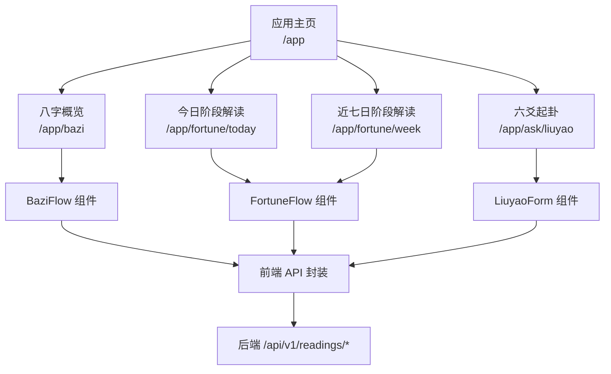
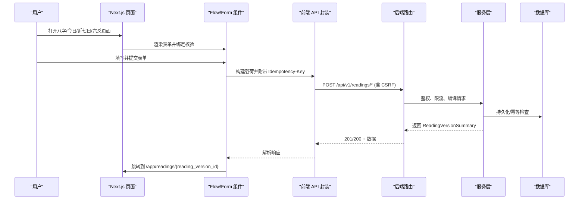
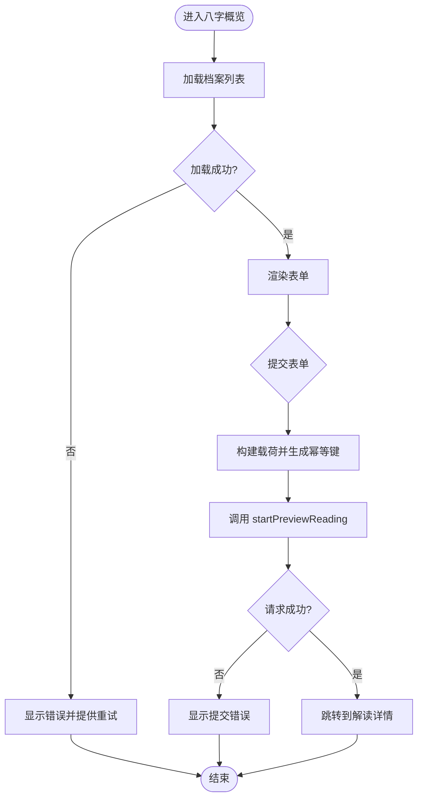
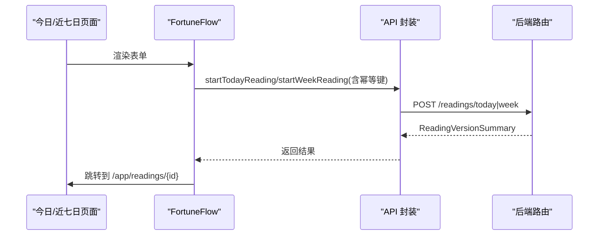
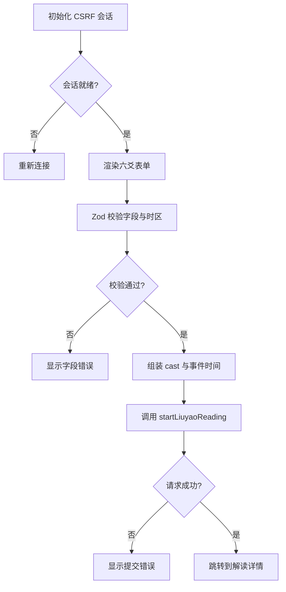
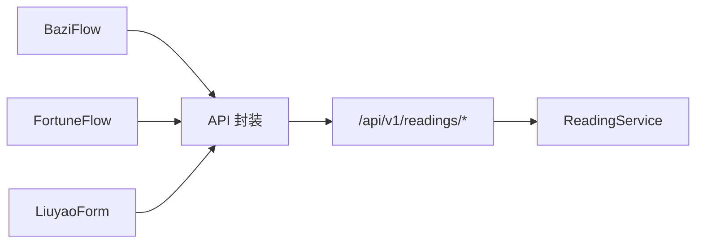

# 命理解读页面

<cite>
**本文引用的文件**
- [web/src/app/app/page.tsx](file://web/src/app/app/page.tsx)
- [web/src/app/app/bazi/page.tsx](file://web/src/app/app/bazi/page.tsx)
- [web/src/app/app/fortune/today/page.tsx](file://web/src/app/app/fortune/today/page.tsx)
- [web/src/app/app/fortune/week/page.tsx](file://web/src/app/app/fortune/week/page.tsx)
- [web/src/app/app/ask/liuyao/page.tsx](file://web/src/app/app/ask/liuyao/page.tsx)
- [web/src/components/bazi-flow.tsx](file://web/src/components/bazi-flow.tsx)
- [web/src/components/fortune-flow.tsx](file://web/src/components/fortune-flow.tsx)
- [web/src/components/liuyao-form.tsx](file://web/src/components/liuyao-form.tsx)
- [web/src/lib/api.ts](file://web/src/lib/api.ts)
- [web/src/lib/idempotency.ts](file://web/src/lib/idempotency.ts)
- [web/src/lib/date-time.ts](file://web/src/lib/date-time.ts)
- [backend/app/api/readings.py](file://backend/app/api/readings.py)
- [backend/app/readings/service.py](file://backend/app/readings/service.py)
</cite>

## 目录
1. [简介](#简介)
2. [项目结构](#项目结构)
3. [核心组件](#核心组件)
4. [架构总览](#架构总览)
5. [详细组件分析](#详细组件分析)
6. [依赖关系分析](#依赖关系分析)
7. [性能与响应式优化](#性能与响应式优化)
8. [故障排查指南](#故障排查指南)
9. [结论](#结论)

## 简介
本文件面向“命理解读”前端页面的实现说明，覆盖八字概览、每日运势、一周运势、六爻占卜等核心业务。文档从表单输入、数据校验、状态管理、结果展示、导航流程、实时计算与异步处理、错误处理策略、性能优化与响应式设计等方面展开，帮助读者快速理解并维护相关代码。

## 项目结构
命理解读功能由 Next.js 应用的前端页面与 React 组件构成，后端通过 FastAPI 暴露读取任务启动、查询与结果获取接口。关键路径如下：
- 入口与导航：应用主页提供任务入口，分别跳转到八字、今日/近七日、六爻页面。
- 解读流程组件：各页面通过专用 Flow/Form 组件完成表单收集、校验、发起请求与跳转。
- API 层：统一封装 CSRF、幂等键、请求发送与错误转换。
- 后端路由：按能力维度（预览、今日、近七日、六爻）提供稳定接口，服务层负责编排与持久化。

**图表来源**
- [web/src/app/app/page.tsx:9-76](file://web/src/app/app/page.tsx#L9-L76)
- [web/src/app/app/bazi/page.tsx:11-32](file://web/src/app/app/bazi/page.tsx#L11-L32)
- [web/src/app/app/fortune/today/page.tsx:10-25](file://web/src/app/app/fortune/today/page.tsx#L10-L25)
- [web/src/app/app/fortune/week/page.tsx:10-25](file://web/src/app/app/fortune/week/page.tsx#L10-L25)
- [web/src/app/app/ask/liuyao/page.tsx:10-24](file://web/src/app/app/ask/liuyao/page.tsx#L10-L24)
- [web/src/components/bazi-flow.tsx:28-114](file://web/src/components/bazi-flow.tsx#L28-L114)
- [web/src/components/fortune-flow.tsx:33-125](file://web/src/components/fortune-flow.tsx#L33-L125)
- [web/src/components/liuyao-form.tsx:90-195](file://web/src/components/liuyao-form.tsx#L90-L195)
- [web/src/lib/api.ts:432-466](file://web/src/lib/api.ts#L432-L466)
- [backend/app/api/readings.py:87-237](file://backend/app/api/readings.py#L87-L237)

**章节来源**
- [web/src/app/app/page.tsx:9-76](file://web/src/app/app/page.tsx#L9-L76)
- [web/src/app/app/bazi/page.tsx:11-32](file://web/src/app/app/bazi/page.tsx#L11-L32)
- [web/src/app/app/fortune/today/page.tsx:10-25](file://web/src/app/app/fortune/today/page.tsx#L10-L25)
- [web/src/app/app/fortune/week/page.tsx:10-25](file://web/src/app/app/fortune/week/page.tsx#L10-L25)
- [web/src/app/app/ask/liuyao/page.tsx:10-24](file://web/src/app/app/ask/liuyao/page.tsx#L10-L24)

## 核心组件
- 八字概览（BaziFlow）
  - 表单字段：档案版本选择。
  - 数据验证：Zod 校验必填档案版本。
  - 状态管理：加载档案列表、错误提示、提交中锁定。
  - 结果展示：提交后跳转到解读详情页。
  - 参考路径：[web/src/components/bazi-flow.tsx:22-114](file://web/src/components/bazi-flow.tsx#L22-L114)

- 阶段解读（FortuneFlow，支持 today/week）
  - 表单字段：档案版本选择；根据 mode 自动构造查询。
  - 数据验证：Zod 校验必填档案版本。
  - 状态管理：加载、错误重试、提交中禁用。
  - 结果展示：提交后跳转到解读详情页。
  - 参考路径：[web/src/components/fortune-flow.tsx:27-125](file://web/src/components/fortune-flow.tsx#L27-L125)

- 六爻起卦（LiuyaoForm）
  - 表单字段：问题、起卦时刻、时区、地点、起卦方式（手动/电子摇卦）、六次投掷值。
  - 数据验证：Zod + 自定义规则校验时区有效性、投掷值范围。
  - 状态管理：CSRF 会话建立、提交中锁定、错误提示。
  - 结果展示：提交后跳转到解读详情页。
  - 参考路径：[web/src/components/liuyao-form.tsx:37-195](file://web/src/components/liuyao-form.tsx#L37-L195)

- API 封装（lib/api.ts）
  - 职责：统一 JSON POST、CSRF Token 获取与缓存、幂等键注入、错误转换为 ApiError、类型定义。
  - 关键方法：startPreviewReading、startTodayReading、startWeekReading、startLiuyaoReading、getReadingResult、pollReading。
  - 参考路径：[web/src/lib/api.ts:256-330](file://web/src/lib/api.ts#L256-L330)、[web/src/lib/api.ts:432-488](file://web/src/lib/api.ts#L432-L488)

- 幂等键（lib/idempotency.ts）
  - 职责：基于意图指纹复用或生成新的幂等键，避免重复提交。
  - 参考路径：[web/src/lib/idempotency.ts:8-17](file://web/src/lib/idempotency.ts#L8-L17)

- 时间处理（lib/date-time.ts）
  - 职责：将本地日期时间与 IANA 时区转换为带偏移的 ISO 字符串，用于后端解析。
  - 参考路径：[web/src/lib/date-time.ts:34-57](file://web/src/lib/date-time.ts#L34-L57)

**章节来源**
- [web/src/components/bazi-flow.tsx:22-114](file://web/src/components/bazi-flow.tsx#L22-L114)
- [web/src/components/fortune-flow.tsx:27-125](file://web/src/components/fortune-flow.tsx#L27-L125)
- [web/src/components/liuyao-form.tsx:37-195](file://web/src/components/liuyao-form.tsx#L37-L195)
- [web/src/lib/api.ts:256-330](file://web/src/lib/api.ts#L256-L330)
- [web/src/lib/api.ts:432-488](file://web/src/lib/api.ts#L432-L488)
- [web/src/lib/idempotency.ts:8-17](file://web/src/lib/idempotency.ts#L8-L17)
- [web/src/lib/date-time.ts:34-57](file://web/src/lib/date-time.ts#L34-L57)

## 架构总览
前端页面通过 Flow/Form 组件收集用户输入，使用 Zod 进行客户端校验，调用 API 层发送带 CSRF 和幂等键的请求。后端路由接收请求，服务层进行权限校验、参数编译、幂等性检查、持久化与编排，最终返回解读版本信息供前端跳转至详情页。

**图表来源**
- [web/src/components/bazi-flow.tsx:88-114](file://web/src/components/bazi-flow.tsx#L88-L114)
- [web/src/components/fortune-flow.tsx:94-125](file://web/src/components/fortune-flow.tsx#L94-L125)
- [web/src/components/liuyao-form.tsx:150-195](file://web/src/components/liuyao-form.tsx#L150-L195)
- [web/src/lib/api.ts:292-330](file://web/src/lib/api.ts#L292-L330)
- [backend/app/api/readings.py:87-237](file://backend/app/api/readings.py#L87-L237)
- [backend/app/readings/service.py:129-200](file://backend/app/readings/service.py#L129-L200)

## 详细组件分析

### 八字概览（BaziFlow）
- 表单输入
  - 档案版本下拉框，默认尝试预选 URL 传入的 profile 或唯一档案。
  - 参考路径：[web/src/components/bazi-flow.tsx:52-80](file://web/src/components/bazi-flow.tsx#L52-L80)、[web/src/components/bazi-flow.tsx:153-195](file://web/src/components/bazi-flow.tsx#L153-L195)
- 数据验证
  - 使用 Zod 校验 profile_version_id 非空。
  - 参考路径：[web/src/components/bazi-flow.tsx:22-26](file://web/src/components/bazi-flow.tsx#L22-L26)
- 状态管理
  - loading/error/profiles/busy/submitError，使用 ref 防止重复提交。
  - 参考路径：[web/src/components/bazi-flow.tsx:31-39](file://web/src/components/bazi-flow.tsx#L31-L39)
- 结果展示与导航
  - 成功后跳转到解读详情页。
  - 参考路径：[web/src/components/bazi-flow.tsx:101-114](file://web/src/components/bazi-flow.tsx#L101-L114)

**图表来源**
- [web/src/components/bazi-flow.tsx:52-114](file://web/src/components/bazi-flow.tsx#L52-L114)

**章节来源**
- [web/src/components/bazi-flow.tsx:22-114](file://web/src/components/bazi-flow.tsx#L22-L114)

### 阶段解读（FortuneFlow，today/week）
- 表单输入
  - 档案版本选择；根据 mode 自动设置查询文案。
  - 参考路径：[web/src/components/fortune-flow.tsx:27-53](file://web/src/components/fortune-flow.tsx#L27-L53)、[web/src/components/fortune-flow.tsx:94-114](file://web/src/components/fortune-flow.tsx#L94-L114)
- 数据验证
  - 使用 Zod 校验必填档案版本。
  - 参考路径：[web/src/components/fortune-flow.tsx:27-31](file://web/src/components/fortune-flow.tsx#L27-L31)
- 状态管理
  - 加载、错误重试、提交中禁用；URL 参数预选档案。
  - 参考路径：[web/src/components/fortune-flow.tsx:33-92](file://web/src/components/fortune-flow.tsx#L33-L92)
- 结果展示与导航
  - 成功后跳转到解读详情页。
  - 参考路径：[web/src/components/fortune-flow.tsx:110-125](file://web/src/components/fortune-flow.tsx#L110-L125)

**图表来源**
- [web/src/components/fortune-flow.tsx:94-125](file://web/src/components/fortune-flow.tsx#L94-L125)
- [web/src/lib/api.ts:441-456](file://web/src/lib/api.ts#L441-L456)
- [backend/app/api/readings.py:124-195](file://backend/app/api/readings.py#L124-L195)

**章节来源**
- [web/src/components/fortune-flow.tsx:27-125](file://web/src/components/fortune-flow.tsx#L27-L125)

### 六爻起卦（LiuyaoForm）
- 表单输入
  - 问题、起卦时刻、IANA 时区、地点、起卦方式（手动/电子摇卦）、六次投掷值。
  - 参考路径：[web/src/components/liuyao-form.tsx:37-86](file://web/src/components/liuyao-form.tsx#L37-L86)、[web/src/components/liuyao-form.tsx:237-435](file://web/src/components/liuyao-form.tsx#L237-L435)
- 数据验证
  - Zod 校验长度、格式与时区有效性；手动模式下校验每爻取值范围。
  - 参考路径：[web/src/components/liuyao-form.tsx:37-86](file://web/src/components/liuyao-form.tsx#L37-L86)
- 状态管理
  - 初始化 CSRF 会话；提交中禁用输入；错误提示。
  - 参考路径：[web/src/components/liuyao-form.tsx:123-148](file://web/src/components/liuyao-form.tsx#L123-L148)、[web/src/components/liuyao-form.tsx:150-195](file://web/src/components/liuyao-form.tsx#L150-L195)
- 结果展示与导航
  - 成功后跳转到解读详情页。
  - 参考路径：[web/src/components/liuyao-form.tsx:182-195](file://web/src/components/liuyao-form.tsx#L182-L195)

**图表来源**
- [web/src/components/liuyao-form.tsx:123-195](file://web/src/components/liuyao-form.tsx#L123-L195)

**章节来源**
- [web/src/components/liuyao-form.tsx:37-195](file://web/src/components/liuyao-form.tsx#L37-L195)

### 页面导航与用户体验设计
- 导航入口
  - 应用主页集中展示任务入口，引导用户进入对应解读流程。
  - 参考路径：[web/src/app/app/page.tsx:25-76](file://web/src/app/app/page.tsx#L25-L76)
- 页面头与元信息
  - 每个解读页面通过 AppPageHeader 展示标题、描述与安全提示。
  - 参考路径：[web/src/app/app/bazi/page.tsx:11-32](file://web/src/app/app/bazi/page.tsx#L11-L32)、[web/src/app/app/fortune/today/page.tsx:10-25](file://web/src/app/app/fortune/today/page.tsx#L10-L25)、[web/src/app/app/fortune/week/page.tsx:10-25](file://web/src/app/app/fortune/week/page.tsx#L10-L25)、[web/src/app/app/ask/liuyao/page.tsx:10-24](file://web/src/app/app/ask/liuyao/page.tsx#L10-L24)
- 交互体验
  - 提交中禁用输入与按钮，提供可访问性属性（aria-busy、aria-invalid）。
  - 参考路径：[web/src/components/form-controls.module.css:85-140](file://web/src/components/form-controls.module.css#L85-L140)

**章节来源**
- [web/src/app/app/page.tsx:25-76](file://web/src/app/app/page.tsx#L25-L76)
- [web/src/components/form-controls.module.css:85-140](file://web/src/components/form-controls.module.css#L85-L140)

## 依赖关系分析
- 前端组件依赖
  - Flow/Form 组件依赖 API 封装、Zod 校验、路由与状态管理。
  - 参考路径：[web/src/components/bazi-flow.tsx:1-21](file://web/src/components/bazi-flow.tsx#L1-L21)、[web/src/components/fortune-flow.tsx:1-22](file://web/src/components/fortune-flow.tsx#L1-L22)、[web/src/components/liuyao-form.tsx:1-23](file://web/src/components/liuyao-form.tsx#L1-L23)
- API 封装依赖
  - 依赖 CSRF 会话、幂等键工具、错误类与类型定义。
  - 参考路径：[web/src/lib/api.ts:239-330](file://web/src/lib/api.ts#L239-L330)、[web/src/lib/idempotency.ts:1-17](file://web/src/lib/idempotency.ts#L1-L17)
- 后端路由与服务层
  - 路由层负责鉴权、限流、参数映射与错误转换；服务层负责业务编排、幂等性与持久化。
  - 参考路径：[backend/app/api/readings.py:45-85](file://backend/app/api/readings.py#L45-L85)、[backend/app/readings/service.py:117-200](file://backend/app/readings/service.py#L117-L200)

**图表来源**
- [web/src/components/bazi-flow.tsx:88-114](file://web/src/components/bazi-flow.tsx#L88-L114)
- [web/src/components/fortune-flow.tsx:94-125](file://web/src/components/fortune-flow.tsx#L94-L125)
- [web/src/components/liuyao-form.tsx:150-195](file://web/src/components/liuyao-form.tsx#L150-L195)
- [web/src/lib/api.ts:432-466](file://web/src/lib/api.ts#L432-L466)
- [backend/app/api/readings.py:87-237](file://backend/app/api/readings.py#L87-L237)
- [backend/app/readings/service.py:129-200](file://backend/app/readings/service.py#L129-L200)

**章节来源**
- [web/src/lib/api.ts:239-330](file://web/src/lib/api.ts#L239-L330)
- [backend/app/api/readings.py:45-85](file://backend/app/api/readings.py#L45-L85)
- [backend/app/readings/service.py:117-200](file://backend/app/readings/service.py#L117-L200)

## 性能与响应式优化
- 客户端性能
  - 使用 Suspense 包裹页面主体，提升首屏加载体验。
  - 参考路径：[web/src/app/app/bazi/page.tsx:36-50](file://web/src/app/app/bazi/page.tsx#L36-L50)、[web/src/app/app/fortune/today/page.tsx:23-25](file://web/src/app/app/fortune/today/page.tsx#L23-L25)、[web/src/app/app/fortune/week/page.tsx:23-25](file://web/src/app/app/fortune/week/page.tsx#L23-L25)
  - 使用 useRef 与 busyRef 防止重复提交，减少无效网络请求。
  - 参考路径：[web/src/components/bazi-flow.tsx:38-39](file://web/src/components/bazi-flow.tsx#L38-L39)、[web/src/components/fortune-flow.tsx:43-44](file://web/src/components/fortune-flow.tsx#L43-L44)、[web/src/components/liuyao-form.tsx:97-98](file://web/src/components/liuyao-form.tsx#L97-L98)
  - 使用 stableKeyForIntent 复用幂等键，避免重复触发后端计算。
  - 参考路径：[web/src/lib/idempotency.ts:8-17](file://web/src/lib/idempotency.ts#L8-L17)
- 服务端性能
  - 路由层对写操作进行速率限制，保护后端资源。
  - 参考路径：[backend/app/api/readings.py:49-55](file://backend/app/api/readings.py#L49-L55)
- 响应式设计
  - CSS 使用 clamp、grid、media queries 适配不同屏幕尺寸。
  - 参考路径：[web/src/components/app-surface.module.css:1-12](file://web/src/components/app-surface.module.css#L1-L12)、[web/src/components/app-surface.module.css:786-800](file://web/src/components/app-surface.module.css#L786-L800)、[web/src/components/form-controls.module.css:154-159](file://web/src/components/form-controls.module.css#L154-L159)

**章节来源**
- [web/src/app/app/bazi/page.tsx:36-50](file://web/src/app/app/bazi/page.tsx#L36-L50)
- [web/src/app/app/fortune/today/page.tsx:23-25](file://web/src/app/app/fortune/today/page.tsx#L23-L25)
- [web/src/app/app/fortune/week/page.tsx:23-25](file://web/src/app/app/fortune/week/page.tsx#L23-L25)
- [web/src/lib/idempotency.ts:8-17](file://web/src/lib/idempotency.ts#L8-L17)
- [backend/app/api/readings.py:49-55](file://backend/app/api/readings.py#L49-L55)
- [web/src/components/app-surface.module.css:1-12](file://web/src/components/app-surface.module.css#L1-L12)
- [web/src/components/app-surface.module.css:786-800](file://web/src/components/app-surface.module.css#L786-L800)
- [web/src/components/form-controls.module.css:154-159](file://web/src/components/form-controls.module.css#L154-L159)

## 故障排查指南
- 常见错误与处理
  - CSRF 失败：API 层捕获 403 并刷新令牌后重试。
    - 参考路径：[web/src/lib/api.ts:317-330](file://web/src/lib/api.ts#L317-L330)
  - 幂等键冲突：后端返回 409，前端需提示用户稍后重试或更换意图。
    - 参考路径：[backend/app/api/readings.py:67-84](file://backend/app/api/readings.py#L67-L84)
  - 档案未找到/无权限：后端返回 404，前端提示用户确认档案版本。
    - 参考路径：[backend/app/api/readings.py:67-84](file://backend/app/api/readings.py#L67-L84)
  - 运行时不可用：后端返回 503，前端提示服务暂时不可用。
    - 参考路径：[backend/app/api/readings.py:67-84](file://backend/app/api/readings.py#L67-L84)
- 调试建议
  - 检查浏览器控制台错误与网络请求头是否包含 CSRF 与 Idempotency-Key。
  - 确认时区与时间格式是否正确，必要时查看 localDateTimeWithOffset 输出。
  - 参考路径：[web/src/lib/date-time.ts:34-57](file://web/src/lib/date-time.ts#L34-L57)

**章节来源**
- [web/src/lib/api.ts:317-330](file://web/src/lib/api.ts#L317-L330)
- [backend/app/api/readings.py:67-84](file://backend/app/api/readings.py#L67-L84)
- [web/src/lib/date-time.ts:34-57](file://web/src/lib/date-time.ts#L34-L57)

## 结论
命理解读页面以清晰的页面分层与组件化实现为核心，结合严格的表单校验、幂等提交与 CSRF 安全机制，确保用户体验与数据安全。后端通过路由与服务层解耦业务逻辑，提供稳定的接口与错误语义。整体架构具备良好的可扩展性与可维护性，适合持续迭代新增解读能力。