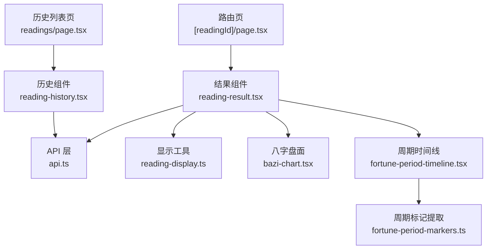
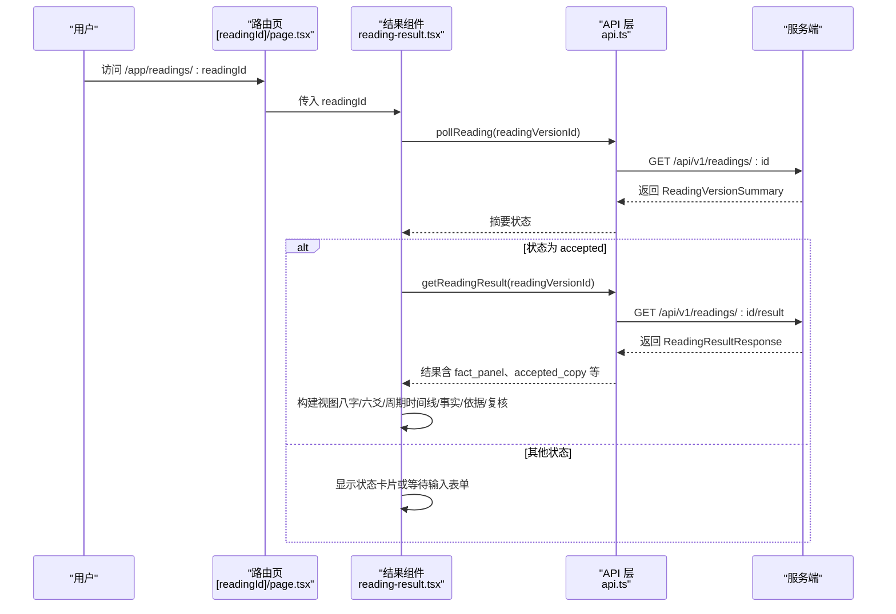
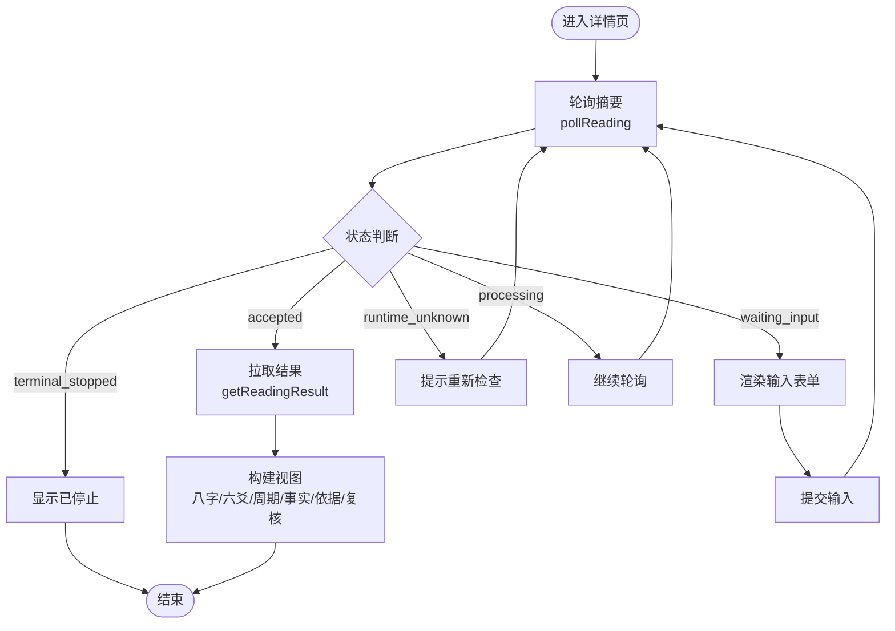
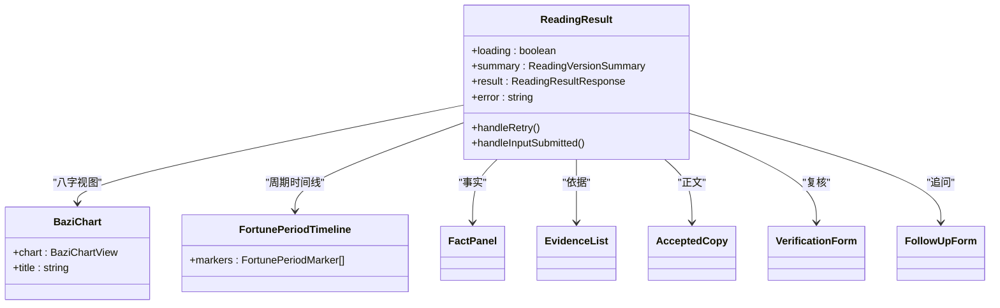
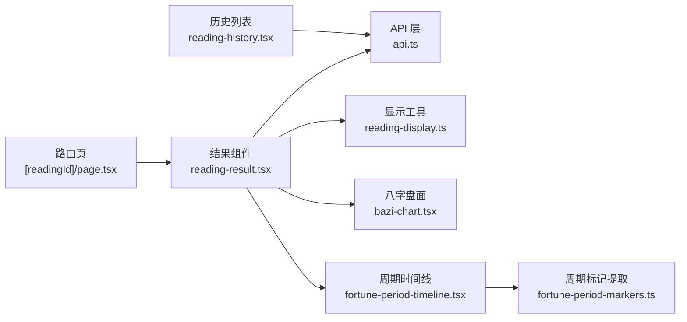

# 解读详情页面

<cite>
**本文引用的文件**
- [web/src/app/app/readings/[readingId]/page.tsx](file://web/src/app/app/readings/[readingId]/page.tsx)
- [web/src/components/readings/reading-result.tsx](file://web/src/components/readings/reading-result.tsx)
- [web/src/lib/api.ts](file://web/src/lib/api.ts)
- [web/src/lib/reading-display.ts](file://web/src/lib/reading-display.ts)
- [web/src/components/readings/bazi-chart.tsx](file://web/src/components/readings/bazi-chart.tsx)
- [web/src/components/readings/fortune-period-timeline.tsx](file://web/src/components/readings/fortune-period-timeline.tsx)
- [web/src/lib/fortune-period-markers.ts](file://web/src/lib/fortune-period-markers.ts)
- [web/src/app/app/readings/page.tsx](file://web/src/app/app/readings/page.tsx)
- [web/src/components/reading-history.tsx](file://web/src/components/reading-history.tsx)
- [design-system/mingli-web/pages/reading-detail.md](file://design-system/mingli-web/pages/reading-detail.md)
</cite>

## 目录
1. [简介](#简介)
2. [项目结构](#项目结构)
3. [核心组件](#核心组件)
4. [架构总览](#架构总览)
5. [详细组件分析](#详细组件分析)
6. [依赖关系分析](#依赖关系分析)
7. [性能与缓存策略](#性能与缓存策略)
8. [故障排查指南](#故障排查指南)
9. [结论](#结论)
10. [附录](#附录)

## 简介
本文件面向“解读详情页面”的前端实现，系统性说明以下能力：
- 动态路由处理：基于 Next.js App Router 的 /app/readings/[readingId] 路由解析与参数校验。
- 数据获取与状态管理：轮询读取解读版本摘要、在“已交付”时拉取完整结果；错误与重试机制。
- 可视化展示：八字盘面、六爻卦象、周期时间线、事实面板、依据与边界等模块渲染。
- 交互功能：复核与追问表单、输入补充流程、重试与重新发起。
- 历史记录查看与管理：历史列表加载、状态标签、跳转详情。
- 数据持久化与缓存：CSRF Token 缓存、安全裁剪客户端事实、避免本地排盘与敏感数据泄露。
- 性能优化：轮询节流、条件渲染、最小重渲染、CSS 动画预算控制。

## 项目结构
解读详情页面由“路由页 + 结果组件 + 工具库 + 可视化子组件”构成，整体位于 web 前端工程内：
- 路由层：/app/readings/[readingId]/page.tsx 负责动态路由与页面骨架。
- 业务层：components/readings/reading-result.tsx 负责状态机、轮询、结果组装与视图分支。
- 数据层：lib/api.ts 提供统一 API 调用、类型定义、CSRF 与安全裁剪。
- 展示层：reading-display.ts 负责公开事实到可读中文的转换；bazi-chart.tsx、fortune-period-timeline.tsx 等负责图表与时间线渲染。
- 历史列表：app/readings/page.tsx 与 components/reading-history.tsx 提供最近解读版本列表。

**图示来源**
- [web/src/app/app/readings/[readingId]/page.tsx:1-38](file://web/src/app/app/readings/[readingId]/page.tsx#L1-L38)
- [web/src/components/readings/reading-result.tsx:1-578](file://web/src/components/readings/reading-result.tsx#L1-L578)
- [web/src/lib/api.ts:1-537](file://web/src/lib/api.ts#L1-L537)
- [web/src/lib/reading-display.ts:1-691](file://web/src/lib/reading-display.ts#L1-L691)
- [web/src/components/readings/bazi-chart.tsx:1-203](file://web/src/components/readings/bazi-chart.tsx#L1-L203)
- [web/src/components/readings/fortune-period-timeline.tsx:1-50](file://web/src/components/readings/fortune-period-timeline.tsx#L1-L50)
- [web/src/lib/fortune-period-markers.ts:1-78](file://web/src/lib/fortune-period-markers.ts#L1-L78)
- [web/src/app/app/readings/page.tsx:1-31](file://web/src/app/app/readings/page.tsx#L1-L31)
- [web/src/components/reading-history.tsx:1-195](file://web/src/components/reading-history.tsx#L1-L195)

**章节来源**
- [web/src/app/app/readings/[readingId]/page.tsx:1-38](file://web/src/app/app/readings/[readingId]/page.tsx#L1-L38)
- [web/src/app/app/readings/page.tsx:1-31](file://web/src/app/app/readings/page.tsx#L1-L31)

## 核心组件
- 路由页（ReadingPage）：从 URL 动态参数中解析 readingId，渲染页面头部与 ReadingResult 组件；当缺少 readingId 时给出提示。
- 结果组件（ReadingResult）：维护 loading、summary、result、error 等状态；通过 pollReading 轮询版本摘要；当状态为 accepted 时再拉取完整结果；根据 capability_id 与 fact_panel 内容切换不同视图（八字、日运/周运、六爻）。
- 历史组件（ReadingHistory）：调用 listReadings 获取最近解读版本列表，按状态标签与创建时间展示，并链接至详情页。

关键职责划分清晰：路由仅做参数解析与布局；结果组件承担状态机与数据流；历史组件独立负责列表加载与导航。

**章节来源**
- [web/src/app/app/readings/[readingId]/page.tsx:10-34](file://web/src/app/app/readings/[readingId]/page.tsx#L10-L34)
- [web/src/components/readings/reading-result.tsx:172-233](file://web/src/components/readings/reading-result.tsx#L172-L233)
- [web/src/components/reading-history.tsx:64-97](file://web/src/components/reading-history.tsx#L64-L97)

## 架构总览
解读详情页面的数据流遵循“轮询摘要 -> 条件拉取结果 -> 视图分支渲染”的模式，并通过工具库完成数据到展示的映射。

**图示来源**
- [web/src/components/readings/reading-result.tsx:180-233](file://web/src/components/readings/reading-result.tsx#L180-L233)
- [web/src/lib/api.ts:468-488](file://web/src/lib/api.ts#L468-L488)

## 详细组件分析

### 动态路由与参数处理
- 使用 Next.js App Router 的动态段 [readingId]，通过 useParams 获取参数。
- 对 readingId 进行字符串校验，缺失时给出提示，确保下游组件始终收到有效 ID。
- 页面标题与元信息强调“状态与正文分开交付”“版本可回看”，符合设计系统约束。

**章节来源**
- [web/src/app/app/readings/[readingId]/page.tsx:10-34](file://web/src/app/app/readings/[readingId]/page.tsx#L10-L34)
- [design-system/mingli-web/pages/reading-detail.md:1-19](file://design-system/mingli-web/pages/reading-detail.md#L1-L19)

### 数据获取与状态管理
- 轮询策略：默认每 2000ms 调用 pollReading，直到状态为 accepted 或进入终态（waiting_input、terminal_stopped、runtime_unknown）。
- 状态机：将后端状态映射为用户友好的标签与文案，区分处理中、成功、错误三类视觉基调。
- 结果拉取：仅在 accepted 时调用 getReadingResult，避免不必要的网络开销。
- 错误与重试：捕获异常并设置 error 状态；提供重试按钮重置 key 以触发重新挂载与请求。
- 输入补充：当状态为 waiting_input 时渲染 NeedInputForm，提交后重置状态并继续轮询。

**图示来源**
- [web/src/components/readings/reading-result.tsx:43-102](file://web/src/components/readings/reading-result.tsx#L43-L102)
- [web/src/components/readings/reading-result.tsx:180-233](file://web/src/components/readings/reading-result.tsx#L180-L233)
- [web/src/components/readings/reading-result.tsx:515-577](file://web/src/components/readings/reading-result.tsx#L515-L577)

**章节来源**
- [web/src/components/readings/reading-result.tsx:172-233](file://web/src/components/readings/reading-result.tsx#L172-L233)
- [web/src/components/readings/reading-result.tsx:285-513](file://web/src/components/readings/reading-result.tsx#L285-L513)

### 可视化展示与图表渲染
- 八字命盘：通过 reading-display 的 buildBaziChartView 将公开事实转换为 BaziChartView，再由 bazi-chart.tsx 渲染四柱网格、要点与聚焦详情；严格不本地排盘，仅展示服务端公开事实。
- 六爻卦象：当 capability_id 为 liuyao 时，渲染 LiuyaoHexagram 组件，复述服务端事实。
- 周期时间线：当 capability_id 为 fortune 且存在 period_markers 时，渲染 FortunePeriodTimeline，按服务端顺序展示日期、日柱、日主关系、当前大运。
- 事实与依据：FactPanel 与 EvidenceList 分别展示事实与证据，LimitNotice 展示限制与边界。
- 接受正文：AcceptedCopy 展示 accepted_copy，支持拆分标题与正文。

**图示来源**
- [web/src/components/readings/reading-result.tsx:285-513](file://web/src/components/readings/reading-result.tsx#L285-L513)
- [web/src/components/readings/bazi-chart.tsx:129-203](file://web/src/components/readings/bazi-chart.tsx#L129-L203)
- [web/src/components/readings/fortune-period-timeline.tsx:6-49](file://web/src/components/readings/fortune-period-timeline.tsx#L6-L49)

**章节来源**
- [web/src/lib/reading-display.ts:604-657](file://web/src/lib/reading-display.ts#L604-L657)
- [web/src/components/readings/bazi-chart.tsx:129-203](file://web/src/components/readings/bazi-chart.tsx#L129-L203)
- [web/src/components/readings/fortune-period-timeline.tsx:6-49](file://web/src/components/readings/fortune-period-timeline.tsx#L6-L49)

### 历史记录的分页、搜索过滤与排序
- 当前实现：history 列表通过 listReadings 一次性获取最近解读版本（服务端最多返回 50 条），并按 created_at 与 version 展示；未实现分页、搜索与排序。
- 建议扩展：可在列表层增加分页参数、关键词过滤与多字段排序；若需与后端对接，需在 api.ts 中新增带查询参数的接口封装。

**章节来源**
- [web/src/components/reading-history.tsx:64-97](file://web/src/components/reading-history.tsx#L64-L97)
- [web/src/components/reading-history.tsx:159-191](file://web/src/components/reading-history.tsx#L159-L191)
- [web/src/lib/api.ts:418-421](file://web/src/lib/api.ts#L418-L421)

### 数据持久化与缓存策略
- CSRF Token 缓存：getCsrfToken 会优先读取 Cookie，其次复用内存中的 token，失败时自动刷新会话；POST 请求携带 X-CSRF-Token 头，并在 403 时清理缓存并重试。
- 客户端安全裁剪：getReadingResult 返回的 fact_panel 会经过 projectClientSafeFactPanel，移除包含原始输入的敏感引用，保证浏览器只持有可公开呈现的事实。
- 无本地持久化：当前未使用 localStorage/sessionStorage 存储解读结果；如需离线回看，可在结果组件层增加可选的本地缓存策略（注意隐私与过期策略）。

**章节来源**
- [web/src/lib/api.ts:239-385](file://web/src/lib/api.ts#L239-L385)
- [web/src/lib/api.ts:176-216](file://web/src/lib/api.ts#L176-L216)
- [web/src/lib/api.ts:476-488](file://web/src/lib/api.ts#L476-L488)

### 性能优化方案
- 轮询节流：DEFAULT_POLL_MS=2000，避免频繁请求；在 terminal 或等待输入状态下停止轮询。
- 条件渲染：根据 capability_id 与 fact_panel 内容决定渲染路径，减少无用 DOM 与计算。
- 最小重渲染：使用 useMemo 与稳定依赖（如 chart-workspace view）降低重绘；状态变更集中在结果组件。
- 动画预算：遵循设计系统约束，使用 CSS transform/color 短动画，避免持续装饰循环。

**章节来源**
- [web/src/components/readings/reading-result.tsx:39-102](file://web/src/components/readings/reading-result.tsx#L39-L102)
- [web/src/components/readings/bazi-chart.tsx:134-150](file://web/src/components/readings/bazi-chart.tsx#L134-L150)
- [design-system/mingli-web/pages/reading-detail.md:7-19](file://design-system/mingli-web/pages/reading-detail.md#L7-L19)

## 依赖关系分析
- 路由页依赖结果组件与页面头部组件。
- 结果组件依赖 API 层、显示工具与多个可视化子组件。
- 历史列表依赖 API 层与状态面板组件。
- 显示工具依赖类型定义与格式化逻辑，被结果组件与图表组件共同使用。

**图示来源**
- [web/src/app/app/readings/[readingId]/page.tsx:10-34](file://web/src/app/app/readings/[readingId]/page.tsx#L10-L34)
- [web/src/components/readings/reading-result.tsx:172-233](file://web/src/components/readings/reading-result.tsx#L172-L233)
- [web/src/lib/api.ts:418-488](file://web/src/lib/api.ts#L418-L488)
- [web/src/lib/reading-display.ts:604-657](file://web/src/lib/reading-display.ts#L604-L657)
- [web/src/components/readings/bazi-chart.tsx:129-203](file://web/src/components/readings/bazi-chart.tsx#L129-L203)
- [web/src/components/readings/fortune-period-timeline.tsx:6-49](file://web/src/components/readings/fortune-period-timeline.tsx#L6-L49)
- [web/src/lib/fortune-period-markers.ts:31-77](file://web/src/lib/fortune-period-markers.ts#L31-L77)
- [web/src/components/reading-history.tsx:64-97](file://web/src/components/reading-history.tsx#L64-L97)

**章节来源**
- [web/src/lib/api.ts:418-488](file://web/src/lib/api.ts#L418-L488)
- [web/src/components/readings/reading-result.tsx:285-513](file://web/src/components/readings/reading-result.tsx#L285-L513)

## 性能与缓存策略
- 轮询与终止：在 accepted、waiting_input、terminal_stopped、runtime_unknown 等状态下调整行为，避免无效轮询。
- 数据裁剪：projectClientSafeFactPanel 在客户端侧移除敏感引用，减少不必要的数据体积与风险。
- CSRF 缓存：getCsrfToken 复用内存 token，降低重复请求；403 时自动清理并重试，提升成功率。
- 渲染优化：条件分支与 memoization 减少重渲染；图表与时间线仅渲染必要字段。
- 可扩展缓存：如需离线回看，可在结果组件层引入本地缓存（例如 IndexedDB），并设置过期与同步策略。

**章节来源**
- [web/src/components/readings/reading-result.tsx:180-233](file://web/src/components/readings/reading-result.tsx#L180-L233)
- [web/src/lib/api.ts:176-216](file://web/src/lib/api.ts#L176-L216)
- [web/src/lib/api.ts:359-385](file://web/src/lib/api.ts#L359-L385)

## 故障排查指南
- 轮询失败：检查 pollReading 是否抛出 ApiError；确认 readingVersionId 是否正确；查看网络响应与状态码。
- CSRF 失败：若出现 403，确认 getCsrfToken 是否成功获取并缓存；必要时调用 resetApiCache 清理后重试。
- 结果为空：当 status 为 accepted 但 result 为空，检查 getReadingResult 是否被调用；确认服务端是否返回 fact_panel 与 accepted_copy。
- 历史为空：listReadings 返回空数组时，提示用户先发起解读；若登录过期，跳转到账户页重新登录。
- 图表不显示：确认 capability_id 与 fact_panel 是否包含对应字段；八字需要四柱、日主、月令等公开事实；六爻需要卦象相关事实。

**章节来源**
- [web/src/components/readings/reading-result.tsx:251-266](file://web/src/components/readings/reading-result.tsx#L251-L266)
- [web/src/components/reading-history.tsx:117-145](file://web/src/components/reading-history.tsx#L117-L145)
- [web/src/lib/api.ts:256-330](file://web/src/lib/api.ts#L256-L330)

## 结论
解读详情页面通过清晰的职责划分与稳健的状态机，实现了从轮询到可视化的完整链路。其优势在于：
- 安全：客户端不保留敏感输入，仅展示服务端公开事实。
- 可靠：轮询与重试机制保障用户体验；终态明确，避免无限等待。
- 可维护：显示工具与可视化组件解耦，便于扩展新的术法类型。
未来可考虑增强历史列表的分页、搜索与排序，以及按需引入本地缓存以提升离线体验。

## 附录
- 设计系统约束：解读详情页面遵循“结论优先、分节编号、轻量动画”的原则，禁止虚构证据、支付或交付状态；桌面端固定证据栏。
- 类型与接口：所有数据结构与 API 调用均通过 lib/api.ts 的类型定义统一管理，确保前后端契约一致。

**章节来源**
- [design-system/mingli-web/pages/reading-detail.md:1-19](file://design-system/mingli-web/pages/reading-detail.md#L1-L19)
- [web/src/lib/api.ts:32-174](file://web/src/lib/api.ts#L32-L174)