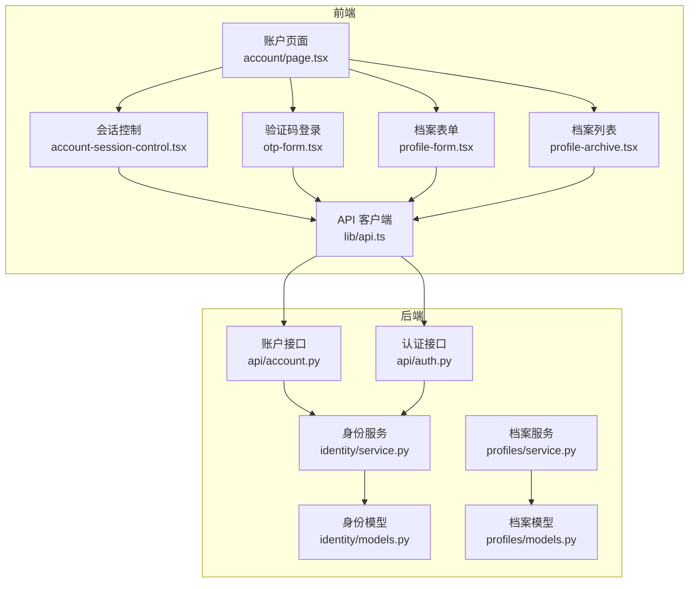
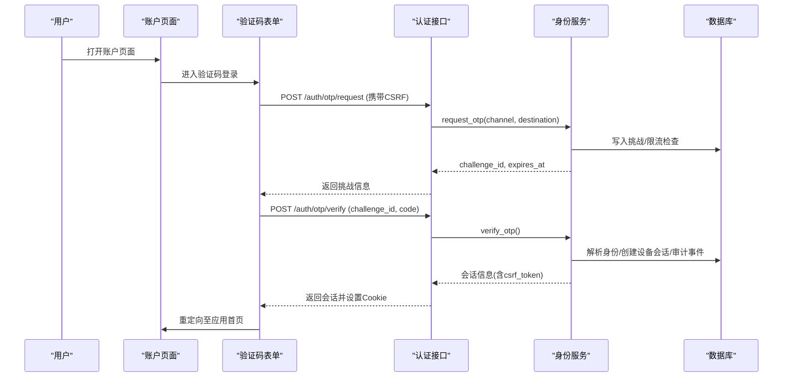
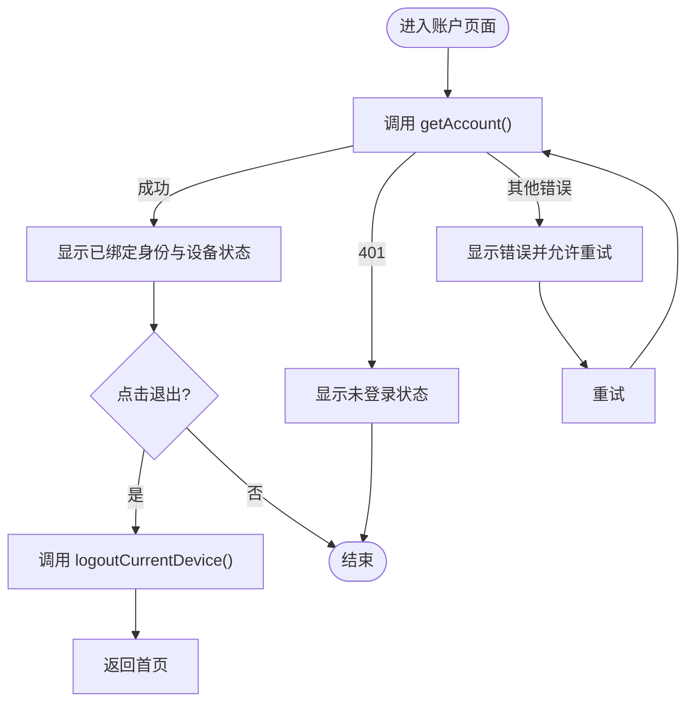
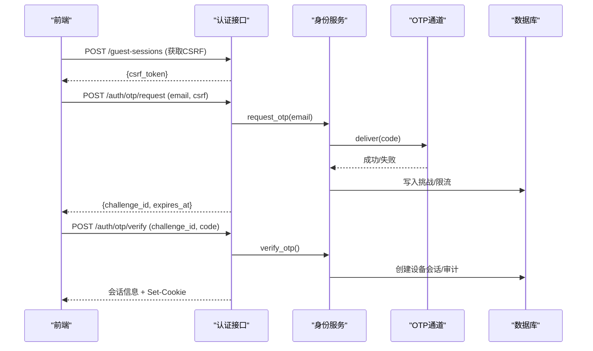
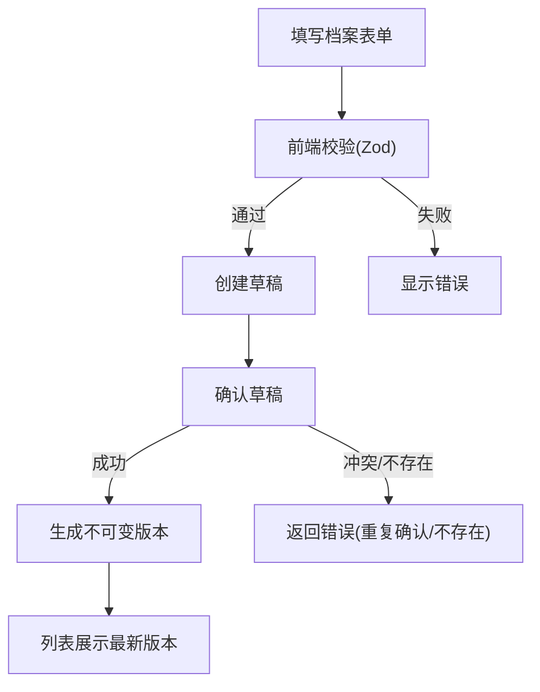
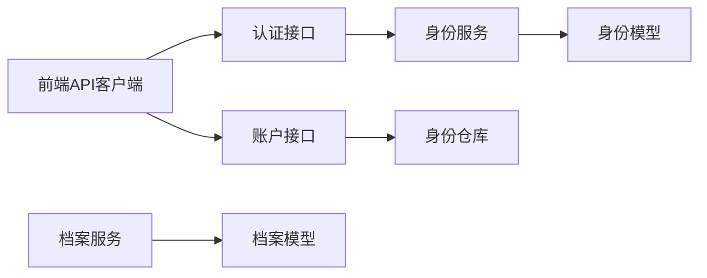

# 账户管理页面

<cite>
**本文引用的文件**
- [web/src/app/account/page.tsx](file://web/src/app/account/page.tsx)
- [web/src/components/account-session-control.tsx](file://web/src/components/account-session-control.tsx)
- [web/src/components/otp-form.tsx](file://web/src/components/otp-form.tsx)
- [web/src/lib/api.ts](file://web/src/lib/api.ts)
- [backend/app/api/account.py](file://backend/app/api/account.py)
- [backend/app/api/auth.py](file://backend/app/api/auth.py)
- [backend/app/identity/service.py](file://backend/app/identity/service.py)
- [backend/app/identity/models.py](file://backend/app/identity/models.py)
- [backend/app/profiles/service.py](file://backend/app/profiles/service.py)
- [backend/app/profiles/models.py](file://backend/app/profiles/models.py)
- [web/src/components/profile-form.tsx](file://web/src/components/profile-form.tsx)
- [web/src/components/profile-archive.tsx](file://web/src/components/profile-archive.tsx)
</cite>

## 目录
1. [简介](#简介)
2. [项目结构](#项目结构)
3. [核心组件](#核心组件)
4. [架构总览](#架构总览)
5. [详细组件分析](#详细组件分析)
6. [依赖关系分析](#依赖关系分析)
7. [性能与可用性](#性能与可用性)
8. [故障排查指南](#故障排查指南)
9. [结论](#结论)
10. [附录：数据模型与接口契约](#附录数据模型与接口契约)

## 简介
本文件面向“账户管理页面”的完整实现，覆盖以下目标：
- 用户账户信息展示、个人信息编辑、档案管理（创建、确认、版本化、归档）
- 认证状态管理、会话处理（设备会话、游客会话）、权限控制（CSRF、设备校验）
- 表单验证、数据同步、错误处理策略
- 隐私保护与数据安全（最小化前端敏感数据、服务端加密存储、不可变版本）

该页面以邮箱验证码登录为核心入口，登录后建立设备会话；档案采用“草稿→确认→不可变版本”的流程，支持后续版本迭代与归档查看。

## 项目结构
账户管理相关的前后端组织如下：
- 前端页面与组件
  - 账户页：account/page.tsx
  - 会话控制：account-session-control.tsx
  - 验证码登录：otp-form.tsx
  - 档案表单与列表：profile-form.tsx、profile-archive.tsx
  - API 客户端封装：lib/api.ts
- 后端服务
  - 账户查询：api/account.py
  - 认证与会话：api/auth.py、identity/service.py、identity/models.py
  - 档案服务与模型：profiles/service.py、profiles/models.py

图表来源
- [web/src/app/account/page.tsx:9-63](file://web/src/app/account/page.tsx#L9-L63)
- [web/src/components/account-session-control.tsx:37-171](file://web/src/components/account-session-control.tsx#L37-L171)
- [web/src/components/otp-form.tsx:83-364](file://web/src/components/otp-form.tsx#L83-L364)
- [web/src/components/profile-form.tsx:112-570](file://web/src/components/profile-form.tsx#L112-L570)
- [web/src/components/profile-archive.tsx:39-256](file://web/src/components/profile-archive.tsx#L39-L256)
- [web/src/lib/api.ts:256-430](file://web/src/lib/api.ts#L256-L430)
- [backend/app/api/account.py:13-28](file://backend/app/api/account.py#L13-L28)
- [backend/app/api/auth.py:44-161](file://backend/app/api/auth.py#L44-L161)
- [backend/app/identity/service.py:78-192](file://backend/app/identity/service.py#L78-L192)
- [backend/app/profiles/service.py:44-189](file://backend/app/profiles/service.py#L44-L189)

章节来源
- [web/src/app/account/page.tsx:9-63](file://web/src/app/account/page.tsx#L9-L63)
- [web/src/lib/api.ts:256-430](file://web/src/lib/api.ts#L256-L430)
- [backend/app/api/account.py:13-28](file://backend/app/api/account.py#L13-L28)
- [backend/app/api/auth.py:44-161](file://backend/app/api/auth.py#L44-L161)

## 核心组件
- 账户页面：聚合验证码登录、设备会话控制、预留订单与数据权利入口，强调“登录≠能力开通”。
- 会话控制：探测当前设备是否已登录，展示绑定身份，支持退出当前设备。
- 验证码登录：基于邮箱发送验证码，校验后建立设备会话并设置 CSRF Token。
- 档案表单：采集出生事实与计算口径，提交前核对，成功后生成不可变版本。
- 档案列表：列出最新档案版本，支持启动解读流程或跳转历史。

章节来源
- [web/src/app/account/page.tsx:9-63](file://web/src/app/account/page.tsx#L9-L63)
- [web/src/components/account-session-control.tsx:37-171](file://web/src/components/account-session-control.tsx#L37-L171)
- [web/src/components/otp-form.tsx:83-364](file://web/src/components/otp-form.tsx#L83-L364)
- [web/src/components/profile-form.tsx:112-570](file://web/src/components/profile-form.tsx#L112-L570)
- [web/src/components/profile-archive.tsx:39-256](file://web/src/components/profile-archive.tsx#L39-L256)

## 架构总览
账户管理涉及两条主线：
- 认证与设备会话：通过邮箱验证码完成身份核验，建立设备会话并下发 CSRF Token，用于后续写操作防护。
- 档案生命周期：创建草稿→填写信息→确认生成不可变版本→列表展示与使用。

图表来源
- [web/src/components/otp-form.tsx:131-207](file://web/src/components/otp-form.tsx#L131-L207)
- [backend/app/api/auth.py:44-138](file://backend/app/api/auth.py#L44-L138)
- [backend/app/identity/service.py:100-192](file://backend/app/identity/service.py#L100-L192)

章节来源
- [web/src/components/otp-form.tsx:131-207](file://web/src/components/otp-form.tsx#L131-L207)
- [backend/app/api/auth.py:44-138](file://backend/app/api/auth.py#L44-L138)
- [backend/app/identity/service.py:100-192](file://backend/app/identity/service.py#L100-L192)

## 详细组件分析

### 账户页面与设备会话控制
- 账户页面提供验证码登录入口、账户边界说明与工具区占位。
- 设备会话控制会调用账户接口获取当前设备状态，若未登录则提示重新登录；已登录时显示绑定身份并提供退出按钮。

图表来源
- [web/src/components/account-session-control.tsx:44-82](file://web/src/components/account-session-control.tsx#L44-L82)
- [web/src/lib/api.ts:423-430](file://web/src/lib/api.ts#L423-L430)
- [backend/app/api/account.py:13-28](file://backend/app/api/account.py#L13-L28)

章节来源
- [web/src/app/account/page.tsx:9-63](file://web/src/app/account/page.tsx#L9-L63)
- [web/src/components/account-session-control.tsx:37-171](file://web/src/components/account-session-control.tsx#L37-L171)
- [backend/app/api/account.py:13-28](file://backend/app/api/account.py#L13-L28)

### 验证码登录流程与会话安全
- 前端先建立游客会话获取 CSRF Token，再请求验证码；验证通过后建立设备会话并设置 Cookie。
- 后端对目的地进行归一化与哈希，限制请求频率，失败时回滚资源占用；验证成功后记录审计事件。

图表来源
- [web/src/components/otp-form.tsx:107-207](file://web/src/components/otp-form.tsx#L107-L207)
- [backend/app/api/auth.py:44-138](file://backend/app/api/auth.py#L44-L138)
- [backend/app/identity/service.py:100-192](file://backend/app/identity/service.py#L100-L192)

章节来源
- [web/src/components/otp-form.tsx:107-207](file://web/src/components/otp-form.tsx#L107-L207)
- [backend/app/api/auth.py:44-138](file://backend/app/api/auth.py#L44-L138)
- [backend/app/identity/service.py:100-192](file://backend/app/identity/service.py#L100-L192)

### 档案创建、编辑与版本控制
- 前端通过表单收集出生事实与计算口径，提交前进行本地校验（Zod），再调用后端创建草稿并确认。
- 后端将草稿转换为不可变的 ProfileVersion，禁止更新；支持按所有者（用户或游客）隔离访问。

图表来源
- [web/src/components/profile-form.tsx:166-218](file://web/src/components/profile-form.tsx#L166-L218)
- [backend/app/profiles/service.py:52-105](file://backend/app/profiles/service.py#L52-L105)
- [backend/app/profiles/models.py:49-80](file://backend/app/profiles/models.py#L49-L80)

章节来源
- [web/src/components/profile-form.tsx:166-218](file://web/src/components/profile-form.tsx#L166-L218)
- [backend/app/profiles/service.py:52-105](file://backend/app/profiles/service.py#L52-L105)
- [backend/app/profiles/models.py:49-80](file://backend/app/profiles/models.py#L49-L80)

### 档案列表与归档
- 列表仅展示服务端返回的安全字段，避免泄露原始输入。
- 支持从最新版本直接启动解读流程，或跳转到历史解读。

章节来源
- [web/src/components/profile-archive.tsx:52-107](file://web/src/components/profile-archive.tsx#L52-L107)
- [web/src/lib/api.ts:413-416](file://web/src/lib/api.ts#L413-L416)

### 权限控制与数据同步
- 所有写操作均携带 CSRF Token，防止跨站请求伪造。
- 读操作通过设备会话校验（require_device_session/require_device_csrf）。
- 前端在请求异常时清理 CSRF 缓存并重试一次，提升鲁棒性。

章节来源
- [web/src/lib/api.ts:292-330](file://web/src/lib/api.ts#L292-L330)
- [backend/app/api/auth.py:141-161](file://backend/app/api/auth.py#L141-L161)
- [backend/app/api/account.py:13-28](file://backend/app/api/account.py#L13-L28)

## 依赖关系分析
- 前端依赖
  - 账户页面依赖会话控制、验证码表单、档案表单与列表。
  - API 客户端统一封装请求、CSRF、幂等键、错误转换。
- 后端依赖
  - 认证接口依赖身份服务与数据库会话。
  - 账户接口依赖身份仓库与设备会话校验。
  - 档案服务依赖档案仓库与加密信封。

图表来源
- [web/src/lib/api.ts:256-430](file://web/src/lib/api.ts#L256-L430)
- [backend/app/api/auth.py:44-161](file://backend/app/api/auth.py#L44-L161)
- [backend/app/api/account.py:13-28](file://backend/app/api/account.py#L13-L28)
- [backend/app/identity/service.py:78-192](file://backend/app/identity/service.py#L78-L192)
- [backend/app/profiles/service.py:44-189](file://backend/app/profiles/service.py#L44-L189)

章节来源
- [web/src/lib/api.ts:256-430](file://web/src/lib/api.ts#L256-L430)
- [backend/app/api/auth.py:44-161](file://backend/app/api/auth.py#L44-L161)
- [backend/app/api/account.py:13-28](file://backend/app/api/account.py#L13-L28)
- [backend/app/identity/service.py:78-192](file://backend/app/identity/service.py#L78-L192)
- [backend/app/profiles/service.py:44-189](file://backend/app/profiles/service.py#L44-L189)

## 性能与可用性
- 验证码发送与验证具备速率限制与冷却时间，避免滥用与风暴。
- 设备会话有效期可配置，减少频繁重登。
- 前端对网络异常与服务器不可用提供重试与友好提示。
- 档案版本不可变，避免并发修改冲突，简化一致性保证。

[本节为通用指导，不直接分析具体文件]

## 故障排查指南
- 无法读取账户状态
  - 现象：会话控制显示错误并可重试。
  - 可能原因：网络问题、服务不可用、会话失效。
  - 处理：检查网络与服务状态；必要时重新登录。
  - 参考路径：[会话控制错误分支:104-123](file://web/src/components/account-session-control.tsx#L104-L123)、[账户接口校验:13-28](file://backend/app/api/account.py#L13-L28)
- 验证码发送失败
  - 现象：表单报错或提示服务不可用。
  - 可能原因：邮箱格式无效、渠道不可用、限流。
  - 处理：检查邮箱格式；等待冷却；重试或更换邮箱。
  - 参考路径：[验证码表单错误处理:131-166](file://web/src/components/otp-form.tsx#L131-L166)、[认证接口错误映射:69-88](file://backend/app/api/auth.py#L69-L88)
- 验证码验证失败
  - 现象：提示验证码无效或尝试过多。
  - 可能原因：过期、错误、限流。
  - 处理：重新发送验证码；注意冷却时间。
  - 参考路径：[验证码验证错误处理:107-111](file://backend/app/api/auth.py#L107-L111)
- 档案保存失败
  - 现象：表单提交后显示错误。
  - 可能原因：参数校验失败、草稿不存在、重复确认。
  - 处理：检查必填项与时区选择；确保草稿未被确认。
  - 参考路径：[档案表单提交:166-218](file://web/src/components/profile-form.tsx#L166-L218)、[档案服务确认逻辑:65-105](file://backend/app/profiles/service.py#L65-L105)

章节来源
- [web/src/components/account-session-control.tsx:104-123](file://web/src/components/account-session-control.tsx#L104-L123)
- [backend/app/api/account.py:13-28](file://backend/app/api/account.py#L13-L28)
- [web/src/components/otp-form.tsx:131-166](file://web/src/components/otp-form.tsx#L131-L166)
- [backend/app/api/auth.py:69-111](file://backend/app/api/auth.py#L69-L111)
- [web/src/components/profile-form.tsx:166-218](file://web/src/components/profile-form.tsx#L166-L218)
- [backend/app/profiles/service.py:65-105](file://backend/app/profiles/service.py#L65-L105)

## 结论
账户管理页面以邮箱验证码登录为核心，结合设备会话与 CSRF 防护，保障写操作安全；档案采用“草稿→确认→不可变版本”的设计，确保数据一致性与可追溯性。前端注重用户体验与错误提示，后端提供严格的校验、限流与审计。整体方案兼顾安全性、可用性与可扩展性。

[本节为总结，不直接分析具体文件]

## 附录：数据模型与接口契约
- 身份与会话模型
  - 用户、登录身份、设备会话、游客会话、审计事件
  - 关键约束：设备会话令牌哈希唯一、游客会话过期索引、审计事件关联用户与会话
- 档案模型
  - 主体档案与版本：版本不可变，通过主键与版本号唯一标识
  - 所有权：用户或游客二选一，确保隔离
- 接口契约要点
  - 账户接口：需设备会话，返回用户ID与绑定身份摘要
  - 认证接口：验证码请求与验证，设置设备会话Cookie
  - 档案接口：创建草稿、确认草稿、列出最新版本

章节来源
- [backend/app/identity/models.py:31-132](file://backend/app/identity/models.py#L31-L132)
- [backend/app/profiles/models.py:21-80](file://backend/app/profiles/models.py#L21-L80)
- [backend/app/api/account.py:13-28](file://backend/app/api/account.py#L13-L28)
- [backend/app/api/auth.py:44-161](file://backend/app/api/auth.py#L44-L161)