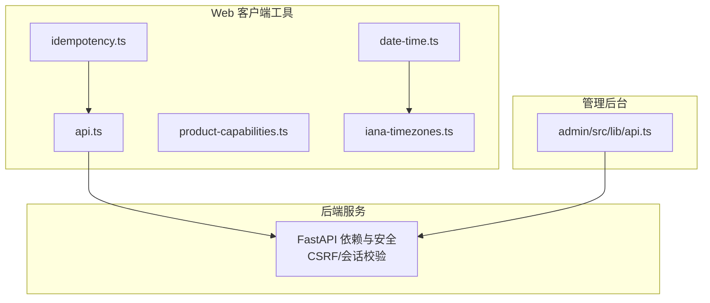
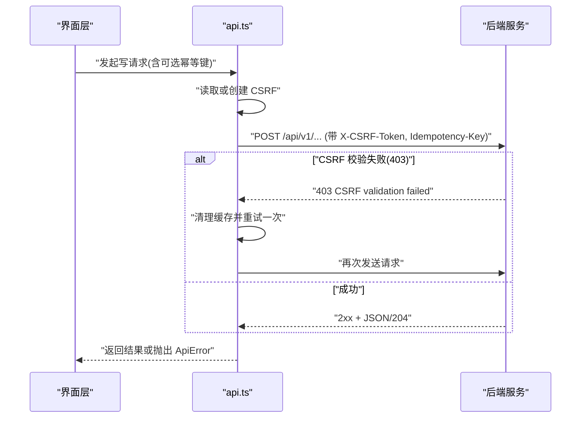
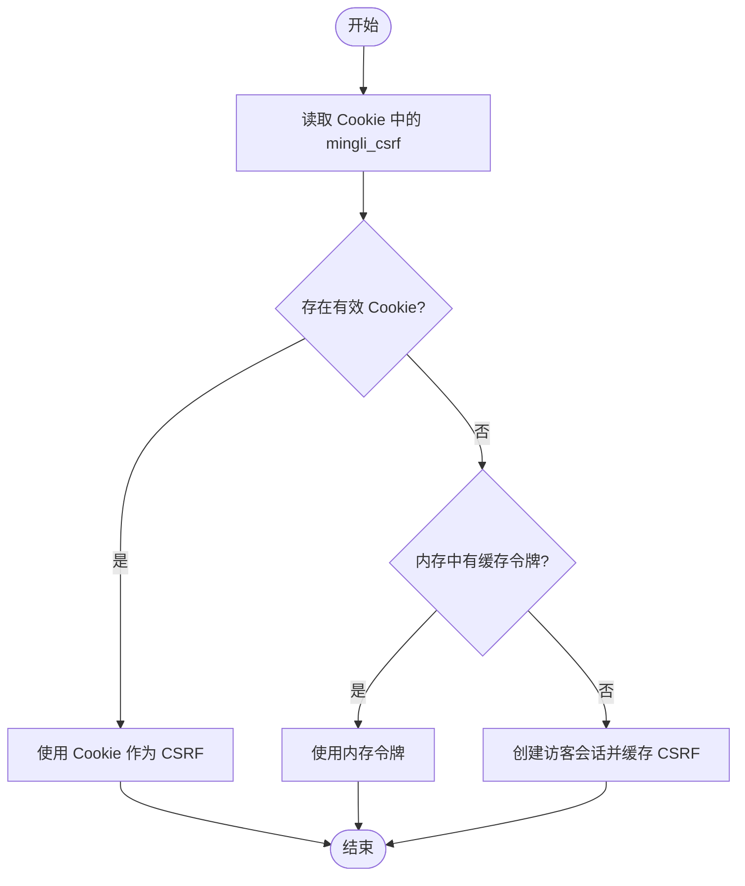
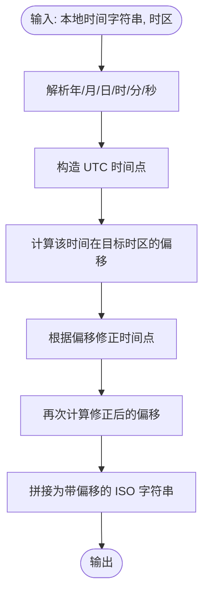
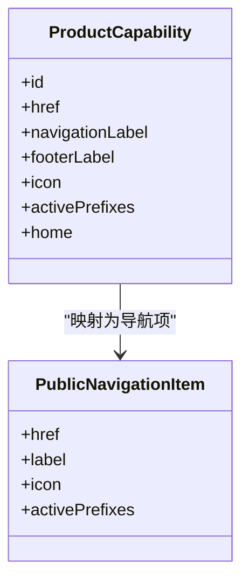
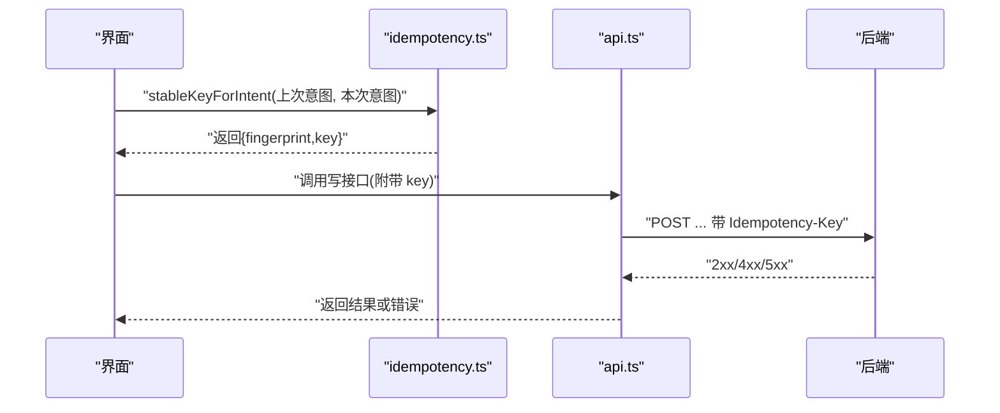
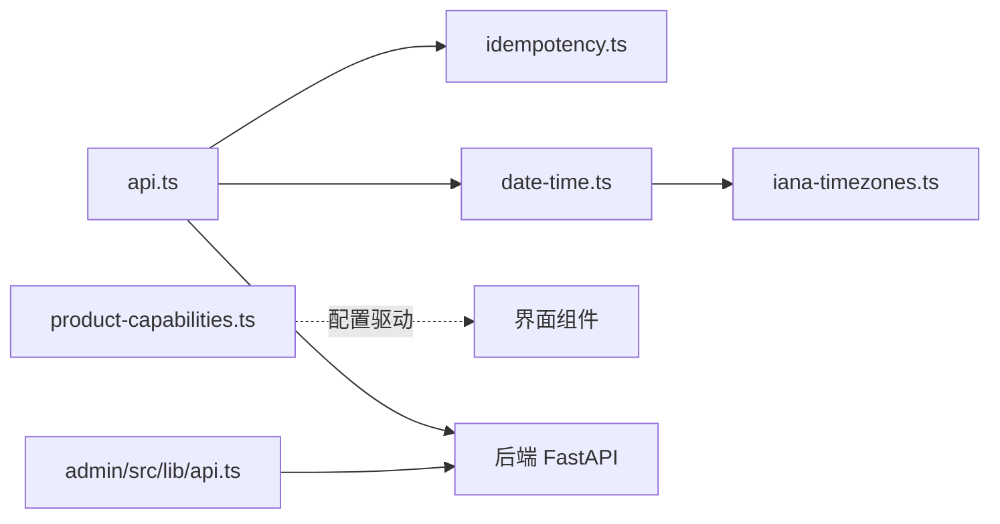

# 客户端工具库

<cite>
**本文引用的文件**
- [web/src/lib/api.ts](file://web/src/lib/api.ts)
- [web/src/lib/date-time.ts](file://web/src/lib/date-time.ts)
- [web/src/lib/product-capabilities.ts](file://web/src/lib/product-capabilities.ts)
- [web/src/lib/idempotency.ts](file://web/src/lib/idempotency.ts)
- [web/src/lib/iana-timezones.ts](file://web/src/lib/iana-timezones.ts)
- [admin/src/lib/api.ts](file://admin/src/lib/api.ts)
- [web/src/test/api-session.test.ts](file://web/src/test/api-session.test.ts)
- [web/src/test/api-readings.test.ts](file://web/src/test/api-readings.test.ts)
- [backend/app/api/dependencies.py](file://backend/app/api/dependencies.py)
</cite>

## 目录
1. [简介](#简介)
2. [项目结构](#项目结构)
3. [核心组件](#核心组件)
4. [架构总览](#架构总览)
5. [详细组件分析](#详细组件分析)
6. [依赖关系分析](#依赖关系分析)
7. [性能考虑](#性能考虑)
8. [故障排查指南](#故障排查指南)
9. [结论](#结论)
10. [附录：使用示例与最佳实践](#附录使用示例与最佳实践)

## 简介
本客户端工具库围绕浏览器端网络请求、日期时间处理、产品能力检测与幂等性保障四大主题，提供统一、安全、可复用的前端能力。其目标包括：
- 统一的 API 客户端封装：内置 CSRF 管理、错误处理、重试策略（针对特定失败场景）与幂等键注入。
- 可靠的日期时间工具：基于 IANA 时区进行本地化偏移计算与格式化，确保跨时区一致性。
- 产品能力注册表：集中维护功能入口、导航与页脚链接，便于权限与可见性控制。
- 幂等性机制：为写操作生成稳定且唯一的幂等键，避免重复提交导致的数据不一致。
- 扩展与集成：提供清晰的模块边界与测试用例，便于在 Next.js 应用中集成与二次开发。

## 项目结构
客户端工具库位于 web/src/lib 下，按职责划分模块：
- api.ts：HTTP 客户端、CSRF 会话、错误类型、业务接口封装、结果数据清洗。
- date-time.ts：基于 IANA 时区的本地时间偏移计算与格式化。
- iana-timezones.ts：IANA 时区白名单与校验。
- product-capabilities.ts：产品能力注册表、导航项与页脚应用列表。
- idempotency.ts：意图指纹与幂等键的稳定生成与复用。
- admin/src/lib/api.ts：管理后台轻量 HTTP 封装与 CSRF 读取。

图表来源
- [web/src/lib/api.ts:256-385](file://web/src/lib/api.ts#L256-L385)
- [web/src/lib/date-time.ts:1-58](file://web/src/lib/date-time.ts#L1-L58)
- [web/src/lib/product-capabilities.ts:30-140](file://web/src/lib/product-capabilities.ts#L30-L140)
- [web/src/lib/idempotency.ts:1-18](file://web/src/lib/idempotency.ts#L1-L18)
- [web/src/lib/iana-timezones.ts:1-428](file://web/src/lib/iana-timezones.ts#L1-L428)
- [admin/src/lib/api.ts:28-79](file://admin/src/lib/api.ts#L28-L79)
- [backend/app/api/dependencies.py:29-54](file://backend/app/api/dependencies.py#L29-L54)

章节来源
- [web/src/lib/api.ts:235-385](file://web/src/lib/api.ts#L235-L385)
- [web/src/lib/date-time.ts:1-58](file://web/src/lib/date-time.ts#L1-L58)
- [web/src/lib/product-capabilities.ts:30-140](file://web/src/lib/product-capabilities.ts#L30-L140)
- [web/src/lib/idempotency.ts:1-18](file://web/src/lib/idempotency.ts#L1-L18)
- [web/src/lib/iana-timezones.ts:1-428](file://web/src/lib/iana-timezones.ts#L1-L428)
- [admin/src/lib/api.ts:28-79](file://admin/src/lib/api.ts#L28-L79)
- [backend/app/api/dependencies.py:29-54](file://backend/app/api/dependencies.py#L29-L54)

## 核心组件
- API 客户端与错误处理
  - 统一请求函数负责 JSON 解析、状态码判断、错误对象构造与返回体标准化。
  - 自定义 ApiError 携带状态码与详情，便于上层捕获与展示。
  - 对 204 No Content 做特殊处理，避免空响应导致的解析异常。
- CSRF 与会话管理
  - 优先从 Cookie 读取设备级 CSRF；若无则创建访客会话并缓存其 CSRF。
  - 支持“采用”已验证的设备 CSRF，避免重复创建访客会话。
  - 登出后清理内存缓存，确保下次请求重新建立会话。
- 幂等性
  - 为写操作提供幂等键生成器，支持 Web Crypto UUID 与降级方案。
  - 通过请求头传递幂等键，服务端据此去重。
- 结果数据安全
  - 对结果面板中的原始输入引用进行过滤，防止敏感信息进入 React 状态。
- 管理后台 HTTP 封装
  - 轻量 fetch 封装，自动附加 CSRF 头，统一错误返回格式。

章节来源
- [web/src/lib/api.ts:244-330](file://web/src/lib/api.ts#L244-L330)
- [web/src/lib/api.ts:332-392](file://web/src/lib/api.ts#L332-L392)
- [web/src/lib/api.ts:476-488](file://web/src/lib/api.ts#L476-L488)
- [admin/src/lib/api.ts:28-79](file://admin/src/lib/api.ts#L28-L79)

## 架构总览
下图展示了客户端工具库与后端的安全交互流程，涵盖 CSRF 获取、访客会话创建、鉴权失败重试与幂等键注入。

图表来源
- [web/src/lib/api.ts:292-330](file://web/src/lib/api.ts#L292-L330)
- [web/src/lib/api.ts:359-385](file://web/src/lib/api.ts#L359-L385)
- [backend/app/api/dependencies.py:29-54](file://backend/app/api/dependencies.py#L29-L54)

章节来源
- [web/src/lib/api.ts:292-330](file://web/src/lib/api.ts#L292-L330)
- [web/src/lib/api.ts:359-385](file://web/src/lib/api.ts#L359-L385)
- [backend/app/api/dependencies.py:29-54](file://backend/app/api/dependencies.py#L29-L54)

## 详细组件分析

### API 客户端封装
- 请求拦截与错误处理
  - 统一解析 JSON，非 JSON 响应按错误处理。
  - 非 2xx 状态抛出自定义 ApiError，携带 title/detail。
  - 204 直接返回 undefined，避免空体解析问题。
- CSRF 管理
  - getCsrfToken：优先读 Cookie，其次复用内存令牌，最后创建访客会话并缓存。
  - adoptCsrfToken：用于登录后直接采用设备 CSRF，跳过访客会话。
  - clearCsrfCache/resetApiCache：登出或异常后清理缓存，保证会话新鲜度。
- 幂等性
  - createIdempotencyKey：优先使用 crypto.randomUUID，否则回退到时间戳+随机串。
  - jsonPost：当传入 idempotencyKey 时，设置 Idempotency-Key 请求头。
- 结果安全
  - getReadingResult 返回前对 fact_panel 执行隐私过滤，移除原始输入引用。

图表来源
- [web/src/lib/api.ts:332-385](file://web/src/lib/api.ts#L332-L385)

章节来源
- [web/src/lib/api.ts:256-330](file://web/src/lib/api.ts#L256-L330)
- [web/src/lib/api.ts:332-392](file://web/src/lib/api.ts#L332-L392)
- [web/src/lib/api.ts:476-488](file://web/src/lib/api.ts#L476-L488)

### 日期时间处理与时区转换
- 核心能力
  - localDateTimeWithOffset：将本地字符串时间转换为带正确 UTC 偏移的 ISO 字符串，考虑夏令时切换。
  - offsetMinutesAt：基于 Intl.DateTimeFormat 提取指定时区的分钟偏移。
  - formatOffset：将分钟偏移格式化为 Z 或 ±HH:mm。
- 适用场景
  - 用户选择 IANA 时区后，将表单输入的本地时间转为服务器期望的带偏移时间。
  - 避免跨时区显示与存储不一致的问题。

图表来源
- [web/src/lib/date-time.ts:1-58](file://web/src/lib/date-time.ts#L1-L58)

章节来源
- [web/src/lib/date-time.ts:1-58](file://web/src/lib/date-time.ts#L1-L58)

### 产品能力检测与权限控制
- 能力注册表
  - PRODUCT_CAPABILITIES：集中声明各能力的路径、图标、激活前缀、首页文案与动作。
  - PUBLIC_PRIMARY_NAVIGATION/PUBLIC_UTILITY_NAVIGATION/PUBLIC_FOOTER_APPLICATIONS：由注册表派生导航与页脚。
- 权限与可见性
  - 通过 activePrefixes 匹配当前路径高亮导航项。
  - 结合后端权限策略（如能力 ID），可在渲染层决定入口可见性与操作按钮。
- 扩展方式
  - 新增能力只需在注册表中添加条目，并在路由与权限策略中配置对应规则。

图表来源
- [web/src/lib/product-capabilities.ts:12-28](file://web/src/lib/product-capabilities.ts#L12-L28)
- [web/src/lib/product-capabilities.ts:96-110](file://web/src/lib/product-capabilities.ts#L96-L110)

章节来源
- [web/src/lib/product-capabilities.ts:30-140](file://web/src/lib/product-capabilities.ts#L30-L140)

### 幂等性处理机制
- 设计要点
  - 幂等键生成：优先使用 crypto.randomUUID，兼容无此能力的旧环境。
  - 意图稳定性：stableKeyForIntent 基于请求体的 JSON 指纹，相同意图复用同一幂等键。
  - 传输层：通过 Idempotency-Key 请求头传递给后端，实现服务端去重。
- 使用建议
  - 所有写操作（创建档案、开始阅读、提交输入、后续追问等）均应附带幂等键。
  - 在 UI 层缓存 IntentKey，避免重复点击产生新键。

图表来源
- [web/src/lib/idempotency.ts:1-18](file://web/src/lib/idempotency.ts#L1-L18)
- [web/src/lib/api.ts:387-392](file://web/src/lib/api.ts#L387-L392)
- [web/src/lib/api.ts:292-315](file://web/src/lib/api.ts#L292-L315)

章节来源
- [web/src/lib/idempotency.ts:1-18](file://web/src/lib/idempotency.ts#L1-L18)
- [web/src/lib/api.ts:292-315](file://web/src/lib/api.ts#L292-L315)
- [web/src/lib/api.ts:387-392](file://web/src/lib/api.ts#L387-L392)

### 时区工具与白名单
- IANA 时区白名单
  - isIanaTimeZone：校验用户选择的时区是否合法。
  - IANA_TIME_ZONES：完整时区列表，供下拉框或选择器使用。
- 与日期时间工具的协作
  - 先校验时区合法性，再调用 localDateTimeWithOffset 生成带偏移的时间字符串。

章节来源
- [web/src/lib/iana-timezones.ts:1-428](file://web/src/lib/iana-timezones.ts#L1-L428)
- [web/src/lib/date-time.ts:1-58](file://web/src/lib/date-time.ts#L1-L58)

## 依赖关系分析
- 模块内聚与耦合
  - api.ts 依赖 idempotency.ts 生成幂等键，依赖 date-time.ts 与 iana-timezones.ts 完成时间处理。
  - product-capabilities.ts 独立于网络层，仅暴露配置与导航派生。
  - admin/src/lib/api.ts 独立封装，不依赖 web 客户端工具。
- 外部依赖
  - 后端 FastAPI 依赖提供 CSRF 双提交校验与会话管理，客户端需严格遵循协议。

图表来源
- [web/src/lib/api.ts:292-392](file://web/src/lib/api.ts#L292-L392)
- [web/src/lib/date-time.ts:1-58](file://web/src/lib/date-time.ts#L1-L58)
- [web/src/lib/iana-timezones.ts:1-428](file://web/src/lib/iana-timezones.ts#L1-L428)
- [web/src/lib/product-capabilities.ts:30-140](file://web/src/lib/product-capabilities.ts#L30-L140)
- [admin/src/lib/api.ts:28-79](file://admin/src/lib/api.ts#L28-L79)
- [backend/app/api/dependencies.py:29-54](file://backend/app/api/dependencies.py#L29-L54)

章节来源
- [web/src/lib/api.ts:292-392](file://web/src/lib/api.ts#L292-L392)
- [web/src/lib/date-time.ts:1-58](file://web/src/lib/date-time.ts#L1-L58)
- [web/src/lib/iana-timezones.ts:1-428](file://web/src/lib/iana-timezones.ts#L1-L428)
- [web/src/lib/product-capabilities.ts:30-140](file://web/src/lib/product-capabilities.ts#L30-L140)
- [admin/src/lib/api.ts:28-79](file://admin/src/lib/api.ts#L28-L79)
- [backend/app/api/dependencies.py:29-54](file://backend/app/api/dependencies.py#L29-L54)

## 性能考虑
- CSRF 缓存
  - 访客会话与设备 CSRF 均被缓存，减少不必要的网络请求。
  - 登出或 403 失败后清理缓存，避免过期令牌影响。
- 结果数据最小化
  - 对结果面板中的敏感字段进行过滤，降低状态体积与泄露风险。
- 时区计算
  - 仅在必要时计算偏移，避免频繁调用 Intl API。
- 幂等键复用
  - 基于意图指纹复用幂等键，减少重复提交与后端压力。

[本节为通用指导，无需具体文件引用]

## 故障排查指南
- 常见错误与定位
  - 403 CSRF 校验失败：检查 Cookie 与请求头是否一致；确认是否已清理缓存并重试。
  - 401 未认证：确认是否已创建访客会话或登录成功；检查 Cookie 是否被浏览器策略限制。
  - 5xx 服务端错误：查看 ApiError.detail 与服务端日志。
- 调试步骤
  - 使用测试用例模拟网络响应，验证 CSRF 获取与重试逻辑。
  - 在浏览器开发者工具中检查 Cookie 与请求头。
  - 核对时区选择是否为合法的 IANA 时区。

章节来源
- [web/src/test/api-session.test.ts:192-280](file://web/src/test/api-session.test.ts#L192-L280)
- [web/src/test/api-readings.test.ts:102-119](file://web/src/test/api-readings.test.ts#L102-L119)
- [backend/app/api/dependencies.py:29-54](file://backend/app/api/dependencies.py#L29-L54)

## 结论
本客户端工具库以安全、稳定、可扩展为核心目标，提供了：
- 健壮的 API 客户端：统一的错误处理、CSRF 管理与幂等性支持。
- 精确的日期时间处理：基于 IANA 时区的偏移计算与格式化。
- 集中的产品能力注册：驱动导航、页脚与权限控制。
- 完善的测试覆盖：确保关键行为符合预期。
建议在新增功能时遵循现有模式，保持模块边界清晰，并通过测试保障质量。

[本节为总结性内容，无需具体文件引用]

## 附录：使用示例与最佳实践
- API 客户端
  - 写操作务必附带幂等键：调用 startPreviewReading/startTodayReading/startWeekReading/startLiuyaoReading/createFollowUp 等方法时传入幂等键。
  - 捕获 ApiError：根据 status 与 detail 提示用户，必要时引导重新登录或刷新页面。
  - 登出后重置缓存：调用 resetApiCache 确保下次请求重建会话。
- 日期时间
  - 先校验时区：使用 isIanaTimeZone 校验用户选择后再调用 localDateTimeWithOffset。
  - 统一格式：始终使用带偏移的 ISO 字符串与后端交互，避免歧义。
- 产品能力
  - 新增能力：在 PRODUCT_CAPABILITIES 中添加条目，并在路由与权限策略中配置。
  - 导航高亮：使用 isPublicNavigationItemActive 判断当前路径是否激活。
- 幂等性
  - 意图稳定：使用 stableKeyForIntent 比较前后意图，相同则复用键。
  - 前端缓存：在组件状态中保存 IntentKey，避免重复生成。
- 管理后台
  - 使用 adminFetch 进行请求，自动附加 CSRF；统一处理 ok/data 与错误结构。

章节来源
- [web/src/lib/api.ts:387-525](file://web/src/lib/api.ts#L387-L525)
- [web/src/lib/date-time.ts:1-58](file://web/src/lib/date-time.ts#L1-L58)
- [web/src/lib/iana-timezones.ts:423-428](file://web/src/lib/iana-timezones.ts#L423-L428)
- [web/src/lib/product-capabilities.ts:118-140](file://web/src/lib/product-capabilities.ts#L118-L140)
- [web/src/lib/idempotency.ts:1-18](file://web/src/lib/idempotency.ts#L1-L18)
- [admin/src/lib/api.ts:28-79](file://admin/src/lib/api.ts#L28-L79)