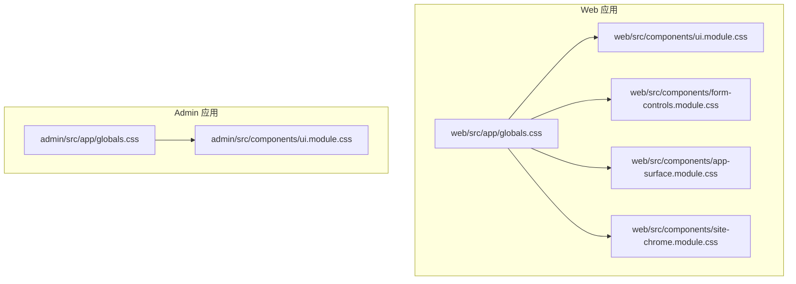
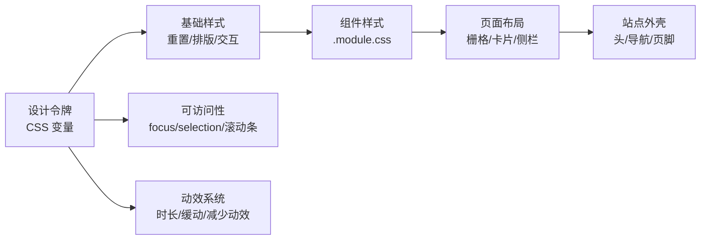
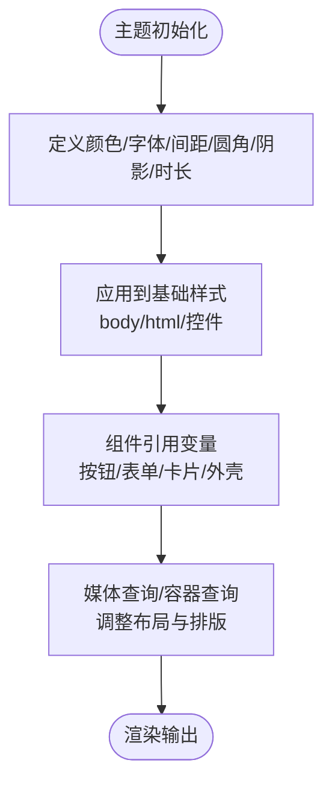
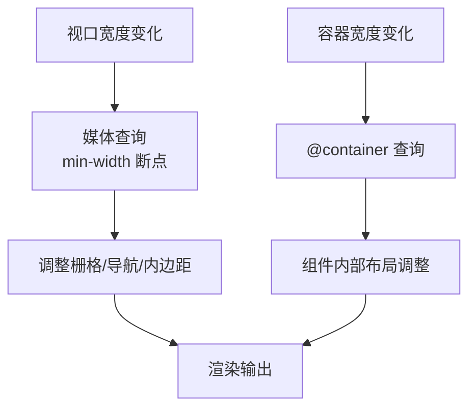
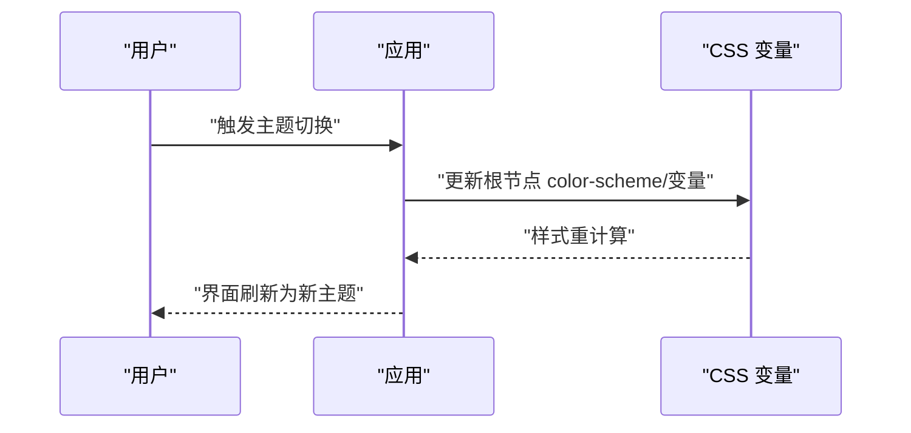
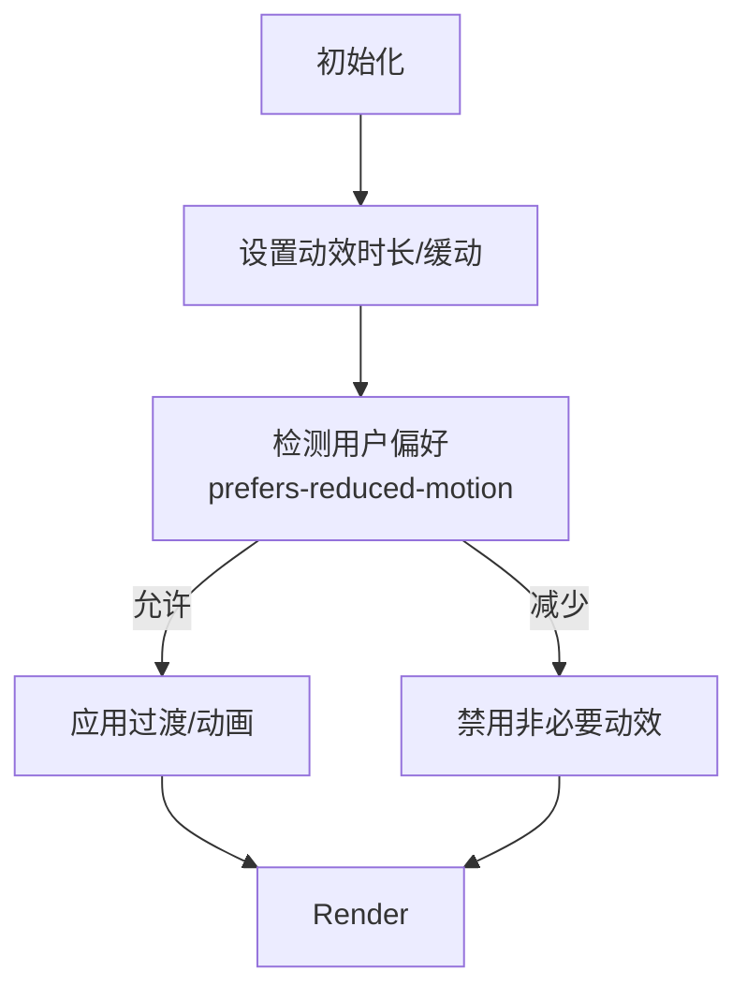
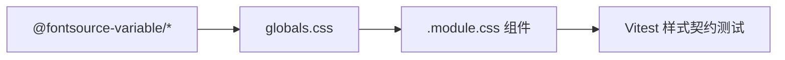

# 样式系统

<cite>
**本文引用的文件**
- [web/package.json](file://web/package.json)
- [admin/package.json](file://admin/package.json)
- [web/src/app/globals.css](file://web/src/app/globals.css)
- [admin/src/app/globals.css](file://admin/src/app/globals.css)
- [web/src/components/ui.module.css](file://web/src/components/ui.module.css)
- [admin/src/components/ui.module.css](file://admin/src/components/ui.module.css)
- [web/src/components/form-controls.module.css](file://web/src/components/form-controls.module.css)
- [web/src/components/app-surface.module.css](file://web/src/components/app-surface.module.css)
- [web/src/components/site-chrome.module.css](file://web/src/components/site-chrome.module.css)
- [web/src/test/public-style-contract.test.ts](file://web/src/test/public-style-contract.test.ts)
- [web/src/test/reading-detail-contract.test.tsx](file://web/src/test/reading-detail-contract.test.tsx)
- [web/src/test/responsive-reading-layout.test.ts](file://web/src/test/responsive-reading-layout.test.ts)
</cite>

## 目录
1. [简介](#简介)
2. [项目结构](#项目结构)
3. [核心组件](#核心组件)
4. [架构总览](#架构总览)
5. [详细组件分析](#详细组件分析)
6. [依赖关系分析](#依赖关系分析)
7. [性能考量](#性能考量)
8. [故障排查指南](#故障排查指南)
9. [结论](#结论)
10. [附录](#附录)

## 简介
本样式系统基于 Next.js 与 CSS Modules，采用“设计令牌 + 组件级样式”的策略构建。全局主题通过 CSS 自定义属性（变量）集中管理，涵盖颜色、字体、间距、圆角、阴影、动效时长等；组件样式以模块化的 .module.css 组织，确保样式隔离与可维护性。项目未使用 Tailwind CSS，而是通过统一的变量体系与响应式断点实现跨页面一致的视觉语言与布局行为。文档将围绕主题系统、CSS 模块化策略、响应式设计、暗色模式支持、动效与无障碍、以及开发与调试工作流展开。

## 项目结构
- 前端应用位于 web 与 admin 两个 Next.js 子工程，各自拥有独立的 package.json 与样式入口。
- 全局样式入口为各工程的 src/app/globals.css，定义设计令牌与基础重置。
- 组件样式位于 src/components 下的 .module.css 文件，按功能域拆分（如表单控件、页面外壳、站点 Chrome 等）。
- 测试用例对样式契约进行自动化校验，保障公共视觉规范不被破坏。



图表来源
- [web/src/app/globals.css:1-54](file://web/src/app/globals.css#L1-L54)
- [web/src/components/ui.module.css:1-92](file://web/src/components/ui.module.css#L1-L92)
- [web/src/components/form-controls.module.css:1-176](file://web/src/components/form-controls.module.css#L1-L176)
- [web/src/components/app-surface.module.css:1-800](file://web/src/components/app-surface.module.css#L1-L800)
- [web/src/components/site-chrome.module.css:1-461](file://web/src/components/site-chrome.module.css#L1-L461)
- [admin/src/app/globals.css:1-54](file://admin/src/app/globals.css#L1-L54)
- [admin/src/components/ui.module.css:1-231](file://admin/src/components/ui.module.css#L1-L231)

章节来源
- [web/package.json:1-46](file://web/package.json#L1-L46)
- [admin/package.json:1-34](file://admin/package.json#L1-L34)

## 核心组件
- 设计令牌层：在 globals.css 中集中声明颜色、字体、间距、圆角、阴影、动效时长等 CSS 变量，作为全站的单一事实源。
- 基础重置与可访问性：统一 box-sizing、滚动行为、选择器高亮、焦点可见性、减少动效适配等。
- 组件原子与复合组件：ui.module.css 提供按钮、容器等基础原语；form-controls.module.css 提供表单字段、错误提示、操作区等；app-surface.module.css 提供页面骨架、卡片、栅格、状态标签等；site-chrome.module.css 提供站点头部、导航、页脚等。
- 响应式与容器查询：通过媒体查询与 container-type 实现不同屏幕尺寸与容器宽度下的布局变化。
- 动效与无障碍：统一使用缓动函数与时长变量，配合 prefers-reduced-motion 降低动效。

章节来源
- [web/src/app/globals.css:1-177](file://web/src/app/globals.css#L1-L177)
- [web/src/components/ui.module.css:1-92](file://web/src/components/ui.module.css#L1-L92)
- [web/src/components/form-controls.module.css:1-176](file://web/src/components/form-controls.module.css#L1-L176)
- [web/src/components/app-surface.module.css:1-800](file://web/src/components/app-surface.module.css#L1-L800)
- [web/src/components/site-chrome.module.css:1-461](file://web/src/components/site-chrome.module.css#L1-L461)

## 架构总览
样式系统采用“令牌驱动 + 组件化”的层次化架构：
- 令牌层（globals.css）：定义品牌色彩、中性色、边框、背景、阴影、圆角、字体栈、间距、动效时长等。
- 基础样式层：重置默认样式、设置全局排版与交互细节（如 focus-visible、selection、滚动条）。
- 组件层（.module.css）：按功能域组织，复用令牌，组合出按钮、表单、页面骨架、站点外壳等。
- 响应式层：通过媒体查询与容器查询在不同视口与容器中切换布局与排版。
- 可访问性与动效：统一控制过渡与动画，尊重用户偏好（减少动效）。



图表来源
- [web/src/app/globals.css:1-177](file://web/src/app/globals.css#L1-L177)
- [web/src/components/app-surface.module.css:1-800](file://web/src/components/app-surface.module.css#L1-L800)
- [web/src/components/site-chrome.module.css:1-461](file://web/src/components/site-chrome.module.css#L1-L461)

## 详细组件分析

### 主题与颜色系统
- 颜色家族：包含墨色（ink）、象牙白（ivory）、金色（gold）、赤陶（terracotta）、苔藓（moss）、琥珀（amber）等语义化命名，便于跨组件一致表达。
- 边框与表面：提供 subtle/control/emphasis/dark 等多层级边框透明度，以及半透明表面用于毛玻璃效果。
- 阴影与圆角：统一 card/shadow/action/hero-orbit 等阴影，以及 sm/md/lg 圆角等级。
- 字体栈：引入 Noto Sans SC Variable / Noto Serif SC Variable，并保留系统回退字体，保证中文排版质量。
- 间距与动效：统一 xs/.../3xl 间距与反馈/状态/入场/聚焦动效时长，配合缓动曲线保持一致节奏。



图表来源
- [web/src/app/globals.css:1-54](file://web/src/app/globals.css#L1-L54)
- [web/src/components/ui.module.css:1-92](file://web/src/components/ui.module.css#L1-L92)
- [web/src/components/form-controls.module.css:1-176](file://web/src/components/form-controls.module.css#L1-L176)
- [web/src/components/app-surface.module.css:1-800](file://web/src/components/app-surface.module.css#L1-L800)
- [web/src/components/site-chrome.module.css:1-461](file://web/src/components/site-chrome.module.css#L1-L461)

章节来源
- [web/src/app/globals.css:1-177](file://web/src/app/globals.css#L1-L177)
- [admin/src/app/globals.css:1-177](file://admin/src/app/globals.css#L1-L177)

### CSS 模块化策略
- 组件级样式：每个 .module.css 文件对应一组相关 UI 元素，避免全局污染，提升可维护性。
- 共享原语：ui.module.css 暴露通用按钮、容器等；form-controls.module.css 暴露表单字段、错误、提示、动作区等；app-surface.module.css 暴露页面骨架、卡片、列表、状态标签等；site-chrome.module.css 暴露站点头、导航、页脚。
- 命名约定：类名简洁明确，语义化命名便于检索与维护。
- 测试契约：通过测试读取 CSS 内容并断言关键规则存在，防止意外变更破坏视觉契约。

```mermaid
classDiagram
class 设计令牌 {
"+颜色变量"
"+字体变量"
"+间距变量"
"+圆角/阴影/时长"
}
class 基础样式 {
"+重置"
"+排版"
"+交互细节"
}
class 组件样式 {
"+按钮/容器"
"+表单控件"
"+页面骨架"
"+站点外壳"
}
设计令牌 --> 基础样式 : "提供变量"
设计令牌 --> 组件样式 : "提供变量"
基础样式 --> 组件样式 : "继承/扩展"
```

图表来源
- [web/src/app/globals.css:1-177](file://web/src/app/globals.css#L1-L177)
- [web/src/components/ui.module.css:1-92](file://web/src/components/ui.module.css#L1-L92)
- [web/src/components/form-controls.module.css:1-176](file://web/src/components/form-controls.module.css#L1-L176)
- [web/src/components/app-surface.module.css:1-800](file://web/src/components/app-surface.module.css#L1-L800)
- [web/src/components/site-chrome.module.css:1-461](file://web/src/components/site-chrome.module.css#L1-L461)

章节来源
- [web/src/test/public-style-contract.test.ts:1-28](file://web/src/test/public-style-contract.test.ts#L1-L28)
- [web/src/test/reading-detail-contract.test.tsx:281-320](file://web/src/test/reading-detail-contract.test.tsx#L281-L320)

### 响应式设计实现
- 断点策略：使用 min-width 媒体查询在小屏优先基础上增强布局，例如在 40rem、42rem、48rem、64rem、80rem 等处切换网格列数与导航形态。
- 容器查询：部分复杂组件（如四柱图）使用 container-type: inline-size 与 @container 查询，使布局跟随容器而非仅视口。
- 移动端适配：小屏下隐藏次要链接、折叠导航、调整内边距与字号，确保可读性与触控友好。
- 阅读详情布局：在大屏上开启证据列并处理粘性头部，保持信息密度与可用性。



图表来源
- [web/src/components/site-chrome.module.css:358-461](file://web/src/components/site-chrome.module.css#L358-L461)
- [web/src/components/app-surface.module.css:786-800](file://web/src/components/app-surface.module.css#L786-L800)
- [web/src/test/responsive-reading-layout.test.ts:1-34](file://web/src/test/responsive-reading-layout.test.ts#L1-L34)

章节来源
- [web/src/components/site-chrome.module.css:358-461](file://web/src/components/site-chrome.module.css#L358-L461)
- [web/src/components/app-surface.module.css:786-800](file://web/src/components/app-surface.module.css#L786-L800)
- [web/src/test/responsive-reading-layout.test.ts:1-34](file://web/src/test/responsive-reading-layout.test.ts#L1-L34)

### 暗色模式支持与主题切换机制
- 当前全局样式以浅色为主，color-scheme 设置为 light，并提供针对深色表面的半透明变量与文本对比度变量，便于未来扩展暗色主题。
- 可通过在根节点切换 color-scheme 或覆盖变量值来实现主题切换；目前未见运行时主题切换逻辑，建议结合客户端状态与 CSS 变量实现。
- 站点外壳与阅读区域已预留深色背景与文本变量，利于后续统一切换。



图表来源
- [web/src/app/globals.css:1-54](file://web/src/app/globals.css#L1-L54)
- [web/src/components/site-chrome.module.css:19-27](file://web/src/components/site-chrome.module.css#L19-L27)
- [web/src/components/app-surface.module.css:76-80](file://web/src/components/app-surface.module.css#L76-L80)

章节来源
- [web/src/app/globals.css:1-54](file://web/src/app/globals.css#L1-L54)
- [web/src/components/site-chrome.module.css:19-27](file://web/src/components/site-chrome.module.css#L19-L27)
- [web/src/components/app-surface.module.css:76-80](file://web/src/components/app-surface.module.css#L76-L80)

### 动效与可访问性
- 动效系统：统一使用 --duration-* 与 --ease-out-expo，限制过渡属性为 transform/opacity/colors，避免昂贵重排。
- 减少动效：通过 @media (prefers-reduced-motion: reduce) 禁用不必要的动画与过渡，提升可访问性。
- 焦点可见性：为所有可交互元素提供清晰的 :focus-visible 样式，确保键盘导航可用。
- 选择器与滚动条：定制 selection 与滚动条外观，提升品牌一致性。



图表来源
- [web/src/app/globals.css:167-176](file://web/src/app/globals.css#L167-L176)
- [web/src/components/form-controls.module.css:161-176](file://web/src/components/form-controls.module.css#L161-L176)
- [web/src/components/site-chrome.module.css:446-461](file://web/src/components/site-chrome.module.css#L446-L461)
- [web/src/test/reading-detail-contract.test.tsx:290-320](file://web/src/test/reading-detail-contract.test.tsx#L290-L320)

章节来源
- [web/src/app/globals.css:167-176](file://web/src/app/globals.css#L167-L176)
- [web/src/components/form-controls.module.css:161-176](file://web/src/components/form-controls.module.css#L161-L176)
- [web/src/components/site-chrome.module.css:446-461](file://web/src/components/site-chrome.module.css#L446-L461)
- [web/src/test/reading-detail-contract.test.tsx:290-320](file://web/src/test/reading-detail-contract.test.tsx#L290-L320)

## 依赖关系分析
- 依赖方向：globals.css 提供设计令牌，被所有组件样式引用；组件样式之间相对独立，通过共用变量保持视觉一致。
- 外部依赖：字体通过 @fontsource-variable 引入，确保可变字体的加载与回退。
- 工具链：Next.js 内置 CSS Modules，无需额外配置即可使用 .module.css；测试使用 Vitest 对样式契约进行断言。



图表来源
- [web/package.json:17-29](file://web/package.json#L17-L29)
- [admin/package.json:16-23](file://admin/package.json#L16-L23)
- [web/src/app/globals.css:1-54](file://web/src/app/globals.css#L1-L54)

章节来源
- [web/package.json:17-29](file://web/package.json#L17-L29)
- [admin/package.json:16-23](file://admin/package.json#L16-L23)

## 性能考量
- 变量复用：通过 CSS 变量减少重复值，降低样式体积与提高可维护性。
- 受限动效：仅对 transform/opacity/colors 使用过渡，避免布局抖动与重排。
- 减少动效：尊重用户偏好，自动降级动效，提升低端设备体验。
- 容器查询：局部组件使用容器查询，减少全局媒体查询复杂度，提升布局弹性。
- 字体优化：使用可变字体并合理回退，减少加载与渲染开销。

[本节为通用指导，不直接分析具体文件]

## 故障排查指南
- 样式契约失败：若测试断言缺失或不符合预期，检查对应 .module.css 是否包含必要规则（如字段最小高度、字体大小、错误提示动画等）。
- 动效异常：确认未在组件中引入昂贵的 transition/animation，并确保在 prefers-reduced-motion 下正确禁用。
- 响应式错乱：核对媒体查询断点与容器查询条件，确保布局在目标视口/容器下符合预期。
- 主题切换无效：检查根节点 color-scheme 与变量覆盖是否正确生效，确认组件样式是否引用了正确的变量。

章节来源
- [web/src/test/public-style-contract.test.ts:1-28](file://web/src/test/public-style-contract.test.ts#L1-L28)
- [web/src/test/reading-detail-contract.test.tsx:281-320](file://web/src/test/reading-detail-contract.test.tsx#L281-L320)
- [web/src/test/responsive-reading-layout.test.ts:1-34](file://web/src/test/responsive-reading-layout.test.ts#L1-L34)

## 结论
本项目采用以 CSS 变量为核心的设计令牌系统，结合 CSS Modules 的组件化组织方式，实现了清晰、可扩展且可测试的样式架构。通过统一的字体、颜色、间距、圆角、阴影与动效规范，保证了跨页面的一致性；借助媒体查询与容器查询，实现了灵活的响应式布局；通过减少动效与可访问性优化，提升了用户体验。未来可在现有基础上扩展暗色主题与运行时主题切换能力，进一步提升样式的灵活性与可定制性。

## 附录
- 开发工作流建议：
  - 新增或修改设计令牌时，同步更新相关组件与测试断言。
  - 新增组件样式遵循 .module.css 命名与变量引用规范。
  - 使用浏览器开发者工具检查变量生效与响应式断点。
  - 运行样式契约测试，确保视觉规范不被破坏。

[本节为通用指导，不直接分析具体文件]