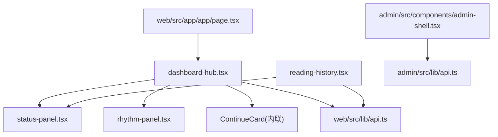
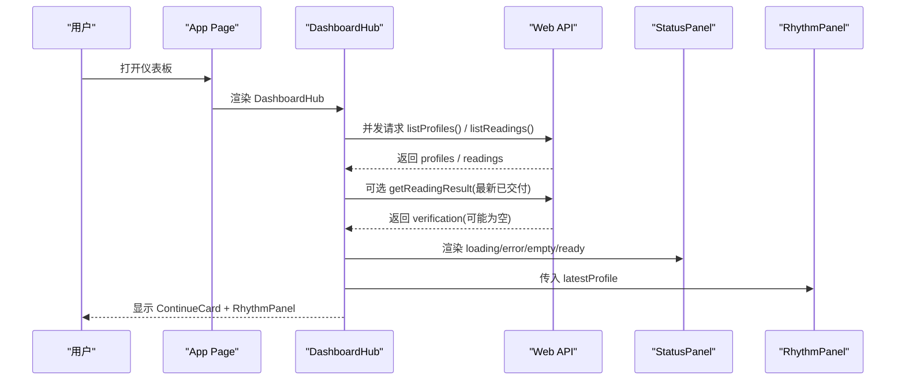
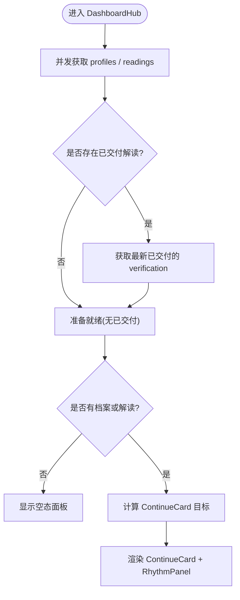
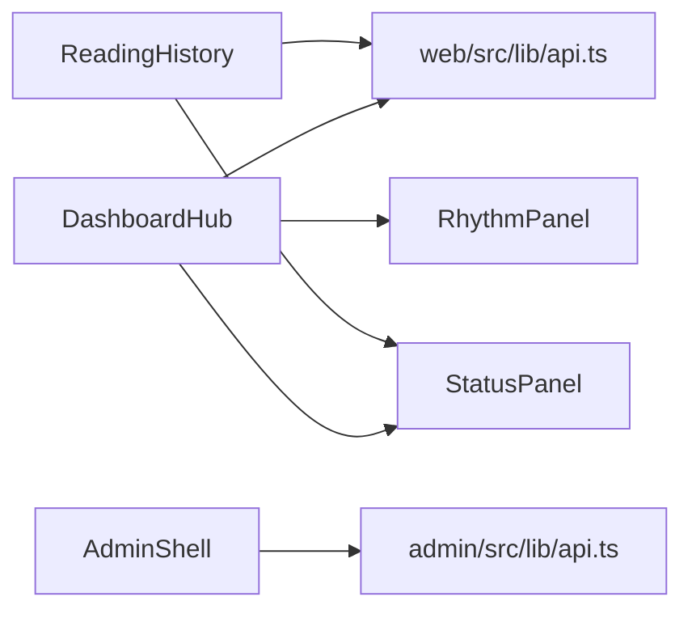

# 仪表板组件

<cite>
**本文引用的文件**
- [web/src/components/dashboard-hub.tsx](file://web/src/components/dashboard-hub.tsx)
- [web/src/components/dashboard-hub.module.css](file://web/src/components/dashboard-hub.module.css)
- [web/src/components/status-panel.tsx](file://web/src/components/status-panel.tsx)
- [web/src/components/status-panel.module.css](file://web/src/components/status-panel.module.css)
- [web/src/components/rhythm-panel.tsx](file://web/src/components/rhythm-panel.tsx)
- [web/src/components/task-card.tsx](file://web/src/components/task-card.tsx)
- [web/src/components/task-card.module.css](file://web/src/components/task-card.module.css)
- [web/src/components/reading-history.tsx](file://web/src/components/reading-history.tsx)
- [web/src/components/reading-history.module.css](file://web/src/components/reading-history.module.css)
- [web/src/lib/api.ts](file://web/src/lib/api.ts)
- [admin/src/components/admin-shell.tsx](file://admin/src/components/admin-shell.tsx)
- [admin/src/lib/api.ts](file://admin/src/lib/api.ts)
- [web/src/app/app/page.tsx](file://web/src/app/app/page.tsx)
</cite>

## 目录
1. [简介](#简介)
2. [项目结构](#项目结构)
3. [核心组件](#核心组件)
4. [架构总览](#架构总览)
5. [详细组件分析](#详细组件分析)
6. [依赖关系分析](#依赖关系分析)
7. [性能与缓存](#性能与缓存)
8. [故障排查指南](#故障排查指南)
9. [结论](#结论)
10. [附录：数据模型与接口契约](#附录数据模型与接口契约)

## 简介
本文件面向“仪表板”相关的前端组件，系统性说明仪表盘入口、任务卡片、状态面板等管理界面的实现方式；解释数据展示组件的渲染逻辑、实时更新机制和用户交互设计；阐述组件的数据获取策略、缓存机制和错误处理方案；并总结仪表板布局模式与组件组合最佳实践。内容覆盖用户侧仪表板（web）与管理后台（admin）两个入口。

## 项目结构
仪表板相关代码主要分布在 web 与 admin 两个 Next.js 应用中：
- 用户侧仪表板入口位于 web/src/app/app/page.tsx，负责组装页面头部与 DashboardHub 主区域，并提供“全部任务”入口列表。
- 仪表板核心容器为 dashboard-hub.tsx，负责并发拉取档案与解读列表、计算最新可用操作、渲染 ContinueCard、RhythmPanel 以及 StatusPanel 的状态提示。
- 通用状态面板 status-panel.tsx 提供 loading/empty/error/processing/success/disabled 多种状态视图。
- 节奏面板 rhythm-panel.tsx 基于最新档案版本展示“今日/近七日”快捷入口。
- 任务卡片 task-card.tsx 是轻量可复用的卡片组件，用于呈现标题、描述、标签与动作链接。
- 历史列表 reading-history.tsx 展示最近解读版本，包含状态映射与重试/登录过期处理。
- 管理后台 admin-shell.tsx 提供运营台壳层、导航、会话校验与退出流程。

图表来源
- [web/src/app/app/page.tsx:1-80](file://web/src/app/app/page.tsx#L1-L80)
- [web/src/components/dashboard-hub.tsx:1-284](file://web/src/components/dashboard-hub.tsx#L1-L284)
- [web/src/components/status-panel.tsx:1-118](file://web/src/components/status-panel.tsx#L1-L118)
- [web/src/components/rhythm-panel.tsx:1-51](file://web/src/components/rhythm-panel.tsx#L1-L51)
- [web/src/components/reading-history.tsx:1-195](file://web/src/components/reading-history.tsx#L1-L195)
- [admin/src/components/admin-shell.tsx:1-116](file://admin/src/components/admin-shell.tsx#L1-L116)
- [admin/src/lib/api.ts:1-80](file://admin/src/lib/api.ts#L1-L80)
- [web/src/lib/api.ts:1-537](file://web/src/lib/api.ts#L1-L537)

章节来源
- [web/src/app/app/page.tsx:1-80](file://web/src/app/app/page.tsx#L1-L80)
- [web/src/components/dashboard-hub.tsx:1-284](file://web/src/components/dashboard-hub.tsx#L1-L284)
- [web/src/components/status-panel.tsx:1-118](file://web/src/components/status-panel.tsx#L1-L118)
- [web/src/components/rhythm-panel.tsx:1-51](file://web/src/components/rhythm-panel.tsx#L1-L51)
- [web/src/components/reading-history.tsx:1-195](file://web/src/components/reading-history.tsx#L1-L195)
- [admin/src/components/admin-shell.tsx:1-116](file://admin/src/components/admin-shell.tsx#L1-L116)
- [admin/src/lib/api.ts:1-80](file://admin/src/lib/api.ts#L1-L80)
- [web/src/lib/api.ts:1-537](file://web/src/lib/api.ts#L1-L537)

## 核心组件
- 仪表盘入口页（App Page）：承载页面标题、元信息，并挂载 DashboardHub 与“全部任务”区块。
- 仪表盘主容器（DashboardHub）：并发获取档案与解读列表，选择“最值得继续”的任务，渲染 ContinueCard；同时显示 RhythmPanel；在加载、错误、空态时通过 StatusPanel 反馈。
- 状态面板（StatusPanel）：统一的状态视图，支持 loading/empty/error/processing/success/disabled，具备无障碍属性与动画。
- 节奏面板（RhythmPanel）：根据最新档案版本展示“今日/近七日”入口。
- 任务卡片（TaskCard）：可复用卡片，用于任务引导或入口聚合。
- 解读历史（ReadingHistory）：列出最近解读版本，按状态分类展示，支持重试与登录过期处理。
- 管理后台壳层（AdminShell）：导航、会话校验、退出、环境标识与错误提示。

章节来源
- [web/src/app/app/page.tsx:1-80](file://web/src/app/app/page.tsx#L1-L80)
- [web/src/components/dashboard-hub.tsx:1-284](file://web/src/components/dashboard-hub.tsx#L1-L284)
- [web/src/components/status-panel.tsx:1-118](file://web/src/components/status-panel.tsx#L1-L118)
- [web/src/components/rhythm-panel.tsx:1-51](file://web/src/components/rhythm-panel.tsx#L1-L51)
- [web/src/components/task-card.tsx:1-37](file://web/src/components/task-card.tsx#L1-L37)
- [web/src/components/reading-history.tsx:1-195](file://web/src/components/reading-history.tsx#L1-L195)
- [admin/src/components/admin-shell.tsx:1-116](file://admin/src/components/admin-shell.tsx#L1-L116)

## 架构总览
仪表板采用“容器 + 展示”的组合模式：
- 容器组件负责数据获取、状态编排与路由跳转；展示组件只关注 UI 渲染与交互。
- 数据获取集中在 web/src/lib/api.ts，封装了 CSRF、幂等键、错误类型与结果投影（过滤私有输入引用）。
- 管理后台使用独立的 admin API 客户端，负责会话校验与导航跳转。

图表来源
- [web/src/app/app/page.tsx:1-80](file://web/src/app/app/page.tsx#L1-L80)
- [web/src/components/dashboard-hub.tsx:151-284](file://web/src/components/dashboard-hub.tsx#L151-L284)
- [web/src/lib/api.ts:413-488](file://web/src/lib/api.ts#L413-L488)
- [web/src/components/status-panel.tsx:17-118](file://web/src/components/status-panel.tsx#L17-L118)
- [web/src/components/rhythm-panel.tsx:9-51](file://web/src/components/rhythm-panel.tsx#L9-L51)

## 详细组件分析

### 仪表盘入口（App Page）
- 职责：设置页面标题与元信息，挂载 DashboardHub，并提供“全部任务”入口（建档、八字概览、六爻一事一问、查看全部解读、账户管理）。
- 交互：通过 ButtonLink 跳转到各功能页；强调“私人页面 · 不使用公共缓存”、“状态与正文分开保存”。

章节来源
- [web/src/app/app/page.tsx:1-80](file://web/src/app/app/page.tsx#L1-L80)

### 仪表盘主容器（DashboardHub）
- 数据获取：
  - 并发调用 listProfiles() 与 listReadings()。
  - 若存在已交付解读，则尝试获取其 verification 以判断是否已完成核对。
- 状态编排：
  - 将读取到的数据组织为 DashboardData，并通过 useMemo 计算 latestProfile。
  - 根据 readings 的状态分组（等待输入、处理中、需关注、已交付），选择“最新”作为 ContinueCard 的目标。
- 渲染分支：
  - loading：显示 StatusPanel 提示正在整理首页。
  - error：显示错误面板与重试按钮，提供前往账户页的路径。
  - empty：无档案且无解读时，引导创建第一份档案或直接一事一问。
  - ready：显示 ContinueCard 与 RhythmPanel。
- 错误处理：
  - readableError 将异常转换为可读消息；getReadingResult 失败不影响列表可用性。
- 更新机制：
  - 通过 attempt 状态与 useEffect 触发重新加载；当前未实现自动轮询。

图表来源
- [web/src/components/dashboard-hub.tsx:27-149](file://web/src/components/dashboard-hub.tsx#L27-L149)
- [web/src/components/dashboard-hub.tsx:151-284](file://web/src/components/dashboard-hub.tsx#L151-L284)

章节来源
- [web/src/components/dashboard-hub.tsx:1-284](file://web/src/components/dashboard-hub.tsx#L1-L284)

### 状态面板（StatusPanel）
- 状态集：loading、empty、error、processing、success、disabled。
- 行为：
  - 根据 state 动态选择图标、标题、描述与角色（alert/status）。
  - 支持可选 actionHref/actionLabel 提供下一步操作。
  - 对 loading/processing 设置 aria-busy 与动画，提升可访问性。
- 样式：不同状态对应不同边框、背景与图标颜色；移动端自适应网格布局。

章节来源
- [web/src/components/status-panel.tsx:17-118](file://web/src/components/status-panel.tsx#L17-L118)
- [web/src/components/status-panel.module.css:1-154](file://web/src/components/status-panel.module.css#L1-L154)

### 节奏面板（RhythmPanel）
- 输入：latestProfile（最新档案摘要）。
- 输出：展示“今日/近七日”两个时间范围入口，并在顶部标注最新档案版本号或提示需要档案。
- 交互：点击跳转至对应页面。

章节来源
- [web/src/components/rhythm-panel.tsx:9-51](file://web/src/components/rhythm-panel.tsx#L9-L51)
- [web/src/components/dashboard-hub.module.css:221-307](file://web/src/components/dashboard-hub.module.css#L221-L307)

### 任务卡片（TaskCard）
- 用途：展示任务标题、描述、标签与动作链接，支持 paper/ink/clay 三种视觉基调。
- 特点：纯展示组件，无副作用；适合在“全部任务”区块或引导页中使用。

章节来源
- [web/src/components/task-card.tsx:1-37](file://web/src/components/task-card.tsx#L1-L37)
- [web/src/components/task-card.module.css:1-161](file://web/src/components/task-card.module.css#L1-L161)

### 解读历史（ReadingHistory）
- 数据：调用 listReadings() 获取最近解读版本。
- 状态映射：将服务端状态映射为用户可读标签与 tone（processing/success/error）。
- 错误处理：区分 401 会话过期与其他错误；提供重试与跳转登录。
- 渲染：列表项包含能力种类、状态、时间与区间；点击跳转详情页。

章节来源
- [web/src/components/reading-history.tsx:1-195](file://web/src/components/reading-history.tsx#L1-L195)
- [web/src/components/reading-history.module.css:1-97](file://web/src/components/reading-history.module.css#L1-L97)

### 管理后台壳层（AdminShell）
- 会话校验：启动时调用 /api/v1/admin/me，401 时重定向到登录页。
- 导航：内置总览、用户档案、订单支付、退款审批、解读任务、审计日志。
- 退出：调用登出接口后跳转登录页。
- 错误：加载失败时显示 alert 提示。

章节来源
- [admin/src/components/admin-shell.tsx:1-116](file://admin/src/components/admin-shell.tsx#L1-L116)
- [admin/src/lib/api.ts:1-80](file://admin/src/lib/api.ts#L1-L80)

## 依赖关系分析
- 组件耦合：
  - DashboardHub 依赖 api.ts 的数据函数与 StatusPanel/RhythmPanel 展示组件。
  - ReadingHistory 依赖 api.ts 与 StatusPanel。
  - AdminShell 依赖 admin/api.ts。
- 外部依赖：
  - lucide-react 图标库。
  - next/link 路由。
  - CSS Modules 样式隔离。
- 潜在循环：
  - 当前组件间为单向依赖，未发现循环导入。

图表来源
- [web/src/components/dashboard-hub.tsx:1-284](file://web/src/components/dashboard-hub.tsx#L1-L284)
- [web/src/components/reading-history.tsx:1-195](file://web/src/components/reading-history.tsx#L1-L195)
- [web/src/lib/api.ts:1-537](file://web/src/lib/api.ts#L1-L537)
- [admin/src/components/admin-shell.tsx:1-116](file://admin/src/components/admin-shell.tsx#L1-L116)
- [admin/src/lib/api.ts:1-80](file://admin/src/lib/api.ts#L1-L80)

章节来源
- [web/src/components/dashboard-hub.tsx:1-284](file://web/src/components/dashboard-hub.tsx#L1-L284)
- [web/src/components/reading-history.tsx:1-195](file://web/src/components/reading-history.tsx#L1-L195)
- [web/src/lib/api.ts:1-537](file://web/src/lib/api.ts#L1-L537)
- [admin/src/components/admin-shell.tsx:1-116](file://admin/src/components/admin-shell.tsx#L1-L116)
- [admin/src/lib/api.ts:1-80](file://admin/src/lib/api.ts#L1-L80)

## 性能与缓存
- 并发请求：DashboardHub 使用 Promise.all 并发获取 profiles 与 readings，减少首屏等待时间。
- 最小化状态：仅保留必要状态（attempt、state），通过 useMemo 计算派生值（latestProfile）。
- 安全投影：getReadingResult 返回的结果会进行 client-safe 投影，移除原始输入引用，避免敏感数据驻留浏览器内存。
- CSRF 与幂等：
  - 所有写操作通过 jsonPost 携带 X-CSRF-Token，并在 403 时刷新 CSRF 缓存后重试。
  - 写操作支持 Idempotency-Key，防止重复提交。
- 缓存策略：
  - 前端未实现持久化缓存；每次进入页面都会重新拉取数据。
  - 管理后台 API 显式设置 cache: no-store，确保实时性。
- 建议：
  - 对于长耗时任务（如解读完成），可在 DashboardHub 中引入定时轮询（例如每 5-10 秒）以提升“实时更新”体验。
  - 对 listReadings 等只读接口可考虑短期内存缓存（如 5 秒），降低抖动。

章节来源
- [web/src/lib/api.ts:256-330](file://web/src/lib/api.ts#L256-L330)
- [web/src/lib/api.ts:359-385](file://web/src/lib/api.ts#L359-L385)
- [web/src/lib/api.ts:476-488](file://web/src/lib/api.ts#L476-L488)
- [admin/src/lib/api.ts:43-80](file://admin/src/lib/api.ts#L43-L80)

## 故障排查指南
- 网络或服务不可用：
  - DashboardHub 捕获异常并显示错误面板，提供“重新载入”与“前往账户”的操作。
  - ReadingHistory 区分 401 会话过期与其他错误，分别引导重新登录或重试。
- 会话失效：
  - 管理后台在 401 时直接重定向到登录页。
  - 用户侧可通过重置 API 缓存（resetApiCache）清理 CSRF 状态。
- 表单提交失败：
  - jsonPost 在 403 CSRF 失败时自动刷新令牌并重试一次。
- 调试建议：
  - 检查浏览器控制台中的 ApiError 状态码与 detail。
  - 确认 CSRF Cookie 是否正确设置（mingli_csrf / mingli_admin_csrf）。
  - 验证幂等键长度与格式，避免被拒绝。

章节来源
- [web/src/components/dashboard-hub.tsx:151-284](file://web/src/components/dashboard-hub.tsx#L151-L284)
- [web/src/components/reading-history.tsx:64-195](file://web/src/components/reading-history.tsx#L64-L195)
- [admin/src/components/admin-shell.tsx:36-59](file://admin/src/components/admin-shell.tsx#L36-L59)
- [web/src/lib/api.ts:244-330](file://web/src/lib/api.ts#L244-L330)
- [web/src/lib/api.ts:534-537](file://web/src/lib/api.ts#L534-L537)

## 结论
仪表板组件采用清晰的容器/展示分离与统一的错误/状态处理模式。DashboardHub 作为中枢协调数据获取与渲染分支，StatusPanel 提供一致的状态反馈，RhythmPanel 与 TaskCard 增强导航与引导。API 层集中处理 CSRF、幂等与安全投影，保证数据安全与一致性。建议在后续迭代中加入轮询机制与短期内存缓存，进一步提升实时性与性能。

## 附录：数据模型与接口契约
- 关键类型（节选）：
  - ProfileSummary：档案摘要（id、version、created_at 等）。
  - ReadingVersionSummary：解读版本摘要（status、horizon、input_request 等）。
  - ReadingResultResponse：解读结果（accepted_copy、fact_panel、verification、input_request）。
  - ReadingVerificationSummary：现实反馈（outcome、note、created_at）。
- 常用接口：
  - listProfiles / listReadings：获取档案与解读列表。
  - getReadingResult：获取解读详情与事实面板（已做安全投影）。
  - startTodayReading / startWeekReading / startLiuyaoReading：发起解读。
  - verifyReading：提交现实反馈。
  - createFollowUp：追加追问。
- 管理后台接口：
  - adminFetch：统一封装带 CSRF 的请求，返回 ok/data 或 ok:false/status/title。
  - /api/v1/admin/me：校验与会话信息。
  - /api/v1/admin/auth/logout：退出登录。

章节来源
- [web/src/lib/api.ts:7-174](file://web/src/lib/api.ts#L7-L174)
- [web/src/lib/api.ts:413-525](file://web/src/lib/api.ts#L413-L525)
- [admin/src/lib/api.ts:1-80](file://admin/src/lib/api.ts#L1-L80)