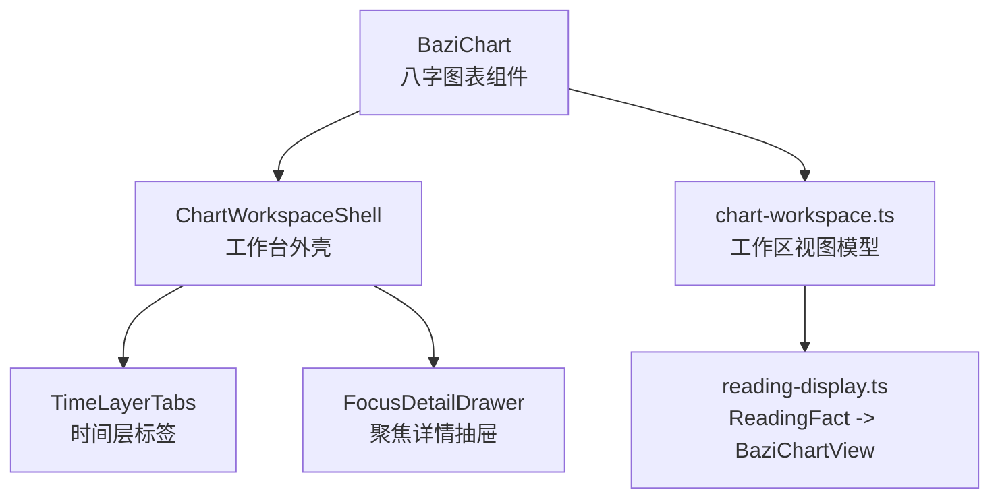
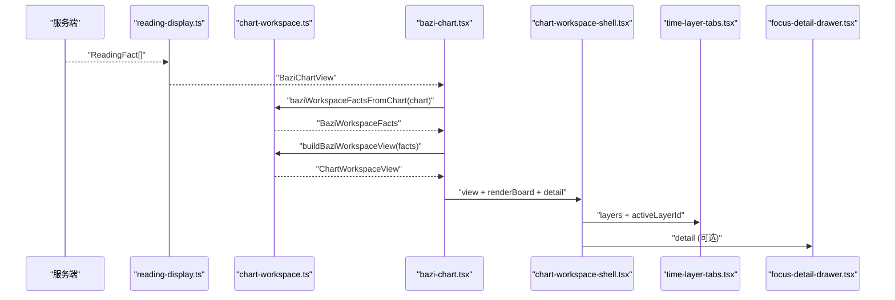
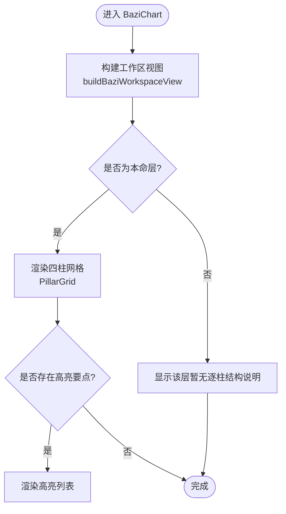
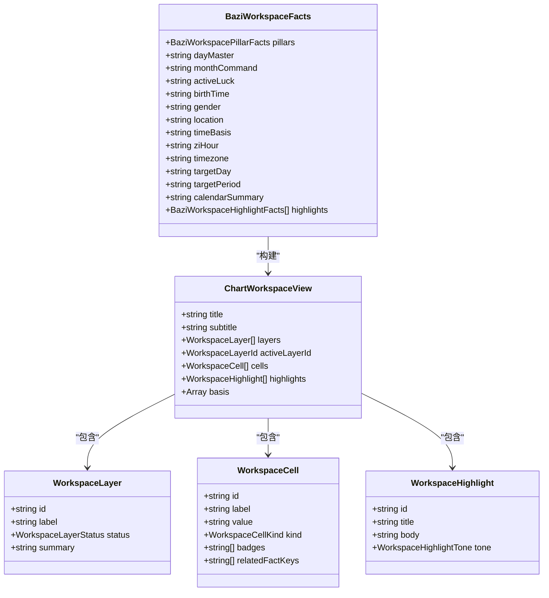
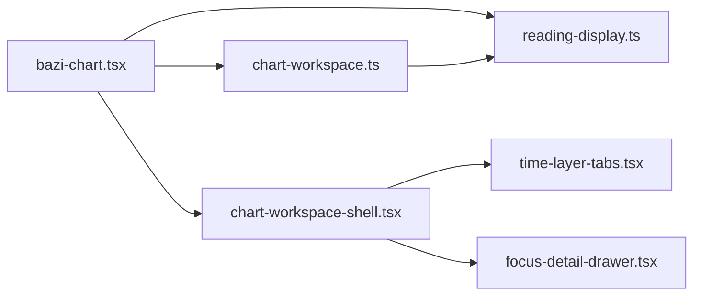
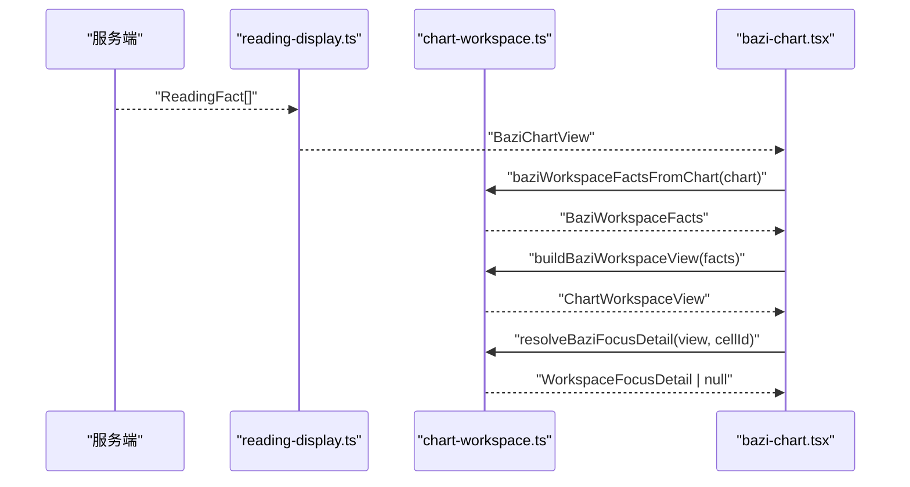

# 八字图表组件

<cite>
**本文引用的文件**
- [web/src/components/readings/bazi-chart.tsx](file://web/src/components/readings/bazi-chart.tsx)
- [web/src/components/readings/bazi-chart.module.css](file://web/src/components/readings/bazi-chart.module.css)
- [web/src/lib/chart-workspace.ts](file://web/src/lib/chart-workspace.ts)
- [web/src/lib/reading-display.ts](file://web/src/lib/reading-display.ts)
- [web/src/components/readings/chart-workspace-shell.tsx](file://web/src/components/readings/chart-workspace-shell.tsx)
- [web/src/components/readings/time-layer-tabs.tsx](file://web/src/components/readings/time-layer-tabs.tsx)
- [web/src/components/readings/focus-detail-drawer.tsx](file://web/src/components/readings/focus-detail-drawer.tsx)
- [web/src/test/chart-workspace.test.ts](file://web/src/test/chart-workspace.test.ts)
</cite>

## 目录
1. [简介](#简介)
2. [项目结构](#项目结构)
3. [核心组件](#核心组件)
4. [架构总览](#架构总览)
5. [详细组件分析](#详细组件分析)
6. [依赖关系分析](#依赖关系分析)
7. [性能与响应式优化](#性能与响应式优化)
8. [故障排查指南](#故障排查指南)
9. [结论](#结论)
10. [附录：使用示例与集成指南](#附录使用示例与集成指南)

## 简介
本组件提供“八字命盘”的可视化渲染能力，基于服务端返回的公开事实进行展示。其设计原则是：前端不计算排盘、不推断星曜或格局；所有盘面信息均来自后端已确认的公开数据。组件通过“工作区视图模型”将原始事实映射为可聚焦的四柱单元格、时间层（本命/大运/流年）以及高亮要点，并提供键盘可达性与无障碍交互。

## 项目结构
围绕八字图表的核心由以下模块组成：
- 视图模型层：负责将服务端的 ReadingFact 转换为可读的 BaziChartView，再进一步映射为 ChartWorkspaceView（包含图层、单元格、高亮、依据等）。
- 展示壳层：统一的排盘工作台外壳，管理时间层切换、面板渲染与聚焦详情抽屉。
- 八字图表组件：将具体八字数据渲染为四柱网格、品牌区块、高亮要点，并接入工作台外壳。
- 样式与主题：通过 CSS Modules 定义布局、颜色、容器查询与动效适配。

**图示来源**
- [web/src/components/readings/bazi-chart.tsx:129-202](file://web/src/components/readings/bazi-chart.tsx#L129-L202)
- [web/src/lib/chart-workspace.ts:228-237](file://web/src/lib/chart-workspace.ts#L228-L237)
- [web/src/lib/reading-display.ts:604-657](file://web/src/lib/reading-display.ts#L604-L657)
- [web/src/components/readings/chart-workspace-shell.tsx:22-100](file://web/src/components/readings/chart-workspace-shell.tsx#L22-L100)
- [web/src/components/readings/time-layer-tabs.tsx:17-103](file://web/src/components/readings/time-layer-tabs.tsx#L17-L103)
- [web/src/components/readings/focus-detail-drawer.tsx:14-139](file://web/src/components/readings/focus-detail-drawer.tsx#L14-L139)

**章节来源**
- [web/src/components/readings/bazi-chart.tsx:129-202](file://web/src/components/readings/bazi-chart.tsx#L129-L202)
- [web/src/lib/chart-workspace.ts:1-10](file://web/src/lib/chart-workspace.ts#L1-L10)
- [web/src/lib/reading-display.ts:579-657](file://web/src/lib/reading-display.ts#L579-L657)
- [web/src/components/readings/chart-workspace-shell.tsx:17-21](file://web/src/components/readings/chart-workspace-shell.tsx#L17-L21)

## 核心组件
- BaziChart：接收 BaziChartView，构建工作区视图，渲染四柱网格、品牌区块与高亮要点，并通过 ChartWorkspaceShell 组织整体布局。
- ChartWorkspaceShell：统一的时间层切换、面板渲染与聚焦详情抽屉容器，保证无障碍与状态一致性。
- chart-workspace：纯函数式视图模型，负责从公开事实构建图层、单元格、高亮与依据，并解析聚焦详情。
- reading-display：将后端 ReadingFact 序列化为 BaziChartView，处理日期、性别、时间口径、日主、月令、周期标记等格式化逻辑。

**章节来源**
- [web/src/components/readings/bazi-chart.tsx:129-202](file://web/src/components/readings/bazi-chart.tsx#L129-L202)
- [web/src/components/readings/chart-workspace-shell.tsx:22-100](file://web/src/components/readings/chart-workspace-shell.tsx#L22-L100)
- [web/src/lib/chart-workspace.ts:228-237](file://web/src/lib/chart-workspace.ts#L228-L237)
- [web/src/lib/reading-display.ts:604-657](file://web/src/lib/reading-display.ts#L604-L657)

## 架构总览
下图展示了从服务端事实到用户界面的完整数据流与渲染流程：

**图示来源**
- [web/src/lib/reading-display.ts:604-657](file://web/src/lib/reading-display.ts#L604-L657)
- [web/src/lib/chart-workspace.ts:273-302](file://web/src/lib/chart-workspace.ts#L273-L302)
- [web/src/lib/chart-workspace.ts:228-237](file://web/src/lib/chart-workspace.ts#L228-L237)
- [web/src/components/readings/bazi-chart.tsx:134-150](file://web/src/components/readings/bazi-chart.tsx#L134-L150)
- [web/src/components/readings/chart-workspace-shell.tsx:51-99](file://web/src/components/readings/chart-workspace-shell.tsx#L51-L99)

## 详细组件分析

### BaziChart 组件
- 职责：接收 BaziChartView，将其转换为工作区视图，渲染四柱网格、品牌区块与高亮要点，并将选择状态传递给工作台外壳。
- 关键实现点：
  - 使用 useMemo 缓存工作区视图与详情，避免重复计算。
  - PillarGrid 支持键盘导航（方向键、Home/End），通过 roving tabindex 提升可访问性。
  - 非本命层（大运/流年）以“不可用/未生成”提示呈现，保持诚实文案。
  - 高亮要点来自服务端 highlights，按 tone 区分强调与警示。

**图示来源**
- [web/src/components/readings/bazi-chart.tsx:152-190](file://web/src/components/readings/bazi-chart.tsx#L152-L190)
- [web/src/lib/chart-workspace.ts:152-185](file://web/src/lib/chart-workspace.ts#L152-L185)

**章节来源**
- [web/src/components/readings/bazi-chart.tsx:28-104](file://web/src/components/readings/bazi-chart.tsx#L28-L104)
- [web/src/components/readings/bazi-chart.tsx:129-202](file://web/src/components/readings/bazi-chart.tsx#L129-L202)

### ChartWorkspaceShell 外壳
- 职责：统一管理时间层切换、面板渲染与聚焦详情抽屉；确保每个面板具有正确的 role、aria 属性与焦点管理。
- 关键点：
  - 通过 useId 生成唯一前缀，避免多实例冲突。
  - 仅当层状态为 ready 时渲染 board；empty/unavailable 显示诚实文案。
  - 切换层时关闭详情，保持状态一致。

**章节来源**
- [web/src/components/readings/chart-workspace-shell.tsx:22-100](file://web/src/components/readings/chart-workspace-shell.tsx#L22-L100)

### TimeLayerTabs 时间层标签
- 职责：根据 workspace view 中的 layers 渲染可切换标签，禁用 unavailable 层，支持键盘左右切换与 Home/End。
- 关键点：
  - 对 unavailable 层设置 aria-disabled 与 disabled，禁止交互。
  - 在可用层之间循环移动焦点，提升键盘体验。

**章节来源**
- [web/src/components/readings/time-layer-tabs.tsx:17-103](file://web/src/components/readings/time-layer-tabs.tsx#L17-L103)

### FocusDetailDrawer 聚焦详情抽屉
- 职责：展示选中单元格的聚焦详情，包括相关事实、边界说明与来源；支持 Escape 关闭与焦点回归。
- 关键点：
  - 打开时自动聚焦标题，关闭后恢复之前焦点元素。
  - 空态文案明确告知用户需先选择柱位。

**章节来源**
- [web/src/components/readings/focus-detail-drawer.tsx:14-139](file://web/src/components/readings/focus-detail-drawer.tsx#L14-L139)

### 视图模型 chart-workspace
- 职责：纯函数式地将公开事实映射为工作区视图；严格遵循“不发明数据”的原则。
- 数据结构：
  - WorkspaceLayer：id、label、status（ready/empty/unavailable）、summary。
  - WorkspaceCell：id、label、value、kind（pillar/palace/meta）、badges、relatedFactKeys。
  - WorkspaceHighlight：id、title、body、tone（neutral/emphasis/caution）。
  - ChartWorkspaceView：title、subtitle、layers、activeLayerId、cells、highlights、basis。
  - BaziWorkspaceFacts：四柱、日主、月令、当前大运、出生时间、性别、地点、时间口径、子时策略、时区、目标日期/周期、历法口径、高亮。
- 算法要点：
  - buildLayers：根据 pillars 与 activeLuck 判断各层状态。
  - buildCells：按年/月/日/时顺序生成单元格，缺失值标注“未提供/时辰未知”。
  - buildBasis：过滤出有值的依据行，用于聚焦详情关联。
  - buildHighlights：将 highlights 映射为带 tone 的高亮项。
  - resolveBaziFocusDetail：根据 cell 的 relatedFactKeys 筛选 basis 中相关事实，构造详情对象。

**图示来源**
- [web/src/lib/chart-workspace.ts:17-57](file://web/src/lib/chart-workspace.ts#L17-L57)
- [web/src/lib/chart-workspace.ts:59-88](file://web/src/lib/chart-workspace.ts#L59-L88)
- [web/src/lib/chart-workspace.ts:228-237](file://web/src/lib/chart-workspace.ts#L228-L237)

**章节来源**
- [web/src/lib/chart-workspace.ts:152-237](file://web/src/lib/chart-workspace.ts#L152-L237)
- [web/src/lib/chart-workspace.ts:244-267](file://web/src/lib/chart-workspace.ts#L244-L267)
- [web/src/lib/chart-workspace.ts:273-302](file://web/src/lib/chart-workspace.ts#L273-L302)

### 数据转换 reading-display
- 职责：将 ReadingFact 序列化为 BaziChartView，处理字段映射与格式化（日期、性别、时间口径、日主、月令、周期标记等）。
- 关键点：
  - formatReadingFact/formatReadingFacts：将事实转为可读中文展示，过滤敏感字段。
  - buildBaziChartView：提取四柱、日主、月令、当前大运、出生时间、性别、地点、时间口径、子时策略、时区、目标日期/周期、历法口径与高亮。
  - splitAcceptedCopy：拆分接受稿文本为标题与正文，便于后续展示。

**章节来源**
- [web/src/lib/reading-display.ts:467-577](file://web/src/lib/reading-display.ts#L467-L577)
- [web/src/lib/reading-display.ts:579-657](file://web/src/lib/reading-display.ts#L579-L657)
- [web/src/lib/reading-display.ts:659-691](file://web/src/lib/reading-display.ts#L659-L691)

## 依赖关系分析
- BaziChart 依赖：
  - reading-display：提供 BaziChartView。
  - chart-workspace：将 BaziChartView 转换为 ChartWorkspaceView。
  - chart-workspace-shell：提供统一外壳。
  - time-layer-tabs：时间层标签。
  - focus-detail-drawer：聚焦详情抽屉。
- chart-workspace 依赖：
  - reading-display：类型 BaziChartView。
- reading-display 依赖：
  - api：ReadingFact、ReadingHorizon 类型。

**图示来源**
- [web/src/components/readings/bazi-chart.tsx:11-20](file://web/src/components/readings/bazi-chart.tsx#L11-L20)
- [web/src/components/readings/chart-workspace-shell.tsx:5-13](file://web/src/components/readings/chart-workspace-shell.tsx#L5-L13)
- [web/src/lib/chart-workspace.ts:1](file://web/src/lib/chart-workspace.ts#L1)

**章节来源**
- [web/src/components/readings/bazi-chart.tsx:11-20](file://web/src/components/readings/bazi-chart.tsx#L11-L20)
- [web/src/components/readings/chart-workspace-shell.tsx:5-13](file://web/src/components/readings/chart-workspace-shell.tsx#L5-L13)
- [web/src/lib/chart-workspace.ts:1](file://web/src/lib/chart-workspace.ts#L1)

## 性能与响应式优化
- 计算缓存：
  - 使用 useMemo 缓存工作区视图与详情，减少重复计算。
  - 仅在 chart 变化时重建视图，避免频繁重渲染。
- 渲染优化：
  - 单元格与高亮列表使用稳定 key（cell.id、highlight.id），提高 React 列表更新效率。
  - 非活跃层隐藏 panel，减少 DOM 节点数量。
- 响应式适配：
  - 使用 container-type: inline-size 与 @container 查询，在小屏下四柱网格自适应列数。
  - 字体大小使用 clamp 动态缩放，兼顾不同屏幕密度。
  - 尊重 prefers-reduced-motion，禁用不必要的过渡与变换。
- 无障碍与交互：
  - PillarGrid 支持方向键、Home/End 导航，roving tabindex 提升键盘体验。
  - TimeLayerTabs 支持左右切换与 Home/End，禁用不可用层。
  - FocusDetailDrawer 支持 Escape 关闭与焦点回归。

[本节为通用指导，不直接分析具体文件]

## 故障排查指南
- 无数据或空态：
  - 检查服务端是否返回 pillars、dayMaster、monthCommand 等必要字段。
  - 若为空，工作区会显示“服务端尚未返回可展示的公开事实”，属预期行为。
- 某层不可用：
  - decadal/yearly 层若无 activeLuck 或未生成，会显示“未生成/暂无结构”，这是诚实文案。
- 聚焦详情为空：
  - 若所选单元格没有相关事实（relatedFactKeys 未在 basis 中找到），详情仅显示边界说明。
- 键盘导航异常：
  - 确认 PillarGrid 与 TimeLayerTabs 的 refs 是否正确挂载，且 availableLayers 过滤逻辑生效。
- 测试用例参考：
  - 验证空事实、缺失小时柱、适配器兼容性等场景。

**章节来源**
- [web/src/test/chart-workspace.test.ts:17-29](file://web/src/test/chart-workspace.test.ts#L17-L29)
- [web/src/test/chart-workspace.test.ts:195-225](file://web/src/test/chart-workspace.test.ts#L195-L225)

## 结论
八字图表组件以“服务端事实优先”的设计原则，提供了稳健、可访问、可定制的命盘可视化能力。通过清晰的视图模型与分层渲染，组件在保证数据真实性的同时，实现了良好的用户体验与性能表现。未来可在不破坏契约的前提下扩展更多时间层与高亮维度。

[本节为总结，不直接分析具体文件]

## 附录：使用示例与集成指南

### 数据结构要求
- BaziChartView（来自 reading-display）：
  - pillars：年/月/日/时四柱字符串。
  - dayMaster：日主。
  - monthCommand：月令。
  - activeLuck：当前大运。
  - birthTime/gender/location/timeBasis/ziHour/timezone/targetDay/targetPeriod/calendarSummary：辅助信息。
  - highlights：高亮要点数组。
- ChartWorkspaceView（来自 chart-workspace）：
  - layers：时间层数组（本命/大运/流年），含状态与摘要。
  - cells：四柱单元格数组，含标签、值、类型、徽章与关联事实键。
  - highlights：高亮要点数组，含 tone。
  - basis：依据行数组，用于聚焦详情关联。

**章节来源**
- [web/src/lib/reading-display.ts:579-657](file://web/src/lib/reading-display.ts#L579-L657)
- [web/src/lib/chart-workspace.ts:17-57](file://web/src/lib/chart-workspace.ts#L17-L57)

### Props 接口定义
- BaziChart props：
  - chart：BaziChartView 类型。
  - title：可选，默认“八字命盘”。
- ChartWorkspaceShell props：
  - view：ChartWorkspaceView。
  - renderBoard：接收 activeLayer 并返回 ReactNode。
  - detail：WorkspaceFocusDetail | null。
  - detailId：可选，详情区域 ID。
  - onCloseDetail：关闭详情的回调。
  - boardLabel：可选，面板标签。

**章节来源**
- [web/src/components/readings/bazi-chart.tsx:129-132](file://web/src/components/readings/bazi-chart.tsx#L129-L132)
- [web/src/components/readings/chart-workspace-shell.tsx:22-36](file://web/src/components/readings/chart-workspace-shell.tsx#L22-L36)

### 样式定制选项
- 容器与布局：
  - .board：grid 布局、容器查询、边框与圆角。
  - .pillarGrid：两列/四列自适应网格。
  - .pillarCard：卡片样式、悬停与激活态、过渡动画。
- 品牌与信息：
  - .brandBlock/.brand/.brandSub/.brandMeta：品牌区块与元信息。
- 高亮要点：
  - .highlights：标题与列表样式，支持 tone 差异化边框。
- 无障碍与动效：
  - @media (prefers-reduced-motion: reduce)：禁用过渡与变换。

**章节来源**
- [web/src/components/readings/bazi-chart.module.css:1-195](file://web/src/components/readings/bazi-chart.module.css#L1-L195)

### 复杂 SVG 图形性能优化策略
- 当前实现未使用 SVG 绘制命盘，而是采用 HTML/CSS Grid 与按钮元素渲染四柱卡片，天然具备更好的可访问性与更低的渲染开销。
- 若未来引入 SVG，建议：
  - 使用 memoized 路径与形状，避免重复计算。
  - 按需渲染（仅活跃层），减少 DOM/SVG 节点数量。
  - 使用 requestAnimationFrame 批量更新，避免阻塞主线程。
  - 利用 will-change 与 transform 提升合成层性能。

[本节为通用指导，不直接分析具体文件]

### 响应式适配方案
- 使用 container-type: inline-size 与 @container 查询，使四柱网格在不同容器宽度下自适应列数。
- 使用 clamp 控制字号，适应不同屏幕密度。
- 尊重 prefers-reduced-motion，禁用不必要动效。

**章节来源**
- [web/src/components/readings/bazi-chart.module.css:183-194](file://web/src/components/readings/bazi-chart.module.css#L183-L194)

### 用户交互设计
- 键盘导航：
  - PillarGrid：方向键、Home/End 在单元格间移动焦点。
  - TimeLayerTabs：左右切换、Home/End 在可用层间移动。
- 鼠标交互：
  - 点击单元格选择并打开聚焦详情。
  - 点击标签切换时间层。
- 焦点管理：
  - FocusDetailDrawer 打开时聚焦标题，关闭后恢复原焦点。
  - 支持 Escape 关闭详情。

**章节来源**
- [web/src/components/readings/bazi-chart.tsx:54-71](file://web/src/components/readings/bazi-chart.tsx#L54-L71)
- [web/src/components/readings/time-layer-tabs.tsx:32-61](file://web/src/components/readings/time-layer-tabs.tsx#L32-L61)
- [web/src/components/readings/focus-detail-drawer.tsx:28-59](file://web/src/components/readings/focus-detail-drawer.tsx#L28-L59)

### 八字数据解析流程
- 步骤：
  1. 获取 ReadingFact[] 并调用 buildBaziChartView 生成 BaziChartView。
  2. 将 BaziChartView 传入 baziWorkspaceFactsFromChart 转换为 BaziWorkspaceFacts。
  3. 调用 buildBaziWorkspaceView 生成 ChartWorkspaceView。
  4. 在 BaziChart 中渲染四柱网格与高亮要点，并通过 ChartWorkspaceShell 组织界面。
  5. 用户选择单元格后，调用 resolveBaziFocusDetail 生成详情。

**图示来源**
- [web/src/lib/reading-display.ts:604-657](file://web/src/lib/reading-display.ts#L604-L657)
- [web/src/lib/chart-workspace.ts:273-302](file://web/src/lib/chart-workspace.ts#L273-L302)
- [web/src/lib/chart-workspace.ts:228-237](file://web/src/lib/chart-workspace.ts#L228-L237)
- [web/src/lib/chart-workspace.ts:244-267](file://web/src/lib/chart-workspace.ts#L244-L267)

### 错误处理机制
- 空态与不可用：
  - 无 pillars 时，本命层状态为 empty，显示诚实文案。
  - 无 activeLuck 时，大运层状态为 unavailable，显示“未生成”。
- 聚焦详情为空：
  - 若无相关事实，仅显示边界说明，不虚构内容。
- 测试覆盖：
  - 空事实、缺失小时柱、适配器兼容性等场景均有测试用例。

**章节来源**
- [web/src/lib/chart-workspace.ts:152-185](file://web/src/lib/chart-workspace.ts#L152-L185)
- [web/src/lib/chart-workspace.ts:244-267](file://web/src/lib/chart-workspace.ts#L244-L267)
- [web/src/test/chart-workspace.test.ts:17-29](file://web/src/test/chart-workspace.test.ts#L17-L29)
- [web/src/test/chart-workspace.test.ts:195-225](file://web/src/test/chart-workspace.test.ts#L195-L225)