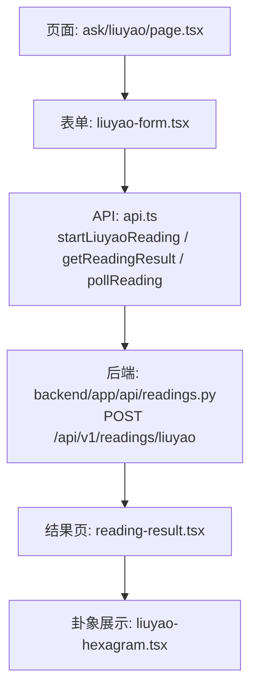
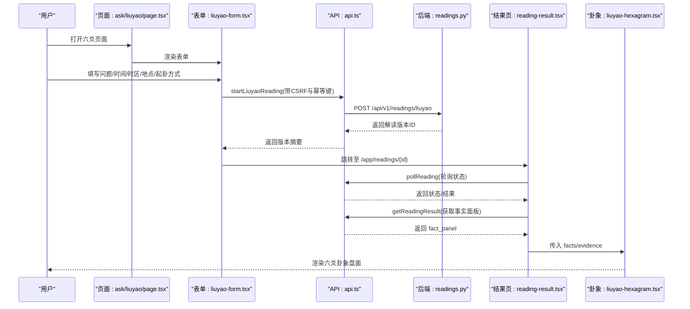
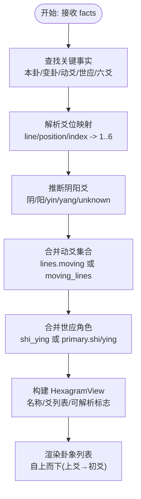
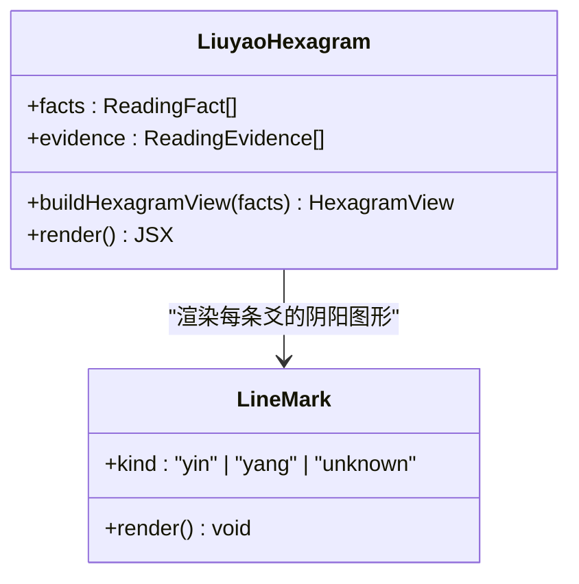
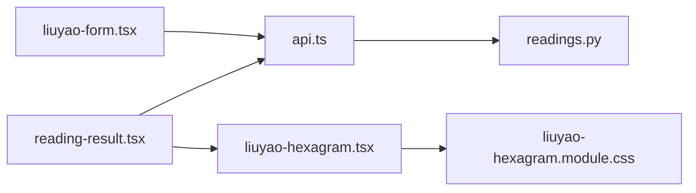

# 六爻卦象组件

<cite>
**本文引用的文件**
- [liuyao-hexagram.tsx](file://web/src/components/readings/liuyao-hexagram.tsx)
- [liuyao-hexagram.module.css](file://web/src/components/readings/liuyao-hexagram.module.css)
- [liuyao-form.tsx](file://web/src/components/liuyao-form.tsx)
- [page.tsx](file://web/src/app/app/ask/liuyao/page.tsx)
- [api.ts](file://web/src/lib/api.ts)
- [reading-result.tsx](file://web/src/components/readings/reading-result.tsx)
- [readings.py](file://backend/app/api/readings.py)
</cite>

## 目录
1. [简介](#简介)
2. [项目结构](#项目结构)
3. [核心组件](#核心组件)
4. [架构总览](#架构总览)
5. [详细组件分析](#详细组件分析)
6. [依赖关系分析](#依赖关系分析)
7. [性能与可访问性](#性能与可访问性)
8. [故障排查指南](#故障排查指南)
9. [结论](#结论)
10. [附录：数据契约与示例](#附录：数据契约与示例)

## 简介
本组件负责在 Web 端展示“六爻”卦象的公开盘面，包括本卦、变卦、动爻、世应、各爻阴阳状态与详情，以及与证据面板的关联。前端不自行计算卦象，仅对服务端返回的公开事实进行解析与渲染；用户输入通过表单提交到后端服务，由后端完成起卦、排盘与解读流程。

## 项目结构
围绕六爻功能的前端涉及以下关键文件：
- 页面入口：用于承载六爻表单与说明
- 表单组件：负责收集问题、时间、时区、地点与起卦方式（手动或电子摇卦）
- API 层：封装 CSRF、幂等键、请求发送与结果拉取
- 卦象展示组件：将服务端返回的“事实”解析为可视化的六爻盘面
- 结果页容器：轮询读取解读进度并组合展示各模块（含六爻卦象）
- 后端接口：接收六爻起卦请求并返回解读版本信息

图表来源
- [page.tsx:1-27](file://web/src/app/app/ask/liuyao/page.tsx#L1-L27)
- [liuyao-form.tsx:1-200](file://web/src/components/liuyao-form.tsx#L1-L200)
- [api.ts:459-488](file://web/src/lib/api.ts#L459-L488)
- [readings.py:198-237](file://backend/app/api/readings.py#L198-L237)
- [reading-result.tsx:172-200](file://web/src/components/readings/reading-result.tsx#L172-L200)
- [liuyao-hexagram.tsx:238-337](file://web/src/components/readings/liuyao-hexagram.tsx#L238-L337)

章节来源
- [page.tsx:1-27](file://web/src/app/app/ask/liuyao/page.tsx#L1-L27)
- [liuyao-form.tsx:1-200](file://web/src/components/liuyao-form.tsx#L1-L200)
- [api.ts:459-488](file://web/src/lib/api.ts#L459-L488)
- [readings.py:198-237](file://backend/app/api/readings.py#L198-L237)
- [reading-result.tsx:172-200](file://web/src/components/readings/reading-result.tsx#L172-L200)
- [liuyao-hexagram.tsx:238-337](file://web/src/components/readings/liuyao-hexagram.tsx#L238-L337)

## 核心组件
- 六爻卦象展示组件：负责从“事实”中解析本卦、变卦、动爻、世应、各爻阴阳与详情，并以列表形式自上而下（上爻至初爻）呈现。
- 六爻表单组件：负责校验并收集用户输入，调用后端启动解读，成功后跳转到结果页。
- 结果页容器：轮询读取解读状态，完成后获取事实面板，并将六爻卦象嵌入结果视图。
- API 层：统一处理 CSRF、幂等键、错误与响应类型，提供 startLiuyaoReading、getReadingResult、pollReading 等方法。
- 后端接口：定义 /api/v1/readings/liuyao 的 POST 接口，接收起卦参数并返回解读版本摘要。

章节来源
- [liuyao-hexagram.tsx:167-220](file://web/src/components/readings/liuyao-hexagram.tsx#L167-L220)
- [liuyao-form.tsx:150-195](file://web/src/components/liuyao-form.tsx#L150-L195)
- [api.ts:459-488](file://web/src/lib/api.ts#L459-L488)
- [readings.py:198-237](file://backend/app/api/readings.py#L198-L237)
- [reading-result.tsx:172-200](file://web/src/components/readings/reading-result.tsx#L172-L200)

## 架构总览
六爻功能的端到端流程如下：
- 用户在“一事一问·六爻”页面填写问题、起卦时刻、时区、地点，选择起卦方式（手动输入或电子摇卦）。
- 表单校验通过后，前端调用后端 /api/v1/readings/liuyao 启动解读，携带 CSRF Token 与幂等键。
- 后端返回解读版本 ID，前端跳转至结果页。
- 结果页轮询读取状态，当状态为已接纳后，拉取结果面板，其中包含“事实”与“证据”。
- 六爻卦象组件从事实中解析出本卦、变卦、动爻、世应与各爻详情，并渲染可视化盘面。

图表来源
- [liuyao-form.tsx:150-195](file://web/src/components/liuyao-form.tsx#L150-L195)
- [api.ts:459-488](file://web/src/lib/api.ts#L459-L488)
- [readings.py:198-237](file://backend/app/api/readings.py#L198-L237)
- [reading-result.tsx:172-200](file://web/src/components/readings/reading-result.tsx#L172-L200)
- [liuyao-hexagram.tsx:238-337](file://web/src/components/readings/liuyao-hexagram.tsx#L238-L337)

## 详细组件分析

### 卦象数据解析规则
- 数据来源：来自结果面板中的“事实”数组，组件通过 key 匹配定位相关事实，如“primary_hexagram/本卦”、“changed_hexagram/变卦”、“moving_lines/动爻”、“shi_ying/世应”、“lines/六爻/爻”。
- 爻位解析：支持多种字段名兼容（line/position/index），并提取整数位置（1-6）。
- 阴阳爻识别：支持“阴/阳”、“yin/yang”以及包含关键字的文本，未知则标记为 unknown。
- 动爻合并：若 lines 中某爻未显式标注 moving，但 moving_lines 中包含该位置，则视为动爻。
- 世应标注：优先从 shi_ying 事实中提取，其次回退到 primary_hexagram 中的 shi_line/ying_line。
- 详情聚合：每条爻可附带“六神”、“六亲”、“纳甲”等信息，组件将其拼接为可读字符串。
- 变爻展示：若爻为动爻且存在 changed_line，则显示变为哪种阴阳及对应详情。

图表来源
- [liuyao-hexagram.tsx:167-220](file://web/src/components/readings/liuyao-hexagram.tsx#L167-L220)
- [liuyao-hexagram.tsx:134-166](file://web/src/components/readings/liuyao-hexagram.tsx#L134-L166)
- [liuyao-hexagram.tsx:88-132](file://web/src/components/readings/liuyao-hexagram.tsx#L88-L132)

章节来源
- [liuyao-hexagram.tsx:167-220](file://web/src/components/readings/liuyao-hexagram.tsx#L167-L220)
- [liuyao-hexagram.tsx:134-166](file://web/src/components/readings/liuyao-hexagram.tsx#L134-L166)
- [liuyao-hexagram.tsx:88-132](file://web/src/components/readings/liuyao-hexagram.tsx#L88-L132)

### 八卦符号绘制算法
- 使用 CSS 块与伪元素绘制爻位图形：
  - 阳爻：一条实线横条
  - 阴爻：两条短横线中间断开
  - 未知：虚线占位，表示未公开
- 尺寸与间距采用相对单位与 clamp 函数，确保在不同屏幕宽度下的可读性与一致性。
- 动爻行高亮：通过 data-moving 属性配合样式背景色突出显示。

图表来源
- [liuyao-hexagram.tsx:222-236](file://web/src/components/readings/liuyao-hexagram.tsx#L222-L236)
- [liuyao-hexagram.module.css:141-161](file://web/src/components/readings/liuyao-hexagram.module.css#L141-L161)

章节来源
- [liuyao-hexagram.tsx:222-236](file://web/src/components/readings/liuyao-hexagram.tsx#L222-L236)
- [liuyao-hexagram.module.css:141-161](file://web/src/components/readings/liuyao-hexagram.module.css#L141-L161)

### 爻位的动态变化效果与变卦过渡动画
- 当前实现以静态列表展示爻位与变爻信息，未包含逐帧动画或过渡动效。
- 动爻行通过背景高亮区分静爻与动爻，变爻区域显示“变为”后的阴阳与详情。
- 如需增强交互体验，可在后续迭代中加入 CSS 过渡或轻量动画库，例如：
  - 动爻出现时的淡入/缩放
  - 变爻切换时的线条形变过渡
  - 滚动进入视口时的入场动画

[本节为概念性建议，不直接分析具体代码]

### 卦辞的解释展示
- 组件职责边界明确：仅复述服务端公开的卦象事实，不在此处补写解释。
- 若存在与卦象事实关联的证据，组件会提示链接到证据区域查看依据。
- 解释内容应在证据面板或接受正文中呈现，避免在卦象盘中生成额外文案。

章节来源
- [liuyao-hexagram.tsx:324-333](file://web/src/components/readings/liuyao-hexagram.tsx#L324-L333)

### 复杂图形绘制的性能优化
- 渲染策略：
  - 使用纯 CSS 绘制爻位图形，避免 Canvas/SVG 开销
  - 列表项数量固定为 6，DOM 节点少，渲染成本低
- 样式优化：
  - 使用 CSS 变量与 clamp 控制尺寸，减少重排
  - 通过 data-* 属性驱动样式分支，避免 JS 频繁操作 DOM
- 无障碍与可维护性：
  - 使用语义化标签与 aria-label，提升可访问性
  - 将视觉与逻辑解耦，便于后续扩展动画或主题

章节来源
- [liuyao-hexagram.module.css:1-275](file://web/src/components/readings/liuyao-hexagram.module.css#L1-L275)
- [liuyao-hexagram.tsx:282-322](file://web/src/components/readings/liuyao-hexagram.tsx#L282-L322)

### 触摸手势支持与屏幕适配方案
- 触摸手势：当前组件不包含自定义手势（如滑动、长按），主要依赖原生表单控件与按钮交互。
- 屏幕适配：
  - 小屏下调整网格布局，隐藏或折叠右侧注解列
  - 爻位图形与文字自动换行，保证可读性
  - 使用媒体查询针对 640px 与 420px 断点进行布局优化

章节来源
- [liuyao-hexagram.module.css:241-275](file://web/src/components/readings/liuyao-hexagram.module.css#L241-L275)

### 六爻占卜的业务逻辑集成
- 业务入口：用户在表单中选择“手动输入卦象”或“电子摇卦”，并提交到后端。
- 输入验证：
  - 问题长度限制与时区有效性校验
  - 手动模式下，六次投掷值必须为 6/7/8/9
  - 时区需为 IANA 列表中的有效值
- 幂等与安全：
  - 每次请求携带 CSRF Token 与幂等键，防止重复提交
  - 浏览器不保存原始输入，仅保留公开事实

章节来源
- [liuyao-form.tsx:37-86](file://web/src/components/liuyao-form.tsx#L37-L86)
- [liuyao-form.tsx:150-195](file://web/src/components/liuyao-form.tsx#L150-L195)
- [api.ts:292-330](file://web/src/lib/api.ts#L292-L330)

### 用户输入处理与结果验证机制
- 表单校验：基于 Zod Schema，实时反馈错误信息，禁用无效提交。
- 结果验证：
  - 结果页轮询读取状态，直到“已接纳”后拉取完整结果
  - 事实面板经过客户端安全投影，移除私有引用
  - 卦象组件根据可解析标志与爻位数量给出降级提示

章节来源
- [liuyao-form.tsx:123-148](file://web/src/components/liuyao-form.tsx#L123-L148)
- [api.ts:196-216](file://web/src/lib/api.ts#L196-L216)
- [reading-result.tsx:172-200](file://web/src/components/readings/reading-result.tsx#L172-L200)
- [liuyao-hexagram.tsx:272-280](file://web/src/components/readings/liuyao-hexagram.tsx#L272-L280)

### 不同卦象类型的展示示例与交互模式
- 本卦与变卦名称：在顶部以术语表形式展示，缺失时显示“未公开”。
- 爻位顺序：自上而下排列（上爻至初爻），符合传统阅读习惯。
- 动爻与静爻：动爻行高亮，并显示“动爻”标签；静爻显示“静爻”。
- 世应标注：在每行右侧显示“世”或“应”标签，辅助定位。
- 变爻信息：若爻为动爻且有变爻详情，则在下方显示“变为”后的阴阳与详情。
- 证据链接：若有与卦象事实关联的证据，提供跳转链接查看依据。

章节来源
- [liuyao-hexagram.tsx:251-333](file://web/src/components/readings/liuyao-hexagram.tsx#L251-L333)
- [liuyao-hexagram.module.css:99-222](file://web/src/components/readings/liuyao-hexagram.module.css#L99-L222)

## 依赖关系分析
- 组件耦合：
  - 卦象组件依赖“事实”与“证据”数据结构，不直接依赖后端实现
  - 表单组件依赖 API 层进行网络请求与状态管理
  - 结果页容器协调轮询与子组件渲染
- 外部依赖：
  - Next.js 路由与 React Hooks
  - Zod 表单校验
  - CSS Modules 样式隔离
- 潜在循环依赖：无，组件间通过 props 与 API 层解耦

图表来源
- [liuyao-form.tsx:150-195](file://web/src/components/liuyao-form.tsx#L150-L195)
- [api.ts:459-488](file://web/src/lib/api.ts#L459-L488)
- [readings.py:198-237](file://backend/app/api/readings.py#L198-L237)
- [reading-result.tsx:172-200](file://web/src/components/readings/reading-result.tsx#L172-L200)
- [liuyao-hexagram.tsx:238-337](file://web/src/components/readings/liuyao-hexagram.tsx#L238-L337)
- [liuyao-hexagram.module.css:1-275](file://web/src/components/readings/liuyao-hexagram.module.css#L1-L275)

章节来源
- [liuyao-form.tsx:150-195](file://web/src/components/liuyao-form.tsx#L150-L195)
- [api.ts:459-488](file://web/src/lib/api.ts#L459-L488)
- [readings.py:198-237](file://backend/app/api/readings.py#L198-L237)
- [reading-result.tsx:172-200](file://web/src/components/readings/reading-result.tsx#L172-L200)
- [liuyao-hexagram.tsx:238-337](file://web/src/components/readings/liuyao-hexagram.tsx#L238-L337)
- [liuyao-hexagram.module.css:1-275](file://web/src/components/readings/liuyao-hexagram.module.css#L1-L275)

## 性能与可访问性
- 性能：
  - 渲染开销低：固定 6 行列表，CSS 绘制图形
  - 网络请求节流：结果页轮询间隔合理，避免过度请求
  - 样式优化：CSS 变量与媒体查询减少重排
- 可访问性：
  - 语义化标签与 aria 属性完善
  - 错误提示与状态提示清晰可见
  - 键盘导航友好，表单控件具备必要描述

[本节为通用指导，不直接分析具体代码]

## 故障排查指南
- 启动失败：
  - 检查 CSRF Token 是否成功获取与传递
  - 确认幂等键格式与长度
  - 查看后端返回的错误标题与详情
- 表单校验失败：
  - 检查问题长度与时区有效性
  - 手动模式下，六次投掷值必须为 6/7/8/9
- 卦象不可解析：
  - 服务端未返回可解析事实时，组件会降级提示
  - 若仅返回部分爻位，组件会显示实际数量并保留未公开爻位
- 结果页状态异常：
  - 轮询超时或状态未知时，提示等待确认
  - 已停止状态需重新发起解读

章节来源
- [api.ts:256-330](file://web/src/lib/api.ts#L256-L330)
- [liuyao-form.tsx:61-86](file://web/src/components/liuyao-form.tsx#L61-L86)
- [liuyao-hexagram.tsx:272-280](file://web/src/components/readings/liuyao-hexagram.tsx#L272-L280)
- [reading-result.tsx:43-102](file://web/src/components/readings/reading-result.tsx#L43-L102)

## 结论
六爻卦象组件以“事实驱动”的方式展示服务端计算的公开盘面，前端专注于解析与渲染，不介入复杂计算。通过清晰的职责划分、稳健的数据解析与良好的可访问性设计，组件能够在多设备与多场景下稳定工作。未来可在保持现有架构的基础上，逐步引入过渡动画与更丰富的交互模式，以提升用户体验。

[本节为总结性内容，不直接分析具体代码]

## 附录：数据契约与示例
- 起卦请求体（LiuyaoStartRequest）：
  - cast：数字数组或枚举 digital_coin
  - event_datetime：本地时间字符串
  - timezone：IANA 时区
  - location：地点
  - query：问题
  - dimension_ids：主题维度（如 career）
- 结果面板（ReadingFactPanel）：
  - facts：事实数组，包含卦象结构与详情
  - evidence：证据数组，支持按事实引用关联
  - findings/claim_scopes/limits：其他元数据
- 示例事实（测试用例中可见）：
  - 本卦：包含 name、shi_line、ying_line
  - 变卦：包含 name
  - 动爻：包含爻位数组
  - 世应：包含 shi、ying
  - 六爻：包含 line/state/yin_yang/moving 等字段

章节来源
- [api.ts:96-147](file://web/src/lib/api.ts#L96-L147)
- [reading-result.test.tsx:331-370](file://web/src/test/reading-result.test.tsx#L331-L370)