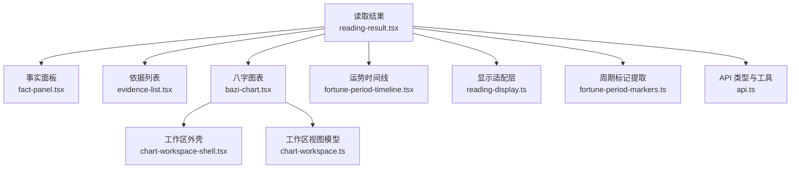
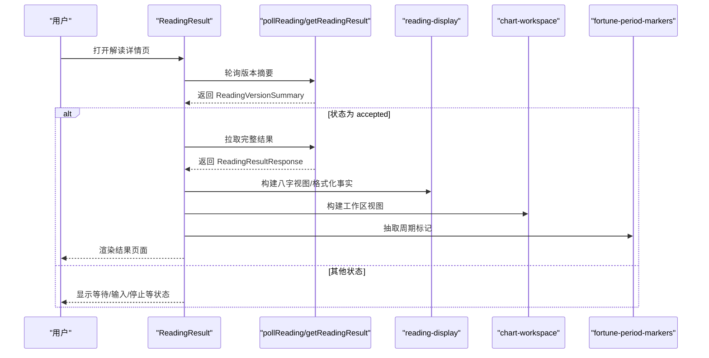
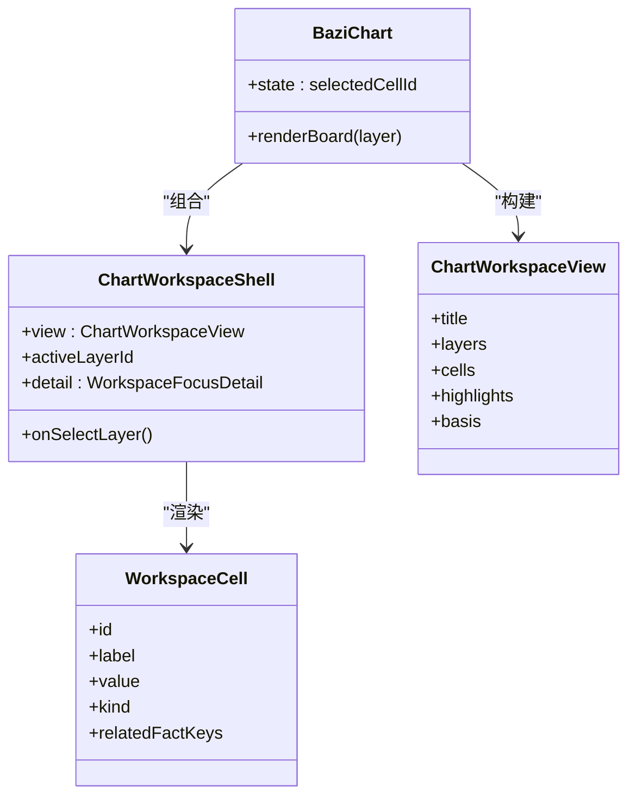
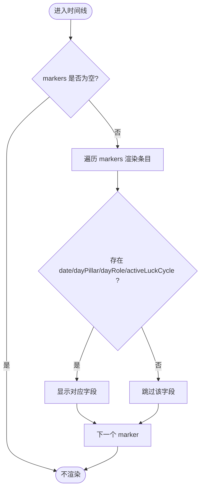
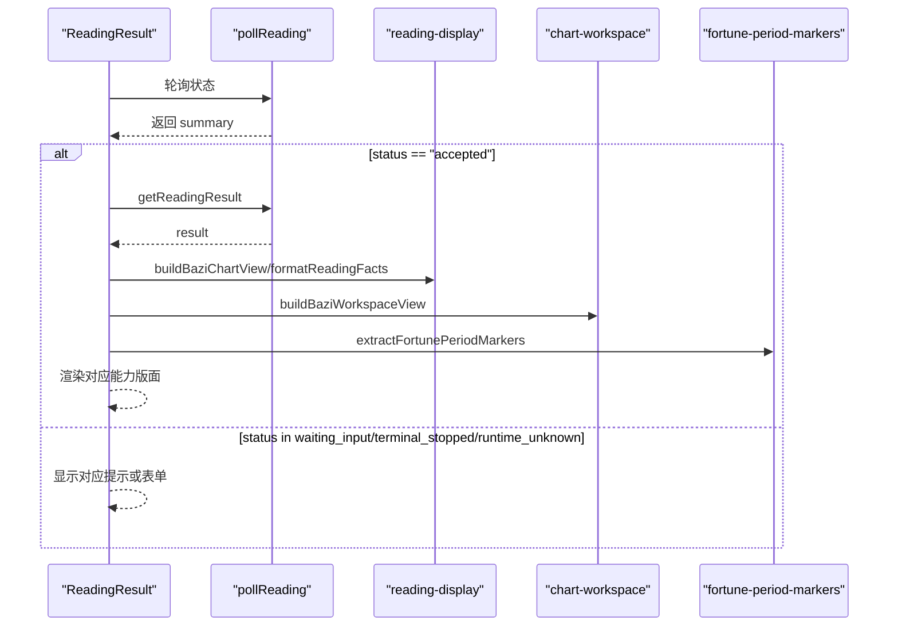
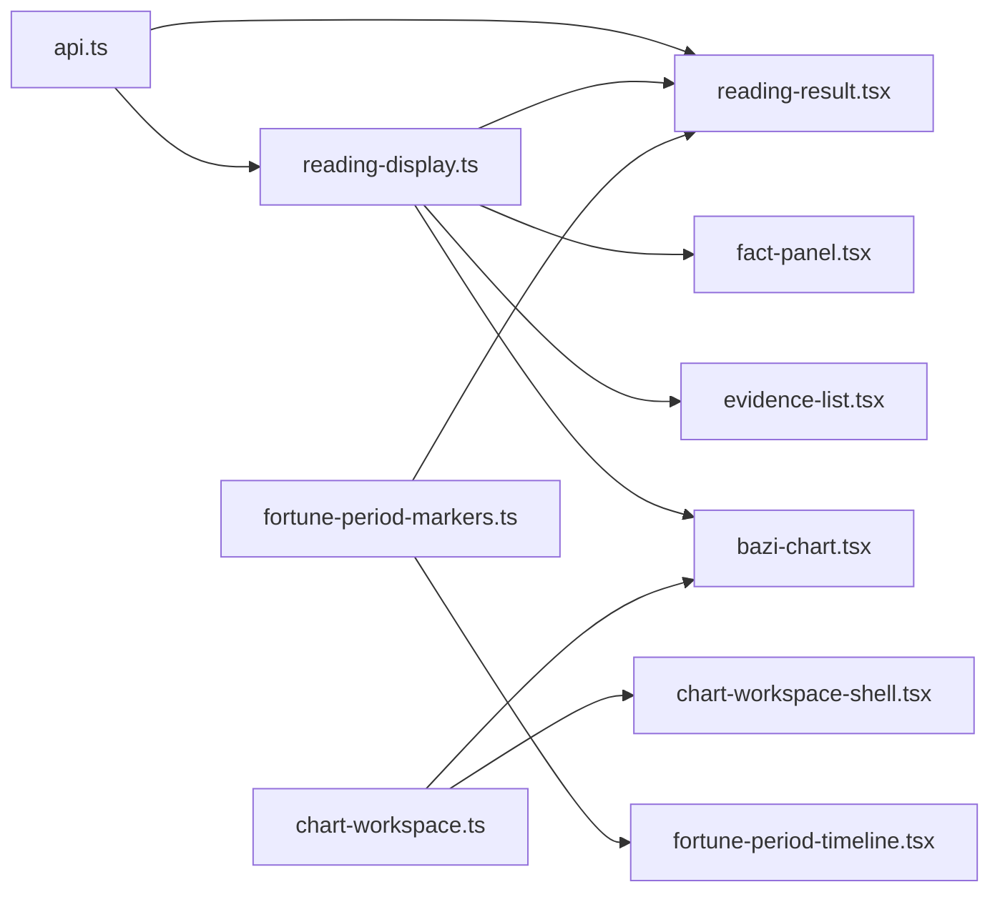

# 命理解读组件

<cite>
**本文引用的文件**
- [web/src/components/readings/reading-result.tsx](file://web/src/components/readings/reading-result.tsx)
- [web/src/components/readings/bazi-chart.tsx](file://web/src/components/readings/bazi-chart.tsx)
- [web/src/components/readings/chart-workspace-shell.tsx](file://web/src/components/readings/chart-workspace-shell.tsx)
- [web/src/lib/chart-workspace.ts](file://web/src/lib/chart-workspace.ts)
- [web/src/lib/reading-display.ts](file://web/src/lib/reading-display.ts)
- [web/src/lib/fortune-period-markers.ts](file://web/src/lib/fortune-period-markers.ts)
- [web/src/components/readings/fortune-period-timeline.tsx](file://web/src/components/readings/fortune-period-timeline.tsx)
- [web/src/components/readings/fact-panel.tsx](file://web/src/components/readings/fact-panel.tsx)
- [web/src/components/readings/evidence-list.tsx](file://web/src/components/readings/evidence-list.tsx)
- [web/src/lib/api.ts](file://web/src/lib/api.ts)
</cite>

## 目录
1. [简介](#简介)
2. [项目结构](#项目结构)
3. [核心组件](#核心组件)
4. [架构总览](#架构总览)
5. [详细组件分析](#详细组件分析)
6. [依赖关系分析](#依赖关系分析)
7. [性能考量](#性能考量)
8. [故障排查指南](#故障排查指南)
9. [结论](#结论)
10. [附录](#附录)

## 简介
本文件面向“命理解读”相关的前端业务组件，系统性说明八字图表、运势时间线、解读结果展示等核心组件的实现方式与交互设计。重点覆盖：
- 复杂数据可视化组件的渲染逻辑、可访问性设计与性能优化
- 命理数据的展示模式（服务端公开事实优先、前端不本地排盘）
- 用户操作流程与状态同步机制（轮询、错误恢复、输入补充）
- 组件间通信模式与数据流设计（从 API 到视图模型的映射）

## 项目结构
命理解读页面由一个聚合型结果页驱动，组合多个子组件完成不同维度的展示：
- 结果聚合与流程控制：ReadingResult
- 八字可视化：BaziChart + ChartWorkspaceShell + chart-workspace 视图模型
- 运势时间线：FortunePeriodTimeline + fortune-period-markers 提取器
- 事实与依据：FactPanel、EvidenceList
- 数据格式化与类型定义：reading-display、api

**图示来源**
- [web/src/components/readings/reading-result.tsx:172-578](file://web/src/components/readings/reading-result.tsx#L172-L578)
- [web/src/components/readings/bazi-chart.tsx:129-203](file://web/src/components/readings/bazi-chart.tsx#L129-L203)
- [web/src/components/readings/chart-workspace-shell.tsx:22-101](file://web/src/components/readings/chart-workspace-shell.tsx#L22-L101)
- [web/src/lib/chart-workspace.ts:228-238](file://web/src/lib/chart-workspace.ts#L228-L238)
- [web/src/lib/reading-display.ts:604-657](file://web/src/lib/reading-display.ts#L604-L657)
- [web/src/lib/fortune-period-markers.ts:45-77](file://web/src/lib/fortune-period-markers.ts#L45-L77)
- [web/src/lib/api.ts:106-170](file://web/src/lib/api.ts#L106-L170)

**章节来源**
- [web/src/components/readings/reading-result.tsx:172-578](file://web/src/components/readings/reading-result.tsx#L172-L578)
- [web/src/components/readings/bazi-chart.tsx:129-203](file://web/src/components/readings/bazi-chart.tsx#L129-L203)
- [web/src/components/readings/chart-workspace-shell.tsx:22-101](file://web/src/components/readings/chart-workspace-shell.tsx#L22-L101)
- [web/src/lib/chart-workspace.ts:1-303](file://web/src/lib/chart-workspace.ts#L1-L303)
- [web/src/lib/reading-display.ts:1-691](file://web/src/lib/reading-display.ts#L1-L691)
- [web/src/lib/fortune-period-markers.ts:1-78](file://web/src/lib/fortune-period-markers.ts#L1-L78)
- [web/src/lib/api.ts:1-200](file://web/src/lib/api.ts#L1-L200)

## 核心组件
- ReadingResult：负责读取版本摘要与结果、轮询状态、根据能力类型渲染不同版面（八字/日周运/六爻），并组合事实、依据、复核与追问等模块。
- BaziChart：将服务端返回的八字公开事实转换为可聚焦的四柱网格，并通过 ChartWorkspaceShell 提供图层切换与详情抽屉。
- ChartWorkspaceShell：通用图表工作台外壳，管理图层标签、面板可见性与焦点详情抽屉。
- FactPanel/EvidenceList：以可读中文呈现确定性事实与依据来源，支持四柱结构化展示与口径折叠。
- FortunePeriodTimeline：按顺序渲染运势周期标记，仅展示服务端提供的字段，不做本地推算。
- reading-display：统一的数据格式化与展示模型构建，屏蔽敏感字段，输出人类可读文本与结构化片段。
- fortune-period-markers：从公开事实中抽取周期标记，过滤无效项，保证只展示服务端已返回内容。

**章节来源**
- [web/src/components/readings/reading-result.tsx:172-578](file://web/src/components/readings/reading-result.tsx#L172-L578)
- [web/src/components/readings/bazi-chart.tsx:129-203](file://web/src/components/readings/bazi-chart.tsx#L129-L203)
- [web/src/components/readings/chart-workspace-shell.tsx:22-101](file://web/src/components/readings/chart-workspace-shell.tsx#L22-L101)
- [web/src/components/readings/fact-panel.tsx:12-126](file://web/src/components/readings/fact-panel.tsx#L12-L126)
- [web/src/components/readings/evidence-list.tsx:6-53](file://web/src/components/readings/evidence-list.tsx#L6-L53)
- [web/src/lib/reading-display.ts:467-691](file://web/src/lib/reading-display.ts#L467-L691)
- [web/src/lib/fortune-period-markers.ts:31-77](file://web/src/lib/fortune-period-markers.ts#L31-L77)

## 架构总览
整体采用“服务端事实驱动 + 前端纯展示模型”的架构：
- 数据源：后端通过 ReadingVersionSummary 与 ReadingResultResponse 暴露状态与结果；前端通过 pollReading/getReadingResult 获取。
- 展示模型：reading-display 将 ReadingFact 序列化为可读中文；chart-workspace 将八字事实映射为可交互的工作区视图；fortune-period-markers 抽取周期标记。
- 组件协作：ReadingResult 作为编排者，根据 capability_id 决定渲染分支；BaziChart/FortunePeriodTimeline/FactPanel/EvidenceList 专注各自领域展示。
- 状态同步：使用定时器轮询状态，到达 accepted 后拉取完整结果；遇到 waiting_input/terminal_stopped/runtime_unknown 分别给出交互或提示。

**图示来源**
- [web/src/components/readings/reading-result.tsx:180-233](file://web/src/components/readings/reading-result.tsx#L180-L233)
- [web/src/lib/reading-display.ts:604-657](file://web/src/lib/reading-display.ts#L604-L657)
- [web/src/lib/chart-workspace.ts:228-238](file://web/src/lib/chart-workspace.ts#L228-L238)
- [web/src/lib/fortune-period-markers.ts:45-77](file://web/src/lib/fortune-period-markers.ts#L45-L77)

## 详细组件分析

### 八字图表（BaziChart + ChartWorkspaceShell）
- 数据入口：BaziChart 接收 BaziChartView（来自 reading-display），将其转为 chart-workspace 所需的 BaziWorkspaceFacts，再构建 ChartWorkspaceView。
- 渲染策略：仅渲染服务端返回的公开事实；缺失的结构以“未提供/不可用”提示，绝不本地排盘。
- 交互设计：
  - 四柱网格支持键盘导航（方向键、Home/End）、无障碍属性（aria-*）。
  - 点击单元格触发 FocusDetailDrawer 展示关联基础信息（如出生时间、时区、时间口径等）。
  - 图层切换（本命/大运/流年）由 ChartWorkspaceShell 管理，非本命层若未返回则显示不可用提示。
- 性能优化：
  - 使用 useMemo 缓存视图与工作区视图，避免重复计算。
  - 单元格选择态与详情抽屉通过局部 state 管理，减少重渲染范围。
  - 非活跃图层隐藏 DOM，降低渲染开销。

**图示来源**
- [web/src/components/readings/bazi-chart.tsx:129-203](file://web/src/components/readings/bazi-chart.tsx#L129-L203)
- [web/src/components/readings/chart-workspace-shell.tsx:22-101](file://web/src/components/readings/chart-workspace-shell.tsx#L22-L101)
- [web/src/lib/chart-workspace.ts:49-57](file://web/src/lib/chart-workspace.ts#L49-L57)

**章节来源**
- [web/src/components/readings/bazi-chart.tsx:24-203](file://web/src/components/readings/bazi-chart.tsx#L24-L203)
- [web/src/components/readings/chart-workspace-shell.tsx:17-101](file://web/src/components/readings/chart-workspace-shell.tsx#L17-L101)
- [web/src/lib/chart-workspace.ts:152-238](file://web/src/lib/chart-workspace.ts#L152-L238)

### 运势时间线（FortunePeriodTimeline）
- 数据来源：从 ReadingFact 中提取 period_markers/周期确定性标记，仅展示服务端返回的 date/day_pillar/day_role/active_luck_cycle 字段。
- 渲染策略：按顺序渲染，缺字段直接省略；浏览器不进行任何日期或关系推导。
- 可访问性：使用 time 元素标注原始日期，语义化 dl/dt/dd 组织细节。
- 性能：轻量列表渲染，无额外计算。

**图示来源**
- [web/src/components/readings/fortune-period-timeline.tsx:6-49](file://web/src/components/readings/fortune-period-timeline.tsx#L6-L49)
- [web/src/lib/fortune-period-markers.ts:45-77](file://web/src/lib/fortune-period-markers.ts#L45-L77)

**章节来源**
- [web/src/components/readings/fortune-period-timeline.tsx:1-50](file://web/src/components/readings/fortune-period-timeline.tsx#L1-L50)
- [web/src/lib/fortune-period-markers.ts:1-78](file://web/src/lib/fortune-period-markers.ts#L1-L78)

### 解读结果展示（ReadingResult）
- 状态机：input_ready/prepared/completing/delayed/waiting_input/terminal_stopped/runtime_unknown/accepted，分别对应不同 UI 与交互。
- 轮询机制：默认每 2 秒轮询一次；当状态为 accepted 时拉取完整结果；对等待/停止/未知状态做差异化处理。
- 能力分支：
  - bazi：展示判断、盘面证据（八字图表）、事实、依据与边界、复核与追问。
  - fortune：展示判断、可选的周期标记、事实、依据与边界、复核与追问。
  - liuyao：展示判断、六爻卦象（仅复述公开事实）、事实、依据与边界、复核与追问。
- 安全与隐私：仅展示服务端公开摘要；原始输入不在 React 状态中保留；敏感字段被过滤。

**图示来源**
- [web/src/components/readings/reading-result.tsx:180-233](file://web/src/components/readings/reading-result.tsx#L180-L233)
- [web/src/components/readings/reading-result.tsx:285-513](file://web/src/components/readings/reading-result.tsx#L285-L513)
- [web/src/lib/reading-display.ts:604-657](file://web/src/lib/reading-display.ts#L604-L657)
- [web/src/lib/chart-workspace.ts:228-238](file://web/src/lib/chart-workspace.ts#L228-L238)
- [web/src/lib/fortune-period-markers.ts:45-77](file://web/src/lib/fortune-period-markers.ts#L45-L77)

**章节来源**
- [web/src/components/readings/reading-result.tsx:41-109](file://web/src/components/readings/reading-result.tsx#L41-L109)
- [web/src/components/readings/reading-result.tsx:172-578](file://web/src/components/readings/reading-result.tsx#L172-L578)

### 事实与依据（FactPanel / EvidenceList）
- FactPanel：将 ReadingFact 序列化为可读中文，区分主次事实；四柱结构化展示；折叠口径与补充事实；展示请求范围与目标日期。
- EvidenceList：将依据来源与支持的公开事实进行关联展示，便于用户核对结论来源。
- 数据流：reading-display.formatReadingFact 负责字段映射与安全过滤；FactPanel/EvidenceList 消费格式化后的结果。

**章节来源**
- [web/src/components/readings/fact-panel.tsx:12-126](file://web/src/components/readings/fact-panel.tsx#L12-L126)
- [web/src/components/readings/evidence-list.tsx:6-53](file://web/src/components/readings/evidence-list.tsx#L6-L53)
- [web/src/lib/reading-display.ts:467-577](file://web/src/lib/reading-display.ts#L467-L577)

## 依赖关系分析
- 组件耦合：
  - ReadingResult 强依赖 reading-display、chart-workspace、fortune-period-markers 与 api 类型。
  - BaziChart 依赖 chart-workspace 与 reading-display；ChartWorkspaceShell 依赖 chart-workspace 的类型与 TimeLayerTabs/FocusDetailDrawer。
  - FactPanel/EvidenceList 依赖 reading-display 的格式化能力。
- 外部依赖：
  - 后端 API 契约（ReadingVersionSummary、ReadingResultResponse、ReadingFact 等）在 api.ts 中统一定义。
- 循环依赖：未发现直接循环导入；数据流向清晰（API -> 显示适配 -> 组件）。

**图示来源**
- [web/src/lib/api.ts:106-170](file://web/src/lib/api.ts#L106-L170)
- [web/src/lib/reading-display.ts:604-657](file://web/src/lib/reading-display.ts#L604-L657)
- [web/src/lib/chart-workspace.ts:228-238](file://web/src/lib/chart-workspace.ts#L228-L238)
- [web/src/lib/fortune-period-markers.ts:45-77](file://web/src/lib/fortune-period-markers.ts#L45-L77)

**章节来源**
- [web/src/lib/api.ts:1-200](file://web/src/lib/api.ts#L1-L200)
- [web/src/lib/reading-display.ts:1-691](file://web/src/lib/reading-display.ts#L1-L691)
- [web/src/lib/chart-workspace.ts:1-303](file://web/src/lib/chart-workspace.ts#L1-L303)
- [web/src/lib/fortune-period-markers.ts:1-78](file://web/src/lib/fortune-period-markers.ts#L1-L78)

## 性能考量
- 计算最小化：
  - 使用 useMemo 缓存工作区视图与高亮列表，避免每次渲染重新计算。
  - 仅在需要时解析 JSON 或格式化日期，减少不必要的字符串操作。
- 渲染优化：
  - 非活跃图层使用 hidden 属性隐藏，减少 DOM 节点参与布局。
  - 列表渲染采用稳定 key（基于服务端 ref 或索引），提升 Diff 效率。
- 网络与状态：
  - 轮询间隔固定且较短，但在 accepted 后立即停止轮询并拉取结果，避免多余请求。
  - 错误与重试：提供重试按钮与状态重置，确保异常路径下的用户体验。
- 内存与垃圾回收：
  - 清理定时器与引用，防止组件卸载后继续执行回调导致内存泄漏。

[本节为通用性能建议，不直接分析具体代码行]

## 故障排查指南
- 轮询卡住或无响应：
  - 检查 polling 是否被取消（组件卸载时清理定时器）。
  - 确认后端状态是否正常更新；若 runtime_unknown，提供“重新检查状态”按钮。
- 八字图表为空或不可用：
  - 确认服务端是否返回 pillars/四柱结构；若无，显示“未提供”提示。
  - 检查 chart-workspace 的 layers 状态是否为 empty/unavailable。
- 运势时间线无数据：
  - 确认 facts 中是否存在 period_markers/周期确定性标记；若无，时间线不渲染。
- 事实面板空白：
  - 检查 formatReadingFacts 是否过滤掉所有空文本；确认 display_text/value 是否包含敏感字段被过滤。
- 依据列表无法关联事实：
  - 确认 supports_fact_refs 是否与 facts.ref 匹配；若未匹配，将无法显示支持事实。

**章节来源**
- [web/src/components/readings/reading-result.tsx:180-233](file://web/src/components/readings/reading-result.tsx#L180-L233)
- [web/src/components/readings/bazi-chart.tsx:152-190](file://web/src/components/readings/bazi-chart.tsx#L152-L190)
- [web/src/lib/fortune-period-markers.ts:45-77](file://web/src/lib/fortune-period-markers.ts#L45-L77)
- [web/src/components/readings/fact-panel.tsx:19-83](file://web/src/components/readings/fact-panel.tsx#L19-L83)
- [web/src/components/readings/evidence-list.tsx:13-47](file://web/src/components/readings/evidence-list.tsx#L13-L47)

## 结论
命理解读组件以“服务端事实驱动”为核心原则，前端专注于展示与交互，不执行本地排盘或推断。通过 reading-display 与 chart-workspace 的视图模型抽象，实现了八字图表、运势时间线与解读结果的统一渲染框架。ReadingResult 作为编排中心，协调状态轮询、能力分支与子组件组合，确保用户在各种状态下获得一致且可访问的体验。整体架构具备清晰的职责划分、良好的可扩展性与可维护性。

[本节为总结性内容，不直接分析具体代码行]

## 附录
- 关键数据类型参考：
  - ReadingVersionSummary、ReadingResultResponse、ReadingFact、ReadingEvidence、ReadingLimit、ReadingHorizon 等定义位于 api.ts。
  - BaziChartView、FactPresentation、WorkspaceLayer/Cell/Highlight 等视图模型定义于 reading-display.ts 与 chart-workspace.ts。
- 常用格式化函数：
  - formatHorizon、formatCapabilityIds、formatObjectId、formatDimensionIds、formatDateTimeLike、splitAcceptedCopy 等用于统一展示格式。

[本节为参考资料，不直接分析具体代码行]