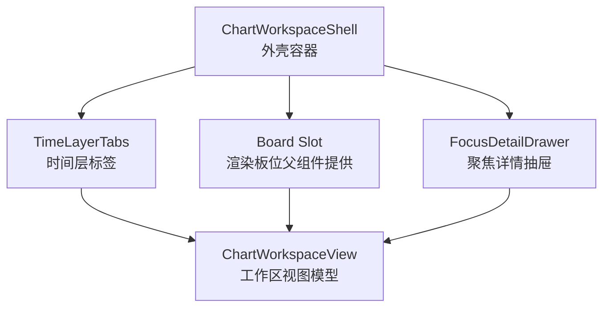
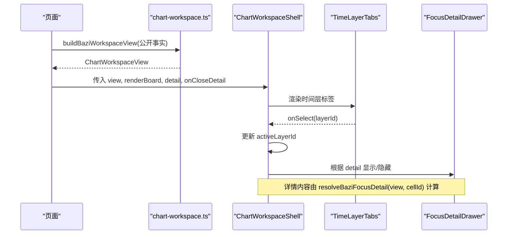
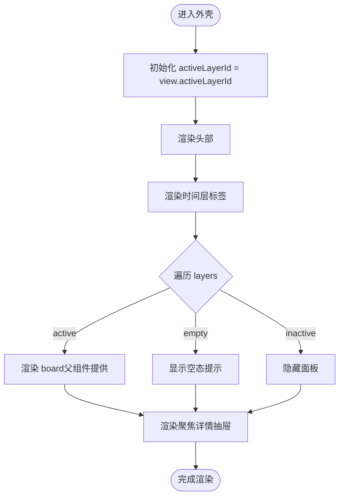
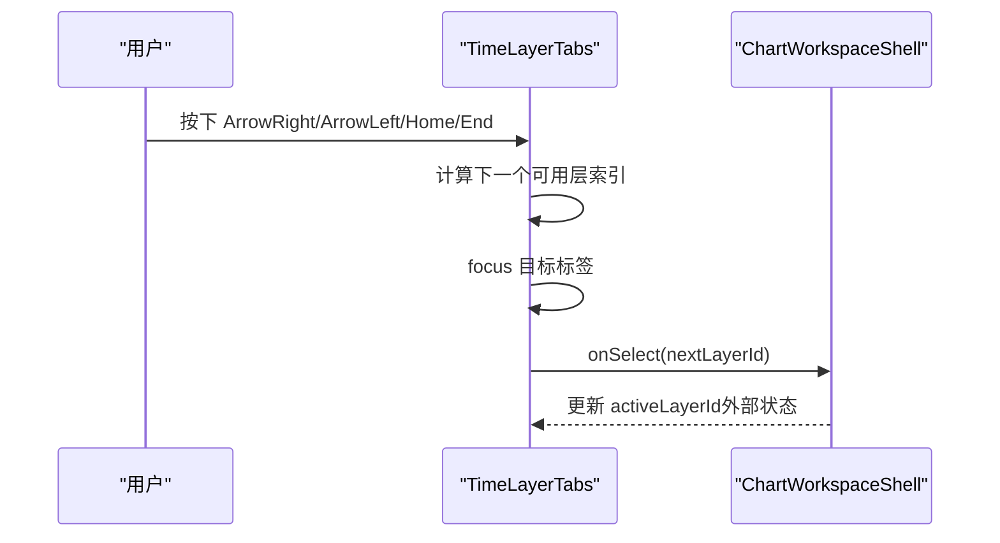
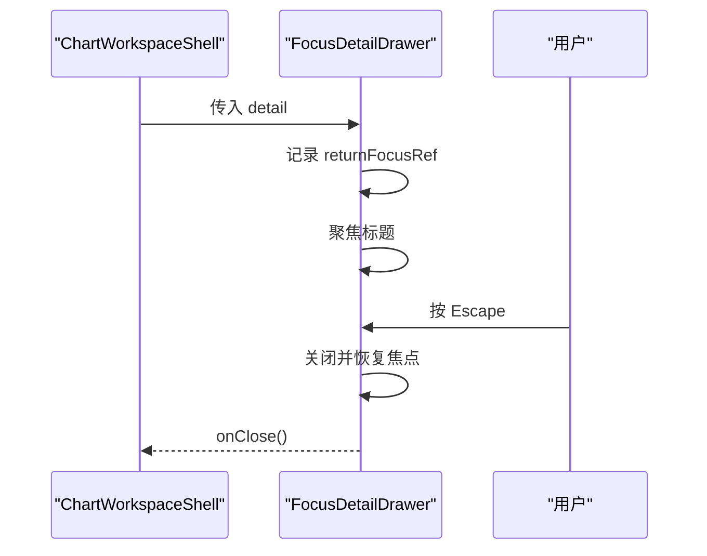
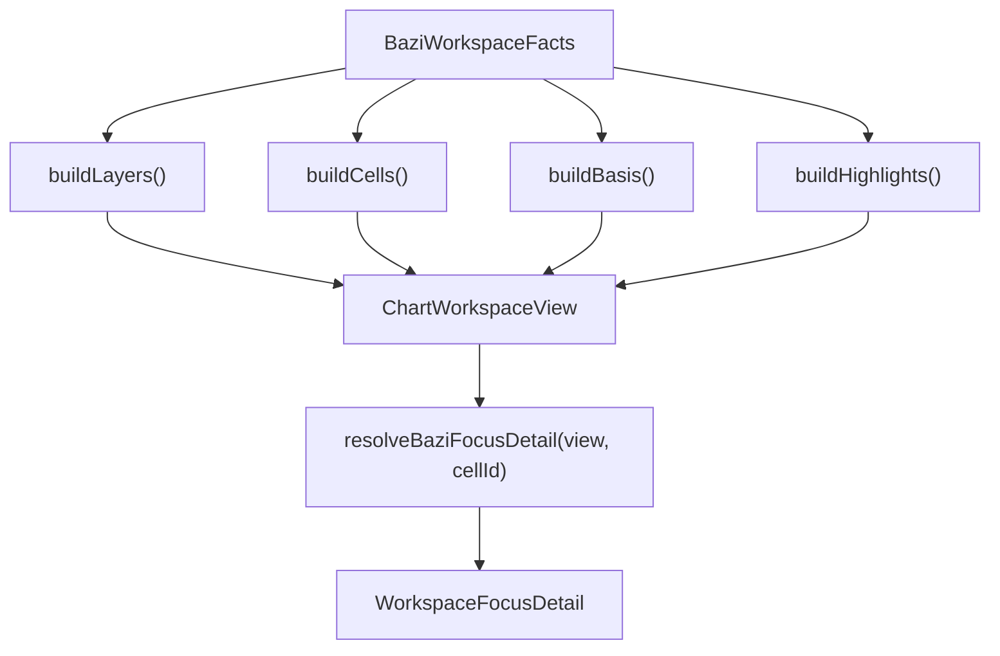
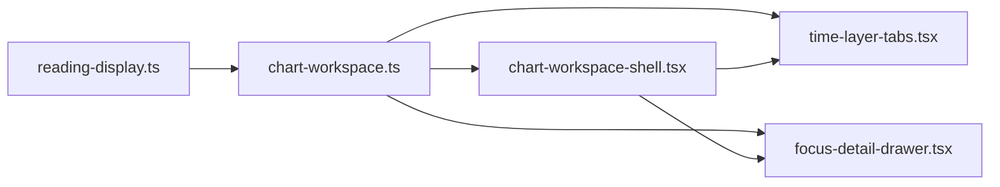

# 图表工作区外壳

<cite>
**本文引用的文件**
- [chart-workspace-shell.tsx](file://web/src/components/readings/chart-workspace-shell.tsx)
- [chart-workspace-shell.module.css](file://web/src/components/readings/chart-workspace-shell.module.css)
- [time-layer-tabs.tsx](file://web/src/components/readings/time-layer-tabs.tsx)
- [time-layer-tabs.module.css](file://web/src/components/readings/time-layer-tabs.module.css)
- [focus-detail-drawer.tsx](file://web/src/components/readings/focus-detail-drawer.tsx)
- [focus-detail-drawer.module.css](file://web/src/components/readings/focus-detail-drawer.module.css)
- [chart-workspace.ts](file://web/src/lib/chart-workspace.ts)
- [reading-display.ts](file://web/src/lib/reading-display.ts)
- [chart-workspace-shell.test.tsx](file://web/src/test/chart-workspace-shell.test.tsx)
</cite>

## 目录
1. [简介](#简介)
2. [项目结构](#项目结构)
3. [核心组件](#核心组件)
4. [架构总览](#架构总览)
5. [详细组件分析](#详细组件分析)
6. [依赖关系分析](#依赖关系分析)
7. [性能与可访问性](#性能与可访问性)
8. [故障排查指南](#故障排查指南)
9. [结论](#结论)
10. [附录：扩展、主题与国际化](#附录：扩展主题与国际化)

## 简介
本文件面向“图表工作区外壳”这一前端容器组件，系统性说明其布局管理、时间层面板切换、聚焦详情抽屉、键盘交互、无障碍支持以及与服务端公开事实的对接方式。该外壳不执行业务计算，仅负责将服务端返回的“公开事实”映射为可交互的工作区视图，确保界面诚实呈现可用数据，避免伪造状态。

## 项目结构
图表工作区外壳由以下部分组成：
- 外壳容器：负责整体布局、标题、子标题、时间层标签栏、内容区域和聚焦详情抽屉的挂载。
- 时间层标签：基于工作区视图模型渲染“本命/大运/流年”等时间层，并处理键盘导航。
- 聚焦详情抽屉：展示选中单元格的关联事实、边界说明与来源，支持 Escape 关闭与焦点回归。
- 工作区视图模型：纯前端显示模型，将后端返回的公开事实转换为工作区可用的层、单元格、高亮与依据行。
- 样式模块：使用 CSS 变量实现主题化，提供进入动画、响应式与减少动效适配。

**图示来源**
- [chart-workspace-shell.tsx:22-99](file://web/src/components/readings/chart-workspace-shell.tsx#L22-L99)
- [time-layer-tabs.tsx:17-103](file://web/src/components/readings/time-layer-tabs.tsx#L17-L103)
- [focus-detail-drawer.tsx:14-139](file://web/src/components/readings/focus-detail-drawer.tsx#L14-L139)
- [chart-workspace.ts:49-57](file://web/src/lib/chart-workspace.ts#L49-L57)

**章节来源**
- [chart-workspace-shell.tsx:22-99](file://web/src/components/readings/chart-workspace-shell.tsx#L22-L99)
- [chart-workspace-shell.module.css:1-92](file://web/src/components/readings/chart-workspace-shell.module.css#L1-L92)

## 核心组件
- ChartWorkspaceShell：接收 view、renderBoard、detail、onCloseDetail 等 props，内部维护当前激活的时间层 id，渲染头部、时间层标签、面板内容与聚焦详情抽屉。
- TimeLayerTabs：根据 view.layers 渲染标签，禁用不可用层，支持左右方向键、Home/End 在可用层间循环切换，保持 ARIA 正确性。
- FocusDetailDrawer：当 detail 存在时显示标题、事实列表、可选文本摘要、边界与来源；支持 Escape 关闭并将焦点归还到触发元素。
- 工作区视图模型（chart-workspace.ts）：将 reading-display 的 BaziChartView 或后端公开事实映射为 ChartWorkspaceView，包含 layers、cells、highlights、basis 等字段，保证“所见即所得”，不虚构数据。

**章节来源**
- [chart-workspace-shell.tsx:22-99](file://web/src/components/readings/chart-workspace-shell.tsx#L22-L99)
- [time-layer-tabs.tsx:17-103](file://web/src/components/readings/time-layer-tabs.tsx#L17-L103)
- [focus-detail-drawer.tsx:14-139](file://web/src/components/readings/focus-detail-drawer.tsx#L14-L139)
- [chart-workspace.ts:12-57](file://web/src/lib/chart-workspace.ts#L12-L57)
- [chart-workspace.ts:152-238](file://web/src/lib/chart-workspace.ts#L152-L238)

## 架构总览
工作区外壳采用“视图模型驱动 + 容器渲染”的解耦设计：
- 上层页面负责获取服务端公开事实，调用 buildBaziWorkspaceView 生成 ChartWorkspaceView。
- 外壳通过 view 决定渲染哪些层、哪些单元格，并通过 renderBoard 回调将具体业务图表注入到面板中。
- 用户交互（点击单元格、切换层、打开/关闭详情）只改变本地 UI 状态，不直接修改数据源；详情内容由 resolveBaziFocusDetail 从 view.basis 推导。

**图示来源**
- [chart-workspace.ts:224-238](file://web/src/lib/chart-workspace.ts#L224-L238)
- [chart-workspace.ts:244-267](file://web/src/lib/chart-workspace.ts#L244-L267)
- [chart-workspace-shell.tsx:38-49](file://web/src/components/readings/chart-workspace-shell.tsx#L38-L49)
- [time-layer-tabs.tsx:32-61](file://web/src/components/readings/time-layer-tabs.tsx#L32-L61)
- [focus-detail-drawer.tsx:34-59](file://web/src/components/readings/focus-detail-drawer.tsx#L34-L59)

## 详细组件分析

### ChartWorkspaceShell（外壳容器）
- 职责
  - 渲染头部信息（标题、副标题）。
  - 渲染时间层标签栏，并与面板联动。
  - 根据 activeLayerId 选择当前面板内容，通过 renderBoard 注入业务图表。
  - 承载聚焦详情抽屉，并在切换层时自动关闭详情。
- 状态管理
  - 使用本地 state 保存 activeLayerId，初始值来自 view.activeLayerId。
  - 切换层时若与当前相同则忽略，否则更新状态并关闭详情。
- 可访问性
  - 每个面板设置 role="tabpanel"、aria-labelledby 指向对应 tab。
  - 仅激活面板参与 Tab 顺序，非激活面板 hidden。
- 空态与未就绪
  - 当 layer.status 为 empty 时显示提示文案；unavailable 时标签禁用且不可选。

**图示来源**
- [chart-workspace-shell.tsx:38-99](file://web/src/components/readings/chart-workspace-shell.tsx#L38-L99)

**章节来源**
- [chart-workspace-shell.tsx:22-99](file://web/src/components/readings/chart-workspace-shell.tsx#L22-L99)
- [chart-workspace-shell.module.css:1-92](file://web/src/components/readings/chart-workspace-shell.module.css#L1-L92)

### TimeLayerTabs（时间层标签）
- 职责
  - 根据 view.layers 渲染标签，标记 unavailable 为禁用。
  - 支持键盘导航：左右方向键在可用层之间循环移动，Home/End 跳转首尾。
  - 维护 ARIA：role="tablist"，每个按钮 role="tab"，aria-controls 指向对应 panel。
- 交互细节
  - 仅在 status !== "unavailable" 的层之间导航。
  - 切换后调用 onSelect 通知父组件更新 activeLayerId。

**图示来源**
- [time-layer-tabs.tsx:32-61](file://web/src/components/readings/time-layer-tabs.tsx#L32-L61)
- [time-layer-tabs.tsx:63-103](file://web/src/components/readings/time-layer-tabs.tsx#L63-L103)

**章节来源**
- [time-layer-tabs.tsx:17-103](file://web/src/components/readings/time-layer-tabs.tsx#L17-L103)
- [time-layer-tabs.module.css:1-76](file://web/src/components/readings/time-layer-tabs.module.css#L1-L76)

### FocusDetailDrawer（聚焦详情抽屉）
- 职责
  - 当 detail 存在时，显示标题、事实列表、可选摘要、边界与来源。
  - 支持 Escape 关闭，并在关闭后将焦点归还到触发元素。
  - 无 detail 时显示引导文案，强调只显示服务端已公开的事实。
- 可访问性与焦点管理
  - 打开时将焦点移动到标题，记录上一个活动元素以便关闭后恢复。
  - 监听 window keydown 捕获 Escape。

**图示来源**
- [focus-detail-drawer.tsx:28-59](file://web/src/components/readings/focus-detail-drawer.tsx#L28-L59)
- [focus-detail-drawer.tsx:61-139](file://web/src/components/readings/focus-detail-drawer.tsx#L61-L139)

**章节来源**
- [focus-detail-drawer.tsx:14-139](file://web/src/components/readings/focus-detail-drawer.tsx#L14-L139)
- [focus-detail-drawer.module.css:1-184](file://web/src/components/readings/focus-detail-drawer.module.css#L1-L184)

### 工作区视图模型（chart-workspace.ts）
- 职责
  - 将后端公开事实映射为 ChartWorkspaceView：title、subtitle、layers、activeLayerId、cells、highlights、basis。
  - 构建时间层状态：有柱则为 ready，否则 empty；大运存在则为 ready，否则 unavailable；流年固定 unavailable。
  - 构建单元格：四柱顺序固定，缺失值标注 badges，并关联 basis 中的相关事实键。
  - 解析聚焦详情：根据单元格关联事实键从 basis 提取事实，构造 limits 与 sources。
- 数据流
  - 上游页面通过 baziWorkspaceFactsFromChart 将 reading-display 的 BaziChartView 转为 BaziWorkspaceFacts。
  - 再调用 buildBaziWorkspaceView 得到 ChartWorkspaceView。
  - 单元格点击后调用 resolveBaziFocusDetail 生成 WorkspaceFocusDetail。

**图示来源**
- [chart-workspace.ts:152-238](file://web/src/lib/chart-workspace.ts#L152-L238)
- [chart-workspace.ts:244-267](file://web/src/lib/chart-workspace.ts#L244-L267)
- [chart-workspace.ts:273-302](file://web/src/lib/chart-workspace.ts#L273-L302)

**章节来源**
- [chart-workspace.ts:12-57](file://web/src/lib/chart-workspace.ts#L12-L57)
- [chart-workspace.ts:152-238](file://web/src/lib/chart-workspace.ts#L152-L238)
- [chart-workspace.ts:244-267](file://web/src/lib/chart-workspace.ts#L244-L267)
- [chart-workspace.ts:273-302](file://web/src/lib/chart-workspace.ts#L273-L302)

## 依赖关系分析
- 组件依赖
  - ChartWorkspaceShell 依赖 TimeLayerTabs 与 FocusDetailDrawer。
  - TimeLayerTabs 与 FocusDetailDrawer 均依赖 chart-workspace.ts 的类型定义与工具函数。
- 数据依赖
  - ChartWorkspaceView 由 buildBaziWorkspaceView 生成，来源于 BaziWorkspaceFacts。
  - BaziWorkspaceFacts 可由 reading-display.ts 的 BaziChartView 转换而来。
- 样式依赖
  - 所有组件通过 CSS Modules 引入样式，使用 CSS 变量实现主题化与动效控制。

**图示来源**
- [reading-display.ts:1-200](file://web/src/lib/reading-display.ts#L1-L200)
- [chart-workspace.ts:12-57](file://web/src/lib/chart-workspace.ts#L12-L57)
- [chart-workspace-shell.tsx:22-99](file://web/src/components/readings/chart-workspace-shell.tsx#L22-L99)
- [time-layer-tabs.tsx:17-103](file://web/src/components/readings/time-layer-tabs.tsx#L17-L103)
- [focus-detail-drawer.tsx:14-139](file://web/src/components/readings/focus-detail-drawer.tsx#L14-L139)

**章节来源**
- [reading-display.ts:1-200](file://web/src/lib/reading-display.ts#L1-L200)
- [chart-workspace.ts:12-57](file://web/src/lib/chart-workspace.ts#L12-L57)

## 性能与可访问性
- 性能
  - 外壳仅维护少量本地状态（activeLayerId），渲染开销低。
  - 面板通过 hidden 属性切换可见性，避免重复创建节点。
  - 详情抽屉按需渲染，仅在 detail 存在时显示。
- 可访问性
  - 标签栏遵循 WAI-ARIA Tabs 模式：tablist/tab/tabpanel 与 aria-selected/aria-controls/aria-labelledby。
  - 键盘导航：方向键在可用层间循环，Home/End 跳转首尾；详情抽屉支持 Escape 关闭。
  - 焦点管理：打开详情聚焦标题，关闭后恢复焦点；减少动效媒体查询下禁用过渡。
- 无障碍测试覆盖
  - 测试用例验证了标签数量、Aria 属性、键盘导航、禁用层、详情打开/关闭与焦点回归等行为。

**章节来源**
- [time-layer-tabs.tsx:32-61](file://web/src/components/readings/time-layer-tabs.tsx#L32-L61)
- [focus-detail-drawer.tsx:34-59](file://web/src/components/readings/focus-detail-drawer.tsx#L34-L59)
- [chart-workspace-shell.test.tsx:102-317](file://web/src/test/chart-workspace-shell.test.tsx#L102-L317)

## 故障排查指南
- 现象：时间层标签全部不可点击
  - 检查 view.layers 中各层的 status 是否为 unavailable；unavailable 表示服务端未生成，UI 不应伪装 ready。
- 现象：切换层无效
  - 确认 handleSelectLayer 是否被调用；检查 activeLayerId 是否与当前一致导致提前 return。
- 现象：详情抽屉无法关闭
  - 检查 Escape 事件监听是否正确注册与移除；确认 onClose 回调是否被调用。
- 现象：详情内容空白
  - 检查 resolveBaziFocusDetail 是否能从 view.cells 找到对应单元格，以及 view.basis 是否包含相关事实键。
- 现象：键盘导航异常
  - 确认 TimeLayerTabs 的 handleKeyDown 逻辑是否过滤 unavailable 层；验证 Home/End 与方向键行为。

**章节来源**
- [time-layer-tabs.tsx:32-61](file://web/src/components/readings/time-layer-tabs.tsx#L32-L61)
- [focus-detail-drawer.tsx:34-59](file://web/src/components/readings/focus-detail-drawer.tsx#L34-L59)
- [chart-workspace.ts:244-267](file://web/src/lib/chart-workspace.ts#L244-L267)
- [chart-workspace-shell.test.tsx:148-199](file://web/src/test/chart-workspace-shell.test.tsx#L148-L199)

## 结论
图表工作区外壳以“视图模型驱动”的方式，将服务端公开事实安全、诚实地呈现为用户可交互的工作区。它通过清晰的状态管理与严格的 ARIA 规范，实现了时间层切换、聚焦详情、键盘导航与无障碍体验。由于不执行业务计算，外壳具备良好的可复用性与可扩展性，适合在不同读盘场景中复用。

## 附录：扩展、主题与国际化

### 扩展接口
- 渲染板位：通过 renderBoard(activeLayer) 回调注入任意业务图表，外壳不关心具体实现。
- 聚焦详情：通过 resolveBaziFocusDetail 将单元格与 basis 事实关联，可在上游扩展更多事实键以提升详情丰富度。
- 时间层：可在上游调整 view.layers 的 status 与 summary，以反映不同能力或服务端返回情况。

**章节来源**
- [chart-workspace-shell.tsx:22-99](file://web/src/components/readings/chart-workspace-shell.tsx#L22-L99)
- [chart-workspace.ts:244-267](file://web/src/lib/chart-workspace.ts#L244-L267)

### 主题定制
- 通过 CSS 变量统一控制边框、阴影、颜色与动效时长，如 --border-subtle、--shadow-card、--duration-feedback、--ease-out-expo 等。
- 减少动效：prefers-reduced-motion 媒体查询下禁用过渡与变换，提升可访问性。

**章节来源**
- [chart-workspace-shell.module.css:1-92](file://web/src/components/readings/chart-workspace-shell.module.css#L1-L92)
- [time-layer-tabs.module.css:1-76](file://web/src/components/readings/time-layer-tabs.module.css#L1-L76)
- [focus-detail-drawer.module.css:1-184](file://web/src/components/readings/focus-detail-drawer.module.css#L1-L184)

### 国际化支持
- 当前硬编码中文文案集中在组件与视图模型中（如“确定性盘面”、“聚焦详情”、“未生成”等）。
- 建议将文案抽取为 i18n 资源，通过上下文或配置注入，便于多语言切换。
- 日期与时间格式化已在 reading-display.ts 中使用 Intl.DateTimeFormat，可按需扩展其他字段的本地化。

**章节来源**
- [chart-workspace-shell.tsx:53-60](file://web/src/components/readings/chart-workspace-shell.tsx#L53-L60)
- [focus-detail-drawer.tsx:68-82](file://web/src/components/readings/focus-detail-drawer.tsx#L68-L82)
- [chart-workspace.ts:160-184](file://web/src/lib/chart-workspace.ts#L160-L184)
- [reading-display.ts:3-17](file://web/src/lib/reading-display.ts#L3-L17)