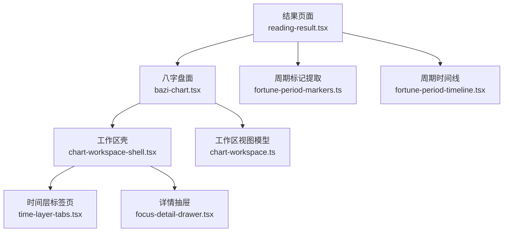
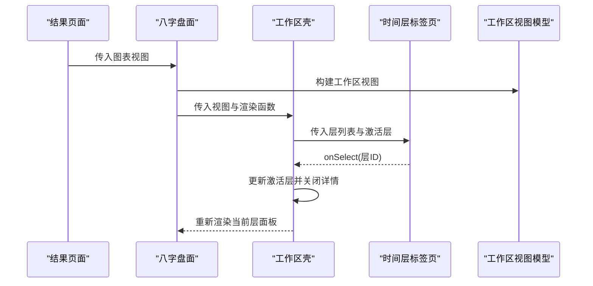
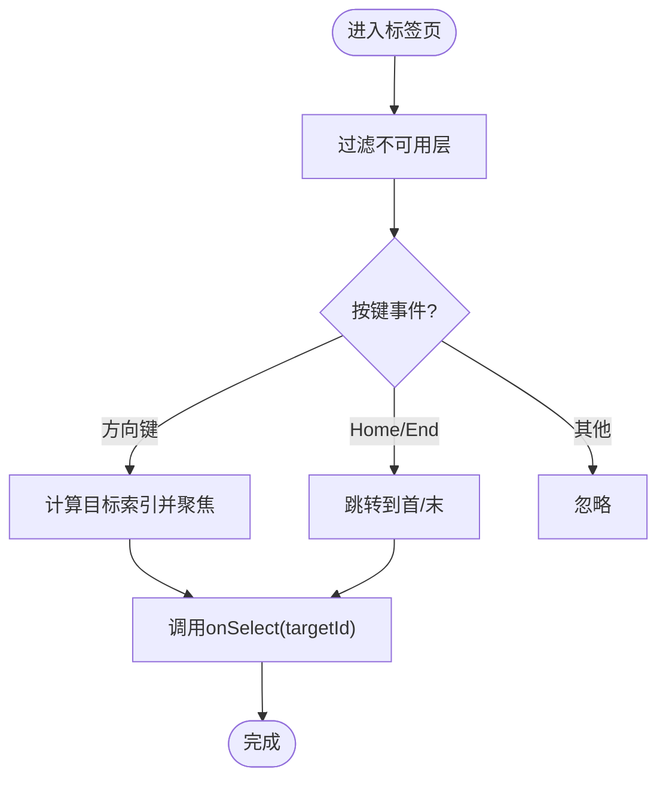
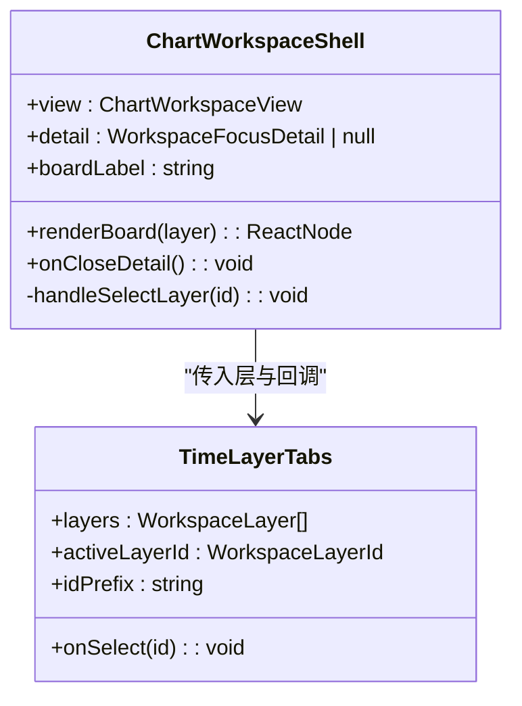
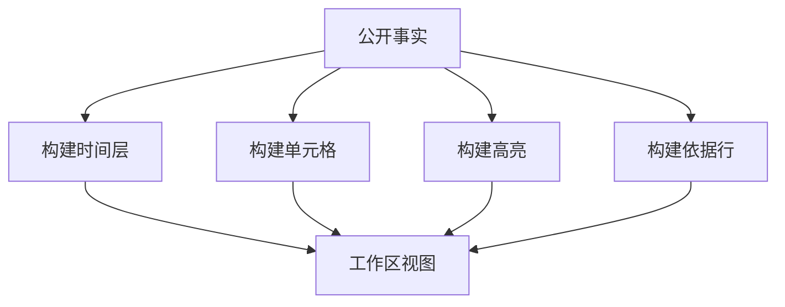
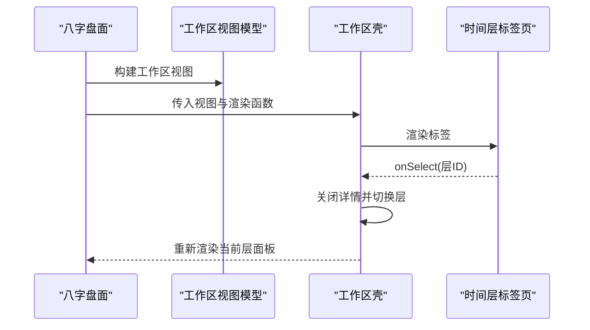
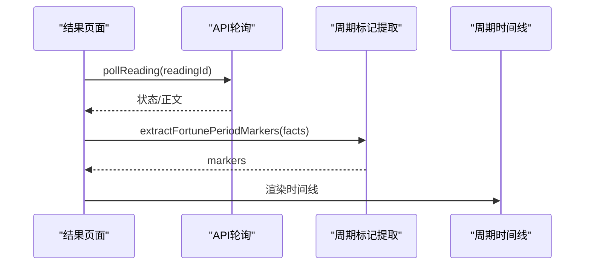
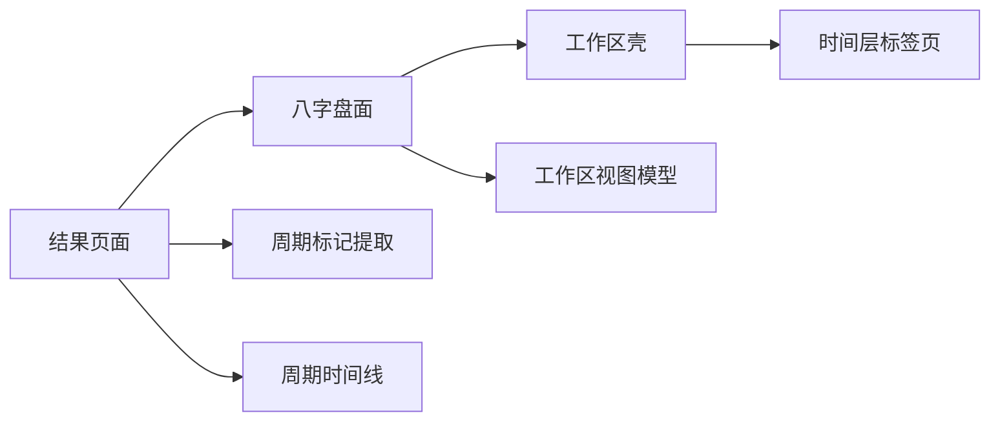

# 时间层标签页

<cite>
**本文引用的文件**
- [time-layer-tabs.tsx](file://web/src/components/readings/time-layer-tabs.tsx)
- [time-layer-tabs.module.css](file://web/src/components/readings/time-layer-tabs.module.css)
- [chart-workspace-shell.tsx](file://web/src/components/readings/chart-workspace-shell.tsx)
- [chart-workspace.ts](file://web/src/lib/chart-workspace.ts)
- [bazi-chart.tsx](file://web/src/components/readings/bazi-chart.tsx)
- [reading-result.tsx](file://web/src/components/readings/reading-result.tsx)
- [fortune-period-markers.ts](file://web/src/lib/fortune-period-markers.ts)
- [fortune-period-timeline.tsx](file://web/src/components/readings/fortune-period-timeline.tsx)
</cite>

## 目录
1. [简介](#简介)
2. [项目结构](#项目结构)
3. [核心组件](#核心组件)
4. [架构总览](#架构总览)
5. [详细组件分析](#详细组件分析)
6. [依赖关系分析](#依赖关系分析)
7. [性能与内存管理](#性能与内存管理)
8. [故障排查指南](#故障排查指南)
9. [结论](#结论)
10. [附录：扩展接口与自定义选项](#附录：扩展接口与自定义选项)

## 简介
本组件文档聚焦“时间层标签页”能力，围绕以下目标展开：
- 时间维度的切换逻辑：通过工作区视图模型驱动的时间层（本命、大运、流年）进行切换，并联动内容区域更新。
- 层级关系的展示方式：以标签页形式呈现各时间层，结合状态（就绪、空、不可用）提供诚实的界面反馈。
- 内容区域的联动更新：切换标签时，面板隐藏/显示与焦点细节关闭，确保一致的用户体验。
- 时间粒度选择算法：基于服务端返回的公开事实决定哪些时间层可用，前端不计算、不伪造数据。
- 历史数据查询策略与缓存机制：结果页面轮询读取解读结果，命中已交付后拉取正文；时间层本身由工作区视图直接渲染，无额外本地缓存。
- 动态生成、懒加载优化与内存管理：标签与面板按工作区视图动态生成；非活动面板使用隐藏而非销毁，减少重绘；详情抽屉按需打开。
- 时间范围限制检查、无效时间与用户提示：通过状态文案与摘要提示用户当前层是否可展示或尚未生成。
- 扩展接口与自定义时间单位、格式化：通过工作区视图类型与构建函数扩展新时间层；日期与周期标记采用统一格式化。

## 项目结构
时间层标签页位于“读盘工作台”中，由壳组件承载，并由工作区视图模型驱动。关键文件职责如下：
- 时间层标签页：负责渲染标签、键盘导航、无障碍属性与禁用态。
- 工作区壳组件：维护激活层状态、渲染面板与详情抽屉。
- 工作区视图模型：将后端公开事实映射为时间层、单元格、高亮等视图数据。
- 八字盘面组件：将图表视图转换为工作区视图，并在壳内渲染四柱网格与要点。
- 结果页面：轮询获取解读结果，构造图表与工作区视图，并串联时间线等子组件。
- 周期标记工具：从公开事实中提取周期确定性标记，用于运势时间线。

图示来源
- [reading-result.tsx:172-303](file://web/src/components/readings/reading-result.tsx#L172-L303)
- [bazi-chart.tsx:129-201](file://web/src/components/readings/bazi-chart.tsx#L129-L201)
- [chart-workspace-shell.tsx:22-99](file://web/src/components/readings/chart-workspace-shell.tsx#L22-L99)
- [time-layer-tabs.tsx:17-103](file://web/src/components/readings/time-layer-tabs.tsx#L17-L103)
- [chart-workspace.ts:152-238](file://web/src/lib/chart-workspace.ts#L152-L238)
- [fortune-period-markers.ts:31-77](file://web/src/lib/fortune-period-markers.ts#L31-L77)
- [fortune-period-timeline.tsx:6-49](file://web/src/components/readings/fortune-period-timeline.tsx#L6-L49)

章节来源
- [reading-result.tsx:172-303](file://web/src/components/readings/reading-result.tsx#L172-L303)
- [chart-workspace-shell.tsx:22-99](file://web/src/components/readings/chart-workspace-shell.tsx#L22-L99)
- [chart-workspace.ts:152-238](file://web/src/lib/chart-workspace.ts#L152-L238)

## 核心组件
- 时间层标签页：接收工作区层列表、当前激活层、选择回调与前缀ID，渲染标签按钮，支持键盘导航与无障碍属性，对不可用层禁用。
- 工作区壳：维护激活层状态，渲染标签与对应面板，处理详情抽屉关闭。
- 工作区视图模型：根据公开事实构建时间层、单元格、高亮与依据行，决定层的就绪/空/不可用状态。
- 八字盘面：将图表视图转为工作区视图，仅在本命层渲染四柱网格与要点，其他层给出说明性提示。
- 结果页面：轮询读取解读结果，构造图表与工作区视图，并组合时间线、事实、证据与复核表单。

章节来源
- [time-layer-tabs.tsx:17-103](file://web/src/components/readings/time-layer-tabs.tsx#L17-L103)
- [chart-workspace-shell.tsx:22-99](file://web/src/components/readings/chart-workspace-shell.tsx#L22-L99)
- [chart-workspace.ts:152-238](file://web/src/lib/chart-workspace.ts#L152-L238)
- [bazi-chart.tsx:129-201](file://web/src/components/readings/bazi-chart.tsx#L129-L201)
- [reading-result.tsx:172-303](file://web/src/components/readings/reading-result.tsx#L172-L303)

## 架构总览
时间层标签页是“纯视图”组件，严格依赖工作区视图模型提供的层信息。壳组件持有激活层状态，并通过回调通知上层；标签页只负责交互与展示。

图示来源
- [reading-result.tsx:285-303](file://web/src/components/readings/reading-result.tsx#L285-L303)
- [bazi-chart.tsx:134-141](file://web/src/components/readings/bazi-chart.tsx#L134-L141)
- [chart-workspace-shell.tsx:37-49](file://web/src/components/readings/chart-workspace-shell.tsx#L37-L49)
- [time-layer-tabs.tsx:63-100](file://web/src/components/readings/time-layer-tabs.tsx#L63-L100)
- [chart-workspace.ts:152-185](file://web/src/lib/chart-workspace.ts#L152-L185)

## 详细组件分析

### 时间层标签页组件
- 输入参数
  - layers：工作区层数组，包含id、label、status、summary。
  - activeLayerId：当前激活层ID。
  - onSelect：选择回调，向父级传递目标层ID。
  - idPrefix：用于生成唯一DOM ID前缀，保证无障碍关联正确。
- 交互与可访问性
  - 键盘导航：左右箭头在可用层间循环移动，Home/End跳转首尾。
  - 无障碍：role="tablist/tab"，aria-controls/aria-selected/aria-disabled，active层tabIndex=0，其余-1。
  - 禁用态：status为unavailable的层被禁用且显示“未生成”。
- 展示逻辑
  - 标签显示层名与可选摘要；empty层显示“暂无结构”，unavailable层显示“未生成”。
  - 样式通过CSS模块控制，hover/active/禁用态均有明确视觉反馈。

图示来源
- [time-layer-tabs.tsx:32-61](file://web/src/components/readings/time-layer-tabs.tsx#L32-L61)
- [time-layer-tabs.tsx:63-100](file://web/src/components/readings/time-layer-tabs.tsx#L63-L100)

章节来源
- [time-layer-tabs.tsx:17-103](file://web/src/components/readings/time-layer-tabs.tsx#L17-L103)
- [time-layer-tabs.module.css:1-76](file://web/src/components/readings/time-layer-tabs.module.css#L1-L76)

### 工作区壳组件
- 状态管理
  - 维护activeLayerId，默认来自视图的activeLayerId。
  - 切换层时关闭详情抽屉，避免残留上下文。
- 面板渲染
  - 每个层对应一个panel，使用hidden属性控制显隐，保持DOM存在但不可见。
  - 空层显示提示信息，就绪层调用renderBoard渲染具体业务内容。
- 无障碍
  - panel设置role="tabpanel"，并与对应tab通过ID关联。

图示来源
- [chart-workspace-shell.tsx:22-99](file://web/src/components/readings/chart-workspace-shell.tsx#L22-L99)
- [time-layer-tabs.tsx:17-103](file://web/src/components/readings/time-layer-tabs.tsx#L17-L103)

章节来源
- [chart-workspace-shell.tsx:22-99](file://web/src/components/readings/chart-workspace-shell.tsx#L22-L99)

### 工作区视图模型（时间维度与层级）
- 时间层定义
  - 本命：当四柱任一有值时为ready，否则empty。
  - 大运：当存在activeLuck时为ready，否则unavailable。
  - 流年：当前固定为unavailable，预留扩展位。
- 单元格与高亮
  - 四柱顺序固定，缺失值标注“未提供”或“时辰未知”。
  - 高亮来自服务端事实，前端仅做投影。
- 依据行
  - 从基础事实中筛选有值的行，作为聚焦详情的相关事实来源。

图示来源
- [chart-workspace.ts:152-238](file://web/src/lib/chart-workspace.ts#L152-L238)

章节来源
- [chart-workspace.ts:152-238](file://web/src/lib/chart-workspace.ts#L152-L238)

### 八字盘面与时间层联动
- 视图转换
  - 将图表视图转换为工作区事实，再构建工作区视图。
- 渲染策略
  - 仅本命层渲染四柱网格与要点；其他层显示说明性文本，表明服务端未返回逐柱结构。
- 详情联动
  - 点击四柱卡片打开详情抽屉，切换层时关闭详情。

图示来源
- [bazi-chart.tsx:129-201](file://web/src/components/readings/bazi-chart.tsx#L129-L201)
- [chart-workspace-shell.tsx:37-49](file://web/src/components/readings/chart-workspace-shell.tsx#L37-L49)
- [time-layer-tabs.tsx:63-100](file://web/src/components/readings/time-layer-tabs.tsx#L63-L100)

章节来源
- [bazi-chart.tsx:129-201](file://web/src/components/readings/bazi-chart.tsx#L129-L201)
- [chart-workspace-shell.tsx:37-49](file://web/src/components/readings/chart-workspace-shell.tsx#L37-L49)

### 结果页面中的时间线与数据流
- 数据获取
  - 轮询读取解读版本状态，成功后拉取正文。
- 时间线
  - 针对运势能力，从公开事实中提取周期确定性标记，渲染时间线。
- 组合
  - 将时间线、事实、证据与复核表单组合到结果页面中。

图示来源
- [reading-result.tsx:180-233](file://web/src/components/readings/reading-result.tsx#L180-L233)
- [fortune-period-markers.ts:31-77](file://web/src/lib/fortune-period-markers.ts#L31-L77)
- [fortune-period-timeline.tsx:6-49](file://web/src/components/readings/fortune-period-timeline.tsx#L6-L49)

章节来源
- [reading-result.tsx:180-233](file://web/src/components/readings/reading-result.tsx#L180-L233)
- [fortune-period-markers.ts:31-77](file://web/src/lib/fortune-period-markers.ts#L31-L77)
- [fortune-period-timeline.tsx:6-49](file://web/src/components/readings/fortune-period-timeline.tsx#L6-L49)

## 依赖关系分析
- 组件耦合
  - 时间层标签页仅依赖工作区视图模型的数据结构，不感知数据来源。
  - 工作区壳聚合标签页与详情抽屉，承担状态管理与布局职责。
  - 八字盘面将图表视图转换为工作区视图，并限定在本命层渲染详细内容。
- 外部依赖
  - 结果页面依赖API轮询与公开事实；周期标记工具依赖公开事实格式。
- 潜在循环依赖
  - 组件之间通过props与回调解耦，未见循环导入。

图示来源
- [reading-result.tsx:172-303](file://web/src/components/readings/reading-result.tsx#L172-L303)
- [bazi-chart.tsx:129-201](file://web/src/components/readings/bazi-chart.tsx#L129-L201)
- [chart-workspace-shell.tsx:22-99](file://web/src/components/readings/chart-workspace-shell.tsx#L22-L99)
- [chart-workspace.ts:152-238](file://web/src/lib/chart-workspace.ts#L152-L238)
- [fortune-period-markers.ts:31-77](file://web/src/lib/fortune-period-markers.ts#L31-L77)
- [fortune-period-timeline.tsx:6-49](file://web/src/components/readings/fortune-period-timeline.tsx#L6-L49)

章节来源
- [chart-workspace-shell.tsx:22-99](file://web/src/components/readings/chart-workspace-shell.tsx#L22-L99)
- [chart-workspace.ts:152-238](file://web/src/lib/chart-workspace.ts#L152-L238)

## 性能与内存管理
- 动态生成与懒加载
  - 标签与面板按工作区视图动态生成；非活动面板使用hidden而非销毁，避免重复创建开销。
  - 详情抽屉仅在选中单元格时打开，减少不必要的渲染。
- 内存管理
  - 结果页面的轮询定时器在卸载时清理，防止内存泄漏。
  - 工作区视图通过useMemo构建，减少重复计算。
- 性能建议
  - 若未来增加更多时间层，建议在渲染函数中对大数据量面板进行分页或虚拟滚动。
  - 对于长列表（如证据、事实），考虑虚拟化与防抖搜索。

[本节为通用指导，不直接分析具体文件]

## 故障排查指南
- 标签不可点击
  - 检查层status是否为unavailable；该状态会禁用标签并显示“未生成”。
  - 确认键盘导航是否正确聚焦到可用层。
- 内容不更新
  - 确认切换层时onSelect回调是否被调用，壳组件是否更新了activeLayerId。
  - 检查面板是否因hidden导致不可见；确认role与aria属性关联正确。
- 详情未关闭
  - 切换层时应调用onCloseDetail；检查壳组件是否在handleSelectLayer中关闭详情。
- 时间线为空
  - 检查公开事实中是否存在周期确定性标记；确认extractFortunePeriodMarkers是否正确识别。
- 错误与重试
  - 结果页面在错误时提供重试按钮；轮询失败时记录错误消息并停止轮询。

章节来源
- [time-layer-tabs.tsx:32-61](file://web/src/components/readings/time-layer-tabs.tsx#L32-L61)
- [chart-workspace-shell.tsx:45-49](file://web/src/components/readings/chart-workspace-shell.tsx#L45-L49)
- [reading-result.tsx:180-233](file://web/src/components/readings/reading-result.tsx#L180-L233)
- [fortune-period-markers.ts:31-77](file://web/src/lib/fortune-period-markers.ts#L31-L77)

## 结论
时间层标签页以工作区视图模型为核心，严格遵循“前端不计算、不伪造”的原则，通过状态与摘要提供诚实的用户反馈。壳组件管理激活层与详情抽屉，标签页专注交互与可访问性。结果页面负责数据获取与组合，周期时间线作为补充视图增强用户体验。整体架构清晰、可扩展性强，便于后续添加新的时间层与自定义格式化。

[本节为总结，不直接分析具体文件]

## 附录：扩展接口与自定义选项
- 新增时间层
  - 在工作区视图模型的buildLayers中添加新层，并定义其status判定逻辑。
  - 在时间层标签页中无需改动，自动渲染新层。
  - 在八字盘面中可为新层实现专属渲染逻辑（如大运、流年）。
- 自定义时间单位与格式化
  - 周期标记的日期通过formatDateTimeLike格式化；如需自定义，可在fortune-period-markers.ts中调整。
  - 工作区视图的basis行可通过修改BASIS_ROWS来扩展显示字段。
- 用户提示与限制
  - 通过层summary与空/不可用状态文案提示用户；必要时在壳组件的空状态中补充说明。
- 无障碍与键盘导航
  - 保持role、aria-*属性完整；键盘导航逻辑已在标签页中实现，可按需扩展快捷键。

章节来源
- [chart-workspace.ts:152-238](file://web/src/lib/chart-workspace.ts#L152-L238)
- [fortune-period-markers.ts:31-77](file://web/src/lib/fortune-period-markers.ts#L31-L77)
- [time-layer-tabs.tsx:32-61](file://web/src/components/readings/time-layer-tabs.tsx#L32-L61)
- [chart-workspace-shell.tsx:71-93](file://web/src/components/readings/chart-workspace-shell.tsx#L71-L93)