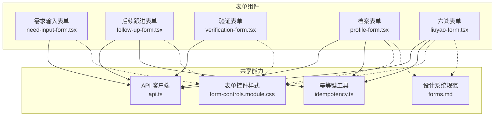
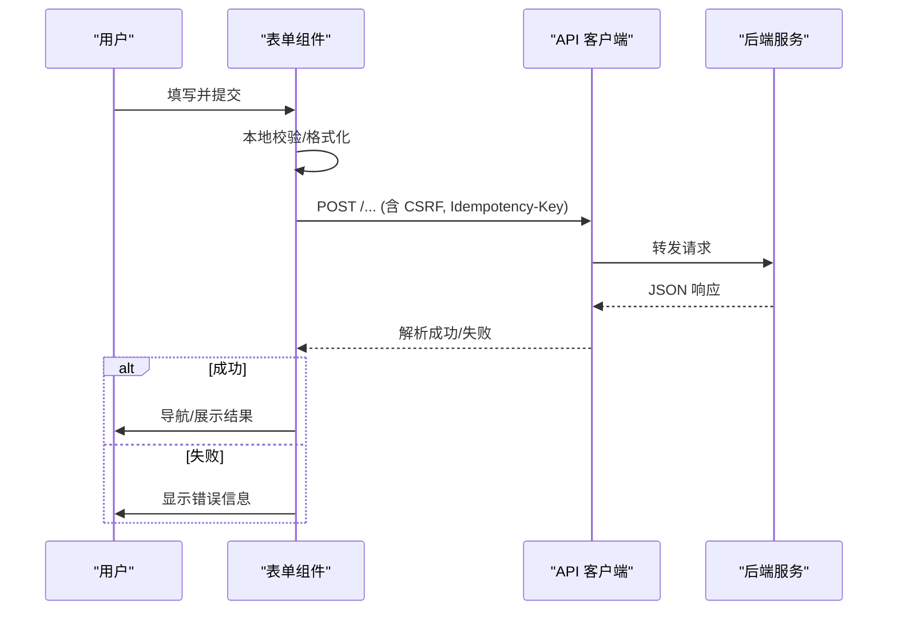
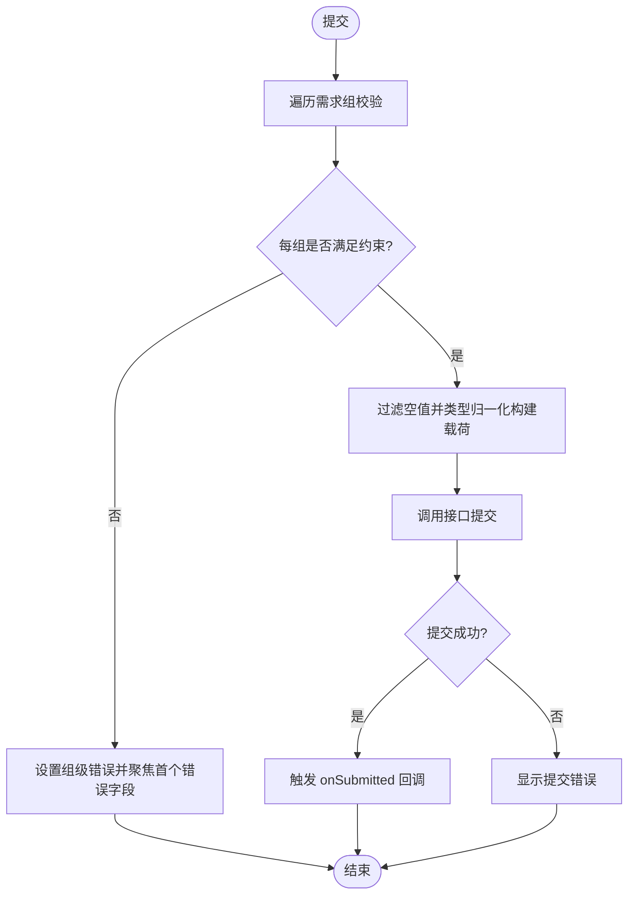
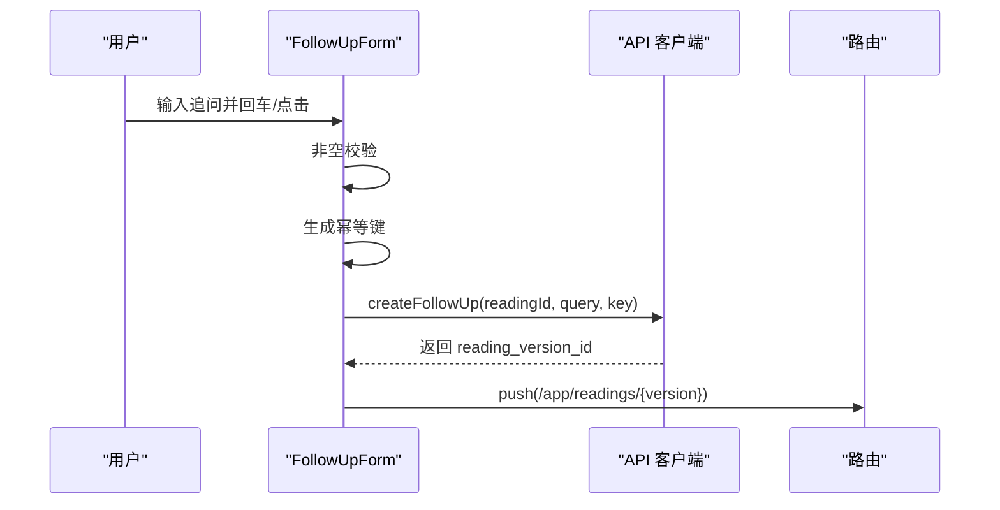
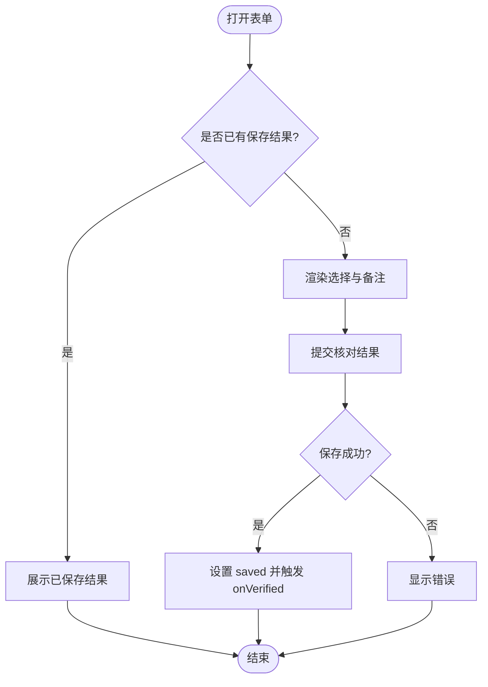
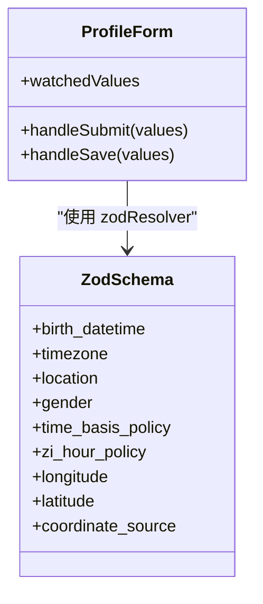
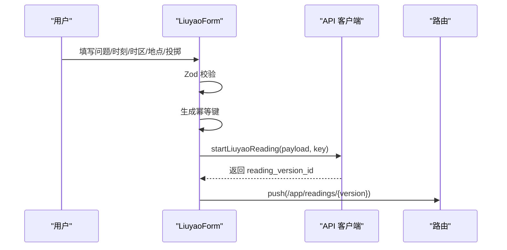
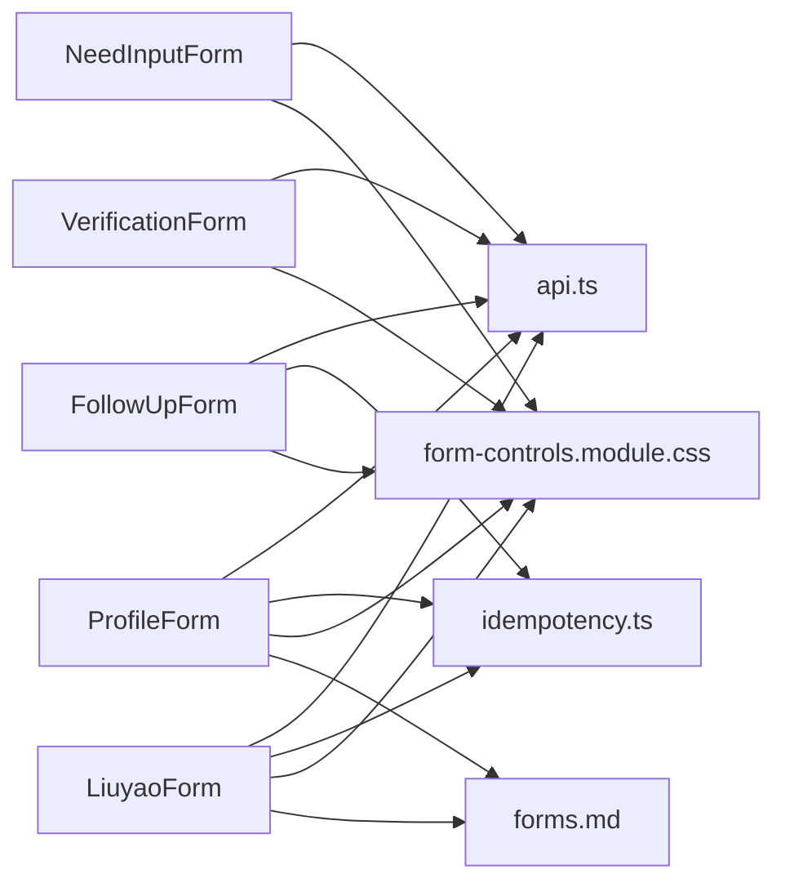

# 用户输入表单

<cite>
**本文引用的文件**
- [need-input-form.tsx](file://web/src/components/readings/need-input-form.tsx)
- [follow-up-form.tsx](file://web/src/components/readings/follow-up-form.tsx)
- [verification-form.tsx](file://web/src/components/readings/verification-form.tsx)
- [profile-form.tsx](file://web/src/components/profile-form.tsx)
- [liuyao-form.tsx](file://web/src/components/liuyao-form.tsx)
- [api.ts](file://web/src/lib/api.ts)
- [idempotency.ts](file://web/src/lib/idempotency.ts)
- [forms.md](file://design-system/mingli-web/pages/forms.md)
- [form-controls.module.css](file://web/src/components/form-controls.module.css)
- [form-contract.test.ts](file://web/src/test/form-contract.test.ts)
</cite>

## 目录
1. [简介](#简介)
2. [项目结构](#项目结构)
3. [核心组件](#核心组件)
4. [架构总览](#架构总览)
5. [详细组件分析](#详细组件分析)
6. [依赖关系分析](#依赖关系分析)
7. [性能与可用性考虑](#性能与可用性考虑)
8. [故障排查指南](#故障排查指南)
9. [结论](#结论)
10. [附录](#附录)

## 简介
本文件面向“用户输入表单组件群”，覆盖三类关键表单：需求输入表单、后续跟进表单、验证表单，并补充档案与六爻表单作为复杂多步骤表单的参考。文档聚焦以下目标：
- 数据收集逻辑：字段类型转换、必填组约束、条件显示、批量提交。
- 对话流程：从结果页发起追问的闭环与状态流转。
- 确认机制：核对结果的保存与展示。
- 验证规则与错误提示：前端校验、可访问性标注、错误定位与引导。
- 状态管理、持久化与进度保存：本地状态、防重复提交、幂等键。
- 多步骤流程控制、条件字段与批量操作。
- 可访问性与国际化适配建议。
- 自定义验证规则的扩展方式。

## 项目结构
表单相关代码主要位于 web 前端工程：
- 页面级表单组件：需求输入、后续跟进、验证、档案建立、六爻起卦。
- 通用 UI 控件样式：统一的字段、输入、错误、提示、禁用原因、动作区样式。
- API 客户端：统一请求封装、CSRF 处理、幂等键生成与传递。
- 设计系统规范：表单动效与交互原则。

图表来源
- [need-input-form.tsx:1-362](file://web/src/components/readings/need-input-form.tsx#L1-L362)
- [follow-up-form.tsx:1-109](file://web/src/components/readings/follow-up-form.tsx#L1-L109)
- [verification-form.tsx:1-130](file://web/src/components/readings/verification-form.tsx#L1-L130)
- [profile-form.tsx:1-570](file://web/src/components/profile-form.tsx#L1-L570)
- [liuyao-form.tsx:1-463](file://web/src/components/liuyao-form.tsx#L1-L463)
- [api.ts:256-330](file://web/src/lib/api.ts#L256-L330)
- [idempotency.ts:1-18](file://web/src/lib/idempotency.ts#L1-L18)
- [form-controls.module.css:1-176](file://web/src/components/form-controls.module.css#L1-L176)
- [forms.md:1-19](file://design-system/mingli-web/pages/forms.md#L1-L19)

章节来源
- [need-input-form.tsx:1-362](file://web/src/components/readings/need-input-form.tsx#L1-L362)
- [follow-up-form.tsx:1-109](file://web/src/components/readings/follow-up-form.tsx#L1-L109)
- [verification-form.tsx:1-130](file://web/src/components/readings/verification-form.tsx#L1-L130)
- [profile-form.tsx:1-570](file://web/src/components/profile-form.tsx#L1-L570)
- [liuyao-form.tsx:1-463](file://web/src/components/liuyao-form.tsx#L1-L463)
- [api.ts:256-330](file://web/src/lib/api.ts#L256-L330)
- [idempotency.ts:1-18](file://web/src/lib/idempotency.ts#L1-L18)
- [form-controls.module.css:1-176](file://web/src/components/form-controls.module.css#L1-L176)
- [forms.md:1-19](file://design-system/mingli-web/pages/forms.md#L1-L19)

## 核心组件
- 需求输入表单：根据服务端返回的结构化需求动态渲染字段，支持文本、数字、日期时间、布尔、选择项；按“任意一组至少一项且至多选一项”的规则校验；提交后进入下一步。
- 后续跟进表单：在已接纳结论基础上发起追问，携带幂等键防止重复提交，成功后跳转到对应解读版本。
- 验证表单：对解读结论进行“符合/部分符合/不符合/暂时不知道”的选择与可选备注，提交后展示已保存结果。
- 档案表单（多步骤）：分三步收集出生事实、计算口径、提交前核对；使用 Zod 校验、条件字段（真太阳时展开经纬度）、草稿创建与确认。
- 六爻表单（多步骤）：问题、时刻、时区、地点、起卦方式与投掷记录；手动模式逐项校验；启动解读并跳转。

章节来源
- [need-input-form.tsx:65-162](file://web/src/components/readings/need-input-form.tsx#L65-L162)
- [follow-up-form.tsx:12-53](file://web/src/components/readings/follow-up-form.tsx#L12-L53)
- [verification-form.tsx:24-62](file://web/src/components/readings/verification-form.tsx#L24-L62)
- [profile-form.tsx:112-218](file://web/src/components/profile-form.tsx#L112-L218)
- [liuyao-form.tsx:90-195](file://web/src/components/liuyao-form.tsx#L90-L195)

## 架构总览
表单通过统一的 API 客户端发起请求，包含 CSRF 获取与重试、幂等键注入、错误包装。各表单负责：
- 本地状态管理（值、错误、忙碌态）。
- 字段级或组级校验（Zod 或自实现）。
- 无障碍标注（aria-*、role、label、描述）。
- 成功后的导航或状态更新。

图表来源
- [api.ts:256-330](file://web/src/lib/api.ts#L256-L330)
- [follow-up-form.tsx:23-53](file://web/src/components/readings/follow-up-form.tsx#L23-L53)
- [liuyao-form.tsx:150-195](file://web/src/components/liuyao-form.tsx#L150-L195)
- [profile-form.tsx:166-218](file://web/src/components/profile-form.tsx#L166-L218)

## 详细组件分析

### 需求输入表单
- 数据收集逻辑
  - 接收服务端返回的需求定义，动态渲染字段集合。
  - 字段类型包括整数、数字、小数、日期时间、日期、布尔、选择、多行文本等，提交前进行类型归一化。
  - 分组约束：每个需求为一组，组内 any_of 字段必须恰好填一项；若仅一个字段则视为必填。
- 验证与错误提示
  - 提交时遍历所有需求组，统计非空字段数量，给出“至少一项/只能一项/某字段必填”的组级错误。
  - 首次错误字段自动聚焦，便于键盘用户快速修正。
  - 每个字段通过 aria-describedby 关联说明与错误信息，提升可访问性。
- 提交与状态
  - 使用 busyRef 与 busy 状态防止重复提交，按钮启用/禁用与 aria-busy 同步。
  - 提交成功后调用回调 onSubmitted，由父组件驱动流程推进。
- 可访问性
  - 标题、图例、标签、帮助文本、错误文本均具备语义化结构与 id 引用。
  - 布尔字段以 radio 组呈现，确保屏幕阅读器正确播报选项。

图表来源
- [need-input-form.tsx:109-162](file://web/src/components/readings/need-input-form.tsx#L109-L162)
- [need-input-form.tsx:164-362](file://web/src/components/readings/need-input-form.tsx#L164-L362)

章节来源
- [need-input-form.tsx:16-43](file://web/src/components/readings/need-input-form.tsx#L16-L43)
- [need-input-form.tsx:95-162](file://web/src/components/readings/need-input-form.tsx#L95-L162)
- [need-input-form.tsx:164-362](file://web/src/components/readings/need-input-form.tsx#L164-L362)

### 后续跟进表单
- 对话流程
  - 用户在结果页输入追问内容，前端进行非空校验。
  - 基于当前意图生成稳定幂等键，避免重复点击导致重复任务。
  - 调用接口创建跟进任务，成功后跳转到对应解读版本页面。
- 错误处理
  - 空输入时即时提示并聚焦输入框。
  - 网络或服务异常时显示友好错误消息。
- 可访问性
  - 隐藏标签配合占位符与提示，保持简洁界面。
  - 错误区域使用 role="alert" 与 aria-live 通知读屏器。

图表来源
- [follow-up-form.tsx:23-53](file://web/src/components/readings/follow-up-form.tsx#L23-L53)
- [api.ts:292-330](file://web/src/lib/api.ts#L292-L330)
- [idempotency.ts:8-17](file://web/src/lib/idempotency.ts#L8-L17)

章节来源
- [follow-up-form.tsx:12-53](file://web/src/components/readings/follow-up-form.tsx#L12-L53)
- [follow-up-form.tsx:55-109](file://web/src/components/readings/follow-up-form.tsx#L55-L109)
- [idempotency.ts:1-18](file://web/src/lib/idempotency.ts#L1-L18)

### 验证表单
- 确认机制
  - 提供单选结果集（符合/部分符合/不符合/暂时不知道），可选备注。
  - 提交后保存结果并展示已保存摘要，避免重复提交。
- 状态管理
  - 使用 saved 状态区分“未保存/已保存”视图。
  - busyRef 与 busy 状态保护提交过程。
- 可访问性
  - 单选组使用原生 radio，语义清晰。
  - 成功状态使用 role="status" 与 aria-live 播报。

图表来源
- [verification-form.tsx:24-62](file://web/src/components/readings/verification-form.tsx#L24-L62)
- [verification-form.tsx:64-130](file://web/src/components/readings/verification-form.tsx#L64-L130)

章节来源
- [verification-form.tsx:13-22](file://web/src/components/readings/verification-form.tsx#L13-L22)
- [verification-form.tsx:24-62](file://web/src/components/readings/verification-form.tsx#L24-L62)
- [verification-form.tsx:64-130](file://web/src/components/readings/verification-form.tsx#L64-L130)

### 档案表单（多步骤）
- 多步骤流程控制
  - 第一步：出生事实（时间、时区、地点、性别）。
  - 第二步：计算口径（时间口径、子时口径），当选择真太阳时时条件展开经纬度与坐标来源。
  - 第三步：提交前核对，汇总显示并确认。
- 验证规则
  - 使用 Zod 定义字段校验与跨字段校验（如时区有效性）。
  - 经纬度范围校验、时区 IANA 列表校验。
- 数据持久化
  - 先创建草稿，再确认草稿形成不可变版本；成功后跳转至档案列表。
- 可访问性
  - 每步有独立标题与编号，错误与帮助文本通过 aria-describedby 关联。
  - 禁用状态提供可见原因提示。

图表来源
- [profile-form.tsx:66-108](file://web/src/components/profile-form.tsx#L66-L108)
- [profile-form.tsx:112-218](file://web/src/components/profile-form.tsx#L112-L218)

章节来源
- [profile-form.tsx:28-108](file://web/src/components/profile-form.tsx#L28-L108)
- [profile-form.tsx:112-218](file://web/src/components/profile-form.tsx#L112-L218)
- [profile-form.tsx:220-570](file://web/src/components/profile-form.tsx#L220-L570)

### 六爻表单（多步骤）
- 多步骤流程控制
  - 问题、起卦时刻、时区、地点、起卦方式（手动/电子摇卦）。
  - 手动模式下逐项校验六次投掷结果。
- 验证规则
  - 问题长度限制、时间格式校验、时区有效性校验。
  - 手动模式下每次投掷必须在允许值范围内。
- 数据持久化
  - 启动解读后跳转到对应解读版本页面。
- 可访问性
  - 每个字段均有 label、错误与帮助文本，禁用状态提供原因提示。

图表来源
- [liuyao-form.tsx:37-86](file://web/src/components/liuyao-form.tsx#L37-L86)
- [liuyao-form.tsx:150-195](file://web/src/components/liuyao-form.tsx#L150-L195)
- [api.ts:292-330](file://web/src/lib/api.ts#L292-L330)
- [idempotency.ts:8-17](file://web/src/lib/idempotency.ts#L8-L17)

章节来源
- [liuyao-form.tsx:24-86](file://web/src/components/liuyao-form.tsx#L24-L86)
- [liuyao-form.tsx:90-195](file://web/src/components/liuyao-form.tsx#L90-L195)
- [liuyao-form.tsx:203-463](file://web/src/components/liuyao-form.tsx#L203-L463)

## 依赖关系分析
- 组件到 API
  - 所有表单通过 api.ts 的统一 jsonPost 发送请求，自动附加 CSRF Token 与幂等键。
  - ApiError 统一包装错误，包含状态码与详情，便于上层展示。
- 组件到样式
  - 表单控件样式集中在 form-controls.module.css，保证一致的视觉与交互反馈。
- 组件到设计系统
  - forms.md 规定动效预算与规则，确保表单体验一致。
- 组件到测试
  - form-contract.test.ts 断言共享控件存在、禁用原因可见、无胶囊按钮、过渡属性受限等契约。

图表来源
- [api.ts:256-330](file://web/src/lib/api.ts#L256-L330)
- [form-controls.module.css:1-176](file://web/src/components/form-controls.module.css#L1-L176)
- [forms.md:1-19](file://design-system/mingli-web/pages/forms.md#L1-L19)
- [form-contract.test.ts:31-113](file://web/src/test/form-contract.test.ts#L31-L113)

章节来源
- [api.ts:256-330](file://web/src/lib/api.ts#L256-L330)
- [form-controls.module.css:1-176](file://web/src/components/form-controls.module.css#L1-L176)
- [forms.md:1-19](file://design-system/mingli-web/pages/forms.md#L1-L19)
- [form-contract.test.ts:31-113](file://web/src/test/form-contract.test.ts#L31-L113)

## 性能与可用性考虑
- 性能
  - 使用 useRef 存储忙碌标志，避免闭包捕获旧状态导致的竞态。
  - 幂等键减少重复提交造成的冗余负载。
  - 表单提交期间禁用输入与按钮，降低无效交互。
- 可用性
  - 所有输入具备可见标签、错误与帮助文本，并通过 aria-describedby 关联。
  - 错误区域使用 role="alert" 与 aria-live 通知读屏器。
  - 遵循设计系统的动效预算，仅在 transform/opacity/colors 上过渡，尊重 reduced-motion。
  - 禁用状态提供可见原因，避免用户困惑。

章节来源
- [form-controls.module.css:14-51](file://web/src/components/form-controls.module.css#L14-L51)
- [form-controls.module.css:67-140](file://web/src/components/form-controls.module.css#L67-L140)
- [form-controls.module.css:161-175](file://web/src/components/form-controls.module.css#L161-L175)
- [forms.md:7-19](file://design-system/mingli-web/pages/forms.md#L7-L19)

## 故障排查指南
- 提交失败
  - 检查 ApiError 的状态码与 detail，定位是 CSRF、参数校验还是业务错误。
  - 确认幂等键长度与格式，避免被拒绝。
- 重复提交
  - 确认 busyRef 与 busy 状态是否正确设置，按钮是否禁用。
  - 检查是否在 finally 中重置忙标志。
- 校验不生效
  - 对于 Zod 表单，确认 resolver 绑定与字段路径正确。
  - 对于自定义校验，确保错误映射到具体字段 id，并设置 aria-invalid。
- 可访问性问题
  - 检查 label、error、help 的 id 与 htmlFor/aria-describedby 是否匹配。
  - 确保错误区域使用 role="alert" 与 aria-live="polite"。

章节来源
- [api.ts:244-284](file://web/src/lib/api.ts#L244-L284)
- [api.ts:286-330](file://web/src/lib/api.ts#L286-L330)
- [profile-form.tsx:66-108](file://web/src/components/profile-form.tsx#L66-L108)
- [liuyao-form.tsx:37-86](file://web/src/components/liuyao-form.tsx#L37-L86)

## 结论
该表单组件群围绕“结构化采集—校验—提交—反馈”的主线，结合幂等键与 CSRF 保障安全与一致性，通过 Zod 与自定义校验实现灵活而严谨的规则体系。多步骤表单通过步骤划分与条件字段提升易用性，验证表单提供明确的确认机制。整体遵循设计系统与可访问性规范，具备良好的用户体验与可维护性。

## 附录
- 扩展自定义验证规则
  - 在 Zod schema 中使用 refine/superRefine 添加跨字段校验。
  - 在 need-input-form 中扩展 coerceValue 与 inputType 以支持新字段类型。
- 国际化适配建议
  - 将用户可见文案抽离为语言资源，替换硬编码字符串。
  - 错误消息与帮助文本应支持多语言切换。
- 批量操作支持
  - 可在需求输入表单中扩展批量选择与批量提交逻辑，复用现有校验与提交流程。
- 进度保存
  - 可将表单值写入 localStorage 或后端草稿接口，支持中断恢复。

[本节为概念性补充，不直接分析具体文件]