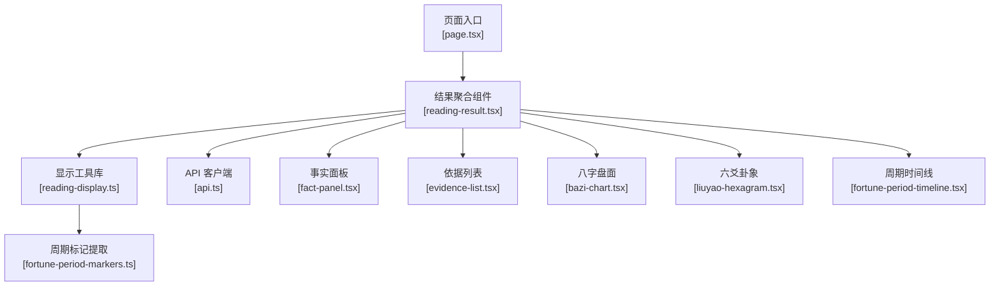
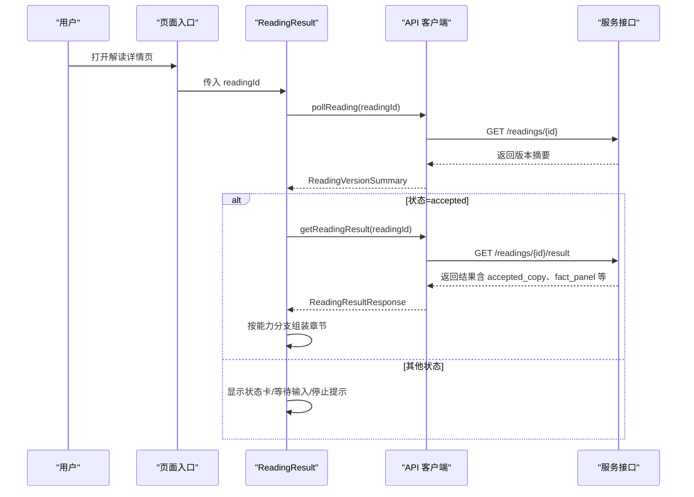
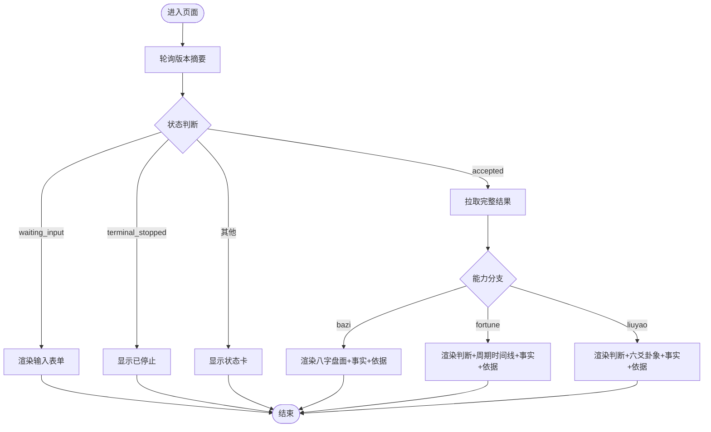
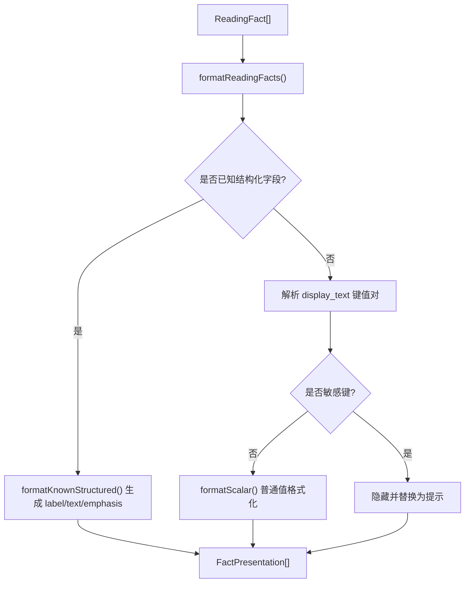
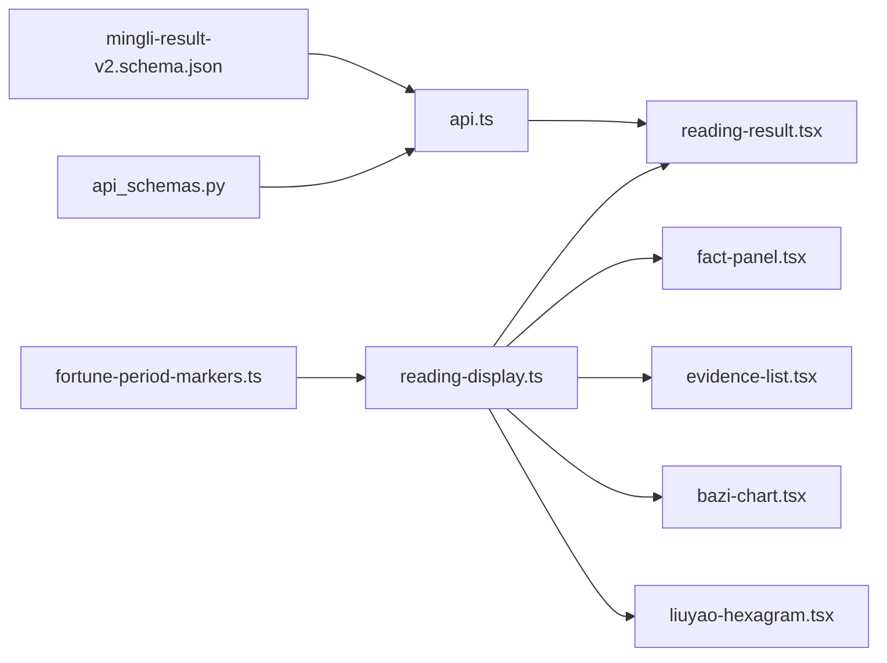

# 解读结果展示

<cite>
**本文引用的文件**
- [web/src/components/readings/reading-result.tsx](file://web/src/components/readings/reading-result.tsx)
- [web/src/lib/reading-display.ts](file://web/src/lib/reading-display.ts)
- [web/src/lib/api.ts](file://web/src/lib/api.ts)
- [web/src/app/app/readings/[readingId]/page.tsx](file://web/src/app/app/readings/[readingId]/page.tsx)
- [web/src/components/readings/fact-panel.tsx](file://web/src/components/readings/fact-panel.tsx)
- [web/src/components/readings/evidence-list.tsx](file://web/src/components/readings/evidence-list.tsx)
- [web/src/components/readings/bazi-chart.tsx](file://web/src/components/readings/bazi-chart.tsx)
- [web/src/components/readings/liuyao-hexagram.tsx](file://web/src/components/readings/liuyao-hexagram.tsx)
- [web/src/components/readings/fortune-period-timeline.tsx](file://web/src/components/readings/fortune-period-timeline.tsx)
- [web/src/lib/fortune-period-markers.ts](file://web/src/lib/fortune-period-markers.ts)
- [contracts/schemas/mingli-result-v2.schema.json](file://contracts/schemas/mingli-result-v2.schema.json)
- [backend/app/readings/api_schemas.py](file://backend/app/readings/api_schemas.py)
</cite>

## 目录
1. [简介](#简介)
2. [项目结构](#项目结构)
3. [核心组件](#核心组件)
4. [架构总览](#架构总览)
5. [详细组件分析](#详细组件分析)
6. [依赖关系分析](#依赖关系分析)
7. [性能与可访问性](#性能与可访问性)
8. [故障排查指南](#故障排查指南)
9. [结论](#结论)
10. [附录：扩展点与自定义模板](#附录：扩展点与自定义模板)

## 简介
本文件面向“解读结果展示”的前端实现，系统性说明多类型解读（八字、日运/周运、六爻）的统一视图组织、内容分区策略、重点信息突出方式，以及结果数据的结构化处理、富文本渲染与安全过滤。同时覆盖复杂布局的响应式表现、滚动优化、无障碍访问支持，并给出加载状态管理、错误恢复机制、不同类型解读的适配策略与可扩展的模板与扩展点说明。

## 项目结构
- 页面入口：[web/src/app/app/readings/[readingId]/page.tsx](file://web/src/app/app/readings/[readingId]/page.tsx) 负责路由参数读取与容器挂载。
- 结果聚合与调度：[web/src/components/readings/reading-result.tsx](file://web/src/components/readings/reading-result.tsx) 统一处理轮询、状态分支、能力识别与章节拼装。
- 数据格式化与视图构建：[web/src/lib/reading-display.ts](file://web/src/lib/reading-display.ts) 提供事实格式化、标题拆分、图表视图构建等。
- API 客户端与安全投影：[web/src/lib/api.ts](file://web/src/lib/api.ts) 封装请求、CSRF、幂等键、安全投影与类型定义。
- 子组件：事实面板、依据列表、八字盘面、六爻卦象、周期时间线等分别位于 web/src/components/readings 下。
- 契约与后端模型：contracts/schemas 与 backend 侧定义了结果结构与状态机。

**图示来源**
- [web/src/app/app/readings/[readingId]/page.tsx:10-34](file://web/src/app/app/readings/[readingId]/page.tsx#L10-L34)
- [web/src/components/readings/reading-result.tsx:172-577](file://web/src/components/readings/reading-result.tsx#L172-L577)
- [web/src/lib/reading-display.ts:119-691](file://web/src/lib/reading-display.ts#L119-L691)
- [web/src/lib/api.ts:468-488](file://web/src/lib/api.ts#L468-L488)

**章节来源**
- [web/src/app/app/readings/[readingId]/page.tsx:10-34](file://web/src/app/app/readings/[readingId]/page.tsx#L10-L34)
- [web/src/components/readings/reading-result.tsx:172-577](file://web/src/components/readings/reading-result.tsx#L172-L577)

## 核心组件
- 结果聚合组件 ReadingResult：统一轮询、状态映射、能力识别（bazi/fortune/liuyao）、章节拼装、错误与重试、输入补充流程。
- 事实面板 FactPanel：将服务端公开事实按“确定性事实/口径与补充事实”分组呈现，支持四柱卡片化展示。
- 依据列表 EvidenceList：将证据与已格式化的事实进行引用关联，展示来源、定位与摘要。
- 八字盘面 BaziChart：基于 reading-display 构建的八字视图，仅展示服务端公开事实，不本地排盘。
- 六爻卦象 LiuyaoHexagram：从公开事实中解析本卦、变卦、动爻、世应等，严格遵循“不复算”原则。
- 周期时间线 FortunePeriodTimeline：抽取并展示周期标记，缺字段时省略，不补算。
- 显示工具库 reading-display：负责日期/时间格式化、能力/对象/维度标签映射、事实结构化呈现、标题拆分、八字视图构建。
- API 客户端 api.ts：封装请求、CSRF、幂等键、安全投影（移除私有 input 引用），并提供类型定义。

**章节来源**
- [web/src/components/readings/reading-result.tsx:172-577](file://web/src/components/readings/reading-result.tsx#L172-L577)
- [web/src/components/readings/fact-panel.tsx:12-126](file://web/src/components/readings/fact-panel.tsx#L12-L126)
- [web/src/components/readings/evidence-list.tsx:6-53](file://web/src/components/readings/evidence-list.tsx#L6-L53)
- [web/src/components/readings/bazi-chart.tsx:129-203](file://web/src/components/readings/bazi-chart.tsx#L129-L203)
- [web/src/components/readings/liuyao-hexagram.tsx:238-337](file://web/src/components/readings/liuyao-hexagram.tsx#L238-L337)
- [web/src/components/readings/fortune-period-timeline.tsx:6-50](file://web/src/components/readings/fortune-period-timeline.tsx#L6-L50)
- [web/src/lib/reading-display.ts:119-691](file://web/src/lib/reading-display.ts#L119-L691)
- [web/src/lib/api.ts:176-216](file://web/src/lib/api.ts#L176-L216)

## 架构总览
结果展示采用“状态驱动 + 能力分支”的聚合模式：
- 通过轮询获取版本摘要，根据 status 决定 UI 分支（等待输入、停止、处理中、已交付）。
- 当状态为已交付时，拉取完整结果，并按 capability_id 选择不同渲染路径（八字/六爻/运势）。
- 所有事实与正文均来自服务端公开摘要；浏览器不进行本地排盘或计算。

**图示来源**
- [web/src/components/readings/reading-result.tsx:180-233](file://web/src/components/readings/reading-result.tsx#L180-L233)
- [web/src/lib/api.ts:468-488](file://web/src/lib/api.ts#L468-L488)

**章节来源**
- [web/src/components/readings/reading-result.tsx:180-233](file://web/src/components/readings/reading-result.tsx#L180-L233)
- [web/src/lib/api.ts:468-488](file://web/src/lib/api.ts#L468-L488)

## 详细组件分析

### 结果聚合与状态流转（ReadingResult）
- 轮询与清理：使用 useEffect 启动定时器轮询，组件卸载时清理定时器与标志位，避免内存泄漏。
- 状态映射：将后端状态映射为用户可读的标签与文案，区分处理中、成功、错误三类语气。
- 能力识别：根据 capability_id 判断是否为八字、运势或六爻，动态插入对应区块（八字盘面、六爻卦象、周期时间线）。
- 内容分区：统一分为“判断/正文”、“盘面证据/事实”、“依据与边界”、“复核与追问”，并通过序号与 aria-labelledby 增强可访问性。
- 输入与停止：waiting_input 时渲染 NeedInputForm；terminal_stopped 时提供重新发起链接。
- 错误与重试：捕获异常并展示错误卡片，提供重试按钮重置状态。

**图示来源**
- [web/src/components/readings/reading-result.tsx:43-102](file://web/src/components/readings/reading-result.tsx#L43-L102)
- [web/src/components/readings/reading-result.tsx:180-233](file://web/src/components/readings/reading-result.tsx#L180-L233)
- [web/src/components/readings/reading-result.tsx:285-513](file://web/src/components/readings/reading-result.tsx#L285-L513)
- [web/src/components/readings/reading-result.tsx:515-577](file://web/src/components/readings/reading-result.tsx#L515-L577)

**章节来源**
- [web/src/components/readings/reading-result.tsx:43-102](file://web/src/components/readings/reading-result.tsx#L43-L102)
- [web/src/components/readings/reading-result.tsx:180-233](file://web/src/components/readings/reading-result.tsx#L180-L233)
- [web/src/components/readings/reading-result.tsx:285-513](file://web/src/components/readings/reading-result.tsx#L285-L513)
- [web/src/components/readings/reading-result.tsx:515-577](file://web/src/components/readings/reading-result.tsx#L515-L577)

### 事实与富文本的结构化处理（reading-display）
- 事实格式化：优先使用 display_text，若包含“键:值”则尝试解析为结构化数据；对敏感键（如 token、prompt 等）直接隐藏。
- 结构化字段：针对四柱、日主、月令、目标周期、周期标记等已知字段进行专门格式化，输出 emphasis 区分主次。
- 标题拆分：将 accepted_copy 拆分为 headline 与 body，便于头部强调与正文展开。
- 八字视图构建：从事实中提取关键项（四柱、日主、月令、当前大运、出生时间、性别、地点、时间口径、子时策略、时区、目标日期/周期、历法口径），并分离高亮与次要项。
- 日期/时间：统一使用 Intl.DateTimeFormat 进行本地化格式化，兼容 ISO 日期与日期时间字符串。

**图示来源**
- [web/src/lib/reading-display.ts:467-577](file://web/src/lib/reading-display.ts#L467-L577)
- [web/src/lib/reading-display.ts:329-444](file://web/src/lib/reading-display.ts#L329-L444)
- [web/src/lib/reading-display.ts:659-691](file://web/src/lib/reading-display.ts#L659-L691)

**章节来源**
- [web/src/lib/reading-display.ts:467-577](file://web/src/lib/reading-display.ts#L467-L577)
- [web/src/lib/reading-display.ts:329-444](file://web/src/lib/reading-display.ts#L329-L444)
- [web/src/lib/reading-display.ts:659-691](file://web/src/lib/reading-display.ts#L659-L691)

### 事实面板与依据（FactPanel、EvidenceList）
- 事实面板：将事实分为主事实（卡片）与次事实（折叠详情），四柱以年/月/日/时卡片化呈现；展示问题、上一版正文与解读范围。
- 依据列表：将证据与事实进行 ref 关联，展示来源标题、定位、摘要与支持的事实文本；无证据时给出空态提示。

**章节来源**
- [web/src/components/readings/fact-panel.tsx:12-126](file://web/src/components/readings/fact-panel.tsx#L12-L126)
- [web/src/components/readings/evidence-list.tsx:6-53](file://web/src/components/readings/evidence-list.tsx#L6-L53)

### 八字盘面（BaziChart）
- 数据来源：仅使用 reading-display 构建的 BaziChartView，不包含本地排盘逻辑。
- 交互：四柱网格支持键盘导航（方向键、Home/End），选中后在右侧/下方展示聚焦详情。
- 可见性：非 natal 层仅展示摘要说明，不渲染不可用结构。

**章节来源**
- [web/src/components/readings/bazi-chart.tsx:129-203](file://web/src/components/readings/bazi-chart.tsx#L129-L203)
- [web/src/lib/reading-display.ts:604-657](file://web/src/lib/reading-display.ts#L604-L657)

### 六爻卦象（LiuyaoHexagram）
- 解析规则：从 facts 中查找本卦、变卦、动爻、世应、六爻等公开字段，严格遵循“不复算”原则；缺失字段时降级为未公开提示。
- 展示：自上而下排列六爻，标注阴阳、状态、动/静、世/应、变爻及变化详情；关联证据数量与跳转。

**章节来源**
- [web/src/components/readings/liuyao-hexagram.tsx:167-220](file://web/src/components/readings/liuyao-hexagram.tsx#L167-L220)
- [web/src/components/readings/liuyao-hexagram.tsx:238-337](file://web/src/components/readings/liuyao-hexagram.tsx#L238-L337)

### 周期时间线（FortunePeriodTimeline）
- 提取：从 public facts 中识别 period_markers/周期确定性标记，仅展示服务端提供的 date/day_pillar/day_role/active_luck_cycle。
- 展示：按顺序列出，缺字段时省略；不提供本地推导。

**章节来源**
- [web/src/lib/fortune-period-markers.ts:31-78](file://web/src/lib/fortune-period-markers.ts#L31-L78)
- [web/src/components/readings/fortune-period-timeline.tsx:6-50](file://web/src/components/readings/fortune-period-timeline.tsx#L6-L50)

## 依赖关系分析
- 组件耦合：ReadingResult 作为编排者，依赖 reading-display 进行数据转换，依赖各子组件进行局部渲染。
- 数据流：API 返回原始结果 -> 安全投影（移除私有 input 引用）-> 格式化 -> 子组件渲染。
- 外部契约：后端状态与结果结构由 contracts/schemas 与 backend 模型约束，前端类型与之对齐。

**图示来源**
- [web/src/lib/api.ts:176-216](file://web/src/lib/api.ts#L176-L216)
- [web/src/lib/reading-display.ts:119-691](file://web/src/lib/reading-display.ts#L119-L691)
- [contracts/schemas/mingli-result-v2.schema.json:1-392](file://contracts/schemas/mingli-result-v2.schema.json#L1-L392)
- [backend/app/readings/api_schemas.py:84-130](file://backend/app/readings/api_schemas.py#L84-L130)

**章节来源**
- [web/src/lib/api.ts:176-216](file://web/src/lib/api.ts#L176-L216)
- [web/src/lib/reading-display.ts:119-691](file://web/src/lib/reading-display.ts#L119-L691)
- [contracts/schemas/mingli-result-v2.schema.json:1-392](file://contracts/schemas/mingli-result-v2.schema.json#L1-L392)
- [backend/app/readings/api_schemas.py:84-130](file://backend/app/readings/api_schemas.py#L84-L130)

## 性能与可访问性
- 轮询与节流：默认 2 秒轮询，状态为 terminal_stopped/waiting_input/runtime_unknown 时不再继续轮询，减少无效请求。
- 渲染优化：使用 useMemo 构建工作区视图与焦点详情，避免重复计算；仅在必要时渲染特定区块（如周期时间线、六爻卦象）。
- 滚动与布局：CSS 使用 clamp 与变量控制间距与动画，配合媒体查询降低动效；长内容通过分区与折叠提升可读性。
- 无障碍：
  - 语义化标题与 aria-labelledby 绑定章节。
  - 四柱网格支持 roving tabindex 与键盘导航。
  - 状态卡使用 role="status"，错误区域使用 role="alert"。
  - 图标与装饰元素使用 aria-hidden 避免噪音。
- 安全过滤：
  - 敏感键（token/prompt/raw_prompt/model_draft 等）在显示前被识别并隐藏。
  - 客户端安全投影移除私有 input 引用，防止泄露原始输入。

**章节来源**
- [web/src/components/readings/reading-result.tsx:180-233](file://web/src/components/readings/reading-result.tsx#L180-L233)
- [web/src/components/readings/bazi-chart.tsx:39-104](file://web/src/components/readings/bazi-chart.tsx#L39-L104)
- [web/src/lib/reading-display.ts:87-92](file://web/src/lib/reading-display.ts#L87-L92)
- [web/src/lib/api.ts:176-216](file://web/src/lib/api.ts#L176-L216)

## 故障排查指南
- 轮询失败或网络异常：
  - 现象：显示错误卡片，提示“读取结果失败，请稍后重试”。
  - 处理：点击重试按钮重置状态并重新轮询；检查 CSRF Token 与网络连通性。
- 状态未知或延迟：
  - 现象：runtime_unknown/delayed 时显示相应状态卡，提供“重新检查状态”按钮。
  - 处理：触发重试；确认服务端负载与队列状态。
- 需要补充输入：
  - 现象：waiting_input 时渲染 NeedInputForm。
  - 处理：填写并提交后，重置状态并继续轮询。
- 解读已停止：
  - 现象：terminal_stopped 时显示停止提示与“重新发起”链接。
  - 处理：返回主页重新发起解读。
- 事实为空或无法解析：
  - 现象：事实面板或卦象显示“暂无可用公开摘要/未公开”。
  - 处理：检查服务端返回的 facts/evidence 是否包含必要字段；确认 reading-display 的键匹配规则。

**章节来源**
- [web/src/components/readings/reading-result.tsx:251-266](file://web/src/components/readings/reading-result.tsx#L251-L266)
- [web/src/components/readings/reading-result.tsx:515-577](file://web/src/components/readings/reading-result.tsx#L515-L577)
- [web/src/components/readings/fact-panel.tsx:12-126](file://web/src/components/readings/fact-panel.tsx#L12-L126)
- [web/src/components/readings/liuyao-hexagram.tsx:272-280](file://web/src/components/readings/liuyao-hexagram.tsx#L272-L280)

## 结论
该结果展示组件以“状态驱动 + 能力分支”为核心，结合严格的安全过滤与结构化格式化，实现了多类型解读的统一视图与高质量的可读性。通过清晰的分区、重点突出、无障碍支持与响应式布局，兼顾了用户体验与安全性。未来可通过扩展点进一步定制模板与渲染策略。

## 附录：扩展点与自定义模板
- 能力分支扩展：
  - 在 ReadingResult 中根据 capability_id 新增分支，插入新的可视化区块（例如新增能力时复制 fortune/liuyao 分支模式）。
  - 参考路径：[web/src/components/readings/reading-result.tsx:285-513](file://web/src/components/readings/reading-result.tsx#L285-L513)
- 事实格式化扩展：
  - 在 reading-display 中新增 known structured 字段映射与格式化函数，并在 formatKnownStructured 中注册。
  - 参考路径：[web/src/lib/reading-display.ts:329-444](file://web/src/lib/reading-display.ts#L329-L444)
- 标题与正文拆分：
  - 调整 splitAcceptedCopy 的分段与标题提取策略，适配不同语言风格。
  - 参考路径：[web/src/lib/reading-display.ts:659-691](file://web/src/lib/reading-display.ts#L659-L691)
- 安全过滤扩展：
  - 在 sensitive key 正则中添加新敏感字段，或在 projectClientSafeFactPanel 中增加过滤规则。
  - 参考路径：[web/src/lib/reading-display.ts:87-92](file://web/src/lib/reading-display.ts#L87-L92)、[web/src/lib/api.ts:176-216](file://web/src/lib/api.ts#L176-L216)
- 子组件模板：
  - 事实面板、依据列表、八字盘面、六爻卦象、周期时间线均可独立定制样式与交互，保持“不复算”的数据契约。
  - 参考路径：
    - [web/src/components/readings/fact-panel.tsx:12-126](file://web/src/components/readings/fact-panel.tsx#L12-L126)
    - [web/src/components/readings/evidence-list.tsx:6-53](file://web/src/components/readings/evidence-list.tsx#L6-L53)
    - [web/src/components/readings/bazi-chart.tsx:129-203](file://web/src/components/readings/bazi-chart.tsx#L129-L203)
    - [web/src/components/readings/liuyao-hexagram.tsx:238-337](file://web/src/components/readings/liuyao-hexagram.tsx#L238-L337)
    - [web/src/components/readings/fortune-period-timeline.tsx:6-50](file://web/src/components/readings/fortune-period-timeline.tsx#L6-L50)