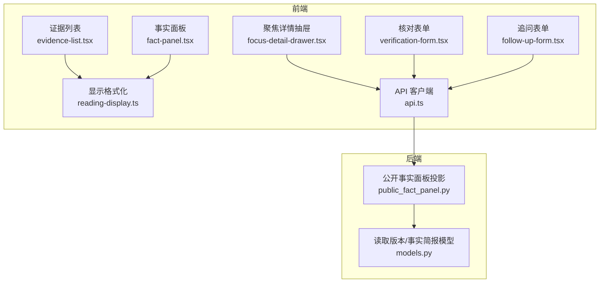
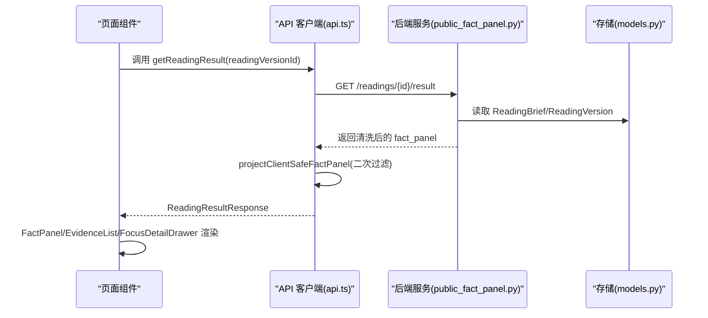
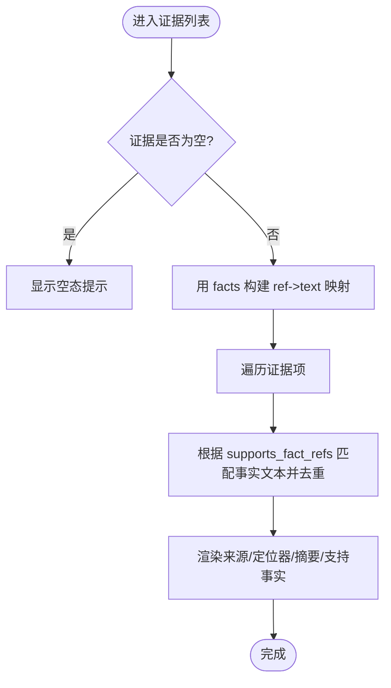
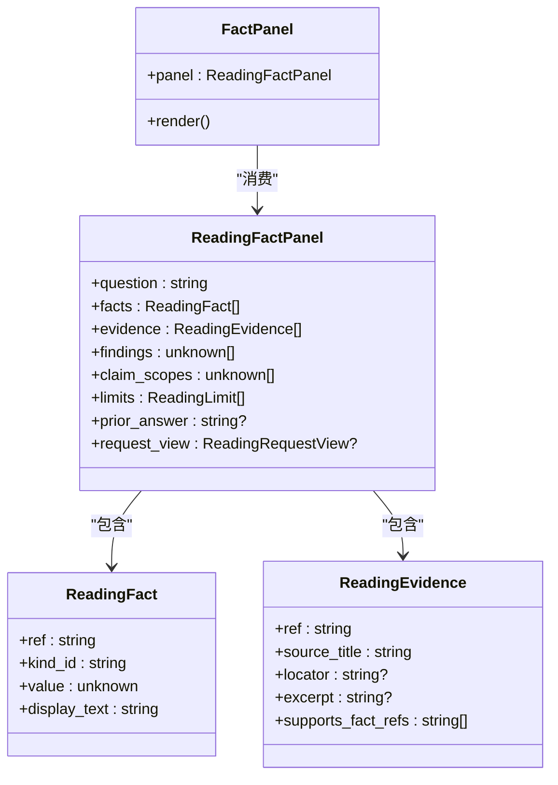
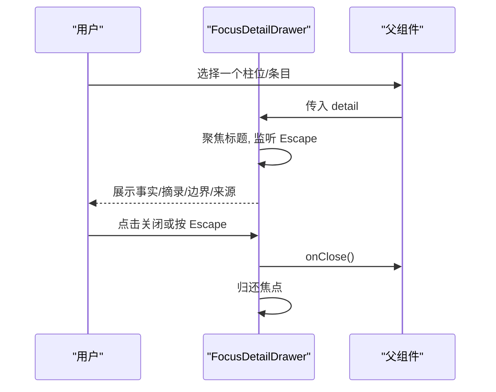
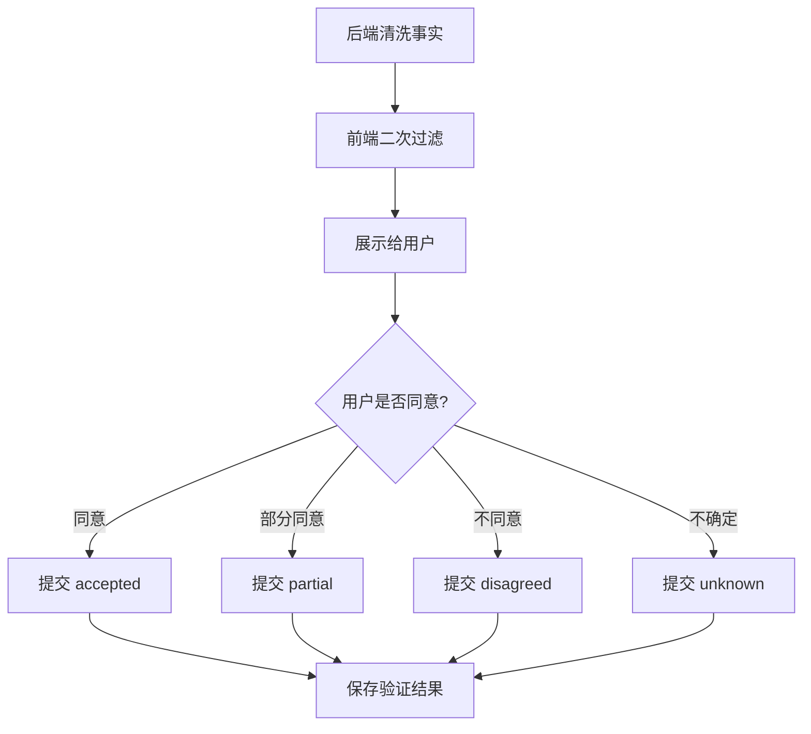
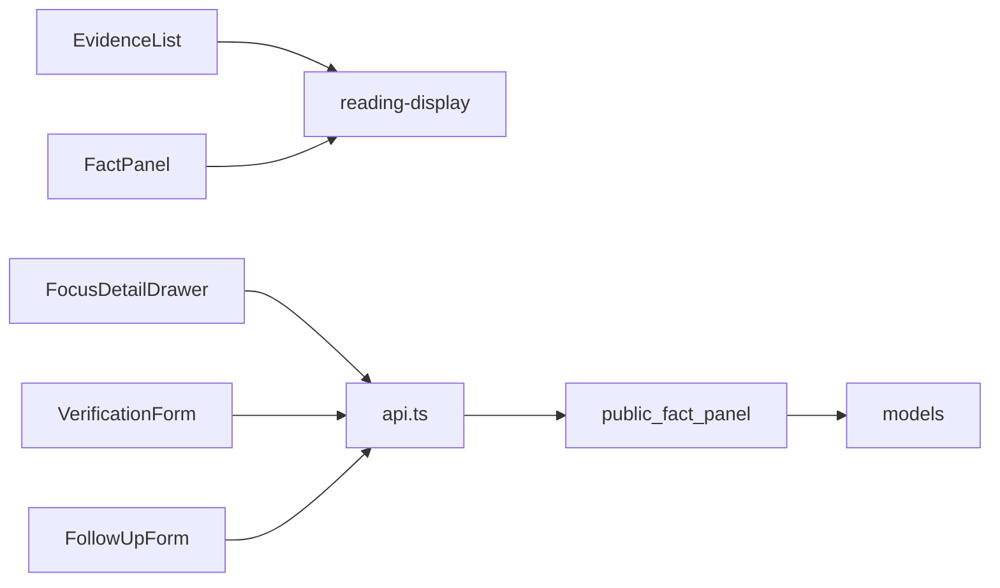

# 证据与事实面板

<cite>
**本文引用的文件**
- [evidence-list.tsx](file://web/src/components/readings/evidence-list.tsx)
- [fact-panel.tsx](file://web/src/components/readings/fact-panel.tsx)
- [focus-detail-drawer.tsx](file://web/src/components/readings/focus-detail-drawer.tsx)
- [reading-display.ts](file://web/src/lib/reading-display.ts)
- [api.ts](file://web/src/lib/api.ts)
- [public_fact_panel.py](file://backend/app/readings/public_fact_panel.py)
- [models.py](file://backend/app/readings/models.py)
- [verification-form.tsx](file://web/src/components/readings/verification-form.tsx)
- [follow-up-form.tsx](file://web/src/components/readings/follow-up-form.tsx)
</cite>

## 目录
1. [简介](#简介)
2. [项目结构](#项目结构)
3. [核心组件](#核心组件)
4. [架构总览](#架构总览)
5. [详细组件分析](#详细组件分析)
6. [依赖关系分析](#依赖关系分析)
7. [性能考虑](#性能考虑)
8. [故障排查指南](#故障排查指南)
9. [结论](#结论)
10. [附录](#附录)

## 简介
本文件面向“证据与事实面板”这一组前端展示与交互能力，覆盖以下目标：
- 证据列表的展示逻辑、分类筛选与搜索过滤
- 事实面板的信息组织、可信度评估与验证状态
- 详情抽屉的交互设计、动态加载与可访问性
- 复杂列表的性能优化策略（含虚拟滚动建议）
- 自定义配置、数据源接入与导出能力的扩展点

该能力由后端安全投影与前端渲染共同实现：后端负责从内部结果中剔除敏感信息并生成公开的事实简报；前端负责将结构化事实转换为可读中文，并以证据、事实、详情抽屉等组件呈现。

## 项目结构
围绕证据与事实面板的相关代码主要分布在以下位置：
- 前端组件
  - 证据列表：web/src/components/readings/evidence-list.tsx
  - 事实面板：web/src/components/readings/fact-panel.tsx
  - 聚焦详情抽屉：web/src/components/readings/focus-detail-drawer.tsx
  - 用户反馈：web/src/components/readings/verification-form.tsx、follow-up-form.tsx
- 前端工具与类型
  - 显示格式化：web/src/lib/reading-display.ts
  - API 客户端与类型定义：web/src/lib/api.ts
- 后端服务
  - 公开事实面板投影：backend/app/readings/public_fact_panel.py
  - 读取版本与事实简报模型：backend/app/readings/models.py

**图表来源**
- [evidence-list.tsx:6-52](file://web/src/components/readings/evidence-list.tsx#L6-L52)
- [fact-panel.tsx:12-126](file://web/src/components/readings/fact-panel.tsx#L12-L126)
- [focus-detail-drawer.tsx:14-139](file://web/src/components/readings/focus-detail-drawer.tsx#L14-L139)
- [reading-display.ts:119-577](file://web/src/lib/reading-display.ts#L119-L577)
- [api.ts:476-513](file://web/src/lib/api.ts#L476-L513)
- [public_fact_panel.py:80-149](file://backend/app/readings/public_fact_panel.py#L80-L149)
- [models.py:84-185](file://backend/app/readings/models.py#L84-L185)

**章节来源**
- [evidence-list.tsx:6-52](file://web/src/components/readings/evidence-list.tsx#L6-L52)
- [fact-panel.tsx:12-126](file://web/src/components/readings/fact-panel.tsx#L12-L126)
- [focus-detail-drawer.tsx:14-139](file://web/src/components/readings/focus-detail-drawer.tsx#L14-L139)
- [reading-display.ts:119-577](file://web/src/lib/reading-display.ts#L119-L577)
- [api.ts:476-513](file://web/src/lib/api.ts#L476-L513)
- [public_fact_panel.py:80-149](file://backend/app/readings/public_fact_panel.py#L80-L149)
- [models.py:84-185](file://backend/app/readings/models.py#L84-L185)

## 核心组件
- 证据列表 EvidenceList
  - 输入：证据数组与事实映射
  - 行为：将证据与其支持的事实文本关联，展示来源、定位器、摘要与支持事实
  - 空态：当无证据时提示服务端暂未返回公开依据来源
- 事实面板 FactPanel
  - 输入：ReadingFactPanel（问题、词汇表、事实、证据、发现、声明范围、限制、上一版正文、请求视图）
  - 行为：格式化事实为“确定性事实”，区分主次；折叠展示补充事实；展示解读范围
- 聚焦详情抽屉 FocusDetailDrawer
  - 输入：WorkspaceFocusDetail（标题、事实、正文摘录、边界、来源）
  - 行为：打开时聚焦标题，支持 Escape 关闭并归还焦点；仅展示服务端已公开的聚焦事实
- 用户反馈与追问
  - 核对表单：提交“符合/部分符合/不符合/暂时不知道”及可选说明
  - 追问表单：基于已接纳结论发起新的阅读任务

**章节来源**
- [evidence-list.tsx:6-52](file://web/src/components/readings/evidence-list.tsx#L6-L52)
- [fact-panel.tsx:12-126](file://web/src/components/readings/fact-panel.tsx#L12-L126)
- [focus-detail-drawer.tsx:14-139](file://web/src/components/readings/focus-detail-drawer.tsx#L14-L139)
- [verification-form.tsx:24-129](file://web/src/components/readings/verification-form.tsx#L24-L129)
- [follow-up-form.tsx:12-109](file://web/src/components/readings/follow-up-form.tsx#L12-L109)

## 架构总览
证据与事实面板的数据流遵循“后端安全投影 + 前端格式化渲染”的双层架构：
- 后端 public_fact_panel.project_public_fact_panel 对 ReadingBrief 进行清洗，剔除敏感事实引用，并清理 claim_scopes/findings/evidence 中的相关引用
- 前端 api.getReadingResult 获取结果后，再次在客户端执行 projectClientSafeFactPanel，确保浏览器不持有原始输入引用
- 前端 reading-display 将 ReadingFact 转为可读中文展示，FactPanel/EvidenceList/FocusDetailDrawer 消费这些格式化后的数据

**图表来源**
- [api.ts:476-488](file://web/src/lib/api.ts#L476-L488)
- [public_fact_panel.py:80-149](file://backend/app/readings/public_fact_panel.py#L80-L149)
- [models.py:84-185](file://backend/app/readings/models.py#L84-L185)

## 详细组件分析

### 证据列表 EvidenceList
- 展示逻辑
  - 将证据项按 ref 遍历，使用 facts 构建 Map，通过 supports_fact_refs 匹配对应事实文本
  - 去重后拼接为“支持事实”段落
  - 若证据为空，显示空态文案
- 数据绑定
  - 引用 types：ReadingEvidence、ReadingFact
  - 格式化：formatReadingFact 用于将单个事实转为展示文本
- 可扩展点
  - 分类筛选：可按 source_title、locator、excerpt 字段进行前端过滤
  - 搜索过滤：可对证据文本与“支持事实”文本进行关键词匹配
  - 虚拟滚动：当证据数量较大时，建议使用虚拟滚动容器（如 react-window）包裹 ul/li 列表

**图表来源**
- [evidence-list.tsx:13-47](file://web/src/components/readings/evidence-list.tsx#L13-L47)
- [reading-display.ts:467-577](file://web/src/lib/reading-display.ts#L467-L577)

**章节来源**
- [evidence-list.tsx:6-52](file://web/src/components/readings/evidence-list.tsx#L6-L52)
- [reading-display.ts:467-577](file://web/src/lib/reading-display.ts#L467-L577)

### 事实面板 FactPanel
- 信息组织
  - 问题区块：panel.question
  - 确定性事实：primary 与 secondary 两类，secondary 默认折叠
  - 上一版已接纳正文：prior_answer
  - 解读范围：capability_ids、object_id、dimension_ids、horizon
- 格式化
  - formatReadingFacts 将 ReadingFact[] 转为 FactPresentation[]
  - pillars 年/月/日/时四柱展示
- 可扩展点
  - 自定义标签映射：可在 reading-display 的 fieldLabels/capabilityLabels/dimensionLabels 中添加或调整
  - 导出：可将 panel.facts 与 panel.request_view 序列化为 JSON 供下载

**图表来源**
- [fact-panel.tsx:12-126](file://web/src/components/readings/fact-panel.tsx#L12-L126)
- [api.ts:106-147](file://web/src/lib/api.ts#L106-L147)

**章节来源**
- [fact-panel.tsx:12-126](file://web/src/components/readings/fact-panel.tsx#L12-L126)
- [reading-display.ts:119-143](file://web/src/lib/reading-display.ts#L119-L143)
- [reading-display.ts:573-577](file://web/src/lib/reading-display.ts#L573-L577)
- [api.ts:106-147](file://web/src/lib/api.ts#L106-L147)

### 聚焦详情抽屉 FocusDetailDrawer
- 交互设计
  - 打开时自动聚焦标题，支持 Escape 关闭并归还焦点
  - 仅展示服务端已公开的聚焦事实、正文摘录、边界与来源
- 可访问性
  - aria-labelledby、role、tabIndex 等属性保证屏幕阅读器可用
- 动态加载
  - detail 由父组件提供，通常来自工作区聚焦选择后的懒加载数据

**图表来源**
- [focus-detail-drawer.tsx:28-59](file://web/src/components/readings/focus-detail-drawer.tsx#L28-L59)
- [focus-detail-drawer.tsx:61-139](file://web/src/components/readings/focus-detail-drawer.tsx#L61-L139)

**章节来源**
- [focus-detail-drawer.tsx:14-139](file://web/src/components/readings/focus-detail-drawer.tsx#L14-L139)

### 可信度评估与用户反馈机制
- 可信度评估
  - 后端通过 is_sensitive_public_fact 与 project_public_fact_panel 过滤敏感事实，确保公开事实的安全性与可信度
  - 前端二次过滤 projectClientSafeFactPanel，避免浏览器保留原始输入引用
- 用户反馈
  - 核对表单：提交 outcome（符合/部分符合/不符合/暂时不知道）与 note
  - 追问表单：基于已接纳结论继续追问，不改变原盘面

**图表来源**
- [public_fact_panel.py:54-67](file://backend/app/readings/public_fact_panel.py#L54-L67)
- [public_fact_panel.py:80-149](file://backend/app/readings/public_fact_panel.py#L80-L149)
- [api.ts:196-216](file://web/src/lib/api.ts#L196-L216)
- [verification-form.tsx:42-62](file://web/src/components/readings/verification-form.tsx#L42-L62)

**章节来源**
- [public_fact_panel.py:54-67](file://backend/app/readings/public_fact_panel.py#L54-L67)
- [public_fact_panel.py:80-149](file://backend/app/readings/public_fact_panel.py#L80-L149)
- [api.ts:196-216](file://web/src/lib/api.ts#L196-L216)
- [verification-form.tsx:24-129](file://web/src/components/readings/verification-form.tsx#L24-L129)

### 复杂列表的性能优化与虚拟滚动
- 当前实现
  - 证据列表使用原生 ul/li 渲染，适合中小规模数据
- 建议优化
  - 虚拟滚动：当证据数量较大时，使用 react-window 或类似库对列表进行虚拟化渲染，减少 DOM 节点数量
  - 搜索过滤：在前端维护一份过滤后的证据数组，结合防抖（debounce）提升输入响应速度
  - 缓存映射：facts 到 text 的 Map 已在组件内构建，建议在大数据量场景下提升到父级或全局缓存，避免重复计算
  - 分页加载：如需展示大量证据，可结合后端分页接口分批加载

[本节为通用性能建议，不直接分析具体文件]

### 自定义配置、数据源接入与导出
- 自定义配置
  - 语言与标签：reading-display.ts 中的各类 label 映射可定制，以适配不同业务术语
  - 事实优先级：可通过 emphasis 控制 primary/secondary 展示顺序
- 数据源接入
  - 后端 public_fact_panel.py 作为统一出口，任何新事实需通过 ReadingBrief 进入，并由 is_sensitive_public_fact 判定是否公开
  - 前端 api.ts 的 projectClientSafeFactPanel 确保客户端安全
- 导出功能
  - 可将 ReadingFactPanel 与 ReadingEvidence 序列化为 JSON，或通过 CSV 导出证据列表（source_title、locator、excerpt、支持事实）
  - 建议增加“导出本次事实简报”按钮，便于用户存档

[本节为扩展建议，不直接分析具体文件]

## 依赖关系分析
- 组件依赖
  - EvidenceList 依赖 reading-display.formatReadingFact 与 api 类型
  - FactPanel 依赖 reading-display.formatReadingFacts 与 api 类型
  - FocusDetailDrawer 依赖 WorkspaceFocusDetail 类型（由工作区提供）
- 前后端契约
  - 后端 public_fact_panel 输出安全的 fact_panel
  - 前端 api 二次过滤并消费 ReadingResultResponse

**图表来源**
- [evidence-list.tsx:1-52](file://web/src/components/readings/evidence-list.tsx#L1-L52)
- [fact-panel.tsx:1-126](file://web/src/components/readings/fact-panel.tsx#L1-L126)
- [focus-detail-drawer.tsx:1-139](file://web/src/components/readings/focus-detail-drawer.tsx#L1-L139)
- [api.ts:476-513](file://web/src/lib/api.ts#L476-L513)
- [public_fact_panel.py:80-149](file://backend/app/readings/public_fact_panel.py#L80-L149)
- [models.py:84-185](file://backend/app/readings/models.py#L84-L185)

**章节来源**
- [evidence-list.tsx:1-52](file://web/src/components/readings/evidence-list.tsx#L1-L52)
- [fact-panel.tsx:1-126](file://web/src/components/readings/fact-panel.tsx#L1-L126)
- [focus-detail-drawer.tsx:1-139](file://web/src/components/readings/focus-detail-drawer.tsx#L1-L139)
- [api.ts:476-513](file://web/src/lib/api.ts#L476-L513)
- [public_fact_panel.py:80-149](file://backend/app/readings/public_fact_panel.py#L80-L149)
- [models.py:84-185](file://backend/app/readings/models.py#L84-L185)

## 性能考虑
- 渲染性能
  - 证据列表与事实面板应避免在每次渲染时重建大对象；建议将 Map/过滤结果提升到父组件或使用 useMemo
  - 对于长列表，优先采用虚拟滚动以减少 DOM 压力
- 网络性能
  - 使用幂等键（idempotencyKey）防止重复提交
  - 合理缓存 CSRF Token，减少额外请求
- 内存管理
  - 避免在 React state 中保留原始输入引用；已通过前后端双重过滤保障
- 可访问性
  - 抽屉与表单均具备键盘导航与屏幕阅读器支持

[本节为通用指导，不直接分析具体文件]

## 故障排查指南
- 常见问题
  - 证据为空：检查后端是否返回 evidence 数组，以及 supports_fact_refs 是否与 facts 的 ref 一致
  - 事实未展示：确认 formatReadingFacts 是否过滤了空文本；检查 display_text/value 是否符合预期
  - 抽屉无法关闭：确认 Escape 事件监听是否正确挂载与移除
  - 核对失败：检查 verifyReading 的请求体与错误消息
- 调试建议
  - 在浏览器控制台打印 ReadingFactPanel 与 EvidenceList 的中间数据
  - 在后端日志中查看 is_sensitive_public_fact 的判定路径
  - 使用网络面板检查 API 响应结构与状态码

**章节来源**
- [evidence-list.tsx:13-50](file://web/src/components/readings/evidence-list.tsx#L13-L50)
- [fact-panel.tsx:15-82](file://web/src/components/readings/fact-panel.tsx#L15-L82)
- [focus-detail-drawer.tsx:48-59](file://web/src/components/readings/focus-detail-drawer.tsx#L48-L59)
- [verification-form.tsx:42-62](file://web/src/components/readings/verification-form.tsx#L42-L62)
- [public_fact_panel.py:54-67](file://backend/app/readings/public_fact_panel.py#L54-L67)

## 结论
证据与事实面板通过后端安全投影与前端格式化渲染，实现了可信、可解释且可交互的结果展示。证据列表清晰关联事实，事实面板分层展示关键信息，详情抽屉提供聚焦细节与良好可访问性。用户反馈机制闭环了可信度评估流程。未来可在虚拟滚动、搜索过滤、导出与自定义配置方面进一步增强体验与灵活性。

## 附录
- 类型参考
  - ReadingFact、ReadingEvidence、ReadingFactPanel、ReadingHorizon、VerificationOutcome 等定义位于 api.ts
- 后端模型
  - ReadingVersion、FactBrief 等定义位于 models.py
- 格式化函数
  - formatReadingFact、formatReadingFacts、formatHorizon 等位于 reading-display.ts

[本节为参考索引，不直接分析具体文件]