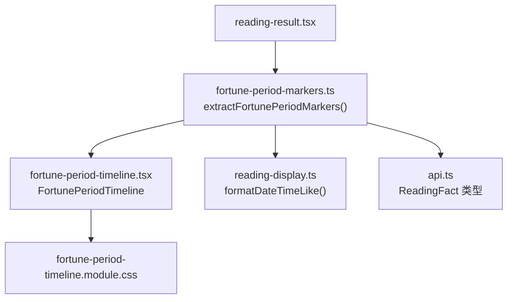
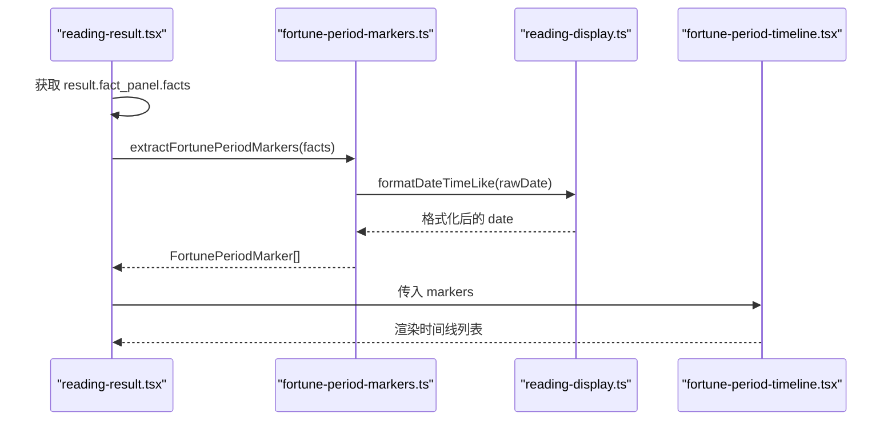
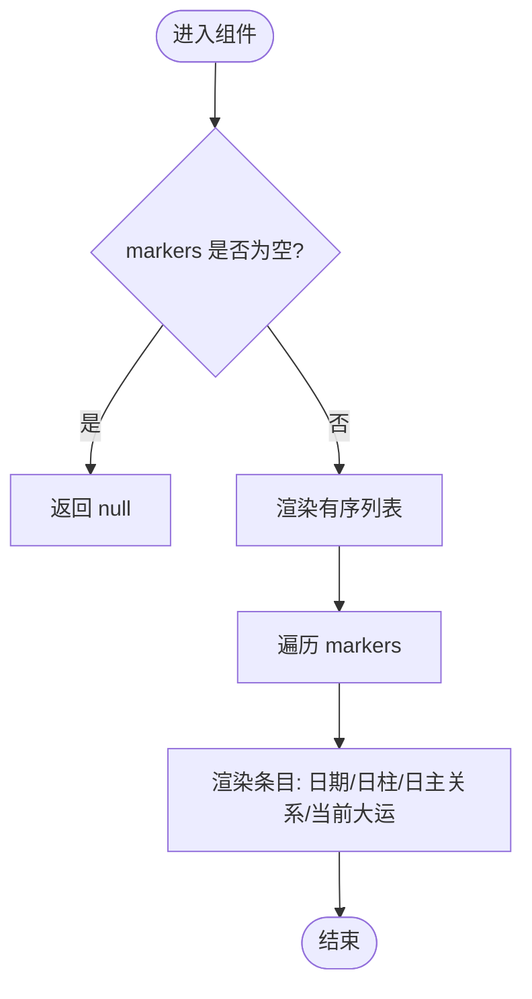
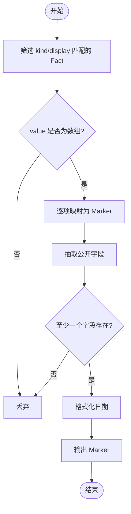
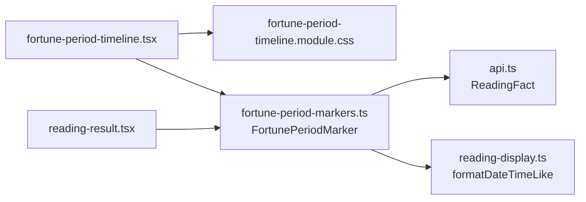

# 运势时间线组件

<cite>
**本文引用的文件**
- [fortune-period-timeline.tsx](file://web/src/components/readings/fortune-period-timeline.tsx)
- [fortune-period-timeline.module.css](file://web/src/components/readings/fortune-period-timeline.module.css)
- [fortune-period-markers.ts](file://web/src/lib/fortune-period-markers.ts)
- [reading-display.ts](file://web/src/lib/reading-display.ts)
- [api.ts](file://web/src/lib/api.ts)
- [reading-result.tsx](file://web/src/components/readings/reading-result.tsx)
</cite>

## 目录
1. [简介](#简介)
2. [项目结构](#项目结构)
3. [核心组件](#核心组件)
4. [架构总览](#架构总览)
5. [详细组件分析](#详细组件分析)
6. [依赖关系分析](#依赖关系分析)
7. [性能与优化](#性能与优化)
8. [故障排查指南](#故障排查指南)
9. [结论](#结论)
10. [附录](#附录)

## 简介
本组件用于在“运势解读”结果页中，按服务端返回顺序展示周期确定性标记（如日、周等短期运势的关键时间点），并呈现每个时间点的公开信息：日期、日柱、日主关系、当前大运。该组件遵循“浏览器不补算、不推导”的原则，仅做数据渲染与基础格式化，确保结果可追溯、可审计。

## 项目结构
围绕运势时间线的代码主要分布在以下位置：
- 组件层：`web/src/components/readings/fortune-period-timeline.tsx` 负责渲染时间线列表项；样式位于 `fortune-period-timeline.module.css`。
- 数据处理层：`web/src/lib/fortune-period-markers.ts` 负责从服务端的 ReadingFact 中提取并规范化为前端可用的标记数组。
- 显示格式化层：`web/src/lib/reading-display.ts` 提供日期/时间字符串的本地化格式化能力。
- 类型定义层：`web/src/lib/api.ts` 定义了 ReadingFact、ReadingHorizon 等核心数据结构。
- 集成层：`web/src/components/readings/reading-result.tsx` 将提取出的 markers 注入到 FortunePeriodTimeline 中，并在非八字类解读结果中展示。

图表来源
- [reading-result.tsx:291-345](file://web/src/components/readings/reading-result.tsx#L291-L345)
- [fortune-period-markers.ts:45-77](file://web/src/lib/fortune-period-markers.ts#L45-L77)
- [fortune-period-timeline.tsx:6-49](file://web/src/components/readings/fortune-period-timeline.tsx#L6-L49)
- [reading-display.ts:145-157](file://web/src/lib/reading-display.ts#L145-L157)
- [api.ts:106-112](file://web/src/lib/api.ts#L106-L112)

章节来源
- [fortune-period-timeline.tsx:6-49](file://web/src/components/readings/fortune-period-timeline.tsx#L6-L49)
- [fortune-period-markers.ts:45-77](file://web/src/lib/fortune-period-markers.ts#L45-L77)
- [reading-display.ts:145-157](file://web/src/lib/reading-display.ts#L145-L157)
- [api.ts:106-112](file://web/src/lib/api.ts#L106-L112)
- [reading-result.tsx:291-345](file://web/src/components/readings/reading-result.tsx#L291-L345)

## 核心组件
- FortunePeriodTimeline：接收已提取的 markers 数组，按顺序渲染时间线条目。若为空则不渲染任何内容。
- extractFortunePeriodMarkers：从 ReadingFact[] 中筛选出“周期确定性标记”，并将每条 value 中的公开字段映射为 FortunePeriodMarker。
- reading-display.formatDateTimeLike：对 ISO 日期或日期时间字符串进行本地化格式化。

关键职责边界
- 组件只负责渲染，不做业务计算。
- 数据过滤与抽取在独立模块完成，便于测试和复用。
- 所有日期格式统一通过格式化函数处理，避免浏览器端自行解析差异。

章节来源
- [fortune-period-timeline.tsx:6-49](file://web/src/components/readings/fortune-period-timeline.tsx#L6-L49)
- [fortune-period-markers.ts:45-77](file://web/src/lib/fortune-period-markers.ts#L45-L77)
- [reading-display.ts:145-157](file://web/src/lib/reading-display.ts#L145-L157)

## 架构总览
下图展示了从读取结果到时间线渲染的数据流与调用关系。

图表来源
- [reading-result.tsx:291-345](file://web/src/components/readings/reading-result.tsx#L291-L345)
- [fortune-period-markers.ts:45-77](file://web/src/lib/fortune-period-markers.ts#L45-L77)
- [reading-display.ts:145-157](file://web/src/lib/reading-display.ts#L145-L157)
- [fortune-period-timeline.tsx:6-49](file://web/src/components/readings/fortune-period-timeline.tsx#L6-L49)

## 详细组件分析

### 组件：FortunePeriodTimeline
- 输入：markers: FortunePeriodMarker[]
- 行为：
  - 空数组时返回 null，不渲染任何节点。
  - 使用有序列表 ol 渲染每个 marker，保持服务端返回顺序。
  - 可选字段：date/rawDate、dayPillar、dayRole、activeLuckCycle，缺失时直接省略对应 DOM。
  - 日期使用 time 元素并附带 dateTime 原始值，利于无障碍与搜索引擎理解。
- 样式：
  - 卡片式条目，带左侧圆点与连接线，形成时间轴视觉。
  - 响应式布局：窄屏时将三列详情改为单列堆叠。
  - 入场动画：条目渐入上移；尊重 prefers-reduced-motion 减少动效。

图表来源
- [fortune-period-timeline.tsx:6-49](file://web/src/components/readings/fortune-period-timeline.tsx#L6-L49)
- [fortune-period-timeline.module.css:15-131](file://web/src/components/readings/fortune-period-timeline.module.css#L15-L131)

章节来源
- [fortune-period-timeline.tsx:6-49](file://web/src/components/readings/fortune-period-timeline.tsx#L6-L49)
- [fortune-period-timeline.module.css:1-132](file://web/src/components/readings/fortune-period-timeline.module.css#L1-L132)

### 数据提取：extractFortunePeriodMarkers
- 识别规则：
  - kind_id 去除前缀后匹配 period_markers 或中文“周期确定性标记”。
  - display_text 以“period_markers”或“周期确定性标记”开头也视为命中。
- 抽取逻辑：
  - 仅接受 value 为数组且每项为对象的情况。
  - 抽取公开字段：date、day_pillar、day_role、active_luck_cycle。
  - 任一字段均存在时才保留该项；否则丢弃。
  - 使用 formatDateTimeLike 将 rawDate 转为可读日期。
- 输出：
  - FortunePeriodMarker[]，包含 key、rawDate、date、dayPillar、dayRole、activeLuckCycle。

图表来源
- [fortune-period-markers.ts:31-77](file://web/src/lib/fortune-period-markers.ts#L31-L77)
- [reading-display.ts:145-157](file://web/src/lib/reading-display.ts#L145-L157)

章节来源
- [fortune-period-markers.ts:31-77](file://web/src/lib/fortune-period-markers.ts#L31-L77)
- [reading-display.ts:145-157](file://web/src/lib/reading-display.ts#L145-L157)

### 显示格式化：formatDateTimeLike
- 支持纯日期与 ISO 日期时间两种格式。
- 使用 Intl.DateTimeFormat 以 zh-CN 本地化输出。
- 无法解析时回退为原始字符串，保证鲁棒性。

章节来源
- [reading-display.ts:145-157](file://web/src/lib/reading-display.ts#L145-L157)

### 集成方式：reading-result.tsx
- 在非八字类解读结果中，从 fact_panel.facts 提取 fortuneMarkers。
- 当 markers 长度大于 0 时，插入“周期标记”区块，标题根据 horizon.kind_id 动态变化（今日/近七日）。
- 将 markers 作为 props 传递给 FortunePeriodTimeline。

章节来源
- [reading-result.tsx:291-345](file://web/src/components/readings/reading-result.tsx#L291-L345)

## 依赖关系分析
- 组件依赖：
  - FortunePeriodTimeline 依赖 CSS Modules 样式与 FortunePeriodMarker 类型。
  - 数据提取模块依赖 api.ts 的 ReadingFact 类型与 reading-display 的日期格式化。
- 耦合度：
  - 组件与数据层解耦：组件仅消费标准化后的 markers，不关心数据来源。
  - 数据层与显示层解耦：格式化函数独立，便于替换或扩展。
- 外部依赖：
  - 无第三方运行时依赖，仅使用浏览器内置 Intl API。

图表来源
- [fortune-period-timeline.tsx:1-49](file://web/src/components/readings/fortune-period-timeline.tsx#L1-L49)
- [fortune-period-markers.ts:1-77](file://web/src/lib/fortune-period-markers.ts#L1-L77)
- [api.ts:106-112](file://web/src/lib/api.ts#L106-L112)
- [reading-display.ts:145-157](file://web/src/lib/reading-display.ts#L145-L157)
- [reading-result.tsx:291-345](file://web/src/components/readings/reading-result.tsx#L291-L345)

章节来源
- [fortune-period-timeline.tsx:1-49](file://web/src/components/readings/fortune-period-timeline.tsx#L1-L49)
- [fortune-period-markers.ts:1-77](file://web/src/lib/fortune-period-markers.ts#L1-L77)
- [api.ts:106-112](file://web/src/lib/api.ts#L106-L112)
- [reading-display.ts:145-157](file://web/src/lib/reading-display.ts#L145-L157)
- [reading-result.tsx:291-345](file://web/src/components/readings/reading-result.tsx#L291-L345)

## 性能与优化
- 渲染复杂度：O(n)，n 为 markers 数量；列表渲染简单，无重排风险。
- 内存占用：仅持有扁平化的 markers 数组，无额外缓存。
- 动画与可访问性：
  - 使用 CSS 动画实现条目渐入，符合 prefers-reduced-motion 时自动禁用。
  - 日期使用 time 元素并提供 dateTime，提升可访问性与语义化。
- 可扩展点：
  - 如需虚拟化长列表，可在上层容器引入虚拟滚动（当前规模下无需）。
  - 如需更复杂交互（缩放/平移/搜索），应在上层容器实现，组件保持纯展示。

[本节为通用指导，不直接分析具体文件]

## 故障排查指南
- 时间线未显示
  - 检查 facts 中是否存在 kind_id 或 display_text 匹配的周期标记事实。
  - 确认 value 为数组且至少包含一个有效对象。
  - 确认至少有一个公开字段存在（date/day_pillar/day_role/active_luck_cycle）。
- 日期显示异常
  - 检查 rawDate 是否为合法 ISO 日期或日期时间字符串。
  - 若无法解析，formatDateTimeLike 会回退为原字符串，需核对后端数据。
- 样式问题
  - 确认 CSS Modules 正确加载。
  - 窄屏下详情区域会切换为单列布局，注意断点与内容换行。
- 无障碍问题
  - 确保 time 元素的 dateTime 属性存在且有效。
  - 页面应尊重 prefers-reduced-motion，避免强制动画。

章节来源
- [fortune-period-markers.ts:31-77](file://web/src/lib/fortune-period-markers.ts#L31-L77)
- [reading-display.ts:145-157](file://web/src/lib/reading-display.ts#L145-L157)
- [fortune-period-timeline.module.css:117-131](file://web/src/components/readings/fortune-period-timeline.module.css#L117-L131)

## 结论
运势时间线组件以“最小可用、最大可追溯”为原则，严格基于服务端返回的公开事实进行渲染，不在浏览器侧进行任何推演或补算。其职责清晰、依赖简洁、易于维护与扩展。对于未来可能增加的交互（缩放、平移、搜索）与可视化增强（吉凶程度编码、事件标记），建议在上层容器或扩展组件中实现，保持本组件的纯展示特性。

[本节为总结性内容，不直接分析具体文件]

## 附录

### 数据模型：FortunePeriodMarker
- key: 唯一标识，由 factIndex 与 markerIndex 组合生成。
- rawDate: 原始日期字符串（可为 null）。
- date: 经本地化格式化后的日期字符串（可为 null）。
- dayPillar: 日柱（可为 null）。
- dayRole: 日主关系（可为 null）。
- activeLuckCycle: 当前大运（可为 null）。

章节来源
- [fortune-period-markers.ts:5-12](file://web/src/lib/fortune-period-markers.ts#L5-L12)

### 数据源：ReadingFact
- ref: 事实引用。
- subject_ref: 主体引用。
- kind_id: 事实类型标识（如 period_markers）。
- value: 事实值（周期标记时为对象数组）。
- display_text: 面向用户的展示文本（可用于辅助识别）。

章节来源
- [api.ts:106-112](file://web/src/lib/api.ts#L106-L112)

### 组件配置与使用示例
- 基本用法
  - 在结果页中，从 fact_panel.facts 提取 markers，并传入 FortunePeriodTimeline。
  - 当 markers 为空时，组件不渲染任何内容。
- 标题与上下文
  - 根据 horizon.kind_id 决定区块标题（今日/近七日/周期标记）。
- 自定义样式
  - 通过 CSS Modules 覆盖 .frame/.timeline/.item/.details 等类名，调整间距、颜色与排版。
  - 响应式：窄屏自动切换为单列布局。

章节来源
- [reading-result.tsx:308-348](file://web/src/components/readings/reading-result.tsx#L308-L348)
- [fortune-period-timeline.module.css:1-132](file://web/src/components/readings/fortune-period-timeline.module.css#L1-L132)

### 事件回调机制
- 当前组件为纯展示组件，未暴露事件回调。
- 若需点击跳转、高亮或联动其他面板，建议在上层容器监听并实现，或将交互逻辑下沉至容器组件，保持本组件稳定。

[本节为通用说明，不直接分析具体文件]

### 不同运势类型的展示示例
- 今日阶段解读：标题为“周期标记”，展示当日关键时间点与公开信息。
- 近七日阶段解读：标题为“近七日周期”，展示连续多日的关键点。
- 其他能力（如八字、六爻）：若存在周期标记事实，同样会以相同组件呈现。

章节来源
- [reading-result.tsx:333-348](file://web/src/components/readings/reading-result.tsx#L333-L348)