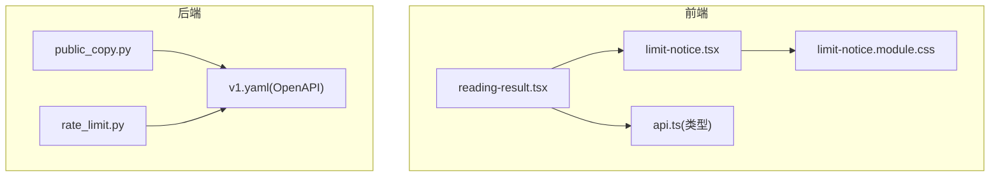
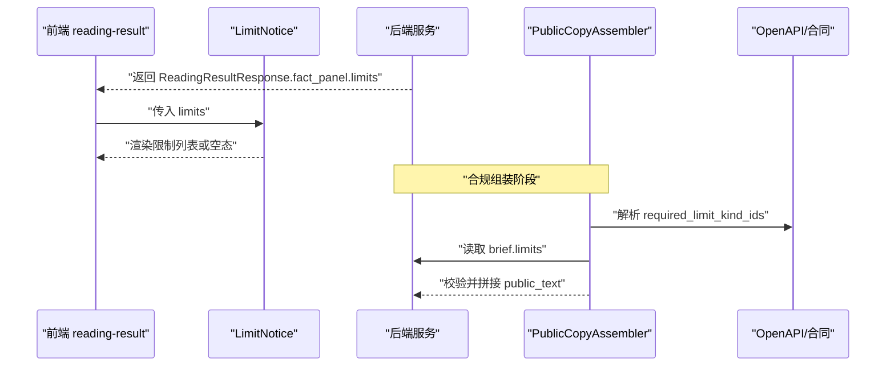
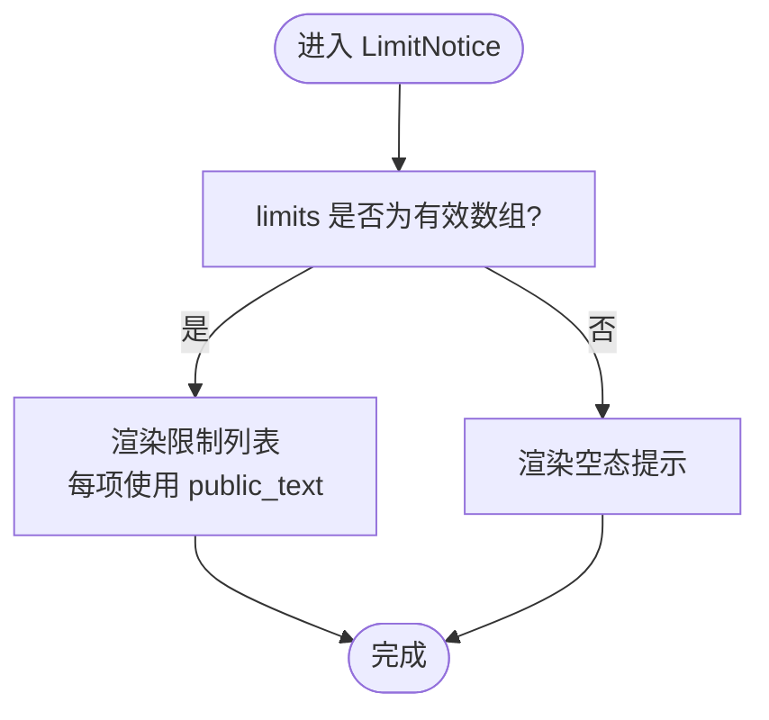
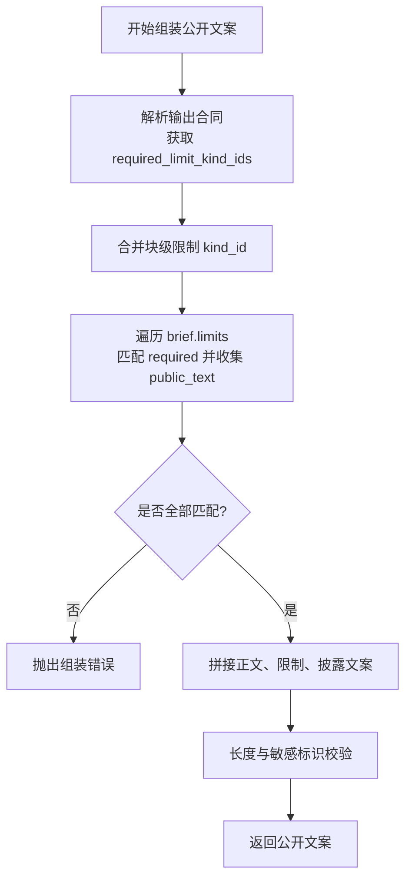
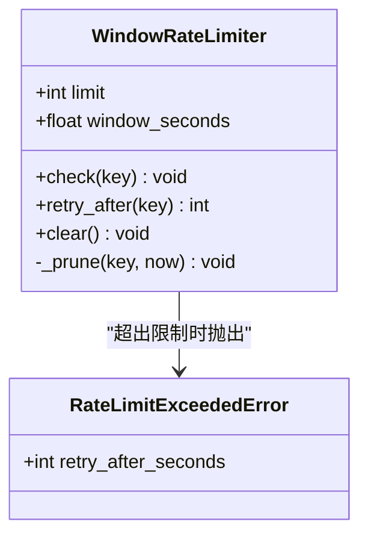
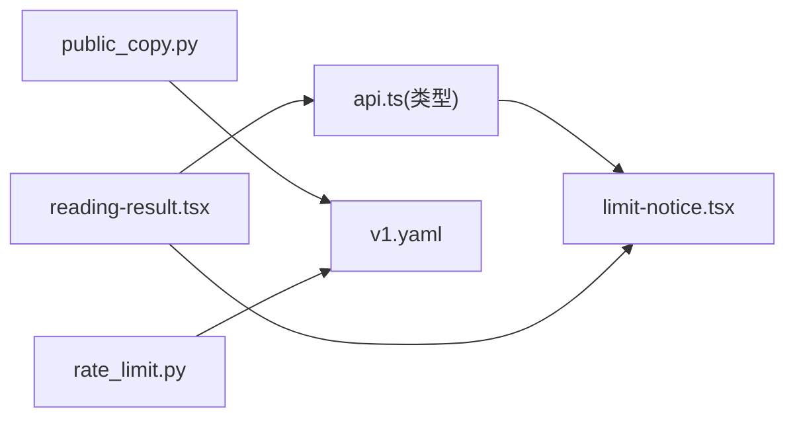

# 限制通知组件

<cite>
**本文引用的文件**
- [limit-notice.tsx](file://web/src/components/readings/limit-notice.tsx)
- [limit-notice.module.css](file://web/src/components/readings/limit-notice.module.css)
- [reading-result.tsx](file://web/src/components/readings/reading-result.tsx)
- [api.ts](file://web/src/lib/api.ts)
- [public_copy.py](file://backend/app/readings/public_copy.py)
- [rate_limit.py](file://backend/app/readings/rate_limit.py)
- [v1.yaml](file://contracts/openapi/v1.yaml)
</cite>

## 目录
1. [简介](#简介)
2. [项目结构](#项目结构)
3. [核心组件](#核心组件)
4. [架构总览](#架构总览)
5. [详细组件分析](#详细组件分析)
6. [依赖关系分析](#依赖关系分析)
7. [性能与可用性考虑](#性能与可用性考虑)
8. [故障排查指南](#故障排查指南)
9. [结论](#结论)
10. [附录](#附录)

## 简介
本文件面向“限制通知组件”的完整说明，覆盖以下目标：
- 使用限制的检测逻辑、通知显示的触发条件与降级策略
- 限流规则的判断、配额计算的准确性与通知文案的本地化
- 通知样式定制、位置定位与自动消失机制（当前实现与扩展建议）
- 限制状态的实时更新、用户引导与功能替代方案推荐
- 通知的扩展接口、自定义规则与监控统计

该组件用于在解读结果页展示“依据与边界”中的限制信息，帮助用户理解能力范围、合规声明与使用约束。

## 项目结构
限制通知相关的前端实现位于 web 子工程，后端负责生成并校验公开文案与限制集合。关键文件如下：
- 前端展示：LimitNotice 组件及其样式
- 数据契约：ReadingLimit、ReadingFactPanel 等类型定义
- 页面集成：reading-result 将 limits 传入 LimitNotice
- 后端组装：PublicCopyAssembler 确保必要限制文案被包含且安全
- 速率限制：WindowRateLimiter 提供进程内滑动窗口限流（与 UI 展示解耦）

图表来源
- [reading-result.tsx:390-490](file://web/src/components/readings/reading-result.tsx#L390-L490)
- [limit-notice.tsx:1-22](file://web/src/components/readings/limit-notice.tsx#L1-L22)
- [limit-notice.module.css:1-30](file://web/src/components/readings/limit-notice.module.css#L1-L30)
- [api.ts:122-147](file://web/src/lib/api.ts#L122-L147)
- [public_copy.py:13-46](file://backend/app/readings/public_copy.py#L13-L46)
- [rate_limit.py:9-61](file://backend/app/readings/rate_limit.py#L9-L61)
- [v1.yaml:1-200](file://contracts/openapi/v1.yaml#L1-L200)

章节来源
- [reading-result.tsx:390-490](file://web/src/components/readings/reading-result.tsx#L390-L490)
- [limit-notice.tsx:1-22](file://web/src/components/readings/limit-notice.tsx#L1-L22)
- [limit-notice.module.css:1-30](file://web/src/components/readings/limit-notice.module.css#L1-L30)
- [api.ts:122-147](file://web/src/lib/api.ts#L122-L147)
- [public_copy.py:13-46](file://backend/app/readings/public_copy.py#L13-L46)
- [rate_limit.py:9-61](file://backend/app/readings/rate_limit.py#L9-L61)
- [v1.yaml:1-200](file://contracts/openapi/v1.yaml#L1-L200)

## 核心组件
- LimitNotice：接收 ReadingLimit[]，渲染为列表；为空时显示空态提示
- reading-result：在“依据与边界”区块中注入 limits，驱动 LimitNotice 渲染
- api.ts：定义 ReadingLimit、ReadingFactPanel 等类型，保障前后端契约一致
- public_copy.py：从输出合同与候选文本中收集必要限制 kind_id，并从 brief.limits 提取对应 public_text，组装最终公开文案
- rate_limit.py：进程内滑动窗口限流器，用于写操作保护（与 UI 展示解耦）

章节来源
- [limit-notice.tsx:1-22](file://web/src/components/readings/limit-notice.tsx#L1-L22)
- [reading-result.tsx:390-490](file://web/src/components/readings/reading-result.tsx#L390-L490)
- [api.ts:122-147](file://web/src/lib/api.ts#L122-L147)
- [public_copy.py:13-46](file://backend/app/readings/public_copy.py#L13-L46)
- [rate_limit.py:9-61](file://backend/app/readings/rate_limit.py#L9-L61)

## 架构总览
限制通知的数据流分为两条主线：
- 展示链路：后端产出 ReadingFactPanel.limits → 前端 reading-result 读取 → LimitNotice 渲染
- 合规链路：后端 PublicCopyAssembler 根据输出合同要求，强制包含必要的限制文案，确保对外交付内容合规

图表来源
- [reading-result.tsx:390-490](file://web/src/components/readings/reading-result.tsx#L390-L490)
- [limit-notice.tsx:1-22](file://web/src/components/readings/limit-notice.tsx#L1-L22)
- [public_copy.py:13-46](file://backend/app/readings/public_copy.py#L13-L46)
- [v1.yaml:1-200](file://contracts/openapi/v1.yaml#L1-L200)

## 详细组件分析

### 前端：LimitNotice 组件
- 输入：limits?: ReadingLimit[] | null
- 行为：
  - 若 limits 为数组且非空，渲染有序列表，每项使用 limit.public_text 作为可见文案
  - 否则渲染“暂无适用边界说明。”的空态提示
- 样式：通过 CSS Modules 控制列表、条目与空态样式

图表来源
- [limit-notice.tsx:5-20](file://web/src/components/readings/limit-notice.tsx#L5-L20)
- [limit-notice.module.css:14-29](file://web/src/components/readings/limit-notice.module.css#L14-L29)

章节来源
- [limit-notice.tsx:1-22](file://web/src/components/readings/limit-notice.tsx#L1-L22)
- [limit-notice.module.css:1-30](file://web/src/components/readings/limit-notice.module.css#L1-L30)

### 页面集成：reading-result
- 在“依据与边界”区块中，同时渲染证据列表与 LimitNotice
- 数据来源：result.fact_panel?.limits ?? null
- 作用：将后端返回的限制集合直接传递给 LimitNotice，保证展示与数据一致

章节来源
- [reading-result.tsx:390-490](file://web/src/components/readings/reading-result.tsx#L390-L490)

### 数据契约：api.ts
- ReadingLimit：包含 kind_id、public_text、scope_refs、detail_ids
- ReadingFactPanel：包含 question、vocabulary、facts、evidence、findings、claim_scopes、limits、prior_answer、request_view
- 作用：统一前后端对限制信息的类型约定，避免运行时类型错误

章节来源
- [api.ts:122-147](file://web/src/lib/api.ts#L122-L147)

### 后端：限制文案的合规组装
- PublicCopyAssembler 会：
  - 解析输出合同要求的必要限制 kind_id
  - 遍历 candidate.blocks 合并所需限制
  - 从 brief.limits 中提取对应 public_text
  - 校验是否全部满足，缺失则抛出异常
  - 将限制文案与披露文案拼接到最终公开复制体中，并进行长度与内部标识检查

图表来源
- [public_copy.py:13-46](file://backend/app/readings/public_copy.py#L13-L46)

章节来源
- [public_copy.py:13-46](file://backend/app/readings/public_copy.py#L13-L46)

### 后端：限流规则与配额计算
- WindowRateLimiter：基于滑动窗口的进程内限流
  - 参数：limit（次数）、window_seconds（窗口时长）
  - check(key)：在窗口内计数，超过限制抛出 RateLimitExceededError，并附带 retry_after_seconds
  - retry_after(key)：计算距离最旧请求离开窗口的剩余秒数
- 用途：保护写操作不被滥用；与 UI 展示解耦，但可通过上层 API 暴露状态供前端提示

图表来源
- [rate_limit.py:9-61](file://backend/app/readings/rate_limit.py#L9-L61)

章节来源
- [rate_limit.py:9-61](file://backend/app/readings/rate_limit.py#L9-L61)

### OpenAPI 契约
- v1.yaml 定义了健康检查、身份认证、资料草稿等接口，并包含 TooManyRequests 响应引用，体现限流在 API 层的契约化表达
- 限制通知本身由业务层在 fact_panel.limits 中传递，不直接映射到单一 OpenAPI 字段

章节来源
- [v1.yaml:1-200](file://contracts/openapi/v1.yaml#L1-L200)

## 依赖关系分析
- 前端依赖：
  - LimitNotice 依赖 api.ts 的类型定义，确保 limits 数据结构正确
  - reading-result 将 limits 透传给 LimitNotice，形成单向数据流
- 后端依赖：
  - PublicCopyAssembler 依赖输出合同与候选文本，确保限制文案完整性
  - WindowRateLimiter 独立于 UI，仅影响写操作拦截与重试时间计算
- 外部契约：
  - OpenAPI 描述 API 行为与错误码，包括限流场景的 429 响应

图表来源
- [api.ts:122-147](file://web/src/lib/api.ts#L122-L147)
- [limit-notice.tsx:1-22](file://web/src/components/readings/limit-notice.tsx#L1-L22)
- [reading-result.tsx:390-490](file://web/src/components/readings/reading-result.tsx#L390-L490)
- [public_copy.py:13-46](file://backend/app/readings/public_copy.py#L13-L46)
- [rate_limit.py:9-61](file://backend/app/readings/rate_limit.py#L9-L61)
- [v1.yaml:1-200](file://contracts/openapi/v1.yaml#L1-L200)

章节来源
- [api.ts:122-147](file://web/src/lib/api.ts#L122-L147)
- [limit-notice.tsx:1-22](file://web/src/components/readings/limit-notice.tsx#L1-L22)
- [reading-result.tsx:390-490](file://web/src/components/readings/reading-result.tsx#L390-L490)
- [public_copy.py:13-46](file://backend/app/readings/public_copy.py#L13-L46)
- [rate_limit.py:9-61](file://backend/app/readings/rate_limit.py#L9-L61)
- [v1.yaml:1-200](file://contracts/openapi/v1.yaml#L1-L200)

## 性能与可用性考虑
- 渲染性能：LimitNotice 仅做简单列表渲染，复杂度 O(n)，n 为限制项数量；key 使用 index 与 public_text 组合，避免重复 key
- 空态体验：当 limits 为空时，提供明确的空态文案，避免空白区域造成困惑
- 可访问性：列表语义清晰，便于屏幕阅读器朗读；可在未来增加 aria-live 区域以支持动态更新
- 可扩展性：样式通过 CSS Modules 隔离，便于主题定制；文案来自后端，利于本地化与合规管控

[本节为通用指导，无需特定文件来源]

## 故障排查指南
- 未显示限制：
  - 检查 reading-result 是否正确传入 result.fact_panel?.limits
  - 确认后端 brief.limits 包含 required_limit_kind_ids 对应的 public_text
- 文案缺失或不全：
  - 查看 PublicCopyAssembler 是否因缺少必要限制而抛出组装错误
  - 核对输出合同中 required_limit_kind_ids 与实际 limits 的匹配情况
- 限流导致失败：
  - 关注 RateLimitExceededError 的 retry_after_seconds，并在上层 API 返回 429 时提示用户稍后重试
  - 结合 OpenAPI 的 TooManyRequests 响应进行统一处理

章节来源
- [reading-result.tsx:390-490](file://web/src/components/readings/reading-result.tsx#L390-L490)
- [public_copy.py:13-46](file://backend/app/readings/public_copy.py#L13-L46)
- [rate_limit.py:9-61](file://backend/app/readings/rate_limit.py#L9-L61)
- [v1.yaml:1-200](file://contracts/openapi/v1.yaml#L1-L200)

## 结论
限制通知组件以最小前端复杂度承载了重要的合规与用户体验职责：
- 通过 reading-result 与 LimitNotice 的组合，将后端 limits 直观呈现给用户
- 后端 PublicCopyAssembler 确保必要限制文案的完整性与安全性
- 限流器 WindowRateLimiter 提供写操作保护，并通过 API 契约反馈给前端
- 当前实现未包含自动消失机制；如需增强，可在 LimitNotice 基础上添加定时器与可关闭交互，并结合 aria-live 提升可访问性

[本节为总结性内容，无需特定文件来源]

## 附录

### 使用限制检测与触发条件
- 检测来源：fact_panel.limits（ReadingLimit[]）
- 触发条件：limits 非空即渲染列表；为空则显示空态提示
- 合规保障：后端强制包含 required_limit_kind_ids 对应的 public_text

章节来源
- [api.ts:122-147](file://web/src/lib/api.ts#L122-L147)
- [reading-result.tsx:390-490](file://web/src/components/readings/reading-result.tsx#L390-L490)
- [public_copy.py:13-46](file://backend/app/readings/public_copy.py#L13-L46)

### 限流规则与配额计算
- 规则：滑动窗口内请求次数不超过 limit
- 配额计算：retry_after 返回最旧请求离开窗口的剩余秒数
- 错误处理：超出限制抛出 RateLimitExceededError，携带 retry_after_seconds

章节来源
- [rate_limit.py:9-61](file://backend/app/readings/rate_limit.py#L9-L61)

### 通知文案本地化
- 文案来源：brief.limits[].public_text
- 本地化策略：由后端根据用户上下文与输出合同生成，前端仅展示
- 合规校验：PublicCopyAssembler 确保所有必需限制文案存在

章节来源
- [public_copy.py:13-46](file://backend/app/readings/public_copy.py#L13-L46)

### 样式定制、位置定位与自动消失
- 样式：通过 limit-notice.module.css 控制列表、条目与空态样式
- 位置：固定在“依据与边界”区块中，跟随阅读流程
- 自动消失：当前未实现；建议后续增加倒计时与关闭按钮，并使用 aria-live 区域播报变化

章节来源
- [limit-notice.module.css:1-30](file://web/src/components/readings/limit-notice.module.css#L1-L30)
- [limit-notice.tsx:1-22](file://web/src/components/readings/limit-notice.tsx#L1-L22)

### 限制状态实时更新、用户引导与替代方案
- 实时更新：当前为静态渲染；可结合轮询或 WebSocket 刷新 fact_panel.limits
- 用户引导：在空态或受限场景下，可增加“如何获取更多能力”的链接或提示
- 替代方案：当某项能力受限时，可在同一区块推荐可用维度或降级路径

[本节为扩展建议，无需特定文件来源]

### 扩展接口、自定义规则与监控统计
- 扩展点：
  - 前端：LimitNotice 可接受更多 props（如 autoDismiss、onAction），以支持交互与埋点
  - 后端：PublicCopyAssembler 可接入更多限制来源与本地化策略
- 自定义规则：
  - 通过输出合同的 required_limit_kind_ids 控制必须包含的限制
  - 通过 WindowRateLimiter 配置不同接口的限流策略
- 监控统计：
  - 记录 limits 展示次数、空态出现比例、用户点击行为
  - 记录限流触发频率与 retry_after 分布，辅助容量规划

[本节为扩展建议，无需特定文件来源]