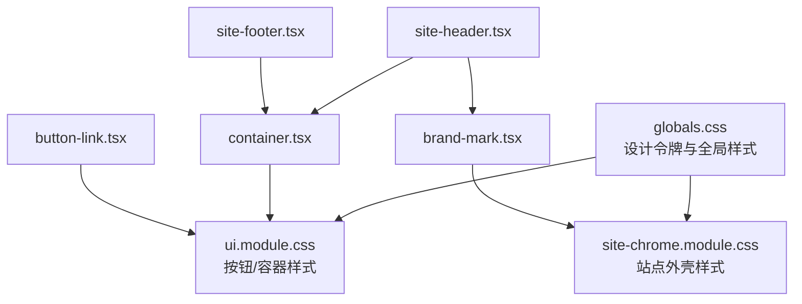
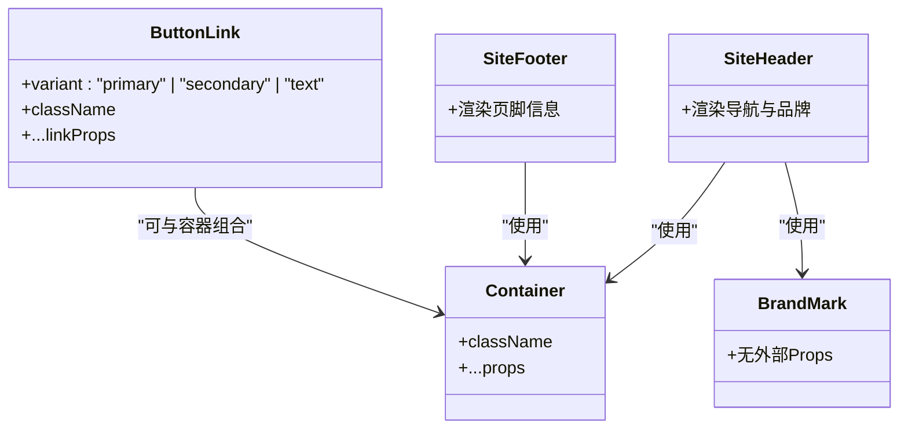
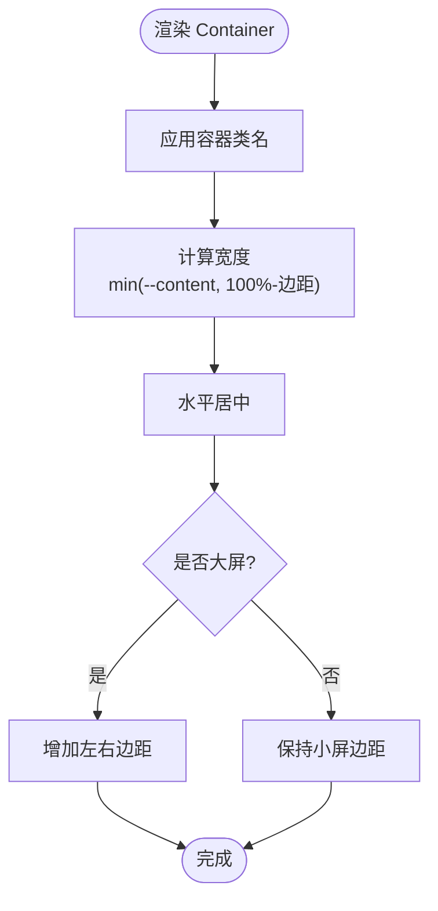
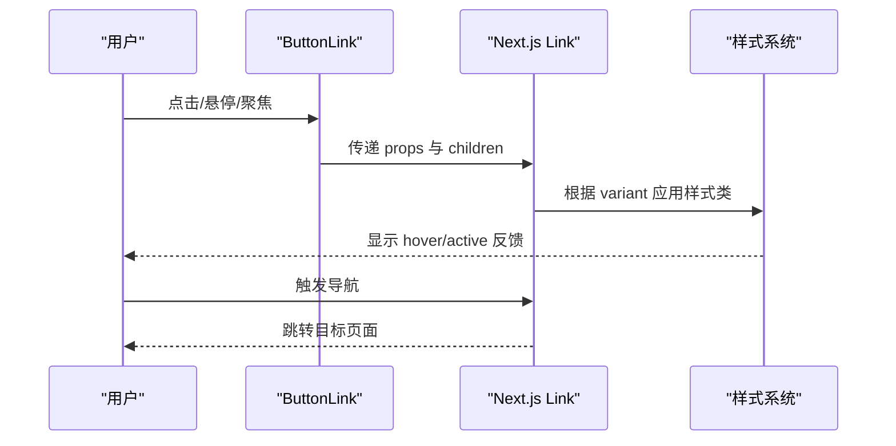
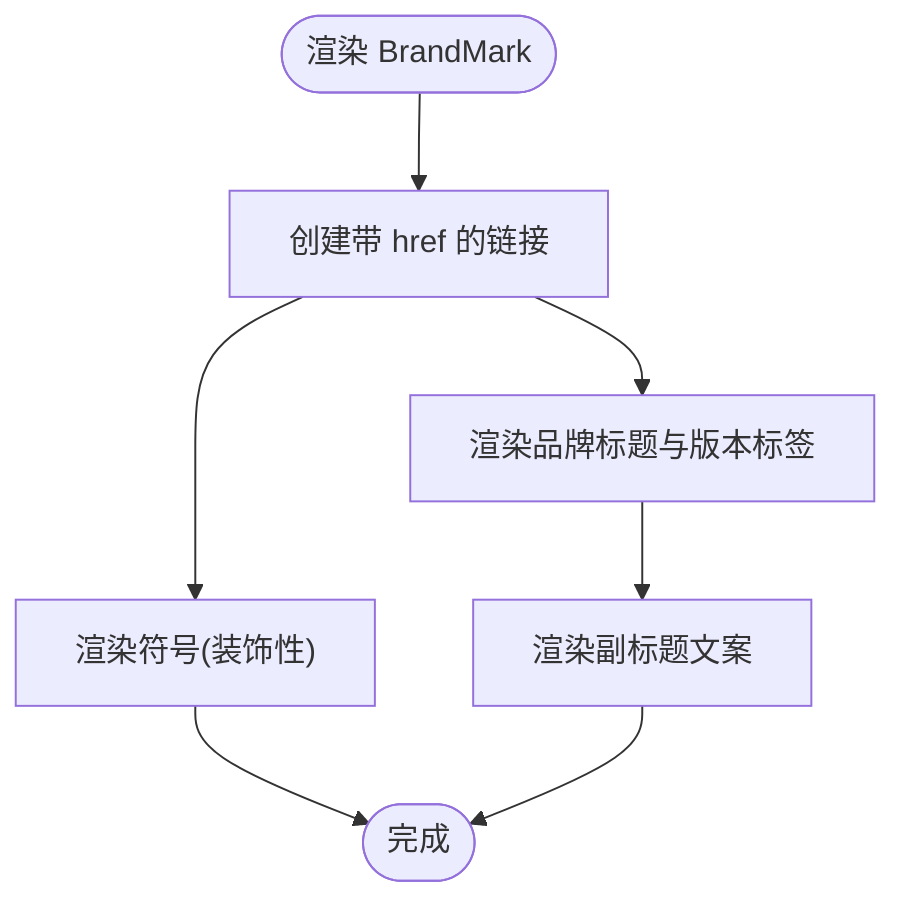
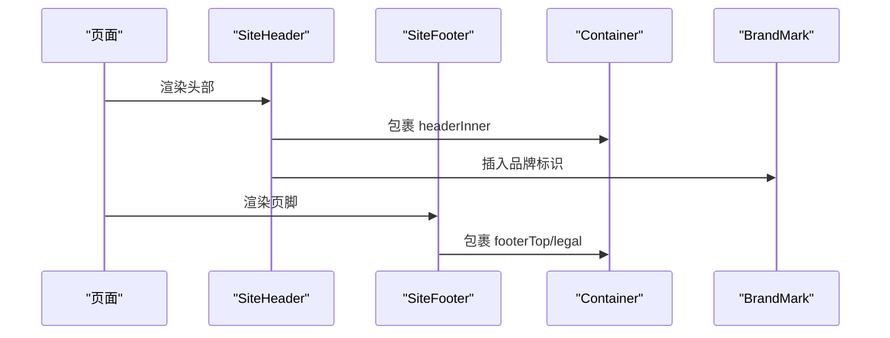
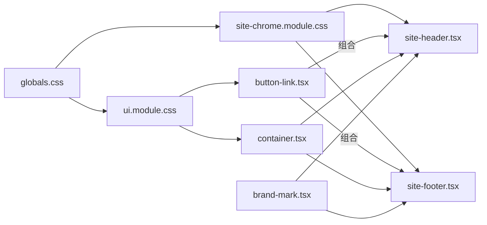

# 基础组件

<cite>
**本文引用的文件**
- [button-link.tsx](file://web/src/components/button-link.tsx)
- [container.tsx](file://web/src/components/container.tsx)
- [brand-mark.tsx](file://web/src/components/brand-mark.tsx)
- [ui.module.css](file://web/src/components/ui.module.css)
- [site-chrome.module.css](file://web/src/components/site-chrome.module.css)
- [globals.css](file://web/src/app/globals.css)
- [site-header.tsx](file://web/src/components/site-header.tsx)
- [site-footer.tsx](file://web/src/components/site-footer.tsx)
</cite>

## 目录
1. [简介](#简介)
2. [项目结构](#项目结构)
3. [核心组件](#核心组件)
4. [架构总览](#架构总览)
5. [详细组件分析](#详细组件分析)
6. [依赖关系分析](#依赖关系分析)
7. [性能与可访问性](#性能与可访问性)
8. [故障排查指南](#故障排查指南)
9. [结论](#结论)
10. [附录：使用示例与最佳实践](#附录使用示例与最佳实践)

## 简介
本章节面向“基础UI组件”的设计与实现，聚焦按钮、容器、品牌标识等原子级组件。文档将系统说明每个组件的 Props 接口、样式定制选项、交互行为、可访问性实现与响应式适配，并提供组合模式与最佳实践指导，帮助读者在业务页面中稳定复用这些基础能力。

## 项目结构
本项目的基础组件位于 web/src/components 目录下，采用“组件 + 模块样式”的组织方式：
- 组件以函数式 React 组件形式提供，通过 CSS Modules 隔离样式
- 全局设计令牌（颜色、间距、圆角、阴影、动效时长）集中在全局样式文件中
- 站点级外壳（头部、底部）由基础组件组合而成，体现组合模式

图表来源
- [globals.css:1-54](file://web/src/app/globals.css#L1-L54)
- [ui.module.css:1-92](file://web/src/components/ui.module.css#L1-L92)
- [site-chrome.module.css:1-461](file://web/src/components/site-chrome.module.css#L1-L461)
- [container.tsx:1-10](file://web/src/components/container.tsx#L1-L10)
- [button-link.tsx:1-28](file://web/src/components/button-link.tsx#L1-L28)
- [brand-mark.tsx:1-22](file://web/src/components/brand-mark.tsx#L1-L22)
- [site-header.tsx:1-72](file://web/src/components/site-header.tsx#L1-L72)
- [site-footer.tsx:1-65](file://web/src/components/site-footer.tsx#L1-L65)

章节来源
- [globals.css:1-54](file://web/src/app/globals.css#L1-L54)
- [ui.module.css:1-92](file://web/src/components/ui.module.css#L1-L92)
- [site-chrome.module.css:1-461](file://web/src/components/site-chrome.module.css#L1-L461)

## 核心组件
本节概述三个基础组件的职责与协作关系：
- Container：内容容器，负责居中与最大宽度控制，提供响应式边距
- ButtonLink：基于 Next.js Link 的可点击按钮，支持多种变体与图标
- BrandMark：品牌标识，用于头部或页脚的品牌展示

章节来源
- [container.tsx:1-10](file://web/src/components/container.tsx#L1-L10)
- [button-link.tsx:1-28](file://web/src/components/button-link.tsx#L1-L28)
- [brand-mark.tsx:1-22](file://web/src/components/brand-mark.tsx#L1-L22)

## 架构总览
基础组件通过“设计令牌 + 模块样式 + 组件组合”的方式构建：
- 设计令牌：颜色、字体、间距、圆角、阴影、动效时长等定义在全局样式中
- 模块样式：按钮、容器、站点外壳各自维护独立样式文件，避免耦合
- 组件组合：SiteHeader/SiteFooter 组合 Container、BrandMark 等基础组件，形成可复用的站点外壳

图表来源
- [container.tsx:1-10](file://web/src/components/container.tsx#L1-L10)
- [button-link.tsx:1-28](file://web/src/components/button-link.tsx#L1-L28)
- [brand-mark.tsx:1-22](file://web/src/components/brand-mark.tsx#L1-L22)
- [site-header.tsx:1-72](file://web/src/components/site-header.tsx#L1-L72)
- [site-footer.tsx:1-65](file://web/src/components/site-footer.tsx#L1-L65)

## 详细组件分析

### Container 组件
- 职责：为页面内容提供统一的居中布局与最大宽度约束，并处理响应式内边距
- Props 接口：透传 div 的所有属性（className、事件、数据属性等），默认 className 为空字符串
- 样式要点：
  - 宽度受设计令牌 --content 限制，并在移动端与桌面端有不同的左右边距
  - 通过媒体查询在大屏上增加左右留白，提升可读性
- 可访问性：作为语义化容器，不改变无障碍树；建议与主内容区域结合使用
- 响应式：在小屏幕下减少边距，在大屏幕下增加边距，保持内容可读性与视觉平衡

图表来源
- [ui.module.css:1-92](file://web/src/components/ui.module.css#L1-L92)
- [container.tsx:1-10](file://web/src/components/container.tsx#L1-L10)

章节来源
- [container.tsx:1-10](file://web/src/components/container.tsx#L1-L10)
- [ui.module.css:1-92](file://web/src/components/ui.module.css#L1-L92)

### ButtonLink 组件
- 职责：封装 Next.js Link 为可点击按钮，统一按钮尺寸、排版与交互反馈，并附带方向箭头图标
- Props 接口：
  - variant：可选值 primary、secondary、text，分别对应不同视觉风格
  - 透传 Link 的所有属性（href、target、aria-*、事件等）
- 样式要点：
  - 统一最小高度、内边距、圆角、字号与字重
  - hover/active 状态提供位移与缩放反馈，图标随悬停产生轻微位移
  - text 变体更轻量，适合行内操作
- 可访问性：
  - 使用 Link 原生语义，确保键盘导航与屏幕阅读器支持
  - 图标设置 aria-hidden，避免重复朗读
- 响应式：按钮尺寸与间距在不同屏幕下保持一致的触控目标大小

图表来源
- [button-link.tsx:1-28](file://web/src/components/button-link.tsx#L1-L28)
- [ui.module.css:6-92](file://web/src/components/ui.module.css#L6-L92)

章节来源
- [button-link.tsx:1-28](file://web/src/components/button-link.tsx#L1-L28)
- [ui.module.css:6-92](file://web/src/components/ui.module.css#L6-L92)

### BrandMark 组件
- 职责：展示品牌标志与名称，包含图形符号、品牌标题与版本标签
- Props 接口：无外部 Props，内部固定结构与文案
- 样式要点：
  - 使用站点外壳样式，区分浅色/深色背景下的品牌呈现
  - 版本标签使用胶囊样式，突出版本信息
- 可访问性：
  - 链接具备 aria-label，便于屏幕阅读器识别
  - 装饰性符号设置 aria-hidden，避免干扰阅读顺序
- 响应式：在不同屏幕下保持紧凑布局，确保品牌信息清晰可见

图表来源
- [brand-mark.tsx:1-22](file://web/src/components/brand-mark.tsx#L1-L22)
- [site-chrome.module.css:38-146](file://web/src/components/site-chrome.module.css#L38-L146)

章节来源
- [brand-mark.tsx:1-22](file://web/src/components/brand-mark.tsx#L1-L22)
- [site-chrome.module.css:38-146](file://web/src/components/site-chrome.module.css#L38-L146)

### 站点外壳中的基础组件组合
- SiteHeader：组合 Container、BrandMark，并渲染主导航与辅助导航，提供“跳到主要内容”的跳过链接
- SiteFooter：组合 Container，展示品牌信息、应用链接、方法与说明、平台承诺与法律链接

图表来源
- [site-header.tsx:1-72](file://web/src/components/site-header.tsx#L1-L72)
- [site-footer.tsx:1-65](file://web/src/components/site-footer.tsx#L1-L65)
- [container.tsx:1-10](file://web/src/components/container.tsx#L1-L10)
- [brand-mark.tsx:1-22](file://web/src/components/brand-mark.tsx#L1-L22)

章节来源
- [site-header.tsx:1-72](file://web/src/components/site-header.tsx#L1-L72)
- [site-footer.tsx:1-65](file://web/src/components/site-footer.tsx#L1-L65)

## 依赖关系分析
- 设计令牌依赖：所有组件样式均依赖全局设计令牌（颜色、间距、圆角、阴影、动效时长）
- 组件间依赖：
  - SiteHeader/SiteFooter 依赖 Container 与 BrandMark
  - ButtonLink 依赖 Next.js Link 与 lucide-react 图标库
- 样式依赖：
  - ui.module.css 依赖 globals.css 中的设计令牌
  - site-chrome.module.css 同样依赖设计令牌，并定义站点外壳的布局与响应式规则

图表来源
- [globals.css:1-54](file://web/src/app/globals.css#L1-L54)
- [ui.module.css:1-92](file://web/src/components/ui.module.css#L1-L92)
- [site-chrome.module.css:1-461](file://web/src/components/site-chrome.module.css#L1-L461)
- [button-link.tsx:1-28](file://web/src/components/button-link.tsx#L1-L28)
- [container.tsx:1-10](file://web/src/components/container.tsx#L1-L10)
- [brand-mark.tsx:1-22](file://web/src/components/brand-mark.tsx#L1-L22)
- [site-header.tsx:1-72](file://web/src/components/site-header.tsx#L1-L72)
- [site-footer.tsx:1-65](file://web/src/components/site-footer.tsx#L1-L65)

章节来源
- [globals.css:1-54](file://web/src/app/globals.css#L1-L54)
- [ui.module.css:1-92](file://web/src/components/ui.module.css#L1-L92)
- [site-chrome.module.css:1-461](file://web/src/components/site-chrome.module.css#L1-L461)

## 性能与可访问性
- 性能
  - 使用 CSS Modules 隔离样式，避免全局污染与冲突
  - 按钮与容器样式简洁，过渡动画使用短时长与硬件加速友好的 transform
  - 图标按需引入，减少冗余资源
- 可访问性
  - 全局 focus-visible 样式确保键盘导航可见性
  - 跳过链接提升键盘用户效率
  - 装饰性元素使用 aria-hidden，关键链接提供 aria-label
  - 尊重 prefers-reduced-motion，禁用不必要的动画与过渡
- 响应式
  - 容器在大屏与小屏下调整边距，保证可读性
  - 站点外壳在不同断点下调整布局，确保导航与操作区可用

章节来源
- [globals.css:115-177](file://web/src/app/globals.css#L115-L177)
- [ui.module.css:73-92](file://web/src/components/ui.module.css#L73-L92)
- [site-chrome.module.css:358-461](file://web/src/components/site-chrome.module.css#L358-L461)
- [site-header.tsx:29-33](file://web/src/components/site-header.tsx#L29-L33)

## 故障排查指南
- 按钮样式未生效
  - 检查是否正确使用 variant 属性，并确保样式类名未被覆盖
  - 确认全局设计令牌已正确加载
- 容器宽度异常
  - 检查父容器是否限制了宽度或使用了不兼容的布局
  - 确认媒体查询断点与设计令牌 --content 的值是否符合预期
- 品牌标识不可见或错位
  - 检查是否在正确的上下文中使用（头部/页脚），并确认样式作用域
  - 确认无障碍属性与图标是否正确隐藏
- 键盘导航问题
  - 确保使用 Link 或 button 语义元素
  - 检查 focus-visible 样式是否被覆盖

章节来源
- [ui.module.css:6-92](file://web/src/components/ui.module.css#L6-L92)
- [site-chrome.module.css:1-461](file://web/src/components/site-chrome.module.css#L1-L461)
- [globals.css:115-177](file://web/src/app/globals.css#L115-L177)

## 结论
基础组件通过清晰的分层与组合，提供了稳定的 UI 能力：
- Container 提供一致的布局与响应式边距
- ButtonLink 提供可访问、可定制的按钮体验
- BrandMark 提供品牌一致性表达
- 站点外壳将这些组件组合成完整的头部与页脚，体现组合模式的最佳实践

建议在业务页面中优先复用这些基础组件，并通过设计令牌进行主题定制，确保一致性与可维护性。

## 附录：使用示例与最佳实践
- 使用 Container 包裹页面主体内容，确保居中与最大宽度
- 使用 ButtonLink 替代普通链接，获得一致的按钮外观与交互反馈
- 在 SiteHeader/SiteFooter 中组合 Container 与 BrandMark，快速搭建站点外壳
- 通过 CSS 变量自定义主题色与间距，保持设计一致性
- 遵循可访问性规范：为关键链接添加描述性文本，装饰性元素设置 aria-hidden，确保键盘导航可用

章节来源
- [container.tsx:1-10](file://web/src/components/container.tsx#L1-L10)
- [button-link.tsx:1-28](file://web/src/components/button-link.tsx#L1-L28)
- [brand-mark.tsx:1-22](file://web/src/components/brand-mark.tsx#L1-L22)
- [site-header.tsx:1-72](file://web/src/components/site-header.tsx#L1-L72)
- [site-footer.tsx:1-65](file://web/src/components/site-footer.tsx#L1-L65)
- [globals.css:1-54](file://web/src/app/globals.css#L1-L54)