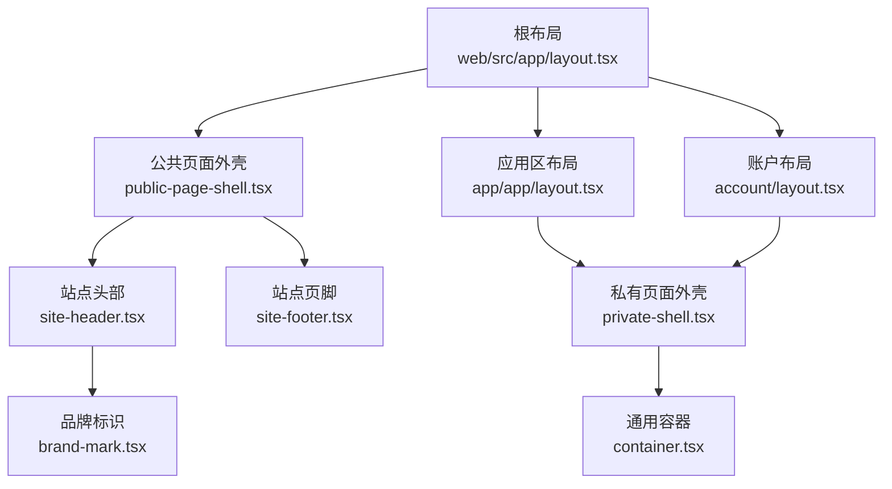
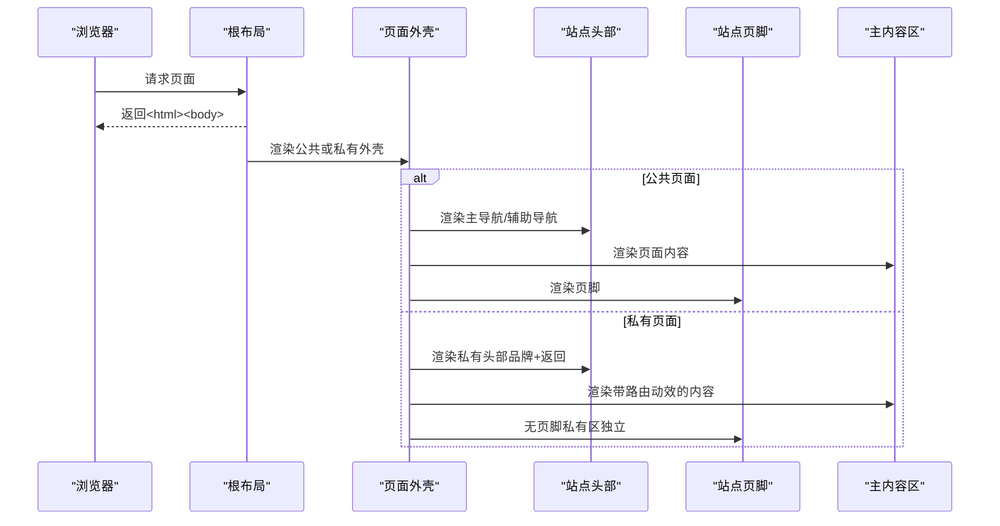
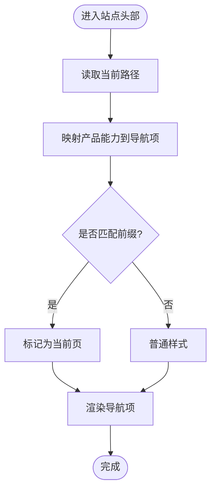
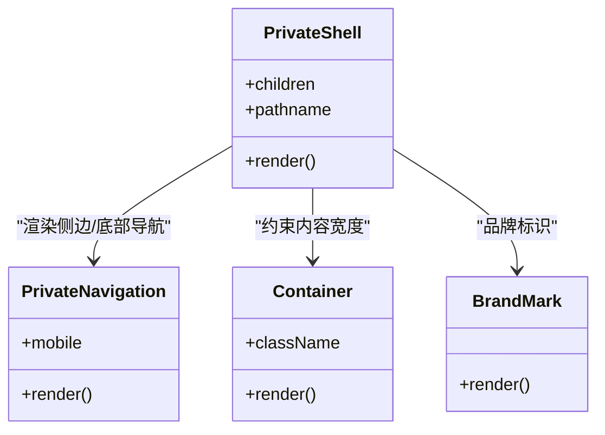
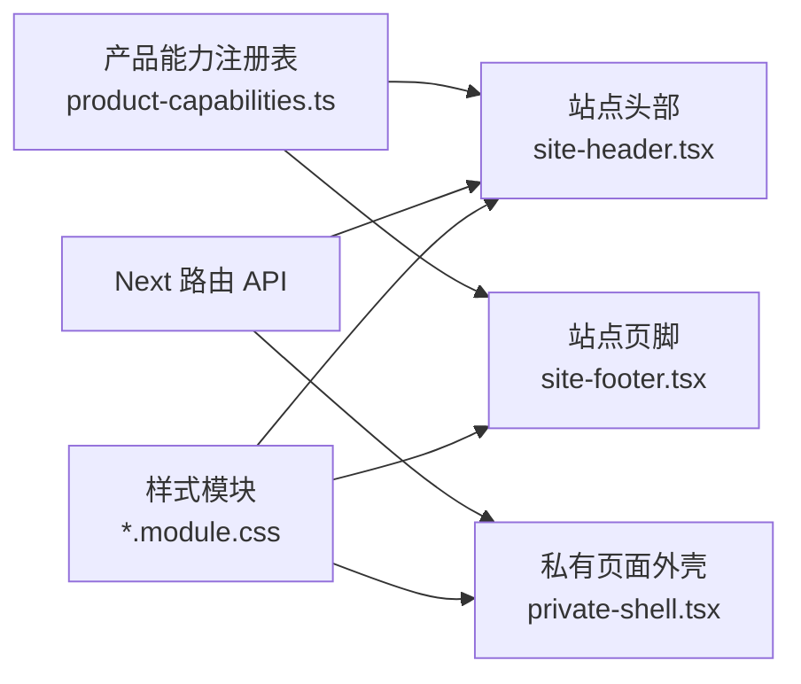

# 布局组件

<cite>
**本文引用的文件**
- [web/src/app/layout.tsx](file://web/src/app/layout.tsx)
- [web/src/app/app/layout.tsx](file://web/src/app/app/layout.tsx)
- [web/src/app/account/layout.tsx](file://web/src/app/account/layout.tsx)
- [web/src/components/private-shell.tsx](file://web/src/components/private-shell.tsx)
- [web/src/components/public-page-shell.tsx](file://web/src/components/public-page-shell.tsx)
- [web/src/components/site-header.tsx](file://web/src/components/site-header.tsx)
- [web/src/components/site-footer.tsx](file://web/src/components/site-footer.tsx)
- [web/src/components/container.tsx](file://web/src/components/container.tsx)
- [web/src/components/brand-mark.tsx](file://web/src/components/brand-mark.tsx)
- [web/src/lib/product-capabilities.ts](file://web/src/lib/product-capabilities.ts)
- [web/src/components/private-shell.module.css](file://web/src/components/private-shell.module.css)
- [web/src/components/public-page-shell.module.css](file://web/src/components/public-page-shell.module.css)
- [web/src/components/site-chrome.module.css](file://web/src/components/site-chrome.module.css)
- [web/src/components/ui.module.css](file://web/src/components/ui.module.css)
</cite>

## 目录
1. [简介](#简介)
2. [项目结构](#项目结构)
3. [核心组件](#核心组件)
4. [架构总览](#架构总览)
5. [详细组件分析](#详细组件分析)
6. [依赖关系分析](#依赖关系分析)
7. [性能考量](#性能考量)
8. [故障排查指南](#故障排查指南)
9. [结论](#结论)
10. [附录](#附录)

## 简介
本文件聚焦于前端 Web 应用的页面布局体系，系统说明站点头部、页脚、公共页面外壳与私有页面外壳的实现方式，解释嵌套关系、响应式适配、主题定制方案，并阐述状态管理、路由集成与性能优化策略。同时提供布局组合模式与最佳实践指导，帮助读者快速理解并扩展该布局体系。

## 项目结构
整体采用 Next.js App Router 的分层布局：
- 根布局负责全局元数据、字体与视口设置。
- 公共区域使用“公共页面外壳”包裹站点头部与页脚。
- 私有应用区通过“应用区布局”和“账户布局”统一套用“私有页面外壳”，实现侧边导航与主内容区的稳定框架。
- 通用容器与品牌标识作为基础 UI 构件被多处复用。

图示来源
- [web/src/app/layout.tsx:1-33](file://web/src/app/layout.tsx#L1-L33)
- [web/src/components/public-page-shell.tsx:1-17](file://web/src/components/public-page-shell.tsx#L1-L17)
- [web/src/components/site-header.tsx:1-72](file://web/src/components/site-header.tsx#L1-L72)
- [web/src/components/site-footer.tsx:1-65](file://web/src/components/site-footer.tsx#L1-L65)
- [web/src/app/app/layout.tsx:1-19](file://web/src/app/app/layout.tsx#L1-L19)
- [web/src/app/account/layout.tsx:1-19](file://web/src/app/account/layout.tsx#L1-L19)
- [web/src/components/private-shell.tsx:1-88](file://web/src/components/private-shell.tsx#L1-L88)
- [web/src/components/container.tsx:1-10](file://web/src/components/container.tsx#L1-L10)
- [web/src/components/brand-mark.tsx:1-22](file://web/src/components/brand-mark.tsx#L1-L22)

章节来源
- [web/src/app/layout.tsx:1-33](file://web/src/app/layout.tsx#L1-L33)
- [web/src/components/public-page-shell.tsx:1-17](file://web/src/components/public-page-shell.tsx#L1-L17)
- [web/src/components/private-shell.tsx:1-88](file://web/src/components/private-shell.tsx#L1-L88)

## 核心组件
- 根布局：定义全局元信息、字体引入与视口配置，承载所有子布局。
- 公共页面外壳：组合站点头部与页脚，为公开页面提供一致的上下边框与深色背景基调。
- 站点头部：基于产品能力注册表渲染主导航与辅助导航，支持当前路径高亮与无障碍跳转链接。
- 站点页脚：集中展示应用入口、方法与说明、平台承诺及法律链接。
- 私有页面外壳：提供固定顶部栏、左侧边栏（桌面）/底部导航（移动）、可聚焦的主内容区，以及路由进入动效。
- 通用容器与品牌标识：统一内容宽度与品牌视觉元素。

章节来源
- [web/src/app/layout.tsx:1-33](file://web/src/app/layout.tsx#L1-L33)
- [web/src/components/public-page-shell.tsx:1-17](file://web/src/components/public-page-shell.tsx#L1-L17)
- [web/src/components/site-header.tsx:1-72](file://web/src/components/site-header.tsx#L1-L72)
- [web/src/components/site-footer.tsx:1-65](file://web/src/components/site-footer.tsx#L1-L65)
- [web/src/components/private-shell.tsx:1-88](file://web/src/components/private-shell.tsx#L1-L88)
- [web/src/components/container.tsx:1-10](file://web/src/components/container.tsx#L1-L10)
- [web/src/components/brand-mark.tsx:1-22](file://web/src/components/brand-mark.tsx#L1-L22)

## 架构总览
布局体系围绕“壳 + 槽”的组合模式构建：
- 根布局提供全局上下文（字体、元数据、视口）。
- 公共壳（PublicPageShell）将 Header/Footer 作为固定装饰，内容区由具体页面填充。
- 私有壳（PrivateShell）在应用区与账户区统一提供侧边导航与主内容区，并通过路由钩子进行当前路径判定与动效过渡。

图示来源
- [web/src/app/layout.tsx:1-33](file://web/src/app/layout.tsx#L1-L33)
- [web/src/components/public-page-shell.tsx:1-17](file://web/src/components/public-page-shell.tsx#L1-L17)
- [web/src/components/private-shell.tsx:1-88](file://web/src/components/private-shell.tsx#L1-L88)
- [web/src/components/site-header.tsx:1-72](file://web/src/components/site-header.tsx#L1-L72)
- [web/src/components/site-footer.tsx:1-65](file://web/src/components/site-footer.tsx#L1-L65)

## 详细组件分析

### 根布局（Root Layout）
- 职责：注入全局字体、CSS、元数据与视口；承载子布局树。
- 关键点：
  - 标题模板化，便于子页面覆盖。
  - 视口启用移动端缩放与主题色。
  - 语言设置为中文，利于 SEO 与无障碍。

章节来源
- [web/src/app/layout.tsx:1-33](file://web/src/app/layout.tsx#L1-L33)

### 公共页面外壳（Public Page Shell）
- 职责：组合站点头部与页脚，为公开页面提供一致外观。
- 关键点：
  - 深色背景与浅色文字形成对比基调。
  - 保持最小高度以撑满视口。

章节来源
- [web/src/components/public-page-shell.tsx:1-17](file://web/src/components/public-page-shell.tsx#L1-L17)
- [web/src/components/public-page-shell.module.css:1-6](file://web/src/components/public-page-shell.module.css#L1-L6)

### 站点头部（Site Header）
- 职责：渲染品牌标识、主导航与辅助导航，处理当前路径高亮与无障碍跳转。
- 关键点：
  - 导航项来源于产品能力注册表，确保 UI 与产品定义一致。
  - 使用 usePathname 计算当前激活项，提升可访问性。
  - 响应式网格在不同断点下重组布局。

图示来源
- [web/src/components/site-header.tsx:1-72](file://web/src/components/site-header.tsx#L1-L72)
- [web/src/lib/product-capabilities.ts:103-125](file://web/src/lib/product-capabilities.ts#L103-L125)

章节来源
- [web/src/components/site-header.tsx:1-72](file://web/src/components/site-header.tsx#L1-L72)
- [web/src/lib/product-capabilities.ts:1-140](file://web/src/lib/product-capabilities.ts#L1-L140)

### 站点页脚（Site Footer）
- 职责：集中展示应用入口、方法与说明、平台承诺与法律链接。
- 关键点：
  - 使用产品注册表生成应用入口，保证一致性。
  - 多列栅格布局，在大屏上横向展开。
  - 法律链接与版权信息位于底部区域。

章节来源
- [web/src/components/site-footer.tsx:1-65](file://web/src/components/site-footer.tsx#L1-L65)
- [web/src/lib/product-capabilities.ts:127-139](file://web/src/lib/product-capabilities.ts#L127-L139)

### 私有页面外壳（Private Shell）
- 职责：为应用区与账户区提供统一的侧边导航与主内容区，包含跳过链接、返回公共首页、归档提示与路由进入动效。
- 关键点：
  - 桌面端左侧边栏固定定位，移动端底部导航条。
  - 主内容区具备可聚焦属性，配合跳过链接提升可访问性。
  - 根据路径判断当前导航项，增强用户体验。
  - 使用 RouteEnter 包装内容，实现路由切换时的入场动画。

图示来源
- [web/src/components/private-shell.tsx:1-88](file://web/src/components/private-shell.tsx#L1-L88)
- [web/src/components/container.tsx:1-10](file://web/src/components/container.tsx#L1-L10)
- [web/src/components/brand-mark.tsx:1-22](file://web/src/components/brand-mark.tsx#L1-L22)

章节来源
- [web/src/components/private-shell.tsx:1-88](file://web/src/components/private-shell.tsx#L1-L88)

### 应用区布局与账户布局
- 应用区布局：为 /app 下的页面统一套用私有外壳，并设置不可索引的元数据与动态渲染策略。
- 账户布局：为 /account 下的页面同样套用私有外壳，屏蔽缓存以提升交互实时性。

章节来源
- [web/src/app/app/layout.tsx:1-19](file://web/src/app/app/layout.tsx#L1-L19)
- [web/src/app/account/layout.tsx:1-19](file://web/src/app/account/layout.tsx#L1-L19)

### 通用容器与品牌标识
- 容器：统一内容最大宽度与内边距，适配不同屏幕尺寸。
- 品牌标识：提供品牌徽标、版本标签与副标题，用于头部与页脚等位置。

章节来源
- [web/src/components/container.tsx:1-10](file://web/src/components/container.tsx#L1-L10)
- [web/src/components/brand-mark.tsx:1-22](file://web/src/components/brand-mark.tsx#L1-L22)

## 依赖关系分析
- 产品能力注册表驱动公共导航与页脚应用入口，避免硬编码导致的不一致。
- 头部与私有外壳均依赖 Next.js 的路由 API 获取当前路径，用于高亮与条件渲染。
- 样式模块按组件拆分，减少耦合，便于维护与主题定制。

图示来源
- [web/src/lib/product-capabilities.ts:1-140](file://web/src/lib/product-capabilities.ts#L1-L140)
- [web/src/components/site-header.tsx:1-72](file://web/src/components/site-header.tsx#L1-L72)
- [web/src/components/site-footer.tsx:1-65](file://web/src/components/site-footer.tsx#L1-L65)
- [web/src/components/private-shell.tsx:1-88](file://web/src/components/private-shell.tsx#L1-L88)

章节来源
- [web/src/lib/product-capabilities.ts:1-140](file://web/src/lib/product-capabilities.ts#L1-L140)
- [web/src/components/site-header.tsx:1-72](file://web/src/components/site-header.tsx#L1-L72)
- [web/src/components/site-footer.tsx:1-65](file://web/src/components/site-footer.tsx#L1-L65)
- [web/src/components/private-shell.tsx:1-88](file://web/src/components/private-shell.tsx#L1-L88)

## 性能考量
- 静态元数据与字体：根布局集中声明，减少重复开销。
- 动态渲染控制：应用区与账户布局强制动态渲染与禁用缓存，确保用户态数据即时可见。
- 响应式与可访问性：
  - 使用 CSS Grid 与媒体查询实现自适应布局，避免 JS 重排。
  - 提供“跳到主要内容”的跳过链接，提升键盘导航效率。
  - 尊重 prefers-reduced-motion，关闭不必要的过渡与模糊效果。
- 样式模块化：每个组件对应独立样式文件，降低样式冲突与打包体积。
- 内容宽度约束：容器组件统一控制最大宽度，避免极端宽屏下的可读性问题。

[本节为通用性能建议，不直接引用具体代码行]

## 故障排查指南
- 导航高亮异常：检查当前路径与前缀匹配逻辑，确认产品能力注册表的 activePrefixes 是否正确。
- 移动端导航错位：确认私有外壳的媒体查询断点与 safe-area-inset-bottom 的使用，避免被安全区域遮挡。
- 头部/页脚显示异常：核对公共外壳与站点头部的样式类名绑定，确保容器宽度与网格布局生效。
- 可访问性问题：验证“跳到主要内容”链接目标是否存在，确保主内容区具有可聚焦属性。
- 主题变量缺失：检查全局 CSS 中是否定义了必要的 CSS 变量（如颜色、圆角、阴影等），否则可能导致样式错乱。

章节来源
- [web/src/components/site-header.tsx:1-72](file://web/src/components/site-header.tsx#L1-L72)
- [web/src/components/private-shell.tsx:1-88](file://web/src/components/private-shell.tsx#L1-L88)
- [web/src/components/public-page-shell.tsx:1-17](file://web/src/components/public-page-shell.tsx#L1-L17)
- [web/src/components/site-chrome.module.css:1-461](file://web/src/components/site-chrome.module.css#L1-L461)
- [web/src/components/private-shell.module.css:1-331](file://web/src/components/private-shell.module.css#L1-L331)

## 结论
该布局体系通过“根布局 + 公共壳 + 私有壳”的分层设计，实现了清晰的职责划分与良好的可扩展性。产品能力注册表驱动导航与页脚，保证了 UI 与产品定义的一致性；响应式与可访问性贯穿各组件，提升了跨设备体验。结合 Next.js 的路由与渲染策略，可在保证性能的同时提供流畅的用户交互。

[本节为总结性内容，不直接引用具体代码行]

## 附录

### 响应式适配要点
- 公共头部：小屏堆叠布局，大屏分三列（品牌/导航/动作）。
- 私有外壳：小屏底部导航，大屏左侧固定边栏与主内容区并排。
- 容器宽度：随断点调整，避免过宽影响阅读。

章节来源
- [web/src/components/site-chrome.module.css:358-461](file://web/src/components/site-chrome.module.css#L358-L461)
- [web/src/components/private-shell.module.css:235-331](file://web/src/components/private-shell.module.css#L235-L331)
- [web/src/components/ui.module.css:1-92](file://web/src/components/ui.module.css#L1-L92)

### 主题定制方案
- 通过 CSS 变量集中管理颜色、圆角、阴影与字体族，便于全局换肤。
- 公共壳与私有壳分别提供深色与浅色背景基调，可通过变量切换主题。
- 媒体查询与 reduced-motion 支持，确保不同环境与偏好下的表现一致。

章节来源
- [web/src/components/public-page-shell.module.css:1-6](file://web/src/components/public-page-shell.module.css#L1-L6)
- [web/src/components/private-shell.module.css:1-331](file://web/src/components/private-shell.module.css#L1-L331)
- [web/src/components/site-chrome.module.css:1-461](file://web/src/components/site-chrome.module.css#L1-L461)

### 路由集成与状态管理
- 使用 Next.js 的 usePathname 获取当前路径，驱动导航高亮与条件渲染。
- 应用区与账户布局通过元数据与渲染策略控制缓存与索引行为，保障用户态数据的实时性。
- 私有外壳通过路由键触发内容入场动效，提升页面切换体验。

章节来源
- [web/src/components/site-header.tsx:1-72](file://web/src/components/site-header.tsx#L1-L72)
- [web/src/components/private-shell.tsx:1-88](file://web/src/components/private-shell.tsx#L1-L88)
- [web/src/app/app/layout.tsx:1-19](file://web/src/app/app/layout.tsx#L1-L19)
- [web/src/app/account/layout.tsx:1-19](file://web/src/app/account/layout.tsx#L1-L19)

### 布局组合模式与最佳实践
- 分层组合：根布局负责全局，壳组件负责区域框架，页面组件专注业务内容。
- 单一事实源：导航与页脚链接来自产品能力注册表，避免分散维护。
- 可访问性优先：提供跳过链接、语义化标签与焦点管理。
- 渐进增强：先保证结构与样式正确，再叠加动效与复杂交互。
- 样式隔离：组件级样式文件，避免全局污染。

[本节为通用最佳实践，不直接引用具体代码行]