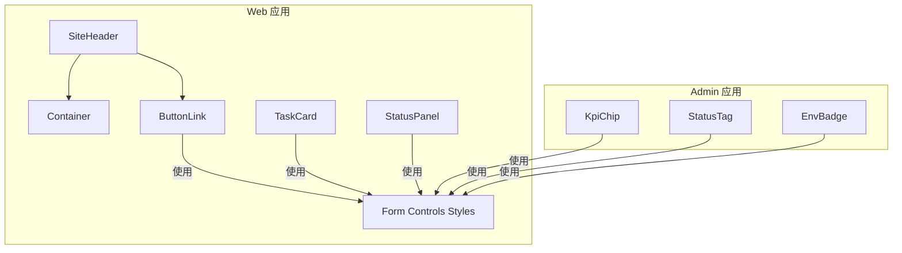
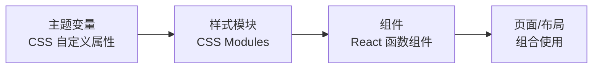
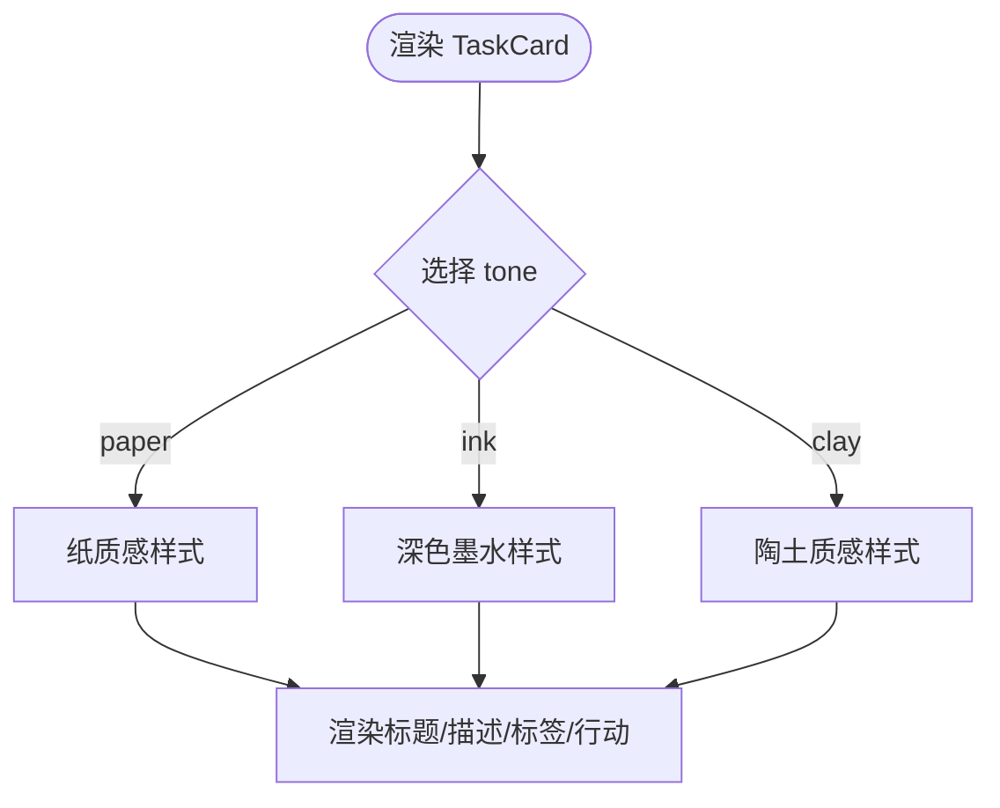
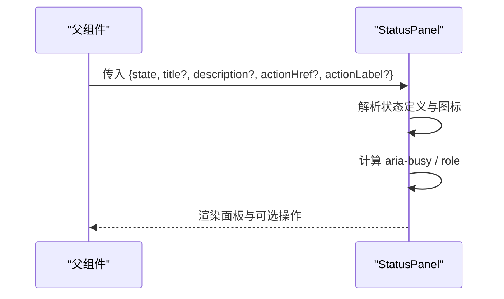
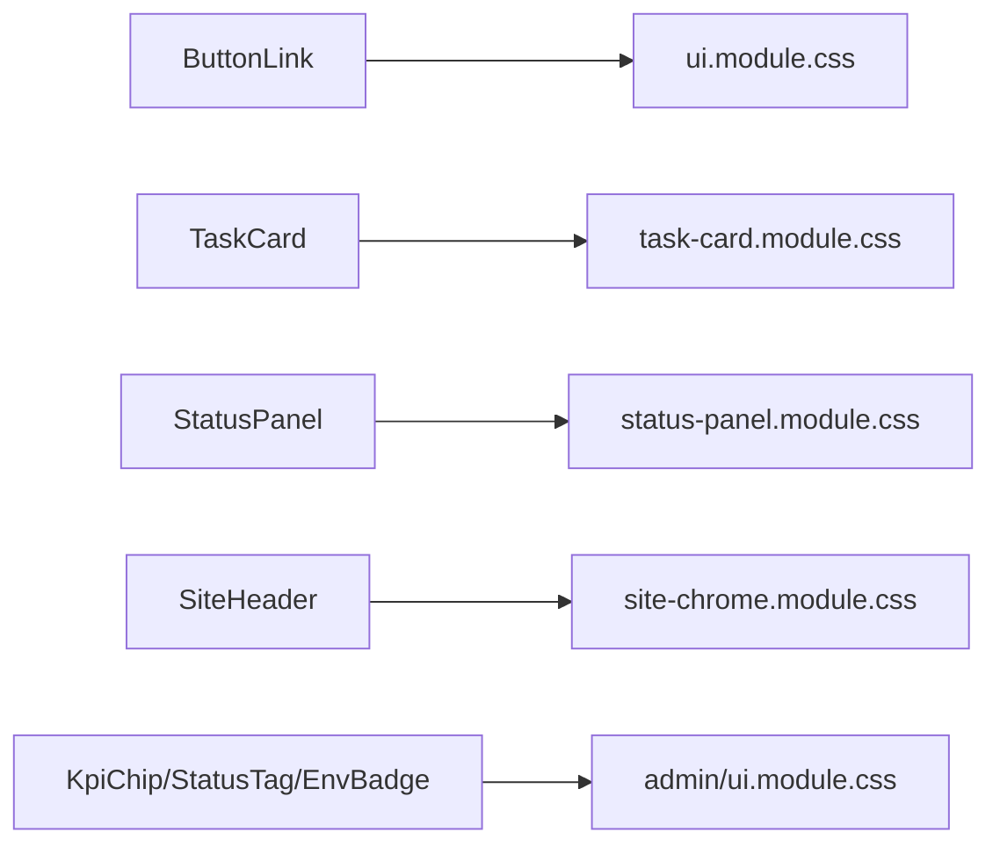

# 核心组件库

<cite>
**本文引用的文件**
- [web/src/components/ui.module.css](file://web/src/components/ui.module.css)
- [admin/src/components/ui.module.css](file://admin/src/components/ui.module.css)
- [web/src/components/button-link.tsx](file://web/src/components/button-link.tsx)
- [web/src/components/form-controls.module.css](file://web/src/components/form-controls.module.css)
- [web/src/components/task-card.tsx](file://web/src/components/task-card.tsx)
- [web/src/components/task-card.module.css](file://web/src/components/task-card.module.css)
- [web/src/components/status-panel.tsx](file://web/src/components/status-panel.tsx)
- [web/src/components/status-panel.module.css](file://web/src/components/status-panel.module.css)
- [web/src/components/container.tsx](file://web/src/components/container.tsx)
- [web/src/components/site-header.tsx](file://web/src/components/site-header.tsx)
- [web/src/components/site-chrome.module.css](file://web/src/components/site-chrome.module.css)
- [admin/src/components/kpi-chip.tsx](file://admin/src/components/kpi-chip.tsx)
- [admin/src/components/status-tag.tsx](file://admin/src/components/status-tag.tsx)
- [admin/src/components/env-badge.tsx](file://admin/src/components/env-badge.tsx)
</cite>

## 目录
1. [简介](#简介)
2. [项目结构](#项目结构)
3. [核心组件](#核心组件)
4. [架构总览](#架构总览)
5. [详细组件分析](#详细组件分析)
6. [依赖关系分析](#依赖关系分析)
7. [性能与可访问性](#性能与可访问性)
8. [故障排查指南](#故障排查指南)
9. [结论](#结论)
10. [附录：样式系统与主题定制](#附录样式系统与主题定制)

## 简介
本文件面向“核心组件库”的设计与实现，聚焦可复用的 UI 基础组件（按钮、表单控件、卡片、状态面板等），系统阐述接口设计（Props、事件、状态）、样式体系（CSS 模块化、主题变量）、可访问性与响应式适配，并给出组合模式、测试策略与最佳实践。文档基于仓库中 web 与 admin 两套前端工程中的实际组件与样式进行提炼，确保读者能直接对照源码理解与实践。

## 项目结构
- 组件按功能域组织在各自工程的 src/components 下，样式采用 CSS Modules，便于局部作用域隔离与按需引入。
- 公共样式通过 CSS 自定义属性（变量）集中管理，如颜色、圆角、阴影、动效时长等，支撑主题化与一致性体验。
- 导航与页面壳层组件位于 web 工程，用于构建站点级 chrome；admin 工程提供管理端专用的小组件（KPI 指标、环境标识、状态标签）。



图表来源
- [web/src/components/site-header.tsx:1-72](file://web/src/components/site-header.tsx#L1-L72)
- [web/src/components/container.tsx:1-10](file://web/src/components/container.tsx#L1-L10)
- [web/src/components/button-link.tsx:1-28](file://web/src/components/button-link.tsx#L1-L28)
- [web/src/components/task-card.tsx:1-37](file://web/src/components/task-card.tsx#L1-L37)
- [web/src/components/status-panel.tsx:1-118](file://web/src/components/status-panel.tsx#L1-L118)
- [admin/src/components/kpi-chip.tsx:1-20](file://admin/src/components/kpi-chip.tsx#L1-L20)
- [admin/src/components/status-tag.tsx:1-21](file://admin/src/components/status-tag.tsx#L1-L21)
- [admin/src/components/env-badge.tsx:1-17](file://admin/src/components/env-badge.tsx#L1-L17)

章节来源
- [web/src/components/site-header.tsx:1-72](file://web/src/components/site-header.tsx#L1-L72)
- [web/src/components/ui.module.css:1-92](file://web/src/components/ui.module.css#L1-L92)
- [admin/src/components/ui.module.css:1-231](file://admin/src/components/ui.module.css#L1-L231)

## 核心组件
本节概述各组件的职责、对外接口与交互约定。

- ButtonLink（链接型按钮）
  - 职责：将路由跳转与按钮视觉统一，支持多种变体。
  - Props：继承 Link 的所有属性；新增 variant 可选值 primary/secondary/text。
  - 事件：透传原生 onClick 等事件；内部箭头图标为装饰性，不参与交互。
  - 样式：复用 ui.module.css 的 button 基础样式与变体类名。

- Container（内容容器）
  - 职责：提供统一的页面内容宽度与边距约束。
  - Props：标准 div 属性扩展，className 合并。
  - 样式：ui.module.css 中的 container 规则，含响应式宽度。

- TaskCard（任务卡片）
  - 职责：展示任务标题、描述、标签与行动入口。
  - Props：title、description、label、href、action、tone（paper/ink/clay）。
  - 事件：点击 action 触发路由跳转。
  - 样式：task-card.module.css，含 hover/active 动效与多主题 tone。

- StatusPanel（状态面板）
  - 职责：以统一方式呈现 loading/empty/error/processing/success/disabled 等状态。
  - Props：state、title、description、actionHref、actionLabel。
  - 事件：当提供 actionHref/actionLabel 时渲染可点击操作。
  - 可访问性：根据状态设置 role/alert/status、aria-busy、aria-labelledby/describedby。

- 表单控件样式（Form Controls）
  - 职责：定义输入框、文本域、错误提示、动作按钮等通用样式。
  - 特性：focus/hover 态、禁用态、错误态、动画与减少动效适配。

- Admin 小组件
  - KpiChip：数值+标签的指标卡，支持占位标记。
  - StatusTag：带语义色的小型状态标签。
  - EnvBadge：显示部署环境标识。

章节来源
- [web/src/components/button-link.tsx:1-28](file://web/src/components/button-link.tsx#L1-L28)
- [web/src/components/container.tsx:1-10](file://web/src/components/container.tsx#L1-L10)
- [web/src/components/task-card.tsx:1-37](file://web/src/components/task-card.tsx#L1-L37)
- [web/src/components/status-panel.tsx:1-118](file://web/src/components/status-panel.tsx#L1-L118)
- [web/src/components/form-controls.module.css:1-176](file://web/src/components/form-controls.module.css#L1-L176)
- [admin/src/components/kpi-chip.tsx:1-20](file://admin/src/components/kpi-chip.tsx#L1-L20)
- [admin/src/components/status-tag.tsx:1-21](file://admin/src/components/status-tag.tsx#L1-L21)
- [admin/src/components/env-badge.tsx:1-17](file://admin/src/components/env-badge.tsx#L1-L17)

## 架构总览
组件库遵循“组件 + 样式模块 + 主题变量”的分层：
- 组件层：React 函数组件，仅负责结构与行为，不持有业务状态。
- 样式层：CSS Modules 限定作用域，通过 class 组合表达变体。
- 主题层：全局 CSS 自定义属性（颜色、圆角、阴影、动效时长等）由上层注入，组件只消费变量。



图表来源
- [web/src/components/ui.module.css:1-92](file://web/src/components/ui.module.css#L1-L92)
- [web/src/components/form-controls.module.css:1-176](file://web/src/components/form-controls.module.css#L1-L176)
- [web/src/components/site-chrome.module.css:1-461](file://web/src/components/site-chrome.module.css#L1-L461)

## 详细组件分析

### ButtonLink（链接型按钮）
- 设计要点
  - 将 Next.js Link 与按钮视觉融合，保持键盘可达与语义正确。
  - 通过 variant 切换主/次/文本三种视觉风格。
  - 右侧箭头图标作为装饰，避免干扰焦点顺序。
- 接口
  - Props：继承 Link 所有属性；variant 默认 primary。
  - 事件：透传 onClick 等原生事件。
- 样式
  - 使用 ui.module.css 的 .button 与 .primary/.secondary/.text 变体。
  - 过渡动效与悬停位移增强反馈。

```mermaid
classDiagram
class ButtonLink {
+variant : "primary" | "secondary" | "text"
+children
+onClick()
}
ButtonLink --> "使用" : "ui.module.css(.button, .primary, .secondary, .text)"
```

图表来源
- [web/src/components/button-link.tsx:1-28](file://web/src/components/button-link.tsx#L1-L28)
- [web/src/components/ui.module.css:6-71](file://web/src/components/ui.module.css#L6-L71)

章节来源
- [web/src/components/button-link.tsx:1-28](file://web/src/components/button-link.tsx#L1-L28)
- [web/src/components/ui.module.css:6-71](file://web/src/components/ui.module.css#L6-L71)

### TaskCard（任务卡片）
- 设计要点
  - 通过 data-tone 选择不同主题（paper/ink/clay），实现一致的卡片家族感。
  - 标题、描述、标签与行动入口层次清晰，适合列表或网格布局。
- 接口
  - Props：title、description、label、href、action、tone。
- 样式
  - task-card.module.css 提供入场与悬停动效，移动端自适应高度。



图表来源
- [web/src/components/task-card.tsx:1-37](file://web/src/components/task-card.tsx#L1-L37)
- [web/src/components/task-card.module.css:50-78](file://web/src/components/task-card.module.css#L50-L78)

章节来源
- [web/src/components/task-card.tsx:1-37](file://web/src/components/task-card.tsx#L1-L37)
- [web/src/components/task-card.module.css:1-161](file://web/src/components/task-card.module.css#L1-L161)

### StatusPanel（状态面板）
- 设计要点
  - 以 state 驱动外观与语义，覆盖加载、空态、错误、处理中、成功、禁用等场景。
  - 自动设置 aria-* 与 role，提升屏幕阅读器体验。
- 接口
  - Props：state、title、description、actionHref、actionLabel。
- 交互流程
  - 当 state 为 loading/processing 时，aria-busy 为 true，图标脉冲动画提示进行中。
  - 当提供 actionHref/actionLabel 时，渲染可点击的操作按钮。



图表来源
- [web/src/components/status-panel.tsx:17-118](file://web/src/components/status-panel.tsx#L17-L118)
- [web/src/components/status-panel.module.css:1-154](file://web/src/components/status-panel.module.css#L1-L154)

章节来源
- [web/src/components/status-panel.tsx:17-118](file://web/src/components/status-panel.tsx#L17-L118)
- [web/src/components/status-panel.module.css:1-154](file://web/src/components/status-panel.module.css#L1-L154)

### 表单控件样式（Form Controls）
- 设计要点
  - 统一输入框、文本域、错误提示、动作按钮的视觉与交互。
  - 通过 focus/hover/disabled/aria-invalid 等状态控制边框、背景与提示。
  - 提供减少动效媒体查询，满足可访问性需求。
- 使用建议
  - 将 label、input、error、hint 按字段分组，形成 field 块。
  - 动作区 actions 内放置提交/取消等操作按钮，保持对齐与间距一致。

章节来源
- [web/src/components/form-controls.module.css:1-176](file://web/src/components/form-controls.module.css#L1-L176)

### SiteHeader（站点头部）
- 设计要点
  - 包含跳过链接、品牌标识、主导航与辅助导航。
  - 使用 usePathname 高亮当前项，提供 aria-current 语义。
- 可访问性
  - 提供 skipLink 快速跳转到主要内容区域。
  - 导航区域使用 aria-label 区分主次。

章节来源
- [web/src/components/site-header.tsx:1-72](file://web/src/components/site-header.tsx#L1-L72)
- [web/src/components/site-chrome.module.css:1-461](file://web/src/components/site-chrome.module.css#L1-L461)

### Admin 小组件
- KpiChip：数值+标签，支持 isStub 占位标记。
- StatusTag：基于 tone 映射到不同样式类，用于状态小标签。
- EnvBadge：读取部署环境并渲染对应标签样式。

章节来源
- [admin/src/components/kpi-chip.tsx:1-20](file://admin/src/components/kpi-chip.tsx#L1-L20)
- [admin/src/components/status-tag.tsx:1-21](file://admin/src/components/status-tag.tsx#L1-L21)
- [admin/src/components/env-badge.tsx:1-17](file://admin/src/components/env-badge.tsx#L1-L17)

## 依赖关系分析
- 组件对样式的依赖通过 CSS Modules 导入，避免全局污染。
- 组件之间低耦合：例如 ButtonLink 仅依赖样式与路由组件；StatusPanel 仅依赖图标库与 React API。
- 主题变量由上层样式文件提供，组件不关心具体色值，便于主题替换。



图表来源
- [web/src/components/button-link.tsx:1-28](file://web/src/components/button-link.tsx#L1-L28)
- [web/src/components/task-card.tsx:1-37](file://web/src/components/task-card.tsx#L1-L37)
- [web/src/components/status-panel.tsx:1-118](file://web/src/components/status-panel.tsx#L1-L118)
- [web/src/components/site-header.tsx:1-72](file://web/src/components/site-header.tsx#L1-L72)
- [admin/src/components/kpi-chip.tsx:1-20](file://admin/src/components/kpi-chip.tsx#L1-L20)
- [admin/src/components/status-tag.tsx:1-21](file://admin/src/components/status-tag.tsx#L1-L21)
- [admin/src/components/env-badge.tsx:1-17](file://admin/src/components/env-badge.tsx#L1-L17)

章节来源
- [web/src/components/ui.module.css:1-92](file://web/src/components/ui.module.css#L1-L92)
- [web/src/components/task-card.module.css:1-161](file://web/src/components/task-card.module.css#L1-L161)
- [web/src/components/status-panel.module.css:1-154](file://web/src/components/status-panel.module.css#L1-L154)
- [web/src/components/site-chrome.module.css:1-461](file://web/src/components/site-chrome.module.css#L1-L461)
- [admin/src/components/ui.module.css:1-231](file://admin/src/components/ui.module.css#L1-L231)

## 性能与可访问性
- 性能
  - 样式模块化减少冲突与重绘范围；动效使用 transform/opacity 等合成属性，降低重排。
  - 减少不必要的重渲染：组件为无状态展示型，状态由父组件管理。
  - 响应式布局使用 CSS Grid/Flex 与 clamp/minmax，避免 JS 计算。
- 可访问性
  - StatusPanel 根据状态设置 role/alert/status、aria-busy、aria-labelledby/describedby。
  - SiteHeader 提供 skipLink 与 aria-current 指示当前页。
  - 所有图标使用 aria-hidden 避免重复朗读。
  - 表单控件支持 aria-invalid 与键盘焦点态，配合减少动效媒体查询。

章节来源
- [web/src/components/status-panel.tsx:72-118](file://web/src/components/status-panel.tsx#L72-L118)
- [web/src/components/site-header.tsx:25-72](file://web/src/components/site-header.tsx#L25-L72)
- [web/src/components/form-controls.module.css:44-59](file://web/src/components/form-controls.module.css#L44-L59)
- [web/src/components/form-controls.module.css:161-176](file://web/src/components/form-controls.module.css#L161-L176)

## 故障排查指南
- 按钮/链接不可见或样式错乱
  - 检查是否引入了正确的 CSS Modules 类名；确认 theme 变量已在全局生效。
  - 参考：[web/src/components/ui.module.css:6-71](file://web/src/components/ui.module.css#L6-L71)
- 卡片主题未生效
  - 确认 data-tone 属性是否正确传递；核对 task-card.module.css 中对应选择器。
  - 参考：[web/src/components/task-card.module.css:50-78](file://web/src/components/task-card.module.css#L50-L78)
- 状态面板无障碍信息缺失
  - 检查是否设置了 aria-labelledby/describedby 与 role；确认标题与描述 id 绑定。
  - 参考：[web/src/components/status-panel.tsx:79-115](file://web/src/components/status-panel.tsx#L79-L115)
- 表单错误提示不显示或样式异常
  - 确认 input 的 aria-invalid 与 error 元素存在；检查 form-controls.module.css 的错误态样式。
  - 参考：[web/src/components/form-controls.module.css:49-59](file://web/src/components/form-controls.module.css#L49-L59)

章节来源
- [web/src/components/ui.module.css:6-71](file://web/src/components/ui.module.css#L6-L71)
- [web/src/components/task-card.module.css:50-78](file://web/src/components/task-card.module.css#L50-L78)
- [web/src/components/status-panel.tsx:79-115](file://web/src/components/status-panel.tsx#L79-L115)
- [web/src/components/form-controls.module.css:49-59](file://web/src/components/form-controls.module.css#L49-L59)

## 结论
本组件库以“组件 + 样式模块 + 主题变量”为核心，实现了按钮、表单控件、卡片、状态面板等基础能力。通过严格的 Props 设计与可访问性保障，结合响应式与动效优化，能够在 web 与 admin 两端保持一致体验。建议在后续迭代中继续沉淀更多原子组件，并通过测试用例覆盖关键交互路径，确保稳定性与可维护性。

## 附录：样式系统与主题定制
- 主题变量
  - 颜色：ink、ivory、gold、terracotta、moss 等语义化命名，便于在不同主题间切换。
  - 尺寸与动效：radius-sm/md、duration-feedback/state、ease-out-expo 等统一节奏。
  - 阴影与边框：shadow-action/card、border-subtle/control/emphasis 等分层表达。
- 模块化策略
  - 每个组件一个 CSS Modules 文件，类名与作用域一一对应，避免全局污染。
  - 通过组合类名（如 .button + .primary）表达变体，保持单一职责。
- 响应式与可访问性
  - 使用 @media 断点与 prefers-reduced-motion 适配不同设备与用户偏好。
  - 在关键组件中内置无障碍属性（role、aria-*），保证屏幕阅读器友好。

章节来源
- [web/src/components/ui.module.css:1-92](file://web/src/components/ui.module.css#L1-L92)
- [web/src/components/form-controls.module.css:1-176](file://web/src/components/form-controls.module.css#L1-L176)
- [web/src/components/site-chrome.module.css:1-461](file://web/src/components/site-chrome.module.css#L1-L461)
- [admin/src/components/ui.module.css:1-231](file://admin/src/components/ui.module.css#L1-L231)