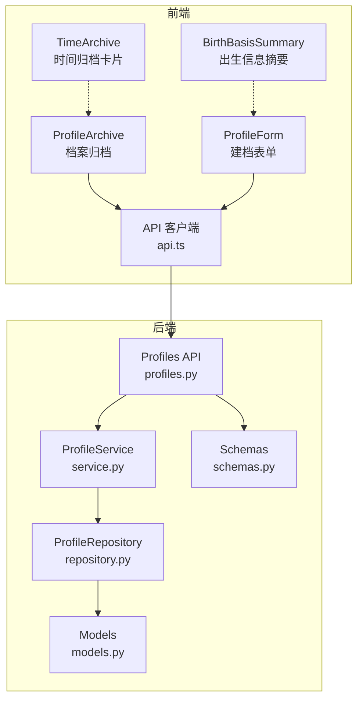
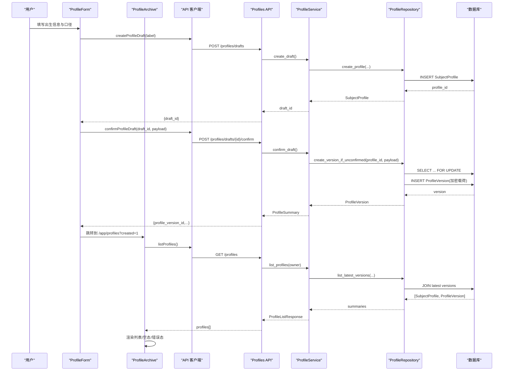
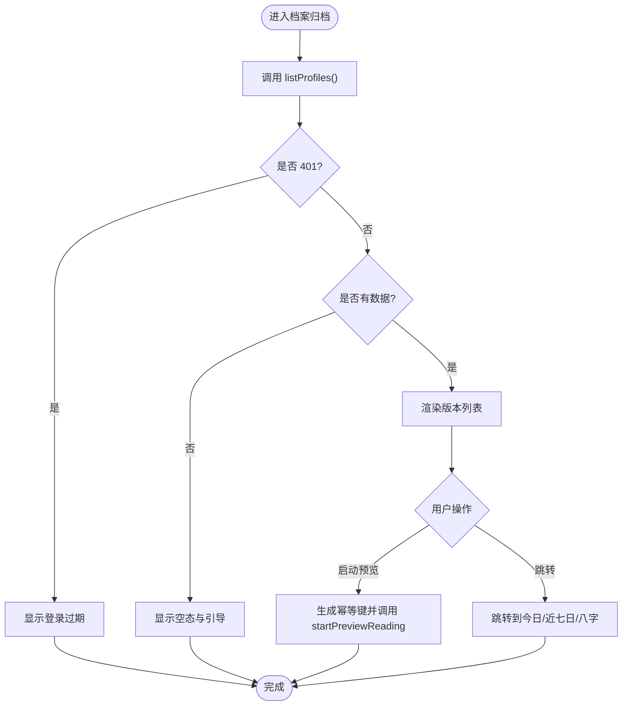
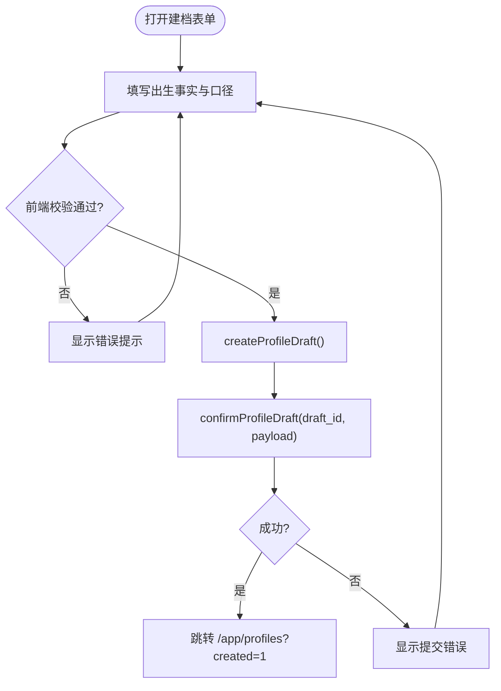
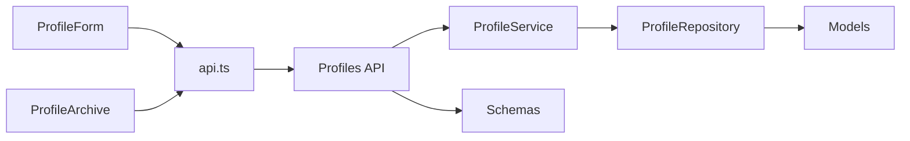

# 用户档案组件

<cite>
**本文引用的文件**
- [profile-archive.tsx](file://web/src/components/profile-archive.tsx)
- [time-archive.tsx](file://web/src/components/time-archive.tsx)
- [birth-basis-summary.tsx](file://web/src/components/birth-basis-summary.tsx)
- [profile-form.tsx](file://web/src/components/profile-form.tsx)
- [api.ts](file://web/src/lib/api.ts)
- [profiles.py](file://backend/app/api/profiles.py)
- [service.py](file://backend/app/profiles/service.py)
- [repository.py](file://backend/app/profiles/repository.py)
- [models.py](file://backend/app/profiles/models.py)
- [schemas.py](file://backend/app/profiles/schemas.py)
</cite>

## 目录
1. [简介](#简介)
2. [项目结构](#项目结构)
3. [核心组件](#核心组件)
4. [架构总览](#架构总览)
5. [详细组件分析](#详细组件分析)
6. [依赖关系分析](#依赖关系分析)
7. [性能与可用性](#性能与可用性)
8. [故障排查指南](#故障排查指南)
9. [结论](#结论)
10. [附录：数据模型与接口契约](#附录数据模型与接口契约)

## 简介
本文件面向“用户档案”相关的前后端组件，系统性说明以下能力：
- 档案归档：创建草稿、确认生成不可变版本、列出最新版本。
- 时间归档：以可视化卡片展示“四柱干支·十神格局图”的入口与说明（当前为静态示意）。
- 出生信息摘要：提交前对出生时间、时区、地点、时间口径、子时口径进行清晰核对。
- 用户数据的展示逻辑：列表呈现安全字段、格式化显示、空态与错误态处理。
- 版本控制机制：基于不可变版本的增量归档，服务端保证并发安全与一致性。
- 历史记录管理：通过“已保存的档案版本”列表查看历史最新快照。
- 状态同步、数据持久化与权限控制：前端状态与后端会话/CSRF/速率限制协同；数据落库加密存储；按用户或访客会话隔离。
- 操作流程与体验优化：分步表单、可访问性提示、防重复提交、幂等键、重试与降级路径。

## 项目结构
围绕用户档案的关键代码分布在 Web 前端与后端服务中：
- 前端
  - 页面与组件：档案归档页、时间归档卡片、出生信息摘要、建档表单。
  - API 客户端：统一请求封装、CSRF 获取、幂等键、类型定义。
- 后端
  - API 路由：档案草稿创建、确认、列表。
  - 领域服务：业务编排、所有权校验、异常映射。
  - 仓储层：数据库操作、行级锁、加密载荷写入。
  - 数据模型：主体档案与不可变版本表结构。
  - 模式校验：Pydantic 校验请求体与响应体。

图表来源
- [profile-archive.tsx:39-256](file://web/src/components/profile-archive.tsx#L39-L256)
- [profile-form.tsx:112-569](file://web/src/components/profile-form.tsx#L112-L569)
- [birth-basis-summary.tsx:43-98](file://web/src/components/birth-basis-summary.tsx#L43-L98)
- [time-archive.tsx:9-63](file://web/src/components/time-archive.tsx#L9-L63)
- [api.ts:394-416](file://web/src/lib/api.ts#L394-L416)
- [profiles.py:43-111](file://backend/app/api/profiles.py#L43-L111)
- [service.py:44-189](file://backend/app/profiles/service.py#L44-L189)
- [repository.py:22-198](file://backend/app/profiles/repository.py#L22-L198)
- [models.py:21-80](file://backend/app/profiles/models.py#L21-L80)
- [schemas.py:10-60](file://backend/app/profiles/schemas.py#L10-L60)

章节来源
- [profile-archive.tsx:39-256](file://web/src/components/profile-archive.tsx#L39-L256)
- [profile-form.tsx:112-569](file://web/src/components/profile-form.tsx#L112-L569)
- [api.ts:394-416](file://web/src/lib/api.ts#L394-L416)
- [profiles.py:43-111](file://backend/app/api/profiles.py#L43-L111)
- [service.py:44-189](file://backend/app/profiles/service.py#L44-L189)
- [repository.py:22-198](file://backend/app/profiles/repository.py#L22-L198)
- [models.py:21-80](file://backend/app/profiles/models.py#L21-L80)
- [schemas.py:10-60](file://backend/app/profiles/schemas.py#L10-L60)

## 核心组件
- ProfileArchive（档案归档）
  - 功能：加载用户已保存的档案版本列表；为空时引导新建；支持从某版本启动预览解读；处理登录过期与错误重试。
  - 关键交互：调用 listProfiles；点击“查看事业主题概览”调用 startPreviewReading；使用幂等键避免重复发起。
  - 状态：loading / error / sessionExpired / empty / success（刚创建）/ actionError。
- ProfileForm（建档表单）
  - 功能：收集出生事实与计算口径；本地校验；创建草稿并确认；成功后跳转至档案归档页。
  - 校验：Zod + react-hook-form；时区必须为有效 IANA；经纬度范围校验；必填项检查。
  - 防重：busyRef 与 aria-busy；提交失败回退错误提示。
- BirthBasisSummary（出生信息摘要）
  - 功能：在提交前将用户输入以只读方式汇总展示；不执行任何本地换算；强调最终口径以服务端为准。
  - 提示：未填写出生时间的风险；真太阳时与农历口径的补充说明。
- TimeArchive（时间归档卡片）
  - 功能：展示“实时天时刻度”的示意卡片，用于品牌与引导；当前不包含动态数据绑定。
- API 客户端（api.ts）
  - 功能：统一 fetch 封装、CSRF 获取与缓存、幂等键校验与透传、类型定义、结果面板脱敏。
  - 档案相关：createProfileDraft、confirmProfileDraft、listProfiles、startPreviewReading 等。

章节来源
- [profile-archive.tsx:39-256](file://web/src/components/profile-archive.tsx#L39-L256)
- [profile-form.tsx:112-569](file://web/src/components/profile-form.tsx#L112-L569)
- [birth-basis-summary.tsx:43-98](file://web/src/components/birth-basis-summary.tsx#L43-L98)
- [time-archive.tsx:9-63](file://web/src/components/time-archive.tsx#L9-L63)
- [api.ts:239-416](file://web/src/lib/api.ts#L239-L416)

## 架构总览
用户档案的端到端流程如下：
- 前端表单采集 → 创建草稿 → 确认生成不可变版本 → 列表展示 → 选择版本启动解读。
- 后端通过服务层协调仓储层，使用行级锁确保同一主体档案仅能确认一次，并记录版本号递增。
- 敏感数据以信封加密后落库，列表仅返回安全摘要。

图表来源
- [profile-form.tsx:166-218](file://web/src/components/profile-form.tsx#L166-L218)
- [api.ts:394-416](file://web/src/lib/api.ts#L394-L416)
- [profiles.py:43-111](file://backend/app/api/profiles.py#L43-L111)
- [service.py:52-113](file://backend/app/profiles/service.py#L52-L113)
- [repository.py:27-78](file://backend/app/profiles/repository.py#L27-L78)
- [models.py:21-80](file://backend/app/profiles/models.py#L21-L80)

## 详细组件分析

### 档案归档（ProfileArchive）
- 数据流
  - 进入页面即调用 listProfiles，根据返回决定渲染：加载中、无档案、有档案、登录过期、错误。
  - 列表项包含“查看事业主题概览”、“今日”、“近七日”快捷入口。
  - “查看事业主题概览”使用稳定幂等键，避免重复点击导致重复任务。
- 状态与错误处理
  - 401 会话过期：引导重新登录。
  - 网络或服务错误：提供重试按钮。
  - 空档案：引导新建档案或直接一事一问。
- 用户体验
  - 新创建成功后的成功态提示，并提供直达八字概览的链接。
  - 列表项入场动画与悬停反馈，提升感知。

图表来源
- [profile-archive.tsx:52-107](file://web/src/components/profile-archive.tsx#L52-L107)
- [api.ts:413-438](file://web/src/lib/api.ts#L413-L438)

章节来源
- [profile-archive.tsx:39-256](file://web/src/components/profile-archive.tsx#L39-L256)
- [api.ts:413-438](file://web/src/lib/api.ts#L413-L438)

### 建档表单（ProfileForm）
- 表单结构与校验
  - 步骤一：出生事实（时间、时区、地点、性别）。
  - 步骤二：计算口径（时间口径、子时口径；真太阳时展开经纬度与来源）。
  - 步骤三：提交前核对（调用 BirthBasisSummary 只读展示）。
  - 校验：Zod 规则覆盖格式、范围、必填；时区需为有效 IANA。
- 提交流程
  - 先创建草稿，再确认；成功后跳转到档案归档页并带 created=1 参数。
  - 提交期间禁用输入，防止重复提交。
- 错误处理
  - 捕获异常并显示友好提示；保持表单可用以便修正。

图表来源
- [profile-form.tsx:66-108](file://web/src/components/profile-form.tsx#L66-L108)
- [profile-form.tsx:166-218](file://web/src/components/profile-form.tsx#L166-L218)
- [api.ts:394-416](file://web/src/lib/api.ts#L394-L416)

章节来源
- [profile-form.tsx:66-108](file://web/src/components/profile-form.tsx#L66-L108)
- [profile-form.tsx:166-218](file://web/src/components/profile-form.tsx#L166-L218)
- [api.ts:394-416](file://web/src/lib/api.ts#L394-L416)

### 出生信息摘要（BirthBasisSummary）
- 职责：提交前的只读复核，帮助用户确认口径与完整性。
- 行为：
  - 若未填写出生时间，给出风险提示。
  - 若选择真太阳时，提示经度可选及可能退回民用时的情况。
  - 若选择农历口径，提示服务端会按该口径规范化。
  - 明确声明“最终以服务端口径为准”，避免前端承担计算责任。

章节来源
- [birth-basis-summary.tsx:43-98](file://web/src/components/birth-basis-summary.tsx#L43-L98)

### 时间归档（TimeArchive）
- 职责：作为品牌与引导卡片，展示“实时天时刻度”的概念与入口文案。
- 现状：纯展示组件，不涉及数据绑定与业务逻辑。

章节来源
- [time-archive.tsx:9-63](file://web/src/components/time-archive.tsx#L9-L63)

## 依赖关系分析
- 前端依赖
  - 组件依赖 api.ts 提供的类型与函数；表单依赖 zod 与 react-hook-form；列表依赖 Next 导航与搜索参数。
- 后端依赖
  - API 路由依赖依赖注入的会话与所有者上下文；服务层依赖仓储层；仓储层依赖模型与加密器。
- 数据与权限
  - 所有写操作均要求 CSRF 令牌与会话；列表读取也需认证。
  - 速率限制针对写操作，防止滥用。
  - 数据隔离：按 user_id 或 guest_session_id 区分归属。

图表来源
- [api.ts:394-416](file://web/src/lib/api.ts#L394-L416)
- [profiles.py:43-111](file://backend/app/api/profiles.py#L43-L111)
- [service.py:44-189](file://backend/app/profiles/service.py#L44-L189)
- [repository.py:22-198](file://backend/app/profiles/repository.py#L22-L198)
- [models.py:21-80](file://backend/app/profiles/models.py#L21-L80)
- [schemas.py:10-60](file://backend/app/profiles/schemas.py#L10-L60)

章节来源
- [api.ts:239-416](file://web/src/lib/api.ts#L239-L416)
- [profiles.py:43-111](file://backend/app/api/profiles.py#L43-L111)
- [service.py:44-189](file://backend/app/profiles/service.py#L44-L189)
- [repository.py:22-198](file://backend/app/profiles/repository.py#L22-L198)
- [models.py:21-80](file://backend/app/profiles/models.py#L21-L80)
- [schemas.py:10-60](file://backend/app/profiles/schemas.py#L10-L60)

## 性能与可用性
- 前端
  - 列表加载采用一次性请求，错误与空态快速反馈；重试按钮降低失败影响。
  - 幂等键避免重复触发长耗时任务；CSRF 缓存减少额外请求。
  - 表单提交期间锁定输入，避免竞态与重复提交。
- 后端
  - 行级锁（FOR UPDATE）序列化同一主体的版本分配，避免并发冲突。
  - 列表查询仅返回安全摘要，减少敏感数据传输。
  - 写操作速率限制保护系统稳定性。
- 可访问性与体验
  - 表单字段具备 aria-* 属性与错误提示；空态与错误态提供明确指引。
  - 动画遵循 prefers-reduced-motion 降级策略。

[本节为通用指导，不直接分析具体文件]

## 故障排查指南
- 登录过期（401）
  - 现象：档案归档页显示“登录已过期”。
  - 原因：会话失效。
  - 处理：引导用户重新登录；前端在 listProfiles 捕获 401 并切换状态。
- 草稿不存在（404）
  - 现象：确认草稿时报错。
  - 原因：草稿已被删除或不属于当前所有者。
  - 处理：引导重新创建草稿。
- 草稿已确认（409）
  - 现象：重复确认同一草稿。
  - 原因：该草稿已生成不可变版本。
  - 处理：直接使用已生成的版本。
- 非法时区或参数
  - 现象：提交失败。
  - 原因：时区非 IANA、经纬度越界、必填缺失。
  - 处理：前端 Zod 校验提示；后端 Pydantic 再次校验。
- 网络与服务异常
  - 现象：请求失败或响应异常。
  - 处理：前端统一 ApiError 包装；提供重试；必要时清空 CSRF 缓存并重试。

章节来源
- [profile-archive.tsx:52-107](file://web/src/components/profile-archive.tsx#L52-L107)
- [profiles.py:78-93](file://backend/app/api/profiles.py#L78-L93)
- [service.py:65-105](file://backend/app/profiles/service.py#L65-L105)
- [api.ts:244-330](file://web/src/lib/api.ts#L244-L330)

## 结论
用户档案模块通过前后端协作实现了安全的档案创建、不可变版本管理与清晰的展示逻辑。前端注重用户体验与可访问性，后端通过行级锁、加密存储与速率限制保障一致性与安全性。整体流程简洁可靠，适合后续扩展更多档案维度与解读场景。

[本节为总结性内容，不直接分析具体文件]

## 附录：数据模型与接口契约
- 数据模型
  - SubjectProfile：主体档案，拥有唯一所有者（用户或访客会话），含标签与状态。
  - ProfileVersion：不可变版本，包含加密载荷与指纹，版本号递增，禁止更新。
- 接口契约（节选）
  - 创建草稿：POST /profiles/drafts，返回 { draft_id }。
  - 确认草稿：POST /profiles/drafts/{draft_id}/confirm，返回 ProfileSummary。
  - 列出档案：GET /profiles，返回 { profiles: ProfileSummary[] }。
  - 预览解读：POST /readings/preview，传入 profile_version_id 与维度等。
- 类型与校验
  - 前端类型：Gender、TimeBasisPolicy、ZiHourPolicy、ProfileSummary 等。
  - 后端校验：Pydantic 严格模式，时区 IANA 校验，数值范围校验。

章节来源
- [models.py:21-80](file://backend/app/profiles/models.py#L21-L80)
- [schemas.py:10-60](file://backend/app/profiles/schemas.py#L10-L60)
- [profiles.py:43-111](file://backend/app/api/profiles.py#L43-L111)
- [api.ts:3-30](file://web/src/lib/api.ts#L3-L30)
- [api.ts:413-438](file://web/src/lib/api.ts#L413-L438)