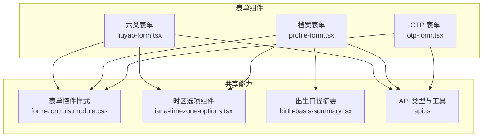
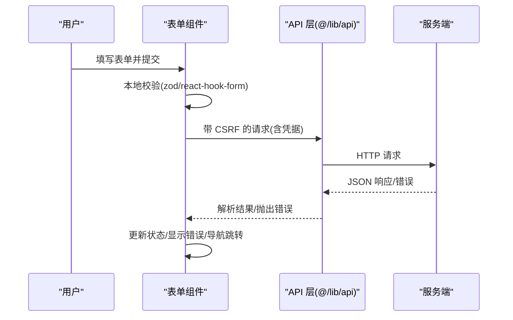
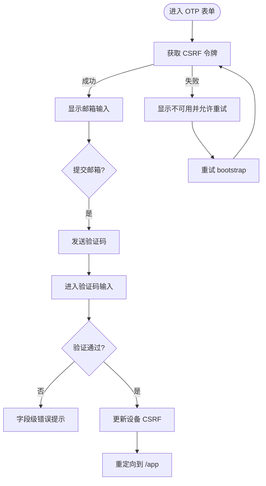
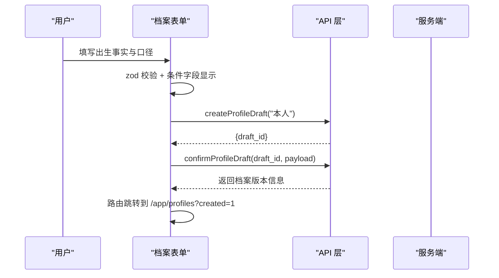
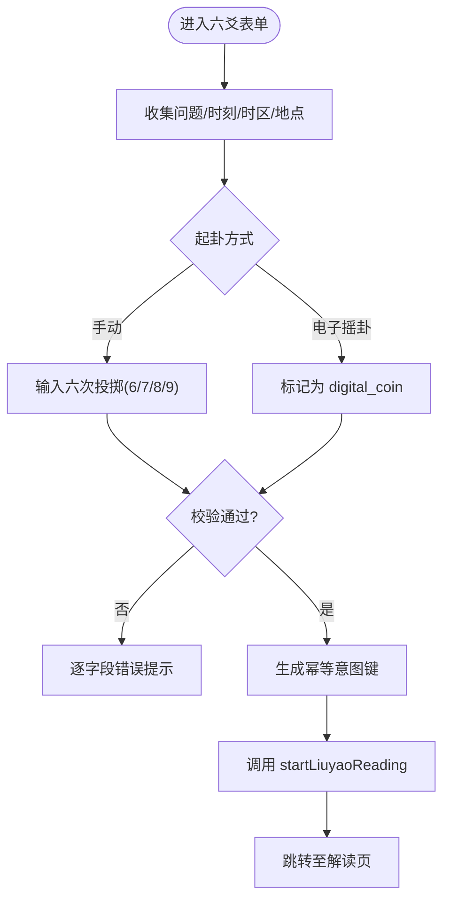
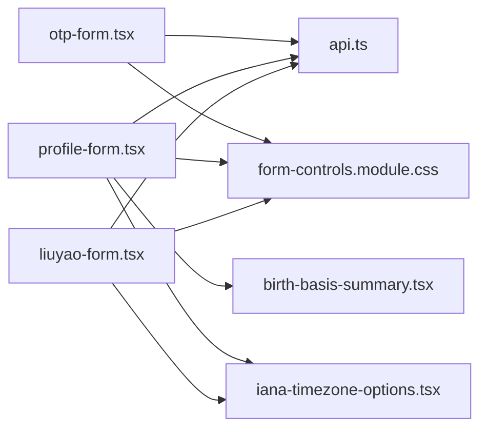

# 表单组件

<cite>
**本文引用的文件**
- [otp-form.tsx](file://web/src/components/otp-form.tsx)
- [profile-form.tsx](file://web/src/components/profile-form.tsx)
- [liuyao-form.tsx](file://web/src/components/liuyao-form.tsx)
- [form-controls.module.css](file://web/src/components/form-controls.module.css)
- [birth-basis-summary.tsx](file://web/src/components/birth-basis-summary.tsx)
- [iana-timezone-options.tsx](file://web/src/components/iana-timezone-options.tsx)
- [api.ts](file://web/src/lib/api.ts)
- [forms.md](file://design-system/mingli-web/pages/forms.md)
- [otp-form.test.tsx](file://web/src/test/otp-form.test.tsx)
- [profile-form.test.tsx](file://web/src/test/profile-form.test.tsx)
- [liuyao-form.test.tsx](file://web/src/test/liuyao-form.test.tsx)
</cite>

## 目录
1. [简介](#简介)
2. [项目结构](#项目结构)
3. [核心组件](#核心组件)
4. [架构总览](#架构总览)
5. [详细组件分析](#详细组件分析)
6. [依赖关系分析](#依赖关系分析)
7. [性能与可用性](#性能与可用性)
8. [故障排查指南](#故障排查指南)
9. [结论](#结论)
10. [附录：组合与扩展](#附录组合与扩展)

## 简介
本文件面向“表单组件”的完整说明，覆盖 OTP 验证表单、用户档案表单、六爻占卜表单三类关键输入界面。文档从实现模式、验证逻辑、错误处理、数据绑定、状态管理、可访问性、用户体验优化到组合与扩展方法进行全面阐述，帮助读者快速理解并安全地复用或扩展这些表单。

## 项目结构
前端表单位于 web/src/components 下，采用 React + Next.js（客户端组件）+ react-hook-form + zod 的组合：
- otp-form.tsx：邮箱验证码登录流程，包含会话引导、发送验证码、校验验证码、建立设备会话并重定向。
- profile-form.tsx：用户档案创建，分三步收集出生事实、计算口径与提交前核对，调用档案草稿与确认接口。
- liuyao-form.tsx：六爻一事一问表单，支持手动输入卦象或电子摇卦，提交后进入解读页面。
- form-controls.module.css：统一的字段、输入框、按钮、错误提示等样式规范。
- birth-basis-summary.tsx：提交前的“出生口径”只读预览，不执行本地换算。
- iana-timezone-options.tsx：基于 datalist 的可搜索 IANA 时区建议列表。
- api.ts：类型定义与通用 API 能力（如 CSRF、时间转换、读取/创建接口类型）。
- design-system/mingli-web/pages/forms.md：设计系统对表单动效、交互与约束的约定。

图表来源
- [otp-form.tsx:1-364](file://web/src/components/otp-form.tsx#L1-L364)
- [profile-form.tsx:1-570](file://web/src/components/profile-form.tsx#L1-L570)
- [liuyao-form.tsx:1-463](file://web/src/components/liuyao-form.tsx#L1-L463)
- [form-controls.module.css:1-176](file://web/src/components/form-controls.module.css#L1-L176)
- [iana-timezone-options.tsx:1-13](file://web/src/components/iana-timezone-options.tsx#L1-L13)
- [birth-basis-summary.tsx:1-98](file://web/src/components/birth-basis-summary.tsx#L1-L98)
- [api.ts:1-200](file://web/src/lib/api.ts#L1-L200)

章节来源
- [otp-form.tsx:1-364](file://web/src/components/otp-form.tsx#L1-L364)
- [profile-form.tsx:1-570](file://web/src/components/profile-form.tsx#L1-L570)
- [liuyao-form.tsx:1-463](file://web/src/components/liuyao-form.tsx#L1-L463)
- [form-controls.module.css:1-176](file://web/src/components/form-controls.module.css#L1-L176)
- [iana-timezone-options.tsx:1-13](file://web/src/components/iana-timezone-options.tsx#L1-L13)
- [birth-basis-summary.tsx:1-98](file://web/src/components/birth-basis-summary.tsx#L1-L98)
- [api.ts:1-200](file://web/src/lib/api.ts#L1-L200)
- [forms.md:1-19](file://design-system/mingli-web/pages/forms.md#L1-L19)

## 核心组件
- OTP 表单：负责建立安全会话、发送邮箱验证码、校验验证码、更新设备 CSRF 并重定向至应用首页。
- 档案表单：分步收集出生事实与计算口径，提交前展示只读摘要，调用后端创建并确认档案草稿。
- 六爻表单：收集问题、起卦时刻与时区地点，支持手动输入卦象或选择电子摇卦，生成幂等意图键后启动解读。

章节来源
- [otp-form.tsx:83-364](file://web/src/components/otp-form.tsx#L83-L364)
- [profile-form.tsx:112-570](file://web/src/components/profile-form.tsx#L112-L570)
- [liuyao-form.tsx:90-463](file://web/src/components/liuyao-form.tsx#L90-L463)

## 架构总览
三个表单均遵循统一模式：
- 使用 react-hook-form 管理表单状态与生命周期。
- 使用 zod 进行字段级与服务端级联合校验。
- 通过 @/lib/api 提供的类型与函数发起网络请求，携带 CSRF Token。
- 使用 IANA 时区白名单与 datalist 提升输入准确性。
- 通过 aria-*、role、aria-live 等属性保障可访问性。
- 通过 CSS 变量与响应式规则保证一致的视觉与交互体验。

图表来源
- [otp-form.tsx:54-73](file://web/src/components/otp-form.tsx#L54-L73)
- [profile-form.tsx:166-218](file://web/src/components/profile-form.tsx#L166-L218)
- [liuyao-form.tsx:150-195](file://web/src/components/liuyao-form.tsx#L150-L195)
- [api.ts:1-200](file://web/src/lib/api.ts#L1-L200)

## 详细组件分析

### OTP 验证表单
- 目标与流程
  - 初始化阶段获取 CSRF 令牌，失败则进入不可用状态并提供重试。
  - 用户输入邮箱地址，发送验证码；成功后进入验证码输入阶段。
  - 验证通过后更新设备 CSRF，显示成功信息并重定向至 /app。
- 验证与错误
  - 邮箱格式由 zod 校验；验证码为六位数字正则校验。
  - 服务端错误会映射为字段错误或全局错误提示，保持无障碍语义。
- 状态管理
  - 使用 phase 状态机控制不同阶段：bootstrapping/unavailable/destination/code/authenticated。
  - 使用 busy 标志防止重复提交，并在切换阶段时重置相关状态。
- 可访问性与 UX
  - 使用 role="status"/role="alert"、aria-invalid、aria-describedby、aria-busy 等。
  - 自动聚焦验证码输入框，提供重新发送与更换邮箱操作。
- 关键路径参考
  - 请求封装与错误处理：[requestJson:54-73](file://web/src/components/otp-form.tsx#L54-L73)
  - 发送验证码与验证：[sendCodeTo:131-166](file://web/src/components/otp-form.tsx#L131-L166)、[verifyCode:180-207](file://web/src/components/otp-form.tsx#L180-L207)
  - 阶段切换与重定向：[phase 渲染:209-364](file://web/src/components/otp-form.tsx#L209-L364)

图表来源
- [otp-form.tsx:101-129](file://web/src/components/otp-form.tsx#L101-L129)
- [otp-form.tsx:131-207](file://web/src/components/otp-form.tsx#L131-L207)
- [otp-form.tsx:209-364](file://web/src/components/otp-form.tsx#L209-L364)

章节来源
- [otp-form.tsx:1-364](file://web/src/components/otp-form.tsx#L1-L364)
- [otp-form.test.tsx:80-313](file://web/src/test/otp-form.test.tsx#L80-L313)

### 用户档案表单
- 目标与流程
  - 第一步：收集出生事实（时间、时区、地点、性别）。
  - 第二步：选择计算口径（时间口径、子时口径），真太阳时可选展开经纬度校准。
  - 第三步：提交前核对，展示只读摘要，确认后创建并确认档案草稿。
- 验证与错误
  - 使用 zod 校验日期格式、时区有效性、地点长度、经纬度范围等。
  - 超纲字段（如非真太阳时的经纬度）不会提交到服务端。
- 状态管理与副作用
  - 使用 useWatch 监听关键字段以驱动摘要展示。
  - 提交时使用 createProfileDraft + confirmProfileDraft 两步流程，避免重复提交。
- 可访问性与 UX
  - 每个字段具备 label、required、aria-invalid、aria-describedby。
  - 错误提示使用 role="alert"，提交中禁用输入并显示锁定提示。
- 关键路径参考
  - 表单 schema 与自定义校验：[profileSchema:66-108](file://web/src/components/profile-form.tsx#L66-L108)
  - 提交处理与数据转换：[handleSave:166-218](file://web/src/components/profile-form.tsx#L166-L218)
  - 摘要组件：[BirthBasisSummary:43-98](file://web/src/components/birth-basis-summary.tsx#L43-L98)

图表来源
- [profile-form.tsx:166-218](file://web/src/components/profile-form.tsx#L166-L218)
- [profile-form.tsx:231-566](file://web/src/components/profile-form.tsx#L231-L566)
- [birth-basis-summary.tsx:43-98](file://web/src/components/birth-basis-summary.tsx#L43-L98)

章节来源
- [profile-form.tsx:1-570](file://web/src/components/profile-form.tsx#L1-L570)
- [profile-form.test.tsx:47-201](file://web/src/test/profile-form.test.tsx#L47-L201)
- [birth-basis-summary.tsx:1-98](file://web/src/components/birth-basis-summary.tsx#L1-L98)

### 六爻占卜表单
- 目标与流程
  - 收集问题、起卦时刻、时区与地点。
  - 选择起卦方式：手动输入六次投掷结果，或选择电子摇卦（由服务端生成）。
  - 生成幂等意图键，调用 startLiuyaoReading 启动解读，随后跳转至解读详情页。
- 验证与错误
  - 问题文本最小长度限制；时间格式校验；时区必须为有效 IANA。
  - 手动模式下，六爻投掷值必须为 6/7/8/9，否则逐条报错。
- 状态管理与副作用
  - 使用 useWatch 监听 cast_mode，动态清理/显示投掷字段错误。
  - 使用 stableKeyForIntent 生成幂等键，避免重复提交导致重复解读。
- 可访问性与 UX
  - 使用 fieldset/legend 组织单选与投掷组；每个字段具备 required 与错误提示。
  - 提交中禁用输入，显示锁定提示；错误区域使用 role="alert"。
- 关键路径参考
  - 表单 schema 与 superRefine：[liuyaoSchema:37-86](file://web/src/components/liuyao-form.tsx#L37-L86)
  - 提交处理与幂等键：[handleStart:150-195](file://web/src/components/liuyao-form.tsx#L150-L195)
  - 时区选项组件：[IanaTimeZoneOptions:4-11](file://web/src/components/iana-timezone-options.tsx#L4-L11)

图表来源
- [liuyao-form.tsx:37-86](file://web/src/components/liuyao-form.tsx#L37-L86)
- [liuyao-form.tsx:150-195](file://web/src/components/liuyao-form.tsx#L150-L195)
- [liuyao-form.tsx:230-458](file://web/src/components/liuyao-form.tsx#L230-L458)

章节来源
- [liuyao-form.tsx:1-463](file://web/src/components/liuyao-form.tsx#L1-L463)
- [liuyao-form.test.tsx:55-204](file://web/src/test/liuyao-form.test.tsx#L55-L204)

## 依赖关系分析
- 组件耦合与内聚
  - 各表单组件高度内聚于自身业务域，通过共享样式与工具模块降低耦合。
  - 时区选择通过 IanaTimeZoneOptions 解耦具体列表来源。
  - 数据模型与 API 类型集中在 api.ts，便于前后端契约对齐。
- 外部依赖
  - react-hook-form：表单状态、生命周期与提交处理。
  - zod：声明式校验，支持复杂规则与自定义错误。
  - next/navigation：路由跳转与重定向。
  - fetch：HTTP 请求，携带 credentials 与 CSRF 头。
- 潜在循环依赖
  - 当前未见循环导入；组件仅单向依赖 lib 与样式模块。

图表来源
- [otp-form.tsx:1-364](file://web/src/components/otp-form.tsx#L1-L364)
- [profile-form.tsx:1-570](file://web/src/components/profile-form.tsx#L1-L570)
- [liuyao-form.tsx:1-463](file://web/src/components/liuyao-form.tsx#L1-L463)
- [api.ts:1-200](file://web/src/lib/api.ts#L1-L200)
- [birth-basis-summary.tsx:1-98](file://web/src/components/birth-basis-summary.tsx#L1-L98)
- [iana-timezone-options.tsx:1-13](file://web/src/components/iana-timezone-options.tsx#L1-L13)
- [form-controls.module.css:1-176](file://web/src/components/form-controls.module.css#L1-L176)

章节来源
- [api.ts:1-200](file://web/src/lib/api.ts#L1-L200)
- [form-controls.module.css:1-176](file://web/src/components/form-controls.module.css#L1-L176)

## 性能与可用性
- 性能考量
  - 表单提交使用防抖/互斥锁（busyRef/busy）避免重复提交。
  - 仅在必要时触发服务端请求（如 OTP 发送、档案确认、解读启动）。
  - 使用 zod 在客户端尽早拦截无效输入，减少无效网络往返。
- 可用性
  - 所有输入具备可见标签、必要提示与错误消息。
  - 使用 aria-live 与 role 增强屏幕阅读器体验。
  - 键盘可达性与焦点管理：验证码输入自动聚焦；错误时聚焦到对应字段。
- 设计系统约束
  - 表单壳层入场动画、反馈动效预算与禁止无限动画等规则，确保一致体验。

章节来源
- [forms.md:7-19](file://design-system/mingli-web/pages/forms.md#L7-L19)
- [otp-form.tsx:83-364](file://web/src/components/otp-form.tsx#L83-L364)
- [profile-form.tsx:112-570](file://web/src/components/profile-form.tsx#L112-L570)
- [liuyao-form.tsx:90-463](file://web/src/components/liuyao-form.tsx#L90-L463)

## 故障排查指南
- 常见错误与定位
  - 服务不可用：OTP 表单在 bootstrap 失败时显示“登录服务暂时不可用”，并提供“重新连接”。
  - 验证码发送失败：将错误映射到 destination 字段，显示友好提示。
  - 验证码验证失败：将错误映射到 code 字段，保留当前阶段以便重试。
  - 档案保存失败：提交错误显示在顶部 alert 区域，不中断用户继续编辑。
  - 六爻启动失败：提交错误显示在表单下方，保持输入可用。
- 调试建议
  - 检查 CSRF Token 是否正确获取与传递。
  - 检查 zod 校验规则是否满足预期（如时区是否为有效 IANA）。
  - 查看测试用例中的 mock 行为，对照实际请求体与响应体。

章节来源
- [otp-form.tsx:101-207](file://web/src/components/otp-form.tsx#L101-L207)
- [profile-form.tsx:166-218](file://web/src/components/profile-form.tsx#L166-L218)
- [liuyao-form.tsx:150-195](file://web/src/components/liuyao-form.tsx#L150-L195)
- [otp-form.test.tsx:282-313](file://web/src/test/otp-form.test.tsx#L282-L313)
- [profile-form.test.tsx:115-146](file://web/src/test/profile-form.test.tsx#L115-L146)
- [liuyao-form.test.tsx:110-158](file://web/src/test/liuyao-form.test.tsx#L110-L158)

## 结论
该套表单组件以 react-hook-form 与 zod 为核心，结合 IANA 时区白名单与统一的样式规范，实现了高可用、可访问且易扩展的输入体验。OTP 表单保障安全会话建立；档案表单强调口径选择的透明与不可变版本化；六爻表单兼顾传统手工输入与现代电子摇卦。三者均通过完善的错误处理与状态管理，确保在网络异常与用户误操作下的稳健表现。

## 附录：组合与扩展
- 组合使用
  - 在页面中按需引入 OtpForm、ProfileForm、LiuyaoForm，并通过路由或布局包裹统一管理。
  - 复用 IanaTimeZoneOptions 作为时区输入辅助，确保时区合法性。
  - 复用 BirthBasisSummary 用于任何需要“提交前只读确认”的场景。
- 自定义扩展
  - 新增字段：在 zod schema 中添加规则，并在 UI 中注册 register 与错误展示。
  - 新增步骤：参照 ProfileForm 的分步结构，增加 section 与导航逻辑。
  - 新增校验：使用 superRefine 表达跨字段依赖校验（如时区与坐标联动）。
  - 新增 API：在 api.ts 中定义类型与函数，组件中调用并保持错误映射一致。
- 最佳实践
  - 始终为输入设置 label、required、aria-invalid、aria-describedby。
  - 使用 noValidate 配合 react-hook-form 提交，避免浏览器默认行为干扰。
  - 提交中禁用输入并显示锁定提示，防止重复提交。
  - 错误消息应简洁明确，优先指向具体字段，其次全局提示。

章节来源
- [profile-form.tsx:231-566](file://web/src/components/profile-form.tsx#L231-L566)
- [liuyao-form.tsx:230-458](file://web/src/components/liuyao-form.tsx#L230-L458)
- [otp-form.tsx:257-360](file://web/src/components/otp-form.tsx#L257-L360)
- [api.ts:1-200](file://web/src/lib/api.ts#L1-L200)