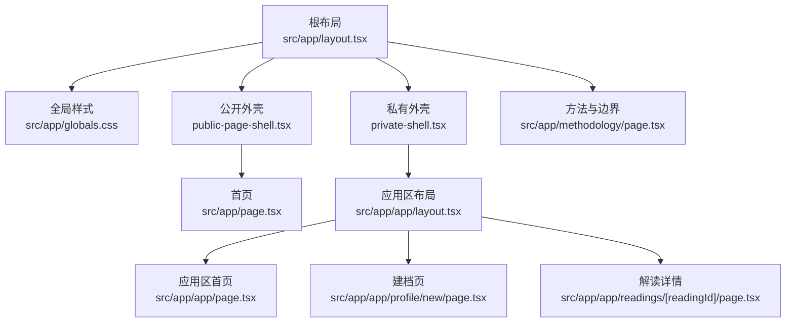
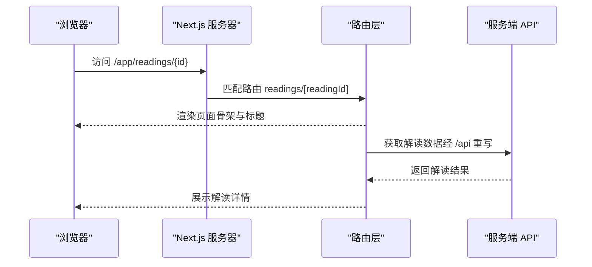
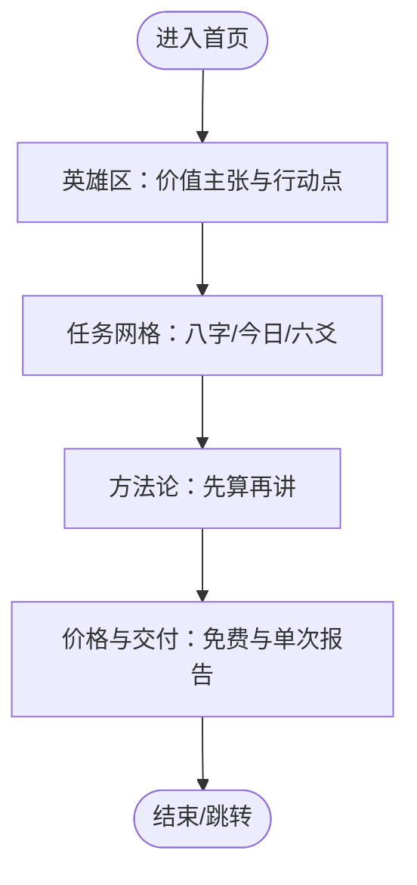
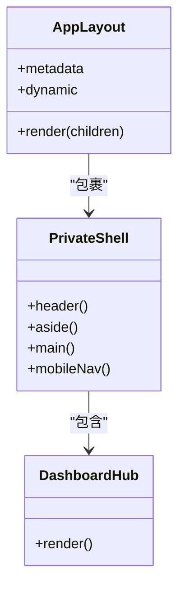
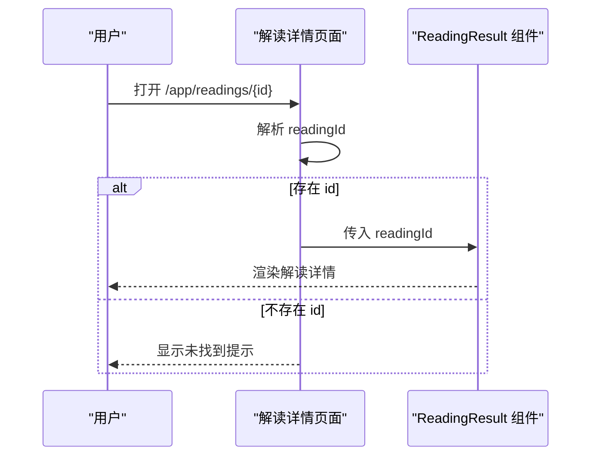
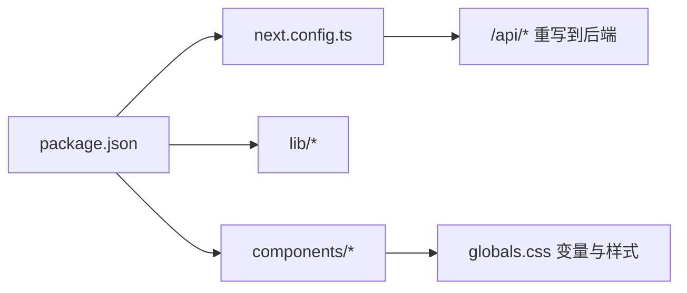

# 用户界面（web）

<cite>
**本文引用的文件**
- [package.json](file://web/package.json)
- [next.config.ts](file://web/next.config.ts)
- [根布局 layout.tsx](file://web/src/app/layout.tsx)
- [全局样式 globals.css](file://web/src/app/globals.css)
- [首页 page.tsx](file://web/src/app/page.tsx)
- [应用区布局 app/layout.tsx](file://web/src/app/app/layout.tsx)
- [应用区首页 app/page.tsx](file://web/src/app/app/page.tsx)
- [账户区布局 account/layout.tsx](file://web/src/app/account/layout.tsx)
- [产品能力与导航 product-capabilities.ts](file://web/src/lib/product-capabilities.ts)
- [公共外壳 public-page-shell.tsx](file://web/src/components/public-page-shell.tsx)
- [私有外壳 private-shell.tsx](file://web/src/components/private-shell.tsx)
- [新建档案页 profile/new/page.tsx](file://web/src/app/app/profile/new/page.tsx)
- [解读详情页 readings/[readingId]/page.tsx](file://web/src/app/app/readings/[readingId]/page.tsx)
- [方法与边界 methodology/page.tsx](file://web/src/app/methodology/page.tsx)
</cite>

## 目录
1. [简介](#简介)
2. [项目结构](#项目结构)
3. [核心组件](#核心组件)
4. [架构总览](#架构总览)
5. [详细组件分析](#详细组件分析)
6. [依赖关系分析](#依赖关系分析)
7. [性能考虑](#性能考虑)
8. [故障排查指南](#故障排查指南)
9. [结论](#结论)
10. [附录](#附录)

## 简介
本文件聚焦 web/ 子项目的用户界面实现，基于 Next.js App Router 组织页面与路由，围绕“首页、档案页面、命理解读页面”等核心功能模块展开。文档同时覆盖响应式设计策略、样式系统（CSS 变量与模块化样式）、主题管理、路由与导航、国际化与字体加载优化、可访问性实践以及性能优化建议。内容以仓库实际代码为依据，避免臆测。

## 项目结构
- 应用根布局位于 src/app/layout.tsx，负责站点级元数据、视口设置与全局字体引入。
- 全局样式集中在 src/app/globals.css，定义颜色、排版、滚动条、焦点可见性与减少动效适配。
- 公开页面使用 src/components/public-page-shell.tsx 包裹 SiteHeader 与 SiteFooter。
- 私密区域通过 src/components/private-shell.tsx 提供侧边导航、跳过链接与主内容区。
- 应用区路由在 src/app/app 下，包含仪表盘、建档、八字、六爻、解读列表与详情等页面。
- 配置集中在 next.config.ts，处理 API 重写、安全头、缓存策略与输出模式。

图表来源
- [根布局 layout.tsx:1-33](file://web/src/app/layout.tsx#L1-L33)
- [全局样式 globals.css:1-177](file://web/src/app/globals.css#L1-L177)
- [公共外壳 public-page-shell.tsx:1-17](file://web/src/components/public-page-shell.tsx#L1-L17)
- [私有外壳 private-shell.tsx:1-88](file://web/src/components/private-shell.tsx#L1-L88)
- [应用区布局 app/layout.tsx:1-19](file://web/src/app/app/layout.tsx#L1-L19)
- [应用区首页 app/page.tsx:1-80](file://web/src/app/app/page.tsx#L1-L80)
- [建档页 profile/new/page.tsx:1-27](file://web/src/app/app/profile/new/page.tsx#L1-L27)
- [解读详情页 readings/[readingId]/page.tsx:1-38](file://web/src/app/app/readings/[readingId]/page.tsx#L1-L38)
- [方法与边界 methodology/page.tsx:1-66](file://web/src/app/methodology/page.tsx#L1-L66)

章节来源
- [根布局 layout.tsx:1-33](file://web/src/app/layout.tsx#L1-L33)
- [全局样式 globals.css:1-177](file://web/src/app/globals.css#L1-L177)
- [next.config.ts:1-66](file://web/next.config.ts#L1-L66)

## 核心组件
- 根布局：设置语言、标题模板、描述、应用名与视口主题色；引入 Noto Sans SC / Noto Serif SC 可变字体。
- 全局样式：集中定义 CSS 变量（墨色、象牙白、金色、陶土色、阴影、圆角、间距、缓动与时长），统一基础排版、按钮与表单样式、焦点可见性与滚动条外观，并提供 prefers-reduced-motion 降级。
- 公开外壳：组合站点头部与底部，承载公开页面的通用 Chrome。
- 私有外壳：提供跳过链接、品牌标识、返回公共首页入口、侧边导航、主内容区与移动端导航；根据当前路径高亮导航项。
- 应用区布局：为私密路由注入 PrivateShell，并强制动态渲染与禁用缓存。
- 产品能力与导航：集中定义三大能力（八字、今日与近七日、一事一问·六爻）的文案、图标、激活前缀与导航项，供首页任务卡片与公共导航复用。

章节来源
- [根布局 layout.tsx:1-33](file://web/src/app/layout.tsx#L1-L33)
- [全局样式 globals.css:1-177](file://web/src/app/globals.css#L1-L177)
- [公共外壳 public-page-shell.tsx:1-17](file://web/src/components/public-page-shell.tsx#L1-L17)
- [私有外壳 private-shell.tsx:1-88](file://web/src/components/private-shell.tsx#L1-L88)
- [应用区布局 app/layout.tsx:1-19](file://web/src/app/app/layout.tsx#L1-L19)
- [产品能力与导航 product-capabilities.ts:1-140](file://web/src/lib/product-capabilities.ts#L1-L140)

## 架构总览
Next.js App Router 将页面按目录组织，根布局提供站点级上下文，公开页面与私密页面分别通过不同 Shell 包裹。API 请求通过 rewrites 代理到后端，所有敏感路由附加私有缓存与安全头。

图表来源
- [解读详情页 readings/[readingId]/page.tsx:1-38](file://web/src/app/app/readings/[readingId]/page.tsx#L1-L38)
- [next.config.ts:31-38](file://web/next.config.ts#L31-L38)

章节来源
- [解读详情页 readings/[readingId]/page.tsx:1-38](file://web/src/app/app/readings/[readingId]/page.tsx#L1-L38)
- [next.config.ts:1-66](file://web/next.config.ts#L1-L66)

## 详细组件分析

### 首页（Public Home）
- 角色：面向访客的着陆页，引导建档、查看短周期节奏与一事一问。
- 结构：使用 PublicPageShell 包裹，包含英雄区、任务网格、方法论说明与价格权益区。
- 交互：通过 ButtonLink 跳转到建档、六爻与定价页；任务卡片由 PRODUCT_CAPABILITIES 驱动，保证 UI 与产品事实一致。
- 可访问性：为关键区块设置 aria-labelledby，图标使用 aria-hidden 避免重复朗读。

图表来源
- [首页 page.tsx:1-279](file://web/src/app/page.tsx#L1-L279)
- [产品能力与导航 product-capabilities.ts:34-92](file://web/src/lib/product-capabilities.ts#L34-L92)

章节来源
- [首页 page.tsx:1-279](file://web/src/app/page.tsx#L1-L279)
- [产品能力与导航 product-capabilities.ts:1-140](file://web/src/lib/product-capabilities.ts#L1-L140)

### 应用区与仪表盘（Private App）
- 角色：私密工作区，聚合档案、任务与已交付解读。
- 布局：AppLayout 注入 PrivateShell，强制动态渲染与禁用缓存，确保状态实时。
- 导航：侧边栏提供首页、档案、问事、解读、账户；移动端提供底部导航。
- 仪表盘：展示“全部任务”，快速进入建档、八字概览与六爻流程。

图表来源
- [应用区布局 app/layout.tsx:1-19](file://web/src/app/app/layout.tsx#L1-L19)
- [私有外壳 private-shell.tsx:1-88](file://web/src/components/private-shell.tsx#L1-L88)
- [应用区首页 app/page.tsx:1-80](file://web/src/app/app/page.tsx#L1-L80)

章节来源
- [应用区布局 app/layout.tsx:1-19](file://web/src/app/app/layout.tsx#L1-L19)
- [应用区首页 app/page.tsx:1-80](file://web/src/app/app/page.tsx#L1-L80)
- [私有外壳 private-shell.tsx:1-88](file://web/src/components/private-shell.tsx#L1-L88)

### 建档流程（Profile New）
- 目标：确认出生资料与时间口径，形成可复现的四柱事实。
- 行为：游客可先核对输入，登录后承诺保存；修改资料产生新版本，不覆盖历史快照。
- 呈现：AppPageHeader 提供标题、描述与元信息提示。

章节来源
- [建档页 profile/new/page.tsx:1-27](file://web/src/app/app/profile/new/page.tsx#L1-L27)

### 解读详情（Readings Detail）
- 目标：展示单份解读的正文、依据与边界，支持现实反馈独立保存。
- 行为：读取 readingId 参数，若缺失则给出提示；否则渲染 ReadingResult。
- 安全：该路由属于私密区，受应用区布局的缓存策略保护。

图表来源
- [解读详情页 readings/[readingId]/page.tsx:1-38](file://web/src/app/app/readings/[readingId]/page.tsx#L1-L38)

章节来源
- [解读详情页 readings/[readingId]/page.tsx:1-38](file://web/src/app/app/readings/[readingId]/page.tsx#L1-L38)

### 方法与边界（Methodology）
- 目标：解释 FateRadar 的“先计算事实、再生成白话、校验后接纳和交付”的流程。
- 结构：EditorialPage 承载方法说明，列出标准解读链与三层职责（确定性命理层、受约束表达层、产品交付层）。

章节来源
- [方法与边界 methodology/page.tsx:1-66](file://web/src/app/methodology/page.tsx#L1-L66)

## 依赖关系分析
- 运行时依赖：Next.js、React、Radix UI、动画库、表单与校验库、图标库与字体包。
- 构建与脚本：开发、构建、测试、类型检查与 ESLint。
- 配置依赖：next.config.ts 控制 API 重写、安全头、缓存策略与输出模式。

图表来源
- [package.json:1-46](file://web/package.json#L1-L46)
- [next.config.ts:1-66](file://web/next.config.ts#L1-L66)
- [全局样式 globals.css:1-177](file://web/src/app/globals.css#L1-L177)

章节来源
- [package.json:1-46](file://web/package.json#L1-L46)
- [next.config.ts:1-66](file://web/next.config.ts#L1-L66)

## 性能考虑
- 字体加载优化
  - 使用可变字体（Noto Sans SC Variable / Noto Serif SC Variable），减少字体变体数量，降低网络开销。
  - 在根布局中直接引入字体，确保首屏文本尽早可用。
- 缓存与隐私
  - 应用区与账户区强制 force-dynamic、revalidate=0、fetchCache=force-no-store，避免敏感数据被缓存。
  - 对 /app 与 /account 路径添加私有缓存头，防止中间节点缓存。
- 安全头
  - 全站启用 CSP、Referrer-Policy、Permissions-Policy、X-Content-Type-Options、X-Frame-Options、COOP，降低攻击面。
- 输出模式
  - 使用 standalone 输出，便于容器化部署与冷启动优化。
- 样式与动效
  - 全局提供 prefers-reduced-motion 降级，尊重用户偏好。
  - 使用 CSS 变量与模块化样式，减少重复样式与体积。

章节来源
- [根布局 layout.tsx:1-33](file://web/src/app/layout.tsx#L1-L33)
- [应用区布局 app/layout.tsx:1-19](file://web/src/app/app/layout.tsx#L1-L19)
- [账户区布局 account/layout.tsx:1-19](file://web/src/app/account/layout.tsx#L1-L19)
- [next.config.ts:1-66](file://web/next.config.ts#L1-L66)
- [全局样式 globals.css:167-177](file://web/src/app/globals.css#L167-L177)

## 故障排查指南
- 无法访问 API
  - 检查 next.config.ts 中的 BACKEND_INTERNAL_URL 与 /api 重写规则是否正确指向后端。
- 页面被错误缓存
  - 确认私密路由是否使用了 force-dynamic、revalidate=0、fetchCache=force-no-store。
- 安全头未生效
  - 检查 headers 配置是否覆盖到对应 source，尤其是 /app/:path* 与 /account/:path*。
- 字体未加载或闪烁
  - 确认根布局引入了可变字体，且浏览器允许加载本地或 CDN 字体资源。
- 移动端导航异常
  - 检查私有外壳的移动端导航类名与媒体查询是否生效，必要时在浏览器开发者工具中调试样式。

章节来源
- [next.config.ts:1-66](file://web/next.config.ts#L1-L66)
- [应用区布局 app/layout.tsx:1-19](file://web/src/app/app/layout.tsx#L1-L19)
- [账户区布局 account/layout.tsx:1-19](file://web/src/app/account/layout.tsx#L1-L19)
- [私有外壳 private-shell.tsx:1-88](file://web/src/components/private-shell.tsx#L1-L88)

## 结论
web/ 采用 Next.js App Router 的目录式路由与布局体系，通过根布局与全局样式建立统一的站点基线；公开页面与私密页面分别通过外壳组件提供一致的 Chrome 与导航体验。样式系统以 CSS 变量为核心，配合模块化样式与可访问性实践，确保可读性与一致性。配置层面通过重写与安全头保障前后端集成与安全性。整体架构清晰、可扩展，适合后续继续扩展更多命理功能与页面。

## 附录
- 响应式设计要点
  - 使用 CSS 变量与弹性布局，结合媒体查询调整栅格与字号；移动端优先展示关键操作。
  - 私有外壳提供移动端导航，确保小屏设备下的可达性。
- 主题管理
  - 通过 :root 变量集中管理色彩、阴影、圆角与间距；可在局部样式文件中按需覆盖。
- 可访问性
  - 为重要区块设置 aria-labelledby，图标使用 aria-hidden；提供跳过链接与焦点可见样式。
- 导航策略
  - 公共导航与应用导航分离；公共导航由产品能力注册表生成，避免 UI 漂移。
- 国际化与字体
  - 当前站点语言固定为 zh-CN，字体通过可变字体优化加载；如需多语言，可在根布局与组件中扩展 i18n 策略。

[本节为概念性补充，不直接分析具体文件]