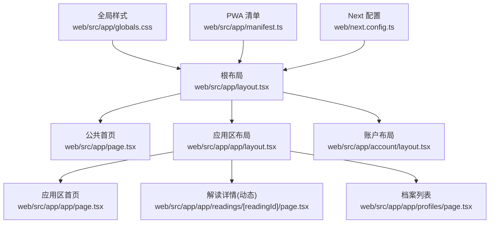
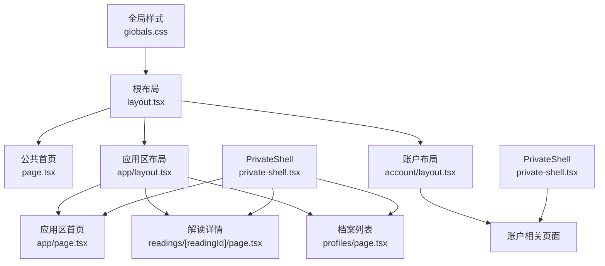
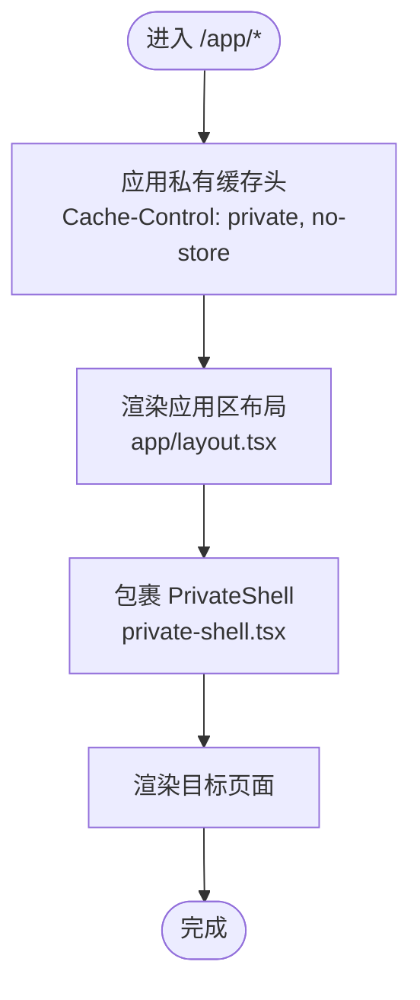
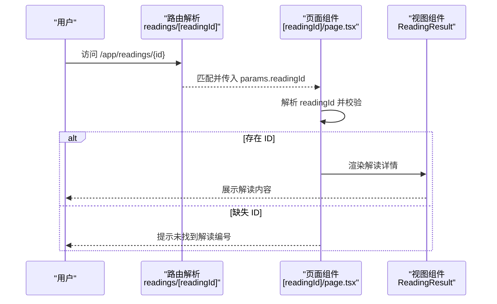
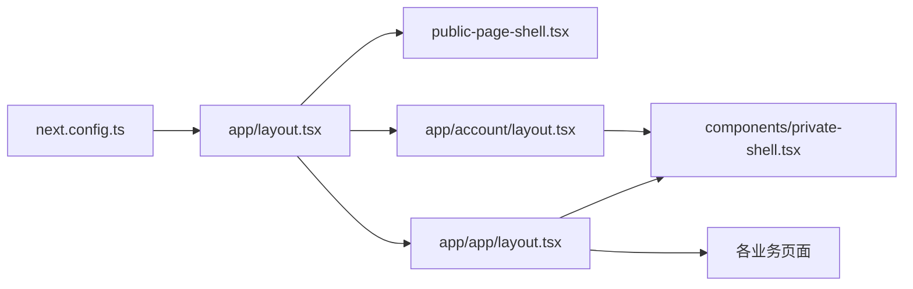

# 页面架构与路由

<cite>
**本文引用的文件**
- [web/src/app/layout.tsx](file://web/src/app/layout.tsx)
- [web/src/app/page.tsx](file://web/src/app/page.tsx)
- [web/src/app/app/layout.tsx](file://web/src/app/app/layout.tsx)
- [web/src/app/app/page.tsx](file://web/src/app/app/page.tsx)
- [web/src/app/app/readings/[readingId]/page.tsx](file://web/src/app/app/readings/[readingId]/page.tsx)
- [web/src/app/app/profiles/page.tsx](file://web/src/app/app/profiles/page.tsx)
- [web/src/app/account/layout.tsx](file://web/src/app/account/layout.tsx)
- [web/src/components/private-shell.tsx](file://web/src/components/private-shell.tsx)
- [web/src/components/public-page-shell.tsx](file://web/src/components/public-page-shell.tsx)
- [web/src/app/error.tsx](file://web/src/app/error.tsx)
- [web/src/app/loading.tsx](file://web/src/app/loading.tsx)
- [web/src/app/not-found.tsx](file://web/src/app/not-found.tsx)
- [web/next.config.ts](file://web/next.config.ts)
- [web/src/app/manifest.ts](file://web/src/app/manifest.ts)
- [web/src/app/globals.css](file://web/src/app/globals.css)
</cite>

## 目录
1. [简介](#简介)
2. [项目结构](#项目结构)
3. [核心组件](#核心组件)
4. [架构总览](#架构总览)
5. [详细组件分析](#详细组件分析)
6. [依赖分析](#依赖分析)
7. [性能考虑](#性能考虑)
8. [故障排查指南](#故障排查指南)
9. [结论](#结论)
10. [附录](#附录)

## 简介
本文件聚焦 Next.js App Router 的页面架构与路由设计，覆盖根布局配置（元数据、视口、全局样式）、页面组织模式（首页、应用区、档案等）、动态路由参数传递、页面间导航策略与状态保持机制、国际化与多语言支持现状、以及面向性能的代码分割与懒加载实践。内容基于仓库中 web 子项目的实际实现进行梳理与图示化说明。

## 项目结构
- 根布局位于 web/src/app/layout.tsx，负责站点级元信息、视口设置与全局样式注入。
- 公共首页位于 web/src/app/page.tsx，使用公共外壳组件承载首屏内容与能力入口。
- 私人应用区位于 web/src/app/app/*，通过独立 layout 包裹 PrivateShell，统一私有区域导航与缓存策略。
- 账户区域位于 web/src/app/account/*，同样使用 PrivateShell 作为壳层。
- 动态路由示例：解读详情采用文件夹命名 [readingId]，通过 useParams 读取路径参数。
- 应用区错误、加载与未找到页面分别以 error.tsx、loading.tsx、not-found.tsx 提供一致的用户体验。
- 站点清单 manifest.ts 定义 PWA 元信息；全局样式 globals.css 集中主题变量与基础样式。
- next.config.ts 配置 API 重写与安全响应头，并对 /app 与 /account 路径附加私有缓存控制。

图表来源
- [web/src/app/layout.tsx:1-33](file://web/src/app/layout.tsx#L1-L33)
- [web/src/app/page.tsx:1-279](file://web/src/app/page.tsx#L1-L279)
- [web/src/app/app/layout.tsx:1-19](file://web/src/app/app/layout.tsx#L1-L19)
- [web/src/app/app/page.tsx:1-80](file://web/src/app/app/page.tsx#L1-L80)
- [web/src/app/app/readings/[readingId]/page.tsx:1-38](file://web/src/app/app/readings/[readingId]/page.tsx#L1-L38)
- [web/src/app/app/profiles/page.tsx:1-43](file://web/src/app/app/profiles/page.tsx#L1-L43)
- [web/src/app/account/layout.tsx:1-19](file://web/src/app/account/layout.tsx#L1-L19)
- [web/src/app/globals.css:1-177](file://web/src/app/globals.css#L1-L177)
- [web/src/app/manifest.ts:1-16](file://web/src/app/manifest.ts#L1-L16)
- [web/next.config.ts:1-66](file://web/next.config.ts#L1-L66)

章节来源
- [web/src/app/layout.tsx:1-33](file://web/src/app/layout.tsx#L1-L33)
- [web/src/app/page.tsx:1-279](file://web/src/app/page.tsx#L1-L279)
- [web/src/app/app/layout.tsx:1-19](file://web/src/app/app/layout.tsx#L1-L19)
- [web/src/app/app/page.tsx:1-80](file://web/src/app/app/page.tsx#L1-L80)
- [web/src/app/app/readings/[readingId]/page.tsx:1-38](file://web/src/app/app/readings/[readingId]/page.tsx#L1-L38)
- [web/src/app/app/profiles/page.tsx:1-43](file://web/src/app/app/profiles/page.tsx#L1-L43)
- [web/src/app/account/layout.tsx:1-19](file://web/src/app/account/layout.tsx#L1-L19)
- [web/src/app/globals.css:1-177](file://web/src/app/globals.css#L1-L177)
- [web/src/app/manifest.ts:1-16](file://web/src/app/manifest.ts#L1-L16)
- [web/next.config.ts:1-66](file://web/next.config.ts#L1-L66)

## 核心组件
- 根布局：导出站点级 Metadata（标题模板、描述、应用名）与 Viewport（设备宽度、初始缩放、主题色），并引入全局字体与 CSS。
- 公共外壳：PublicPageShell 组合 SiteHeader 与 SiteFooter，用于公开页面的统一 chrome。
- 私有外壳：PrivateShell 提供侧边导航、返回公共首页入口、当前路由高亮与可访问性跳转，并通过 RouteEnter 为页面进入添加过渡。
- 应用区布局：为 /app 及其子路由设置“不索引、不缓存”的元信息与强制动态渲染策略，确保用户态数据不被共享缓存命中。
- 账户布局：与 app 布局一致的私有缓存策略与元信息。
- 错误/加载/未找到：在应用区内提供一致的状态面板提示与操作入口。

章节来源
- [web/src/app/layout.tsx:1-33](file://web/src/app/layout.tsx#L1-L33)
- [web/src/components/public-page-shell.tsx:1-17](file://web/src/components/public-page-shell.tsx#L1-L17)
- [web/src/components/private-shell.tsx:1-88](file://web/src/components/private-shell.tsx#L1-L88)
- [web/src/app/app/layout.tsx:1-19](file://web/src/app/app/layout.tsx#L1-L19)
- [web/src/app/account/layout.tsx:1-19](file://web/src/app/account/layout.tsx#L1-L19)
- [web/src/app/error.tsx:1-21](file://web/src/app/error.tsx#L1-L21)
- [web/src/app/loading.tsx:1-16](file://web/src/app/loading.tsx#L1-L16)
- [web/src/app/not-found.tsx:1-18](file://web/src/app/not-found.tsx#L1-L18)

## 架构总览
下图展示从根布局到具体页面的渲染层次，以及应用区与账户区的私有壳层如何包裹业务页面。

图表来源
- [web/src/app/layout.tsx:1-33](file://web/src/app/layout.tsx#L1-L33)
- [web/src/app/page.tsx:1-279](file://web/src/app/page.tsx#L1-L279)
- [web/src/app/app/layout.tsx:1-19](file://web/src/app/app/layout.tsx#L1-L19)
- [web/src/app/app/page.tsx:1-80](file://web/src/app/app/page.tsx#L1-L80)
- [web/src/app/app/readings/[readingId]/page.tsx:1-38](file://web/src/app/app/readings/[readingId]/page.tsx#L1-L38)
- [web/src/app/app/profiles/page.tsx:1-43](file://web/src/app/app/profiles/page.tsx#L1-L43)
- [web/src/app/account/layout.tsx:1-19](file://web/src/app/account/layout.tsx#L1-L19)
- [web/src/components/private-shell.tsx:1-88](file://web/src/components/private-shell.tsx#L1-L88)
- [web/src/app/globals.css:1-177](file://web/src/app/globals.css#L1-L177)

## 详细组件分析

### 根布局与全局配置
- 元数据：设置默认标题模板、站点描述与应用名称，便于 SEO 与浏览器标签页显示。
- 视口：固定设备宽度、初始缩放与浅色主题色，保证移动端一致性。
- 全局样式：引入 Noto Sans SC/Noto Serif SC 可变字体与站点级 CSS 变量，统一排版与色彩体系。
- PWA：manifest.ts 定义应用名、启动路径、主题与语言，利于桌面/移动快捷方式与离线体验。

章节来源
- [web/src/app/layout.tsx:1-33](file://web/src/app/layout.tsx#L1-L33)
- [web/src/app/globals.css:1-177](file://web/src/app/globals.css#L1-L177)
- [web/src/app/manifest.ts:1-16](file://web/src/app/manifest.ts#L1-L16)

### 公共首页与导航入口
- 首页使用 PublicPageShell 包裹，呈现核心价值主张、能力卡片与方法论说明。
- 关键导航指向应用区建档与六爻入口，形成从公域到私域的转化路径。
- 任务卡片与定价区块通过组件化数据驱动渲染，便于后续扩展与维护。

章节来源
- [web/src/app/page.tsx:1-279](file://web/src/app/page.tsx#L1-L279)
- [web/src/components/public-page-shell.tsx:1-17](file://web/src/components/public-page-shell.tsx#L1-L17)

### 应用区布局与状态保持
- 应用区布局声明 robots 不索引与 nocache，配合 next.config.ts 对 /app 与 /account 路径追加私有缓存头，避免跨会话污染。
- 强制动态渲染与 fetchCache 禁用，确保每次请求都获取最新用户态数据。
- PrivateShell 提供统一的侧边导航、当前路由高亮与可访问性优化，提升导航一致性与可用性。

图表来源
- [web/src/app/app/layout.tsx:1-19](file://web/src/app/app/layout.tsx#L1-L19)
- [web/next.config.ts:22-61](file://web/next.config.ts#L22-L61)
- [web/src/components/private-shell.tsx:1-88](file://web/src/components/private-shell.tsx#L1-L88)

章节来源
- [web/src/app/app/layout.tsx:1-19](file://web/src/app/app/layout.tsx#L1-L19)
- [web/next.config.ts:22-61](file://web/next.config.ts#L22-L61)
- [web/src/components/private-shell.tsx:1-88](file://web/src/components/private-shell.tsx#L1-L88)

### 动态路由：解读详情参数传递
- 路由结构：readings/[readingId]/page.tsx 表示动态段 readingId。
- 参数获取：使用 next/navigation 的 useParams 读取 readingId，并进行类型判断与空值处理。
- 渲染逻辑：当存在 readingId 时渲染 ReadingResult 组件；否则给出明确提示引导返回。

图表来源
- [web/src/app/app/readings/[readingId]/page.tsx:1-38](file://web/src/app/app/readings/[readingId]/page.tsx#L1-L38)

章节来源
- [web/src/app/app/readings/[readingId]/page.tsx:1-38](file://web/src/app/app/readings/[readingId]/page.tsx#L1-L38)

### 档案列表与异步加载
- 使用 Suspense 包裹 ProfileArchive，提供 StatusPanel 作为加载占位，改善感知性能。
- 页面头部通过 AppPageHeader 传达不可变版本与新建版本的语义，强化产品心智。

章节来源
- [web/src/app/app/profiles/page.tsx:1-43](file://web/src/app/app/profiles/page.tsx#L1-L43)

### 错误、加载与未找到
- 应用区错误页：提供重试按钮与支持入口，降低用户挫败感。
- 应用区加载页：使用无障碍隐藏标题与状态面板，明确正在读取授权下的真实状态。
- 未找到页：解释资源不存在或无权限的原因，并提供返回解读历史的行动点。

章节来源
- [web/src/app/error.tsx:1-21](file://web/src/app/error.tsx#L1-L21)
- [web/src/app/loading.tsx:1-16](file://web/src/app/loading.tsx#L1-L16)
- [web/src/app/not-found.tsx:1-18](file://web/src/app/not-found.tsx#L1-L18)

### 页面间导航策略与状态保持
- 导航策略：公共首页与应用区通过 ButtonLink 与 PrivateShell 侧边导航进行跳转；当前路由高亮由 isCurrentDestination 判定。
- 状态保持：应用区与账户区通过布局级 dynamic/revalidate/fetchCache 与 next.config.ts 的 headers 规则，确保用户态数据不被缓存复用；API 请求经 rewrites 转发至后端，避免跨域问题。
- 可访问性：PrivateShell 提供“跳到主要内容”的跳过链接，提升键盘与读屏体验。

章节来源
- [web/src/components/private-shell.tsx:1-88](file://web/src/components/private-shell.tsx#L1-L88)
- [web/src/app/app/layout.tsx:1-19](file://web/src/app/app/layout.tsx#L1-L19)
- [web/src/app/account/layout.tsx:1-19](file://web/src/app/account/layout.tsx#L1-L19)
- [web/next.config.ts:31-61](file://web/next.config.ts#L31-L61)

### 国际化与多语言支持现状
- 当前实现未包含 i18n 路由或运行时切换逻辑；根布局 lang 设置为 zh-CN，PWA manifest 也指定中文语言。
- 建议后续扩展：可在根布局或应用区布局中集成 next-intl 或类似方案，结合路由前缀与消息包实现多语言。

章节来源
- [web/src/app/layout.tsx:1-33](file://web/src/app/layout.tsx#L1-L33)
- [web/src/app/manifest.ts:1-16](file://web/src/app/manifest.ts#L1-L16)

## 依赖分析
- 布局与壳层：根布局依赖全局样式与字体；应用区与账户区依赖 PrivateShell；公共首页依赖 PublicPageShell。
- 路由与配置：next.config.ts 将 /api/* 重写至后端，并为 /app 与 /account 附加私有缓存头，保障用户态隔离。
- 组件耦合：PrivateShell 内聚导航与可访问性逻辑，减少页面重复；StatusPanel 统一错误/加载/空态展示。

图表来源
- [web/next.config.ts:1-66](file://web/next.config.ts#L1-L66)
- [web/src/app/layout.tsx:1-33](file://web/src/app/layout.tsx#L1-L33)
- [web/src/components/public-page-shell.tsx:1-17](file://web/src/components/public-page-shell.tsx#L1-L17)
- [web/src/app/app/layout.tsx:1-19](file://web/src/app/app/layout.tsx#L1-L19)
- [web/src/app/account/layout.tsx:1-19](file://web/src/app/account/layout.tsx#L1-L19)
- [web/src/components/private-shell.tsx:1-88](file://web/src/components/private-shell.tsx#L1-L88)

章节来源
- [web/next.config.ts:1-66](file://web/next.config.ts#L1-L66)
- [web/src/app/layout.tsx:1-33](file://web/src/app/layout.tsx#L1-L33)
- [web/src/components/private-shell.tsx:1-88](file://web/src/components/private-shell.tsx#L1-L88)

## 性能考虑
- 代码分割与按需加载
  - 利用 Next.js 自动按路由拆分客户端代码；将大体积组件（如图表、工作区）放入子模块，按需导入。
  - 对非首屏或重型交互组件使用 React.lazy + Suspense 包裹，结合 StatusPanel 提供友好加载反馈。
- 数据获取与缓存
  - 应用区与账户区通过布局级 force-dynamic、revalidate=0、fetchCache="force-no-store" 与 next.config.ts 的私有缓存头，避免跨会话缓存污染。
  - API 请求通过 rewrites 代理至后端，减少跨域开销与配置复杂度。
- 资源与样式
  - 全局样式集中在 globals.css，使用 CSS 变量管理主题，减少重复样式与运行时计算。
  - 字体采用可变字体，减少请求数量并提升排版质量。
- 可访问性与交互
  - 提供 skip link、aria-label 与 sr-only 文本，提升键盘与读屏体验。
  - 使用 motion 与过渡动画增强页面进入体验，同时尊重 prefers-reduced-motion。

[本节为通用性能建议，不直接引用特定文件]

## 故障排查指南
- 应用区报错
  - 现象：页面无法载入或数据异常。
  - 处理：查看错误页提供的重试按钮与支持入口；检查网络与后端连通性；确认会话与权限。
- 加载卡顿
  - 现象：长时间处于加载状态。
  - 处理：确认 Suspense 边界是否合理；检查数据接口耗时；必要时增加更细粒度的加载提示。
- 未找到页面
  - 现象：访问 /app 下不存在的路径。
  - 处理：核对路由是否存在；检查动态段参数是否正确；通过“返回解读历史”快速回到可用路径。

章节来源
- [web/src/app/error.tsx:1-21](file://web/src/app/error.tsx#L1-L21)
- [web/src/app/loading.tsx:1-16](file://web/src/app/loading.tsx#L1-L16)
- [web/src/app/not-found.tsx:1-18](file://web/src/app/not-found.tsx#L1-L18)

## 结论
本项目采用 Next.js App Router 的目录式路由与布局分层，根布局负责站点级元信息与全局样式，应用区与账户区通过私有壳层统一导航与缓存策略，动态路由清晰表达参数传递。整体架构兼顾了用户体验、可访问性与安全性，并在性能层面通过代码分割、懒加载与严格的缓存控制达成平衡。后续可在此基础上扩展国际化、进一步细化组件懒加载与数据预取策略。

## 附录
- 安全与隐私
  - CSP、Referrer-Policy、Permissions-Policy 等响应头在 next.config.ts 中集中配置，限制外部资源与敏感能力。
  - /app 与 /account 路径附加私有缓存头，防止中间节点缓存用户态数据。
- PWA
  - manifest.ts 定义应用名、启动路径与主题，便于安装与离线体验。

章节来源
- [web/next.config.ts:7-61](file://web/next.config.ts#L7-L61)
- [web/src/app/manifest.ts:1-16](file://web/src/app/manifest.ts#L1-L16)