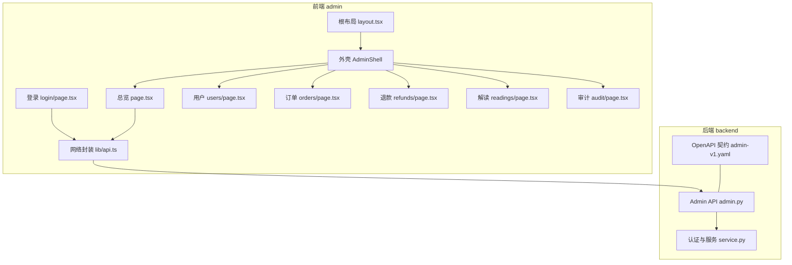
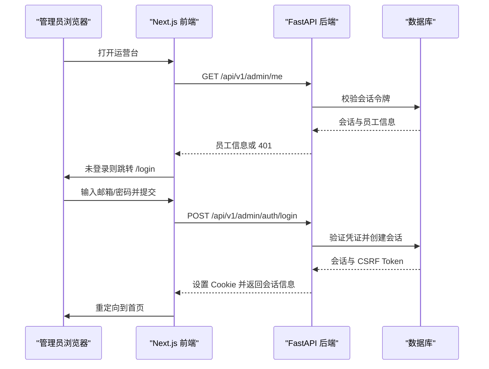
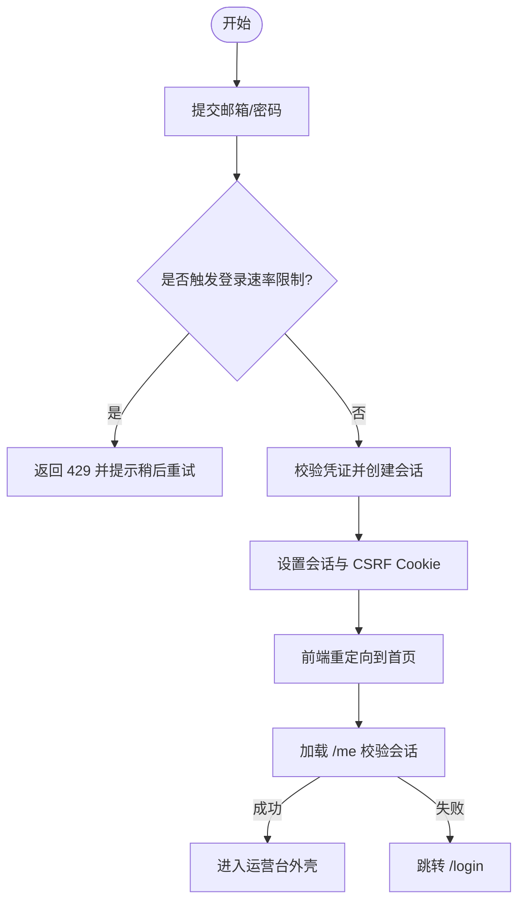
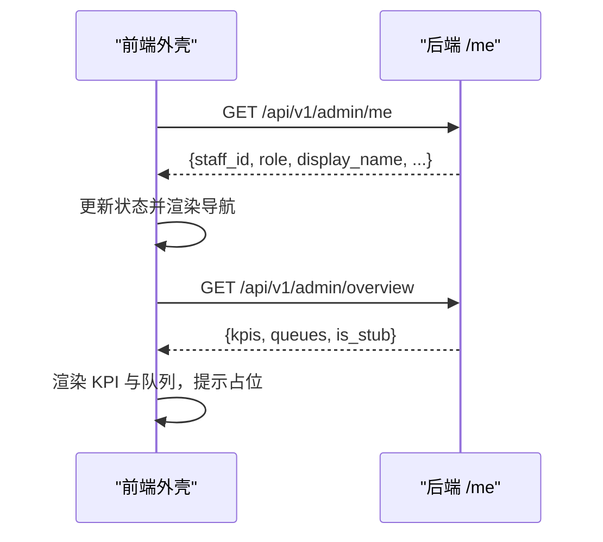
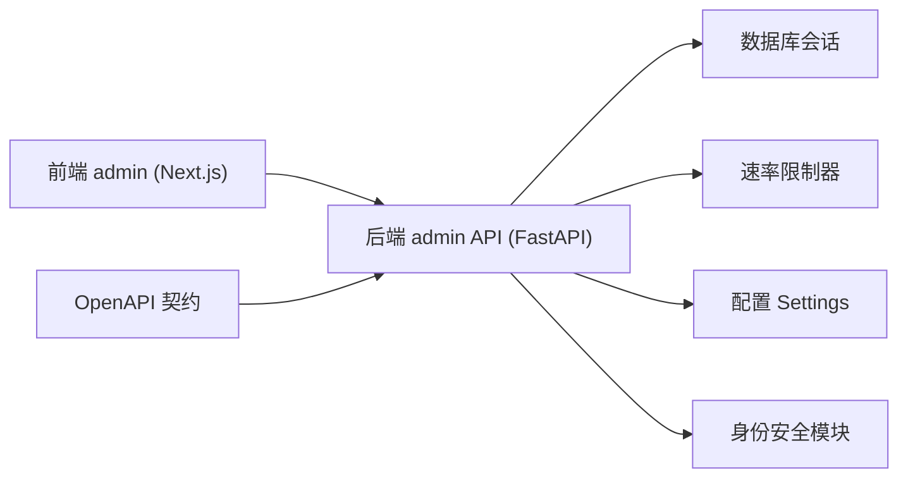

# 管理后台（admin）

<cite>
**本文引用的文件**
- [layout.tsx](file://admin/src/app/layout.tsx)
- [page.tsx](file://admin/src/app/page.tsx)
- [login/page.tsx](file://admin/src/app/login/page.tsx)
- [users/page.tsx](file://admin/src/app/users/page.tsx)
- [orders/page.tsx](file://admin/src/app/orders/page.tsx)
- [refunds/page.tsx](file://admin/src/app/refunds/page.tsx)
- [readings/page.tsx](file://admin/src/app/readings/page.tsx)
- [audit/page.tsx](file://admin/src/app/audit/page.tsx)
- [admin-shell.tsx](file://admin/src/components/admin-shell.tsx)
- [api.ts](file://admin/src/lib/api.ts)
- [env.ts](file://admin/src/lib/env.ts)
- [package.json](file://admin/package.json)
- [admin.py](file://backend/app/api/admin.py)
- [service.py](file://backend/app/admin/service.py)
- [admin-v1.yaml](file://contracts/openapi/admin-v1.yaml)
</cite>

## 目录
1. [简介](#简介)
2. [项目结构](#项目结构)
3. [核心组件](#核心组件)
4. [架构总览](#架构总览)
5. [详细组件分析](#详细组件分析)
6. [依赖关系分析](#依赖关系分析)
7. [性能考虑](#性能考虑)
8. [故障排查指南](#故障排查指南)
9. [结论](#结论)
10. [附录](#附录)

## 简介
本文件为 FateRadar 管理后台（admin/）的完整技术文档，聚焦管理员认证、权限控制、数据展示与状态同步机制，覆盖审计日志、订单管理、用户管理等核心管理功能的前端实现与后端 API 交互。同时说明安全策略（CSRF、会话 Cookie、速率限制）、错误处理模式、可扩展点与定制方法，并提供管理员工作流与操作指引。

## 项目结构
管理后台基于 Next.js 应用，采用“页面即路由”的组织方式：每个管理功能对应一个页面文件；公共外壳通过 AdminShell 提供导航、会话校验与退出能力；通用网络请求封装在 api.ts 中，统一处理 CSRF、凭据与错误响应。后端提供独立的 /api/v1/admin/* 接口，使用 Cookie 进行会话管理，并通过 OpenAPI 契约约束前后端交互。

图表来源
- [layout.tsx:8-22](file://admin/src/app/layout.tsx#L8-L22)
- [admin-shell.tsx:13-20](file://admin/src/components/admin-shell.tsx#L13-L20)
- [page.tsx:26-45](file://admin/src/app/page.tsx#L26-L45)
- [login/page.tsx:17-31](file://admin/src/app/login/page.tsx#L17-L31)
- [api.ts:43-79](file://admin/src/lib/api.ts#L43-L79)
- [admin.py:103-199](file://backend/app/api/admin.py#L103-L199)
- [service.py:33-148](file://backend/app/admin/service.py#L33-L148)
- [admin-v1.yaml:15-82](file://contracts/openapi/admin-v1.yaml#L15-L82)

章节来源
- [layout.tsx:8-22](file://admin/src/app/layout.tsx#L8-L22)
- [admin-shell.tsx:13-20](file://admin/src/components/admin-shell.tsx#L13-L20)
- [api.ts:43-79](file://admin/src/lib/api.ts#L43-L79)
- [admin.py:103-199](file://backend/app/api/admin.py#L103-L199)
- [service.py:33-148](file://backend/app/admin/service.py#L33-L148)
- [admin-v1.yaml:15-82](file://contracts/openapi/admin-v1.yaml#L15-L82)

## 核心组件
- 根布局与元信息：设置站点标题、描述、robots 与视口，确保后台不被索引且仅面向内部使用。
- 外壳 AdminShell：负责导航菜单、当前页高亮、会话校验（调用 /api/v1/admin/me），未登录时跳转登录页；提供退出按钮并调用登出接口。
- 登录页：提交邮箱与密码至 /api/v1/admin/auth/login，成功后重定向到首页。
- 总览页：拉取 /api/v1/admin/overview，渲染 KPI 与工作队列；当后端返回占位数据时给出提示。
- 其他管理页面：用户档案、订单支付、退款审批、解读任务、审计日志目前为占位页面，预留 Phase B/C 接入点。
- 网络封装 api.ts：统一读取 CSRF Cookie、注入 x-csrf-token、携带 same-origin 凭据、解析问题文档错误并返回统一结果对象。
- 环境标识 env.ts：读取部署环境变量用于显示环境徽章。

章节来源
- [layout.tsx:8-22](file://admin/src/app/layout.tsx#L8-L22)
- [admin-shell.tsx:22-59](file://admin/src/components/admin-shell.tsx#L22-L59)
- [login/page.tsx:17-31](file://admin/src/app/login/page.tsx#L17-L31)
- [page.tsx:26-45](file://admin/src/app/page.tsx#L26-L45)
- [users/page.tsx:4-10](file://admin/src/app/users/page.tsx#L4-L10)
- [orders/page.tsx:4-10](file://admin/src/app/orders/page.tsx#L4-L10)
- [refunds/page.tsx:4-10](file://admin/src/app/refunds/page.tsx#L4-L10)
- [readings/page.tsx:4-10](file://admin/src/app/readings/page.tsx#L4-L10)
- [audit/page.tsx:4-10](file://admin/src/app/audit/page.tsx#L4-L10)
- [api.ts:28-79](file://admin/src/lib/api.ts#L28-L79)
- [env.ts:3-9](file://admin/src/lib/env.ts#L3-L9)

## 架构总览
管理后台采用“前端 Next.js + 后端 FastAPI”的分离式架构。前端通过统一的 adminFetch 发起同源请求，自动携带 Cookie 与 CSRF Token；后端通过依赖注入获取数据库会话，校验会话与 CSRF，执行认证与会话生命周期管理，并以 OpenAPI 契约对外暴露接口。

图表来源
- [admin-shell.tsx:36-59](file://admin/src/components/admin-shell.tsx#L36-L59)
- [login/page.tsx:17-31](file://admin/src/app/login/page.tsx#L17-L31)
- [admin.py:103-163](file://backend/app/api/admin.py#L103-L163)
- [service.py:49-89](file://backend/app/admin/service.py#L49-L89)
- [admin-v1.yaml:15-54](file://contracts/openapi/admin-v1.yaml#L15-L54)

## 详细组件分析

### 管理员认证与会话
- 登录流程：前端提交邮箱与密码到 /api/v1/admin/auth/login；后端进行速率限制、凭证校验、创建会话与 CSRF Token，设置 HttpOnly 会话 Cookie 与可读 CSRF Cookie，并返回会话信息。
- 会话校验：受保护接口通过 require_staff_session 从 Cookie 读取会话令牌，查询数据库验证有效性；需要写操作的接口额外通过 require_staff_csrf 校验双提交 CSRF。
- 登出流程：前端调用 /api/v1/admin/auth/logout 并携带 CSRF；后端撤销会话、清除 Cookie 并返回 204。
- 当前用户：/api/v1/admin/me 返回当前员工信息，供外壳组件显示角色与姓名。

图表来源
- [admin.py:56-65](file://backend/app/api/admin.py#L56-L65)
- [admin.py:103-145](file://backend/app/api/admin.py#L103-L145)
- [admin.py:148-163](file://backend/app/api/admin.py#L148-L163)
- [admin.py:166-185](file://backend/app/api/admin.py#L166-L185)
- [service.py:49-89](file://backend/app/admin/service.py#L49-L89)
- [admin-v1.yaml:15-54](file://contracts/openapi/admin-v1.yaml#L15-L54)

章节来源
- [admin.py:56-65](file://backend/app/api/admin.py#L56-L65)
- [admin.py:103-163](file://backend/app/api/admin.py#L103-L163)
- [service.py:49-89](file://backend/app/admin/service.py#L49-L89)
- [admin-v1.yaml:15-54](file://contracts/openapi/admin-v1.yaml#L15-L54)

### 权限控制与安全
- 角色模型：支持 support、finance、ops、superadmin 四类角色，由后端返回并在前端外壳展示。
- CSRF 防护：写操作必须携带 x-csrf-token 头，且与 Cookie 中的 mingli_admin_csrf 匹配；后端使用 HMAC 比较防止篡改。
- 速率限制：登录接口按邮箱桶进行窗口限流，防止暴力破解。
- 会话安全：会话令牌与 CSRF Token 均以哈希形式存储，Cookie 标记私有与过期时间。
- 访问控制：所有受保护接口均要求有效会话；需要写操作的接口强制 CSRF 校验。

章节来源
- [admin.py:68-100](file://backend/app/api/admin.py#L68-L100)
- [admin.py:103-163](file://backend/app/api/admin.py#L103-L163)
- [api.ts:43-79](file://admin/src/lib/api.ts#L43-L79)
- [admin-v1.yaml:84-91](file://contracts/openapi/admin-v1.yaml#L84-L91)

### 数据展示与状态管理
- 总览页：调用 /api/v1/admin/overview 获取 KPI 与工作队列；若 is_stub 为真，前端提示“待接入”。
- 外壳状态：AdminShell 在挂载时调用 /api/v1/admin/me，根据返回决定显示员工信息与导航；401 时跳转登录。
- 错误展示：网络层将问题文档 title 提取为错误消息，外壳与登录页以醒目样式呈现。
- 占位页面：用户、订单、退款、解读、审计等页面已预留结构与文案，等待后续阶段接入领域 API。

图表来源
- [admin-shell.tsx:36-59](file://admin/src/components/admin-shell.tsx#L36-L59)
- [page.tsx:30-45](file://admin/src/app/page.tsx#L30-L45)
- [admin.py:166-199](file://backend/app/api/admin.py#L166-L199)
- [service.py:132-148](file://backend/app/admin/service.py#L132-L148)

章节来源
- [page.tsx:26-45](file://admin/src/app/page.tsx#L26-L45)
- [admin-shell.tsx:36-59](file://admin/src/components/admin-shell.tsx#L36-L59)
- [admin.py:166-199](file://backend/app/api/admin.py#L166-L199)
- [service.py:132-148](file://backend/app/admin/service.py#L132-L148)

### 审计日志
- 事件记录：登录与登出操作在后端服务层写入审计事件，包含操作人、会话 ID、动作类型与元数据。
- 前端展示：审计列表页面目前为占位，标注“Phase B 接 audit-events API”，便于后续接入。

章节来源
- [service.py:75-82](file://backend/app/admin/service.py#L75-L82)
- [service.py:91-101](file://backend/app/admin/service.py#L91-L101)
- [audit/page.tsx:4-10](file://admin/src/app/audit/page.tsx#L4-L10)

### 订单管理与退款审批
- 订单支付：页面已定义职责与文案，等待接入订单与支付事实查询 API。
- 退款审批：页面强调审批前查看权益影响，并要求通过/驳回原因；等待接入写路径。

章节来源
- [orders/page.tsx:4-10](file://admin/src/app/orders/page.tsx#L4-L10)
- [refunds/page.tsx:4-10](file://admin/src/app/refunds/page.tsx#L4-L10)

### 用户管理
- 用户档案：页面声明只读查询与敏感字段打码策略，等待接入 Admin users API。

章节来源
- [users/page.tsx:4-10](file://admin/src/app/users/page.tsx#L4-L10)

### 解读任务
- 解读任务：页面关注失败与卡住任务，并提示重试受领域门禁；等待接入 readings API。

章节来源
- [readings/page.tsx:4-10](file://admin/src/app/readings/page.tsx#L4-L10)

## 依赖关系分析
- 前端依赖：Next.js、React、字体与图标库；脚本端口 3001；构建与启动命令在 package.json。
- 后端依赖：FastAPI、SQLAlchemy 异步会话、速率限制器、配置与身份安全模块。
- 契约依赖：OpenAPI 定义了管理员接口、参数、响应与错误模型，保证前后端一致性。

图表来源
- [package.json:9-14](file://admin/package.json#L9-L14)
- [admin.py:8-31](file://backend/app/api/admin.py#L8-L31)
- [admin-v1.yaml:1-14](file://contracts/openapi/admin-v1.yaml#L1-14)

章节来源
- [package.json:9-14](file://admin/package.json#L9-L14)
- [admin.py:8-31](file://backend/app/api/admin.py#L8-L31)
- [admin-v1.yaml:1-14](file://contracts/openapi/admin-v1.yaml#L1-14)

## 性能考虑
- 无缓存策略：网络请求禁用缓存，避免会话与敏感数据被缓存。
- 会话复用：外壳在挂载时仅调用一次 /me，减少重复鉴权开销。
- 速率限制：登录接口按邮箱桶限流，降低暴力攻击风险与服务器压力。
- 占位数据：总览返回 is_stub 可快速渲染 UI，避免阻塞主流程。

[本节为通用指导，不直接分析具体文件]

## 故障排查指南
- 401 未认证：检查 Cookie 是否存在且未过期；确认 /me 返回 401 时前端会跳转登录。
- 403 CSRF 失败：确认请求头包含 x-csrf-token，且与 Cookie 值一致；写操作必须携带该头。
- 429 登录受限：检查是否短时间内多次尝试登录；等待窗口期后再试。
- 总览不可用：若返回 is_stub，表示领域计数尚未接入；检查后端 overview 实现。
- 页面空白或报错：查看外壳 loadError 与登录页 error 状态，定位网络层返回的问题文档 title。

章节来源
- [admin-shell.tsx:36-59](file://admin/src/components/admin-shell.tsx#L36-L59)
- [login/page.tsx:17-31](file://admin/src/app/login/page.tsx#L17-L31)
- [api.ts:43-79](file://admin/src/lib/api.ts#L43-L79)
- [admin.py:68-100](file://backend/app/api/admin.py#L68-L100)
- [admin.py:103-163](file://backend/app/api/admin.py#L103-L163)

## 结论
管理后台以清晰的职责划分实现了管理员认证、会话与 CSRF 安全、基础总览展示与占位管理页面。后端通过 OpenAPI 契约与速率限制保障接口稳定性与安全性。后续可按 Phase B/C 逐步接入用户、订单、退款、解读与审计等能力，扩展业务视图与写操作路径。

[本节为总结性内容，不直接分析具体文件]

## 附录

### 管理员工作流与操作指南
- 首次登录：使用 bootstrap 账号（仅在 local/test 允许）或通过已有员工账号登录；登录后系统设置会话与 CSRF Cookie。
- 日常巡检：进入总览查看 KPI 与工作队列；关注异常与待办事项。
- 审计与合规：登录与登出操作会被记录到审计事件；必要时导出审计日志进行核查。
- 退出：点击外壳右上角“退出”，系统将撤销会话并清除 Cookie。

章节来源
- [service.py:103-129](file://backend/app/admin/service.py#L103-L129)
- [admin-shell.tsx:56-59](file://admin/src/components/admin-shell.tsx#L56-L59)
- [service.py:75-82](file://backend/app/admin/service.py#L75-L82)
- [service.py:91-101](file://backend/app/admin/service.py#L91-L101)

### 扩展与定制方法
- 新增管理页面：在 admin/src/app 下新建页面文件，使用 AdminShell 包裹内容与职责说明；如需数据，调用 adminFetch 并渲染。
- 新增 API：在后端 app/api/admin.py 添加路由，遵循 OpenAPI 契约；在服务层实现业务逻辑并记录审计事件。
- 权限扩展：在角色枚举中添加新角色，并在需要时于前端外壳或页面中进行差异化展示与控制。
- 环境区分：通过 env.ts 读取部署环境，结合 EnvBadge 显示当前环境，便于开发与运维识别。

章节来源
- [admin-shell.tsx:13-20](file://admin/src/components/admin-shell.tsx#L13-L20)
- [api.ts:43-79](file://admin/src/lib/api.ts#L43-L79)
- [admin.py:33-33](file://backend/app/api/admin.py#L33-L33)
- [admin-v1.yaml:194-196](file://contracts/openapi/admin-v1.yaml#L194-L196)
- [env.ts:3-9](file://admin/src/lib/env.ts#L3-L9)