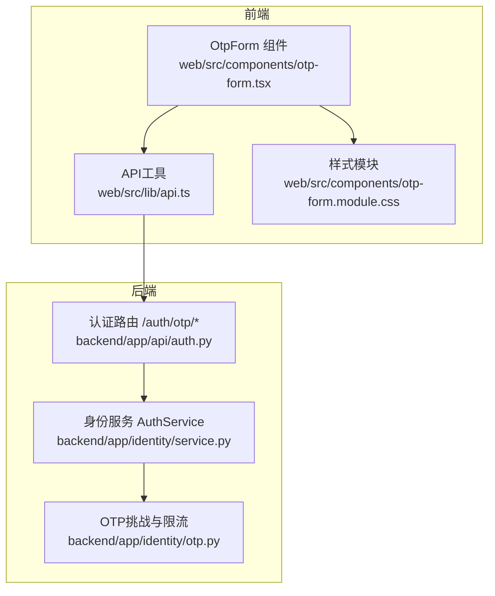
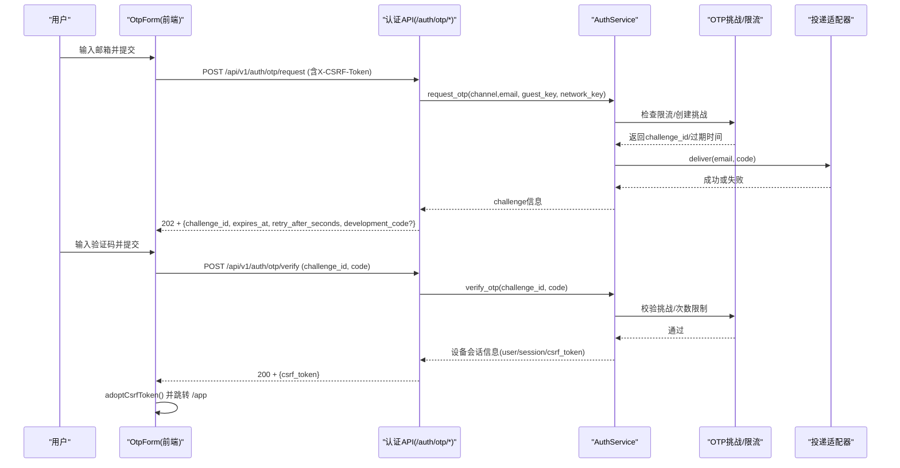
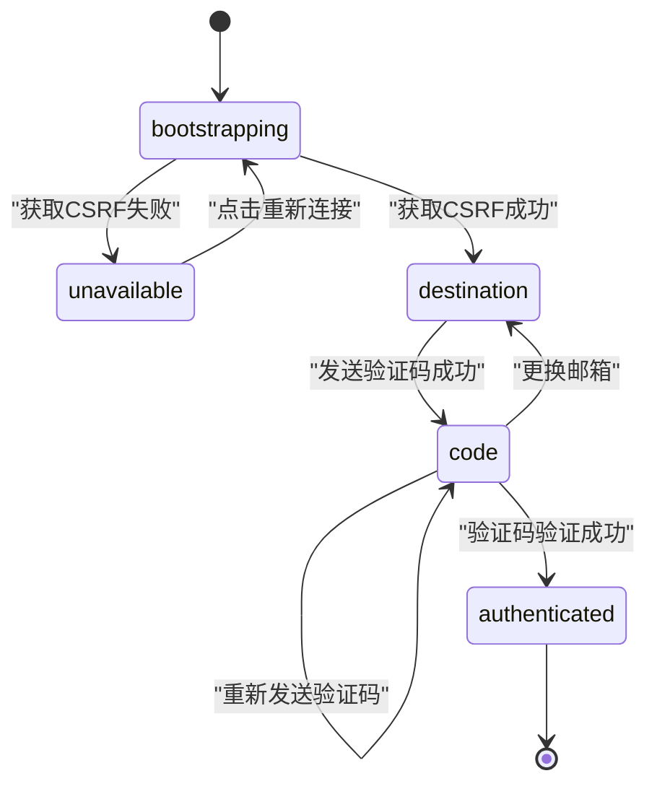
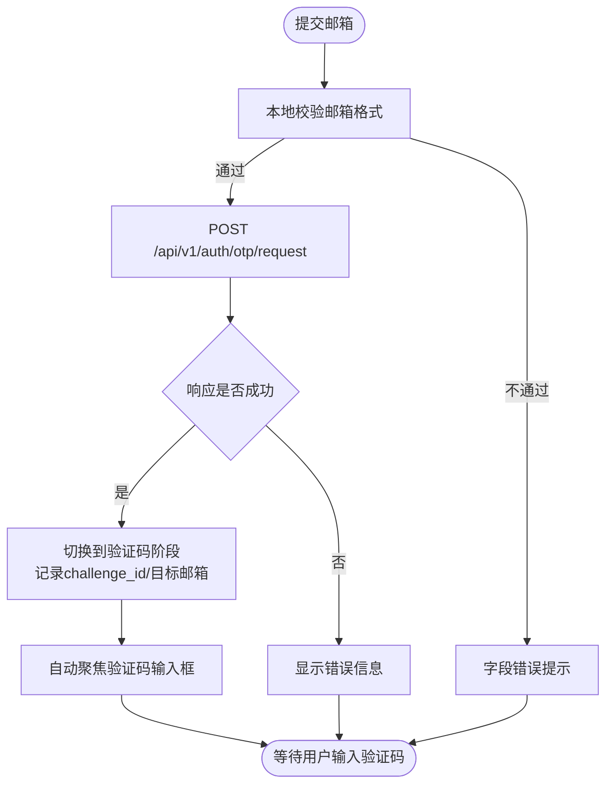
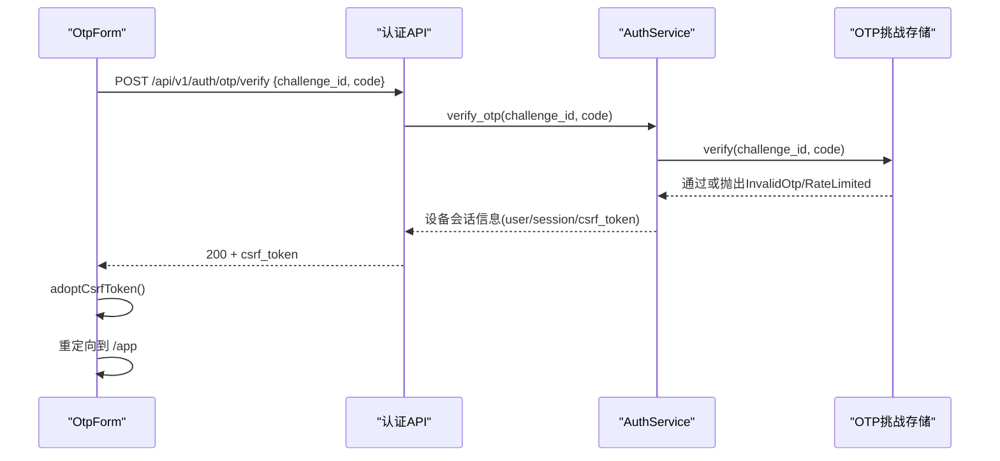
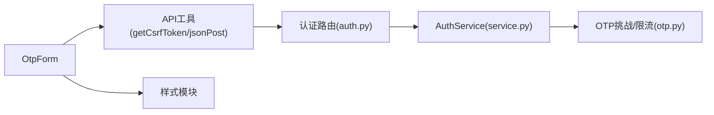

# OTP表单组件

<cite>
**本文引用的文件**
- [web/src/components/otp-form.tsx](file://web/src/components/otp-form.tsx)
- [web/src/components/otp-form.module.css](file://web/src/components/otp-form.module.css)
- [web/src/test/otp-form.test.tsx](file://web/src/test/otp-form.test.tsx)
- [web/src/lib/api.ts](file://web/src/lib/api.ts)
- [backend/app/api/auth.py](file://backend/app/api/auth.py)
- [backend/app/identity/service.py](file://backend/app/identity/service.py)
- [backend/app/identity/otp.py](file://backend/app/identity/otp.py)
</cite>

## 目录
1. [简介](#简介)
2. [项目结构](#项目结构)
3. [核心组件](#核心组件)
4. [架构总览](#架构总览)
5. [详细组件分析](#详细组件分析)
6. [依赖关系分析](#依赖关系分析)
7. [性能与可用性考虑](#性能与可用性考虑)
8. [故障排查指南](#故障排查指南)
9. [结论](#结论)
10. [附录：配置与国际化](#附录：配置与国际化)

## 简介
本文件面向OTP（一次性验证码）登录表单组件，聚焦OtpForm的实现细节与端到端流程。内容涵盖邮箱验证码的发送、接收、验证；表单状态机与自动聚焦；用户输入校验；与认证API的集成；错误处理策略；以及无障碍与移动端体验优化。同时提供可操作的配置项说明与国际化建议。

## 项目结构
前端以React组件形式实现，使用react-hook-form与zod进行表单校验，通过自定义请求封装调用后端认证接口；样式采用CSS Modules并遵循设计系统变量。后端基于FastAPI暴露认证路由，结合身份服务与OTP挑战存储、限流器完成验证码发放与校验。

**图表来源**
- [web/src/components/otp-form.tsx:83-363](file://web/src/components/otp-form.tsx#L83-L363)
- [web/src/lib/api.ts:256-385](file://web/src/lib/api.ts#L256-L385)
- [backend/app/api/auth.py:44-138](file://backend/app/api/auth.py#L44-L138)
- [backend/app/identity/service.py:78-192](file://backend/app/identity/service.py#L78-L192)
- [backend/app/identity/otp.py:64-304](file://backend/app/identity/otp.py#L64-L304)

**章节来源**
- [web/src/components/otp-form.tsx:83-363](file://web/src/components/otp-form.tsx#L83-L363)
- [web/src/lib/api.ts:256-385](file://web/src/lib/api.ts#L256-L385)
- [backend/app/api/auth.py:44-138](file://backend/app/api/auth.py#L44-L138)
- [backend/app/identity/service.py:78-192](file://backend/app/identity/service.py#L78-L192)
- [backend/app/identity/otp.py:64-304](file://backend/app/identity/otp.py#L64-L304)

## 核心组件
- OtpForm组件负责：
  - 初始化安全会话（获取CSRF Token）
  - 展示“邮箱验证码”入口（手机号通道当前锁定）
  - 发送验证码到邮箱
  - 收集并校验六位数字验证码
  - 验证成功后建立设备会话并重定向至应用首页
- 表单校验：
  - 邮箱地址：使用zod校验邮箱格式
  - 验证码：正则匹配六位数字
- 交互与状态：
  - 阶段枚举：bootstrapping/unavailable/destination/code/authenticated
  - 自动聚焦：进入code阶段时自动聚焦验证码输入框
  - 重试与更换邮箱：支持重新发送与切换目标邮箱
- 错误处理：
  - 网络异常、非JSON响应、服务端错误统一转换为友好提示
  - 字段级错误绑定到对应输入框，便于屏幕阅读器播报

**章节来源**
- [web/src/components/otp-form.tsx:14-52](file://web/src/components/otp-form.tsx#L14-L52)
- [web/src/components/otp-form.tsx:83-207](file://web/src/components/otp-form.tsx#L83-L207)
- [web/src/components/otp-form.tsx:223-363](file://web/src/components/otp-form.tsx#L223-L363)

## 架构总览
前端OtpForm通过内置requestJson调用后端认证API，携带CSRF Token；后端路由将请求委派给AuthService，后者协调OTP挑战存储、限流器与投递适配器完成发送与校验；校验通过后设置设备会话Cookie并返回新CSRF Token供前端adopt。

**图表来源**
- [web/src/components/otp-form.tsx:131-207](file://web/src/components/otp-form.tsx#L131-L207)
- [web/src/lib/api.ts:359-385](file://web/src/lib/api.ts#L359-L385)
- [backend/app/api/auth.py:44-138](file://backend/app/api/auth.py#L44-L138)
- [backend/app/identity/service.py:100-192](file://backend/app/identity/service.py#L100-L192)
- [backend/app/identity/otp.py:221-304](file://backend/app/identity/otp.py#L221-L304)

## 详细组件分析

### 表单状态机与生命周期
- 启动阶段：尝试获取CSRF Token，若失败则进入不可用状态并提供重试按钮
- 目的地阶段：展示邮箱输入框，提交后调用发送验证码接口
- 验证码阶段：显示调试码（开发/测试环境），自动聚焦验证码输入框，支持重新发送与更换邮箱
- 认证成功：更新设备CSRF Token，显示成功消息并重定向到应用页

**图表来源**
- [web/src/components/otp-form.tsx:83-221](file://web/src/components/otp-form.tsx#L83-L221)

**章节来源**
- [web/src/components/otp-form.tsx:83-221](file://web/src/components/otp-form.tsx#L83-L221)

### 验证码发送流程
- 前端构造请求体：channel为email，destination为用户输入的邮箱
- 携带X-CSRF-Token头，使用credentials: include确保跨域会话
- 成功后记录challenge_id与提交的目标邮箱，重置验证码输入框并切换到验证码阶段
- 失败时根据上下文在字段或全局区域显示错误信息

**图表来源**
- [web/src/components/otp-form.tsx:131-166](file://web/src/components/otp-form.tsx#L131-L166)

**章节来源**
- [web/src/components/otp-form.tsx:131-166](file://web/src/components/otp-form.tsx#L131-L166)

### 验证码验证流程
- 前端提交challenge_id与六位验证码
- 后端校验挑战有效性、尝试次数与速率限制
- 成功后设置设备会话Cookie并返回新CSRF Token
- 前端adopt该Token并跳转到应用页面

**图表来源**
- [web/src/components/otp-form.tsx:180-207](file://web/src/components/otp-form.tsx#L180-L207)
- [backend/app/api/auth.py:91-138](file://backend/app/api/auth.py#L91-L138)
- [backend/app/identity/service.py:153-192](file://backend/app/identity/service.py#L153-L192)
- [backend/app/identity/otp.py:283-304](file://backend/app/identity/otp.py#L283-L304)

**章节来源**
- [web/src/components/otp-form.tsx:180-207](file://web/src/components/otp-form.tsx#L180-L207)
- [backend/app/api/auth.py:91-138](file://backend/app/api/auth.py#L91-L138)
- [backend/app/identity/service.py:153-192](file://backend/app/identity/service.py#L153-L192)
- [backend/app/identity/otp.py:283-304](file://backend/app/identity/otp.py#L283-L304)

### 用户输入验证与自动聚焦
- 邮箱校验：zod email规则，错误文案中文提示
- 验证码校验：正则^\\d{6}$，限制最大长度与inputMode为numeric
- 自动聚焦：进入验证码阶段时调用setFocus("code")，提升键盘导航效率
- 无障碍：为输入框设置aria-invalid、aria-describedby关联错误提示文本

**章节来源**
- [web/src/components/otp-form.tsx:42-52](file://web/src/components/otp-form.tsx#L42-L52)
- [web/src/components/otp-form.tsx:101-105](file://web/src/components/otp-form.tsx#L101-L105)
- [web/src/components/otp-form.tsx:257-363](file://web/src/components/otp-form.tsx#L257-L363)

### 错误处理机制
- 网络错误与非JSON响应：统一捕获并转为友好提示
- 服务端错误：优先使用响应体title作为错误消息
- 验证码相关错误：
  - 无效或过期：后端抛出InvalidOtp，前端在验证码字段显示错误
  - 频率限制：后端抛出OtpRateLimited，前端在字段或全局区域提示
  - 投递不可用：后端抛出OtpDeliveryUnavailable，前端提示服务暂时不可用
- CSRF失败：API层自动清理缓存并重试一次

**章节来源**
- [web/src/components/otp-form.tsx:54-73](file://web/src/components/otp-form.tsx#L54-L73)
- [web/src/components/otp-form.tsx:152-166](file://web/src/components/otp-form.tsx#L152-L166)
- [web/src/components/otp-form.tsx:195-207](file://web/src/components/otp-form.tsx#L195-L207)
- [backend/app/api/auth.py:69-88](file://backend/app/api/auth.py#L69-L88)
- [backend/app/api/auth.py:107-110](file://backend/app/api/auth.py#L107-L110)
- [web/src/lib/api.ts:256-330](file://web/src/lib/api.ts#L256-L330)

### 用户体验优化
- 键盘导航：
  - 输入框与按钮具备可见焦点轮廓
  - 验证码输入框启用inputMode="numeric"与pattern="[0-9]{6}"，提升移动端键盘体验
- 屏幕阅读器支持：
  - 使用role="status"和role="alert"区分状态与错误
  - aria-live="polite"用于成功过渡提示
  - 字段错误通过aria-describedby关联可读文本
- 移动端适配：
  - 控制尺寸满足最小触控目标（输入框min-height约3rem，按钮约2.75rem）
  - 动画与过渡在减少动效偏好下被禁用

**章节来源**
- [web/src/components/otp-form.module.css:88-191](file://web/src/components/otp-form.module.css#L88-L191)
- [web/src/components/otp-form.module.css:260-284](file://web/src/components/otp-form.module.css#L260-L284)
- [web/src/components/otp-form.tsx:223-363](file://web/src/components/otp-form.tsx#L223-L363)

### 与认证API的集成
- 发送验证码：
  - 路径：/api/v1/auth/otp/request
  - 方法：POST
  - 请求体：{ channel: "email", destination: "<邮箱>" }
  - 头部：Content-Type: application/json, X-CSRF-Token
  - 响应：202 Accepted，包含challenge_id、expires_at、retry_after_seconds、development_code（开发/测试）
- 验证验证码：
  - 路径：/api/v1/auth/otp/verify
  - 方法：POST
  - 请求体：{ challenge_id, code }
  - 头部：Content-Type: application/json, X-CSRF-Token
  - 响应：200 OK，包含user_id、session_id、expires_at、csrf_token
- 设备会话建立：
  - 后端设置设备Cookie（session token、csrf token、过期时间）
  - 前端adopt新CSRF Token并跳转至应用页

**章节来源**
- [web/src/components/otp-form.tsx:131-207](file://web/src/components/otp-form.tsx#L131-L207)
- [backend/app/api/auth.py:44-138](file://backend/app/api/auth.py#L44-L138)

## 依赖关系分析
- 前端依赖：
  - react-hook-form与zod用于表单校验与状态管理
  - next/navigation用于路由跳转
  - 自定义API工具封装CSRF与会话逻辑
- 后端依赖：
  - FastAPI路由与依赖注入
  - 身份服务组合挑战存储、限流器与投递适配器
  - 数据库会话与Cookie操作

**图表来源**
- [web/src/components/otp-form.tsx:3-11](file://web/src/components/otp-form.tsx#L3-L11)
- [web/src/lib/api.ts:256-385](file://web/src/lib/api.ts#L256-L385)
- [backend/app/api/auth.py:44-138](file://backend/app/api/auth.py#L44-L138)
- [backend/app/identity/service.py:78-192](file://backend/app/identity/service.py#L78-L192)
- [backend/app/identity/otp.py:64-304](file://backend/app/identity/otp.py#L64-L304)

**章节来源**
- [web/src/components/otp-form.tsx:3-11](file://web/src/components/otp-form.tsx#L3-L11)
- [web/src/lib/api.ts:256-385](file://web/src/lib/api.ts#L256-L385)
- [backend/app/api/auth.py:44-138](file://backend/app/api/auth.py#L44-L138)
- [backend/app/identity/service.py:78-192](file://backend/app/identity/service.py#L78-L192)
- [backend/app/identity/otp.py:64-304](file://backend/app/identity/otp.py#L64-L304)

## 性能与可用性考虑
- 前端：
  - 使用局部状态与表单库避免不必要的重渲染
  - 自动聚焦减少用户操作步骤
  - 错误提示就近显示，降低认知负担
- 后端：
  - 三层限流：访客、网络、目标地址，防止滥用
  - 挑战冷却期与最大尝试次数，保障安全性
  - 投递失败回滚，避免占用配额导致误判
- 可用性：
  - 无障碍属性完善，支持读屏器与键盘操作
  - 减少动效偏好下禁用动画与过渡

[本节为通用指导，无需特定文件引用]

## 故障排查指南
- 无法获取CSRF Token：
  - 现象：页面显示“登录服务暂时不可用”，提供“重新连接”按钮
  - 排查：检查网络连通性与后端guest-sessions接口
  - 参考：前端bootstrap流程与错误分支
- 验证码发送失败：
  - 现象：字段错误或全局错误提示
  - 排查：确认邮箱格式、检查后端限流与投递适配器状态
  - 参考：发送流程与错误映射
- 验证码验证失败：
  - 现象：验证码字段错误提示
  - 排查：确认验证码未过期、尝试次数未超限
  - 参考：验证流程与后端异常类型
- 登录后未跳转：
  - 现象：验证成功但页面未跳转
  - 排查：检查adoptCsrfToken调用与路由替换逻辑
  - 参考：验证成功后的状态切换与跳转

**章节来源**
- [web/src/components/otp-form.tsx:107-129](file://web/src/components/otp-form.tsx#L107-L129)
- [web/src/components/otp-form.tsx:131-207](file://web/src/components/otp-form.tsx#L131-L207)
- [web/src/components/otp-form.tsx:209-221](file://web/src/components/otp-form.tsx#L209-L221)
- [backend/app/api/auth.py:69-110](file://backend/app/api/auth.py#L69-L110)

## 结论
OtpForm组件实现了完整的邮箱验证码登录流程，具备健壮的错误处理、良好的无障碍支持与移动端适配。通过与后端认证API的深度集成，组件能够安全地建立设备会话并完成用户引导。建议在后续迭代中扩展手机号通道、增加倒计时与国际化文案，以提升多语言与多场景下的用户体验。

[本节为总结性内容，无需特定文件引用]

## 附录：配置与国际化
- 配置选项（前端）：
  - 表单校验规则：邮箱与验证码的正则与提示文案
  - 自动聚焦行为：进入验证码阶段时聚焦输入框
  - 错误提示位置：字段内或全局区域
- 配置选项（后端）：
  - OTP冷却时间与最大尝试次数
  - 挑战有效期与重试间隔
  - 限流窗口与配额（访客、网络、目标地址）
  - 设备会话天数与Cookie设置
- 国际化建议：
  - 将用户可见文案（如“请输入有效的邮箱地址”、“请输入六位数字验证码”、“正在发送…”等）抽离为i18n键值
  - 错误消息与提示信息按语言包组织，便于维护与扩展

**章节来源**
- [web/src/components/otp-form.tsx:42-52](file://web/src/components/otp-form.tsx#L42-L52)
- [web/src/components/otp-form.tsx:257-363](file://web/src/components/otp-form.tsx#L257-L363)
- [backend/app/identity/otp.py:221-304](file://backend/app/identity/otp.py#L221-L304)
- [backend/app/identity/service.py:78-192](file://backend/app/identity/service.py#L78-L192)