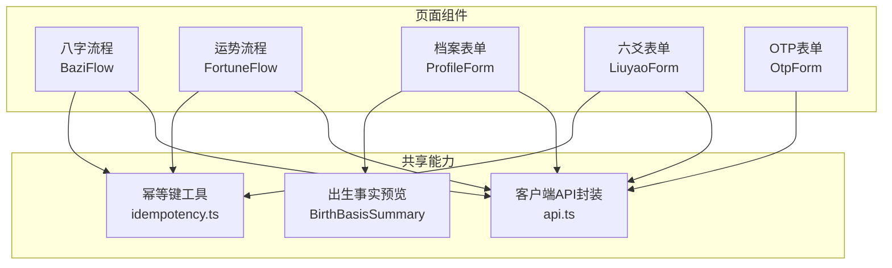
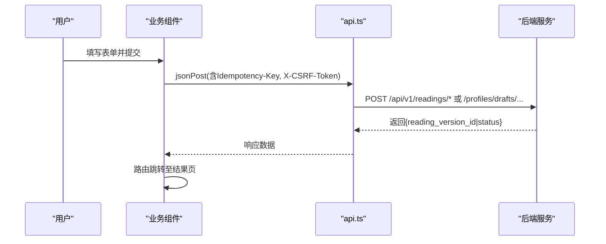
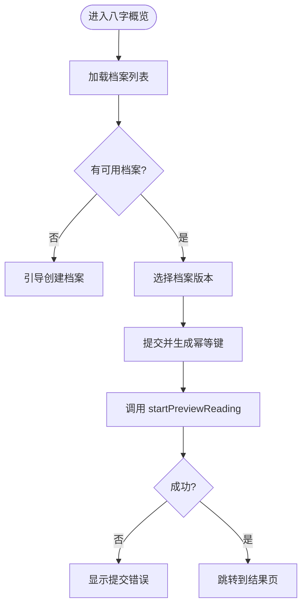
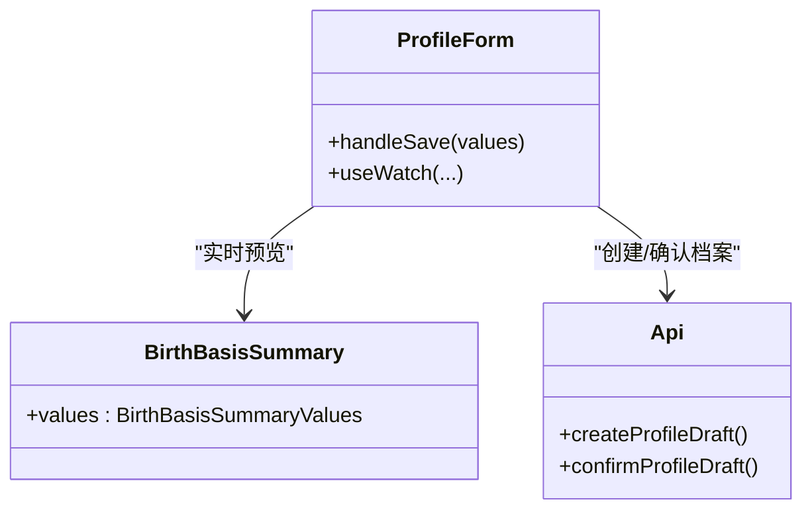
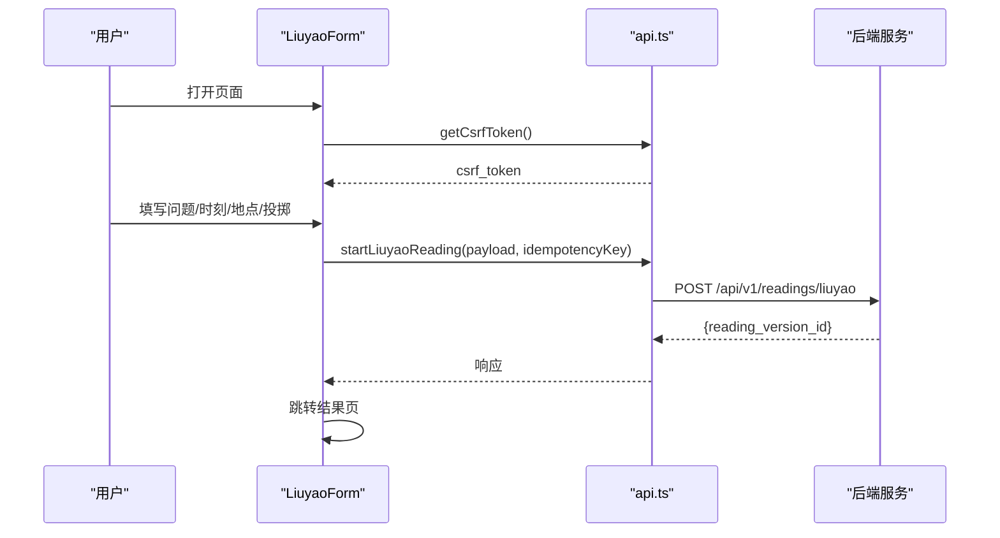
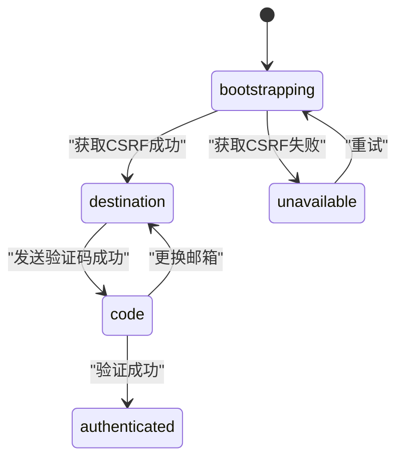
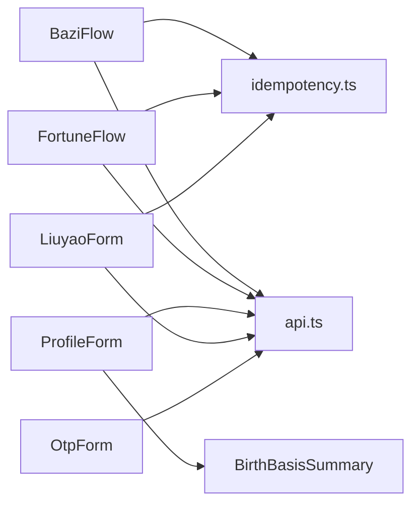

# 业务组件

<cite>
**本文引用的文件**
- [bazi-flow.tsx](file://web/src/components/bazi-flow.tsx)
- [fortune-flow.tsx](file://web/src/components/fortune-flow.tsx)
- [profile-form.tsx](file://web/src/components/profile-form.tsx)
- [liuyao-form.tsx](file://web/src/components/liuyao-form.tsx)
- [otp-form.tsx](file://web/src/components/otp-form.tsx)
- [api.ts](file://web/src/lib/api.ts)
- [idempotency.ts](file://web/src/lib/idempotency.ts)
- [birth-basis-summary.tsx](file://web/src/components/birth-basis-summary.tsx)
</cite>

## 目录
1. [简介](#简介)
2. [项目结构](#项目结构)
3. [核心组件](#核心组件)
4. [架构总览](#架构总览)
5. [详细组件分析](#详细组件分析)
6. [依赖关系分析](#依赖关系分析)
7. [性能与可用性](#性能与可用性)
8. [故障排查指南](#故障排查指南)
9. [结论](#结论)
10. [附录：配置项与扩展点](#附录：配置项与扩展点)

## 简介
本文件面向“特定业务场景”的复杂前端业务组件，系统性解析八字流程、运势流程（今日/近七日）、档案表单、六爻表单、OTP登录表单等组件的实现。内容覆盖状态管理、数据流处理、用户交互逻辑、组件间协作与状态共享、业务规则验证、用户反馈、配置选项与扩展点，以及与后端API的集成方式和错误处理策略。目标是让具备不同技术背景的读者都能理解并维护这些组件。

## 项目结构
这些业务组件位于 web/src/components 目录下，统一使用 React Hook Form + Zod 进行表单校验，通过 web/src/lib/api.ts 提供的客户端 API 函数与后端通信，并使用 idempotency.ts 生成幂等键以避免重复提交。

图表来源
- [bazi-flow.tsx:28-114](file://web/src/components/bazi-flow.tsx#L28-L114)
- [fortune-flow.tsx:33-125](file://web/src/components/fortune-flow.tsx#L33-L125)
- [profile-form.tsx:112-218](file://web/src/components/profile-form.tsx#L112-L218)
- [liuyao-form.tsx:90-195](file://web/src/components/liuyao-form.tsx#L90-L195)
- [otp-form.tsx:83-220](file://web/src/components/otp-form.tsx#L83-L220)
- [api.ts:256-330](file://web/src/lib/api.ts#L256-L330)
- [idempotency.ts:8-17](file://web/src/lib/idempotency.ts#L8-L17)
- [birth-basis-summary.tsx:43-95](file://web/src/components/birth-basis-summary.tsx#L43-L95)

章节来源
- [bazi-flow.tsx:1-223](file://web/src/components/bazi-flow.tsx#L1-L223)
- [fortune-flow.tsx:1-235](file://web/src/components/fortune-flow.tsx#L1-L235)
- [profile-form.tsx:1-570](file://web/src/components/profile-form.tsx#L1-L570)
- [liuyao-form.tsx:1-463](file://web/src/components/liuyao-form.tsx#L1-L463)
- [otp-form.tsx:1-364](file://web/src/components/otp-form.tsx#L1-L364)
- [api.ts:1-537](file://web/src/lib/api.ts#L1-L537)
- [idempotency.ts:1-18](file://web/src/lib/idempotency.ts#L1-L18)
- [birth-basis-summary.tsx:1-98](file://web/src/components/birth-basis-summary.tsx#L1-L98)

## 核心组件
- 八字流程（BaziFlow）：选择已确认档案版本，发起“事业与工作”主题的八字概览解读，成功后跳转到结果页。
- 运势流程（FortuneFlow）：支持“今日/近七日”两种模式，基于档案版本启动对应时间窗口的解读。
- 档案表单（ProfileForm）：录入出生事实与计算口径（时区、时间口径、子时口径、可选经纬度），保存后形成不可变档案版本。
- 六爻表单（LiuyaoForm）：收集问题、起卦时刻与时区地点，支持手动输入或电子摇卦，提交后进入解读流程。
- OTP表单（OtpForm）：邮箱验证码登录流程，建立设备会话并接管CSRF令牌，随后重定向至应用主入口。

章节来源
- [bazi-flow.tsx:28-114](file://web/src/components/bazi-flow.tsx#L28-L114)
- [fortune-flow.tsx:33-125](file://web/src/components/fortune-flow.tsx#L33-L125)
- [profile-form.tsx:112-218](file://web/src/components/profile-form.tsx#L112-L218)
- [liuyao-form.tsx:90-195](file://web/src/components/liuyao-form.tsx#L90-L195)
- [otp-form.tsx:83-220](file://web/src/components/otp-form.tsx#L83-L220)

## 架构总览
所有业务组件遵循统一的交互范式：
- 表单校验：React Hook Form + Zod 在提交前完成字段级与跨字段校验。
- 幂等提交：通过稳定意图指纹生成幂等键，避免重复提交导致重复任务。
- 安全与会话：统一通过 getCsrfToken 获取 CSRF Token；OTP 流程完成后 adoptCsrfToken 接管设备会话。
- 结果跳转：成功调用后返回 reading_version_id，组件直接路由到结果详情页。

图表来源
- [api.ts:292-330](file://web/src/lib/api.ts#L292-L330)
- [bazi-flow.tsx:88-114](file://web/src/components/bazi-flow.tsx#L88-L114)
- [fortune-flow.tsx:94-125](file://web/src/components/fortune-flow.tsx#L94-L125)
- [liuyao-form.tsx:150-195](file://web/src/components/liuyao-form.tsx#L150-L195)
- [profile-form.tsx:166-218](file://web/src/components/profile-form.tsx#L166-L218)

## 详细组件分析

### 八字流程（BaziFlow）
- 状态管理
  - profiles/loading/error：加载档案列表及错误态
  - busy/submitError：提交中及提交失败提示
  - intentKeyRef：用于幂等键稳定性
- 数据流
  - 初始化时调用 listProfiles 获取可用档案，自动预选默认或传入的 profile_version_id
  - 提交时构造 payload（包含查询主题与维度），生成幂等键，调用 startPreviewReading
  - 成功后跳转到 /app/readings/{reading_version_id}
- 用户交互
  - 下拉选择档案版本，显示当前可交付范围说明
  - 提交按钮在 busy 期间禁用，提供 aria-busy 无障碍提示
- 业务规则与验证
  - 必须选择档案版本；无可用档案时引导创建新档案
- 错误处理
  - 加载失败提供重试；提交失败展示友好消息
- 配置与扩展
  - 可通过 initialProfileVersionId 预置档案版本
  - 可在 payload 中调整 dimension_ids 以适配未来主题

图表来源
- [bazi-flow.tsx:52-114](file://web/src/components/bazi-flow.tsx#L52-L114)

章节来源
- [bazi-flow.tsx:22-114](file://web/src/components/bazi-flow.tsx#L22-L114)
- [api.ts:413-439](file://web/src/lib/api.ts#L413-L439)

### 运势流程（FortuneFlow）
- 状态管理
  - mode 控制“今日/近七日”，其余状态同八字流程
- 数据流
  - 从 URL 参数 ?profile= 预选档案版本
  - 根据 mode 构造不同 query，调用 startTodayReading 或 startWeekReading
- 用户交互
  - 明确标注算法范围（当前为事业与工作）
  - 提交中锁定界面，提供可重试的错误态
- 业务规则与验证
  - 必须选择档案版本；无档案时引导建档
- 错误处理
  - 加载失败与提交失败均有友好提示与重试

章节来源
- [fortune-flow.tsx:23-125](file://web/src/components/fortune-flow.tsx#L23-L125)
- [api.ts:441-456](file://web/src/lib/api.ts#L441-L456)

### 档案表单（ProfileForm）
- 状态管理
  - 多步骤表单：出生事实、计算口径、提交前核对
  - 使用 useWatch 监听关键字段，实时渲染 BirthBasisSummary 预览
- 数据流
  - 先创建草稿 createProfileDraft，再 confirmProfileDraft 提交确认
  - 真太阳时口径下才提交经纬度与坐标来源
- 用户交互
  - 分步展示，强调“仅记录事实，不做本地换算”
  - 对必填项、时区有效性、经纬度范围进行强校验
- 业务规则与验证
  - 性别、时间口径、子时口径为必填
  - IANA 时区需来自白名单；经纬度范围限制
  - 非真太阳时隐藏高级字段
- 错误处理
  - 提交失败显示错误信息；busy 防止重复提交
- 配置与扩展
  - TIME_BASIS_POLICIES、ZI_HOUR_POLICIES 可扩展更多口径
  - 可新增坐标来源类型或校验规则

图表来源
- [profile-form.tsx:112-218](file://web/src/components/profile-form.tsx#L112-L218)
- [birth-basis-summary.tsx:43-95](file://web/src/components/birth-basis-summary.tsx#L43-L95)
- [api.ts:394-416](file://web/src/lib/api.ts#L394-L416)

章节来源
- [profile-form.tsx:46-108](file://web/src/components/profile-form.tsx#L46-L108)
- [profile-form.tsx:166-218](file://web/src/components/profile-form.tsx#L166-L218)
- [birth-basis-summary.tsx:17-95](file://web/src/components/birth-basis-summary.tsx#L17-L95)
- [api.ts:394-416](file://web/src/lib/api.ts#L394-L416)

### 六爻表单（LiuyaoForm）
- 状态管理
  - ready/bootstrapError：安全会话初始化状态
  - castMode：切换手动输入与电子摇卦
  - toss_1..toss_6：六次投掷值
- 数据流
  - 初始化时请求 getCsrfToken 建立安全会话
  - 提交时组装 cast（数组或数字串）、event_datetime、timezone、location、query、dimension_ids
  - 调用 startLiuyaoReading 并跳转结果页
- 用户交互
  - 明确“一事一问”，限定当前可交付范围
  - 手动模式下逐项选择初爻至上爻，电子摇卦模式隐藏该组
- 业务规则与验证
  - 问题长度、时区有效性、投掷值合法性校验
  - 非手动模式清空投掷字段错误
- 错误处理
  - 安全会话失败提供重试；提交失败友好提示

图表来源
- [liuyao-form.tsx:123-195](file://web/src/components/liuyao-form.tsx#L123-L195)
- [api.ts:459-466](file://web/src/lib/api.ts#L459-L466)

章节来源
- [liuyao-form.tsx:37-86](file://web/src/components/liuyao-form.tsx#L37-L86)
- [liuyao-form.tsx:123-195](file://web/src/components/liuyao-form.tsx#L123-L195)
- [api.ts:459-466](file://web/src/lib/api.ts#L459-L466)

### OTP表单（OtpForm）
- 状态机
  - bootstrapping/unavailable/destination/code/authenticated
- 数据流
  - 启动时获取 CSRF Token，失败则进入 unavailable
  - 发送验证码到邮箱，进入 code 阶段
  - 验证通过后 adoptCsrfToken 接管设备会话，重定向到 /app
- 用户交互
  - 清晰展示当前阶段与安全会话状态
  - 支持重新发送验证码、更换邮箱
- 错误处理
  - 发送/验证失败均给出明确错误提示
  - 不可用状态提供重试

图表来源
- [otp-form.tsx:14-220](file://web/src/components/otp-form.tsx#L14-L220)

章节来源
- [otp-form.tsx:54-220](file://web/src/components/otp-form.tsx#L54-L220)
- [api.ts:350-385](file://web/src/lib/api.ts#L350-L385)

## 依赖关系分析
- 组件对外依赖
  - api.ts：统一封装 fetch、CSRF、幂等键、各业务端点
  - idempotency.ts：基于意图对象生成稳定的幂等键，减少重复提交
  - birth-basis-summary.tsx：纯展示组件，用于档案表单提交前预览
- 内部耦合
  - 各表单组件通过 useForm/useWatch 管理本地状态，不共享全局状态
  - 通过路由跳转实现“提交→结果页”的单向数据流
- 外部依赖
  - 后端 REST API：/api/v1/profiles、/api/v1/readings、/api/v1/auth、/api/v1/guest-sessions
  - 浏览器 Cookie/Session：携带 credentials: include 以维持会话

图表来源
- [bazi-flow.tsx:88-114](file://web/src/components/bazi-flow.tsx#L88-L114)
- [fortune-flow.tsx:94-125](file://web/src/components/fortune-flow.tsx#L94-L125)
- [profile-form.tsx:166-218](file://web/src/components/profile-form.tsx#L166-L218)
- [liuyao-form.tsx:150-195](file://web/src/components/liuyao-form.tsx#L150-L195)
- [otp-form.tsx:131-207](file://web/src/components/otp-form.tsx#L131-L207)
- [api.ts:256-330](file://web/src/lib/api.ts#L256-L330)
- [idempotency.ts:8-17](file://web/src/lib/idempotency.ts#L8-L17)
- [birth-basis-summary.tsx:43-95](file://web/src/components/birth-basis-summary.tsx#L43-L95)

章节来源
- [api.ts:256-330](file://web/src/lib/api.ts#L256-L330)
- [idempotency.ts:1-18](file://web/src/lib/idempotency.ts#L1-L18)

## 性能与可用性
- 性能
  - 列表加载仅在首次或需要时触发，避免频繁刷新
  - 提交过程使用 busy 锁与防抖引用 busyRef，防止重复提交
  - 结果页跳转由服务端驱动，前端只做轻量路由
- 可用性
  - 所有交互均提供 aria-* 属性与 role 提示，便于辅助技术
  - 错误态提供重试入口，提升容错体验
  - 明确告知当前可交付范围，降低用户预期偏差

[本节为通用指导，不直接分析具体文件]

## 故障排查指南
- 无法加载档案列表
  - 检查网络与权限；查看 listProfiles 是否抛出错误；必要时点击“重新加载”
  - 参考：[bazi-flow.tsx:52-80](file://web/src/components/bazi-flow.tsx#L52-L80)、[fortune-flow.tsx:68-86](file://web/src/components/fortune-flow.tsx#L68-L86)
- 提交失败或重复提交
  - 确认幂等键是否正确传递；检查 busy 锁是否生效
  - 参考：[api.ts:292-330](file://web/src/lib/api.ts#L292-L330)、[bazi-flow.tsx:88-114](file://web/src/components/bazi-flow.tsx#L88-L114)
- 安全会话异常
  - OTP 流程中若 getCsrfToken 失败，进入 unavailable；点击“重新连接”
  - 参考：[otp-form.tsx:107-123](file://web/src/components/otp-form.tsx#L107-L123)
- 表单校验失败
  - 检查 Zod 规则（如时区、经纬度、投掷值）；关注错误提示位置
  - 参考：[profile-form.tsx:46-108](file://web/src/components/profile-form.tsx#L46-L108)、[liuyao-form.tsx:37-86](file://web/src/components/liuyao-form.tsx#L37-L86)

章节来源
- [bazi-flow.tsx:52-114](file://web/src/components/bazi-flow.tsx#L52-L114)
- [fortune-flow.tsx:68-125](file://web/src/components/fortune-flow.tsx#L68-L125)
- [profile-form.tsx:46-108](file://web/src/components/profile-form.tsx#L46-L108)
- [liuyao-form.tsx:37-86](file://web/src/components/liuyao-form.tsx#L37-L86)
- [otp-form.tsx:107-207](file://web/src/components/otp-form.tsx#L107-L207)
- [api.ts:256-330](file://web/src/lib/api.ts#L256-L330)

## 结论
本项目的业务组件采用一致的“表单校验+幂等提交+安全会话+结果跳转”模式，既保证了用户体验的一致性，也降低了维护成本。通过清晰的职责划分（组件负责交互与状态，api.ts 负责网络与安全，idempotency.ts 负责幂等），实现了高内聚、低耦合的前端架构。对于后续扩展（新增业务主题、新的表单字段、新的认证方式），只需在相应组件与 api.ts 中增量修改即可。

[本节为总结性内容，不直接分析具体文件]

## 附录：配置项与扩展点
- 八字流程
  - 初始档案版本：initialProfileVersionId
  - 主题维度：payload.dimension_ids（当前固定为 career）
  - 参考：[bazi-flow.tsx:28-114](file://web/src/components/bazi-flow.tsx#L28-L114)
- 运势流程
  - 模式：mode = "today" | "week"
  - 参考：[fortune-flow.tsx:23-125](file://web/src/components/fortune-flow.tsx#L23-L125)
- 档案表单
  - 时间口径：TIME_BASIS_POLICIES（civil/solar/lunar）
  - 子时口径：ZI_HOUR_POLICIES（midnight/substitute/solar）
  - 真太阳时高级字段：longitude/latitude/coordinate_source
  - 参考：[profile-form.tsx:34-44](file://web/src/components/profile-form.tsx#L34-L44)、[profile-form.tsx:46-108](file://web/src/components/profile-form.tsx#L46-L108)
- 六爻表单
  - 投掷模式：cast_mode = "manual" | "digital_coin"
  - 投掷字段：toss_1..toss_6（手动模式必填）
  - 参考：[liuyao-form.tsx:37-86](file://web/src/components/liuyao-form.tsx#L37-L86)、[liuyao-form.tsx:150-195](file://web/src/components/liuyao-form.tsx#L150-L195)
- OTP表单
  - 阶段：bootstrapping/unavailable/destination/code/authenticated
  - 参考：[otp-form.tsx:14-220](file://web/src/components/otp-form.tsx#L14-L220)
- 公共能力
  - 幂等键：stableKeyForIntent（基于意图对象指纹）
  - CSRF：getCsrfToken/adoptCsrfToken
  - 参考：[idempotency.ts:8-17](file://web/src/lib/idempotency.ts#L8-L17)、[api.ts:350-385](file://web/src/lib/api.ts#L350-L385)

章节来源
- [bazi-flow.tsx:28-114](file://web/src/components/bazi-flow.tsx#L28-L114)
- [fortune-flow.tsx:23-125](file://web/src/components/fortune-flow.tsx#L23-L125)
- [profile-form.tsx:34-108](file://web/src/components/profile-form.tsx#L34-L108)
- [liuyao-form.tsx:37-195](file://web/src/components/liuyao-form.tsx#L37-L195)
- [otp-form.tsx:14-220](file://web/src/components/otp-form.tsx#L14-L220)
- [idempotency.ts:8-17](file://web/src/lib/idempotency.ts#L8-L17)
- [api.ts:350-385](file://web/src/lib/api.ts#L350-L385)