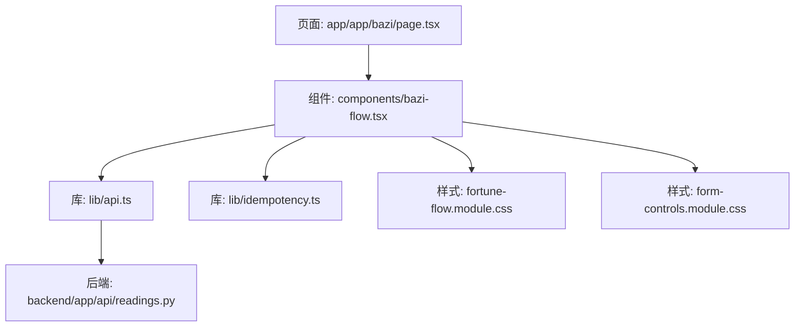
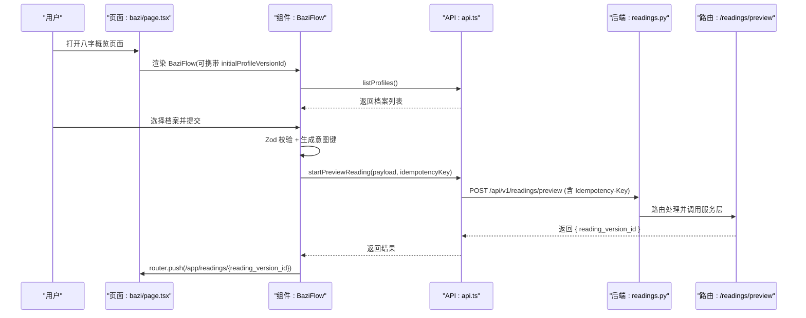
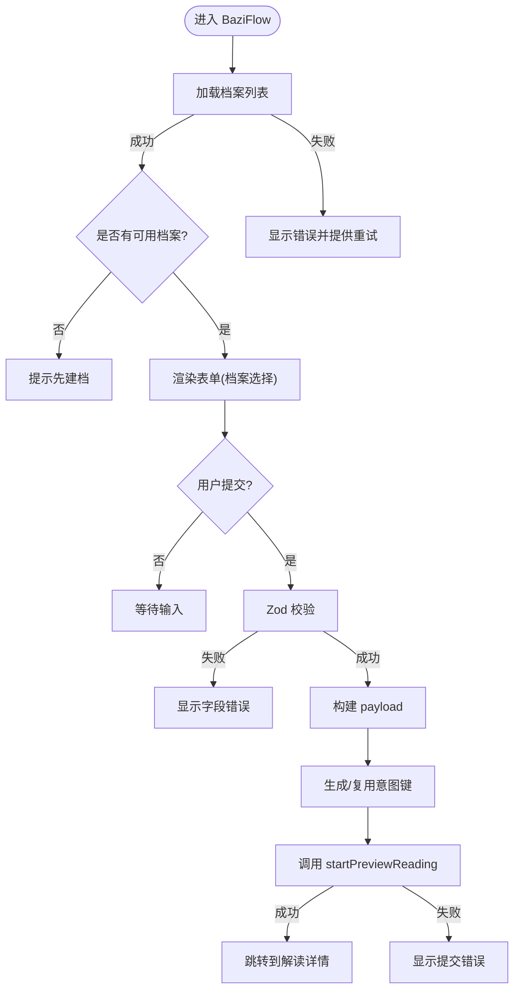
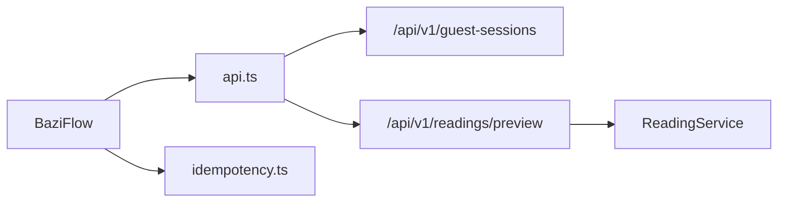

# 八字流程组件

<cite>
**本文引用的文件**
- [web/src/components/bazi-flow.tsx](file://web/src/components/bazi-flow.tsx)
- [web/src/app/app/bazi/page.tsx](file://web/src/app/app/bazi/page.tsx)
- [web/src/lib/api.ts](file://web/src/lib/api.ts)
- [web/src/lib/idempotency.ts](file://web/src/lib/idempotency.ts)
- [web/src/test/bazi-flow.test.tsx](file://web/src/test/bazi-flow.test.tsx)
- [web/src/components/fortune-flow.module.css](file://web/src/components/fortune-flow.module.css)
- [web/src/components/form-controls.module.css](file://web/src/components/form-controls.module.css)
- [backend/app/api/readings.py](file://backend/app/api/readings.py)
</cite>

## 目录
1. [简介](#简介)
2. [项目结构](#项目结构)
3. [核心组件](#核心组件)
4. [架构总览](#架构总览)
5. [详细组件分析](#详细组件分析)
6. [依赖关系分析](#依赖关系分析)
7. [性能与可用性考虑](#性能与可用性考虑)
8. [故障排查指南](#故障排查指南)
9. [结论](#结论)
10. [附录：配置选项与使用示例](#附录配置选项与使用示例)

## 简介
本文件面向“八字流程组件”（BaziFlow），系统性解析其实现与交互流程，覆盖档案选择、表单验证、状态管理、API 集成、幂等性处理、意图键生成、错误处理与用户反馈。重点说明组件如何从已确认的档案版本启动“八字概览解读”，并解释 Zod schema 校验规则、react-hook-form 集成方式以及与后端 startPreviewReading 接口的完整调用链路。

## 项目结构
- 页面入口：Next.js 客户端页面挂载 BaziFlow，支持通过 URL 查询参数传入初始档案版本。
- 流程组件：BaziFlow 负责档案列表加载、表单渲染、提交与结果跳转。
- API 层：统一封装请求、CSRF 获取与重试、幂等键注入、类型定义与工具函数。
- 幂等性工具：基于意图指纹稳定化幂等键，避免重复提交导致重复创建。
- 样式：共享表单控件样式与流程容器样式，提供一致的交互体验。
- 后端接口：FastAPI 路由暴露 /api/v1/readings/preview，接收预览解读请求并返回解读版本信息。

**图表来源**
- [web/src/app/app/bazi/page.tsx:11-31](file://web/src/app/app/bazi/page.tsx#L11-L31)
- [web/src/components/bazi-flow.tsx:28-114](file://web/src/components/bazi-flow.tsx#L28-L114)
- [web/src/lib/api.ts:432-439](file://web/src/lib/api.ts#L432-L439)
- [web/src/lib/idempotency.ts:8-17](file://web/src/lib/idempotency.ts#L8-L17)
- [backend/app/api/readings.py:87-121](file://backend/app/api/readings.py#L87-L121)

**章节来源**
- [web/src/app/app/bazi/page.tsx:11-31](file://web/src/app/app/bazi/page.tsx#L11-L31)
- [web/src/components/bazi-flow.tsx:28-114](file://web/src/components/bazi-flow.tsx#L28-L114)
- [web/src/lib/api.ts:256-330](file://web/src/lib/api.ts#L256-L330)
- [web/src/lib/idempotency.ts:8-17](file://web/src/lib/idempotency.ts#L8-L17)
- [backend/app/api/readings.py:87-121](file://backend/app/api/readings.py#L87-L121)

## 核心组件
- BaziFlow：客户端 React 组件，完成档案列表加载、Zod 校验、表单提交、幂等键生成、调用后端预览接口、错误与加载状态展示、成功后跳转到解读详情页。
- 页面页：读取 URL 查询参数 profile 作为初始档案版本，将值传递给 BaziFlow。
- API 层：集中处理 JSON 请求、CSRF Token 获取与缓存、失败重试、幂等键注入、类型定义与格式化。
- 幂等性工具：根据当前意图对象生成稳定指纹，若未变化则复用已有幂等键，否则生成新的唯一键。

关键职责边界：
- 组件不直接操作网络请求细节，仅调用高层 API 函数。
- 表单校验由 Zod schema + react-hook-form resolver 完成。
- 错误处理在组件层进行用户可见提示，并在 API 层统一包装为 ApiError。

**章节来源**
- [web/src/components/bazi-flow.tsx:22-50](file://web/src/components/bazi-flow.tsx#L22-L50)
- [web/src/components/bazi-flow.tsx:88-114](file://web/src/components/bazi-flow.tsx#L88-L114)
- [web/src/lib/api.ts:244-330](file://web/src/lib/api.ts#L244-L330)
- [web/src/lib/idempotency.ts:8-17](file://web/src/lib/idempotency.ts#L8-L17)

## 架构总览
下图展示了从用户点击“开始事业主题概览”到后端创建预览解读的完整时序。

**图表来源**
- [web/src/app/app/bazi/page.tsx:11-31](file://web/src/app/app/bazi/page.tsx#L11-L31)
- [web/src/components/bazi-flow.tsx:52-114](file://web/src/components/bazi-flow.tsx#L52-L114)
- [web/src/lib/api.ts:413-439](file://web/src/lib/api.ts#L413-L439)
- [backend/app/api/readings.py:87-121](file://backend/app/api/readings.py#L87-L121)

## 详细组件分析

### BaziFlow 组件
- 数据加载：
  - 组件挂载时调用 listProfiles 获取档案列表，设置 loading/error/profiles 状态。
  - 支持传入 initialProfileVersionId，自动选中对应档案；若仅有一个档案则自动选中。
- 表单与校验：
  - 使用 zodResolver 绑定 Zod schema，字段为 profile_version_id，必填且最小长度校验。
  - 通过 react-hook-form 的 register、handleSubmit、setValue 管理表单值与校验。
- 提交与幂等：
  - 构建 payload：包含 profile_version_id、query、dimension_ids=["career"]。
  - 使用 stableKeyForIntent 计算意图指纹，若不变则复用现有 IntentKey.key，否则生成新 key。
  - 调用 startPreviewReading 并附带 Idempotency-Key 头，防止重复提交。
- 导航与反馈：
  - 成功：router.push 跳转到解读详情页。
  - 失败：捕获异常并显示 submitError。
  - 加载态：loading 控制档案加载，busy 控制提交中禁用交互。
- 无障碍与可访问性：
  - select 元素具备 aria-required、aria-invalid、aria-describedby 等属性，错误文本带 role="alert"。
  - 按钮具备 aria-busy 指示提交状态。

**图表来源**
- [web/src/components/bazi-flow.tsx:52-114](file://web/src/components/bazi-flow.tsx#L52-L114)
- [web/src/lib/idempotency.ts:8-17](file://web/src/lib/idempotency.ts#L8-L17)

**章节来源**
- [web/src/components/bazi-flow.tsx:22-114](file://web/src/components/bazi-flow.tsx#L22-L114)
- [web/src/components/bazi-flow.tsx:116-223](file://web/src/components/bazi-flow.tsx#L116-L223)

### 页面挂载与参数传递
- 页面通过 useSearchParams 读取 profile 查询参数，作为 initialProfileVersionId 传入 BaziFlow。
- 使用 Suspense 包裹页面体，提供加载占位。

**章节来源**
- [web/src/app/app/bazi/page.tsx:11-31](file://web/src/app/app/bazi/page.tsx#L11-L31)
- [web/src/app/app/bazi/page.tsx:36-51](file://web/src/app/app/bazi/page.tsx#L36-L51)

### API 集成与 CSRF
- jsonPost 统一封装 POST 请求，自动附加 Content-Type 与 X-CSRF-Token。
- getCsrfToken 优先读取 Cookie，否则发起会话请求获取并缓存。
- 遇到 403 CSRF 失败时，清空缓存并重试一次。
- 所有写操作（如 startPreviewReading）均支持可选的 idempotencyKey 头。

**章节来源**
- [web/src/lib/api.ts:256-330](file://web/src/lib/api.ts#L256-L330)
- [web/src/lib/api.ts:359-385](file://web/src/lib/api.ts#L359-L385)

### 幂等性与意图键
- createIdempotencyKey：优先使用 crypto.randomUUID，回退到时间戳+随机字符串。
- stableKeyForIntent：对意图对象序列化得到指纹，若与上次相同则复用 key，否则生成新 key。
- 目的：保证同一意图多次提交不会重复创建解读，同时允许不同意图产生不同的幂等键。

**章节来源**
- [web/src/lib/api.ts:387-392](file://web/src/lib/api.ts#L387-L392)
- [web/src/lib/idempotency.ts:8-17](file://web/src/lib/idempotency.ts#L8-L17)

### 后端接口与幂等性处理
- 路由：POST /api/v1/readings/preview，operation_id=startPreviewReading。
- 入参：PreviewStartRequest（profile_version_id、query、dimension_ids）。
- 幂等键：从请求头 Idempotency-Key 读取，服务端校验长度范围。
- 响应：ReadingStartResponse（包含 reading_version_id），首次创建返回 201，幂等命中返回 200。
- 错误映射：服务层错误被转换为统一的 ApiProblem，包括冲突、未找到、速率限制等。

**章节来源**
- [backend/app/api/readings.py:87-121](file://backend/app/api/readings.py#L87-L121)
- [backend/app/api/readings.py:57-84](file://backend/app/api/readings.py#L57-L84)

### 表单验证与错误处理
- Zod schema：仅校验 profile_version_id 非空。
- react-hook-form：通过 zodResolver 集成，errors.profile_version_id 用于显示字段级错误。
- 组件错误：
  - 加载失败：显示错误消息并提供“重新加载”。
  - 提交失败：显示提交错误提示。
  - 无档案：引导用户去新建档案。
- 无障碍：错误区域使用 role="alert"，按钮 aria-busy 指示忙态。

**章节来源**
- [web/src/components/bazi-flow.tsx:22-50](file://web/src/components/bazi-flow.tsx#L22-L50)
- [web/src/components/bazi-flow.tsx:127-207](file://web/src/components/bazi-flow.tsx#L127-L207)
- [web/src/components/form-controls.module.css:49-75](file://web/src/components/form-controls.module.css#L49-L75)

### 状态管理与用户体验
- 状态变量：
  - profiles：档案列表
  - loading：档案加载状态
  - error：加载错误
  - busy：提交中锁定交互
  - submitError：提交错误
  - loadAttempt：触发重新加载
- 防抖与锁：
  - busyRef 防止并发提交。
  - intentKeyRef 持久化意图键，确保同一意图幂等。
- 用户反馈：
  - 加载提示、错误提示、无档案引导、提交中禁用按钮与选择框。

**章节来源**
- [web/src/components/bazi-flow.tsx:31-39](file://web/src/components/bazi-flow.tsx#L31-L39)
- [web/src/components/bazi-flow.tsx:88-114](file://web/src/components/bazi-flow.tsx#L88-L114)
- [web/src/components/fortune-flow.module.css:60-87](file://web/src/components/fortune-flow.module.css#L60-L87)

### 测试要点
- 模拟 next/navigation 与 @/lib/api 的 listProfiles、startPreviewReading。
- 断言：
  - 页面显示当前白话解读范围提示。
  - 提交后调用 startPreviewReading，参数包含正确的 profile_version_id、dimension_ids、query。
  - 正确携带任意字符串类型的幂等键。

**章节来源**
- [web/src/test/bazi-flow.test.tsx:55-81](file://web/src/test/bazi-flow.test.tsx#L55-L81)

## 依赖关系分析
- 组件依赖：
  - BaziFlow 依赖 api.ts 的 listProfiles、startPreviewReading、formatProfileOption。
  - 依赖 idempotency.ts 的 stableKeyForIntent。
  - 依赖 Next.js 路由与 react-hook-form、zod。
- API 层依赖：
  - 依赖浏览器 fetch、Cookie、crypto。
  - 依赖后端 /api/v1/guest-sessions 获取 CSRF。
  - 依赖后端 /api/v1/readings/preview 创建预览解读。
- 后端依赖：
  - FastAPI 路由、服务层 ReadingService、数据库会话、速率限制器。

**图表来源**
- [web/src/components/bazi-flow.tsx:10-18](file://web/src/components/bazi-flow.tsx#L10-L18)
- [web/src/lib/api.ts:413-439](file://web/src/lib/api.ts#L413-L439)
- [backend/app/api/readings.py:87-121](file://backend/app/api/readings.py#L87-L121)

**章节来源**
- [web/src/components/bazi-flow.tsx:10-18](file://web/src/components/bazi-flow.tsx#L10-L18)
- [web/src/lib/api.ts:256-330](file://web/src/lib/api.ts#L256-L330)
- [backend/app/api/readings.py:87-121](file://backend/app/api/readings.py#L87-L121)

## 性能与可用性考虑
- 减少重复请求：
  - 通过意图指纹复用幂等键，避免重复创建解读。
  - CSRF Token 缓存，避免频繁获取。
- 提升交互流畅度：
  - 提交期间禁用表单与按钮，防止重复提交。
  - 单档案场景自动选中，减少用户操作。
- 错误恢复：
  - 加载失败提供重试按钮。
  - CSRF 失败自动重试一次。
- 可访问性：
  - 表单控件具备必要的 ARIA 属性，错误区域使用 alert 角色。
  - 按钮与输入尺寸满足最小触控目标要求。

[本节为通用指导，无需特定文件引用]

## 故障排查指南
- 无法加载档案：
  - 检查 listProfiles 是否成功，查看 error 状态与“重新加载”按钮。
  - 确认 CSRF Token 获取正常（/api/v1/guest-sessions）。
- 提交失败：
  - 查看 submitError 提示，确认 payload 是否正确（profile_version_id、dimension_ids、query）。
  - 检查 Idempotency-Key 是否有效（长度 8-128）。
- CSRF 相关错误：
  - 若出现 403 CSRF 失败，API 层会自动清理缓存并重试。
  - 若仍失败，检查 Cookie 与跨域策略。
- 后端冲突或限流：
  - 409 可能表示幂等冲突或已排队；429/限流提示需稍后重试。
  - 查看后端日志与服务端返回的 title/detail。

**章节来源**
- [web/src/lib/api.ts:256-330](file://web/src/lib/api.ts#L256-L330)
- [backend/app/api/readings.py:57-84](file://backend/app/api/readings.py#L57-L84)

## 结论
BaziFlow 以清晰的职责划分实现了“从档案到解读”的端到端流程：前端负责档案选择与表单校验，API 层负责安全与幂等，后端负责业务编排与结果交付。通过 Zod + react-hook-form 保障数据质量，通过意图指纹与 Idempotency-Key 保障幂等，通过完善的错误与加载状态提升用户体验。整体设计简洁、健壮，便于扩展更多解读维度与后续功能。

[本节为总结，无需特定文件引用]

## 附录：配置选项与使用示例
- 组件配置
  - initialProfileVersionId?: string：初始选中的档案版本 ID，常用于从 URL 参数传入。
- 使用示例
  - 在页面中引入 BaziFlow，并通过查询参数传入初始档案版本：
    - 路径：/app/app/bazi/page.tsx
    - 行为：读取 searchParams.profile，作为 initialProfileVersionId 传给 BaziFlow。
- 表单字段
  - profile_version_id：必填，来自档案列表。
- 提交载荷
  - profile_version_id：选择的档案版本 ID。
  - query：固定为“查看这个档案的事业与工作主题”。
  - dimension_ids：固定为 ["career"]。
- 幂等键
  - 由 stableKeyForIntent 生成，同一意图复用 key，不同意图生成新 key。
- 跳转
  - 成功后跳转到 /app/readings/{reading_version_id}。

**章节来源**
- [web/src/app/app/bazi/page.tsx:11-31](file://web/src/app/app/bazi/page.tsx#L11-L31)
- [web/src/components/bazi-flow.tsx:28-50](file://web/src/components/bazi-flow.tsx#L28-L50)
- [web/src/components/bazi-flow.tsx:88-114](file://web/src/components/bazi-flow.tsx#L88-L114)
- [web/src/lib/idempotency.ts:8-17](file://web/src/lib/idempotency.ts#L8-L17)