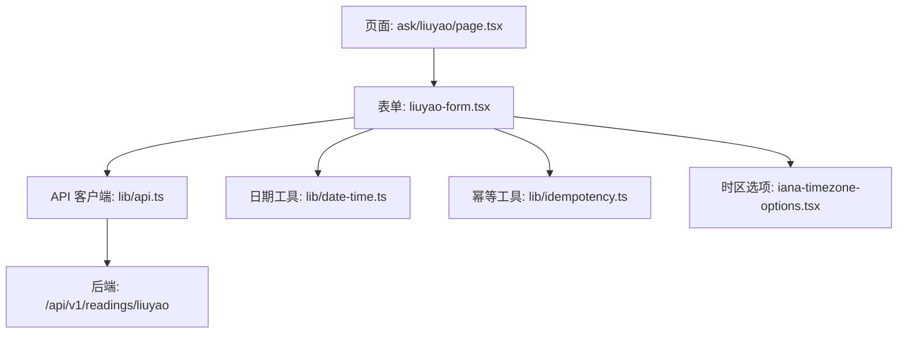
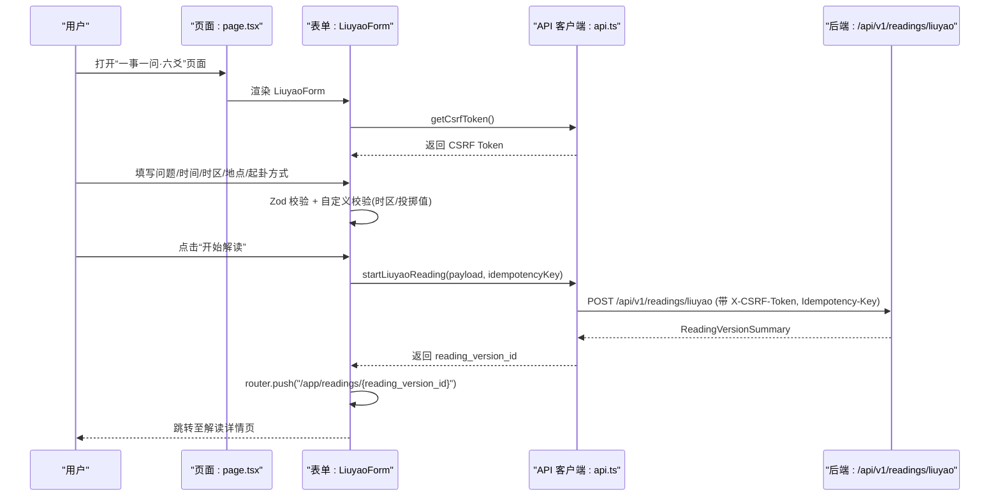
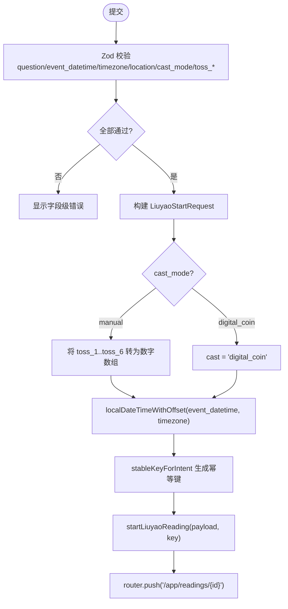
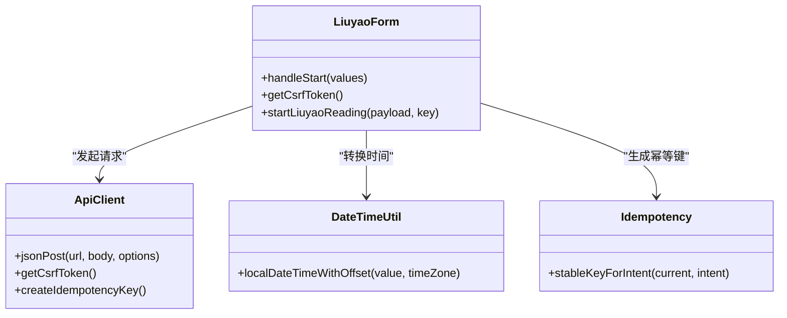
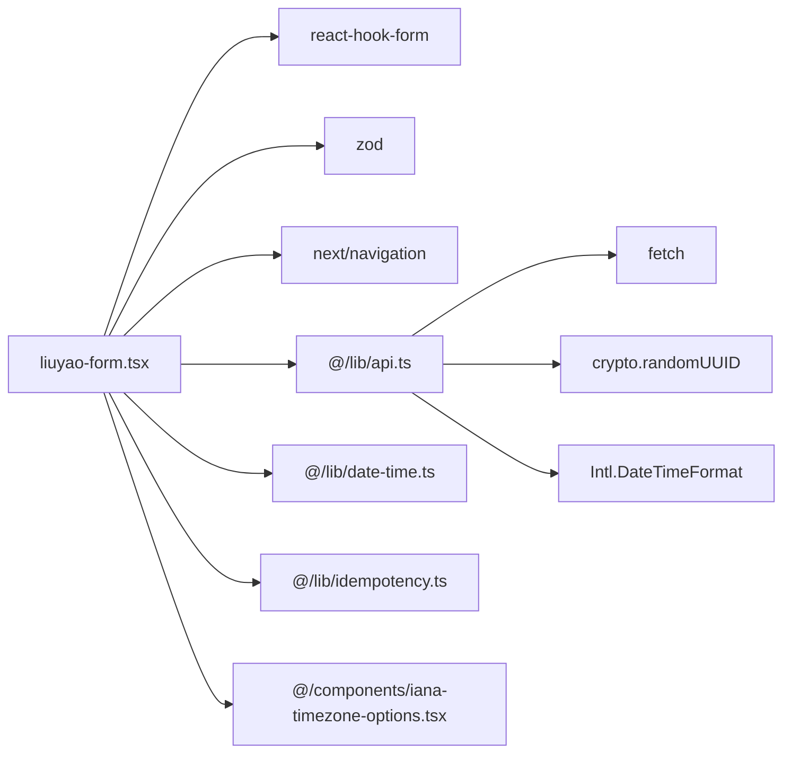

# 六爻表单组件

<cite>
**本文引用的文件**
- [liuyao-form.tsx](file://web/src/components/liuyao-form.tsx)
- [page.tsx](file://web/src/app/app/ask/liuyao/page.tsx)
- [api.ts](file://web/src/lib/api.ts)
- [date-time.ts](file://web/src/lib/date-time.ts)
- [idempotency.ts](file://web/src/lib/idempotency.ts)
- [iana-timezone-options.tsx](file://web/src/components/iana-timezone-options.tsx)
- [liuyao-form.module.css](file://web/src/components/liuyao-form.module.css)
- [liuyao-form.test.tsx](file://web/src/test/liuyao-form.test.tsx)
- [v1.yaml](file://contracts/openapi/v1.yaml)
</cite>

## 目录
1. [简介](#简介)
2. [项目结构](#项目结构)
3. [核心组件](#核心组件)
4. [架构总览](#架构总览)
5. [详细组件分析](#详细组件分析)
6. [依赖关系分析](#依赖关系分析)
7. [性能与可用性考虑](#性能与可用性考虑)
8. [故障排查指南](#故障排查指南)
9. [结论](#结论)
10. [附录：配置与扩展](#附录配置与扩展)

## 简介
本文件面向前端开发者与产品/测试人员，系统化说明“六爻表单组件”的实现与使用。重点覆盖：
- LiuyaoForm 如何收集用户问题、起卦时间、时区、地点与起卦方式（手动输入或电子摇卦）
- 表单校验规则与业务逻辑检查（含 IANA 时区白名单、投掷值范围、最小问题长度等）
- 与后端“六爻解读 API”的集成：请求参数构建、CSRF 安全会话、幂等键、响应处理与路由跳转
- 用户体验设计：错误提示、成功反馈、可访问性属性、禁用态与加载态
- 组件的可配置项与可扩展点（如维度、默认值、样式与交互文案）

## 项目结构
六爻表单由页面容器与表单组件组成，并通过统一的 API 客户端与后端服务通信。关键文件职责如下：
- 页面容器：负责标题、描述与元信息展示，并嵌入表单组件
- 表单组件：基于 React Hook Form + Zod 实现数据绑定、校验与提交
- API 客户端：封装 CSRF、幂等键、JSON POST、错误处理与类型定义
- 日期工具：将本地 datetime-local 值转换为带偏移的 ISO 字符串
- 幂等工具：根据意图生成稳定键，避免重复提交
- 时区选项：提供 datalist 供用户选择合法 IANA 时区
- 样式：表单布局、交互反馈与动画

图表来源
- [page.tsx:1-27](file://web/src/app/app/ask/liuyao/page.tsx#L1-L27)
- [liuyao-form.tsx:1-463](file://web/src/components/liuyao-form.tsx#L1-L463)
- [api.ts:256-330](file://web/src/lib/api.ts#L256-L330)
- [date-time.ts:34-57](file://web/src/lib/date-time.ts#L34-L57)
- [idempotency.ts:8-17](file://web/src/lib/idempotency.ts#L8-L17)
- [iana-timezone-options.tsx:4-11](file://web/src/components/iana-timezone-options.tsx#L4-L11)

章节来源
- [page.tsx:1-27](file://web/src/app/app/ask/liuyao/page.tsx#L1-L27)
- [liuyao-form.tsx:1-463](file://web/src/components/liuyao-form.tsx#L1-L463)
- [api.ts:1-537](file://web/src/lib/api.ts#L1-L537)

## 核心组件
LiuyaoForm 是六爻表单的核心，承担以下职责：
- 数据收集：问题、起卦时刻、时区、地点、起卦方式（手动/电子）、六次投掷结果
- 数据校验：Zod schema + 自定义 refine，确保字段合法性与时区有效性
- 业务组装：将表单值转换为后端所需的 LiuyaoStartRequest 结构
- 安全与会话：启动前获取 CSRF Token，提交时携带并处理 403 重试
- 幂等提交：为每次不同意图生成唯一幂等键，防止重复触发
- 导航与反馈：成功后跳转到解读详情页；失败显示错误信息；提交中锁定输入

章节来源
- [liuyao-form.tsx:37-86](file://web/src/components/liuyao-form.tsx#L37-L86)
- [liuyao-form.tsx:90-195](file://web/src/components/liuyao-form.tsx#L90-L195)
- [liuyao-form.tsx:203-463](file://web/src/components/liuyao-form.tsx#L203-L463)

## 架构总览
从用户操作到后端响应的完整流程如下：

图表来源
- [liuyao-form.tsx:123-195](file://web/src/components/liuyao-form.tsx#L123-L195)
- [api.ts:256-330](file://web/src/lib/api.ts#L256-L330)
- [api.ts:459-466](file://web/src/lib/api.ts#L459-L466)
- [v1.yaml:1-200](file://contracts/openapi/v1.yaml#L1-L200)

## 详细组件分析

### 表单数据模型与校验规则
- 字段集合
  - question：字符串，trim，最少 6 字，最多 120 字
  - event_datetime：datetime-local 格式字符串，需匹配本地日期时间模式
  - timezone：IANA 时区字符串，必须来自允许列表
  - location：字符串，trim，最少 1 字，最多 80 字
  - cast_mode：枚举 manual | digital_coin
  - toss_1..toss_6：当 cast_mode=manual 时必填，取值 6/7/8/9
- 自定义校验
  - 时区校验：为空或不在 IANA 白名单时报错
  - 投掷校验：手动模式下，六次投掷均需为有效值
- 默认值
  - timezone 默认 Asia/Shanghai
  - cast_mode 默认 manual
  - toss_1..toss_6 默认空串

图表来源
- [liuyao-form.tsx:37-86](file://web/src/components/liuyao-form.tsx#L37-L86)
- [liuyao-form.tsx:150-195](file://web/src/components/liuyao-form.tsx#L150-L195)
- [date-time.ts:34-57](file://web/src/lib/date-time.ts#L34-L57)
- [idempotency.ts:8-17](file://web/src/lib/idempotency.ts#L8-L17)

章节来源
- [liuyao-form.tsx:37-86](file://web/src/components/liuyao-form.tsx#L37-L86)
- [liuyao-form.tsx:105-120](file://web/src/components/liuyao-form.tsx#L105-L120)
- [liuyao-form.tsx:150-195](file://web/src/components/liuyao-form.tsx#L150-L195)

### 与六爻解读 API 的集成
- 请求端点：POST /api/v1/readings/liuyao
- 请求体：LiuyaoStartRequest
  - cast：数字数组或 "digital_coin"
  - event_datetime：带偏移的 ISO 字符串（由 date-time 工具转换）
  - timezone：IANA 时区
  - location：城市级地点
  - query：用户问题正文
  - dimension_ids：固定包含 "career"（当前交付范围：事业与工作）
- 安全与会话
  - 提交前调用 getCsrfToken()，并在请求头设置 X-CSRF-Token
  - 若收到 403 CSRF 失败，自动清理缓存并重试一次
- 幂等性
  - 使用 stableKeyForIntent 基于 payload 指纹生成幂等键
  - 相同意图复用同一键，避免重复触发
- 响应处理
  - 成功：读取 reading_version_id，跳转至 /app/readings/{reading_version_id}
  - 失败：捕获 ApiError 并展示友好错误消息

图表来源
- [liuyao-form.tsx:150-195](file://web/src/components/liuyao-form.tsx#L150-L195)
- [api.ts:256-330](file://web/src/lib/api.ts#L256-L330)
- [api.ts:387-392](file://web/src/lib/api.ts#L387-L392)
- [api.ts:459-466](file://web/src/lib/api.ts#L459-L466)
- [date-time.ts:34-57](file://web/src/lib/date-time.ts#L34-L57)
- [idempotency.ts:8-17](file://web/src/lib/idempotency.ts#L8-L17)

章节来源
- [api.ts:256-330](file://web/src/lib/api.ts#L256-L330)
- [api.ts:459-466](file://web/src/lib/api.ts#L459-L466)
- [date-time.ts:34-57](file://web/src/lib/date-time.ts#L34-L57)
- [idempotency.ts:8-17](file://web/src/lib/idempotency.ts#L8-L17)

### 用户体验设计与可访问性
- 状态与反馈
  - 建立安全会话中：显示“正在建立安全会话…”
  - 会话失败：显示错误信息与“重新连接”按钮
  - 提交中：禁用输入与按钮，显示“正在提交解读…”
  - 提交成功：跳转至解读详情页
  - 提交失败：顶部错误提示区域显示错误原因
- 可访问性
  - 所有输入均具备 label、aria-required、aria-invalid、aria-describedby
  - 错误信息使用 role="alert" 与 aria-live 提升读屏体验
  - 时区输入使用 datalist 提供可选列表，便于筛选与选择
- 视觉与交互
  - 卡片式布局、入场动画、聚焦与悬停反馈
  - 手动模式下以网格展示六次投掷下拉框，清晰标注爻位顺序与含义

章节来源
- [liuyao-form.tsx:203-463](file://web/src/components/liuyao-form.tsx#L203-L463)
- [liuyao-form.module.css:1-150](file://web/src/components/liuyao-form.module.css#L1-L150)
- [iana-timezone-options.tsx:4-11](file://web/src/components/iana-timezone-options.tsx#L4-L11)

### 单元测试要点
- 手动输入卦象路径：验证表单提交后调用 startLiuyaoReading 并正确传递 cast 数组、query、location、timezone、dimension_ids 与幂等键
- 必填校验：未填写时间与地点时，应显示内联错误且不发起请求
- IANA 时区白名单：非法时区应阻止提交并显示提示
- 电子摇卦：选择“电子摇卦”时，cast 应为 "digital_coin"，且浏览器不生成随机数
- 问题长度限制：少于 6 字应显示错误提示

章节来源
- [liuyao-form.test.tsx:55-203](file://web/src/test/liuyao-form.test.tsx#L55-L203)

## 依赖关系分析
- 组件耦合
  - LiuyaoForm 依赖 react-hook-form 与 zod 进行表单管理与校验
  - 依赖 next/navigation 进行路由跳转
  - 依赖 @/lib/* 模块完成时间转换、幂等键生成与 API 调用
  - 依赖 CSS Modules 管理样式
- 外部依赖
  - 后端 OpenAPI 定义的 /api/v1/readings/liuyao 接口
  - 浏览器原生 fetch、crypto.randomUUID、Intl.DateTimeFormat

图表来源
- [liuyao-form.tsx:1-23](file://web/src/components/liuyao-form.tsx#L1-L23)
- [api.ts:256-330](file://web/src/lib/api.ts#L256-L330)
- [date-time.ts:4-21](file://web/src/lib/date-time.ts#L4-L21)
- [idempotency.ts:1-17](file://web/src/lib/idempotency.ts#L1-L17)

章节来源
- [liuyao-form.tsx:1-23](file://web/src/components/liuyao-form.tsx#L1-L23)
- [api.ts:256-330](file://web/src/lib/api.ts#L256-L330)

## 性能与可用性考虑
- 减少无效请求
  - 前端 Zod 校验拦截非法输入，避免无意义网络请求
  - 幂等键避免重复提交导致的多份解读
- 安全与会话优化
  - CSRF Token 缓存与按需刷新，减少重复握手
  - 403 自动重试机制提升健壮性
- 渲染与交互
  - 提交期间禁用输入，避免并发修改
  - 仅渲染必要的 UI（如手动模式下才显示投掷选择）
- 可访问性与国际化
  - 完整的 ARIA 属性与语义化标签
  - 时区与日期使用标准库处理，避免本地化偏差

[本节为通用指导，不直接分析具体文件]

## 故障排查指南
- 无法提交或频繁报错
  - 检查是否已建立安全会话（页面顶部是否有“正在建立安全会话…”长时间停留）
  - 确认浏览器 Cookie 与跨域策略正常，必要时点击“重新连接”
- 时区相关错误
  - 确保选择的 IANA 时区在 datalist 列表中
  - 若出现“无法确认所选时区的 UTC 偏移”，请更换时区或检查系统时间设置
- 投掷值错误
  - 手动模式下，六次投掷必须为 6/7/8/9
  - 切换为“电子摇卦”后，不再需要填写投掷值
- 问题长度不足
  - 问题至少 6 个字，建议更具体以便生成高质量解读
- 网络或服务异常
  - 查看控制台与网络面板，确认 /api/v1/readings/liuyao 是否返回 2xx
  - 若返回 403，等待自动重试；仍失败则刷新页面重试

章节来源
- [liuyao-form.tsx:123-195](file://web/src/components/liuyao-form.tsx#L123-L195)
- [api.ts:256-330](file://web/src/lib/api.ts#L256-L330)
- [date-time.ts:34-57](file://web/src/lib/date-time.ts#L34-L57)

## 结论
LiuyaoForm 以严谨的前端校验与安全机制为基础，结合稳定的幂等提交与友好的用户体验，完成了六爻占卜问题的采集与解读启动。其模块化设计与清晰的职责边界，使得后续扩展（如新增维度、调整校验规则、增强交互）变得简单可控。

[本节为总结，不直接分析具体文件]

## 附录：配置与扩展
- 可配置项
  - 默认时区：可在 defaultValues 中调整
  - 默认起卦方式：cast_mode 默认值
  - 维度范围：dimension_ids 当前固定为 ["career"]，如需扩展需同步更新后端能力与前端常量
  - 问题长度限制：min/max 可在 schema 中调整
  - 投掷值集合：tossKeys 与校验逻辑可据此扩展
- 自定义扩展方法
  - 新增字段：在 schema 中添加字段与默认值，并在 UI 中注册对应控件
  - 新增校验：在 superRefine 中加入自定义规则
  - 新增维度：在构建 payload 时追加 dimension_ids，并确保后端支持
  - 新增交互：在表单中增加条件渲染与联动逻辑
- 样式定制
  - 通过 liuyao-form.module.css 调整布局、颜色与动画
  - 复用 form-controls.module.css 中的基础控件样式保持一致性

章节来源
- [liuyao-form.tsx:37-86](file://web/src/components/liuyao-form.tsx#L37-L86)
- [liuyao-form.tsx:105-120](file://web/src/components/liuyao-form.tsx#L105-L120)
- [liuyao-form.tsx:168-178](file://web/src/components/liuyao-form.tsx#L168-L178)
- [liuyao-form.module.css:1-150](file://web/src/components/liuyao-form.module.css#L1-L150)