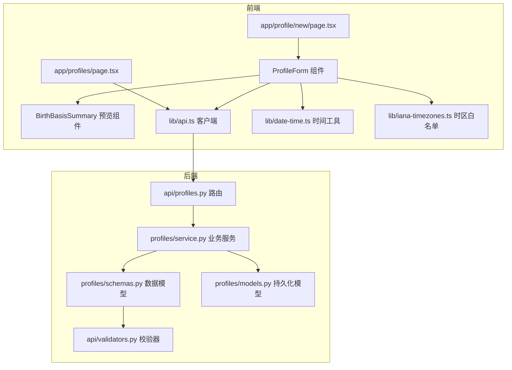
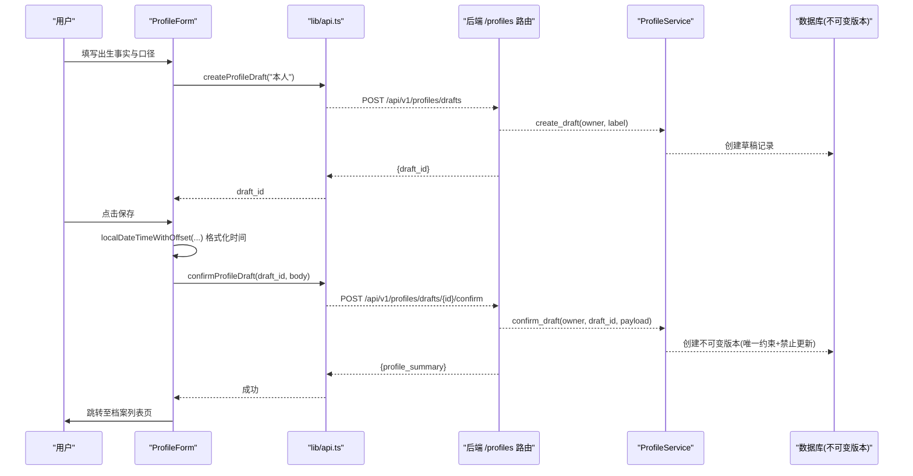
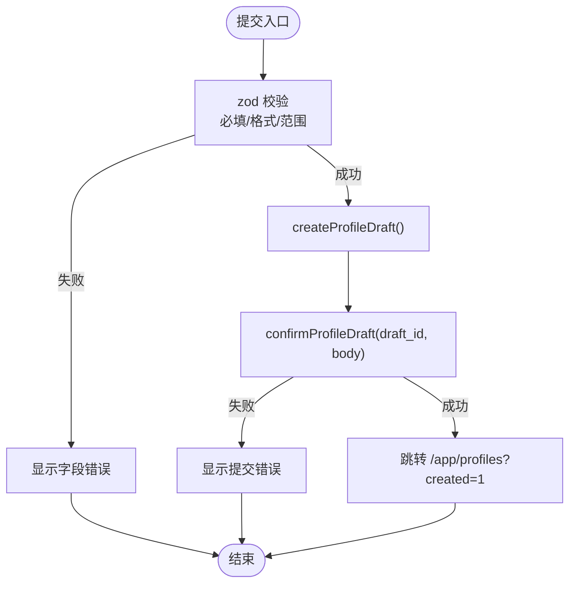
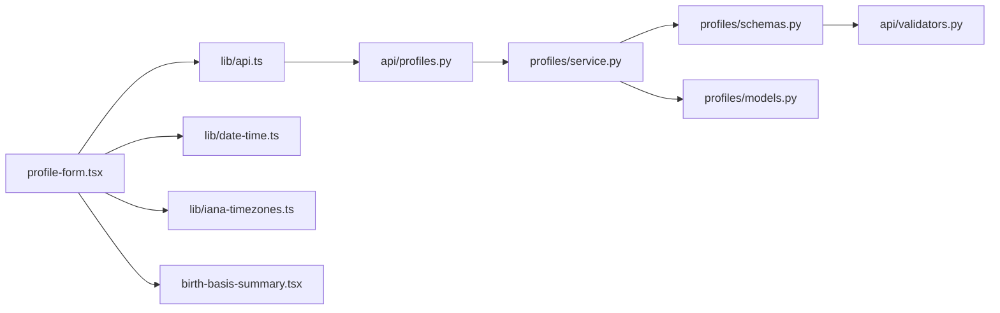

# 档案表单组件

<cite>
**本文引用的文件**
- [web/src/components/profile-form.tsx](file://web/src/components/profile-form.tsx)
- [web/src/components/profile-form.module.css](file://web/src/components/profile-form.module.css)
- [web/src/components/birth-basis-summary.tsx](file://web/src/components/birth-basis-summary.tsx)
- [web/src/lib/api.ts](file://web/src/lib/api.ts)
- [web/src/lib/date-time.ts](file://web/src/lib/date-time.ts)
- [web/src/lib/iana-timezones.ts](file://web/src/lib/iana-timezones.ts)
- [web/src/app/app/profile/new/page.tsx](file://web/src/app/app/profile/new/page.tsx)
- [web/src/app/app/profiles/page.tsx](file://web/src/app/app/profiles/page.tsx)
- [backend/app/api/profiles.py](file://backend/app/api/profiles.py)
- [backend/app/profiles/schemas.py](file://backend/app/profiles/schemas.py)
- [backend/app/profiles/service.py](file://backend/app/profiles/service.py)
- [backend/app/profiles/models.py](file://backend/app/profiles/models.py)
- [backend/app/api/validators.py](file://backend/app/api/validators.py)
- [web/src/test/profile-form.test.tsx](file://web/src/test/profile-form.test.tsx)
</cite>

## 目录
1. [简介](#简介)
2. [项目结构](#项目结构)
3. [核心组件](#核心组件)
4. [架构总览](#架构总览)
5. [详细组件分析](#详细组件分析)
6. [依赖关系分析](#依赖关系分析)
7. [性能与可用性](#性能与可用性)
8. [故障排查指南](#故障排查指南)
9. [结论](#结论)
10. [附录：字段校验与提交映射](#附录字段校验与提交映射)

## 简介
本文件面向“档案表单组件”的完整实现，聚焦 ProfileForm 组件在用户档案信息的录入、编辑与管理中的职责。文档覆盖表单字段验证规则、数据绑定与提交处理、复杂用户信息结构（出生时间、姓名/地点、性别、时间口径、子时口径、经纬度等）的处理方式，以及与后端档案 API 的集成流程（创建草稿、确认归档、列出档案）。同时说明前端状态管理、错误处理与用户反馈机制，并提供可定制的扩展点建议。

## 项目结构
ProfileForm 位于 web 前端 Next.js 应用中，作为“新建档案”页面的核心表单；其后端通过 FastAPI 暴露档案相关接口，服务层负责草稿创建与不可变版本确认。

图表来源
- [web/src/components/profile-form.tsx:1-570](file://web/src/components/profile-form.tsx#L1-L570)
- [web/src/lib/api.ts:394-416](file://web/src/lib/api.ts#L394-L416)
- [backend/app/api/profiles.py:43-111](file://backend/app/api/profiles.py#L43-L111)
- [backend/app/profiles/schemas.py:10-60](file://backend/app/profiles/schemas.py#L10-L60)
- [backend/app/profiles/service.py:44-113](file://backend/app/profiles/service.py#L44-L113)
- [backend/app/profiles/models.py:21-80](file://backend/app/profiles/models.py#L21-L80)
- [backend/app/api/validators.py:1-10](file://backend/app/api/validators.py#L1-L10)

章节来源
- [web/src/app/app/profile/new/page.tsx:1-27](file://web/src/app/app/profile/new/page.tsx#L1-L27)
- [web/src/app/app/profiles/page.tsx:1-43](file://web/src/app/app/profiles/page.tsx#L1-L43)

## 核心组件
- ProfileForm：基于 react-hook-form + zod 的三步骤表单（出生事实、计算口径、提交前核对），负责字段校验、条件显示、数据格式化与提交。
- BirthBasisSummary：实时预览当前输入的关键口径，帮助用户确认最终提交内容。
- lib/api.ts：封装 CSRF、幂等键、请求封装以及档案相关的 createProfileDraft、confirmProfileDraft、listProfiles。
- lib/date-time.ts：将本地 datetime-local 值转换为带偏移量的 ISO 字符串，确保服务端接收的是规范化的带偏移时间。
- lib/iana-timezones.ts：提供完整的 IANA 时区列表与 isIanaTimeZone 校验函数。

章节来源
- [web/src/components/profile-form.tsx:112-218](file://web/src/components/profile-form.tsx#L112-L218)
- [web/src/components/birth-basis-summary.tsx:7-98](file://web/src/components/birth-basis-summary.tsx#L7-L98)
- [web/src/lib/api.ts:394-416](file://web/src/lib/api.ts#L394-L416)
- [web/src/lib/date-time.ts:34-57](file://web/src/lib/date-time.ts#L34-L57)
- [web/src/lib/iana-timezones.ts:423-428](file://web/src/lib/iana-timezones.ts#L423-L428)

## 架构总览
前端表单通过两步式 API 完成档案创建：先创建草稿，再携带用户选择的口径与出生事实进行确认，生成不可变版本。后端对请求体进行严格校验，并保证版本不可变。

图表来源
- [web/src/components/profile-form.tsx:166-218](file://web/src/components/profile-form.tsx#L166-L218)
- [web/src/lib/api.ts:394-416](file://web/src/lib/api.ts#L394-L416)
- [backend/app/api/profiles.py:43-93](file://backend/app/api/profiles.py#L43-L93)
- [backend/app/profiles/service.py:52-105](file://backend/app/profiles/service.py#L52-L105)
- [backend/app/profiles/models.py:49-80](file://backend/app/profiles/models.py#L49-L80)

## 详细组件分析

### ProfileForm 组件
- 表单结构与步骤
  - 步骤一：出生事实（出生时间、时区、地点、性别）
  - 步骤二：计算口径（时间口径、子时口径；选择真太阳时时展开经纬度与坐标来源）
  - 步骤三：提交前核对（实时预览 BirthBasisSummary）
- 数据绑定与校验
  - 使用 react-hook-form 的 useForm/useWatch 管理表单状态与监听关键变化
  - 使用 zodResolver 与自定义 schema 进行强类型校验：
    - 出生时间：正则匹配本地日期时间格式
    - 时区：必须为 IANA 有效时区（前端白名单校验）
    - 地点：必填且长度限制
    - 性别、时间口径、子时口径：必填枚举
    - 经纬度：范围校验（经度 -180~180，纬度 -90~90）
- 数据格式化
  - 提交前调用 localDateTimeWithOffset，将本地 datetime-local 值转换为带 UTC 偏移的 ISO 字符串，避免时区歧义
  - 仅当时间口径为“真太阳时”且经纬度非空时才提交经纬度与坐标来源
- 提交流程
  - 先调用 createProfileDraft 获取 draft_id
  - 再调用 confirmProfileDraft 提交完整 payload
  - 成功后跳转到档案列表页并附带 created=1 查询参数
- 错误处理与用户反馈
  - 提交期间禁用输入与按钮，防止重复提交
  - 捕获网络或业务异常，展示友好错误提示
  - 字段级错误通过 zod 错误对象渲染到对应字段下方

图表来源
- [web/src/components/profile-form.tsx:66-108](file://web/src/components/profile-form.tsx#L66-L108)
- [web/src/components/profile-form.tsx:166-218](file://web/src/components/profile-form.tsx#L166-L218)
- [web/src/lib/date-time.ts:34-57](file://web/src/lib/date-time.ts#L34-L57)

章节来源
- [web/src/components/profile-form.tsx:28-108](file://web/src/components/profile-form.tsx#L28-L108)
- [web/src/components/profile-form.tsx:112-218](file://web/src/components/profile-form.tsx#L112-L218)
- [web/src/components/profile-form.tsx:220-569](file://web/src/components/profile-form.tsx#L220-L569)

### BirthBasisSummary 预览组件
- 作用：在提交前以只读形式复述用户选择的出生时间与口径，强调“最终以服务端口径为准”，避免前端做真实换算
- 行为：根据是否选择真太阳时/农历口径，给出相应提示；若未填写经度，提示可能退回民用时或要求补充地点信息

章节来源
- [web/src/components/birth-basis-summary.tsx:7-98](file://web/src/components/birth-basis-summary.tsx#L7-L98)

### 页面容器
- 新建档案页面：承载 ProfileForm，提供引导文案与安全提示
- 档案列表页面：加载并展示用户的档案版本历史，支持从历史版本继续解读

章节来源
- [web/src/app/app/profile/new/page.tsx:1-27](file://web/src/app/app/profile/new/page.tsx#L1-L27)
- [web/src/app/app/profiles/page.tsx:1-43](file://web/src/app/app/profiles/page.tsx#L1-L43)

### 后端 API 与服务
- 路由
  - POST /api/v1/profiles/drafts：创建草稿，返回 draft_id
  - POST /api/v1/profiles/drafts/{draft_id}/confirm：确认草稿，生成不可变版本，返回摘要
  - GET /api/v1/profiles：列出用户最新档案版本
- 数据模型与校验
  - ProfileConfirmRequest：严格限定 birth_datetime、timezone、location、gender、time_basis_policy、zi_hour_policy、可选经纬度与坐标来源
  - timezone 使用 ZoneInfo 校验，确保为合法 IANA 时区
- 服务层
  - create_draft：按所有者（用户或访客会话）创建草稿
  - confirm_draft：校验草稿归属与状态，创建不可变版本，抛出“已确认/不存在”等业务异常
  - list_profiles：返回最新版本摘要
- 不可变性
  - ProfileVersion 表具有唯一约束（profile_id, version），并通过事件钩子禁止更新，保障历史快照一致性

章节来源
- [backend/app/api/profiles.py:43-111](file://backend/app/api/profiles.py#L43-L111)
- [backend/app/profiles/schemas.py:10-60](file://backend/app/profiles/schemas.py#L10-L60)
- [backend/app/profiles/service.py:52-113](file://backend/app/profiles/service.py#L52-L113)
- [backend/app/profiles/models.py:49-80](file://backend/app/profiles/models.py#L49-L80)
- [backend/app/api/validators.py:1-10](file://backend/app/api/validators.py#L1-L10)

## 依赖关系分析
- 前端依赖
  - profile-form.tsx 依赖：react-hook-form、zod、next/navigation、@/lib/api、@/lib/date-time、@/lib/iana-timezones、birth-basis-summary
  - api.ts 提供 CSRF、幂等键、统一请求封装与档案 API 方法
  - date-time.ts 负责本地时间到带偏移时间的转换
  - iana-timezones.ts 提供时区白名单与校验
- 后端依赖
  - profiles.py 路由依赖 service、schemas、依赖注入（数据库会话、所有者身份）、速率限制
  - service.py 依赖 repository、models、security envelope、identity models
  - schemas.py 依赖 validators.py 进行时区校验

图表来源
- [web/src/components/profile-form.tsx:1-27](file://web/src/components/profile-form.tsx#L1-L27)
- [web/src/lib/api.ts:394-416](file://web/src/lib/api.ts#L394-L416)
- [backend/app/api/profiles.py:1-28](file://backend/app/api/profiles.py#L1-L28)
- [backend/app/profiles/service.py:44-113](file://backend/app/profiles/service.py#L44-L113)
- [backend/app/profiles/schemas.py:10-60](file://backend/app/profiles/schemas.py#L10-L60)
- [backend/app/profiles/models.py:21-80](file://backend/app/profiles/models.py#L21-L80)

章节来源
- [web/src/components/profile-form.tsx:1-27](file://web/src/components/profile-form.tsx#L1-L27)
- [web/src/lib/api.ts:235-330](file://web/src/lib/api.ts#L235-L330)
- [backend/app/api/profiles.py:1-28](file://backend/app/api/profiles.py#L1-L28)

## 性能与可用性
- 表单交互
  - 提交期间锁定输入与按钮，避免重复提交
  - 使用 useWatch 仅监听必要字段，减少重渲染开销
- 网络与并发
  - 通过 CSRF Token 与 Idempotency-Key 保护写操作，降低重复提交风险
  - 后端速率限制保护档案写入接口
- 可访问性
  - 所有输入均具备 aria-required、aria-invalid、aria-describedby 等无障碍属性
  - 错误区域使用 role="alert" 及时通知屏幕阅读器
- 样式与布局
  - 响应式网格布局，移动端单列、桌面端双列
  - 动画与过渡尊重系统“减少动态效果”设置

章节来源
- [web/src/components/profile-form.tsx:166-218](file://web/src/components/profile-form.tsx#L166-L218)
- [web/src/components/profile-form.tsx:220-569](file://web/src/components/profile-form.tsx#L220-L569)
- [web/src/components/profile-form.module.css:1-140](file://web/src/components/profile-form.module.css#L1-L140)
- [backend/app/api/profiles.py:35-41](file://backend/app/api/profiles.py#L35-L41)

## 故障排查指南
- 常见前端问题
  - 时区无效：检查是否选择了 IANA 列表中的时区；错误消息会提示“请选择列表中的有效 IANA 时区”
  - 出生时间格式错误：确保使用本地日期时间控件输入；错误消息会提示“请填写出生时间”
  - 地点过长：前端限制最多 80 字；超过会提示“地点最多 80 个字”
  - 真太阳时缺少经纬度：选择“真太阳时”后需填写经度/纬度；否则可能被服务端退回或要求补充
- 常见后端问题
  - 草稿不存在：确认先创建草稿并获得 draft_id 后再确认
  - 草稿已确认：同一草稿只能确认一次；如需修改请重新创建草稿
  - 时区非法：后端使用 ZoneInfo 校验，非法时会拒绝请求
- 调试建议
  - 查看浏览器控制台的网络请求，确认 CSRF 头与请求体是否正确
  - 使用测试用例中模拟的 API 行为验证表单流程

章节来源
- [web/src/test/profile-form.test.tsx:91-113](file://web/src/test/profile-form.test.tsx#L91-L113)
- [web/src/test/profile-form.test.tsx:115-146](file://web/src/test/profile-form.test.tsx#L115-L146)
- [backend/app/api/profiles.py:78-93](file://backend/app/api/profiles.py#L78-L93)
- [backend/app/profiles/service.py:65-105](file://backend/app/profiles/service.py#L65-L105)
- [backend/app/api/validators.py:4-9](file://backend/app/api/validators.py#L4-L9)

## 结论
ProfileForm 通过严谨的前端校验与清晰的用户引导，结合后端不可变版本机制，确保了用户档案数据的准确性与可追溯性。表单在用户体验、可访问性与安全性方面均有良好实践。后续可在不破坏现有契约的前提下，扩展更多字段或优化交互细节。

## 附录：字段校验与提交映射
- 字段与校验
  - 出生时间：本地日期时间格式，提交前转换为带偏移的 ISO 字符串
  - 时区：必须为 IANA 有效时区（前端白名单 + 后端 ZoneInfo 校验）
  - 地点：必填，最大长度限制
  - 性别：必填枚举
  - 时间口径：必填枚举（民用时/真太阳时/农历）
  - 子时口径：必填枚举（午夜换日/替代口径/太阳时判断）
  - 经纬度：仅在“真太阳时”且非空时提交，范围校验
  - 坐标来源：仅在“真太阳时”且非空时提交
- 提交映射
  - 前端调用 createProfileDraft 获取 draft_id
  - 前端调用 confirmProfileDraft 提交规范化后的 payload
  - 后端返回档案摘要，前端跳转至档案列表页

章节来源
- [web/src/components/profile-form.tsx:66-108](file://web/src/components/profile-form.tsx#L66-L108)
- [web/src/components/profile-form.tsx:166-218](file://web/src/components/profile-form.tsx#L166-L218)
- [web/src/lib/date-time.ts:34-57](file://web/src/lib/date-time.ts#L34-L57)
- [backend/app/profiles/schemas.py:23-44](file://backend/app/profiles/schemas.py#L23-L44)
- [backend/app/api/profiles.py:43-93](file://backend/app/api/profiles.py#L43-L93)