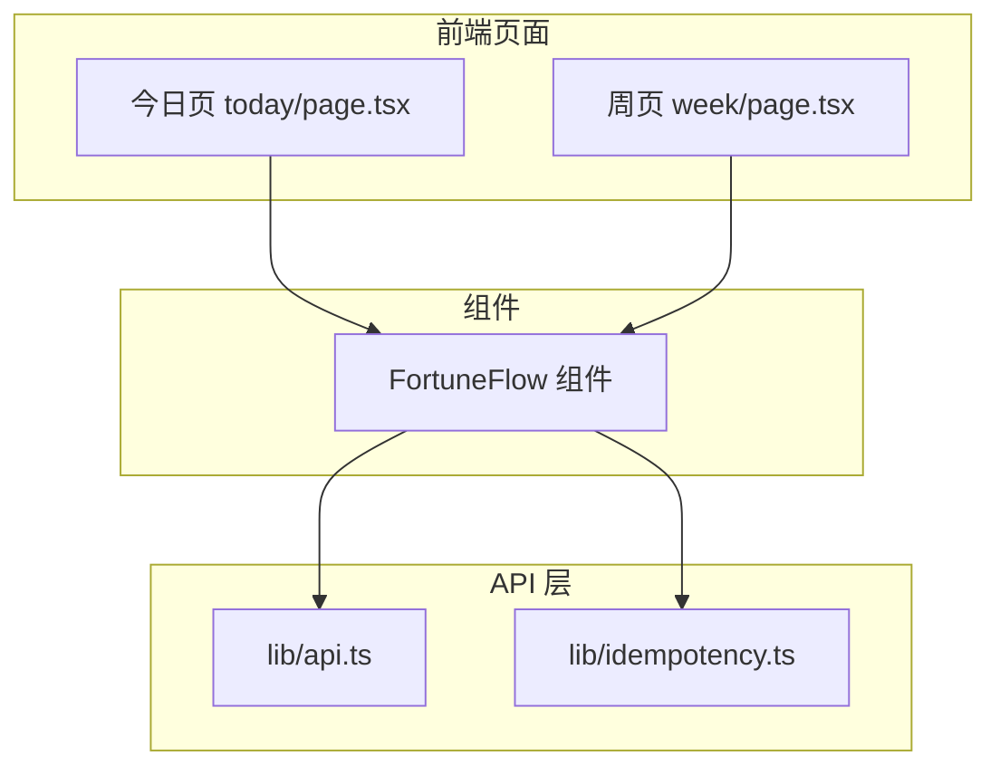
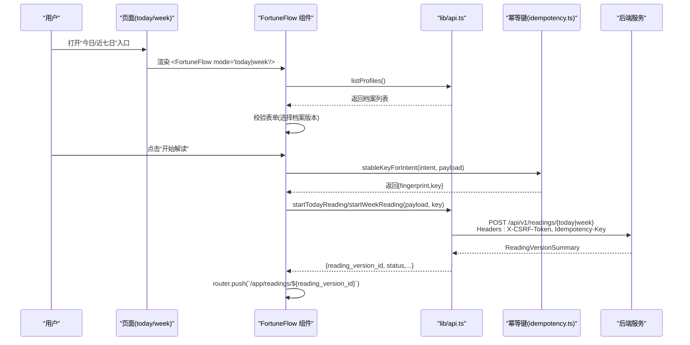
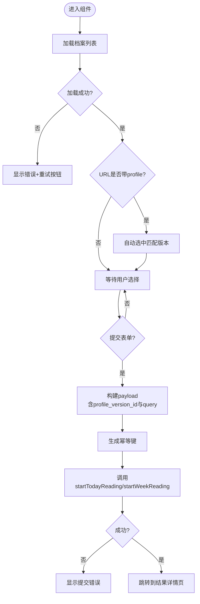
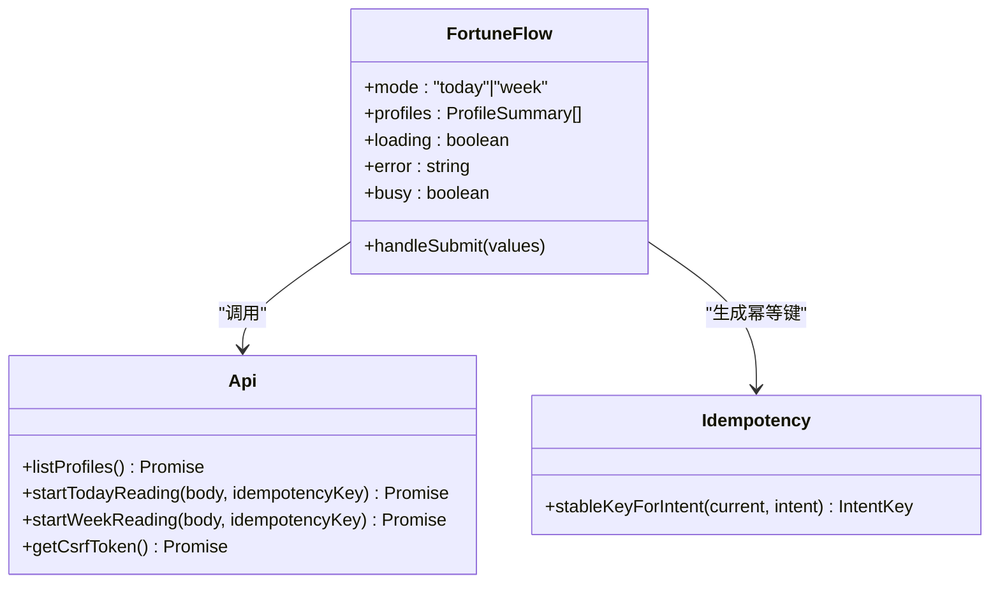
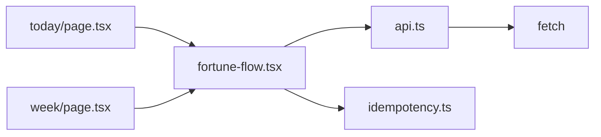

# 运势流程组件

<cite>
**本文引用的文件**
- [fortune-flow.tsx](file://web/src/components/fortune-flow.tsx)
- [fortune-flow.module.css](file://web/src/components/fortune-flow.module.css)
- [today/page.tsx](file://web/src/app/app/fortune/today/page.tsx)
- [week/page.tsx](file://web/src/app/app/fortune/week/page.tsx)
- [api.ts](file://web/src/lib/api.ts)
- [idempotency.ts](file://web/src/lib/idempotency.ts)
- [app-shell-contract.test.tsx](file://web/src/test/app-shell-contract.test.tsx)
</cite>

## 目录
1. [简介](#简介)
2. [项目结构](#项目结构)
3. [核心组件](#核心组件)
4. [架构总览](#架构总览)
5. [详细组件分析](#详细组件分析)
6. [依赖关系分析](#依赖关系分析)
7. [性能与可用性](#性能与可用性)
8. [故障排查指南](#故障排查指南)
9. [结论](#结论)
10. [附录：使用示例与最佳实践](#附录使用示例与最佳实践)

## 简介
本文件面向“运势流程组件”（FortuneFlow），聚焦其在“今日阶段解读”和“近七日阶段解读”两个入口中的实现。文档将系统说明：
- 组件如何接收并处理用户输入的时间范围与参数
- 如何进行表单校验、状态管理与错误处理
- 如何与后端API集成，包括请求参数构建、幂等键生成与响应数据流转
- 结果展示与跳转逻辑
- 可配置项、样式定制点与扩展点
- 使用示例与最佳实践

## 项目结构
运势流程由页面路由与通用组件组成：
- 页面路由负责承载标题、描述与Suspense边界，并将模式传递给组件
- FortuneFlow组件负责加载档案、渲染表单、发起解读、处理错误与跳转
- API层封装HTTP请求、CSRF、幂等键与类型定义
- 样式模块提供卡片式布局、动画与无障碍友好的交互基线

图表来源
- [today/page.tsx:1-29](file://web/src/app/app/fortune/today/page.tsx#L1-L29)
- [week/page.tsx:1-29](file://web/src/app/app/fortune/week/page.tsx#L1-L29)
- [fortune-flow.tsx:1-235](file://web/src/components/fortune-flow.tsx#L1-L235)
- [api.ts:256-330](file://web/src/lib/api.ts#L256-L330)
- [idempotency.ts:1-18](file://web/src/lib/idempotency.ts#L1-L18)

章节来源
- [today/page.tsx:1-29](file://web/src/app/app/fortune/today/page.tsx#L1-L29)
- [week/page.tsx:1-29](file://web/src/app/app/fortune/week/page.tsx#L1-L29)
- [fortune-flow.tsx:1-235](file://web/src/components/fortune-flow.tsx#L1-L235)

## 核心组件
FortuneFlow是一个客户端React组件，承担以下职责：
- 根据传入的mode（"today"或"week"）决定查询语义
- 异步加载用户已确认的档案列表，支持预选与重试
- 使用zod进行表单校验，确保选择了有效的档案版本
- 提交时构建请求体，生成幂等键，调用对应API启动解读
- 成功后跳转到结果详情页，失败时显示可操作的错误提示
- 在提交期间锁定界面，避免重复提交

关键行为要点：
- 时间范围由服务端确认，组件不自行计算日期区间；仅通过query字段表达意图
- 使用useSearchParams支持从URL预选档案版本
- 使用react-hook-form管理表单状态与校验错误
- 使用ref与busy状态防止并发提交
- 使用CSS模块提供一致的视觉与动效

章节来源
- [fortune-flow.tsx:23-235](file://web/src/components/fortune-flow.tsx#L23-L235)
- [fortune-flow.module.css:1-96](file://web/src/components/fortune-flow.module.css#L1-L96)

## 架构总览
下图展示了从页面到组件再到API的完整调用链，以及幂等键与CSRF的处理位置。

图表来源
- [fortune-flow.tsx:94-125](file://web/src/components/fortune-flow.tsx#L94-L125)
- [api.ts:441-457](file://web/src/lib/api.ts#L441-L457)
- [api.ts:292-330](file://web/src/lib/api.ts#L292-L330)
- [idempotency.ts:8-17](file://web/src/lib/idempotency.ts#L8-L17)

## 详细组件分析

### 组件结构与状态
- 输入属性
  - mode: "today" | "week"，用于区分查询语义与按钮文案
- 本地状态
  - profiles: 档案列表
  - loading/error: 档案加载状态
  - busy/submitError: 提交中状态与提交错误
  - loadAttempt: 用于触发重试
- 表单
  - 使用react-hook-form + zod校验，字段为profile_version_id
  - 支持从URL ?profile= 预选档案版本
- 副作用
  - 首次加载档案列表
  - 若URL携带profile且匹配成功则自动选中
  - 提交后跳转到结果页

图表来源
- [fortune-flow.tsx:55-86](file://web/src/components/fortune-flow.tsx#L55-L86)
- [fortune-flow.tsx:94-125](file://web/src/components/fortune-flow.tsx#L94-L125)

章节来源
- [fortune-flow.tsx:23-235](file://web/src/components/fortune-flow.tsx#L23-L235)

### 参数验证与时间范围处理
- 参数验证
  - 使用zod校验profile_version_id必填
  - 提交前禁用按钮，避免重复提交
- 时间范围
  - 组件不计算具体日期区间，而是通过query表达意图：
    - 今日："看看今天的事业与工作节奏"
    - 近七日："看看近七日的事业与工作节奏"
  - 最终日期范围由服务端确认，保证一致性

章节来源
- [fortune-flow.tsx:27-31](file://web/src/components/fortune-flow.tsx#L27-L31)
- [fortune-flow.tsx:100-106](file://web/src/components/fortune-flow.tsx#L100-L106)

### 与API的集成方式
- 请求构建
  - payload包含profile_version_id与query
  - 幂等键通过stableKeyForIntent生成，基于payload指纹去重
  - 通过jsonPost发送POST请求，自动附加X-CSRF-Token与Idempotency-Key
- 响应处理
  - 成功返回ReadingVersionSummary，包含reading_version_id
  - 组件据此跳转到结果详情页
- CSRF与重试
  - 若收到CSRF失败，自动清理缓存并重试一次
  - 所有请求统一通过requestJson/jsonPost封装，便于集中处理错误

图表来源
- [fortune-flow.tsx:94-125](file://web/src/components/fortune-flow.tsx#L94-L125)
- [api.ts:413-457](file://web/src/lib/api.ts#L413-L457)
- [api.ts:292-330](file://web/src/lib/api.ts#L292-L330)
- [idempotency.ts:8-17](file://web/src/lib/idempotency.ts#L8-L17)

章节来源
- [api.ts:256-330](file://web/src/lib/api.ts#L256-L330)
- [api.ts:441-457](file://web/src/lib/api.ts#L441-L457)
- [idempotency.ts:1-18](file://web/src/lib/idempotency.ts#L1-L18)

### 状态管理与用户体验优化
- 加载态
  - 档案加载中显示“正在加载档案…”
  - 无可用档案时引导新建档案
- 错误态
  - 档案加载失败显示错误消息与“重新加载”按钮
  - 提交失败显示友好错误信息
- 忙碌态
  - 提交期间禁用表单与按钮，显示“正在启动解读，选择与操作已暂时锁定”
- 可访问性
  - 使用aria-*标注表单控件与错误提示
  - 按钮最小高度与字号满足触控要求
- 防抖与幂等
  - 使用ref与busy双重保护防止重复提交
  - 幂等键基于payload指纹稳定化，避免网络抖动导致的重复创建

章节来源
- [fortune-flow.tsx:68-92](file://web/src/components/fortune-flow.tsx#L68-L92)
- [fortune-flow.tsx:138-231](file://web/src/components/fortune-flow.tsx#L138-L231)
- [fortune-flow.module.css:89-96](file://web/src/components/fortune-flow.module.css#L89-L96)

### 样式定制与扩展点
- 样式模块
  - 卡片容器、标题、说明文本、范围提示、状态与错误块、表单区域
  - 入场动画与减少动效适配
- 定制建议
  - 通过CSS变量覆盖主题色、圆角、阴影与字体
  - 调整间距与字号以适配不同屏幕
- 扩展点
  - 可在组件内增加更多query维度或提示文案
  - 可接入新的档案来源或预填策略
  - 可通过页面包装添加额外元信息与导航

章节来源
- [fortune-flow.module.css:1-96](file://web/src/components/fortune-flow.module.css#L1-L96)

## 依赖关系分析
- 组件依赖
  - next/navigation：路由与搜索参数
  - react-hook-form + zod：表单与校验
  - @/lib/api：档案列表、解读启动、CSRF与幂等
  - @/lib/idempotency：幂等键稳定化
- 页面依赖
  - AppPageHeader：页面级标题与描述
  - Suspense：懒加载占位
- API层依赖
  - fetch：网络请求
  - Cookie与Header：CSRF与幂等键传递

图表来源
- [today/page.tsx:1-29](file://web/src/app/app/fortune/today/page.tsx#L1-L29)
- [week/page.tsx:1-29](file://web/src/app/app/fortune/week/page.tsx#L1-L29)
- [fortune-flow.tsx:1-235](file://web/src/components/fortune-flow.tsx#L1-L235)
- [api.ts:256-330](file://web/src/lib/api.ts#L256-L330)
- [idempotency.ts:1-18](file://web/src/lib/idempotency.ts#L1-L18)

章节来源
- [fortune-flow.tsx:1-235](file://web/src/components/fortune-flow.tsx#L1-L235)
- [api.ts:256-330](file://web/src/lib/api.ts#L256-L330)

## 性能与可用性
- 性能
  - 单次加载档案列表，避免重复请求
  - 幂等键降低重复提交对服务器的压力
  - 使用Suspense包裹组件，提升首屏体验
- 可用性
  - 明确的加载、错误与忙碌状态
  - 可访问性标注完善，支持键盘与读屏
  - 按钮尺寸与文案符合移动端触控标准

[本节为通用指导，不直接分析具体文件]

## 故障排查指南
- 档案加载失败
  - 现象：显示错误消息与“重新加载”按钮
  - 处理：检查网络与权限，点击重试
  - 相关代码路径：[fortune-flow.tsx:68-92](file://web/src/components/fortune-flow.tsx#L68-L92)
- 提交失败
  - 现象：显示“解读启动失败，请稍后重试”
  - 处理：检查网络、CSRF与幂等键，稍后重试
  - 相关代码路径：[fortune-flow.tsx:115-122](file://web/src/components/fortune-flow.tsx#L115-L122)
- CSRF失效
  - 现象：403 CSRF validation failed
  - 处理：自动清理缓存并重试一次
  - 相关代码路径：[api.ts:317-329](file://web/src/lib/api.ts#L317-L329)
- 重复提交
  - 现象：多次点击导致多个解读任务
  - 处理：组件已通过busy与幂等键防护
  - 相关代码路径：[fortune-flow.tsx:94-125](file://web/src/components/fortune-flow.tsx#L94-L125), [idempotency.ts:8-17](file://web/src/lib/idempotency.ts#L8-L17)

章节来源
- [fortune-flow.tsx:68-125](file://web/src/components/fortune-flow.tsx#L68-L125)
- [api.ts:317-329](file://web/src/lib/api.ts#L317-L329)

## 结论
FortuneFlow组件以清晰的职责划分实现了“今日/近七日”运势解读的入口流程：
- 通过模式切换复用同一组件，简化维护
- 将时间范围交由服务端确认，保证一致性与准确性
- 借助表单校验、状态管理与幂等机制，提供良好的用户体验与健壮性
- 与API层解耦，便于扩展与测试

[本节为总结性内容，不直接分析具体文件]

## 附录：使用示例与最佳实践

### 页面集成示例
- 在“今日阶段解读”页面中引入组件并传入mode="today"
- 在“近七日阶段解读”页面中引入组件并传入mode="week"
- 使用Suspense包裹组件以提供加载占位

参考路径
- [today/page.tsx:10-25](file://web/src/app/app/fortune/today/page.tsx#L10-L25)
- [week/page.tsx:10-25](file://web/src/app/app/fortune/week/page.tsx#L10-L25)

### 表单与校验
- 使用zod定义必填字段，确保选择有效档案版本
- 通过react-hook-form统一管理表单状态与错误提示
- 支持从URL预选档案版本，提升多档案场景下的效率

参考路径
- [fortune-flow.tsx:27-53](file://web/src/components/fortune-flow.tsx#L27-L53)
- [fortune-flow.tsx:55-66](file://web/src/components/fortune-flow.tsx#L55-L66)

### 发起解读与跳转
- 构建payload包含profile_version_id与query
- 生成幂等键并调用对应API
- 成功后跳转到结果详情页

参考路径
- [fortune-flow.tsx:94-125](file://web/src/components/fortune-flow.tsx#L94-L125)
- [api.ts:441-457](file://web/src/lib/api.ts#L441-L457)

### 错误处理与重试
- 档案加载失败提供重试入口
- 提交失败显示友好错误信息
- CSRF失效自动重试

参考路径
- [fortune-flow.tsx:68-92](file://web/src/components/fortune-flow.tsx#L68-L92)
- [fortune-flow.tsx:115-122](file://web/src/components/fortune-flow.tsx#L115-L122)
- [api.ts:317-329](file://web/src/lib/api.ts#L317-L329)

### 可访问性与样式
- 使用aria-*标注表单控件与错误提示
- 按钮最小高度与字号满足触控要求
- 通过CSS模块统一卡片样式与动画

参考路径
- [fortune-flow.tsx:165-231](file://web/src/components/fortune-flow.tsx#L165-L231)
- [fortune-flow.module.css:89-96](file://web/src/components/fortune-flow.module.css#L89-L96)

### 测试与契约
- 页面级H1与组件内H2的层级契约
- 提交期间控件禁用与提示文案的契约
- 通过mock API验证流程

参考路径
- [app-shell-contract.test.tsx:117-120](file://web/src/test/app-shell-contract.test.tsx#L117-L120)
- [app-shell-contract.test.tsx:176-191](file://web/src/test/app-shell-contract.test.tsx#L176-L191)