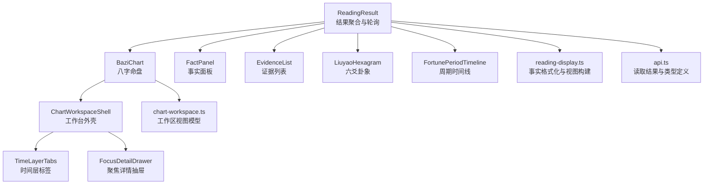
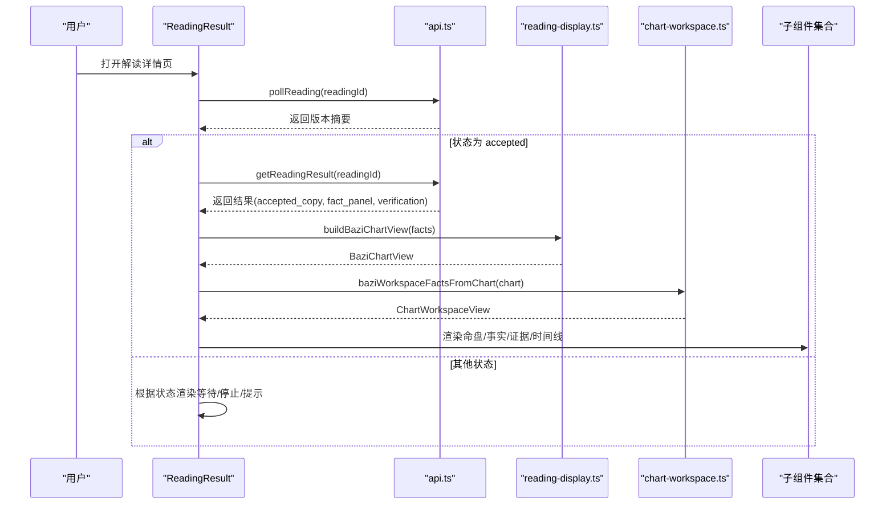
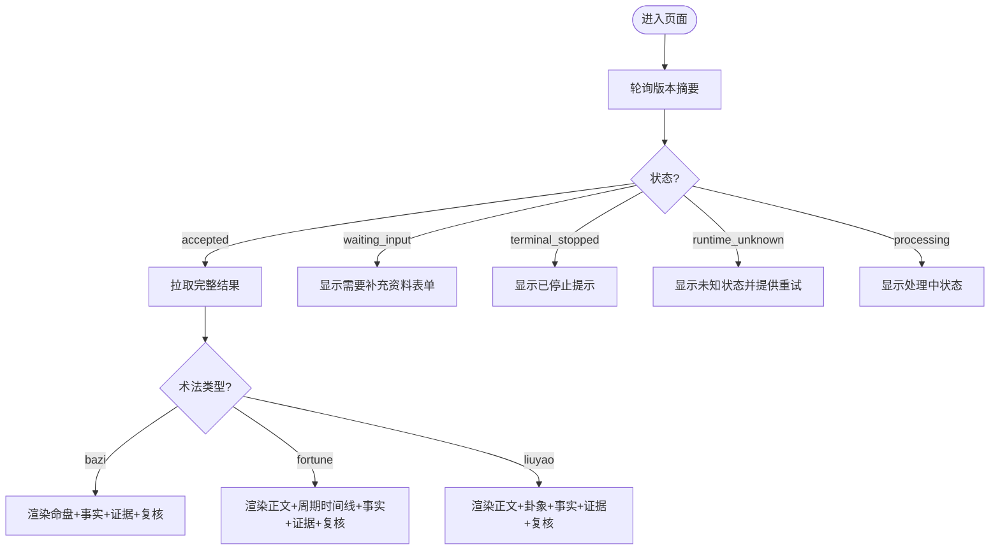
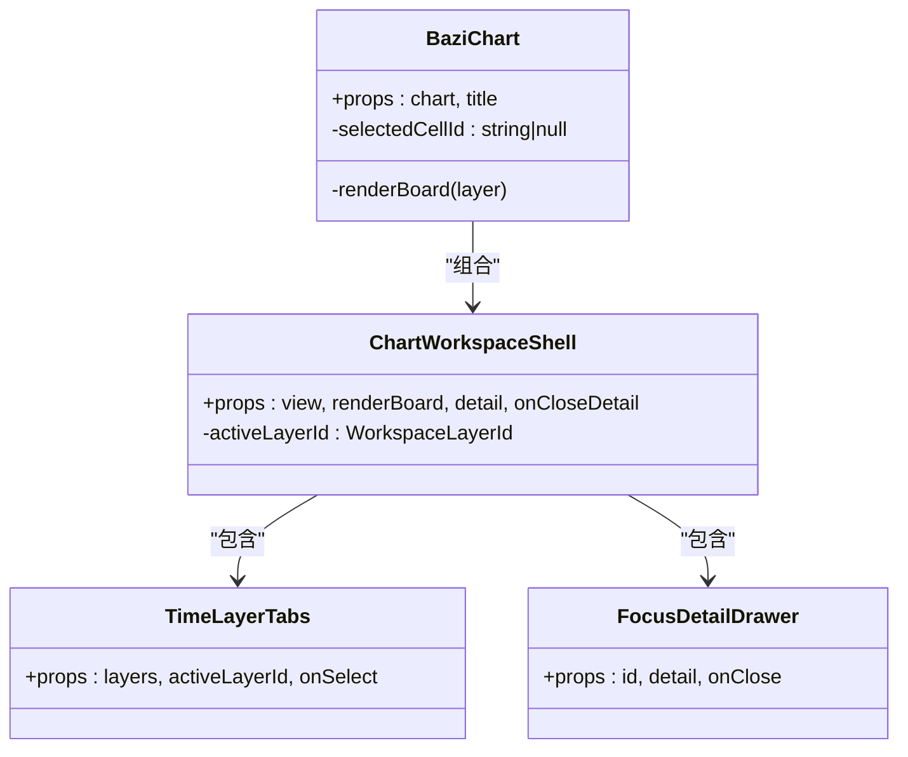
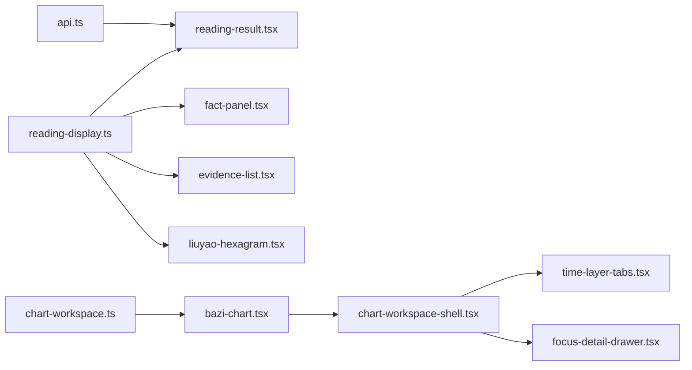

# 命理解读组件

<cite>
**本文引用的文件**
- [web/src/components/readings/reading-result.tsx](file://web/src/components/readings/reading-result.tsx)
- [web/src/components/readings/bazi-chart.tsx](file://web/src/components/readings/bazi-chart.tsx)
- [web/src/components/readings/evidence-list.tsx](file://web/src/components/readings/evidence-list.tsx)
- [web/src/components/readings/fact-panel.tsx](file://web/src/components/readings/fact-panel.tsx)
- [web/src/components/readings/time-layer-tabs.tsx](file://web/src/components/readings/time-layer-tabs.tsx)
- [web/src/components/readings/chart-workspace-shell.tsx](file://web/src/components/readings/chart-workspace-shell.tsx)
- [web/src/components/readings/liuyao-hexagram.tsx](file://web/src/components/readings/liuyao-hexagram.tsx)
- [web/src/components/readings/fortune-period-timeline.tsx](file://web/src/components/readings/fortune-period-timeline.tsx)
- [web/src/components/readings/focus-detail-drawer.tsx](file://web/src/components/readings/focus-detail-drawer.tsx)
- [web/src/lib/chart-workspace.ts](file://web/src/lib/chart-workspace.ts)
- [web/src/lib/reading-display.ts](file://web/src/lib/reading-display.ts)
- [web/src/lib/api.ts](file://web/src/lib/api.ts)
</cite>

## 目录
1. [简介](#简介)
2. [项目结构](#项目结构)
3. [核心组件](#核心组件)
4. [架构总览](#架构总览)
5. [详细组件分析](#详细组件分析)
6. [依赖关系分析](#依赖关系分析)
7. [性能考量](#性能考量)
8. [故障排查指南](#故障排查指南)
9. [结论](#结论)
10. [附录](#附录)

## 简介
本文件面向“命理解读”相关的前端展示与交互组件，系统性说明解读结果展示、命盘图表、证据列表、事实面板、时间层标签等核心组件的职责、数据流、用户交互设计、复杂图表实现原理与性能优化策略。同时覆盖解读结果的版本管理与历史对比能力，以及前端配置选项与主题定制方式，并解释与命理算法引擎（后端）的数据对接契约。

## 项目结构
命理解读组件位于 web 前端工程内，围绕“读取结果页”组织：
- 结果聚合与状态轮询：ReadingResult
- 命盘可视化：BaziChart + ChartWorkspaceShell + TimeLayerTabs + FocusDetailDrawer
- 六爻卦象：LiuyaoHexagram
- 周期时间线：FortunePeriodTimeline
- 事实与依据：FactPanel、EvidenceList
- 显示适配与格式化：reading-display、chart-workspace
- 数据接口与类型：api.ts

**图示来源**
- [web/src/components/readings/reading-result.tsx:172-578](file://web/src/components/readings/reading-result.tsx#L172-L578)
- [web/src/components/readings/bazi-chart.tsx:129-203](file://web/src/components/readings/bazi-chart.tsx#L129-L203)
- [web/src/components/readings/chart-workspace-shell.tsx:22-101](file://web/src/components/readings/chart-workspace-shell.tsx#L22-L101)
- [web/src/components/readings/time-layer-tabs.tsx:17-104](file://web/src/components/readings/time-layer-tabs.tsx#L17-L104)
- [web/src/components/readings/focus-detail-drawer.tsx:14-140](file://web/src/components/readings/focus-detail-drawer.tsx#L14-L140)
- [web/src/lib/chart-workspace.ts:1-303](file://web/src/lib/chart-workspace.ts#L1-L303)
- [web/src/lib/reading-display.ts:579-691](file://web/src/lib/reading-display.ts#L579-L691)
- [web/src/lib/api.ts:70-170](file://web/src/lib/api.ts#L70-L170)

**章节来源**
- [web/src/components/readings/reading-result.tsx:172-578](file://web/src/components/readings/reading-result.tsx#L172-L578)
- [web/src/lib/api.ts:70-170](file://web/src/lib/api.ts#L70-L170)

## 核心组件
- ReadingResult：负责读取结果的状态轮询、错误处理、分支渲染（等待输入、已停止、已交付），并按术法类型（八字/日运周运/六爻）组装子组件。
- BaziChart：将服务端公开事实映射为可聚焦的四柱网格，结合 ChartWorkspaceShell 提供时间层切换与聚焦详情。
- FactPanel：以卡片形式呈现确定性事实，区分主次，并展示上一版已接纳正文与解读范围。
- EvidenceList：展示依据来源及其支持的事实引用，便于用户核对。
- LiuyaoHexagram：仅复述服务端公开的卦象事实，不本地起卦或补算。
- FortunePeriodTimeline：按顺序展示周期标记，缺字段直接省略。
- TimeLayerTabs：基于工作区视图的时间层标签栏，支持键盘导航与无障碍标注。
- FocusDetailDrawer：聚焦详情抽屉，仅展示与服务端事实关联的边界与来源。

**章节来源**
- [web/src/components/readings/reading-result.tsx:172-578](file://web/src/components/readings/reading-result.tsx#L172-L578)
- [web/src/components/readings/bazi-chart.tsx:129-203](file://web/src/components/readings/bazi-chart.tsx#L129-L203)
- [web/src/components/readings/fact-panel.tsx:12-126](file://web/src/components/readings/fact-panel.tsx#L12-L126)
- [web/src/components/readings/evidence-list.tsx:6-53](file://web/src/components/readings/evidence-list.tsx#L6-L53)
- [web/src/components/readings/liuyao-hexagram.tsx:238-337](file://web/src/components/readings/liuyao-hexagram.tsx#L238-L337)
- [web/src/components/readings/fortune-period-timeline.tsx:6-50](file://web/src/components/readings/fortune-period-timeline.tsx#L6-L50)
- [web/src/components/readings/time-layer-tabs.tsx:17-104](file://web/src/components/readings/time-layer-tabs.tsx#L17-L104)
- [web/src/components/readings/focus-detail-drawer.tsx:14-140](file://web/src/components/readings/focus-detail-drawer.tsx#L14-L140)

## 架构总览
前端采用“纯展示+纯视图模型”的分层：
- 数据层：api.ts 提供类型与请求封装，ReadingResult 通过轮询获取版本摘要与最终结果。
- 视图模型层：reading-display.ts 将服务端的 ReadingFact 序列化为可读中文；chart-workspace.ts 将八字事实投影为工作区视图（层、单元格、高亮、基础信息）。
- 组件层：各展示组件消费视图模型，严格遵循“只展示服务端公开事实”的原则，不本地计算命盘或星曜。

**图示来源**
- [web/src/components/readings/reading-result.tsx:172-233](file://web/src/components/readings/reading-result.tsx#L172-L233)
- [web/src/lib/api.ts:256-330](file://web/src/lib/api.ts#L256-L330)
- [web/src/lib/reading-display.ts:604-657](file://web/src/lib/reading-display.ts#L604-L657)
- [web/src/lib/chart-workspace.ts:228-238](file://web/src/lib/chart-workspace.ts#L228-L238)

## 详细组件分析

### ReadingResult：结果聚合与状态机
- 职责：轮询读取版本摘要，当状态为 accepted 时拉取完整结果；按 capability_id 分支渲染不同内容；处理 waiting_input、terminal_stopped、runtime_unknown 等状态。
- 关键流程：
  - 使用定时器轮询 pollReading，成功后若为 accepted 则调用 getReadingResult。
  - 对非八字类结果，渲染判断正文、可选周期时间线、事实、证据、复核与追问。
  - 对八字结果，额外渲染命盘与事实、证据、复核与追问。
- 错误与重试：捕获异常并展示错误消息；提供重试按钮重置状态。

**图示来源**
- [web/src/components/readings/reading-result.tsx:172-233](file://web/src/components/readings/reading-result.tsx#L172-L233)
- [web/src/components/readings/reading-result.tsx:285-513](file://web/src/components/readings/reading-result.tsx#L285-L513)
- [web/src/components/readings/reading-result.tsx:515-578](file://web/src/components/readings/reading-result.tsx#L515-L578)

**章节来源**
- [web/src/components/readings/reading-result.tsx:172-578](file://web/src/components/readings/reading-result.tsx#L172-L578)

### BaziChart：八字命盘可视化
- 职责：将服务端公开事实转换为可聚焦的四柱网格，并通过 ChartWorkspaceShell 提供时间层切换与聚焦详情。
- 实现要点：
  - 使用 chart-workspace.ts 将 BaziChartView 转为 Workspace 视图模型。
  - PillarGrid 支持键盘导航（方向键、Home/End）与无障碍属性（aria-*）。
  - 非本命层（如大运/流年）若无逐柱结构，显示“未生成/暂无结构”的诚实文案。
- 交互：点击柱位弹出 FocusDetailDrawer，展示与该柱相关的公开事实与边界说明。

**图示来源**
- [web/src/components/readings/bazi-chart.tsx:129-203](file://web/src/components/readings/bazi-chart.tsx#L129-L203)
- [web/src/components/readings/chart-workspace-shell.tsx:22-101](file://web/src/components/readings/chart-workspace-shell.tsx#L22-L101)
- [web/src/components/readings/time-layer-tabs.tsx:17-104](file://web/src/components/readings/time-layer-tabs.tsx#L17-L104)
- [web/src/components/readings/focus-detail-drawer.tsx:14-140](file://web/src/components/readings/focus-detail-drawer.tsx#L14-L140)

**章节来源**
- [web/src/components/readings/bazi-chart.tsx:129-203](file://web/src/components/readings/bazi-chart.tsx#L129-L203)
- [web/src/lib/chart-workspace.ts:228-303](file://web/src/lib/chart-workspace.ts#L228-L303)

### FactPanel：事实面板
- 职责：展示本次问题、确定性事实（主/次）、上一版已接纳正文、解读范围（术法、对象、主题、目标日期）。
- 数据处理：通过 reading-display.ts 的 formatReadingFacts 将 ReadingFact 序列化为可读中文，并按 emphasis 分组。
- 空态与边界：无事实时给出明确提示；有 prior_answer 时展示上一版正文。

**章节来源**
- [web/src/components/readings/fact-panel.tsx:12-126](file://web/src/components/readings/fact-panel.tsx#L12-L126)
- [web/src/lib/reading-display.ts:573-577](file://web/src/lib/reading-display.ts#L573-L577)

### EvidenceList：证据列表
- 职责：展示依据来源、定位信息与摘录，并将 supports_fact_refs 映射到公开事实文本，形成“支持事实”链接。
- 空态：未返回依据时显示友好提示。

**章节来源**
- [web/src/components/readings/evidence-list.tsx:6-53](file://web/src/components/readings/evidence-list.tsx#L6-L53)
- [web/src/lib/reading-display.ts:467-571](file://web/src/lib/reading-display.ts#L467-L571)

### LiuyaoHexagram：六爻卦象
- 职责：仅复述服务端公开的卦象事实（本卦、变卦、动爻、世应、六爻细节），不本地起卦或补算。
- 解析逻辑：从 facts 中提取关键字段，构建 HexagramView，渲染爻位、状态、动/静、变爻与关联证据数量。

**章节来源**
- [web/src/components/readings/liuyao-hexagram.tsx:167-220](file://web/src/components/readings/liuyao-hexagram.tsx#L167-L220)
- [web/src/components/readings/liuyao-hexagram.tsx:238-337](file://web/src/components/readings/liuyao-hexagram.tsx#L238-L337)

### FortunePeriodTimeline：周期时间线
- 职责：按服务端返回顺序展示周期标记，缺失字段直接省略，浏览器不补算。
- 适用场景：日运/周运结果中抽取 period_markers 后渲染。

**章节来源**
- [web/src/components/readings/fortune-period-timeline.tsx:6-50](file://web/src/components/readings/fortune-period-timeline.tsx#L6-L50)

### TimeLayerTabs：时间层标签
- 职责：基于 workspace 视图渲染时间层标签，支持键盘导航（左右箭头、Home/End），不可用层禁用并标注。
- 无障碍：role="tablist/tab"，aria-selected、aria-disabled、aria-controls 等。

**章节来源**
- [web/src/components/readings/time-layer-tabs.tsx:17-104](file://web/src/components/readings/time-layer-tabs.tsx#L17-L104)

### FocusDetailDrawer：聚焦详情抽屉
- 职责：在命盘聚焦时展示该单元格的公开事实、边界说明与来源；支持 Escape 关闭与焦点管理。
- 数据来源：由 chart-workspace.ts 的 resolveBaziFocusDetail 生成。

**章节来源**
- [web/src/components/readings/focus-detail-drawer.tsx:14-140](file://web/src/components/readings/focus-detail-drawer.tsx#L14-L140)
- [web/src/lib/chart-workspace.ts:244-267](file://web/src/lib/chart-workspace.ts#L244-L267)

## 依赖关系分析
- 组件耦合：
  - ReadingResult 强依赖 api.ts 的类型与函数，弱依赖 reading-display 与 chart-workspace。
  - BaziChart 依赖 chart-workspace 的视图模型，通过 ChartWorkspaceShell 组合 TimeLayerTabs 与 FocusDetailDrawer。
  - FactPanel/EvidenceList/LiuyaoHexagram/FortunePeriodTimeline 均消费 reading-display 的输出。
- 外部依赖：
  - 后端通过 REST API 提供版本摘要与结果；前端仅做展示与简单格式化，不执行命理计算。
- 潜在循环：
  - 当前模块间为单向依赖，未发现循环导入。

**图示来源**
- [web/src/lib/api.ts:70-170](file://web/src/lib/api.ts#L70-L170)
- [web/src/lib/reading-display.ts:579-691](file://web/src/lib/reading-display.ts#L579-L691)
- [web/src/lib/chart-workspace.ts:1-303](file://web/src/lib/chart-workspace.ts#L1-L303)
- [web/src/components/readings/reading-result.tsx:172-578](file://web/src/components/readings/reading-result.tsx#L172-L578)

**章节来源**
- [web/src/lib/api.ts:70-170](file://web/src/lib/api.ts#L70-L170)
- [web/src/lib/reading-display.ts:579-691](file://web/src/lib/reading-display.ts#L579-L691)
- [web/src/lib/chart-workspace.ts:1-303](file://web/src/lib/chart-workspace.ts#L1-L303)

## 性能考量
- 轮询节流：ReadingResult 使用固定间隔轮询，避免频繁请求；在 terminal 状态或错误时及时停止。
- 视图模型缓存：BaziChart 使用 useMemo 构建工作区视图，减少重复计算。
- 最小化 DOM 更新：仅在状态变化时重渲染；证据列表通过 Map 去重与过滤，降低渲染开销。
- 无本地计算：所有命盘与卦象均由服务端提供，前端只做展示，避免昂贵计算。
- 无障碍与键盘导航：通过原生按钮与 aria 属性提升可访问性，减少自定义交互成本。

[本节为通用指导，不直接分析具体文件]

## 故障排查指南
- 轮询失败或超时：检查网络与后端健康；ReadingResult 会捕获异常并提示重试。
- 结果为空或事实缺失：确认服务端是否返回 public facts；chart-workspace 会将缺失层标记为 unavailable/empty。
- CSRF 验证失败：api.ts 内置重试机制，自动刷新会话并重试请求。
- 无法聚焦详情：确保选择的是有效 cell id；resolveBaziFocusDetail 会返回 null 表示未知单元格。

**章节来源**
- [web/src/components/readings/reading-result.tsx:251-266](file://web/src/components/readings/reading-result.tsx#L251-L266)
- [web/src/lib/chart-workspace.ts:244-267](file://web/src/lib/chart-workspace.ts#L244-L267)
- [web/src/lib/api.ts:292-330](file://web/src/lib/api.ts#L292-L330)

## 结论
命理解读组件以“服务端事实驱动”为核心原则，前端专注展示与交互，通过 reading-display 与 chart-workspace 将结构化事实转化为可读、可操作的界面。组件之间职责清晰、依赖单向，具备良好的可维护性与扩展性。未来可在不改变后端契约的前提下，持续增强可视化与用户体验。

[本节为总结，不直接分析具体文件]

## 附录

### 解读数据的可视化呈现与用户交互设计
- 结果页按状态分支渲染，提供清晰的进度反馈与操作入口（重试、重新发起、补充资料）。
- 命盘采用四柱网格与时间层标签，支持键盘导航与焦点管理；聚焦详情抽屉展示边界与来源。
- 事实面板区分主次，证据列表链接到公开事实，增强可核查性。
- 六爻与周期时间线严格复述服务端事实，避免前端补算带来的不一致。

**章节来源**
- [web/src/components/readings/reading-result.tsx:285-513](file://web/src/components/readings/reading-result.tsx#L285-L513)
- [web/src/components/readings/bazi-chart.tsx:129-203](file://web/src/components/readings/bazi-chart.tsx#L129-L203)
- [web/src/components/readings/fact-panel.tsx:12-126](file://web/src/components/readings/fact-panel.tsx#L12-L126)
- [web/src/components/readings/evidence-list.tsx:6-53](file://web/src/components/readings/evidence-list.tsx#L6-L53)
- [web/src/components/readings/liuyao-hexagram.tsx:238-337](file://web/src/components/readings/liuyao-hexagram.tsx#L238-L337)
- [web/src/components/readings/fortune-period-timeline.tsx:6-50](file://web/src/components/readings/fortune-period-timeline.tsx#L6-L50)

### 复杂图表组件的实现原理与性能优化
- 工作区视图模型：chart-workspace.ts 将事实投影为层、单元格、高亮与基础信息，保证“无数据即不可用”的诚实展示。
- 聚焦详情：基于单元格 ID 解析相关事实，限制在公开范围内，避免泄露敏感信息。
- 性能：useMemo 缓存视图；事件委托与原生按钮减少自定义逻辑；按需渲染隐藏层。

**章节来源**
- [web/src/lib/chart-workspace.ts:152-238](file://web/src/lib/chart-workspace.ts#L152-L238)
- [web/src/lib/chart-workspace.ts:244-267](file://web/src/lib/chart-workspace.ts#L244-L267)
- [web/src/components/readings/chart-workspace-shell.tsx:22-101](file://web/src/components/readings/chart-workspace-shell.tsx#L22-L101)

### 解读结果的版本管理与历史对比
- 版本标识：ReadingVersionSummary 包含 version、created_at、status 等字段，用于标识与排序。
- 历史对比：FactPanel 展示 prior_answer（上一版已接纳正文），便于用户对比差异。
- 建议实践：在前端列表页按 created_at 或 version 排序，并提供跳转到指定版本的入口。

**章节来源**
- [web/src/lib/api.ts:70-83](file://web/src/lib/api.ts#L70-L83)
- [web/src/components/readings/fact-panel.tsx:85-90](file://web/src/components/readings/fact-panel.tsx#L85-L90)

### 解读组件的配置选项与主题定制
- 主题：通过 CSS Modules（*.module.css）进行样式隔离与定制，可按需调整颜色、间距与布局。
- 行为配置：可通过 props 控制标题、默认激活层、是否显示副标题等；例如 BaziChart 的 title、ChartWorkspaceShell 的 boardLabel。
- 国际化：reading-display.ts 中的标签映射可作为多语言扩展点。

**章节来源**
- [web/src/components/readings/bazi-chart.tsx:129-141](file://web/src/components/readings/bazi-chart.tsx#L129-L141)
- [web/src/components/readings/chart-workspace-shell.tsx:22-36](file://web/src/components/readings/chart-workspace-shell.tsx#L22-L36)
- [web/src/lib/reading-display.ts:19-85](file://web/src/lib/reading-display.ts#L19-L85)

### 与命理算法引擎的数据对接方式
- 接口契约：api.ts 定义了 ReadingVersionSummary、ReadingResultResponse、ReadingFactPanel、ReadingFact、ReadingEvidence 等类型，作为前后端契约。
- 数据流：ReadingResult 轮询版本摘要，接受后拉取完整结果；reading-display 将 ReadingFact 序列化为可读中文；chart-workspace 将八字事实映射为工作区视图。
- 安全与隐私：api.ts 对 raw input fact refs 进行过滤，防止敏感数据落入前端状态。

**章节来源**
- [web/src/lib/api.ts:70-170](file://web/src/lib/api.ts#L70-L170)
- [web/src/lib/api.ts:176-216](file://web/src/lib/api.ts#L176-L216)
- [web/src/lib/reading-display.ts:467-571](file://web/src/lib/reading-display.ts#L467-L571)
- [web/src/lib/chart-workspace.ts:228-303](file://web/src/lib/chart-workspace.ts#L228-L303)