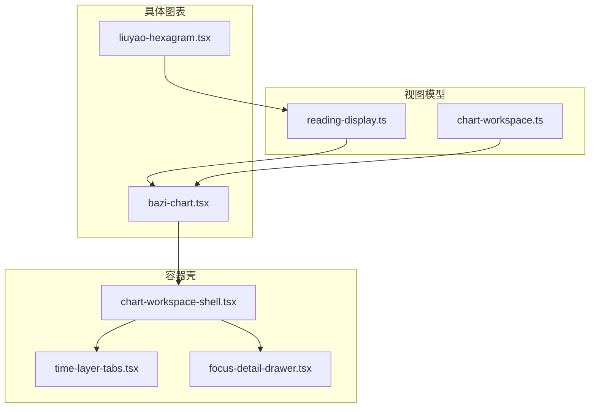
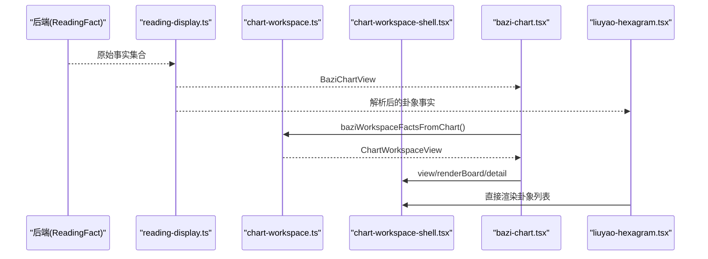
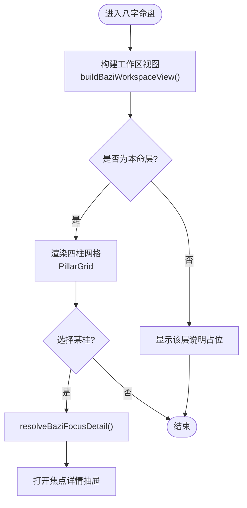
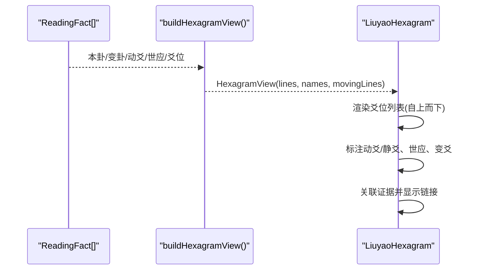
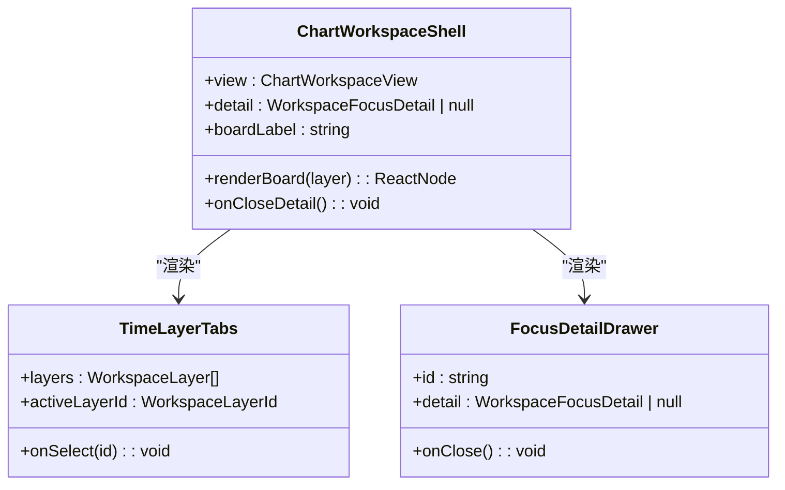
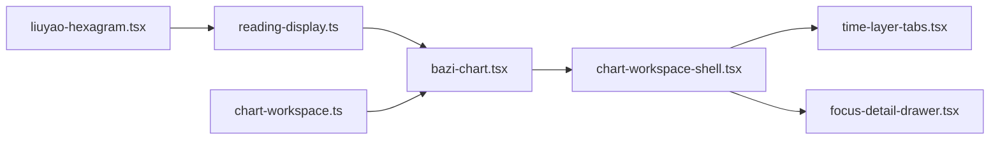

# 图表组件

<cite>
**本文引用的文件**
- [bazi-chart.tsx](file://web/src/components/readings/bazi-chart.tsx)
- [liuyao-hexagram.tsx](file://web/src/components/readings/liuyao-hexagram.tsx)
- [chart-workspace-shell.tsx](file://web/src/components/readings/chart-workspace-shell.tsx)
- [chart-workspace.ts](file://web/src/lib/chart-workspace.ts)
- [reading-display.ts](file://web/src/lib/reading-display.ts)
- [time-layer-tabs.tsx](file://web/src/components/readings/time-layer-tabs.tsx)
- [focus-detail-drawer.tsx](file://web/src/components/readings/focus-detail-drawer.tsx)
- [bazi-chart.module.css](file://web/src/components/readings/bazi-chart.module.css)
- [liuyao-hexagram.module.css](file://web/src/components/readings/liuyao-hexagram.module.css)
- [chart-workspace-shell.module.css](file://web/src/components/readings/chart-workspace-shell.module.css)
</cite>

## 目录
1. [简介](#简介)
2. [项目结构](#项目结构)
3. [核心组件](#核心组件)
4. [架构总览](#架构总览)
5. [详细组件分析](#详细组件分析)
6. [依赖关系分析](#依赖关系分析)
7. [性能与交互优化](#性能与交互优化)
8. [主题定制与数据绑定](#主题定制与数据绑定)
9. [故障排查指南](#故障排查指南)
10. [结论](#结论)

## 简介
本文件面向命理解读的前端图表子系统，聚焦三类关键能力：
- 八字命盘图表：以“四柱”为核心，展示本命、大运、流年等时间层，强调仅渲染服务端公开事实，不本地计算。
- 六爻卦象图表：将服务端返回的卦象事实解析为可视化爻位图，标注动爻、变爻、世应及细节信息。
- 图表工作区容器：提供统一的时间层切换、焦点详情抽屉、空态与不可用状态处理，以及可复用的布局与交互模式。

文档同时覆盖 SVG/CSS 绘制的性能优化、动画效果、无障碍交互、主题定制、数据绑定方式以及与命理算法引擎的数据对接格式约定。

## 项目结构
前端图表子系统位于 web/src/components/readings 与 web/src/lib 下，采用“视图模型 + 容器壳 + 具体图表”的分层组织：
- 视图模型：chart-workspace.ts 定义通用工作区数据结构与八字工作区视图构建逻辑；reading-display.ts 负责将后端 ReadingFact 序列化为可读的展示模型（如 BaziChartView）。
- 容器壳：chart-workspace-shell.tsx 提供时间层标签、面板区域与焦点详情抽屉的通用外壳。
- 具体图表：bazi-chart.tsx 实现八字命盘；liuyao-hexagram.tsx 实现六爻卦象。
- 样式：各组件对应 .module.css，使用 CSS 变量与响应式规则实现主题与适配。

**图示来源**
- [chart-workspace.ts:1-58](file://web/src/lib/chart-workspace.ts#L1-L58)
- [reading-display.ts:579-657](file://web/src/lib/reading-display.ts#L579-L657)
- [chart-workspace-shell.tsx:22-100](file://web/src/components/readings/chart-workspace-shell.tsx#L22-L100)
- [bazi-chart.tsx:129-202](file://web/src/components/readings/bazi-chart.tsx#L129-L202)
- [liuyao-hexagram.tsx:167-220](file://web/src/components/readings/liuyao-hexagram.tsx#L167-L220)

**章节来源**
- [chart-workspace.ts:1-58](file://web/src/lib/chart-workspace.ts#L1-L58)
- [chart-workspace-shell.tsx:22-100](file://web/src/components/readings/chart-workspace-shell.tsx#L22-L100)
- [bazi-chart.tsx:129-202](file://web/src/components/readings/bazi-chart.tsx#L129-L202)
- [liuyao-hexagram.tsx:167-220](file://web/src/components/readings/liuyao-hexagram.tsx#L167-L220)
- [reading-display.ts:579-657](file://web/src/lib/reading-display.ts#L579-L657)

## 核心组件
- 八字命盘图表（BaziChart）：基于服务端公开的“四柱”“日主”“月令”“当前大运”等事实，构建工作区视图并渲染四柱网格与要点提示。
- 六爻卦象图表（LiuyaoHexagram）：从 ReadingFact 中解析本卦、变卦、动爻、世应、爻位细节，并以列表形式呈现爻位图形与变化。
- 图表工作区容器（ChartWorkspaceShell）：封装时间层切换、面板渲染槽、焦点详情抽屉，保证空态与不可用状态的诚实展示。

**章节来源**
- [bazi-chart.tsx:129-202](file://web/src/components/readings/bazi-chart.tsx#L129-L202)
- [liuyao-hexagram.tsx:238-336](file://web/src/components/readings/liuyao-hexagram.tsx#L238-L336)
- [chart-workspace-shell.tsx:22-100](file://web/src/components/readings/chart-workspace-shell.tsx#L22-L100)

## 架构总览
整体数据流遵循“后端事实 → 前端展示模型 → 工作区视图 → 容器壳 → 具体图表”的单向流动，确保前端不计算命理结果，仅做公开事实的可视化。

**图示来源**
- [reading-display.ts:604-657](file://web/src/lib/reading-display.ts#L604-L657)
- [chart-workspace.ts:228-238](file://web/src/lib/chart-workspace.ts#L228-L238)
- [bazi-chart.tsx:129-202](file://web/src/components/readings/bazi-chart.tsx#L129-L202)
- [liuyao-hexagram.tsx:167-220](file://web/src/components/readings/liuyao-hexagram.tsx#L167-L220)

## 详细组件分析

### 八字命盘图表（BaziChart）
- 布局与层级
  - 通过 chart-workspace.ts 构建三层：本命、大运、流年；其中本命层根据是否返回四柱决定 ready/empty，大运层根据 activeLuck 决定 ready/unavailable，流年层标记 unavailable。
  - 本命层渲染四柱网格（年、月、日、时），支持键盘导航与选中态；非本命层显示说明性占位文本。
- 五行标注与神煞显示
  - 组件明确声明“只渲染服务端已公开的盘面”，不自行计算或生成星曜、格局等信息；若服务端未返回，则显示“未提供/暂无可聚焦内容”。
- 交互与可访问性
  - 四柱卡片支持箭头键移动焦点、Home/End 跳转，Enter/Space 激活；选中项通过 aria-pressed/aria-expanded 与 data-selected 同步状态。
  - 焦点详情抽屉在选中某柱后，仅展示与该柱相关的公开事实与边界说明。

**图示来源**
- [chart-workspace.ts:152-185](file://web/src/lib/chart-workspace.ts#L152-L185)
- [bazi-chart.tsx:152-190](file://web/src/components/readings/bazi-chart.tsx#L152-L190)
- [chart-workspace.ts:244-267](file://web/src/lib/chart-workspace.ts#L244-L267)

**章节来源**
- [bazi-chart.tsx:24-122](file://web/src/components/readings/bazi-chart.tsx#L24-L122)
- [bazi-chart.tsx:129-202](file://web/src/components/readings/bazi-chart.tsx#L129-L202)
- [chart-workspace.ts:152-185](file://web/src/lib/chart-workspace.ts#L152-L185)
- [chart-workspace.ts:244-267](file://web/src/lib/chart-workspace.ts#L244-L267)

### 六爻卦象图表（LiuyaoHexagram）
- 卦象生成与解析
  - 从 ReadingFact 中查找本卦、变卦、动爻、世应、爻位等事实，解析为 HexagramView；若无法解析，给出降级提示。
  - 爻位顺序自上而下（上爻至初爻），缺失爻位保持“未公开”，不补算。
- 变爻标记与吉凶判断
  - 动爻行高亮，并在下方显示“变为”的爻位图形与细节；世应位置通过 facts 中的 shi_ying 或 primary hexagram 字段推断并标注。
  - 吉凶判断由服务端事实决定，前端仅展示公开信息，不做本地推断。
- 证据关联
  - 将卦象事实与证据列表进行 ref 关联，展示“X 条依据与卦象事实相连”的入口。

**图示来源**
- [liuyao-hexagram.tsx:167-220](file://web/src/components/readings/liuyao-hexagram.tsx#L167-L220)
- [liuyao-hexagram.tsx:238-336](file://web/src/components/readings/liuyao-hexagram.tsx#L238-L336)

**章节来源**
- [liuyao-hexagram.tsx:8-27](file://web/src/components/readings/liuyao-hexagram.tsx#L8-L27)
- [liuyao-hexagram.tsx:167-220](file://web/src/components/readings/liuyao-hexagram.tsx#L167-L220)
- [liuyao-hexagram.tsx:238-336](file://web/src/components/readings/liuyao-hexagram.tsx#L238-L336)

### 图表工作区容器（ChartWorkspaceShell）
- 响应式布局
  - 顶部标题与副标题、时间层标签、主体面板与焦点详情抽屉组合；面板根据 activeLayerId 切换显示。
- 缩放控制与导出功能
  - 当前容器未内置缩放与导出逻辑；如需扩展，可在外层包裹缩放容器或添加导出按钮，并通过引用当前面板节点进行截图或打印。
- 空态与不可用状态
  - 当层状态为 empty 时显示“服务端尚未返回可展示的结构”；unavailable 时标签禁用并提示“未生成”。

**图示来源**
- [chart-workspace-shell.tsx:22-100](file://web/src/components/readings/chart-workspace-shell.tsx#L22-L100)
- [time-layer-tabs.tsx:17-104](file://web/src/components/readings/time-layer-tabs.tsx#L17-L104)
- [focus-detail-drawer.tsx:14-140](file://web/src/components/readings/focus-detail-drawer.tsx#L14-L140)

**章节来源**
- [chart-workspace-shell.tsx:22-100](file://web/src/components/readings/chart-workspace-shell.tsx#L22-L100)
- [time-layer-tabs.tsx:17-104](file://web/src/components/readings/time-layer-tabs.tsx#L17-L104)
- [focus-detail-drawer.tsx:14-140](file://web/src/components/readings/focus-detail-drawer.tsx#L14-L140)

## 依赖关系分析
- 八字模块依赖
  - reading-display.ts 将 ReadingFact 转换为 BaziChartView；
  - chart-workspace.ts 将 BaziChartView 映射为 ChartWorkspaceView；
  - bazi-chart.tsx 消费上述视图并调用 ChartWorkspaceShell。
- 六爻模块依赖
  - liuyao-hexagram.tsx 直接消费 ReadingFact，内部解析为 HexagramView；
  - 与 evidence 列表通过 fact.ref 关联，用于证据链接。
- 容器壳依赖
  - time-layer-tabs.tsx 与 focus-detail-drawer.tsx 作为子组件被 ChartWorkspaceShell 复用。

**图示来源**
- [reading-display.ts:604-657](file://web/src/lib/reading-display.ts#L604-L657)
- [chart-workspace.ts:228-238](file://web/src/lib/chart-workspace.ts#L228-L238)
- [bazi-chart.tsx:129-202](file://web/src/components/readings/bazi-chart.tsx#L129-L202)
- [chart-workspace-shell.tsx:22-100](file://web/src/components/readings/chart-workspace-shell.tsx#L22-L100)
- [liuyao-hexagram.tsx:167-220](file://web/src/components/readings/liuyao-hexagram.tsx#L167-L220)

**章节来源**
- [reading-display.ts:604-657](file://web/src/lib/reading-display.ts#L604-L657)
- [chart-workspace.ts:228-238](file://web/src/lib/chart-workspace.ts#L228-L238)
- [bazi-chart.tsx:129-202](file://web/src/components/readings/bazi-chart.tsx#L129-L202)
- [chart-workspace-shell.tsx:22-100](file://web/src/components/readings/chart-workspace-shell.tsx#L22-L100)
- [liuyao-hexagram.tsx:167-220](file://web/src/components/readings/liuyao-hexagram.tsx#L167-L220)

## 性能与交互优化
- 渲染策略
  - 纯函数视图模型：chart-workspace.ts 与 reading-display.ts 均为纯数据处理，避免重计算；React 侧使用 useMemo/useCallback 减少不必要的重渲染。
  - 条件渲染：仅在层状态为 ready 时渲染实际内容，unavailable/empty 直接显示占位，降低 DOM 复杂度。
- 动画与过渡
  - 工作区容器入场动画与卡片 hover/active 过渡，均通过 CSS 变量与 @media(prefers-reduced-motion) 尊重用户偏好，避免对敏感用户造成不适。
- 无障碍与键盘交互
  - 四柱网格与时间层标签均支持键盘导航（箭头键、Home/End），并使用 role/aria-* 属性提升屏幕阅读器体验。
- SVG 绘制建议
  - 当前卦象图形以 CSS 块元素模拟爻位线条，避免复杂 SVG 开销；如需引入 SVG，建议使用静态路径与最小化节点数，结合 will-change 与 requestAnimationFrame 优化滚动场景。
- 缩放与导出
  - 容器未内置缩放与导出；可扩展外层容器实现缩放，或使用 html2canvas/SVG foreignObject 导出当前面板为图片/PDF。

[本节为通用指导，不直接分析具体文件]

## 主题定制与数据绑定
- 主题定制
  - 所有样式通过 CSS 变量（如 --border-subtle、--gold-500、--ink-950、--duration-feedback 等）驱动，可在根级覆盖变量实现全局主题切换。
  - 响应式断点与容器查询（container-type: inline-size）确保在不同尺寸下的布局一致性。
- 数据绑定
  - 八字：通过 reading-display.ts 将 ReadingFact 转为 BaziChartView，再由 chart-workspace.ts 转为 ChartWorkspaceView，最终由 bazi-chart.tsx 渲染。
  - 六爻：直接从 ReadingFact 解析为 HexagramView，并与证据列表按 fact.ref 关联。
- 与命理算法引擎的数据对接格式
  - 八字相关字段：四柱（year/month/day/hour）、日主、月令、当前大运、出生时间、性别、地点、时间口径、子时策略、时区、目标日期、目标周期、历法口径、亮点提示。
  - 六爻相关事实键：primary_hexagram/本卦、changed_hexagram/变卦、moving_lines/动爻、shi_ying/世应、lines/六爻/爻；每条爻位包含 line/position/index、yin_yang/line_type/state、roles/role、najia、six_spirit、six_relative、changed_line 等。
  - 这些字段由 reading-display.ts 与 liuyao-hexagram.tsx 共同解析，确保前后端契约一致。

**章节来源**
- [bazi-chart.module.css:1-195](file://web/src/components/readings/bazi-chart.module.css#L1-L195)
- [liuyao-hexagram.module.css:1-275](file://web/src/components/readings/liuyao-hexagram.module.css#L1-L275)
- [chart-workspace-shell.module.css:1-92](file://web/src/components/readings/chart-workspace-shell.module.css#L1-L92)
- [reading-display.ts:579-657](file://web/src/lib/reading-display.ts#L579-L657)
- [liuyao-hexagram.tsx:167-220](file://web/src/components/readings/liuyao-hexagram.tsx#L167-L220)

## 故障排查指南
- 八字层为空或未就绪
  - 检查服务端是否返回 pillars 或 activeLuck；若无，则本命层显示 empty，大运层显示 unavailable。
  - 确认 BaziChartView 的 pillars/dayMaster/monthCommand 等字段是否正确填充。
- 六爻卦象无法解析
  - 检查 ReadingFact 中是否存在 primary_hexagram/changed_hexagram/moving_lines/shi_ying/lines；若缺失，页面会降级提示。
  - 确认爻位数组结构与字段名兼容（line/position/index、yin_yang/line_type/state、roles/role、changed_line 等）。
- 键盘导航失效
  - 确认 PillarGrid 与 TimeLayerTabs 的 tabIndex、aria-* 属性正确设置；检查事件监听是否被阻止。
- 动画不符合预期
  - 检查 prefers-reduced-motion 媒体查询是否生效；必要时移除或调整 transition/animation。

**章节来源**
- [chart-workspace.ts:152-185](file://web/src/lib/chart-workspace.ts#L152-L185)
- [bazi-chart.tsx:152-190](file://web/src/components/readings/bazi-chart.tsx#L152-L190)
- [liuyao-hexagram.tsx:272-280](file://web/src/components/readings/liuyao-hexagram.tsx#L272-L280)
- [time-layer-tabs.tsx:32-61](file://web/src/components/readings/time-layer-tabs.tsx#L32-L61)
- [bazi-chart.module.css:189-195](file://web/src/components/readings/bazi-chart.module.css#L189-L195)
- [chart-workspace-shell.module.css:83-92](file://web/src/components/readings/chart-workspace-shell.module.css#L83-L92)

## 结论
该图表子系统以“仅渲染公开事实”为原则，通过清晰的视图模型与容器壳，实现了八字命盘与六爻卦象的可维护、可访问、可主题的可视化方案。未来可在容器壳基础上扩展缩放与导出能力，并在 SVG 层面进一步优化性能与动画表现。