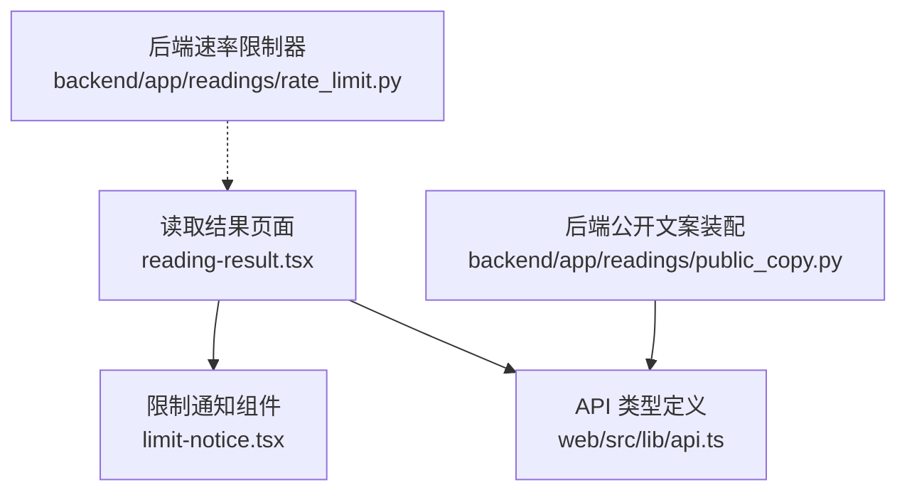
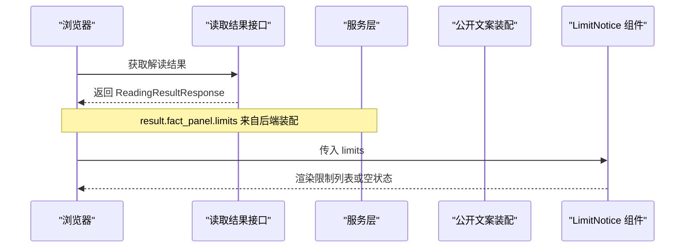
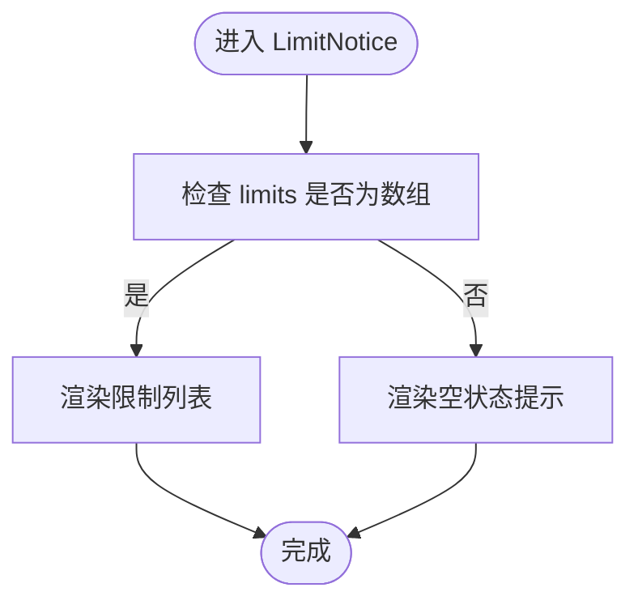
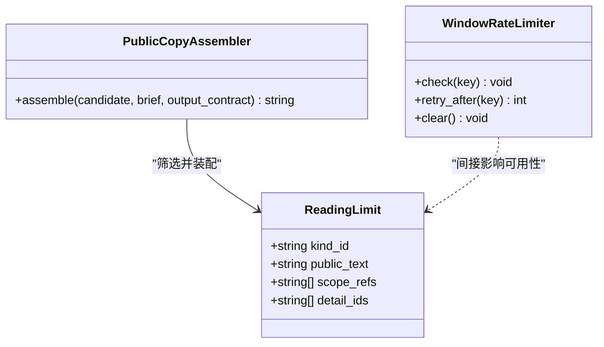
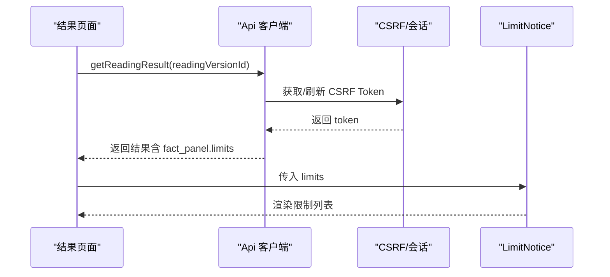
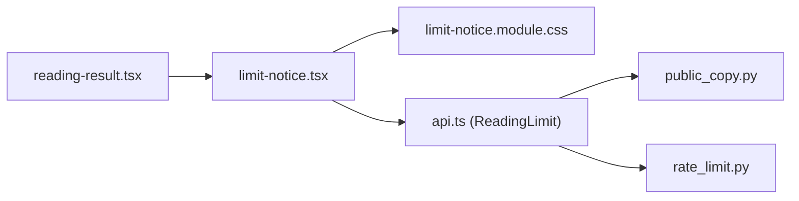

# 工具组件

<cite>
**本文引用的文件**
- [limit-notice.tsx](file://web/src/components/readings/limit-notice.tsx)
- [limit-notice.module.css](file://web/src/components/readings/limit-notice.module.css)
- [reading-result.tsx](file://web/src/components/readings/reading-result.tsx)
- [api.ts](file://web/src/lib/api.ts)
- [public_copy.py](file://backend/app/readings/public_copy.py)
- [rate_limit.py](file://backend/app/readings/rate_limit.py)
</cite>

## 目录
1. [简介](#简介)
2. [项目结构](#项目结构)
3. [核心组件](#核心组件)
4. [架构总览](#架构总览)
5. [详细组件分析](#详细组件分析)
6. [依赖关系分析](#依赖关系分析)
7. [性能考虑](#性能考虑)
8. [故障排查指南](#故障排查指南)
9. [结论](#结论)
10. [附录](#附录)

## 简介
本文件聚焦命理解读系统中的“使用限制通知”组件（LimitNotice），系统性说明其触发条件、显示逻辑、样式与交互行为，以及与数据源和权限系统的集成方式。该组件用于在解读结果页中向用户展示当前解读适用的边界与限制说明，帮助用户理解结论的适用范围与注意事项。

## 项目结构
- 前端组件位于 web/src/components/readings/limit-notice.tsx，配套样式在 limit-notice.module.css。
- 组件由解读结果页面 reading-result.tsx 调用，数据来源为服务端返回的 ReadingFactPanel.limits。
- 后端通过 public_copy.py 将必要的限制文本装配到公开文案中；rate_limit.py 提供进程内速率限制能力，用于保护写操作。

**图示来源**
- [reading-result.tsx:390-490](file://web/src/components/readings/reading-result.tsx#L390-L490)
- [limit-notice.tsx:1-22](file://web/src/components/readings/limit-notice.tsx#L1-L22)
- [api.ts:122-147](file://web/src/lib/api.ts#L122-L147)
- [public_copy.py:13-46](file://backend/app/readings/public_copy.py#L13-L46)
- [rate_limit.py:9-61](file://backend/app/readings/rate_limit.py#L9-L61)

**章节来源**
- [reading-result.tsx:390-490](file://web/src/components/readings/reading-result.tsx#L390-L490)
- [limit-notice.tsx:1-22](file://web/src/components/readings/limit-notice.tsx#L1-L22)
- [api.ts:122-147](file://web/src/lib/api.ts#L122-L147)
- [public_copy.py:13-46](file://backend/app/readings/public_copy.py#L13-L46)
- [rate_limit.py:9-61](file://backend/app/readings/rate_limit.py#L9-L61)

## 核心组件
- LimitNotice 是一个纯展示型 React 函数组件，接收 limits 可选数组作为 props。当存在可用限制时，渲染有序列表；否则显示空状态提示。
- 样式采用 CSS Modules，包含列表、条目、空状态的类名，整体风格遵循设计系统变量。

关键要点
- 输入：limits?: ReadingLimit[] | null
- 输出：列表或空状态提示
- 无副作用：不发起网络请求，不管理本地状态
- 可访问性：语义化 ul/li 结构，便于屏幕阅读器识别

**章节来源**
- [limit-notice.tsx:1-22](file://web/src/components/readings/limit-notice.tsx#L1-L22)
- [limit-notice.module.css:1-30](file://web/src/components/readings/limit-notice.module.css#L1-L30)

## 架构总览
下图展示了从后端生成限制信息到前端渲染的完整链路：

**图示来源**
- [api.ts:476-488](file://web/src/lib/api.ts#L476-L488)
- [public_copy.py:13-46](file://backend/app/readings/public_copy.py#L13-L46)
- [reading-result.tsx:390-490](file://web/src/components/readings/reading-result.tsx#L390-L490)
- [limit-notice.tsx:1-22](file://web/src/components/readings/limit-notice.tsx#L1-L22)

## 详细组件分析

### 触发条件与显示逻辑
- 触发条件：当 ReadingFactPanel.limits 非空且为数组时，组件渲染限制列表；否则显示“暂无适用边界说明”。
- 数据来源：reading-result.tsx 将 result.fact_panel?.limits ?? null 传递给 LimitNotice。
- 安全处理：组件内部对 limits 进行 Array.isArray 校验，避免异常渲染。

**图示来源**
- [limit-notice.tsx:5-20](file://web/src/components/readings/limit-notice.tsx#L5-L20)
- [reading-result.tsx:390-490](file://web/src/components/readings/reading-result.tsx#L390-L490)

**章节来源**
- [limit-notice.tsx:5-20](file://web/src/components/readings/limit-notice.tsx#L5-L20)
- [reading-result.tsx:390-490](file://web/src/components/readings/reading-result.tsx#L390-L490)

### 限额检测机制
- 前端侧：LimitNotice 仅负责展示，不做限额判断。
- 后端侧：
  - 公开文案装配：public_copy.py 根据输出契约与候选块的限制标识，筛选并拼接必要的限制文本，确保必需的限制项齐全。
  - 速率限制：rate_limit.py 提供滑动窗口限流，用于保护写操作，防止滥用。
- 数据模型：ReadingLimit 包含 kind_id、public_text、scope_refs、detail_ids，用于描述限制的类型、文案与作用范围。

**图示来源**
- [api.ts:122-147](file://web/src/lib/api.ts#L122-L147)
- [public_copy.py:13-46](file://backend/app/readings/public_copy.py#L13-L46)
- [rate_limit.py:9-61](file://backend/app/readings/rate_limit.py#L9-L61)

**章节来源**
- [api.ts:122-147](file://web/src/lib/api.ts#L122-L147)
- [public_copy.py:13-46](file://backend/app/readings/public_copy.py#L13-L46)
- [rate_limit.py:9-61](file://backend/app/readings/rate_limit.py#L9-L61)

### 用户提示文案与引导操作
- 文案来源：limits[].public_text 由后端装配，保证合规披露。
- 空状态文案：组件内置“暂无适用边界说明”，用于无限制场景。
- 引导操作：当前组件不包含按钮或跳转，如需引导升级或查看帮助，可在父组件扩展。

**章节来源**
- [limit-notice.tsx:10-20](file://web/src/components/readings/limit-notice.tsx#L10-L20)
- [public_copy.py:25-37](file://backend/app/readings/public_copy.py#L25-L37)

### 样式定制、位置定位与关闭行为
- 样式：使用 CSS Modules，类名包括 list、item、empty，颜色与排版基于设计系统变量。
- 位置：由 reading-result.tsx 在“依据与边界”区块内插入，位于证据列表之后。
- 关闭行为：组件无关闭逻辑，属于静态展示；如需可折叠，可在父组件包裹容器实现。

**章节来源**
- [limit-notice.module.css:14-29](file://web/src/components/readings/limit-notice.module.css#L14-L29)
- [reading-result.tsx:390-490](file://web/src/components/readings/reading-result.tsx#L390-L490)

### 配置选项与扩展接口
- 当前 props：limits?: ReadingLimit[] | null
- 可扩展点：
  - 增加 onAction 回调以支持点击跳转到帮助或升级页面
  - 增加 showEmpty 控制是否显示空状态
  - 增加样式覆盖参数以适配不同主题
- 建议：保持纯展示职责，业务逻辑尽量上移至父组件。

**章节来源**
- [limit-notice.tsx:5-20](file://web/src/components/readings/limit-notice.tsx#L5-L20)

### 与用户权限系统的集成方式
- 权限相关：读取结果接口受 CSRF 与安全会话保护，未登录或权限不足可能返回错误。
- 前端防护：getCsrfToken 与 jsonPost 自动处理 CSRF 令牌与重试。
- 展示层：LimitNotice 不直接参与鉴权，但仅在成功获取结果后渲染。

**图示来源**
- [api.ts:359-385](file://web/src/lib/api.ts#L359-L385)
- [api.ts:476-488](file://web/src/lib/api.ts#L476-L488)
- [reading-result.tsx:390-490](file://web/src/components/readings/reading-result.tsx#L390-L490)

**章节来源**
- [api.ts:359-385](file://web/src/lib/api.ts#L359-L385)
- [api.ts:476-488](file://web/src/lib/api.ts#L476-L488)
- [reading-result.tsx:390-490](file://web/src/components/readings/reading-result.tsx#L390-L490)

### 使用模式与最佳实践
- 基本用法：在结果页“依据与边界”区块中直接传入 result.fact_panel?.limits ?? null。
- 空状态处理：当 limits 为空时，组件会显示友好提示，避免空白区域。
- 可访问性：使用语义化列表结构，利于无障碍阅读。
- 扩展建议：如需交互（如展开详情、跳转帮助），在父组件添加事件处理器并透传至 LimitNotice。

**章节来源**
- [reading-result.tsx:390-490](file://web/src/components/readings/reading-result.tsx#L390-L490)
- [limit-notice.tsx:10-20](file://web/src/components/readings/limit-notice.tsx#L10-L20)

## 依赖关系分析
- 组件依赖：
  - 样式模块：limit-notice.module.css
  - 类型定义：web/src/lib/api.ts 中的 ReadingLimit
- 调用方依赖：
  - reading-result.tsx 负责组装并传递 limits
- 后端依赖：
  - public_copy.py 负责装配必要限制文本
  - rate_limit.py 用于写操作速率限制

**图示来源**
- [reading-result.tsx:390-490](file://web/src/components/readings/reading-result.tsx#L390-L490)
- [limit-notice.tsx:1-22](file://web/src/components/readings/limit-notice.tsx#L1-L22)
- [limit-notice.module.css:1-30](file://web/src/components/readings/limit-notice.module.css#L1-L30)
- [api.ts:122-147](file://web/src/lib/api.ts#L122-L147)
- [public_copy.py:13-46](file://backend/app/readings/public_copy.py#L13-L46)
- [rate_limit.py:9-61](file://backend/app/readings/rate_limit.py#L9-L61)

**章节来源**
- [reading-result.tsx:390-490](file://web/src/components/readings/reading-result.tsx#L390-L490)
- [limit-notice.tsx:1-22](file://web/src/components/readings/limit-notice.tsx#L1-L22)
- [limit-notice.module.css:1-30](file://web/src/components/readings/limit-notice.module.css#L1-L30)
- [api.ts:122-147](file://web/src/lib/api.ts#L122-L147)
- [public_copy.py:13-46](file://backend/app/readings/public_copy.py#L13-L46)
- [rate_limit.py:9-61](file://backend/app/readings/rate_limit.py#L9-L61)

## 性能考虑
- 渲染成本：组件为纯展示，无状态与副作用，渲染开销极低。
- 列表长度：limits 数量通常较小，DOM 节点少，不影响性能。
- 样式加载：CSS Modules 按需加载，体积微小。
- 建议：若未来增加交互（如懒加载详情），注意避免重排与重复计算。

[本节为通用指导，无需具体文件引用]

## 故障排查指南
- 现象：限制列表未显示
  - 检查 result.fact_panel?.limits 是否为空
  - 确认后端 public_copy.py 已装配必要限制文本
- 现象：空状态提示出现
  - 正常情况：确实无适用限制
  - 异常情况：检查后端契约与候选块的限制标识是否匹配
- 现象：权限或 CSRF 错误导致无法加载结果
  - 检查 getCsrfToken 流程与 cookie 设置
  - 确认会话有效并重试

**章节来源**
- [reading-result.tsx:390-490](file://web/src/components/readings/reading-result.tsx#L390-L490)
- [public_copy.py:25-37](file://backend/app/readings/public_copy.py#L25-L37)
- [api.ts:359-385](file://web/src/lib/api.ts#L359-L385)

## 结论
LimitNotice 是一个简洁、安全的限制展示组件，专注于呈现后端装配的公开限制文案。它与结果页紧密集成，遵循前后端契约，具备良好的可维护性与扩展性。建议在需要时于父组件增强交互与样式覆盖，以保持组件职责单一。

[本节为总结性内容，无需具体文件引用]

## 附录
- 数据模型参考：ReadingLimit 字段含义
  - kind_id：限制类型标识
  - public_text：面向用户的限制说明文案
  - scope_refs：作用范围引用
  - detail_ids：细节项标识
- 后端装配规则：必须包含契约要求的限制项，否则装配失败
- 速率限制：写操作受滑动窗口限制，超限将返回重试时间

**章节来源**
- [api.ts:122-147](file://web/src/lib/api.ts#L122-L147)
- [public_copy.py:21-37](file://backend/app/readings/public_copy.py#L21-L37)
- [rate_limit.py:23-49](file://backend/app/readings/rate_limit.py#L23-L49)