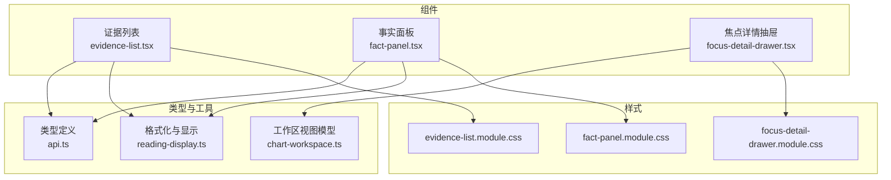
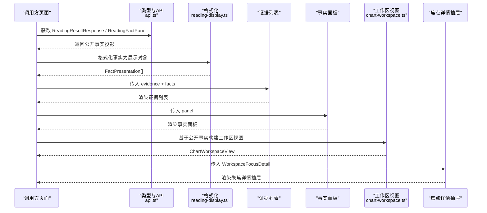
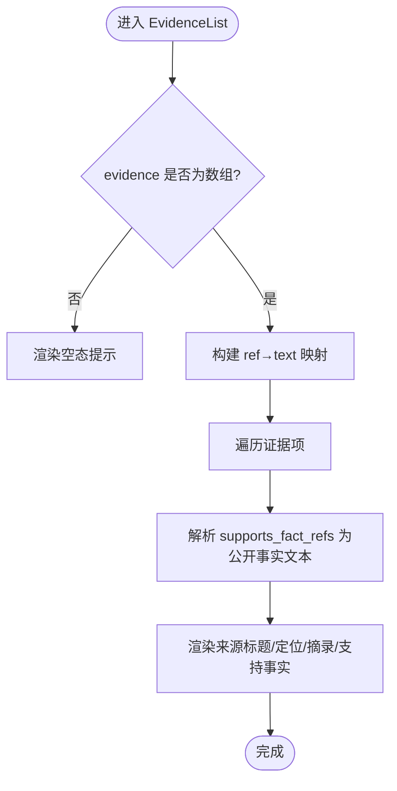
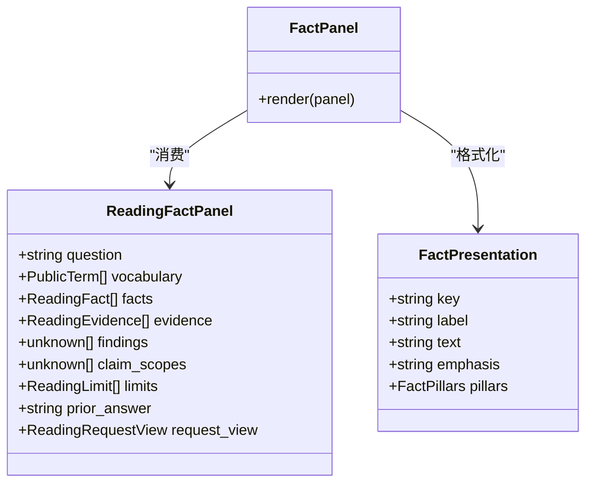
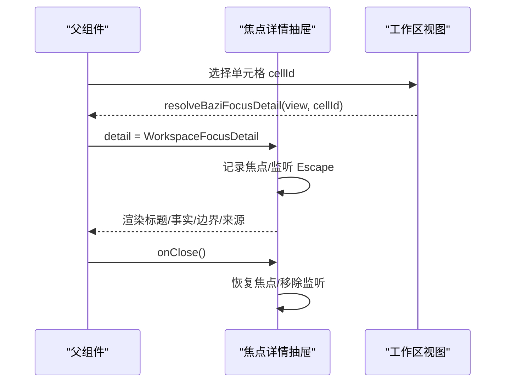
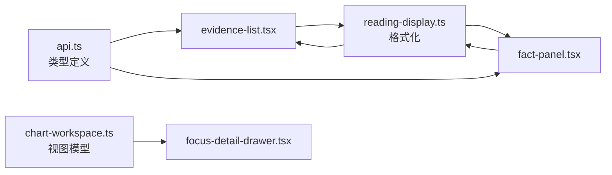

# 数据面板组件

<cite>
**本文引用的文件**
- [web/src/components/readings/evidence-list.tsx](file://web/src/components/readings/evidence-list.tsx)
- [web/src/components/readings/fact-panel.tsx](file://web/src/components/readings/fact-panel.tsx)
- [web/src/components/readings/focus-detail-drawer.tsx](file://web/src/components/readings/focus-detail-drawer.tsx)
- [web/src/lib/api.ts](file://web/src/lib/api.ts)
- [web/src/lib/reading-display.ts](file://web/src/lib/reading-display.ts)
- [web/src/lib/chart-workspace.ts](file://web/src/lib/chart-workspace.ts)
- [web/src/components/readings/evidence-list.module.css](file://web/src/components/readings/evidence-list.module.css)
- [web/src/components/readings/fact-panel.module.css](file://web/src/components/readings/fact-panel.module.css)
- [web/src/components/readings/focus-detail-drawer.module.css](file://web/src/components/readings/focus-detail-drawer.module.css)
</cite>

## 目录
1. [简介](#简介)
2. [项目结构](#项目结构)
3. [核心组件](#核心组件)
4. [架构总览](#架构总览)
5. [详细组件分析](#详细组件分析)
6. [依赖关系分析](#依赖关系分析)
7. [性能考虑](#性能考虑)
8. [故障排查指南](#故障排查指南)
9. [结论](#结论)
10. [附录](#附录)

## 简介
本文件面向命理解读数据面板的前端组件，聚焦以下三个关键组件：证据列表、事实面板、焦点详情抽屉。文档将系统说明它们的数据结构、展示逻辑、交互与可访问性、与后端数据的同步方式，以及可扩展性与性能优化建议。目标是帮助开发者快速理解并安全扩展这些组件，同时确保对服务端返回的公开数据进行诚实渲染，不虚构任何计算结果或隐私信息。

## 项目结构
数据面板相关代码位于 web/src/components/readings 目录下，配合类型定义与格式化逻辑在 web/src/lib 中。样式通过 CSS Modules 隔离。整体组织遵循“组件 + 样式 + 领域工具”的分层方式：
- 组件层：evidence-list.tsx、fact-panel.tsx、focus-detail-drawer.tsx
- 类型与格式化：api.ts（类型）、reading-display.ts（格式化）、chart-workspace.ts（工作区视图模型）
- 样式：各组件对应的 .module.css

图表来源
- [web/src/components/readings/evidence-list.tsx:1-53](file://web/src/components/readings/evidence-list.tsx#L1-L53)
- [web/src/components/readings/fact-panel.tsx:1-126](file://web/src/components/readings/fact-panel.tsx#L1-L126)
- [web/src/components/readings/focus-detail-drawer.tsx:1-140](file://web/src/components/readings/focus-detail-drawer.tsx#L1-L140)
- [web/src/lib/api.ts:106-170](file://web/src/lib/api.ts#L106-L170)
- [web/src/lib/reading-display.ts:104-143](file://web/src/lib/reading-display.ts#L104-L143)
- [web/src/lib/chart-workspace.ts:12-57](file://web/src/lib/chart-workspace.ts#L12-L57)

章节来源
- [web/src/components/readings/evidence-list.tsx:1-53](file://web/src/components/readings/evidence-list.tsx#L1-L53)
- [web/src/components/readings/fact-panel.tsx:1-126](file://web/src/components/readings/fact-panel.tsx#L1-L126)
- [web/src/components/readings/focus-detail-drawer.tsx:1-140](file://web/src/components/readings/focus-detail-drawer.tsx#L1-L140)
- [web/src/lib/api.ts:106-170](file://web/src/lib/api.ts#L106-L170)
- [web/src/lib/reading-display.ts:104-143](file://web/src/lib/reading-display.ts#L104-L143)
- [web/src/lib/chart-workspace.ts:12-57](file://web/src/lib/chart-workspace.ts#L12-L57)

## 核心组件
- 证据列表：渲染服务端返回的证据来源卡片，支持按引用关联到公开事实摘要，提供空态文案。
- 事实面板：以“本次问题/确定性事实/上一版已接纳正文/解读范围”等区块展示结构化事实，区分主次强调，折叠补充事实。
- 焦点详情抽屉：用于在工作区选中某个柱位时，展示与该单元相关的公开事实、边界与来源；具备键盘可访问性、焦点管理与关闭行为。

章节来源
- [web/src/components/readings/evidence-list.tsx:6-52](file://web/src/components/readings/evidence-list.tsx#L6-L52)
- [web/src/components/readings/fact-panel.tsx:12-125](file://web/src/components/readings/fact-panel.tsx#L12-L125)
- [web/src/components/readings/focus-detail-drawer.tsx:14-139](file://web/src/components/readings/focus-detail-drawer.tsx#L14-L139)

## 架构总览
数据从后端读取后，前端仅保留公开可展示的事实投影，并通过格式化模块转换为可读中文。组件之间职责清晰：
- evidence-list 消费 ReadingEvidence[] 与 ReadingFact[]，建立 ref 到文本映射，渲染证据卡并列出支持事实。
- fact-panel 消费 ReadingFactPanel，使用 formatReadingFacts 生成主/次事实分组，并以区块化布局呈现。
- focus-detail-drawer 消费 WorkspaceFocusDetail，由 chart-workspace 根据公开事实构建工作区视图与聚焦详情。

图表来源
- [web/src/lib/api.ts:106-170](file://web/src/lib/api.ts#L106-L170)
- [web/src/lib/reading-display.ts:467-577](file://web/src/lib/reading-display.ts#L467-L577)
- [web/src/components/readings/evidence-list.tsx:6-52](file://web/src/components/readings/evidence-list.tsx#L6-L52)
- [web/src/components/readings/fact-panel.tsx:12-125](file://web/src/components/readings/fact-panel.tsx#L12-L125)
- [web/src/lib/chart-workspace.ts:228-267](file://web/src/lib/chart-workspace.ts#L228-L267)
- [web/src/components/readings/focus-detail-drawer.tsx:14-139](file://web/src/components/readings/focus-detail-drawer.tsx#L14-L139)

## 详细组件分析

### 证据列表组件 EvidenceList
- 数据结构
  - 输入：evidence?: ReadingEvidence[] | null；facts?: ReadingFact[]
  - 内部构建 Map<ref, text>，将 supports_fact_refs 映射为公开事实文本集合，去重后展示。
- 排序与筛选
  - 当前实现未内置排序与筛选逻辑；如需扩展，可在上层容器按 source_title、locator、excerpt 或 supportedFacts 进行过滤与排序，避免在组件内引入副作用。
- 搜索功能
  - 当前未实现搜索；建议在父级添加搜索框，基于关键词匹配 source_title、locator、excerpt 与支持的“支持事实”文本。
- 空态与错误处理
  - 当 evidence 为空时，显示“服务端暂未返回公开依据来源。”
  - 若 supports_fact_refs 无法匹配到 facts，则不显示“支持事实”。
- 可访问性与样式
  - 使用语义化 ul/li 列表；样式通过 CSS Modules 隔离，包含边框、背景、行高与断行策略。

图表来源
- [web/src/components/readings/evidence-list.tsx:6-52](file://web/src/components/readings/evidence-list.tsx#L6-L52)
- [web/src/lib/api.ts:106-120](file://web/src/lib/api.ts#L106-L120)
- [web/src/lib/reading-display.ts:467-577](file://web/src/lib/reading-display.ts#L467-L577)

章节来源
- [web/src/components/readings/evidence-list.tsx:6-52](file://web/src/components/readings/evidence-list.tsx#L6-L52)
- [web/src/components/readings/evidence-list.module.css:14-62](file://web/src/components/readings/evidence-list.module.css#L14-L62)
- [web/src/lib/api.ts:106-120](file://web/src/lib/api.ts#L106-L120)
- [web/src/lib/reading-display.ts:467-577](file://web/src/lib/reading-display.ts#L467-L577)

### 事实面板组件 FactPanel
- 信息展示逻辑
  - 区块划分：本次问题、确定性事实（主/次）、上一版已接纳正文、解读范围（术法、对象、主题、目标日期）。
  - 事实分类：通过 formatReadingFacts 将原始 ReadingFact[] 转为 FactPresentation[]，并按 emphasis 分为 primary 与 secondary。
  - 四柱展示：当事实包含 pillars 字段时，以年/月/日/时网格展示；否则回退为纯文本。
  - 解读范围：使用 formatCapabilityIds、formatObjectId、formatDimensionIds、formatHorizon 将 ID 映射为人类可读文本。
- 关联关系与引用链接
  - 事实面板本身不直接渲染证据链接；证据列表通过 supports_fact_refs 与事实 ref 关联。
  - 若需从事实反查证据，可在上层维护 ref→evidence 引用映射。
- 空态与健壮性
  - 无 panel 时显示“服务端暂未返回公开事实简报。”
  - 无事实时显示“本次没有可公开展示的确定性事实。”
- 可定制点
  - 可通过自定义 formatter 扩展 capability/dimension/horizon 的标签映射。
  - 可调整主次事实的视觉权重与折叠区域。

图表来源
- [web/src/components/readings/fact-panel.tsx:12-125](file://web/src/components/readings/fact-panel.tsx#L12-L125)
- [web/src/lib/api.ts:137-147](file://web/src/lib/api.ts#L137-L147)
- [web/src/lib/reading-display.ts:104-143](file://web/src/lib/reading-display.ts#L104-L143)
- [web/src/lib/reading-display.ts:467-577](file://web/src/lib/reading-display.ts#L467-L577)

章节来源
- [web/src/components/readings/fact-panel.tsx:12-125](file://web/src/components/readings/fact-panel.tsx#L12-L125)
- [web/src/components/readings/fact-panel.module.css:8-223](file://web/src/components/readings/fact-panel.module.css#L8-L223)
- [web/src/lib/api.ts:137-147](file://web/src/lib/api.ts#L137-L147)
- [web/src/lib/reading-display.ts:104-143](file://web/src/lib/reading-display.ts#L104-L143)
- [web/src/lib/reading-display.ts:467-577](file://web/src/lib/reading-display.ts#L467-L577)

### 焦点详情抽屉 FocusDetailDrawer
- 展开收起动画与内容渲染
  - 通过 data-open 属性控制可见状态，CSS 中定义 opacity 与 transform 过渡；支持减少动效偏好。
  - 内容渲染：标题、事实列表（label/text）、可选正文摘录、边界列表、来源列表。
- 可访问性与焦点管理
  - 打开时记录触发前的活动元素，关闭后恢复焦点；支持 Escape 键关闭；标题可聚焦。
- 数据来源
  - 接收 WorkspaceFocusDetail，由 chart-workspace 基于公开事实构建；不包含本地排盘或星曜推算，保证诚实展示。
- 可定制点
  - 可通过扩展 WorkspaceFocusDetail 增加新字段（如更多来源分类），并在组件中条件渲染。

图表来源
- [web/src/components/readings/focus-detail-drawer.tsx:14-139](file://web/src/components/readings/focus-detail-drawer.tsx#L14-L139)
- [web/src/lib/chart-workspace.ts:244-267](file://web/src/lib/chart-workspace.ts#L244-L267)
- [web/src/components/readings/focus-detail-drawer.module.css:1-184](file://web/src/components/readings/focus-detail-drawer.module.css#L1-L184)

章节来源
- [web/src/components/readings/focus-detail-drawer.tsx:14-139](file://web/src/components/readings/focus-detail-drawer.tsx#L14-L139)
- [web/src/components/readings/focus-detail-drawer.module.css:1-184](file://web/src/components/readings/focus-detail-drawer.module.css#L1-L184)
- [web/src/lib/chart-workspace.ts:244-267](file://web/src/lib/chart-workspace.ts#L244-L267)

## 依赖关系分析
- 类型契约
  - api.ts 定义了 ReadingFact、ReadingEvidence、ReadingFactPanel、ReadingRequestView 等核心类型，作为前后端契约在前端的体现。
- 格式化依赖
  - reading-display.ts 提供 formatReadingFact、formatReadingFacts、formatHorizon、formatCapabilityIds、formatObjectId、formatDimensionIds 等函数，统一将后端 ID/值转换为可读中文。
- 工作区视图模型
  - chart-workspace.ts 提供 buildBaziWorkspaceView 与 resolveBaziFocusDetail，严格基于公开事实构建可聚焦的工作区结构与详情，不虚构数据。

图表来源
- [web/src/lib/api.ts:106-170](file://web/src/lib/api.ts#L106-L170)
- [web/src/lib/reading-display.ts:104-143](file://web/src/lib/reading-display.ts#L104-L143)
- [web/src/lib/reading-display.ts:467-577](file://web/src/lib/reading-display.ts#L467-L577)
- [web/src/lib/chart-workspace.ts:228-267](file://web/src/lib/chart-workspace.ts#L228-L267)

章节来源
- [web/src/lib/api.ts:106-170](file://web/src/lib/api.ts#L106-L170)
- [web/src/lib/reading-display.ts:104-143](file://web/src/lib/reading-display.ts#L104-L143)
- [web/src/lib/reading-display.ts:467-577](file://web/src/lib/reading-display.ts#L467-L577)
- [web/src/lib/chart-workspace.ts:228-267](file://web/src/lib/chart-workspace.ts#L228-L267)

## 性能考虑
- 大数据量虚拟滚动
  - 当前证据列表与事实面板均为全量渲染。对于证据或事实数量较大的场景，建议在父级容器引入虚拟滚动（例如基于可视区域的只渲染可见条目），以减少 DOM 节点与重绘开销。
- 懒加载
  - 可将证据列表与事实面板拆分为懒加载子组件，仅在用户滚动到视口附近时加载与渲染，降低首屏压力。
- 内存管理
  - 证据列表中使用 Map 缓存 ref→text，有助于 O(1) 查找与去重；注意在组件卸载时释放不必要的闭包引用，避免内存泄漏。
  - 焦点详情抽屉在关闭时移除键盘事件监听并恢复焦点，符合良好实践。
- 渲染优化建议
  - 对长文本使用换行策略（已有 overflow-wrap 设置），避免回流抖动。
  - 对频繁更新的字段（如事实列表）使用稳定 key，提升 React 更新效率。

[本节为通用性能指导，不直接分析具体文件]

## 故障排查指南
- 证据列表为空
  - 检查后端是否返回 ReadingEvidence[]；若无，组件会显示空态文案。
  - 若 supports_fact_refs 无法匹配到 facts，不会显示“支持事实”，请确认 facts 中的 ref 与证据引用一致。
- 事实面板为空
  - 检查 ReadingFactPanel 是否存在；若不存在，组件显示空态文案。
  - 若 facts 经格式化后为空，显示“本次没有可公开展示的确定性事实。”
- 焦点详情抽屉无内容
  - 检查工作区视图是否正确构建；resolveBaziFocusDetail 仅基于公开事实，若无相关基础行（basis），则事实列表为空。
  - 确认单元格 id 有效；未知 id 会返回 null。
- 键盘与焦点问题
  - 确保在打开抽屉前存在可返回的焦点元素；关闭时使用 queueMicrotask 恢复焦点，避免时序问题。
  - 验证 Escape 键监听是否正确绑定与清理。

章节来源
- [web/src/components/readings/evidence-list.tsx:18-52](file://web/src/components/readings/evidence-list.tsx#L18-L52)
- [web/src/components/readings/fact-panel.tsx:15-82](file://web/src/components/readings/fact-panel.tsx#L15-L82)
- [web/src/components/readings/focus-detail-drawer.tsx:28-59](file://web/src/components/readings/focus-detail-drawer.tsx#L28-L59)
- [web/src/lib/chart-workspace.ts:244-267](file://web/src/lib/chart-workspace.ts#L244-L267)

## 结论
这三个组件共同构成了命理解读数据面板的核心展示层：证据列表提供依据来源与事实支撑，事实面板以结构化方式呈现确定性事实与解读范围，焦点详情抽屉聚焦于工作区单元的相关公开事实。所有组件均坚持“仅展示服务端公开事实”的原则，避免虚构数据。通过合理的格式化、可访问性与样式设计，它们在用户体验与可维护性上达到了平衡。未来可在父级引入虚拟滚动与懒加载以应对大数据量场景，并通过扩展类型与格式化器增强可定制能力。

## 附录
- 扩展接口建议
  - 在父级容器为证据列表添加搜索与排序，基于 source_title、locator、excerpt 与“支持事实”文本。
  - 为事实面板增加自定义标签映射表，覆盖 capability_ids、dimension_ids、horizon 的显示。
  - 为焦点详情抽屉扩展新的来源分类或附加信息字段，并在组件中条件渲染。
- 实时同步机制
  - 组件本身为受控展示层，实时同步应由上层负责：当 ReadingResultResponse 或 ReadingFactPanel 变化时，重新传入 props，组件将基于最新数据渲染。
  - 若需要轮询或事件驱动更新，请在父级实现刷新策略，并确保在组件卸载时清理定时器或监听器。

[本节为概念性补充，不直接分析具体文件]