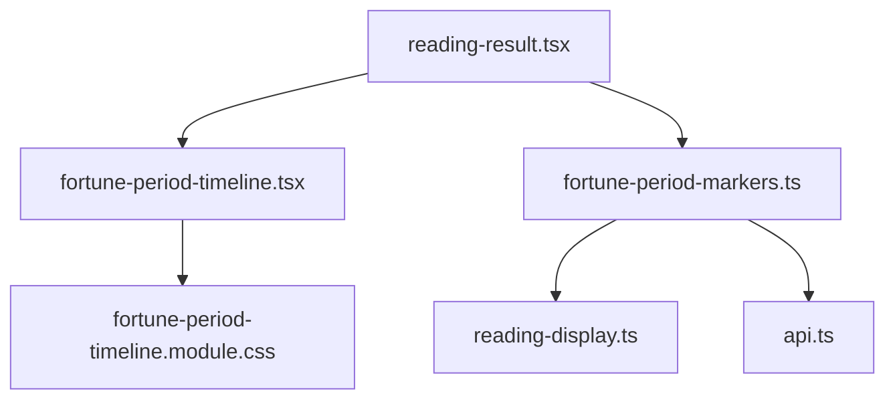
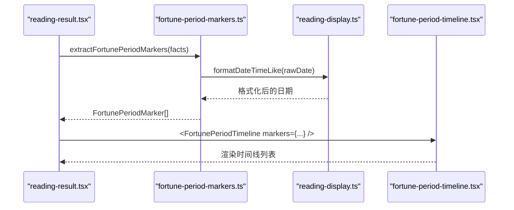
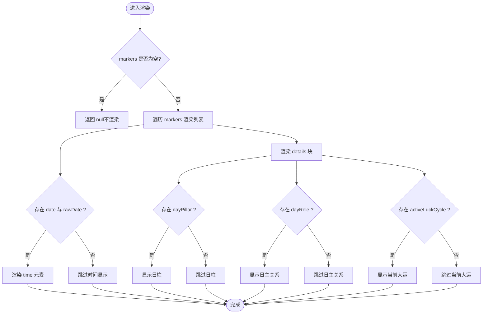
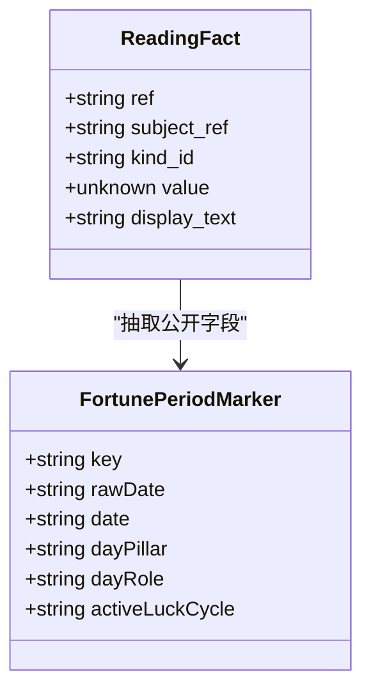
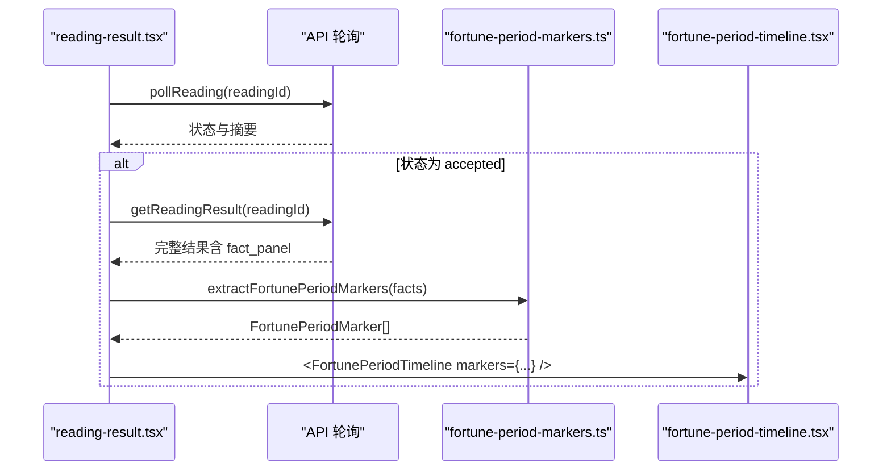
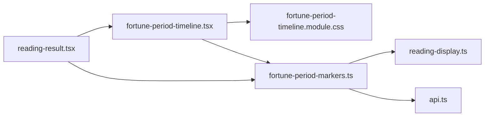

# 时间线组件

<cite>
**本文引用的文件**
- [fortune-period-timeline.tsx](file://web/src/components/readings/fortune-period-timeline.tsx)
- [fortune-period-timeline.module.css](file://web/src/components/readings/fortune-period-timeline.module.css)
- [fortune-period-markers.ts](file://web/src/lib/fortune-period-markers.ts)
- [reading-display.ts](file://web/src/lib/reading-display.ts)
- [reading-result.tsx](file://web/src/components/readings/reading-result.tsx)
- [api.ts](file://web/src/lib/api.ts)
</cite>

## 目录
1. [简介](#简介)
2. [项目结构](#项目结构)
3. [核心组件](#核心组件)
4. [架构总览](#架构总览)
5. [详细组件分析](#详细组件分析)
6. [依赖关系分析](#依赖关系分析)
7. [性能与优化](#性能与优化)
8. [故障排查指南](#故障排查指南)
9. [结论](#结论)
10. [附录](#附录)

## 简介
本文件围绕“运势周期时间线”组件进行系统化文档说明，重点解析以下方面：
- 渲染逻辑：时间轴计算、周期标记提取与展示。
- 视觉区分：不同运势类型的颜色编码与图标选择（当前实现为通用样式，未按类型着色）。
- 交互能力：缩放、平移、详情查看（当前实现为静态列表，无内置交互）。
- 性能考量：大数据量下的渲染策略、Canvas绘制与内存管理（当前实现为DOM渲染，未使用Canvas）。
- 主题定制与响应式适配：通过CSS变量与媒体查询实现。
- 数据模型映射与实时更新：从服务端事实到前端展示的映射流程。

## 项目结构
该功能由三个主要部分组成：
- 组件层：FortunePeriodTimeline 负责渲染周期时间线。
- 数据处理层：extractFortunePeriodMarkers 负责从服务端的 ReadingFact 中抽取公开字段并格式化日期。
- 集成层：ReadingResult 在解读结果页中根据条件渲染时间线区块。

图表来源
- [reading-result.tsx:300-349](file://web/src/components/readings/reading-result.tsx#L300-L349)
- [fortune-period-timeline.tsx:1-49](file://web/src/components/readings/fortune-period-timeline.tsx#L1-L49)
- [fortune-period-markers.ts:1-77](file://web/src/lib/fortune-period-markers.ts#L1-L77)
- [reading-display.ts:145-157](file://web/src/lib/reading-display.ts#L145-L157)
- [api.ts:106-112](file://web/src/lib/api.ts#L106-L112)

章节来源
- [reading-result.tsx:300-349](file://web/src/components/readings/reading-result.tsx#L300-L349)
- [fortune-period-timeline.tsx:1-49](file://web/src/components/readings/fortune-period-timeline.tsx#L1-L49)
- [fortune-period-markers.ts:1-77](file://web/src/lib/fortune-period-markers.ts#L1-L77)
- [reading-display.ts:145-157](file://web/src/lib/reading-display.ts#L145-L157)
- [api.ts:106-112](file://web/src/lib/api.ts#L106-L112)

## 核心组件
- FortunePeriodTimeline：接收 markers 数组，按顺序渲染每个周期的时间、日柱、日主关系、当前大运等公开信息；当 markers 为空时不渲染任何内容。
- extractFortunePeriodMarkers：从 ReadingFact[] 中筛选出 kind_id 或 display_text 匹配的“周期确定性标记”，并仅提取公开字段（date、day_pillar、day_role、active_luck_cycle），对 date 进行本地格式化。
- reading-display.formatDateTimeLike：将 ISO 日期或日期时间字符串格式化为中文可读形式。

章节来源
- [fortune-period-timeline.tsx:6-49](file://web/src/components/readings/fortune-period-timeline.tsx#L6-L49)
- [fortune-period-markers.ts:31-77](file://web/src/lib/fortune-period-markers.ts#L31-L77)
- [reading-display.ts:145-157](file://web/src/lib/reading-display.ts#L145-L157)

## 架构总览
数据流从服务端返回的 ReadingFact 开始，经读取结果页面过滤与抽取，最终渲染为时间线条目。

图表来源
- [reading-result.tsx:300-349](file://web/src/components/readings/reading-result.tsx#L300-L349)
- [fortune-period-markers.ts:45-77](file://web/src/lib/fortune-period-markers.ts#L45-L77)
- [reading-display.ts:145-157](file://web/src/lib/reading-display.ts#L145-L157)
- [fortune-period-timeline.tsx:11-47](file://web/src/components/readings/fortune-period-timeline.tsx#L11-L47)

## 详细组件分析

### 渲染逻辑与时间轴计算
- 时间轴计算：组件本身不进行时间计算，仅按服务端返回顺序展示。缺失的日期或关系字段会直接省略，浏览器不做补算。
- 周期标记：通过 extractFortunePeriodMarkers 识别并抽取公开字段，确保只展示服务端提供的信息。
- 事件展示：当前实现以列表项呈现每个周期，包含可选的时间、日柱、日主关系、当前大运。

图表来源
- [fortune-period-timeline.tsx:11-47](file://web/src/components/readings/fortune-period-timeline.tsx#L11-L47)

章节来源
- [fortune-period-timeline.tsx:11-47](file://web/src/components/readings/fortune-period-timeline.tsx#L11-L47)

### 数据模型映射
- 输入：ReadingFact[]，其中 kind_id 或 display_text 匹配“period_markers/周期确定性标记”。
- 处理：仅抽取公开字段 date、day_pillar、day_role、active_luck_cycle；若全部为空则丢弃该项。
- 输出：FortunePeriodMarker[]，包含 key、rawDate、date（已格式化）、dayPillar、dayRole、activeLuckCycle。

图表来源
- [api.ts:106-112](file://web/src/lib/api.ts#L106-L112)
- [fortune-period-markers.ts:5-12](file://web/src/lib/fortune-period-markers.ts#L5-L12)

章节来源
- [fortune-period-markers.ts:31-77](file://web/src/lib/fortune-period-markers.ts#L31-L77)
- [api.ts:106-112](file://web/src/lib/api.ts#L106-L112)

### 视觉区分、颜色编码与图标选择
- 当前样式采用统一的金色系节点与连接线，未根据运势类型进行差异化着色或图标选择。
- 可通过 CSS 变量与类名扩展：例如为不同 kind_id 或维度添加语义化类名，或使用 data-* 属性驱动样式分支。
- 建议：在 extractFortunePeriodMarkers 阶段保留原始 kind_id 或维度信息，并在渲染时附加到 DOM，便于后续主题定制。

章节来源
- [fortune-period-timeline.module.css:1-132](file://web/src/components/readings/fortune-period-timeline.module.css#L1-L132)

### 交互功能：缩放、平移与详情查看
- 当前实现为静态列表，不包含缩放、平移或详情弹窗等交互。
- 如需增强：
  - 缩放/平移：可引入 Canvas/SVG 图层或虚拟滚动容器，结合手势事件实现。
  - 详情查看：为每个 marker 增加点击事件，弹出抽屉或模态框展示更多服务端事实。
  - 无障碍：为交互元素提供 aria-* 属性与键盘导航支持。

[本节为概念性说明，不直接分析具体文件]

### 主题定制与响应式适配
- 主题定制：通过 CSS 变量（如 --gold-500、--ivory-100、--border-subtle、--ink-700 等）统一控制颜色与边框；可在根级覆盖变量实现主题切换。
- 响应式：在小屏下 details 网格切换为单列布局，减少内边距以提升可读性；同时尊重 prefers-reduced-motion 禁用动画。

章节来源
- [fortune-period-timeline.module.css:117-131](file://web/src/components/readings/fortune-period-timeline.module.css#L117-L131)

### 与运势数据模型的映射与实时更新机制
- 映射：ReadingFact.value 中的 period_markers 数组被抽取为 FortunePeriodMarker[]，仅展示公开字段。
- 更新：ReadingResult 通过轮询接口获取最新状态，当状态为 accepted 后拉取完整结果并渲染；时间线随结果刷新而更新。

图表来源
- [reading-result.tsx:172-200](file://web/src/components/readings/reading-result.tsx#L172-L200)
- [reading-result.tsx:300-349](file://web/src/components/readings/reading-result.tsx#L300-L349)
- [fortune-period-markers.ts:45-77](file://web/src/lib/fortune-period-markers.ts#L45-L77)

章节来源
- [reading-result.tsx:172-200](file://web/src/components/readings/reading-result.tsx#L172-L200)
- [reading-result.tsx:300-349](file://web/src/components/readings/reading-result.tsx#L300-L349)
- [fortune-period-markers.ts:45-77](file://web/src/lib/fortune-period-markers.ts#L45-L77)

## 依赖关系分析
- 组件依赖：
  - FortunePeriodTimeline 依赖 fortune-period-markers 的类型定义与样式模块。
  - extractFortunePeriodMarkers 依赖 reading-display 的日期格式化与 api 的类型定义。
- 耦合度：
  - 组件与数据层解耦良好，仅通过纯函数抽取数据。
  - 样式与组件强耦合，但通过模块化 CSS 隔离。
- 外部依赖：
  - 无第三方库依赖（除 Next.js/React 生态）。

图表来源
- [fortune-period-timeline.tsx:1-49](file://web/src/components/readings/fortune-period-timeline.tsx#L1-L49)
- [fortune-period-markers.ts:1-77](file://web/src/lib/fortune-period-markers.ts#L1-L77)
- [reading-result.tsx:300-349](file://web/src/components/readings/reading-result.tsx#L300-L349)

章节来源
- [fortune-period-timeline.tsx:1-49](file://web/src/components/readings/fortune-period-timeline.tsx#L1-L49)
- [fortune-period-markers.ts:1-77](file://web/src/lib/fortune-period-markers.ts#L1-L77)
- [reading-result.tsx:300-349](file://web/src/components/readings/reading-result.tsx#L300-L349)

## 性能与优化
- 当前实现为 DOM 渲染，适合中小规模数据；对于大量数据点，建议：
  - 虚拟化：使用虚拟滚动减少初始渲染节点数量。
  - Canvas/SVG：对超大数据集采用 Canvas 绘制，按需重绘可视区域。
  - 防抖/节流：对滚动与缩放事件进行节流，避免频繁重排。
  - 内存管理：及时释放事件监听器与定时器，避免闭包引用导致泄漏。
  - 增量更新：基于 key 稳定标识，利用 React 的 diff 最小化重渲染。
- 主题与样式：通过 CSS 变量集中管理，减少重复样式计算。

[本节提供通用指导，不直接分析具体文件]

## 故障排查指南
- 时间线不显示：
  - 检查 markers 是否为空；若为空，组件不会渲染。
  - 确认 ReadingFact 是否包含匹配的 kind_id 或 display_text。
- 日期显示异常：
  - 检查 rawDate 是否为有效 ISO 字符串；formatDateTimeLike 会回退为原始值。
- 字段缺失：
  - 若 dayPillar、dayRole、activeLuckCycle 为空，对应区块会被跳过；这是预期行为。
- 样式问题：
  - 检查 CSS 变量是否被正确覆盖；小屏下布局会自动调整。

章节来源
- [fortune-period-timeline.tsx:11-47](file://web/src/components/readings/fortune-period-timeline.tsx#L11-L47)
- [fortune-period-markers.ts:45-77](file://web/src/lib/fortune-period-markers.ts#L45-L77)
- [reading-display.ts:145-157](file://web/src/lib/reading-display.ts#L145-L157)
- [fortune-period-timeline.module.css:117-131](file://web/src/components/readings/fortune-period-timeline.module.css#L117-L131)

## 结论
当前“运势周期时间线”组件实现了稳定的服务端数据到前端展示的映射，遵循“浏览器不补算”的原则，确保展示内容与事实一致。样式简洁且具备基础响应式能力。未来可根据业务需求扩展交互（缩放、平移、详情）与视觉区分（按类型着色与图标），并在大数据场景下考虑 Canvas 与虚拟化优化。

[本节为总结性内容，不直接分析具体文件]

## 附录
- 关键类型与函数路径：
  - FortunePeriodMarker 类型：[fortune-period-markers.ts:5-12](file://web/src/lib/fortune-period-markers.ts#L5-L12)
  - 抽取函数：[fortune-period-markers.ts:45-77](file://web/src/lib/fortune-period-markers.ts#L45-L77)
  - 日期格式化：[reading-display.ts:145-157](file://web/src/lib/reading-display.ts#L145-L157)
  - 组件渲染：[fortune-period-timeline.tsx:11-47](file://web/src/components/readings/fortune-period-timeline.tsx#L11-L47)
  - 集成入口：[reading-result.tsx:300-349](file://web/src/components/readings/reading-result.tsx#L300-L349)

[本节为参考索引，不直接分析具体文件]