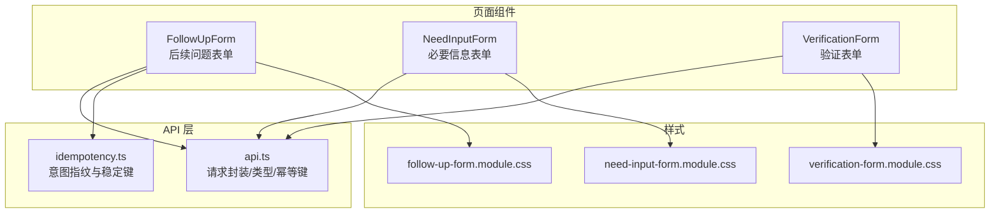
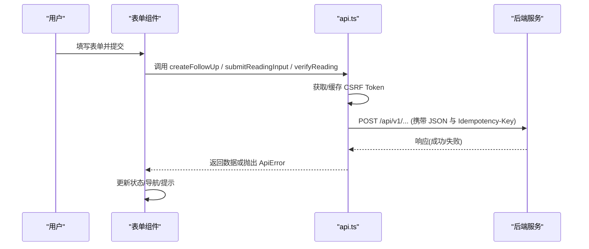
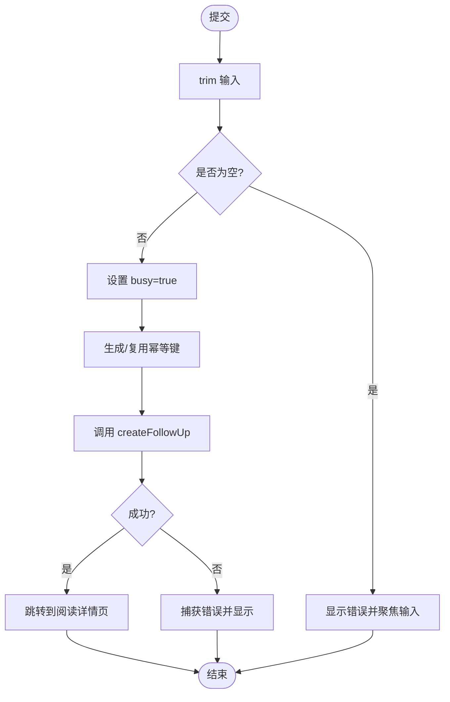
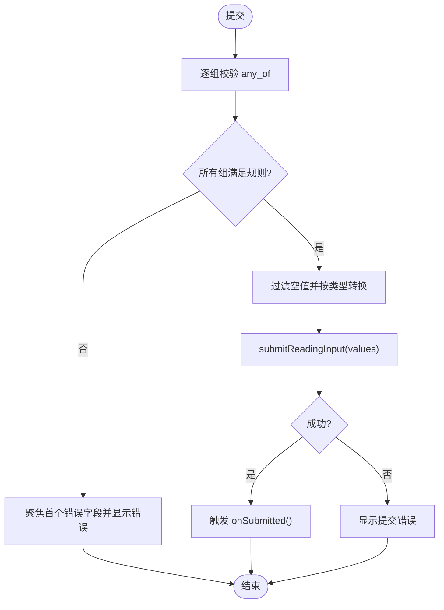
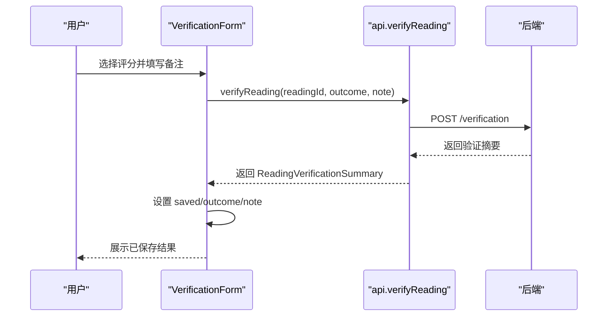
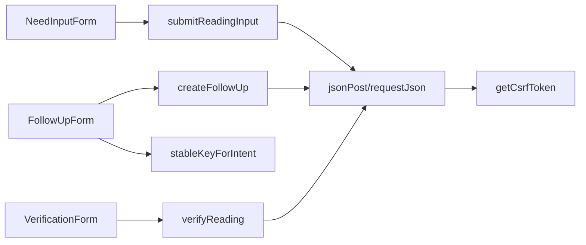

# 表单组件

<cite>
**本文引用的文件**
- [follow-up-form.tsx](file://web/src/components/readings/follow-up-form.tsx)
- [need-input-form.tsx](file://web/src/components/readings/need-input-form.tsx)
- [verification-form.tsx](file://web/src/components/readings/verification-form.tsx)
- [api.ts](file://web/src/lib/api.ts)
- [idempotency.ts](file://web/src/lib/idempotency.ts)
- [follow-up-form.module.css](file://web/src/components/readings/follow-up-form.module.css)
- [need-input-form.module.css](file://web/src/components/readings/need-input-form.module.css)
- [verification-form.module.css](file://web/src/components/readings/verification-form.module.css)
</cite>

## 目录
1. [简介](#简介)
2. [项目结构](#项目结构)
3. [核心组件](#核心组件)
4. [架构总览](#架构总览)
5. [详细组件分析](#详细组件分析)
6. [依赖关系分析](#依赖关系分析)
7. [性能与可用性](#性能与可用性)
8. [故障排查指南](#故障排查指南)
9. [结论](#结论)
10. [附录：复用模式与配置项](#附录：复用模式与配置项)

## 简介
本文件聚焦命理解读前端中的三类关键表单组件，覆盖输入验证、提交流程、状态管理与错误处理，并说明与后端 API 的异步交互。三个组件分别为：
- 后续问题表单（FollowUpForm）：基于已接纳结论继续追问，具备防重复提交与幂等键机制。
- 必要信息表单（NeedInputForm）：根据服务端下发的动态字段定义渲染表单，支持多类型字段、分组必填校验与条件提示。
- 验证表单（VerificationForm）：收集用户对解读结果的反馈评分与备注，支持保存后展示结果。

## 项目结构
以下图展示了与表单相关的组件、样式与 API 层的组织关系。

图表来源
- [follow-up-form.tsx:1-109](file://web/src/components/readings/follow-up-form.tsx#L1-L109)
- [need-input-form.tsx:1-362](file://web/src/components/readings/need-input-form.tsx#L1-L362)
- [verification-form.tsx:1-130](file://web/src/components/readings/verification-form.tsx#L1-L130)
- [api.ts:230-330](file://web/src/lib/api.ts#L230-L330)
- [idempotency.ts:1-18](file://web/src/lib/idempotency.ts#L1-L18)

章节来源
- [follow-up-form.tsx:1-109](file://web/src/components/readings/follow-up-form.tsx#L1-L109)
- [need-input-form.tsx:1-362](file://web/src/components/readings/need-input-form.tsx#L1-L362)
- [verification-form.tsx:1-130](file://web/src/components/readings/verification-form.tsx#L1-L130)
- [api.ts:230-330](file://web/src/lib/api.ts#L230-L330)
- [idempotency.ts:1-18](file://web/src/lib/idempotency.ts#L1-L18)

## 核心组件
- FollowUpForm：单行文本输入 + 提交按钮；本地非空校验；使用幂等键防止重复提交；成功后跳转至对应阅读版本页。
- NeedInputForm：根据服务端返回的动态字段定义渲染多种控件（文本、数字、日期时间、多选、布尔单选等），按“组内至少一项”或“单项必填”的规则校验，提交时仅发送有值的字段。
- VerificationForm：单选评分（符合/部分符合/不符合/暂时不知道）+ 可选备注；提交后显示已保存的结果摘要。

章节来源
- [follow-up-form.tsx:12-109](file://web/src/components/readings/follow-up-form.tsx#L12-L109)
- [need-input-form.tsx:65-362](file://web/src/components/readings/need-input-form.tsx#L65-L362)
- [verification-form.tsx:24-130](file://web/src/components/readings/verification-form.tsx#L24-L130)

## 架构总览
三个表单均通过统一的 API 层发起 POST 请求，统一处理 CSRF Token、幂等键、错误包装与重试策略。

图表来源
- [api.ts:256-330](file://web/src/lib/api.ts#L256-L330)
- [api.ts:490-525](file://web/src/lib/api.ts#L490-L525)
- [follow-up-form.tsx:23-53](file://web/src/components/readings/follow-up-form.tsx#L23-L53)
- [need-input-form.tsx:109-162](file://web/src/components/readings/need-input-form.tsx#L109-L162)
- [verification-form.tsx:42-62](file://web/src/components/readings/verification-form.tsx#L42-L62)

## 详细组件分析

### 后续问题表单（FollowUpForm）
- 输入验证
  - 提交前对输入进行 trim 非空校验，为空则设置错误并聚焦输入框。
  - 输入长度限制由 maxLength 控制（前端）。
- 提交流程
  - 使用 useRef 的 busyRef 与 useState 的 busy 双重保护，避免重复提交。
  - 通过 stableKeyForIntent 生成稳定的幂等键，相同意图不重复创建新 key。
  - 调用 createFollowUp 成功后跳转到对应 reading_version_id 页面。
- 状态管理
  - query：当前输入值
  - error：错误消息
  - busy：是否正在提交
  - intentKeyRef：记录上次意图指纹与幂等键
- 用户体验优化
  - 禁用按钮与 aria-busy 提供可访问性反馈
  - 错误信息通过 role="alert" 和 aria-live 播报
  - 提供“重新起卦或重新起盘”链接便于回退

图表来源
- [follow-up-form.tsx:23-53](file://web/src/components/readings/follow-up-form.tsx#L23-L53)
- [idempotency.ts:8-17](file://web/src/lib/idempotency.ts#L8-L17)
- [api.ts:515-525](file://web/src/lib/api.ts#L515-L525)

章节来源
- [follow-up-form.tsx:12-109](file://web/src/components/readings/follow-up-form.tsx#L12-L109)
- [follow-up-form.module.css:1-138](file://web/src/components/readings/follow-up-form.module.css#L1-L138)
- [api.ts:515-525](file://web/src/lib/api.ts#L515-L525)
- [idempotency.ts:1-18](file://web/src/lib/idempotency.ts#L1-L18)

### 必要信息表单（NeedInputForm）
- 动态字段生成
  - 接收服务端下发的 request.requirements，每个 requirement.any_of 为一组字段。
  - 根据 field.type_id 渲染不同控件：text/textarea、number/date/datetime、select（choices）、boolean（radio 是/否）。
  - 将字符串值按类型转换为整数、浮点数或保留字符串，提交时仅包含非空字段。
- 条件显示与校验逻辑
  - 每组 any_of 必须恰好填写一项；若为单项则该项为必填。
  - 提交时遍历所有组，统计每组已填数量，计算错误消息并标记所有相关字段。
  - 首次错误字段自动聚焦，提升可访问性与易用性。
- 提交流程
  - 组装 payload 为 { values: Record<string, unknown> }，调用 submitReadingInput。
  - 成功后回调 onSubmitted，供父组件切换视图或刷新状态。
- 状态管理
  - values：字段值映射
  - errors：字段级错误映射
  - busy：提交中标志
  - submitError：提交失败的全局错误
- 用户体验优化
  - 每个字段关联 description 与错误提示，通过 aria-describedby 连接
  - 提交按钮带 aria-busy，错误区域使用 role="alert"
  - 当服务端未提供 requirements 时，显示友好提示

图表来源
- [need-input-form.tsx:109-162](file://web/src/components/readings/need-input-form.tsx#L109-L162)
- [api.ts:490-498](file://web/src/lib/api.ts#L490-L498)

章节来源
- [need-input-form.tsx:16-63](file://web/src/components/readings/need-input-form.tsx#L16-L63)
- [need-input-form.tsx:65-362](file://web/src/components/readings/need-input-form.tsx#L65-L362)
- [need-input-form.module.css:1-198](file://web/src/components/readings/need-input-form.module.css#L1-L198)
- [api.ts:54-68](file://web/src/lib/api.ts#L54-L68)
- [api.ts:490-498](file://web/src/lib/api.ts#L490-L498)

### 验证表单（VerificationForm）
- 用户反馈收集
  - 单选评分：符合/部分符合/不符合/暂时不知道
  - 可选备注：最多 500 字符的文本域
- 提交流程
  - 调用 verifyReading(readingVersionId, outcome, note)，成功后保存结果并触发 onVerified。
- 状态管理
  - saved：已保存的验证摘要（用于展示成功态）
  - outcome/note：当前选择与备注
  - busy/error：提交状态与错误
- 用户体验优化
  - 成功态以卡片形式展示已保存结果，含评分与备注
  - 提交过程中禁用控件，按钮带 aria-busy
  - 错误信息通过 alert 区域播报

图表来源
- [verification-form.tsx:42-62](file://web/src/components/readings/verification-form.tsx#L42-L62)
- [api.ts:500-513](file://web/src/lib/api.ts#L500-L513)

章节来源
- [verification-form.tsx:13-130](file://web/src/components/readings/verification-form.tsx#L13-L130)
- [verification-form.module.css:1-184](file://web/src/components/readings/verification-form.module.css#L1-L184)
- [api.ts:149-161](file://web/src/lib/api.ts#L149-L161)
- [api.ts:500-513](file://web/src/lib/api.ts#L500-L513)

## 依赖关系分析
- 组件到 API 层
  - FollowUpForm 依赖 createFollowUp 与 idempotency.stableKeyForIntent
  - NeedInputForm 依赖 submitReadingInput 及 NeedInputRequest/Field 类型
  - VerificationForm 依赖 verifyReading 及 ReadingVerificationSummary/VerificationOutcome
- API 层内部依赖
  - jsonPost/requestJson 统一处理请求头、CSRF、幂等键、错误包装
  - getCsrfToken 负责从 Cookie 或会话接口获取 CSRF Token，并在 403 时自动重试一次
  - createIdempotencyKey 生成唯一幂等键，稳定键函数避免重复生成

图表来源
- [api.ts:256-330](file://web/src/lib/api.ts#L256-L330)
- [api.ts:359-385](file://web/src/lib/api.ts#L359-L385)
- [api.ts:387-392](file://web/src/lib/api.ts#L387-L392)
- [api.ts:490-525](file://web/src/lib/api.ts#L490-L525)
- [idempotency.ts:8-17](file://web/src/lib/idempotency.ts#L8-L17)

章节来源
- [api.ts:230-330](file://web/src/lib/api.ts#L230-L330)
- [api.ts:359-392](file://web/src/lib/api.ts#L359-L392)
- [api.ts:490-525](file://web/src/lib/api.ts#L490-L525)
- [idempotency.ts:1-18](file://web/src/lib/idempotency.ts#L1-L18)

## 性能与可用性
- 防抖与幂等
  - 通过 busyRef 与 disabled 按钮避免重复提交
  - 幂等键确保网络抖动下的重复点击不会创建重复任务
- 可访问性
  - 使用 aria-busy、aria-required、aria-invalid、role="alert"、aria-live 提升屏幕阅读器体验
  - 错误信息通过语义化元素与描述符关联
- 样式与动效
  - 遵循 prefers-reduced-motion 媒体查询，尊重系统减弱动效设置
  - 焦点态与悬停态提供清晰视觉反馈

[本节为通用指导，不直接分析具体文件]

## 故障排查指南
- 常见错误来源
  - 输入为空或未通过分组校验：NeedInputForm 会在提交前集中校验并高亮错误字段
  - 网络或服务端异常：ApiError 会携带 status 与 detail，组件将其转为友好提示
  - CSRF 校验失败：API 层在 403 且特定消息时自动清理缓存并重试一次
- 定位建议
  - 检查浏览器控制台与网络面板，确认请求体与响应体是否符合预期
  - 关注组件状态：busy、error、saved 是否正确更新
  - 核对服务端返回的 requirements 结构是否完整（NeedInputForm 在无 requirements 时会给出提示）

章节来源
- [api.ts:244-284](file://web/src/lib/api.ts#L244-L284)
- [api.ts:317-330](file://web/src/lib/api.ts#L317-L330)
- [need-input-form.tsx:81-91](file://web/src/components/readings/need-input-form.tsx#L81-L91)
- [need-input-form.tsx:109-162](file://web/src/components/readings/need-input-form.tsx#L109-L162)
- [verification-form.tsx:42-62](file://web/src/components/readings/verification-form.tsx#L42-L62)
- [follow-up-form.tsx:23-53](file://web/src/components/readings/follow-up-form.tsx#L23-L53)

## 结论
三个表单组件围绕“输入—校验—提交—反馈”的主线，采用一致的 API 封装与错误处理策略，兼顾了可访问性与用户体验。NeedInputForm 通过动态字段定义实现了高度可扩展的表单能力；FollowUpForm 借助幂等键保障并发安全；VerificationForm 提供了简洁直观的反馈闭环。整体设计具备良好的复用性与维护性。

[本节为总结性内容，不直接分析具体文件]

## 附录：复用模式与配置项
- 复用模式
  - 表单容器模式：统一的 busy/error/saved 状态机，配合 noValidate 与自定义校验
  - 动态字段模式：基于服务端 schema 渲染控件，适合多业务场景扩展
  - 幂等提交模式：通过 Idempotency-Key 与指纹去重，适用于易重复触发的操作
- 配置项
  - FollowUpForm
    - readingId：当前阅读版本 ID
    - 行为：提交后跳转到 reading_version_id 页面
  - NeedInputForm
    - readingId：当前阅读版本 ID
    - request：服务端下发的动态字段定义（requirements）
    - onSubmitted：提交成功回调
  - VerificationForm
    - readingId：当前阅读版本 ID
    - initialVerification：初始验证摘要（用于回显）
    - onVerified：保存成功回调
- 与后端 API 的约定
  - 统一通过 jsonPost 发送 JSON 请求，附带 CSRF 与幂等键
  - 错误统一包装为 ApiError，包含 status 与 detail
  - 各表单对应的 API 路径与参数见下方引用

章节来源
- [follow-up-form.tsx:12-109](file://web/src/components/readings/follow-up-form.tsx#L12-L109)
- [need-input-form.tsx:65-362](file://web/src/components/readings/need-input-form.tsx#L65-L362)
- [verification-form.tsx:24-130](file://web/src/components/readings/verification-form.tsx#L24-L130)
- [api.ts:230-330](file://web/src/lib/api.ts#L230-L330)
- [api.ts:490-525](file://web/src/lib/api.ts#L490-L525)