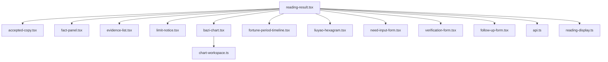
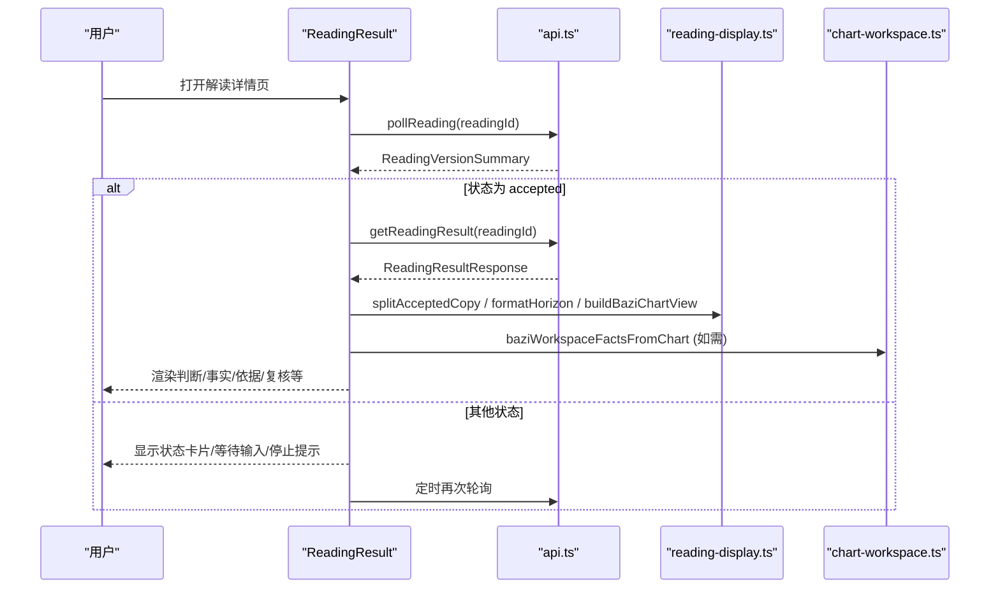
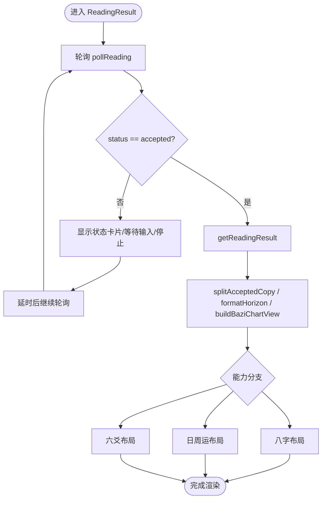
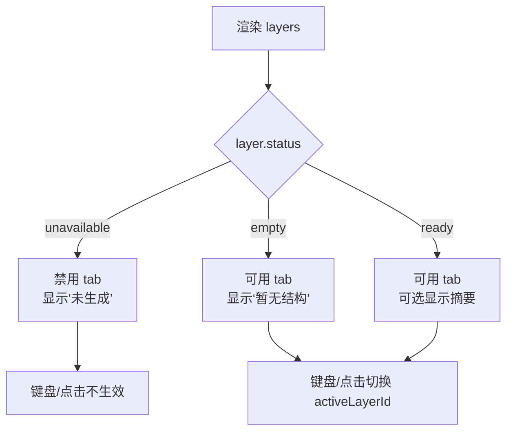
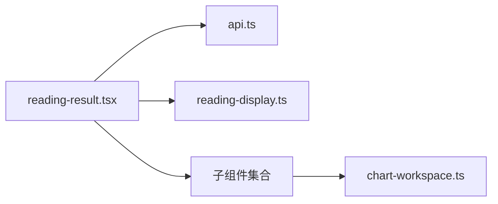

# 解读结果展示

<cite>
**本文引用的文件**
- [reading-result.tsx](file://web/src/components/readings/reading-result.tsx)
- [accepted-copy.tsx](file://web/src/components/readings/accepted-copy.tsx)
- [time-layer-tabs.tsx](file://web/src/components/readings/time-layer-tabs.tsx)
- [reading-display.ts](file://web/src/lib/reading-display.ts)
- [api.ts](file://web/src/lib/api.ts)
- [chart-workspace.ts](file://web/src/lib/chart-workspace.ts)
- [reading-result.module.css](file://web/src/components/readings/reading-result.module.css)
- [accepted-copy.module.css](file://web/src/components/readings/accepted-copy.module.css)
- [time-layer-tabs.module.css](file://web/src/components/readings/time-layer-tabs.module.css)
</cite>

## 目录
1. [简介](#简介)
2. [项目结构](#项目结构)
3. [核心组件](#核心组件)
4. [架构总览](#架构总览)
5. [详细组件分析](#详细组件分析)
6. [依赖关系分析](#依赖关系分析)
7. [性能与缓存](#性能与缓存)
8. [故障排查指南](#故障排查指南)
9. [结论](#结论)
10. [附录：配置与样式定制](#附录：配置与样式定制)

## 简介
本文件聚焦“解读结果展示”的前端实现，围绕以下目标展开：
- 深入解析 reading-result.tsx 的渲染逻辑、状态管理与用户交互。
- 说明 accepted-copy.tsx 接受版本组件的数据绑定与空态处理。
- 解释 time-layer-tabs.tsx 时间层标签的切换机制与可用性过滤。
- 梳理解读结果的格式化显示、错误处理与加载状态管理。
- 提供组件配置选项与自定义样式的方法。
- 说明与后端 API 的数据对接方式与前端安全/缓存策略。

## 项目结构
解读结果页面由一个主容器组件负责拉取状态与结果，并组合多个子组件进行呈现：
- 主容器：reading-result.tsx（轮询状态、组装视图、路由到不同能力分支）
- 正文展示：accepted-copy.tsx（已接纳正文）
- 事实面板：fact-panel.tsx、evidence-list.tsx、limit-notice.tsx（来自 reading-display.ts 格式化）
- 图表工作区：bazi-chart.tsx（基于 chart-workspace.ts 构建）
- 周期标记：fortune-period-timeline.tsx（基于 fortune-period-markers.ts）
- 六爻盘面：liuyao-hexagram.tsx
- 输入补充：need-input-form.tsx
- 复核与追问：verification-form.tsx、follow-up-form.tsx
- 数据层：api.ts（HTTP 请求、CSRF、幂等键、安全投影）
- 格式化：reading-display.ts（日期、能力、对象、维度、事实、标题拆分等）
- 样式：各 .module.css

**图示来源**
- [reading-result.tsx:172-577](file://web/src/components/readings/reading-result.tsx#L172-L577)
- [api.ts:468-488](file://web/src/lib/api.ts#L468-L488)
- [reading-display.ts:659-690](file://web/src/lib/reading-display.ts#L659-L690)
- [chart-workspace.ts:228-238](file://web/src/lib/chart-workspace.ts#L228-L238)

**章节来源**
- [reading-result.tsx:172-577](file://web/src/components/readings/reading-result.tsx#L172-L577)
- [api.ts:468-488](file://web/src/lib/api.ts#L468-L488)
- [reading-display.ts:659-690](file://web/src/lib/reading-display.ts#L659-L690)
- [chart-workspace.ts:228-238](file://web/src/lib/chart-workspace.ts#L228-L238)

## 核心组件
- ReadingResult（reading-result.tsx）
  - 职责：轮询读取版本状态；在“已交付”时拉取完整结果；按能力（八字/日周运/六爻）组织版面；处理等待输入、停止、未知运行状态等分支；统一错误与重试。
  - 关键状态：loading、summary、result、error、retryKey；定时器用于轮询。
  - 关键流程：pollReading -> 若 status=accepted -> getReadingResult -> 渲染；否则继续轮询或进入特定状态分支。
- AcceptedCopy（accepted-copy.tsx）
  - 职责：渲染已接纳正文；无内容时显示占位提示。
- TimeLayerTabs（time-layer-tabs.tsx）
  - 职责：根据 workspace 层模型渲染可访问的时间层标签；支持键盘导航；不可用层禁用并标注。

**章节来源**
- [reading-result.tsx:172-577](file://web/src/components/readings/reading-result.tsx#L172-L577)
- [accepted-copy.tsx:3-9](file://web/src/components/readings/accepted-copy.tsx#L3-L9)
- [time-layer-tabs.tsx:17-103](file://web/src/components/readings/time-layer-tabs.tsx#L17-L103)

## 架构总览
解读结果展示采用“状态轮询 + 条件渲染”的客户端驱动模式：
- 通过 pollReading 周期性获取 ReadingVersionSummary，更新 UI 状态。
- 当状态为 accepted 时，调用 getReadingResult 获取完整结果（包含 accepted_copy、fact_panel、verification）。
- 使用 reading-display.ts 将服务端事实转换为可读中文展示，并按能力分支渲染不同区域。
- 对敏感字段与原始输入进行安全投影，避免泄露至浏览器状态。

**图示来源**
- [reading-result.tsx:180-233](file://web/src/components/readings/reading-result.tsx#L180-L233)
- [api.ts:468-488](file://web/src/lib/api.ts#L468-L488)
- [reading-display.ts:659-690](file://web/src/lib/reading-display.ts#L659-L690)
- [chart-workspace.ts:273-302](file://web/src/lib/chart-workspace.ts#L273-L302)

## 详细组件分析

### ReadingResult 组件
- 状态管理
  - loading：初始加载与重试期间显示加载态。
  - summary：版本摘要（能力、范围、状态、输入需求等）。
  - result：完整结果（正文、事实面板、验证信息）。
  - error：网络或解析异常时的错误消息。
  - retryKey：触发重新挂载以重置轮询。
- 轮询与生命周期
  - useEffect 内启动 run()，内部 schedule() 使用 setTimeout 循环调用 pollReading。
  - 清理函数确保取消标志与定时器释放，防止内存泄漏。
- 状态分支
  - accepted：拉取完整结果后，按能力分支渲染（八字/日周运/六爻），并组合 FactPanel、EvidenceList、LimitNotice、VerificationForm、FollowUpForm。
  - waiting_input：渲染 NeedInputForm，提交后重置状态并重启轮询。
  - terminal_stopped：提示已停止并提供返回入口。
  - runtime_unknown/delayed/processing：显示状态卡片，必要时提供重试按钮。
- 格式化与数据准备
  - 使用 reading-display.ts 的 splitAcceptedCopy 拆分标题与正文。
  - 使用 formatHorizon/formatCapabilityIds/formatDimensionIds 格式化元信息。
  - 八字场景下使用 buildBaziChartView 生成图表数据。
  - 日周运场景下提取周期标记并渲染 FortunePeriodTimeline。
- 错误处理
  - 捕获网络异常，设置 error 并显示错误卡片与重试按钮。
  - 对非 Error 对象进行兜底文案处理。

**图示来源**
- [reading-result.tsx:180-233](file://web/src/components/readings/reading-result.tsx#L180-L233)
- [reading-result.tsx:285-513](file://web/src/components/readings/reading-result.tsx#L285-L513)
- [reading-display.ts:659-690](file://web/src/lib/reading-display.ts#L659-L690)

**章节来源**
- [reading-result.tsx:172-577](file://web/src/components/readings/reading-result.tsx#L172-L577)

### AcceptedCopy 组件
- 数据绑定
  - 接收 text?: string | null，存在则渲染段落；为空时显示“服务端尚未返回已接纳正文”。
- 样式与动画
  - 使用 CSS Modules 控制字体、行高、换行与入场动画。
- 扩展点
  - 可通过传入不同文本或扩展样式类名实现富文本或主题定制。

**章节来源**
- [accepted-copy.tsx:3-9](file://web/src/components/readings/accepted-copy.tsx#L3-L9)
- [accepted-copy.module.css:1-33](file://web/src/components/readings/accepted-copy.module.css#L1-L33)

### TimeLayerTabs 组件
- 切换机制
  - 接收 layers、activeLayerId、onSelect、idPrefix。
  - 仅对 status !== "unavailable" 的层启用键盘导航（左右箭头、Home、End）。
  - 点击或键盘选择时调用 onSelect(layerId)。
- 可用性过滤
  - unavailable：禁用并显示“未生成”。
  - empty：可用但无结构，显示“暂无结构”。
  - ready：正常可用，可能显示 summary 摘要。
- 无障碍
  - role="tablist"/"tab"，aria-selected、aria-controls、aria-disabled、tabIndex 管理焦点顺序。

**图示来源**
- [time-layer-tabs.tsx:17-103](file://web/src/components/readings/time-layer-tabs.tsx#L17-L103)

**章节来源**
- [time-layer-tabs.tsx:17-103](file://web/src/components/readings/time-layer-tabs.tsx#L17-L103)
- [time-layer-tabs.module.css:1-76](file://web/src/components/readings/time-layer-tabs.module.css#L1-L76)

### 解读结果格式化与数据流
- 日期与范围
  - formatServerDate/formatDateTimeLike/formatHorizon 将 ISO 字符串转为本地化中文显示。
- 能力/对象/维度
  - formatCapabilityIds/formatObjectId/formatDimensionIds 将 id 映射为中文标签。
- 事实展示
  - formatReadingFact/formatReadingFacts 将 ReadingFact 转为 FactPresentation，优先 display_text，必要时解析结构化值，屏蔽敏感键。
- 标题拆分
  - splitAcceptedCopy 将长文本拆分为 headline 与 body，便于头部标题与正文分离。
- 八字图表视图
  - buildBaziChartView 从 facts 中抽取四柱、日主、月令、当前大运、出生时间、性别、地点、时间口径、子时策略、时区、目标日期/周期、历法口径，并区分 highlights/secondary。
- 工作区适配
  - baziWorkspaceFactsFromChart 将 BaziChartView 转为 ChartWorkspace 所需的 facts，供更复杂的图表工作区使用。

**章节来源**
- [reading-display.ts:119-157](file://web/src/lib/reading-display.ts#L119-L157)
- [reading-display.ts:133-143](file://web/src/lib/reading-display.ts#L133-L143)
- [reading-display.ts:467-577](file://web/src/lib/reading-display.ts#L467-L577)
- [reading-display.ts:659-690](file://web/src/lib/reading-display.ts#L659-L690)
- [chart-workspace.ts:273-302](file://web/src/lib/chart-workspace.ts#L273-L302)

### 与后端 API 的数据对接与安全策略
- 轮询与结果
  - pollReading：GET /api/v1/readings/{id}
  - getReadingResult：GET /api/v1/readings/{id}/result
- 写操作与幂等
  - jsonPost 统一封装 POST，自动注入 CSRF Token 与 Idempotency-Key。
  - createIdempotencyKey 生成唯一键，避免重复提交。
- 安全投影
  - projectClientSafeFactPanel 移除原始输入引用（/input/*），并从证据与发现中剔除相关 fact_refs，确保浏览器不持有敏感原始输入。
- CSRF 处理
  - 优先读取 Cookie 中的 mingli_csrf；若无则发起 GET/POST 会话获取；失败时清空缓存并重试一次。
- 错误处理
  - ApiError 携带 status 与 detail；requestJson 在非 2xx 时抛出；204 返回 undefined。

**章节来源**
- [api.ts:244-284](file://web/src/lib/api.ts#L244-L284)
- [api.ts:286-330](file://web/src/lib/api.ts#L286-L330)
- [api.ts:332-385](file://web/src/lib/api.ts#L332-L385)
- [api.ts:387-392](file://web/src/lib/api.ts#L387-L392)
- [api.ts:468-488](file://web/src/lib/api.ts#L468-L488)
- [api.ts:490-525](file://web/src/lib/api.ts#L490-L525)

## 依赖关系分析
- reading-result.tsx 依赖：
  - api.ts：轮询与结果获取、写操作、CSRF、幂等键。
  - reading-display.ts：格式化与标题拆分、图表视图构建。
  - 子组件：accepted-copy、fact-panel、evidence-list、limit-notice、bazi-chart、fortune-period-timeline、liuyao-hexagram、need-input-form、verification-form、follow-up-form。
  - chart-workspace.ts：八字工作区事实适配（间接通过 bazi-chart）。
- 耦合度与内聚性
  - reading-result.tsx 承担编排职责，内聚了状态机与渲染分支；子组件职责单一，利于复用与测试。
- 外部依赖
  - 后端 REST API（/api/v1/*）；浏览器 fetch、Intl.DateTimeFormat。

**图示来源**
- [reading-result.tsx:172-577](file://web/src/components/readings/reading-result.tsx#L172-L577)
- [api.ts:468-488](file://web/src/lib/api.ts#L468-L488)
- [chart-workspace.ts:228-238](file://web/src/lib/chart-workspace.ts#L228-L238)

**章节来源**
- [reading-result.tsx:172-577](file://web/src/components/readings/reading-result.tsx#L172-L577)
- [api.ts:468-488](file://web/src/lib/api.ts#L468-L488)
- [chart-workspace.ts:228-238](file://web/src/lib/chart-workspace.ts#L228-L238)

## 性能与缓存
- 轮询频率
  - 默认 2000ms 轮询，避免频繁请求；可在需要时调整 DEFAULT_POLL_MS。
- 防抖与取消
  - 使用 cancelled 标志与 clearTimeout 清理，避免组件卸载后的副作用。
- 数据裁剪
  - 安全投影移除敏感输入，减少不必要的数据体积与风险。
- 缓存策略
  - CSRF Token 在内存中缓存，避免重复请求；Cookie 优先读取。
  - 当前未实现结果级缓存；如需离线或快速回看，可在上层引入 React Query/SWR 或 IndexedDB 缓存策略。
- 渲染优化
  - 按能力分支选择性渲染，减少无关计算；事实格式化仅在数据变化时执行。

[本节为通用指导，无需具体文件引用]

## 故障排查指南
- 常见问题
  - 一直显示“正在读取结果…”：检查 pollReading 是否成功返回；确认 status 是否为 accepted；查看网络请求与 CORS/CSRF 配置。
  - 错误提示“服务暂时不可用”：检查后端健康状态与响应体；确认 ApiError 的 status/detail。
  - 正文为空：确认 accepted_copy 是否存在；检查 splitAcceptedCopy 拆分逻辑是否符合预期。
  - 时间层不可用：确认 workspace 层状态；检查是否有对应公开事实支撑。
- 定位步骤
  - 打开浏览器开发者工具，查看 Network 面板中 /api/v1/readings/{id} 与 /result 的请求与响应。
  - 在 Console 中捕获 ApiError 的堆栈与 detail。
  - 逐步断点 reading-result.tsx 的状态分支，确认 summary 与 result 的值。
- 恢复手段
  - 点击“重试”或“重新检查状态”，触发 handleRetry/handleInputSubmitted。
  - 如为 CSRF 问题，确认 Cookie 与跨域设置；必要时清除会话后重试。

**章节来源**
- [reading-result.tsx:251-266](file://web/src/components/readings/reading-result.tsx#L251-L266)
- [reading-result.tsx:551-577](file://web/src/components/readings/reading-result.tsx#L551-L577)
- [api.ts:244-284](file://web/src/lib/api.ts#L244-L284)

## 结论
- ReadingResult 作为编排中心，实现了稳健的状态轮询、分支渲染与错误恢复。
- AcceptedCopy 简洁可靠地承载已接纳正文，空态友好。
- TimeLayerTabs 严格遵循服务端提供的层状态，保证“所见即所得”，不虚构数据。
- reading-display.ts 提供了强大的格式化能力，保障面向用户的可读性与安全性。
- api.ts 封装了安全的 HTTP 交互、CSRF 与幂等保护，并对外暴露清晰的类型契约。
- 建议后续按需引入查询缓存与离线策略，进一步提升用户体验与鲁棒性。

[本节为总结，无需具体文件引用]

## 附录：配置与样式定制
- 组件配置选项
  - ReadingResult
    - 输入：readingId（必填）
    - 行为：轮询间隔（DEFAULT_POLL_MS）、重试逻辑、分支渲染（按 capability_id）
  - AcceptedCopy
    - 输入：text（可选）
  - TimeLayerTabs
    - 输入：layers、activeLayerId、onSelect、idPrefix
- 样式定制
  - 使用 CSS Modules 覆盖变量与类名：
    - reading-result.module.css：状态卡片、错误卡片、按钮、动画
    - accepted-copy.module.css：正文段落、空态、动画
    - time-layer-tabs.module.css：标签容器、激活态、禁用态、摘要与状态文字
  - 主题变量：通过 :root 或全局 CSS 变量（如 --border-subtle、--ink-950、--gold-500）统一调整。
- 扩展点
  - 新增能力分支：在 reading-result.tsx 中按 capability_id 增加渲染分支。
  - 新增格式化规则：在 reading-display.ts 中添加新的 label/value 映射与解析逻辑。
  - 新增时间层：在 chart-workspace.ts 中扩展 WorkspaceLayer 与 buildLayers。

**章节来源**
- [reading-result.module.css:1-112](file://web/src/components/readings/reading-result.module.css#L1-L112)
- [accepted-copy.module.css:1-33](file://web/src/components/readings/accepted-copy.module.css#L1-L33)
- [time-layer-tabs.module.css:1-76](file://web/src/components/readings/time-layer-tabs.module.css#L1-L76)
- [reading-display.ts:19-50](file://web/src/lib/reading-display.ts#L19-L50)
- [chart-workspace.ts:152-185](file://web/src/lib/chart-workspace.ts#L152-L185)