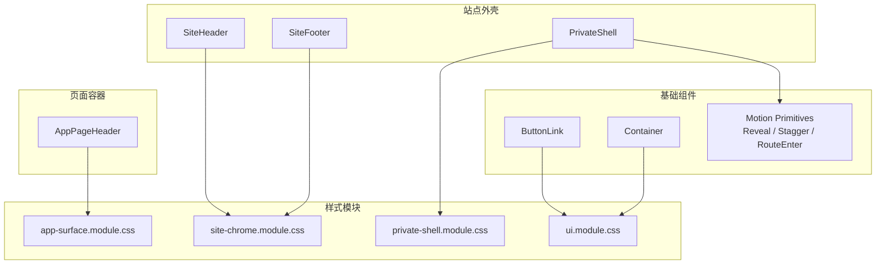
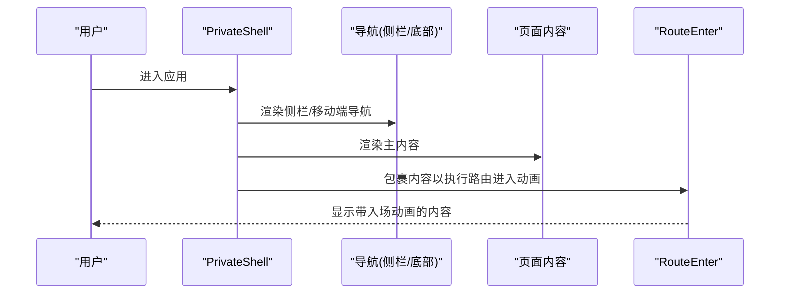
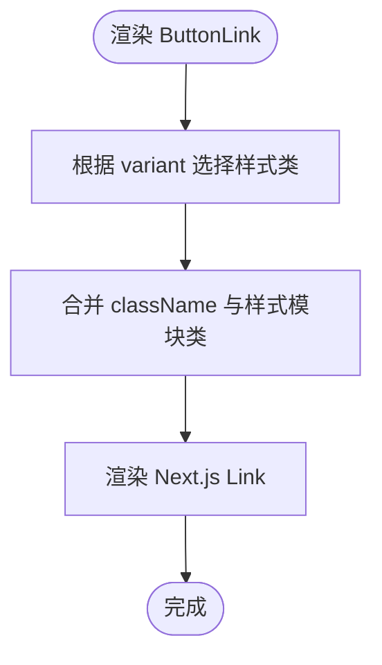
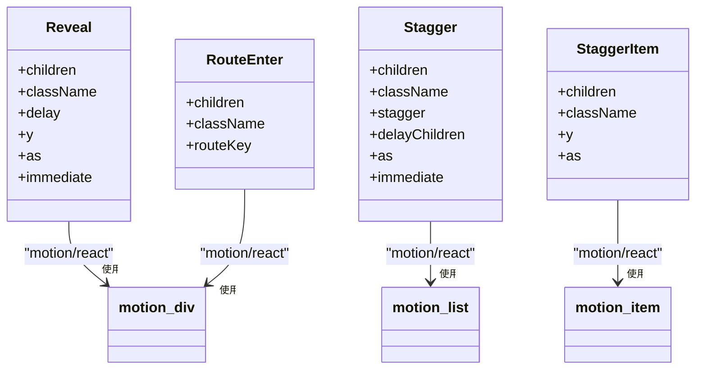
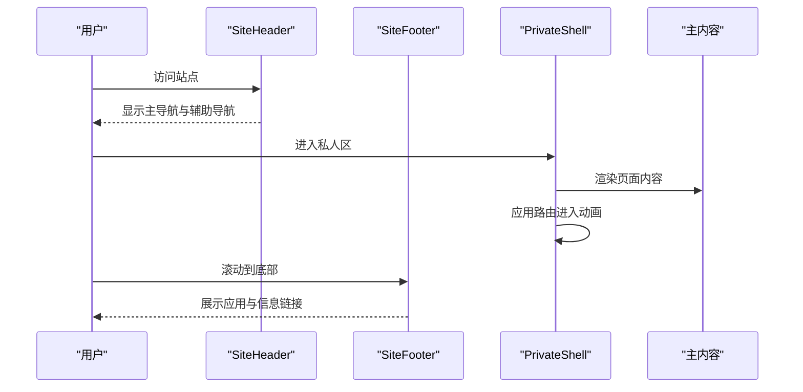
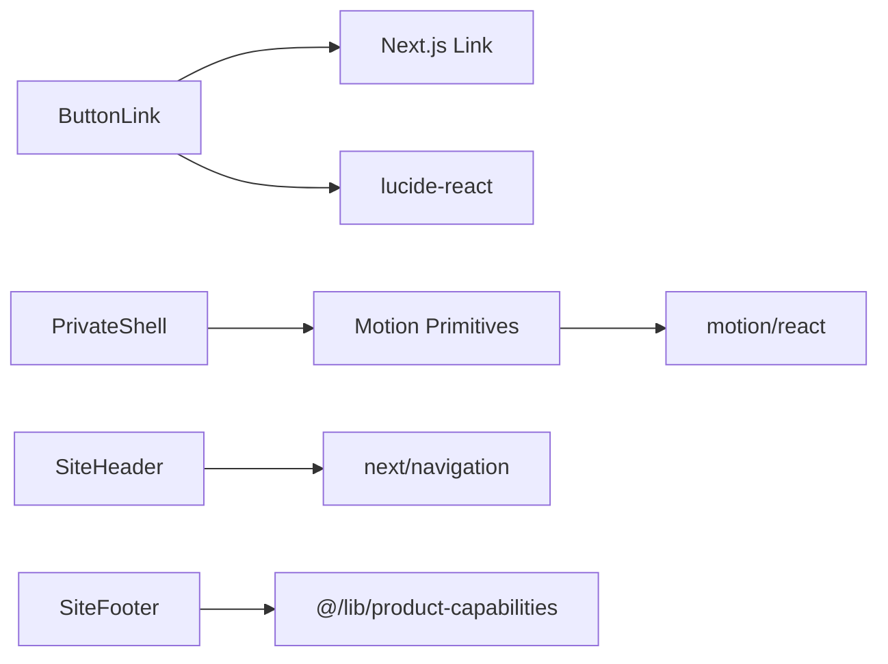

# 基础组件

<cite>
**本文引用的文件**
- [button-link.tsx](file://web/src/components/button-link.tsx)
- [container.tsx](file://web/src/components/container.tsx)
- [motion-primitives.tsx](file://web/src/components/motion-primitives.tsx)
- [ui.module.css](file://web/src/components/ui.module.css)
- [site-header.tsx](file://web/src/components/site-header.tsx)
- [site-footer.tsx](file://web/src/components/site-footer.tsx)
- [app-page-header.tsx](file://web/src/components/app-page-header.tsx)
- [private-shell.tsx](file://web/src/components/private-shell.tsx)
- [site-chrome.module.css](file://web/src/components/site-chrome.module.css)
- [app-surface.module.css](file://web/src/components/app-surface.module.css)
- [private-shell.module.css](file://web/src/components/private-shell.module.css)
</cite>

## 目录
1. [简介](#简介)
2. [项目结构](#项目结构)
3. [核心组件](#核心组件)
4. [架构总览](#架构总览)
5. [详细组件分析](#详细组件分析)
6. [依赖关系分析](#依赖关系分析)
7. [性能考量](#性能考量)
8. [故障排查指南](#故障排查指南)
9. [结论](#结论)
10. [附录](#附录)

## 简介
本章节面向“基础UI组件”的设计与实现，聚焦按钮、容器、动画原语等通用能力，说明其Props接口、样式定制选项、可访问性支持、设计原则与复用策略，并给出使用示例与最佳实践。同时说明与Radix UI的集成方式（当前仓库未直接引入Radix UI）以及自定义封装模式。最后提供测试方法与性能优化建议，帮助团队在统一视觉与交互规范下高效构建页面。

## 项目结构
- 基础组件位于 web/src/components 目录，采用“按功能/区域组织 + 共享样式模块”的方式：
  - 通用原子组件：ButtonLink、Container、Motion Primitives（Reveal/Stagger/RouteEnter）
  - 站点外壳与导航：SiteHeader、SiteFooter、PrivateShell
  - 页面级容器与布局：AppPageHeader 及对应样式
  - 样式模块：ui.module.css、site-chrome.module.css、app-surface.module.css、private-shell.module.css
- 组件通过 CSS 变量与模块化样式实现主题化与响应式；动画由 motion/react 驱动，并提供无障碍降级。

图表来源
- [button-link.tsx:1-28](file://web/src/components/button-link.tsx#L1-L28)
- [container.tsx:1-10](file://web/src/components/container.tsx#L1-L10)
- [motion-primitives.tsx:1-218](file://web/src/components/motion-primitives.tsx#L1-L218)
- [site-header.tsx:1-72](file://web/src/components/site-header.tsx#L1-L72)
- [site-footer.tsx:1-65](file://web/src/components/site-footer.tsx#L1-L65)
- [private-shell.tsx:1-88](file://web/src/components/private-shell.tsx#L1-L88)
- [app-page-header.tsx:1-26](file://web/src/components/app-page-header.tsx#L1-L26)
- [ui.module.css:1-92](file://web/src/components/ui.module.css#L1-L92)
- [site-chrome.module.css:1-461](file://web/src/components/site-chrome.module.css#L1-L461)
- [app-surface.module.css:1-800](file://web/src/components/app-surface.module.css#L1-L800)
- [private-shell.module.css:1-331](file://web/src/components/private-shell.module.css#L1-L331)

章节来源
- [button-link.tsx:1-28](file://web/src/components/button-link.tsx#L1-L28)
- [container.tsx:1-10](file://web/src/components/container.tsx#L1-L10)
- [motion-primitives.tsx:1-218](file://web/src/components/motion-primitives.tsx#L1-L218)
- [site-header.tsx:1-72](file://web/src/components/site-header.tsx#L1-L72)
- [site-footer.tsx:1-65](file://web/src/components/site-footer.tsx#L1-L65)
- [private-shell.tsx:1-88](file://web/src/components/private-shell.tsx#L1-L88)
- [app-page-header.tsx:1-26](file://web/src/components/app-page-header.tsx#L1-L26)
- [ui.module.css:1-92](file://web/src/components/ui.module.css#L1-L92)
- [site-chrome.module.css:1-461](file://web/src/components/site-chrome.module.css#L1-L461)
- [app-surface.module.css:1-800](file://web/src/components/app-surface.module.css#L1-L800)
- [private-shell.module.css:1-331](file://web/src/components/private-shell.module.css#L1-L331)

## 核心组件
- ButtonLink：基于 Next.js Link 的可点击链接按钮，支持 primary/secondary/text 三种变体，附带箭头图标与悬停/按下动效。
- Container：最小化的内容容器，负责最大宽度与内边距对齐，适配不同屏幕尺寸。
- Motion Primitives：统一的入场与交错动画原语，包含 Reveal（滚动或挂载时淡入上移）、Stagger（子项交错出现）、RouteEnter（路由切换时的平滑过渡），内置减少动视偏好检测与测试环境禁用逻辑。

章节来源
- [button-link.tsx:1-28](file://web/src/components/button-link.tsx#L1-L28)
- [container.tsx:1-10](file://web/src/components/container.tsx#L1-L10)
- [motion-primitives.tsx:1-218](file://web/src/components/motion-primitives.tsx#L1-L218)

## 架构总览
基础组件遵循“原子 + 组合”的分层：
- 原子层：ButtonLink、Container、Motion Primitives
- 组合层：SiteHeader/SiteFooter/PrivateShell 将原子与布局样式组合为站点外壳
- 页面层：AppPageHeader 提供页面标题区，配合 app-surface.module.css 中的卡片、栅格、表单控件样式

图表来源
- [private-shell.tsx:1-88](file://web/src/components/private-shell.tsx#L1-L88)
- [motion-primitives.tsx:193-218](file://web/src/components/motion-primitives.tsx#L193-L218)

## 详细组件分析

### 按钮与链接：ButtonLink
- Props 接口
  - 继承 Next.js Link 的所有属性
  - variant?: "primary" | "secondary" | "text"
- 样式定制
  - 通过 ui.module.css 中 .button 与 .primary/.secondary/.text 类名组合
  - 支持 hover/active 微动效，SVG 图标跟随位移
  - 响应式与减少动视偏好自动处理
- 可访问性
  - 作为 <Link> 语义元素，天然具备键盘导航与焦点管理
  - 图标使用 aria-hidden="true" 避免朗读
- 使用示例
  - 在页面或导航中使用 <ButtonLink variant="primary">前往解读</ButtonLink>
- 最佳实践
  - 文本变体用于轻量操作；主要行动使用 primary；强调跳转时使用 secondary
  - 保持按钮最小高度一致，确保触控友好

图表来源
- [button-link.tsx:9-27](file://web/src/components/button-link.tsx#L9-L27)
- [ui.module.css:6-71](file://web/src/components/ui.module.css#L6-L71)

章节来源
- [button-link.tsx:1-28](file://web/src/components/button-link.tsx#L1-L28)
- [ui.module.css:6-71](file://web/src/components/ui.module.css#L6-L71)

### 容器：Container
- Props 接口
  - 标准 div 属性，className 默认叠加容器样式
- 样式定制
  - 通过 ui.module.css 的 .container 控制宽度与居中，媒体查询在大屏增加左右留白
- 可访问性
  - 语义中性容器，不改变可访问性
- 使用示例
  - 用 <Container> 包裹页面主要内容，保证统一的最大宽度与间距
- 最佳实践
  - 避免嵌套过多层级；复杂布局优先使用栅格或 flex 容器

章节来源
- [container.tsx:1-10](file://web/src/components/container.tsx#L1-L10)
- [ui.module.css:1-4](file://web/src/components/ui.module.css#L1-L4)
- [ui.module.css:73-77](file://web/src/components/ui.module.css#L73-L77)

### 动画原语：Reveal / Stagger / RouteEnter
- 设计目标
  - 统一入场与交错动画，提升信息层次与节奏感
  - 尊重系统“减少动视”偏好，并在测试环境中禁用动画以保证稳定性
- Props 接口
  - Reveal: children, className, delay, y, as, immediate
  - Stagger: children, className, stagger, delayChildren, as, immediate
  - StaggerItem: children, className, y, as
  - RouteEnter: children, className, routeKey
- 样式与动画
  - 使用 motion/react 的 motion.div/section/article/ol/ul/li
  - 统一缓动曲线与时长常量，入口动画与滚动触发动画
- 可访问性
  - useSafeReducedMotion 检测系统偏好，必要时禁用动画
  - 测试环境强制关闭动画，避免断言抖动
- 使用示例
  - 列表项使用 <Stagger><StaggerItem>...</StaggerItem></Stagger> 实现交错出现
  - 路由切换内容使用 <RouteEnter routeKey={pathname}>...</RouteEnter>
- 最佳实践
  - 对首屏关键内容使用 immediate 立即入场；长列表使用 whileInView 延迟加载
  - 合理设置 stagger 与 delayChildren，避免过度拥挤

图表来源
- [motion-primitives.tsx:32-90](file://web/src/components/motion-primitives.tsx#L32-L90)
- [motion-primitives.tsx:92-160](file://web/src/components/motion-primitives.tsx#L92-L160)
- [motion-primitives.tsx:162-191](file://web/src/components/motion-primitives.tsx#L162-L191)
- [motion-primitives.tsx:193-218](file://web/src/components/motion-primitives.tsx#L193-L218)

章节来源
- [motion-primitives.tsx:1-218](file://web/src/components/motion-primitives.tsx#L1-L218)

### 站点外壳：SiteHeader / SiteFooter / PrivateShell
- SiteHeader
  - 公共导航与辅助导航，使用 aria-label 标注导航区域
  - 通过 isPublicNavigationItemActive 计算当前页高亮
  - 提供“跳到主要内容”快捷链接，提升键盘可达性
- SiteFooter
  - 展示品牌、应用与信息链接，法律链接分组清晰
  - 使用 aria-label 区分不同导航块
- PrivateShell
  - 私人应用壳，包含顶部返回、侧边导航与主内容区
  - 使用 RouteEnter 包裹内容，实现路由切换动画
  - 移动端底部导航与桌面端侧栏自适应

图表来源
- [site-header.tsx:1-72](file://web/src/components/site-header.tsx#L1-L72)
- [site-footer.tsx:1-65](file://web/src/components/site-footer.tsx#L1-L65)
- [private-shell.tsx:1-88](file://web/src/components/private-shell.tsx#L1-L88)

章节来源
- [site-header.tsx:1-72](file://web/src/components/site-header.tsx#L1-L72)
- [site-footer.tsx:1-65](file://web/src/components/site-footer.tsx#L1-L65)
- [private-shell.tsx:1-88](file://web/src/components/private-shell.tsx#L1-L88)

### 页面容器：AppPageHeader
- Props 接口
  - title: string
  - description: string
  - meta?: ReactNode
- 样式与布局
  - 使用 app-surface.module.css 的 pageHeader 样式，标题与描述排版统一
  - 可选 meta 行用于附加标签或状态
- 使用示例
  - 在页面顶部使用 <AppPageHeader title="档案" description="查看与管理个人档案" />
- 最佳实践
  - 标题控制在可读长度；描述简洁明确；meta 用于补充元信息

章节来源
- [app-page-header.tsx:1-26](file://web/src/components/app-page-header.tsx#L1-L26)
- [app-surface.module.css:6-37](file://web/src/components/app-surface.module.css#L6-L37)

## 依赖关系分析
- 组件依赖
  - ButtonLink 依赖 Next.js Link 与 lucide-react 图标
  - Motion Primitives 依赖 motion/react 与浏览器 API（IntersectionObserver）
  - SiteHeader/Footer/PrivateShell 依赖 Next.js 导航与产品能力配置
- 样式依赖
  - 全局 CSS 变量（如 --duration-feedback、--ease-out-expo、--ink-*、--gold-*）在各样式模块中复用
  - 各模块通过媒体查询与 prefers-reduced-motion 进行响应式与无障碍适配

图表来源
- [button-link.tsx:1-28](file://web/src/components/button-link.tsx#L1-L28)
- [motion-primitives.tsx:1-218](file://web/src/components/motion-primitives.tsx#L1-L218)
- [site-header.tsx:1-72](file://web/src/components/site-header.tsx#L1-L72)
- [site-footer.tsx:1-65](file://web/src/components/site-footer.tsx#L1-L65)
- [private-shell.tsx:1-88](file://web/src/components/private-shell.tsx#L1-L88)

章节来源
- [button-link.tsx:1-28](file://web/src/components/button-link.tsx#L1-L28)
- [motion-primitives.tsx:1-218](file://web/src/components/motion-primitives.tsx#L1-L218)
- [site-header.tsx:1-72](file://web/src/components/site-header.tsx#L1-L72)
- [site-footer.tsx:1-65](file://web/src/components/site-footer.tsx#L1-L65)
- [private-shell.tsx:1-88](file://web/src/components/private-shell.tsx#L1-L88)

## 性能考量
- 动画性能
  - 使用 motion/react 的 GPU 友好属性（opacity、transform）
  - 通过 useSafeReducedMotion 与 prefers-reduced-motion 减少不必要的重排与重绘
  - 列表交错动画合理设置 stagger 与 delayChildren，避免一次性大量渲染
- 首屏与滚动
  - Reveal 支持 immediate 与 whileInView，首屏关键内容立即入场，非关键内容延迟到可视区域
- 样式性能
  - 使用 CSS 变量集中管理主题与动效参数，便于批量优化
  - 媒体查询与 prefers-reduced-motion 减少低端设备负担
- 可维护性
  - 组件职责单一，样式与逻辑分离，便于替换与扩展

[本节为通用指导，无需具体文件引用]

## 故障排查指南
- 动画不生效
  - 检查是否在测试环境或系统设置了减少动视偏好；确认 useSafeReducedMotion 返回值
  - 确认 Reveal/Stagger 的 immediate 与 viewport 配置是否合理
- 样式异常
  - 检查 CSS 变量是否在全局定义；确认模块类名是否正确拼接
  - 大屏与小屏差异通过媒体查询覆盖，注意优先级
- 可访问性问题
  - 确保导航区域有 aria-label；图标使用 aria-hidden；跳过链接可聚焦
  - 表单控件错误提示与帮助文本需关联到对应输入框

章节来源
- [motion-primitives.tsx:16-26](file://web/src/components/motion-primitives.tsx#L16-L26)
- [site-header.tsx:28-67](file://web/src/components/site-header.tsx#L28-L67)
- [site-chrome.module.css:1-17](file://web/src/components/site-chrome.module.css#L1-L17)
- [app-surface.module.css:636-655](file://web/src/components/app-surface.module.css#L636-L655)

## 结论
本项目的基础组件体系以原子化、可组合为核心，结合统一的样式变量与动画原语，实现了跨页面一致的视觉与交互体验。通过严格的可访问性支持与性能优化策略，组件既易于维护又具备良好的扩展性。未来可在现有基础上继续沉淀更多原子组件与组合模式，形成更完善的内部设计系统。

[本节为总结性内容，无需具体文件引用]

## 附录

### 与 Radix UI 的集成说明
- 当前仓库未直接引入 Radix UI；所有交互与可访问性由原生 HTML 语义与 Next.js 生态实现
- 若后续需要引入 Radix UI，建议：
  - 在基础组件层封装 Radix 的 Dialog、Popover、Tabs 等，暴露简化 Props
  - 保持样式与主题通过 CSS 变量统一管理，避免与现有样式冲突
  - 在测试中模拟 Radix 行为，确保回归稳定

[本节为概念性说明，无需具体文件引用]

### 组件测试方法
- 使用 Vitest 与 @testing-library/jest-dom/vitest 进行 DOM 断言与环境初始化
- 针对可访问性：
  - 验证导航区域 aria-label、跳过链接可聚焦
  - 验证按钮与链接的语义与键盘交互
- 针对动画：
  - 在测试环境中禁用动画，避免时序问题导致的不稳定断言
  - 对 Reveal/Stagger 的可见性与类名变化进行快照或存在性断言

章节来源
- [motion-primitives.tsx:16-26](file://web/src/components/motion-primitives.tsx#L16-L26)
- [site-header.tsx:28-67](file://web/src/components/site-header.tsx#L28-L67)